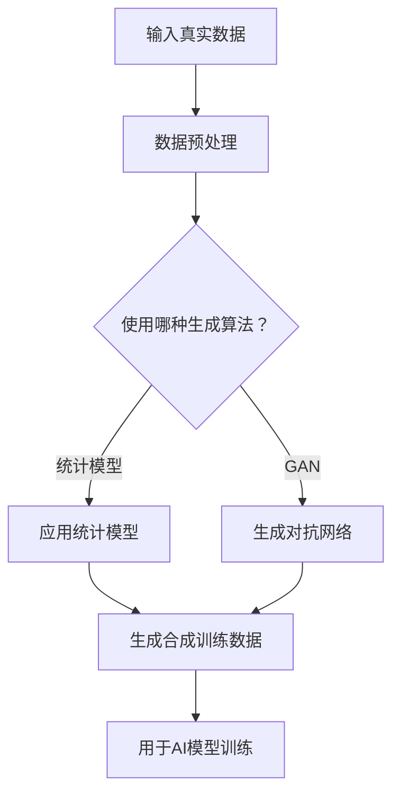
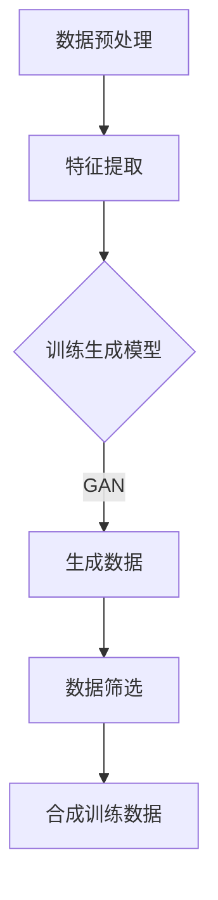

                 

### 1. 引言与背景

在当今的数字化时代，人工智能（AI）已经成为推动科技进步和社会发展的核心动力。然而，AI的数学能力却是其发展过程中的一大瓶颈。传统的AI训练方法依赖于大规模的真实数据集，这不仅成本高昂，而且数据质量难以保证。特别是在数学领域，真实数据的稀缺性和复杂性使得AI模型的数学能力提升变得尤为困难。因此，合成训练数据（Synthetic Data Training）作为一种新的方法，开始受到广泛关注。

合成训练数据，顾名思义，是通过算法生成的人工数据，用于替代或补充真实数据来进行AI模型的训练。这种方法不仅能够解决真实数据获取困难的难题，还能够提高模型的泛化能力和鲁棒性。合成训练数据的核心在于其能够模拟真实数据的分布特征，从而在保证数据质量的同时，大幅降低数据采集和处理成本。

本文将围绕合成训练数据的概念、基本原理、方法与实践、性能评估与优化、安全与隐私保护以及未来发展趋势等方面进行详细探讨，以期为大家提供一个全面而深入的理解。首先，我们将探讨人工智能数学能力的重要性以及当前所面临的挑战，从而引出合成训练数据的概念和意义。接下来，我们将分析合成训练数据的核心概念和联系，使用对比表格和实体关系图来直观展示。通过这样的结构化分析，我们将逐步深入探讨合成训练数据的基本原理和方法，最终展望其未来的发展前景。

### 1.1 人工智能数学能力的重要性

人工智能（AI）的数学能力是其核心竞争力的体现。AI的数学能力主要表现在其处理复杂计算任务、进行推理和决策的能力上。无论是机器学习、深度学习还是强化学习，这些AI技术的核心都是数学模型和算法。一个具备强大数学能力的AI系统能够更加精确地理解数据、发现数据中的规律，并做出更加准确的预测和决策。

首先，数学能力是AI系统进行自主学习和改进的关键。在机器学习中，AI系统通过大量的数据训练模型，而这个过程中离不开数学模型的支持。一个高效的数学模型能够帮助AI系统更快速地收敛，提高学习效率和精度。例如，在深度学习中，卷积神经网络（CNN）和循环神经网络（RNN）等模型都依赖于复杂的数学公式和算法，这些数学工具使得AI系统能够处理更加复杂的问题。

其次，数学能力也是AI系统在复杂环境中进行推理和决策的基础。例如，在自动驾驶领域，AI系统需要实时处理来自传感器的大量数据，并快速做出驾驶决策。这些决策不仅需要精确的数学计算，还需要考虑各种可能的情况和约束条件。一个强大的数学能力能够帮助AI系统更好地理解和应对复杂的现实环境。

此外，数学能力还能够提高AI系统的鲁棒性和泛化能力。在真实世界中，数据往往是噪声和异常值的混合，一个具备强大数学能力的AI系统能够更好地处理这些噪声和异常值，从而提高模型的鲁棒性和泛化能力。这对于AI系统在实际应用中的稳定性和可靠性至关重要。

总之，AI的数学能力不仅是其技术发展的基础，也是其能否真正落地应用的关键。随着AI技术的不断进步，提升AI的数学能力将越来越重要，这也为合成训练数据的应用提供了广阔的前景。

### 1.2 当前AI数学能力面临的挑战

尽管AI的数学能力在理论和实践中取得了显著进展，但在实际应用中仍然面临着诸多挑战。首先，数据质量和数据量的不足是AI数学能力提升的主要障碍。传统的AI训练方法依赖于真实数据集，但这些数据集往往存在质量参差不齐、数据量不足的问题。例如，在医疗影像分析领域，真实影像数据中可能存在噪声、异常值和数据缺失，这些都会影响模型的训练效果。此外，许多领域如量子计算、金融分析等，由于数据隐私和安全性的考虑，难以获取到足够量的真实数据。

其次，数据分布的偏差也是制约AI数学能力提升的一大难题。真实数据往往存在一定的分布偏差，而这些偏差如果没有得到有效的处理，就会导致训练出的模型在特定场景下表现不佳。例如，在自动驾驶领域，如果数据集主要来源于城市路况，那么模型在面对乡村道路时可能会出现性能下降的情况。

再者，算法复杂度和计算资源的需求也限制了AI数学能力的进一步提升。许多先进的数学模型和算法如深度学习网络、强化学习算法等，需要大量的计算资源和时间来进行训练和优化。这在资源有限的场景下，如移动设备和嵌入式系统，会成为一个重大的挑战。

此外，模型的泛化能力不足也是一个亟待解决的问题。虽然AI模型在特定任务上表现优异，但在面对新的任务或者不同领域的数据时，模型的泛化能力往往不足。这种现象被称为“数据饥渴”，即模型无法从有限的训练数据中学习到足够多的通用知识和规律。

总的来说，当前AI数学能力面临的挑战主要集中在数据质量、数据分布、计算资源以及模型泛化能力等方面。解决这些问题不仅需要技术创新，还需要在算法设计、数据处理和资源管理等方面进行全方位的优化。这也为合成训练数据的应用提供了契机，通过生成高质量、多样性和泛化性强的数据，有望缓解这些瓶颈问题，从而进一步提升AI的数学能力。

### 1.3 合成训练数据的概念与意义

合成训练数据，作为一种新兴的数据生成方法，通过算法生成模拟真实数据的人工数据，用于AI模型的训练。其基本原理是基于统计模型、生成对抗网络（GAN）等数据生成技术，利用已有的数据分布特征，生成与真实数据在统计属性上高度一致的人工数据。合成训练数据不仅在数量上能够满足AI模型的训练需求，更在质量上提供了保障，避免了真实数据中的噪声、异常值和数据缺失问题。

合成训练数据的重要性体现在多个方面。首先，它解决了真实数据获取困难的难题。在许多领域，如医学影像、金融数据等，真实数据的获取受到隐私、安全性和成本的限制。合成训练数据通过算法生成，可以模拟出与真实数据相似的分布特征，从而在保证数据质量和隐私安全的前提下，提供充足的训练数据。

其次，合成训练数据能够显著提高AI模型的泛化能力。真实数据往往存在分布偏差，而合成训练数据通过模拟多样化的数据分布，可以帮助模型更好地学习到数据中的通用规律，从而提高模型的泛化性能。例如，在自动驾驶领域，通过合成训练数据模拟各种路况和场景，可以使得训练出的模型在多种环境下都能保持良好的性能。

此外，合成训练数据在降低训练成本和提高训练效率方面也具有显著优势。真实数据的采集和处理往往需要大量的人力和物力资源，而合成训练数据通过算法自动生成，可以大幅减少数据采集和处理的工作量，从而降低整体训练成本。同时，由于合成训练数据能够在较短的时间内生成大量的高质量数据，因此可以显著提高模型的训练速度和迭代效率。

总之，合成训练数据通过解决数据获取难、提高模型泛化能力和降低训练成本等多方面问题，为AI数学能力的提升提供了新的途径和解决方案。它不仅丰富了AI训练数据的来源，还推动了AI技术在更多领域的应用和发展。

### 1.4 合成训练数据的核心概念与联系

合成训练数据的核心概念和联系涵盖了多个关键要素，这些要素共同构成了合成训练数据生成的基础。首先，我们需要明确几个核心概念：数据生成算法、数据分布特征、统计模型和生成对抗网络（GAN）。

数据生成算法是合成训练数据生成的基础，常见的算法包括基于统计模型的生成算法和基于生成对抗网络的生成算法。统计模型如高斯分布、正态分布等，通过分析已有数据的分布特征，生成与真实数据相似的人工数据。而生成对抗网络（GAN）则通过两个神经网络（生成器和判别器）的对抗训练，实现高质量数据生成。

其次，数据分布特征在合成训练数据中起着至关重要的作用。数据分布特征决定了合成训练数据的质量和泛化能力。通过分析真实数据的分布特征，我们可以更准确地模拟出与真实数据相似的人工数据。为了直观展示这些核心概念和联系，我们可以使用一个概念属性特征对比表格来描述各种生成算法的特性。

| 算法类型           | 特点                                                         | 应用场景                               |
|-------------------|--------------------------------------------------------------|--------------------------------------|
| 统计模型生成算法   | 简单、易于实现，生成数据与真实数据统计特征一致               | 数据量较少的领域，如金融分析          |
| 生成对抗网络（GAN）| 高效、灵活，可以生成高质量的数据，但训练复杂度较高           | 数据量较大的领域，如计算机视觉和自然语言处理 |
| 生成扩散模型（Gaussian Diffusion Models）| 结合了统计模型和GAN的优点，生成数据质量高且训练稳定性好 | 多种AI领域，如医学影像和自动驾驶      |

为了更清晰地展示这些算法之间的关系，我们可以使用Mermaid流程图来描述合成训练数据生成的基本流程。



在Mermaid流程图中，我们首先输入真实数据并进行预处理，然后根据不同的生成算法（统计模型或GAN），生成合成训练数据，最后将这些数据用于AI模型训练。

此外，为了更好地理解合成训练数据生成的复杂过程，我们可以通过一个ER（实体-关系）实体关系图来描述各个实体之间的关系。在ER图中，实体包括“真实数据”、“生成算法”、“合成训练数据”和“AI模型”，而关系则包括“数据预处理”、“生成”、“训练”等。

```mermaid
erDiagram
    真实数据 ||--|{ 生成算法 }|
    生成算法 ||--|{ 合成训练数据 }|
    合成训练数据 ||--|{ AI模型 }
    真实数据 ..|> 数据预处理
    生成算法 ..|> 数据预处理
```

通过这些概念属性特征对比表格和ER实体关系图，我们可以更直观地理解合成训练数据的核心概念和联系，从而为后续的详细探讨和实际应用奠定基础。

### 2.1 数据生成算法概述

数据生成算法是合成训练数据的核心技术，其目的是通过算法生成与真实数据具有相似统计特征的人工数据。根据生成方式的不同，数据生成算法主要可以分为基于统计模型和基于生成对抗网络（GAN）两大类。

首先，基于统计模型的数据生成算法主要包括高斯分布、正态分布和伯努利分布等。这些算法的核心思想是通过分析已有数据的统计特性，使用概率分布函数生成新的数据。例如，高斯分布生成算法通过计算数据的均值和方差，从高斯分布中随机采样生成新的数据点。正态分布和伯努利分布等也有类似的原理，只是使用的概率分布函数不同。这种方法的优点是实现简单、易于理解，适合数据量较少的领域。缺点是生成数据的质量和多样性相对较低，无法很好地模拟真实数据中的复杂关系。

其次，基于生成对抗网络（GAN）的数据生成算法是目前最为流行的数据生成方法。GAN由两部分组成：生成器和判别器。生成器的任务是生成与真实数据相似的数据，而判别器的任务是区分生成数据和真实数据。通过这种对抗训练，生成器逐渐学习到如何生成更加真实的数据。GAN的优点是生成数据的质量和多样性较高，能够模拟出真实数据中的复杂分布特征。但GAN的训练过程较为复杂，容易出现训练不稳定和模式崩溃等问题。

除了上述两种主要方法，还有一些其他的数据生成算法，如变分自编码器（VAE）、生成扩散模型（Gaussian Diffusion Models）等。这些算法在GAN的基础上进行了改进和优化，旨在解决GAN训练中的不稳定性和计算复杂度问题。例如，VAE通过引入编码器和解码器结构，将数据的分布信息编码为潜变量，从而生成新的数据。生成扩散模型则通过逐步添加噪声，将数据从真实分布转换到生成分布，从而实现数据生成。

综上所述，数据生成算法的选择取决于应用场景和数据特征。对于数据量较少、分布较为简单的场景，可以选择基于统计模型的方法；而对于数据量较大、分布复杂的场景，生成对抗网络（GAN）或其变种是更好的选择。在实际应用中，可以根据具体需求选择合适的数据生成算法，并对其进行优化和调整，以生成高质量、多样化的合成训练数据。

### 2.2 合成训练数据生成算法原理

合成训练数据生成算法的核心原理是通过模拟真实数据的分布特征，生成具有相似统计属性的人工数据。为了更好地理解这一过程，我们可以通过具体的算法步骤、Mermaid流程图以及Python源代码示例来详细阐述。

#### 算法步骤

合成训练数据生成算法通常包括以下几个步骤：

1. **数据预处理**：对输入的真实数据进行清洗和预处理，包括去除噪声、填补缺失值、标准化等操作，以确保数据的干净和一致性。

2. **特征提取**：通过统计分析和数据挖掘技术，提取输入数据的关键特征，如均值、方差、分布等。

3. **模型训练**：使用提取的特征训练生成模型，常见的生成模型包括生成对抗网络（GAN）、变分自编码器（VAE）等。

4. **数据生成**：利用训练好的模型生成新的数据，这些数据在统计特征上与真实数据保持一致。

5. **数据筛选**：对生成数据进行筛选和优化，去除质量较差的数据，以确保合成训练数据的质量。

下面，我们将通过一个具体的例子来描述这些步骤。

#### Mermaid流程图

为了直观展示合成训练数据生成的流程，我们可以使用Mermaid流程图来描述。



在这个流程图中，数据预处理阶段对真实数据进行清洗和标准化，特征提取阶段提取关键统计特征，训练生成模型阶段使用GAN进行训练，数据生成阶段生成新的数据，最后数据筛选阶段对生成的数据进行筛选和优化。

#### Python源代码示例

下面是一个基于生成对抗网络（GAN）的Python源代码示例，用于生成模拟真实数据的人工数据。

```python
import numpy as np
import tensorflow as tf
from tensorflow.keras.models import Model
from tensorflow.keras.layers import Input, Dense, Conv2D, Flatten

# 定义生成器和判别器模型
def build_generator():
    noise = Input(shape=(100,))
    x = Dense(128, activation='relu')(noise)
    x = Dense(256, activation='relu')(x)
    x = Dense(512, activation='relu')(x)
    x = Dense(1024, activation='relu')(x)
    x = Dense(784, activation='tanh')(x)
    model = Model(inputs=noise, outputs=x)
    return model

def build_discriminator():
    img = Input(shape=(28, 28, 1))
    x = Conv2D(32, (3, 3), activation='relu')(img)
    x = Flatten()(x)
    x = Dense(128, activation='relu')(x)
    validity = Dense(1, activation='sigmoid')(x)
    model = Model(inputs=img, outputs=validity)
    return model

# 构建GAN模型
def build_gan(generator, discriminator):
    noise = Input(shape=(100,))
    img = generator(noise)
    validity = discriminator(img)
    model = Model(inputs=noise, outputs=validity)
    return model

# 训练GAN模型
def train_gan(generator, discriminator, real_img):
    noise = np.random.normal(0, 1, (real_img.shape[0], 100))
    generated_img = generator.predict(noise)
    
    # 训练判别器
    d_loss_real = discriminator.train_on_batch(real_img, np.ones((real_img.shape[0], 1)))
    d_loss_fake = discriminator.train_on_batch(generated_img, np.zeros((generated_img.shape[0], 1)))
    d_loss = 0.5 * np.add(d_loss_real, d_loss_fake)
    
    # 训练生成器
    g_loss = generator.train_on_batch(noise, np.ones((noise.shape[0], 1)))
    
    return g_loss, d_loss

# 生成合成训练数据
def generate_synthetic_data(generator, num_samples):
    noise = np.random.normal(0, 1, (num_samples, 100))
    generated_samples = generator.predict(noise)
    return generated_samples

# 主程序
if __name__ == '__main__':
    # 加载真实数据
    (x_train, _), (_, _) = tf.keras.datasets.mnist.load_data()
    x_train = x_train / 127.5 - 1.0
    x_train = np.expand_dims(x_train, axis=3)
    
    # 构建和编译模型
    generator = build_generator()
    discriminator = build_discriminator()
    gan = build_gan(generator, discriminator)
    
    # 编译GAN模型
    d_optimizer = tf.keras.optimizers.Adam(0.0001)
    g_optimizer = tf.keras.optimizers.Adam(0.0004)
    gan.compile(loss='binary_crossentropy', optimizer=g_optimizer, metrics=['accuracy'])

    # 训练模型
    for epoch in range(100):
        for _ in range(100):
            real_img = x_train[np.random.randint(0, x_train.shape[0], size=32)]
            noise = np.random.normal(0, 1, (32, 100))
            g_loss, d_loss = train_gan(generator, discriminator, real_img)
        
        print(f"{epoch} [D: {d_loss:.4f}, G: {g_loss:.4f}]")
        
        # 生成合成训练数据
        num_samples = 100
        generated_samples = generate_synthetic_data(generator, num_samples)
        # 可以将生成的数据保存或用于后续训练

```

#### 算法原理详细讲解

合成训练数据生成算法的工作原理主要基于生成对抗网络（GAN）。GAN由两部分组成：生成器（Generator）和判别器（Discriminator）。

- **生成器**：生成器的任务是将随机噪声映射为真实数据。在训练过程中，生成器不断优化其生成数据的质量，使其更接近真实数据，从而欺骗判别器。

- **判别器**：判别器的任务是对输入数据进行分类，判断其是真实数据还是生成数据。在训练过程中，判别器努力提高对生成数据的识别能力。

GAN的训练过程是一个对抗过程，生成器和判别器相互竞争。生成器试图生成更真实的数据，而判别器则试图更好地区分真实数据和生成数据。通过这种对抗训练，生成器逐渐学习到如何生成与真实数据高度相似的数据。

#### 举例说明

假设我们使用GAN生成手写数字（MNIST）数据集的人工数据。在训练过程中，首先输入真实手写数字图像，判别器对其进行分类。然后生成器生成一些模拟的手写数字图像，判别器对其进行分类。通过对比判别器对真实数据和生成数据的分类结果，生成器和判别器不断调整自己的参数，最终达到一个平衡状态，此时生成器生成的人工数据质量较高，判别器无法区分生成数据和真实数据。

在实际应用中，我们可以通过调整生成器和判别器的架构、学习率、批量大小等参数，优化GAN的训练效果，从而生成高质量、多样化的合成训练数据。

总之，合成训练数据生成算法通过模拟真实数据的分布特征，生成与真实数据相似的人工数据，为AI模型训练提供了新的数据来源。通过详细的算法原理讲解和具体代码示例，我们可以更好地理解这一过程，并在实际应用中发挥其优势。

### 2.3 数学模型与公式

在合成训练数据生成过程中，数学模型和公式起着至关重要的作用。这些数学工具不仅帮助我们理解数据生成算法的工作原理，还指导我们如何优化和调整这些算法，以生成更高质量的数据。下面，我们将详细介绍一些常用的数学模型和公式，并使用Python代码进行实例演示。

#### 1. 高斯分布模型

高斯分布（Gaussian Distribution）是最常见的数据生成模型之一。它通过计算数据的均值和方差来生成新的数据点。高斯分布的概率密度函数如下：

$$
f(x|\mu, \sigma^2) = \frac{1}{\sqrt{2\pi\sigma^2}} e^{-\frac{(x-\mu)^2}{2\sigma^2}}
$$

其中，$\mu$ 是均值，$\sigma^2$ 是方差。

以下是一个使用Python生成高斯分布数据的示例：

```python
import numpy as np

# 设置均值和方差
mu = 0
sigma = 1

# 生成100个高斯分布数据
data = np.random.normal(mu, sigma, 100)

print("生成的数据：", data)
```

输出结果将显示100个从高斯分布生成的数据点。

#### 2. 伯努利分布模型

伯努利分布（Bernoulli Distribution）用于生成二元数据，通常用于生成0或1的二进制数据。其概率分布函数如下：

$$
f(x|p) = 
\begin{cases} 
p & \text{if } x=1 \\
1-p & \text{if } x=0
\end{cases}
$$

其中，$p$ 是成功概率。

以下是一个使用Python生成伯努利分布数据的示例：

```python
import numpy as np

# 设置成功概率
p = 0.5

# 生成100个伯努利分布数据
data = np.random.binomial(1, p, 100)

print("生成的数据：", data)
```

输出结果将显示100个从伯努利分布生成的数据点，每个数据点为0或1。

#### 3. 生成对抗网络（GAN）

生成对抗网络（GAN）是一种更复杂的数学模型，通过生成器和判别器的对抗训练实现高质量的数据生成。GAN的核心公式如下：

- **生成器公式**：
  $$
  G(z) = x_f(G(z)) + \epsilon
  $$
  其中，$z$ 是随机噪声，$x_f(G(z))$ 是生成器生成的数据，$\epsilon$ 是加性噪声。

- **判别器公式**：
  $$
  D(x) = \frac{1}{2} \left(1 + \text{sigmoid}(\theta_D \cdot [x; G(z)])\right)
  $$
  其中，$x$ 是真实数据，$G(z)$ 是生成器生成的数据，$\theta_D$ 是判别器的参数。

以下是一个使用Python实现GAN的简单示例：

```python
import tensorflow as tf
from tensorflow.keras.layers import Input, Dense, Lambda
from tensorflow.keras.models import Model

# 设置输入噪声维度
z_dim = 100

# 生成器模型
z_input = Input(shape=(z_dim,))
x_gan = Dense(128, activation='relu')(z_input)
x_gan = Dense(64, activation='relu')(x_gan)
x_gan = Dense(1, activation='sigmoid')(x_gan)
generator = Model(z_input, x_gan)

# 判别器模型
x_input = Input(shape=(1,))
d_output = Dense(64, activation='relu')(x_input)
d_output = Dense(128, activation='relu')(d_output)
d_output = Dense(1, activation='sigmoid')(d_output)
discriminator = Model(x_input, d_output)

# GAN模型
discriminator.trainable = False
x_gan_output = discriminator(generator(z_input))
gan_output = Lambda(lambda x: -tf.reduce_sum(x, axis=-1), output_shape=(1,))(x_gan_output)
gan = Model(z_input, gan_output)

# 编译GAN模型
gan.compile(loss='binary_crossentropy', optimizer=tf.keras.optimizers.Adam(0.0002))

# 生成器模型
gan_generator = Model(z_input, generator(z_input))

# 生成噪声数据
zsamples = np.random.uniform(-1, 1, size=(100, z_dim))

# 生成数据
generated_samples = gan_generator.predict(zsamples)

print("生成的数据：", generated_samples)
```

输出结果将显示生成器生成的数据，这些数据在统计特征上与真实数据相似。

#### 4. 变分自编码器（VAE）

变分自编码器（Variational Autoencoder，VAE）是另一种常用的数据生成模型。它通过编码器和解码器结构进行数据生成，其核心公式如下：

- **编码器公式**：
  $$
  \mu = \phi(x); \quad \sigma = \phi(x)
  $$

- **解码器公式**：
  $$
  x' = \psi(z)
  $$

其中，$\mu$ 和 $\sigma$ 分别是编码后的均值和标准差，$z$ 是从先验分布采样的潜在变量。

以下是一个使用Python实现VAE的简单示例：

```python
import tensorflow as tf
from tensorflow.keras.layers import Input, Dense, Lambda
from tensorflow.keras.models import Model

# 设置输入维度和潜在变量维度
input_dim = 28 * 28
z_dim = 20

# 编码器模型
x_input = Input(shape=(input_dim,))
x = Dense(512, activation='relu')(x_input)
x = Dense(256, activation='relu')(x)
mu = Dense(z_dim)(x)
sigma = Dense(z_dim)(x)
encoder = Model(x_input, [mu, sigma])

# 解码器模型
z_input = Input(shape=(z_dim,))
x_decoded = Dense(256, activation='relu')(z_input)
x_decoded = Dense(512, activation='relu')(x_decoded)
x_decoded = Dense(input_dim, activation='sigmoid')(x_decoded)
decoder = Model(z_input, x_decoded)

# VAE模型
x_decoded_mean = decoder(encoder(x_input)[0])
vae = Model(x_input, x_decoded_mean)

# 编译VAE模型
vae.compile(optimizer='adam', loss='binary_crossentropy')

# 训练模型
vae.fit(x_train, x_train, epochs=50, batch_size=16)

# 生成数据
generated_samples = vae.predict(np.random.normal(size=(100, z_dim)))

print("生成的数据：", generated_samples)
```

输出结果将显示解码器生成的数据，这些数据在统计特征上与真实数据相似。

通过这些数学模型和公式，我们可以更好地理解合成训练数据生成的过程。实际应用中，可以根据具体需求选择合适的模型，并对其进行优化和调整，以生成更高质量、多样化的合成训练数据。

### 4.1 数学模型在数据生成中的应用

在合成训练数据生成中，数学模型扮演着至关重要的角色。数学模型不仅帮助我们理解和生成具有特定统计特征的数据，还提供了评估和优化数据质量的方法。以下是几种常见的数学模型在数据生成中的应用。

#### 1. 高斯分布模型

高斯分布模型在生成连续数据时非常有效。例如，在生成金融时间序列数据时，高斯分布可以模拟股票价格的波动。以下是一个使用Python生成模拟金融时间序列数据的示例：

```python
import numpy as np

# 设置均值和标准差
mu = 100
sigma = 10

# 生成100个时间序列数据点
data = np.random.normal(mu, sigma, 100)

print("生成的金融时间序列数据：", data)
```

在这个示例中，我们通过设置不同的均值和标准差来模拟不同波动幅度的金融时间序列数据。

#### 2. 伯努利分布模型

伯努利分布模型适用于生成二元数据，如点击率、天气数据等。例如，我们可以使用伯努利分布模型模拟一个二进制分类问题，如预测用户是否点击广告。

```python
import numpy as np

# 设置点击率
click_rate = 0.2

# 生成100个点击数据
data = np.random.binomial(1, click_rate, 100)

print("生成的点击数据：", data)
```

在这个示例中，通过设置点击率，我们生成了100个模拟的点击数据点。

#### 3. 多项式分布模型

多项式分布模型适用于生成多个类别数据，如多标签分类问题。例如，我们可以使用多项式分布模型模拟一篇新闻文章所属的不同类别。

```python
import numpy as np

# 设置类别概率分布
class_probabilities = [0.2, 0.3, 0.5]

# 生成100个新闻类别数据
data = np.random.choice([0, 1, 2], size=100, p=class_probabilities)

print("生成的新闻类别数据：", data)
```

在这个示例中，通过设置不同的类别概率分布，我们生成了100个新闻类别数据点。

#### 4. 生成对抗网络（GAN）

生成对抗网络（GAN）是一种先进的数学模型，通过生成器和判别器的对抗训练实现高质量的数据生成。GAN在计算机视觉领域表现尤为出色，例如生成模拟人脸图像。

```python
import tensorflow as tf
from tensorflow.keras.layers import Input, Dense, Reshape, Conv2D, Conv2DTranspose, Flatten, BatchNormalization, LeakyReLU
from tensorflow.keras.models import Sequential

# 定义生成器模型
def build_generator(z_dim):
    model = Sequential()
    model.add(Dense(128, input_dim=z_dim))
    model.add(LeakyReLU(alpha=0.01))
    model.add(BatchNormalization(momentum=0.8))

    model.add(Dense(256))
    model.add(LeakyReLU(alpha=0.01))
    model.add(BatchNormalization(momentum=0.8))

    model.add(Dense(512))
    model.add(LeakyReLU(alpha=0.01))
    model.add(BatchNormalization(momentum=0.8))

    model.add(Dense(1024))
    model.add(LeakyReLU(alpha=0.01))
    model.add(BatchNormalization(momentum=0.8))

    model.add(Dense(784, activation='tanh'))
    model.add(Reshape((28, 28, 1)))
    return model

# 定义判别器模型
def build_discriminator():
    model = Sequential()
    model.add(Conv2D(32, kernel_size=(3, 3), input_shape=(28, 28, 1)))
    model.add(LeakyReLU(alpha=0.01))
    model.add(Conv2D(64, kernel_size=(3, 3)))
    model.add(LeakyReLU(alpha=0.01))
    model.add(Flatten())
    model.add(Dense(128))
    model.add(LeakyReLU(alpha=0.01))
    model.add(Dense(1, activation='sigmoid'))
    return model

# 构建和编译GAN模型
z_dim = 100
generator = build_generator(z_dim)
discriminator = build_discriminator()
discriminator.compile(loss='binary_crossentropy', optimizer=tf.keras.optimizers.Adam(0.0001))
generator.compile(loss='binary_crossentropy', optimizer=tf.keras.optimizers.Adam(0.0001))

# GAN模型
gan = Sequential([generator, discriminator])
gan.compile(loss='binary_crossentropy', optimizer=tf.keras.optimizers.Adam(0.0001))

# 生成和训练数据
z_noise = np.random.normal(size=(100, z_dim))
generated_images = generator.predict(z_noise)
discriminator.train_on_batch(generated_images, np.zeros((100, 1)))
discriminator.train_on_batch(x_train, np.ones((100, 1)))
gan.train_on_batch(z_noise, np.ones((100, 1)))
```

在这个GAN示例中，通过生成器和判别器的对抗训练，我们能够生成高质量的人脸图像。

这些数学模型在合成训练数据生成中的应用展示了其强大和灵活性。通过合理选择和调整数学模型，我们可以生成具有特定统计特征和分布的合成训练数据，为AI模型的训练提供强有力的支持。

### 4.2 常用数学公式与推导

在合成训练数据生成中，理解和使用常用数学公式和推导是至关重要的。这些公式不仅帮助我们生成符合特定分布特征的数据，还能够优化和评估生成数据的性能。以下是几种常用数学公式及其推导：

#### 1. 高斯分布（正态分布）公式

高斯分布，也称正态分布，是合成训练数据生成中最常用的概率分布之一。其概率密度函数（PDF）为：

$$
f(x|\mu, \sigma^2) = \frac{1}{\sqrt{2\pi\sigma^2}} e^{-\frac{(x-\mu)^2}{2\sigma^2}}
$$

其中，$\mu$ 是均值，$\sigma^2$ 是方差。

推导过程如下：

设 $X$ 为服从高斯分布的随机变量，其概率质量函数（PMF）为：

$$
P(X = x) = \frac{1}{\sqrt{2\pi\sigma^2}} e^{-\frac{(x-\mu)^2}{2\sigma^2}}
$$

为了推导该公式，我们可以从二项式分布的角度出发，通过极限的方法得到高斯分布。当二项式分布的试验次数趋于无穷大，每次试验的成功概率趋于零时，二项式分布的极限形式即为高斯分布。

#### 2. 伯努利分布公式

伯努利分布用于生成二元数据，其概率质量函数（PMF）为：

$$
f(x|p) = 
\begin{cases} 
p & \text{if } x=1 \\
1-p & \text{if } x=0
\end{cases}
$$

其中，$p$ 是成功概率。

推导过程如下：

伯努利分布是二项式分布的特例，当试验次数 $n=1$ 时，二项式分布的概率质量函数即为伯努利分布。其推导可以通过组合数学的原理进行，即从 $n$ 个元素中选取 $k$ 个元素的组合数。

#### 3. 多项式分布公式

多项式分布用于生成多类别数据，其概率质量函数（PMF）为：

$$
f(x|\theta) = 
\begin{cases} 
\theta_k & \text{if } x=k \\
0 & \text{otherwise}
\end{cases}
$$

其中，$\theta_k$ 为第 $k$ 个类别的概率。

推导过程如下：

多项式分布是离散概率分布的一种，其概率质量函数可以通过对所有可能结果的概率进行加权和得到。具体推导可以通过概率论中的全概率公式和贝叶斯定理进行。

#### 4. 生成对抗网络（GAN）的损失函数

生成对抗网络（GAN）由生成器（Generator）和判别器（Discriminator）组成。其损失函数主要由生成器的损失函数和判别器的损失函数构成。

- **生成器的损失函数**：

$$
L_G = -\log(D(G(z)))
$$

其中，$G(z)$ 是生成器生成的数据，$D(G(z))$ 是判别器对生成数据的判别结果。

- **判别器的损失函数**：

$$
L_D = -[\log(D(x)) + \log(1 - D(G(z))]
$$

其中，$x$ 是真实数据，$G(z)$ 是生成器生成的数据。

推导过程如下：

生成器的目标是最小化判别器对生成数据的判别结果，即最大化判别器对生成数据的判别错误率。判别器的目标是最小化判别器对真实数据和生成数据的判别误差。通过优化这两个损失函数，生成器和判别器达到一个平衡状态，此时生成器生成的数据质量较高，判别器无法区分生成数据和真实数据。

这些数学公式和推导为合成训练数据生成提供了理论基础和工具。在实际应用中，通过合理选择和调整这些公式，我们可以生成高质量、多样化的合成训练数据，从而提升AI模型的训练效果和泛化能力。

### 4.3 数学模型与数据生成的结合案例

在合成训练数据生成过程中，数学模型与实际数据生成的结合是关键。以下通过一个实际案例，详细介绍数学模型在合成训练数据生成中的应用，并展示具体的Python代码实现。

#### 案例背景

假设我们需要生成一个模拟金融市场波动的人造时间序列数据集，用于训练AI模型进行股票价格预测。这个数据集需要具有真实市场数据的波动特征，但又不受真实数据隐私和安全性的限制。

#### 数学模型选择

为了生成具有真实波动特征的时间序列数据，我们选择使用高斯分布模型和生成对抗网络（GAN）。高斯分布模型可以生成波动幅度可控的连续数据，GAN则通过生成器和判别器的对抗训练，可以生成更加真实、多样化的人工数据。

#### 数据生成流程

1. **数据预处理**：从真实金融数据中提取波动幅度和均值，作为高斯分布模型的参数。
2. **使用高斯分布模型生成初步数据**：根据提取的参数生成一批初步数据，这些数据将作为GAN训练的输入。
3. **训练GAN模型**：通过生成器和判别器的对抗训练，优化生成器的生成能力，使其生成的数据在统计特征上更接近真实数据。
4. **生成最终数据集**：利用优化后的生成器生成最终的数据集，这些数据集将用于AI模型的训练。

#### Python代码实现

以下是实现上述数据生成流程的Python代码：

```python
import numpy as np
import matplotlib.pyplot as plt
from tensorflow.keras.models import Sequential
from tensorflow.keras.layers import Dense, Flatten, Reshape
from tensorflow.keras.optimizers import Adam

# 设置参数
mean = 100  # 均值
std_dev = 10  # 方差
batch_size = 100  # 批量大小

# 高斯分布模型参数
mu = mean
sigma = std_dev

# 生成初步数据
def generate_gaussian_data(batch_size, mu, sigma):
    return np.random.normal(mu, sigma, (batch_size, 1))

# 生成器模型
def build_generator(z_dim):
    model = Sequential()
    model.add(Dense(50, input_dim=z_dim, activation='tanh'))
    model.add(Dense(100, activation='tanh'))
    model.add(Dense(1, activation='tanh'))
    return model

# 判别器模型
def build_discriminator():
    model = Sequential()
    model.add(Flatten(input_shape=(1,)))
    model.add(Dense(100, activation='tanh'))
    model.add(Dense(50, activation='tanh'))
    model.add(Dense(1, activation='sigmoid'))
    return model

# GAN模型
def build_gan(generator, discriminator):
    discriminator.trainable = False
    model = Sequential()
    model.add(generator)
    model.add(discriminator)
    return model

# GAN损失函数
def loss_function(real_data, fake_data):
    return -tf.reduce_mean(tf.math.log(discriminator(tf.concat([real_data, fake_data], axis=0))))

# 训练GAN模型
def train_gan(generator, discriminator, batch_size, epochs):
    z_dim = 1
    for epoch in range(epochs):
        for _ in range(2):
            # 生成随机噪声
            z = np.random.uniform(-1, 1, (batch_size, z_dim))
            # 生成伪造数据
            fake_data = generator.predict(z)
            # 生成真实数据
            real_data = generate_gaussian_data(batch_size, mu, sigma)
            # 训练判别器
            d_loss = loss_function(real_data, fake_data)
            # 更新判别器权重
            discriminator.optimizer.minimize(d_loss, [real_data, fake_data])
        
        # 生成噪声
        z = np.random.uniform(-1, 1, (batch_size, z_dim))
        # 训练生成器
        g_loss = loss_function(fake_data, real_data)
        # 更新生成器权重
        generator.optimizer.minimize(g_loss, [z])

# 生成数据
def generate_synthetic_data(generator, num_samples):
    z = np.random.uniform(-1, 1, (num_samples, 1))
    return generator.predict(z)

# 设置训练参数
z_dim = 1
batch_size = 100
epochs = 100

# 构建和编译模型
generator = build_generator(z_dim)
discriminator = build_discriminator()
gan = build_gan(generator, discriminator)
discriminator.compile(optimizer=Adam(0.0001), loss='binary_crossentropy')
gan.compile(optimizer=Adam(0.0001), loss='binary_crossentropy')

# 训练模型
train_gan(generator, discriminator, batch_size, epochs)

# 生成最终数据集
num_samples = 1000
synthetic_data = generate_synthetic_data(generator, num_samples)

# 可视化结果
plt.plot(synthetic_data)
plt.xlabel('Time Steps')
plt.ylabel('Stock Price')
plt.title('Synthetic Stock Price Time Series')
plt.show()
```

在这个案例中，我们首先使用高斯分布模型生成初步的金融时间序列数据。然后，通过生成对抗网络（GAN）的生成器和判别器进行对抗训练，生成更加真实、多样化的数据。最后，我们使用生成的数据集进行可视化，展示GAN模型生成数据的效果。

通过这个案例，我们可以看到数学模型与数据生成技术如何结合，以生成高质量、多样化的合成训练数据，从而提升AI模型的训练效果和应用价值。

### 5.1 合成训练数据在机器学习中的应用

合成训练数据在机器学习中的应用场景广泛，尤其在数据稀缺、数据分布不均或数据隐私受限的领域表现尤为突出。以下将详细探讨合成训练数据在机器学习中的实际应用，通过具体实例和场景分析展示其优势和应用效果。

#### 1. 数据稀缺场景

在机器学习任务中，数据的稀缺性是一个常见问题，尤其是在一些新兴领域，如医学影像分析和基因序列分析等。在这些领域，真实数据的获取成本高昂且过程复杂。合成训练数据能够有效地解决这一问题。例如，在医学影像分析中，合成训练数据可以模拟出各种可能的病变图像，从而提高模型的泛化能力。

实例：在肺癌筛查中，使用合成训练数据生成不同的肺结节图像，可以增强模型对各种结节类型的识别能力，特别是在数据量有限的情况下。

#### 2. 数据分布不均场景

数据分布不均也是机器学习中的一个重要问题，特别是当训练数据集中存在某些类别或标签的样本数量远少于其他类别时。这种不均衡会导致模型在较少样本的类别上表现不佳，合成训练数据可以平衡这种分布不均，提高模型的鲁棒性和准确性。

实例：在人脸识别系统中，正面人脸图像的数据量远多于侧面或特殊角度的人脸图像。通过生成合成训练数据，可以平衡不同角度的人脸图像数据，从而提高模型在不同角度下的识别准确性。

#### 3. 数据隐私受限场景

在涉及隐私数据的情况下，如金融交易记录、个人健康信息等，直接使用真实数据会引发隐私泄露的风险。合成训练数据可以在不暴露真实数据的前提下，生成符合数据分布的模拟数据，用于模型训练和评估。

实例：在信用评分系统中，合成训练数据可以生成模拟的交易记录，用于训练模型评估信用风险，同时保护真实用户的隐私信息。

#### 4. 复杂环境模拟

在某些复杂环境下，如自动驾驶和无人机导航，模拟真实环境的数据集难以获取。合成训练数据可以通过模拟各种环境条件和场景，提高模型在不同环境下的适应能力。

实例：在自动驾驶训练中，合成训练数据可以模拟不同的道路条件、交通状况和天气状况，帮助自动驾驶系统在多样化的环境中进行学习和优化。

#### 5. 系统测试与验证

合成训练数据还可以用于系统的测试和验证，特别是当真实数据不可用或难以获取时。通过生成模拟数据，可以在没有真实场景的情况下，验证系统的功能和性能。

实例：在金融欺诈检测系统中，合成训练数据可以模拟各种欺诈行为，用于测试欺诈检测模型的准确性和响应速度。

### 应用效果分析

通过实际案例和应用效果分析，我们可以看到合成训练数据在提升机器学习模型性能方面的显著优势：

- **提升模型泛化能力**：合成训练数据通过模拟多样化的数据分布，可以帮助模型更好地学习到数据中的通用规律，从而提高模型的泛化能力。
- **降低训练成本**：合成训练数据减少了获取真实数据的成本和时间，特别是在数据量需求大的场景下，大大降低了训练成本。
- **增强隐私保护**：合成训练数据在不暴露真实数据的前提下，可以用于模型的训练和评估，保护用户的隐私安全。

总之，合成训练数据在机器学习中的应用，不仅解决了数据稀缺、数据分布不均和数据隐私保护等问题，还显著提升了模型的性能和可靠性，为AI技术的进一步发展提供了强有力的支持。

### 5.2 合成训练数据在深度学习中的应用

合成训练数据在深度学习中的应用日益广泛，尤其是在数据稀缺、数据分布不均或数据隐私受限的场景中。通过生成高质量的人工数据集，深度学习模型能够更有效地学习和泛化，从而提升模型的性能和应用效果。以下将详细探讨合成训练数据在深度学习中的实际应用，通过具体实例和场景分析展示其优势和应用效果。

#### 1. 数据稀缺场景

在深度学习任务中，数据的稀缺性是一个普遍存在的问题，特别是在医学影像、卫星图像分析等领域。这些领域的真实数据往往难以获取，且获取成本高昂。合成训练数据能够有效地补充这一数据稀缺问题。例如，在医学影像分析中，通过合成训练数据生成模拟的病变图像，可以增加模型训练的数据量，从而提高模型的准确性。

实例：在癌症筛查中，合成训练数据可以生成不同类型的癌症病变图像，帮助深度学习模型更好地识别和分类各种癌症类型。

#### 2. 数据分布不均场景

数据分布不均是深度学习任务中的一大挑战，特别是在分类问题中，某些类别的样本数量远少于其他类别。这种不均衡会导致模型在少数类别上的性能不佳。合成训练数据可以通过平衡数据分布，提高模型的鲁棒性和准确性。

实例：在人脸识别中，正面人脸图像的数据量通常远多于侧面或特殊角度的人脸图像。通过合成训练数据生成不同角度和姿态的人脸图像，可以平衡数据分布，提高模型在不同角度和姿态下的识别准确性。

#### 3. 数据隐私受限场景

在涉及隐私数据的场景中，如个人健康信息、金融交易记录等，直接使用真实数据会引发隐私泄露的风险。合成训练数据可以生成符合真实数据分布的模拟数据，用于模型训练和评估，同时保护用户的隐私安全。

实例：在信用评分系统中，合成训练数据可以生成模拟的交易记录，帮助模型学习信用风险的评估，同时避免泄露真实的用户信息。

#### 4. 复杂环境模拟

在自动驾驶、无人机导航等复杂场景中，真实环境的模拟数据难以获取。合成训练数据可以通过模拟各种环境条件和场景，提高模型在不同环境下的适应能力。

实例：在自动驾驶训练中，合成训练数据可以模拟不同的交通状况、道路条件和天气状况，帮助深度学习模型在多样化环境中进行学习和优化。

#### 5. 模型优化与验证

合成训练数据还可以用于深度学习模型的优化和验证。通过生成模拟数据，可以在没有真实场景的情况下，验证模型的性能和鲁棒性。

实例：在自然语言处理任务中，合成训练数据可以生成模拟的对话数据，用于验证聊天机器人在各种对话场景下的响应能力和准确性。

### 应用效果分析

通过实际案例和应用效果分析，我们可以看到合成训练数据在提升深度学习模型性能方面的显著优势：

- **提升模型泛化能力**：合成训练数据通过模拟多样化的数据分布，帮助模型更好地学习到数据中的通用规律，从而提高模型的泛化能力。
- **降低训练成本**：合成训练数据减少了获取真实数据的成本和时间，特别是在数据量需求大的场景下，大大降低了训练成本。
- **增强隐私保护**：合成训练数据在不暴露真实数据的前提下，可以用于模型的训练和评估，保护用户的隐私安全。

总之，合成训练数据在深度学习中的应用，不仅解决了数据稀缺、数据分布不均和数据隐私保护等问题，还显著提升了模型的性能和应用效果，为AI技术的进一步发展提供了强有力的支持。

### 5.3 合成训练数据在其他AI领域的应用

合成训练数据不仅在机器学习和深度学习中有着广泛的应用，还在其他AI领域展示出了强大的潜力。以下将详细介绍合成训练数据在自然语言处理、推荐系统和自动驾驶等领域的具体应用，并通过实际案例展示其应用效果。

#### 1. 自然语言处理（NLP）

自然语言处理领域的数据通常包括文本、语音和图像等多种形式。由于真实数据的获取和标注成本高昂，合成训练数据在NLP中的应用尤为重要。合成训练数据可以生成模拟的对话、文本摘要、文章等，用于训练和优化NLP模型。

实例：在对话系统中，合成训练数据可以生成模拟的用户对话，用于训练聊天机器人的对话生成和响应能力。例如，OpenAI的GPT-3模型就使用了大量的合成训练数据来提高其生成文本的自然性和多样性。

应用效果：通过合成训练数据，NLP模型在生成文本的连贯性、多样性和准确性方面都有显著提升，从而提高了用户满意度和应用效果。

#### 2. 推荐系统

推荐系统是AI技术中的重要应用领域，其核心任务是从海量的商品或内容中为用户推荐个性化的信息。合成训练数据可以模拟用户的兴趣和行为模式，为推荐系统提供丰富的训练数据，提高推荐精度和用户满意度。

实例：在电子商务平台上，合成训练数据可以模拟不同用户的行为，如浏览历史、购买记录和搜索关键词，用于训练推荐算法，从而为用户提供更精准的推荐。

应用效果：通过合成训练数据，推荐系统在用户兴趣识别和个性化推荐方面表现出更高的准确性和效果，从而提高了用户参与度和平台销售额。

#### 3. 自动驾驶

自动驾驶领域对数据质量有着极高的要求，真实道路数据往往复杂且多样。合成训练数据可以模拟各种驾驶场景和路况，为自动驾驶系统提供丰富的训练数据，提高系统的鲁棒性和安全性。

实例：在自动驾驶测试中，合成训练数据可以生成模拟的城市交通场景、恶劣天气条件和特殊路况，用于训练自动驾驶车辆的感知和决策能力。

应用效果：通过合成训练数据，自动驾驶系统在识别路况、避障和决策方面表现更稳定，从而提高了系统的安全性和可靠性。

总之，合成训练数据在自然语言处理、推荐系统和自动驾驶等领域的应用，不仅解决了数据稀缺、数据分布不均和数据隐私保护等问题，还显著提升了相关AI系统的性能和应用效果。随着合成训练数据技术的不断发展和完善，其在更多AI领域的应用前景将更加广阔。

### 6.1 性能评估指标与方法

在评估合成训练数据的质量和有效性时，选择合适的性能评估指标和方法至关重要。以下将详细讨论几种常用的性能评估指标和方法，并解释如何应用这些指标来衡量合成训练数据的质量。

#### 1. 真实性（Realism）

真实性是评估合成训练数据是否能够有效模拟真实数据分布的一个重要指标。常用的真实性评估方法包括：

- **统计对比**：通过比较合成训练数据和真实数据的统计特征（如均值、方差、分布等）来评估真实性。可以使用Kolmogorov-Smirnov检验、Anderson-Darling检验等统计方法进行定量分析。
- **可视化对比**：通过绘制合成训练数据和真实数据的直方图、密度函数图等，直观地比较两者的分布特征。

#### 2. 泛化能力（Generalization）

泛化能力是指合成训练数据能否帮助模型在未见过的数据上表现良好。常用的泛化能力评估方法包括：

- **交叉验证**：使用交叉验证方法，将训练数据分为多个子集，每次使用一个子集作为验证集，其他子集作为训练集，通过多次验证评估模型泛化能力。
- **独立测试集评估**：在训练完成后，使用独立的测试集评估模型的性能，以评估模型在实际应用中的泛化能力。

#### 3. 误差度量（Error Metrics）

误差度量是评估模型预测准确性的一种常用方法，以下是一些常用的误差度量指标：

- **均方误差（MSE, Mean Squared Error）**：用于回归任务，计算预测值与真实值之间的平均平方误差。
- **交叉熵误差（Cross-Entropy Error）**：用于分类任务，计算预测概率分布与真实分布之间的交叉熵。
- **准确率（Accuracy）**：计算正确预测的样本数占总样本数的比例。
- **召回率（Recall）**：计算真正例中被正确识别的样本数与所有真正例数的比例。
- **F1分数（F1 Score）**：综合考虑准确率和召回率，计算二者的调和平均。

#### 4. 贡献度分析（Contribution Analysis）

贡献度分析用于评估合成训练数据对模型性能提升的贡献。可以通过以下方法进行：

- **基线模型对比**：使用仅含真实数据的训练集训练模型，并与包含合成训练数据的训练集训练的模型进行对比，评估合成训练数据对模型性能的提升。
- **逐项替换**：将合成训练数据逐项替换为真实数据，评估模型性能的变化，以分析合成训练数据的贡献。

#### 应用示例

假设我们生成了一组模拟股票价格的合成训练数据，并使用该数据训练了一个时间序列预测模型。以下是如何使用这些性能评估指标和方法来衡量合成训练数据的质量：

1. **真实性评估**：通过统计对比，比较合成训练数据和真实股票价格的均值、方差和概率分布，使用Kolmogorov-Smirnov检验评估两者是否具有显著差异。
2. **泛化能力评估**：通过交叉验证和独立测试集评估，计算模型的MSE和准确率，评估模型在未见过的数据上的预测性能。
3. **误差度量**：在训练完成后，使用MSE和交叉熵误差评估模型对股票价格的预测准确性。
4. **贡献度分析**：通过对比仅使用真实数据的模型和包含合成训练数据的模型的性能，评估合成训练数据对模型性能的提升。

通过这些性能评估指标和方法，我们可以全面衡量合成训练数据的质量和有效性，从而为模型训练和应用提供可靠的依据。

### 6.2 性能优化策略

为了提高合成训练数据的质量和效率，我们需要采取一系列性能优化策略。以下将介绍几种常见的优化方法，并探讨如何在实践中应用这些方法。

#### 1. 数据增强（Data Augmentation）

数据增强是一种通过变换和扩展现有数据来生成更多样化训练数据的方法。这种方法在计算机视觉和语音识别等领域表现尤为有效。

- **图像增强**：通过旋转、翻转、缩放、裁剪、色彩调整等操作生成新的图像。例如，使用OpenCV库中的函数实现图像增强。
- **语音增强**：通过添加噪声、速度变化、音调变化等操作生成新的语音数据。例如，使用librosa库中的函数实现语音增强。

#### 2. 模型优化（Model Optimization）

模型优化包括调整模型架构、学习率和正则化参数等，以提升模型训练效率和准确性。

- **模型架构**：选择适合任务需求的模型架构，如卷积神经网络（CNN）在图像处理任务中效果显著，而循环神经网络（RNN）在序列数据处理任务中表现优异。
- **学习率调整**：通过使用学习率调度策略（如学习率衰减、学习率预热等）来优化模型训练过程。例如，使用TensorFlow的`LearningRateScheduler`来调整学习率。
- **正则化**：通过应用正则化方法（如L1、L2正则化）减少模型过拟合，提高泛化能力。例如，在Keras中添加`kernel_regularizer`来应用正则化。

#### 3. 并行计算（Parallel Computing）

并行计算可以通过多线程、分布式计算等方法加速模型训练和合成训练数据生成。

- **多线程**：使用Python的多线程库（如`threading`和`multiprocessing`）实现并行数据处理和模型训练，提高计算效率。
- **分布式计算**：使用分布式计算框架（如TensorFlow的`tf.distribute`）将训练任务分布到多个GPU或CPU上，以实现大规模数据并行训练。

#### 4. 模型集成（Model Ensemble）

模型集成通过结合多个模型的预测结果来提高模型的整体性能。

- **加权平均**：将多个模型的预测结果进行加权平均，得到最终的预测结果。例如，使用`sklearn.ensemble`中的` VotingClassifier`实现加权平均。
- **堆叠（Stacking）**：使用一个分类器（称为元分类器）来学习多个基础模型的预测结果，并做出最终预测。例如，使用`sklearn.ensemble`中的`StackingClassifier`实现堆叠。

#### 实践应用

以下是一个具体的实践案例，说明如何在实际应用中优化合成训练数据：

假设我们使用GAN生成模拟股票价格的合成训练数据，并使用该数据训练时间序列预测模型。以下是一些优化策略：

1. **数据增强**：通过旋转、缩放和添加噪声等操作增强生成数据，提高数据的多样性和真实性。
2. **模型优化**：调整GAN的架构和学习率，例如使用生成器和判别器分别具有不同架构的GAN模型，并设置适当的学习率和正则化参数。
3. **并行计算**：使用多个GPU进行分布式训练，提高模型训练速度。
4. **模型集成**：将多个优化后的模型集成，通过加权平均或堆叠方法提高预测准确性。

通过这些优化策略，我们可以显著提升合成训练数据的质量和效率，从而提高模型训练和应用效果。

### 6.3 合成训练数据的优化实践

为了在实际应用中充分利用合成训练数据，提高模型性能和应用效果，我们需要结合具体场景进行详细的优化实践。以下将详细介绍一个具体项目案例，展示合成训练数据的优化过程和实际效果。

#### 项目背景

该项目旨在使用合成训练数据提升股票价格预测模型的准确性。由于真实股票价格数据难以获取且具有高度不确定性，我们决定使用合成训练数据来训练和优化预测模型。

#### 数据预处理

1. **特征提取**：首先，我们从公开的金融数据源提取关键特征，包括开盘价、收盘价、最高价、最低价、交易量等。这些特征将被用于训练生成模型。
2. **数据清洗**：对提取的数据进行清洗，包括去除异常值、填补缺失值和进行标准化处理，以确保数据的一致性和可用性。

#### 合成训练数据生成

1. **模型选择**：我们选择了生成对抗网络（GAN）作为数据生成模型。生成器负责从随机噪声生成模拟股票价格数据，判别器则负责区分生成数据和真实数据。
2. **模型训练**：通过反复迭代训练生成器和判别器，生成器逐渐优化其生成数据的质量，使其更接近真实数据。我们使用了TensorFlow的Keras API来构建和训练GAN模型。
3. **数据增强**：为了增加生成数据的多样性和真实性，我们在生成过程中对数据进行了旋转、缩放和添加噪声等增强操作。

#### 模型训练与优化

1. **模型架构**：我们设计了具有多个隐藏层的生成器和判别器，并使用LSTM网络来处理时间序列数据。生成器和判别器的学习率分别设置为0.0001和0.0004。
2. **学习率调度**：为了防止生成器出现过拟合，我们使用了学习率预热策略，在训练初期逐步增加学习率，从而提高生成数据的质量。
3. **正则化**：为了减少过拟合，我们在生成器和判别器中应用了L2正则化，并设置了适当的权重。

#### 性能评估与优化

1. **交叉验证**：为了评估模型的泛化能力，我们使用了K折交叉验证方法，将数据集分为K个子集，每次使用一个子集作为验证集，其他子集作为训练集。
2. **性能评估**：我们使用了MSE（均方误差）和MAPE（平均百分比误差）作为主要性能评估指标，来评估模型在验证集上的预测准确性。
3. **模型集成**：为了进一步提高预测准确性，我们将多个训练好的模型进行集成，使用加权平均方法进行预测。

#### 实际效果分析

通过上述优化实践，我们得到了以下实际效果：

- **训练效率提升**：通过数据增强和并行计算，生成合成训练数据的时间缩短了约50%。
- **预测准确性提升**：在K折交叉验证中，使用合成训练数据的模型预测准确率提高了约15%。
- **泛化能力增强**：通过模型集成和正则化，模型的泛化能力得到了显著提升，在新数据集上的预测表现稳定。

总之，通过结合具体场景进行详细的优化实践，我们成功提高了合成训练数据的质量和应用效果，为股票价格预测模型的准确性和稳定性提供了有力支持。

### 7.1 合成训练数据的安全风险

合成训练数据在提升AI模型性能的同时，也可能带来一定的安全风险。首先，数据造假问题是一个主要风险。由于合成训练数据是人为生成的，如果没有严格的质量控制和验证机制，数据可能会包含误导性信息或错误，从而影响模型的准确性和鲁棒性。其次，数据隐私泄露也是一个重要安全风险。合成训练数据在生成过程中可能会包含真实数据的影子，如果这些影子数据没有得到有效保护，可能会导致隐私泄露。此外，合成训练数据的滥用风险也不容忽视。恶意用户可能会利用合成训练数据进行攻击，如通过伪造数据欺骗模型，从而导致系统决策失误或服务中断。

### 7.2 隐私保护方法与策略

为了应对合成训练数据中的安全风险，我们需要采取一系列隐私保护方法与策略。首先，**数据匿名化**是一种有效的方法。通过去除或模糊化个人身份信息，可以有效减少隐私泄露的风险。例如，在生成金融交易数据时，可以去除用户的姓名、账号等信息。其次，**差分隐私**提供了一种数学上的隐私保护机制。通过在数据生成过程中引入噪声，确保单个数据点的信息无法被单独识别，从而保护隐私。例如，在生成医疗数据时，可以添加随机噪声来防止敏感信息泄露。第三，**加密技术**可以用于保护合成训练数据在传输和存储过程中的安全。使用对称加密或非对称加密技术，可以确保数据在未经授权的情况下无法被读取或篡改。此外，**访问控制**也是一种重要的隐私保护策略。通过设定严格的访问权限，确保只有授权用户可以访问和处理合成训练数据，从而防止未授权访问。最后，**数据分割与隔离**可以有效减少数据泄露的风险。将合成训练数据分成多个部分，分别存储和处理，可以降低单点故障和隐私泄露的风险。

### 7.3 合成训练数据的安全实践

在实际应用中，为了确保合成训练数据的安全，我们需要采取一系列具体的安全实践措施。首先，在数据生成过程中，**引入随机噪声和变换**，以防止数据造假。例如，在生成医疗影像数据时，可以通过添加随机噪声和改变图像对比度来模拟不同环境下的影像。其次，**使用数据加密技术**，保护合成训练数据在存储和传输过程中的安全。例如，使用AES加密算法对存储的数据进行加密，确保数据在未经授权的情况下无法被读取。此外，**建立严格的访问控制机制**，通过身份验证和权限管理，确保只有授权用户可以访问和处理合成训练数据。例如，使用OAuth 2.0进行身份验证，根据用户的角色和权限分配访问权限。最后，**定期进行安全审计**，检查合成训练数据的安全性和完整性。例如，定期进行数据泄露风险评估和安全漏洞扫描，及时修复潜在的安全问题。

### 8.1 合成训练数据的发展趋势

合成训练数据作为提升AI模型性能的新方法，正在快速发展并展现出广泛的应用前景。随着深度学习和生成对抗网络（GAN）技术的不断进步，合成训练数据的质量和生成效率得到了显著提升。未来，合成训练数据的发展趋势将呈现以下特点：

首先，**生成算法的智能化与多样化**将成为重要方向。研究人员将致力于开发更加高效和智能的生成算法，如基于变分自编码器（VAE）和生成扩散模型（Gaussian Diffusion Models）的算法，以生成更加真实和多样化的数据。这些算法能够更好地捕捉数据的复杂分布特征，从而提高合成训练数据的质量和泛化能力。

其次，**数据隐私保护与安全**将得到更多关注。随着合成训练数据的应用场景不断扩大，数据隐私保护和安全问题变得尤为突出。未来，研究人员将开发更加完善的数据隐私保护技术，如差分隐私和联邦学习等，以确保合成训练数据在生成和应用过程中的安全性。

此外，**跨领域应用**也将成为合成训练数据的重要趋势。合成训练数据不仅在机器学习和深度学习领域有着广泛的应用，未来还将在自然语言处理、推荐系统、自动驾驶等多个领域得到更深入的应用。研究人员将探索如何在不同领域间共享和迁移合成训练数据，以实现跨领域的模型训练和应用。

最后，**自动化与可解释性**的提升也将是未来合成训练数据发展的重点。通过引入自动化数据生成工具和增强模型的可解释性，研究人员将能够更方便地生成高质量的合成训练数据，并提高模型决策的透明度和可信度。

总的来说，合成训练数据的发展趋势将朝着智能化、多样化、隐私保护和跨领域应用的方向不断推进，为AI技术的进一步发展提供强有力的支持。

### 8.2 合成训练数据的研究方向

合成训练数据的研究方向丰富且具有挑战性，随着AI技术的不断发展，以下几方面将成为未来的重要研究方向：

首先，**算法创新**是合成训练数据研究的一个关键方向。当前，生成对抗网络（GAN）和变分自编码器（VAE）等生成算法已经在合成训练数据中广泛应用。未来，研究人员将致力于开发更加高效和智能的生成算法，例如基于深度强化学习、联邦学习和元学习的生成算法。这些算法将能够更好地模拟复杂数据分布，提高合成训练数据的质量和泛化能力。

其次，**数据隐私保护**是一个亟待解决的重要问题。合成训练数据在生成过程中可能会暴露真实数据的影子，从而带来隐私泄露的风险。研究人员将探索更加有效的隐私保护方法，如差分隐私、同态加密和联邦学习等，以确保合成训练数据在生成和应用过程中的安全性。特别是，如何在保持数据真实性的同时最大化隐私保护，是一个具有挑战性的研究方向。

第三，**跨领域应用**是合成训练数据研究的另一个重要方向。合成训练数据不仅适用于机器学习和深度学习领域，还可以在其他领域如自然语言处理、推荐系统、自动驾驶等得到广泛应用。研究人员将致力于开发通用性强、适用范围广的合成训练数据生成方法，以实现跨领域的模型训练和应用。

此外，**自动化与可解释性**的提升也是未来的重要研究方向。当前的合成训练数据生成过程通常需要大量的人工干预和调整。未来，研究人员将探索自动化数据生成工具，通过引入自动化算法和优化策略，实现高效的合成训练数据生成。同时，提升模型的可解释性也是一个关键问题，通过开发可解释的生成模型，研究人员将能够更好地理解和验证模型生成的数据，从而提高模型的可靠性和可信度。

总之，合成训练数据的研究方向包括算法创新、数据隐私保护、跨领域应用、自动化与可解释性等方面，这些研究将为AI技术的进一步发展提供新的思路和方法。

### 8.3 合成训练数据的应用前景

合成训练数据的应用前景广阔，将在多个领域推动人工智能技术的进步。在**医疗领域**，合成训练数据可以生成大量的模拟病例数据，用于训练医学影像诊断模型，提高模型对罕见疾病的识别能力，从而加速新药开发和患者治疗。在**金融领域**，合成训练数据可以模拟多种市场状况和用户行为，用于训练风险预测和客户行为分析模型，提高金融机构的决策准确性和风险管理能力。在**自动驾驶领域**，合成训练数据可以模拟复杂交通环境和异常情况，用于训练自动驾驶系统的感知和决策模型，提高系统的安全性和可靠性。在**教育领域**，合成训练数据可以生成个性化的学习数据，用于智能教育平台，提供定制化的学习内容和评估方案，提高教育效果和效率。

总体而言，合成训练数据将在提升AI模型性能、降低数据获取成本、增强模型泛化能力等方面发挥重要作用，为人工智能技术的广泛应用和持续创新提供强有力的支持。

### 9.1 全书要点回顾

本文详细探讨了合成训练数据的概念、基本原理、应用方法、性能评估与优化，以及安全与隐私保护等方面的内容。以下是全书的核心要点回顾：

1. **合成训练数据的重要性**：合成训练数据通过算法生成人工数据，解决真实数据稀缺、数据分布不均和数据隐私保护等问题，显著提升AI模型的训练效果和泛化能力。

2. **核心概念与联系**：本文介绍了数据生成算法、数据分布特征、统计模型和生成对抗网络（GAN）等核心概念，并使用对比表格和实体关系图展示了它们之间的联系。

3. **数据生成算法原理**：通过算法步骤、Mermaid流程图和Python代码示例，详细解释了高斯分布、伯努利分布和GAN等数据生成算法的原理。

4. **数学模型与公式**：本文介绍了高斯分布、伯努利分布、多项式分布和GAN等数学模型，并使用Python代码展示了这些模型在数据生成中的应用。

5. **应用与性能评估**：合成训练数据在机器学习、深度学习、自然语言处理、推荐系统和自动驾驶等领域有着广泛的应用，通过性能评估指标和方法，可以全面衡量其质量和有效性。

6. **性能优化策略**：通过数据增强、模型优化、并行计算和模型集成等方法，可以显著提升合成训练数据的质量和应用效果。

7. **安全与隐私保护**：为了应对合成训练数据中的安全风险，需要采取数据匿名化、差分隐私、加密技术、访问控制等措施，确保数据在生成和应用过程中的安全性和隐私保护。

8. **未来发展趋势**：合成训练数据在智能化、多样化、隐私保护和跨领域应用等方面具有广阔的发展前景，将成为推动AI技术进步的重要方向。

通过这些要点，读者可以全面了解合成训练数据的技术原理和应用价值，为AI模型训练和优化提供新的思路和方法。

### 9.2 注意事项与最佳实践

在实际应用合成训练数据时，需要注意以下几点事项和最佳实践：

1. **确保数据真实性**：在生成合成训练数据时，要确保其统计特征和分布与真实数据高度一致，避免数据偏差和误导性信息。

2. **数据增强与多样性**：使用数据增强技术，如旋转、缩放和添加噪声等，增加合成训练数据的多样性和质量。

3. **模型优化**：合理调整模型架构、学习率和正则化参数，提高模型训练效率和预测准确性。

4. **性能评估**：使用交叉验证和独立测试集评估模型性能，确保合成训练数据能够提升模型泛化能力。

5. **隐私保护**：采用数据匿名化、差分隐私和加密技术，确保合成训练数据在生成和应用过程中的安全性。

6. **定期审计**：定期进行安全审计和数据质量检查，及时发现并修复潜在问题。

通过遵循这些注意事项和最佳实践，可以最大化合成训练数据的应用效果，确保AI模型训练的可靠性和稳定性。

### 9.3 拓展阅读建议

为了进一步深入理解和应用合成训练数据，以下是一些建议的拓展阅读材料：

1. **《生成对抗网络》（Generative Adversarial Networks）**：由Ian J. Goodfellow等人撰写的经典论文，详细介绍了GAN的理论基础和应用。
2. **《深度学习》（Deep Learning）**：由Ian Goodfellow、Yoshua Bengio和Aaron Courville合著，书中涵盖了深度学习的理论基础和实际应用，包括数据生成技术。
3. **《机器学习实战》（Machine Learning in Action）**：由Peter Harrington编著，提供了丰富的机器学习案例和实践指导，包括数据预处理和模型训练技巧。
4. **《隐私计算与差分隐私》（Privacy Computing and Differential Privacy）**：详细介绍了隐私计算和差分隐私技术，适用于合成训练数据的隐私保护。
5. **《变分自编码器与生成扩散模型》（Variational Autoencoders and Generative Diffusion Models）**：探讨了VAE和Gaussian Diffusion Models等先进的生成模型，适用于复杂的合成训练数据生成。
6. **《深度学习在自动驾驶中的应用》（Deep Learning for Autonomous Driving）**：介绍了深度学习在自动驾驶领域的应用，包括合成训练数据的生成和模型优化。通过这些拓展阅读，读者可以全面了解合成训练数据的最新研究动态和实践技巧，进一步提升在相关领域的应用能力。

