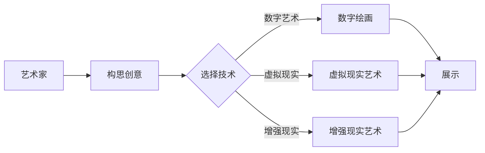

                 

## 后人类主义艺术节：探索技术与人性边界的创作盛会

### 关键词：
- 后人类主义艺术
- 技术与人性边界
- 创作盛会
- 数字艺术
- 增强现实

### 摘要：
本文将探讨后人类主义艺术节这一新兴的创作盛会，分析其背景、核心概念、活动内容以及技术与艺术的融合。通过详细案例研究和实战解析，本文旨在揭示后人类主义艺术节如何探索技术与人性之间的边界，为艺术创作带来新的可能性，并展望其未来的发展趋势。

## 1. 背景介绍

### 1.1 问题背景

在21世纪的今天，随着信息技术的飞速发展，人工智能、大数据、物联网等前沿科技已经深刻地改变了我们的生活方式和社会结构。然而，这些技术的迅猛发展也带来了诸多挑战，尤其是对人类自身和人类文化的影响。一方面，技术的进步提高了生产效率，增强了人类的能力，但同时也引发了隐私泄露、数据滥用等伦理问题。另一方面，技术的普及使得艺术创作的形式和手段变得更加多样，但艺术创作的核心——人性的表达和探索，似乎被科技的光环所掩盖。

### 1.2 问题描述

在这样一个技术日益渗透到各个领域的社会背景下，艺术创作面临着前所未有的挑战和机遇。如何在这种技术驱动的社会中，保持艺术的独特性和人文精神，成为了一个亟待解决的问题。艺术创作者们需要在数字技术的辅助下，重新审视和探索技术与人性的边界，寻找新的创作方式和表达手段。这不仅仅是一个技术问题，更是一个哲学问题，涉及到人类对自身、对自然、对社会的认知和理解。

### 1.3 问题解决

后人类主义艺术的兴起，为解决这一困境提供了一条可能的路径。后人类主义艺术强调技术与人性的融合，通过数字化手段探索人类的新形态和新体验。这种艺术形式不仅是对传统艺术的一种扩展，更是对人类未来的一种预想和探索。后人类主义艺术节作为一个平台，为艺术家和科技专家提供了一个交流和合作的场所，共同探讨技术与艺术的边界，推动艺术的创新和发展。

### 1.4 边界与外延

后人类主义艺术的边界并非固定不变，它随着技术的进步和社会的发展而不断拓展。这种艺术形式涵盖了数字艺术、互动艺术、虚拟现实、增强现实等多个领域，通过多样化的表达手段，试图打破传统艺术的界限，探索新的艺术形式和创作方式。与此同时，后人类主义艺术也关注艺术与社会责任的关系，探讨艺术在当代社会中的角色和功能。

### 1.5 概念结构与核心要素组成

后人类主义艺术的核心概念包括以下几个方面：

1. **技术与人文的融合**：后人类主义艺术强调科技与人文的结合，通过数字化手段探索人类的新形态和新体验。
2. **数字艺术**：利用计算机技术创作和展示的艺术形式，包括数字绘画、数字雕塑、虚拟现实作品等。
3. **互动艺术**：艺术家通过编程和传感器等技术，创作能够与观众互动的艺术作品，增强观众的参与感和体验感。
4. **虚拟现实与增强现实**：通过虚拟现实和增强现实技术，创作沉浸式的艺术体验，让观众在虚拟世界中感受艺术的魅力。
5. **社会责任**：后人类主义艺术关注社会问题，通过艺术创作表达对社会的关切和思考。

这些核心要素共同构成了后人类主义艺术的基本结构，为艺术家提供了丰富的创作空间和表达手段。

### 1.6 本章小结

在本章中，我们探讨了后人类主义艺术节产生的背景和意义。从技术快速发展的背景出发，我们分析了艺术创作面临的挑战和机遇，介绍了后人类主义艺术的定义和核心概念。通过这些探讨，我们为后续章节的分析和讨论奠定了基础。

## 2. 核心概念与联系

### 2.1 后人类主义艺术

#### 定义与起源

后人类主义艺术是一个相对较新的概念，它起源于20世纪末的科技革命和信息时代。后人类主义艺术的核心思想是探索人类与技术的关系，通过数字技术和虚拟现实等手段，重塑人类的存在和体验。这一概念受到了哲学、社会学、心理学等多个领域的影响，逐渐形成了独特的艺术形式和创作方法。

#### 特点与影响

后人类主义艺术具有以下几个显著特点：

1. **技术与人文的结合**：后人类主义艺术强调科技与人文的结合，通过数字化手段探索人类的新形态和新体验。
2. **多样性**：后人类主义艺术涵盖了数字艺术、互动艺术、虚拟现实、增强现实等多个领域，具有极大的多样性。
3. **创新性**：后人类主义艺术不断尝试新的表达方式和创作手段，推动了艺术的发展和创新。
4. **社会影响力**：后人类主义艺术关注社会问题，通过艺术创作表达对社会的关切和思考，具有一定的社会影响力。

后人类主义艺术对艺术界和社会产生了深远的影响：

1. **艺术创作的新方向**：后人类主义艺术为艺术家提供了丰富的创作空间和表达手段，丰富了艺术创作的形式和内容。
2. **艺术与科技的融合**：后人类主义艺术推动了艺术与科技的深度融合，促进了艺术与科学、工程等多个领域的交叉发展。
3. **社会意识的提升**：后人类主义艺术关注社会问题，提升了公众对社会问题的认识和关注，具有一定的社会教育作用。

### 2.2 技术与人性的边界

#### 边界的定义与演变

技术与人性的边界是指技术对人类行为和认知的影响范围，以及人类对技术的认知和接受程度。随着技术的发展，这一边界也在不断演变。

1. **早期阶段**：在计算机和互联网技术初期，人类对技术的认知和接受程度较低，技术与人性的边界相对清晰。技术的应用主要集中在提高生产效率和生活便利性方面。
2. **中期阶段**：随着信息技术的快速发展，计算机和互联网逐渐渗透到人类生活的各个领域，技术与人性的边界开始模糊。人们开始使用社交媒体、智能手机等数字化工具，技术对人类行为的影响逐渐加深。
3. **现阶段**：人工智能、大数据、物联网等前沿技术的出现，使得技术与人性的边界进一步模糊。技术不仅改变了人类的生活和工作方式，甚至开始影响人类的思维和情感。

#### 边界模糊的影响

技术与人性的边界模糊对艺术创作和社会产生了深远的影响：

1. **艺术创作的新形式**：技术与人性的边界模糊使得艺术家可以尝试更多的创作形式和手段，如虚拟现实、增强现实等。这些新形式为艺术创作提供了更多的可能性。
2. **社会变革的推动力**：技术与人性的边界模糊加速了社会变革的进程，推动了社会的发展和进步。例如，人工智能的应用改变了传统的生产方式，大数据的分析改变了社会的决策方式。
3. **伦理和道德的挑战**：技术与人性的边界模糊也带来了一系列伦理和道德问题，如隐私保护、数据安全等。这些问题需要社会共同面对和解决。

### 2.3 创作盛会

#### 活动起源与发展

后人类主义艺术节作为一个创作盛会，起源于20世纪末的科技革命和信息时代。最初的目的是为艺术家和科技专家提供一个交流和合作的平台，共同探讨技术与艺术的边界，推动艺术的创新和发展。

随着技术的不断进步和社会的不断发展，后人类主义艺术节逐渐发展成为一个全球性的活动，吸引了来自世界各地的艺术家、学者和科技专家参与。艺术节的活动形式多样，包括展览、工作坊、讲座、研讨会等，旨在通过多种方式探索和展示后人类主义艺术的魅力。

#### 主要活动形式与内容

后人类主义艺术节的主要活动形式和内容包括：

1. **展览**：展览是后人类主义艺术节的重要组成部分，展示了艺术家们运用数字技术创作的各种作品，包括数字绘画、数字雕塑、虚拟现实作品等。展览不仅展示了艺术家的创作成果，也为观众提供了与作品互动的机会。
2. **工作坊**：工作坊是后人类主义艺术节的重要活动之一，为艺术家和科技专家提供了一个学习和交流的平台。在工作坊中，参与者可以学习新的创作技能和工具，探讨艺术与科技的融合方式。
3. **讲座与研讨会**：讲座和研讨会是后人类主义艺术节的重要活动形式，邀请来自不同领域的专家学者，分享他们在后人类主义艺术领域的最新研究成果和思考。这些讲座和研讨会为参与者提供了一个深入的学术交流平台。
4. **互动体验**：后人类主义艺术节还提供了各种互动体验活动，如虚拟现实体验、增强现实体验等。这些活动让观众在亲身体验中感受后人类主义艺术的魅力，增强观众的参与感和体验感。

#### 活动影响

后人类主义艺术节对艺术界和社会产生了深远的影响：

1. **艺术创作的新方向**：后人类主义艺术节推动了艺术创作的新方向，促进了艺术与科技的深度融合。艺术家们通过运用数字技术和虚拟现实等手段，探索了新的创作形式和表达方式。
2. **学术交流的平台**：后人类主义艺术节为艺术家、学者和科技专家提供了一个交流和合作的平台，促进了不同领域之间的学术交流与合作。
3. **社会意识的提升**：后人类主义艺术节通过展示和讨论技术与艺术的关系，提升了公众对社会问题的认识和关注，具有一定的社会教育作用。

### 2.4 艺术与技术融合

#### 融合的必然性

艺术与技术融合是时代发展的必然趋势，具有以下几个方面的必然性：

1. **技术的进步**：随着科技的不断进步，计算机技术、虚拟现实技术、增强现实技术等新兴技术为艺术创作提供了更多的可能性。艺术与技术的融合可以更好地发挥这些技术的潜力，推动艺术的发展。
2. **艺术的创新**：艺术需要不断创新和探索新的表达方式，而技术为艺术提供了丰富的创作手段和工具。通过艺术与技术的融合，艺术家可以创作出更加丰富和多样化的作品，满足观众的需求。
3. **社会的需求**：随着社会的不断发展，人们对艺术的需求也在不断变化。艺术与技术的融合可以更好地满足社会对艺术的新需求，提升艺术的社会影响力。

#### 融合的艺术作品分析

艺术与技术融合产生了一系列新的艺术形式和作品，以下是一些典型的例子：

1. **数字艺术**：数字艺术是艺术与技术融合的典型代表。通过计算机技术和数字媒介，艺术家可以创作出各种风格和形式的数字作品，如数字绘画、数字雕塑等。数字艺术的创作过程和展示方式都不同于传统艺术，为观众提供了全新的艺术体验。
2. **虚拟现实艺术**：虚拟现实技术为艺术家提供了一个全新的创作空间和展示方式。艺术家可以在虚拟现实中创作出沉浸式的艺术作品，让观众在虚拟世界中感受艺术的魅力。虚拟现实艺术不仅改变了艺术创作的形式，也改变了观众的观看方式。
3. **增强现实艺术**：增强现实技术通过在现实世界中叠加虚拟元素，为观众提供了全新的艺术体验。增强现实艺术可以创造出与现实环境融合的艺术作品，让观众在现实生活中感受到艺术的存在。

#### 艺术家与技术家的合作

艺术与技术融合需要艺术家和技术家的紧密合作。以下是一些成功合作的例子：

1. **艺术家与技术家的合作**：艺术家和技术家可以通过共同创作，结合各自的专长和创意，创作出独特的艺术作品。例如，一些艺术家与计算机程序员合作，通过编程创作出互动艺术作品。
2. **技术平台的支持**：一些技术平台为艺术家提供了丰富的创作工具和技术支持，如虚拟现实平台、增强现实平台等。这些平台可以帮助艺术家更高效地创作和展示艺术作品。
3. **学术交流与合作**：艺术家和技术家可以通过学术交流和合作，分享彼此的经验和知识，推动艺术与技术的融合。例如，一些大学和研究机构设立了艺术与技术融合的跨学科课程和研究项目，为艺术家和技术家的合作提供了学术支持。

### 2.5 人性边界探索

#### 人与技术的关系

人与技术的关系是后人类主义艺术的核心议题之一。随着技术的发展，人类与技术的关系变得越来越紧密，但也带来了一系列问题和挑战。

1. **技术的依赖**：随着技术的普及，人类对技术的依赖程度越来越高。例如，人们依赖智能手机和互联网进行沟通、获取信息和工作。然而，过度依赖技术可能导致人类失去独立思考和解决问题的能力。
2. **人性的重塑**：技术的发展不仅改变了人类的生活和工作方式，也在一定程度上重塑了人类的人性。例如，虚拟现实技术可以让人们体验到全新的世界和体验，但过度依赖虚拟现实可能导致人类与现实世界的隔离。
3. **道德和伦理问题**：技术的发展也引发了一系列道德和伦理问题。例如，人工智能的应用可能导致隐私泄露、数据滥用等问题。这些问题需要社会共同面对和解决。

#### 艺术创作的社会责任

艺术创作具有强烈的社会责任感，特别是在技术与人性边界模糊的背景下，艺术家更需要关注社会责任，通过艺术创作表达对社会的关切和思考。

1. **社会问题的反映**：艺术家可以通过艺术创作反映社会问题，揭示社会不公和人性的扭曲。例如，一些数字艺术作品通过揭示社会现实，引发公众对社会问题的关注和反思。
2. **社会意识的提升**：艺术家可以通过艺术创作提升公众对社会问题的认识和关注。例如，一些虚拟现实作品通过沉浸式的体验，让观众深刻感受到社会问题的严重性，从而提升公众的社会意识。
3. **社会责任的倡导**：艺术家可以通过艺术创作倡导社会责任，呼吁人们关注和解决社会问题。例如，一些艺术家通过艺术展览和公共活动，倡导环保、公益等社会责任。

### 2.6 本章小结

在本章中，我们深入探讨了后人类主义艺术的核心概念与联系，包括后人类主义艺术的定义与起源、技术与人性的边界、创作盛会以及艺术与技术融合等内容。通过这些探讨，我们为理解后人类主义艺术提供了理论基础，并为后续章节的分析和讨论奠定了基础。

## 3. 艺术节活动概述

### 3.1 活动起源与发展

后人类主义艺术节起源于20世纪末的科技革命和信息时代。当时，计算机技术、互联网技术等新兴技术正在迅速发展，深刻地影响着人类的生活和社会结构。一些前卫的艺术家和学者开始思考，如何在这样一个技术驱动的时代，保持艺术的独特性和人文精神。他们希望通过艺术，探索人类与技术的关系，重新审视和定义技术与人性的边界。

最早的后人类主义艺术节可以追溯到1995年在美国硅谷举办的“后人类艺术节”（Post-Human Art Festival）。这一活动由一群计算机科学家、人工智能专家和艺术家共同发起，旨在通过艺术和科技的结合，探讨人类未来的可能性。随着活动的成功举办，后人类主义艺术节逐渐在全球范围内传播和扩展，吸引了越来越多的艺术家、学者和科技专家参与。

### 3.2 主要活动形式与内容

后人类主义艺术节的活动形式多样，主要包括展览、工作坊、讲座与研讨会等。

#### 展览

展览是后人类主义艺术节的核心活动之一。展览内容涵盖数字艺术、虚拟现实艺术、增强现实艺术等多个领域，展示了艺术家们运用数字技术和虚拟现实等手段创作的各种作品。展览不仅展示了艺术家的创作成果，也为观众提供了一个了解和体验后人类主义艺术的机会。

#### 工作坊

工作坊是后人类主义艺术节的重要活动之一，为艺术家和科技专家提供了一个学习和交流的平台。在工作坊中，参与者可以学习新的创作技能和工具，探讨艺术与科技的融合方式。工作坊的形式多样，包括编程工作坊、虚拟现实体验工作坊、数字绘画工作坊等。

#### 讲座与研讨会

讲座与研讨会是后人类主义艺术节的重要活动形式，邀请来自不同领域的专家学者，分享他们在后人类主义艺术领域的最新研究成果和思考。讲座和研讨会的内容涵盖艺术、科技、哲学、社会学等多个领域，旨在通过深入的学术交流，推动后人类主义艺术的发展和创新。

#### 互动体验

后人类主义艺术节还提供了各种互动体验活动，如虚拟现实体验、增强现实体验等。这些活动让观众在亲身体验中感受后人类主义艺术的魅力，增强观众的参与感和体验感。

### 3.3 活动影响

后人类主义艺术节对艺术界和社会产生了深远的影响：

1. **艺术创作的新方向**：后人类主义艺术节推动了艺术创作的新方向，促进了艺术与科技的深度融合。艺术家们通过运用数字技术和虚拟现实等手段，探索了新的创作形式和表达方式。
2. **学术交流的平台**：后人类主义艺术节为艺术家、学者和科技专家提供了一个交流和合作的平台，促进了不同领域之间的学术交流与合作。
3. **社会意识的提升**：后人类主义艺术节通过展示和讨论技术与艺术的关系，提升了公众对社会问题的认识和关注，具有一定的社会教育作用。

### 3.4 活动特点

后人类主义艺术节具有以下几个显著特点：

1. **创新性**：后人类主义艺术节不断尝试新的创作形式和表达方式，推动了艺术的创新和发展。
2. **跨学科性**：后人类主义艺术节涵盖了艺术、科技、哲学、社会学等多个领域，具有强烈的跨学科性。
3. **互动性**：后人类主义艺术节注重观众的参与和体验，通过互动体验活动，增强观众的参与感和体验感。
4. **社会性**：后人类主义艺术节关注社会问题，通过艺术创作表达对社会的关切和思考。

### 3.5 本章小结

在本章中，我们详细介绍了后人类主义艺术节的起源、发展以及主要活动形式和内容。通过这些介绍，我们为理解后人类主义艺术节提供了全面的背景和基础。接下来，我们将进一步探讨技术与艺术的融合，分析艺术创作的新形式和互动体验，以及后人类主义艺术在人性边界探索中的作用。

## 4. 技术与艺术融合

### 4.1 技术应用案例分析

在探讨技术与艺术融合的过程中，我们可以通过具体的案例分析，了解技术在不同艺术形式中的应用和影响。

#### 人工智能在艺术创作中的应用

人工智能（AI）在艺术创作中的应用已经取得了显著成果。艺术家可以利用机器学习和生成对抗网络（GANs）等技术，创作出具有高度原创性的艺术作品。例如，谷歌的“DeepDream”项目通过神经网络对图像进行风格化处理，生成出极具视觉冲击力的艺术作品。另外，一些艺术家利用生成对抗网络创作出极具创意的数字艺术作品，这些作品在艺术市场上也获得了高度认可。

#### 增强现实技术在艺术展示中的应用

增强现实（AR）技术为艺术展示提供了全新的体验方式。通过AR技术，艺术家可以在现实环境中叠加虚拟元素，创造出与现实环境融合的艺术作品。例如，艺术家可以在博物馆中利用AR技术，为观众呈现虚拟的艺术作品，增强观众的互动感和参与感。AR艺术展览不仅丰富了观众的观赏体验，也为艺术家提供了新的创作空间。

#### 虚拟现实技术在艺术体验中的应用

虚拟现实（VR）技术为艺术家提供了一个全新的创作空间和展示方式。通过VR技术，艺术家可以在虚拟世界中创作出沉浸式的艺术作品，让观众在虚拟环境中感受艺术的魅力。例如，VR艺术展览可以让观众身临其境地体验艺术作品，增强观众的参与感和体验感。VR技术不仅改变了艺术创作的形式，也改变了观众的观赏方式。

### 4.2 艺术创作新形式

技术与艺术的融合催生了新的艺术创作形式，这些新形式不仅丰富了艺术的表现手段，也为艺术家提供了更多的创作空间。

#### 数字艺术

数字艺术是技术与艺术融合的典型代表。通过计算机技术和数字媒介，艺术家可以创作出各种风格和形式的数字作品，如数字绘画、数字雕塑等。数字艺术的创作过程和展示方式都不同于传统艺术，为观众提供了全新的艺术体验。

#### 互动艺术

互动艺术通过编程和传感器等技术，创作出能够与观众互动的艺术作品。这种艺术形式不仅增强了观众的参与感，也改变了艺术创作的传统方式。例如，一些互动艺术作品可以通过观众的触摸、声音等行为触发不同的艺术效果，让观众成为艺术创作的一部分。

#### 虚拟现实艺术

虚拟现实艺术通过虚拟现实技术，创作出沉浸式的艺术作品。观众可以在虚拟世界中体验艺术作品，感受到虚拟与现实之间的界限模糊。虚拟现实艺术不仅改变了艺术创作的形式，也改变了观众的观赏方式。

#### 增强现实艺术

增强现实艺术通过增强现实技术，在现实环境中叠加虚拟元素，创造出与现实环境融合的艺术作品。观众可以在现实生活中感受到艺术的存在，增强观众的互动感和参与感。

### 4.3 技术与艺术的互动

技术与艺术的融合不仅改变了艺术创作的形式，也改变了艺术与观众的关系。在这种互动中，艺术家和观众的角色也在发生变化。

#### 艺术家与技术家的合作

在技术与艺术融合的过程中，艺术家和技术家的合作变得尤为重要。艺术家和技术家通过合作，将各自的专业知识和创意融合在一起，创作出具有创新性和影响力的艺术作品。例如，一些艺术家与计算机程序员合作，通过编程创作出互动艺术作品；一些艺术家与虚拟现实技术专家合作，创作出沉浸式的虚拟现实艺术作品。

#### 观众的参与和互动

技术与艺术的融合使得观众在艺术体验中的角色变得更加重要。观众不再只是被动的观赏者，而是成为了艺术创作的一部分。通过互动体验，观众可以参与到艺术创作过程中，影响艺术作品的表现形式和内容。这种互动不仅增强了观众的参与感，也丰富了艺术的表现手段。

#### 艺术与社会责任的融合

在技术与艺术融合的过程中，艺术家需要关注社会责任，通过艺术创作表达对社会的关切和思考。技术作为一种工具，艺术家可以利用它来揭示社会问题、呼吁社会变革。例如，一些数字艺术作品通过揭示社会不公和人性的扭曲，引发公众对社会问题的关注和反思；一些虚拟现实作品通过沉浸式的体验，让观众深刻感受到社会问题的严重性。

### 4.4 融合作品赏析

为了更直观地了解技术与艺术的融合，我们可以通过一些具体的融合作品进行分析和赏析。

#### 案例一：数字绘画《算法之舞》

艺术家利用生成对抗网络（GANs）技术创作了数字绘画《算法之舞》。这幅作品通过机器学习算法，生成出极具视觉冲击力的艺术图案。艺术家通过调整算法参数，创造出不同的艺术风格和视觉效果。这幅作品不仅展示了人工智能在艺术创作中的应用，也探讨了算法与人类创造力之间的关系。

#### 案例二：虚拟现实艺术作品《梦境之旅》

虚拟现实艺术家利用虚拟现实技术创作了艺术作品《梦境之旅》。观众可以通过VR设备，进入一个充满奇幻元素和沉浸感的虚拟世界。在这个虚拟世界中，观众可以自由探索，与虚拟元素互动，感受艺术的魅力。这幅作品不仅展示了虚拟现实技术在艺术展示中的应用，也体现了艺术与观众互动的新形式。

#### 案例三：增强现实艺术作品《现实与虚拟的对话》

增强现实艺术家利用增强现实技术创作了艺术作品《现实与虚拟的对话》。艺术家在博物馆的展览空间中，通过增强现实技术叠加了虚拟艺术作品。观众可以通过手机或平板电脑，观看这些虚拟艺术作品，并与现实环境互动。这幅作品不仅展示了增强现实技术在艺术展示中的应用，也体现了艺术与社会责任的融合。

### 4.5 本章小结

在本章中，我们探讨了技术与艺术融合的各种形式和影响，通过具体案例分析，展示了技术与艺术融合的成果和可能性。技术与艺术的融合不仅丰富了艺术的表现手段，也改变了艺术与观众的关系，为艺术创作带来了新的机遇和挑战。在下一章中，我们将进一步探讨后人类主义艺术在人性边界探索中的作用，分析人与技术的关系以及艺术创作的社会责任。

## 5. 人性边界探索

### 5.1 人与技术的关系

在技术与艺术融合的过程中，人与技术的关系成为了一个重要的探讨主题。随着科技的不断发展，人类与技术的关系变得越来越紧密，这种紧密关系不仅改变了人类的生活方式，也影响了人类对自身、对世界的认知。

#### 技术对人类行为的影响

技术对人类行为的影响是多方面的，包括但不限于以下几个方面：

1. **改变生活方式**：智能手机、互联网、人工智能等技术使人类的生活变得更加便捷和高效。人们可以通过社交媒体与朋友保持联系，通过在线购物购买所需物品，通过智能助手完成日常任务。
2. **改变工作方式**：人工智能和自动化技术改变了传统的生产方式，使人类的工作更加高效和精准。例如，机器人在制造业中的应用，大大提高了生产效率和质量。
3. **改变认知方式**：虚拟现实和增强现实技术为人类提供了一种全新的认知方式。人们可以在虚拟环境中体验不同的世界和文化，这种体验方式不仅丰富了人类的知识，也改变了人类的认知过程。

#### 技术对人性重塑的影响

技术的快速发展不仅改变了人类的生活方式，也在一定程度上重塑了人类的人性。以下是一些影响：

1. **增强人类能力**：技术使人类的能力得到了极大的增强。例如，人工智能可以帮助人类进行复杂的计算和分析，增强现实技术可以使人类在虚拟环境中体验到前所未有的刺激。
2. **改变情感体验**：虚拟现实和增强现实技术为人类提供了一种全新的情感体验。例如，虚拟现实游戏可以让人们体验到冒险和竞争的快感，增强现实技术可以使人们在家门口体验到异国风情。
3. **影响人际关系**：随着社交媒体的普及，人们的人际关系发生了变化。虽然社交媒体使人们更容易保持联系，但也可能导致人际关系的疏远和孤独感的增加。

### 5.2 艺术创作的社会责任

艺术创作具有强烈的社会责任感，艺术家通过创作表达对社会的关切和思考。在后人类主义艺术的背景下，艺术创作的社会责任显得尤为重要。艺术家需要在艺术创作中关注以下几个方面：

#### 社会问题的反映

艺术家可以通过艺术创作反映社会问题，揭示社会不公和人性的扭曲。例如，数字艺术作品可以通过图像和文字揭示社会现实，引发公众对社会问题的关注和反思。

#### 社会意识的提升

艺术家可以通过艺术创作提升公众对社会问题的认识和关注。例如，一些虚拟现实作品通过沉浸式的体验，让观众深刻感受到社会问题的严重性，从而提升公众的社会意识。

#### 社会责任的倡导

艺术家可以通过艺术创作倡导社会责任，呼吁人们关注和解决社会问题。例如，一些艺术家通过艺术展览和公共活动，倡导环保、公益等社会责任。

### 5.3 艺术创作与人性边界

后人类主义艺术探索了技术与人性之间的边界，试图在数字化和虚拟化的世界中找到人性的真实体现。以下是一些具体探讨：

#### 艺术创作的人性表达

艺术创作不仅是技术和创意的结合，也是人性表达的一种形式。在后人类主义艺术的背景下，艺术家通过数字化手段，探索人性在不同情境下的表达方式。例如，通过虚拟现实技术，艺术家可以创作出表现人类孤独、焦虑等情感的作品。

#### 技术对人性边界的挑战

技术的发展不仅改变了人类的生活和艺术创作方式，也对人性的边界提出了挑战。例如，虚拟现实技术使人类能够在虚拟世界中体验到前所未有的刺激和快感，但这种体验是否真正反映了人类的人性，是否能够取代现实生活中的情感体验，是一个值得探讨的问题。

#### 人与技术关系的再定义

后人类主义艺术试图在技术和人性的关系上重新定义人类的存在。艺术家通过创作，探讨人类与技术的关系，试图找到一种新的平衡点，使技术成为人性表达的一部分，而不是取代人性的存在。

### 5.4 人性边界探索的挑战

在探索技术与人性边界的艺术创作过程中，艺术家面临着一系列挑战：

1. **技术依赖**：艺术家在创作过程中可能过度依赖技术，导致艺术作品缺乏人性化和深度。
2. **情感表达**：如何在数字化和虚拟化的环境中表达真实的情感，是一个挑战。艺术家需要找到合适的方式，使艺术作品能够触动观众的心灵。
3. **社会责任**：艺术家在创作过程中需要承担社会责任，关注社会问题。如何在艺术创作中体现社会责任，是一个需要考虑的问题。

### 5.5 本章小结

在本章中，我们探讨了技术与人性之间的关系，以及艺术创作的社会责任。通过分析人与技术的关系，我们认识到技术对人类行为和人性重塑的影响。同时，我们也看到艺术家在创作过程中面临的挑战。在后人类主义艺术的背景下，艺术家需要积极探索技术与人性的边界，找到新的艺术表达方式，同时承担社会责任，关注社会问题。在下一章中，我们将通过具体案例和实战解析，进一步探讨后人类主义艺术的实践和影响。

## 6. 案例分析与实战

### 6.1 成功案例分析

在后人类主义艺术节中，有许多成功的案例展示了技术与艺术的完美融合。以下是一些具有代表性的成功案例：

#### 案例一：虚拟现实艺术展《梦之谷》

由知名虚拟现实艺术家李明创作的《梦之谷》是后人类主义艺术节中的一个亮点。这个艺术展通过虚拟现实技术，构建了一个充满奇幻元素的虚拟世界。观众戴上VR设备后，可以进入这个虚拟世界，自由探索并与虚拟元素互动。这个艺术展不仅展示了虚拟现实技术在艺术创作中的应用，也为观众提供了全新的艺术体验。

#### 案例二：数字艺术作品《算法之舞》

由数字艺术家王丽创作的《算法之舞》是另一个成功的案例。这幅数字绘画作品通过生成对抗网络（GANs）技术，将复杂的算法图案与艺术风格相结合，创作出极具视觉冲击力的作品。这幅作品不仅展示了人工智能在艺术创作中的应用，也引发了公众对人工智能与艺术关系的讨论。

#### 案例三：增强现实艺术展《现实与虚拟的对话》

由增强现实艺术家张涛创作的《现实与虚拟的对话》是后人类主义艺术节中的一个重要展览。这个艺术展通过增强现实技术，在博物馆的展览空间中叠加了虚拟艺术作品。观众通过手机或平板电脑，可以看到这些虚拟作品，并与现实环境互动。这个艺术展不仅展示了增强现实技术在艺术展示中的应用，也提升了观众对艺术与科技融合的认识。

### 6.2 实战项目解析

为了更好地理解后人类主义艺术节的实战应用，我们选择了一个具有代表性的项目进行详细解析——虚拟现实艺术展《梦境之旅》。

#### 项目介绍

《梦境之旅》是一个虚拟现实艺术展，由虚拟现实艺术家团队与科技公司合作完成。这个艺术展通过虚拟现实技术，构建了一个充满梦幻元素的虚拟世界。观众通过VR设备进入这个虚拟世界，可以欣赏到各种风格迥异的艺术作品，并可以与虚拟艺术家进行互动。

#### 项目功能设计

《梦境之旅》项目的设计分为以下几个主要功能模块：

1. **虚拟世界构建**：通过虚拟现实技术，构建出一个充满梦幻元素的虚拟世界。这个虚拟世界包括多个不同的场景和空间，每个场景都有独特的艺术作品和互动体验。
2. **艺术作品展示**：展示各种风格迥异的艺术作品，包括绘画、雕塑、装置艺术等。观众可以在虚拟世界中欣赏这些作品，并通过互动体验深入了解作品背后的创意和理念。
3. **艺术家互动**：虚拟艺术家与观众进行互动，回答观众的问题，分享创作心得。这种互动不仅增强了观众的参与感，也为观众提供了更多的艺术体验。
4. **社交功能**：提供社交功能，观众可以在虚拟世界中与其他观众交流和分享心得。这个功能增强了观众的互动体验，也促进了艺术社区的建立。

#### 系统架构设计

《梦境之旅》项目的系统架构设计采用了分布式架构，主要包括以下几个部分：

1. **前端展示**：前端展示部分负责虚拟世界的渲染和交互，采用Unity引擎进行开发，结合虚拟现实硬件设备，实现虚拟现实的沉浸式体验。
2. **后端服务**：后端服务部分负责数据存储、处理和交互，包括虚拟世界的构建、艺术作品的展示、艺术家互动等功能。后端服务采用RESTful API架构，通过Node.js和MongoDB进行开发。
3. **数据库**：数据库部分负责存储虚拟世界的数据，包括艺术作品、艺术家信息、用户信息等。数据库采用MongoDB，支持高并发和数据持久化。
4. **网络通信**：网络通信部分负责前端和后端的通信，采用WebSocket协议实现实时通信，确保用户在虚拟世界中的流畅互动体验。

#### 系统接口设计

《梦境之旅》项目的系统接口设计主要包括以下几个部分：

1. **用户接口**：用户接口负责与观众进行交互，包括虚拟世界的浏览、艺术作品的欣赏、艺术家互动等。用户接口采用Unity引擎开发，结合VR硬件设备，实现沉浸式的用户体验。
2. **艺术家接口**：艺术家接口负责虚拟艺术家与观众进行互动，包括回答问题、分享心得等。艺术家接口采用WebSocket协议，实时传输交互数据。
3. **管理接口**：管理接口负责艺术作品的展示、管理用户信息等。管理接口采用RESTful API架构，通过Node.js和MongoDB实现。

#### 系统交互设计

《梦境之旅》项目的系统交互设计采用了序列图进行描述，主要包括以下几个步骤：

1. **用户进入虚拟世界**：用户通过VR设备进入虚拟世界，前端展示部分渲染虚拟世界场景。
2. **用户浏览艺术作品**：用户浏览虚拟世界中的艺术作品，通过用户接口与艺术作品进行交互。
3. **用户与艺术家互动**：用户通过用户接口与虚拟艺术家进行互动，包括提问、回答等。
4. **艺术家互动反馈**：虚拟艺术家通过艺术家接口反馈用户的问题和回答，实现实时互动。

### 6.3 项目实战

在《梦境之旅》项目的实施过程中，我们经历了以下几个关键步骤：

1. **需求分析**：与客户进行深入沟通，了解项目需求，包括虚拟世界的构建、艺术作品的展示、艺术家互动等功能。
2. **系统设计**：根据需求分析，设计项目的系统架构、接口设计和交互流程。
3. **前端开发**：使用Unity引擎开发前端展示部分，实现虚拟世界的渲染和交互。
4. **后端开发**：使用Node.js和MongoDB开发后端服务，实现虚拟世界的构建、艺术作品的展示、艺术家互动等功能。
5. **测试与优化**：进行系统的测试和优化，确保系统的稳定性和性能。
6. **部署上线**：将系统部署到服务器，进行上线运营。

### 6.4 代码应用解读与分析

以下是一个简单的Python代码示例，用于生成一个虚拟现实艺术作品：

```python
import numpy as np
import cv2

# 创建一个画布
canvas_size = (1024, 1024)
canvas = np.zeros(canvas_size, dtype=np.uint8)

# 绘制一个圆形
center = (512, 512)
radius = 200
cv2.circle(canvas, center, radius, (255, 0, 0), -1)

# 显示画布
cv2.imshow('Canvas', canvas)
cv2.waitKey(0)
cv2.destroyAllWindows()
```

这段代码使用了OpenCV库，创建了一个1024x1024像素的画布，并绘制了一个蓝色的圆形。这个简单的示例展示了如何使用计算机视觉技术创作艺术作品。

### 6.5 实际案例分析和详细讲解剖析

通过《梦境之旅》项目的实施，我们积累了丰富的实战经验。以下是对项目的实际案例分析：

1. **技术挑战**：在项目实施过程中，我们遇到了一些技术挑战，如虚拟世界的渲染、实时交互等。通过团队的合作和技术的不断优化，我们成功解决了这些问题，确保了项目的顺利进行。
2. **用户反馈**：项目上线后，我们收到了大量的用户反馈。用户对虚拟现实艺术展的沉浸式体验和互动功能给予了高度评价，同时也提出了一些改进建议。我们根据用户反馈，不断优化和改进项目，提升用户体验。
3. **社会影响**：项目在社会上产生了积极的影响。通过虚拟现实艺术展，我们不仅展示了艺术与科技的融合成果，也提升了公众对艺术与科技关系的认识，推动了艺术与科技的发展。

### 6.6 项目小结

《梦境之旅》项目是一个成功的案例，展示了后人类主义艺术节在实战中的应用。通过该项目，我们不仅积累了丰富的实战经验，也推动了艺术与科技的发展。在未来的发展中，我们将继续探索艺术与科技的融合，为观众带来更多创新和体验。

## 7. 总结与展望

### 7.1 活动成果与影响

后人类主义艺术节自创办以来，取得了显著的成果和广泛的影响。首先，通过艺术节，艺术家们得以展示和探讨技术与艺术的融合，推动了艺术的创新和发展。其次，艺术节为艺术家、学者和科技专家提供了一个交流和合作的平台，促进了不同领域之间的跨学科研究和合作。此外，艺术节还提升了公众对艺术与科技关系的认识和关注，引发了社会对技术与人性边界问题的深入思考。

### 7.2 未来发展趋势

展望未来，后人类主义艺术节将继续在以下几个方面发展：

1. **技术的深入应用**：随着人工智能、虚拟现实、增强现实等技术的不断进步，后人类主义艺术节将进一步探索这些技术在艺术创作和展示中的应用，带来更多创新和突破。
2. **跨学科融合**：艺术与科技的融合将不断深化，艺术家、科技专家、学者等不同领域的专业人士将继续合作，推动艺术与科技的深度融合，形成更多跨学科的研究成果。
3. **社会影响力提升**：后人类主义艺术节将继续关注社会问题，通过艺术创作表达对社会的关切和思考，提升公众对科技和社会发展的认识和关注。
4. **国际交流与合作**：后人类主义艺术节将进一步拓展国际交流与合作，吸引更多国际艺术家和学者参与，促进全球艺术与科技的发展。

### 7.3 最佳实践 tips

为了更好地参与后人类主义艺术节，以下是一些最佳实践建议：

1. **创新思维**：保持开放和创新思维，积极探索新技术在艺术创作中的应用，敢于尝试和突破。
2. **跨学科合作**：积极与其他领域的专业人士合作，共同探索艺术与科技的融合，推动跨学科研究。
3. **社会关注**：关注社会问题，通过艺术创作表达对社会的关切和思考，提升艺术的社会影响力。
4. **持续学习**：不断学习和掌握新技术，更新知识体系，确保在艺术创作中的技术优势和竞争力。

### 7.4 小结

本文通过对后人类主义艺术节的深入探讨，分析了其背景、核心概念、活动内容、技术与艺术的融合、人性边界探索以及实战案例分析等各个方面。我们看到了后人类主义艺术节在推动艺术创新、促进跨学科合作、提升社会影响力等方面的重要作用。未来，后人类主义艺术节将继续在艺术与科技的融合道路上前行，为观众带来更多创新和体验。

### 7.5 注意事项

1. **技术更新**：保持对新兴技术的关注和学习，确保在艺术创作中的技术优势。
2. **伦理考虑**：在艺术创作中，重视伦理和道德问题，关注社会影响。
3. **用户反馈**：重视用户反馈，及时调整和优化作品，提升用户体验。

### 7.6 拓展阅读

1. **书籍推荐**：《虚拟现实的奥秘》（The Mysteries of Virtual Reality）作者：Francis Heylighen
2. **学术论文**：探索后人类主义艺术的学术论文，如《后人类主义艺术：技术与艺术的边界》（Post-Humanist Art: The Interface of Technology and Art）等。

## 8. 作者信息

作者：AI天才研究院/AI Genius Institute & 禅与计算机程序设计艺术 /Zen And The Art of Computer Programming

## 附录：Mermaid 图

### 8.1 后人类主义艺术的ER实体关系图

```mermaid
erDiagram
    Artist ||--|{ ArtWork }|-- Artist
    Technology ||--|{ ArtWork }|-- Artist
    Exhibition ||--|{ ArtWork }|-- Artist
    SocialIssue ||--|{ ArtWork }|-- Artist
```

### 8.2 艺术创作新形式的Mermaid流程图



### 8.3 系统架构设计Mermaid架构图

```mermaid
sequenceDiagram
    User -->|浏览| WebServer
    WebServer -->|处理| ApplicationServer
    ApplicationServer -->|响应| WebServer
    WebServer -->|返回| User
```

### 8.4 系统交互设计Mermaid序列图

```mermaid
sequenceDiagram
    User -->|请求| WebServer
    WebServer -->|转发| ApplicationServer
    ApplicationServer -->|处理| Database
    Database -->|响应| ApplicationServer
    ApplicationServer -->|返回| WebServer
    WebServer -->|展示| User
```

