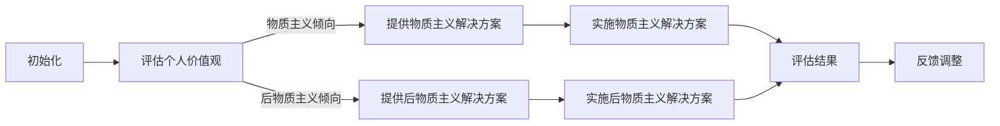
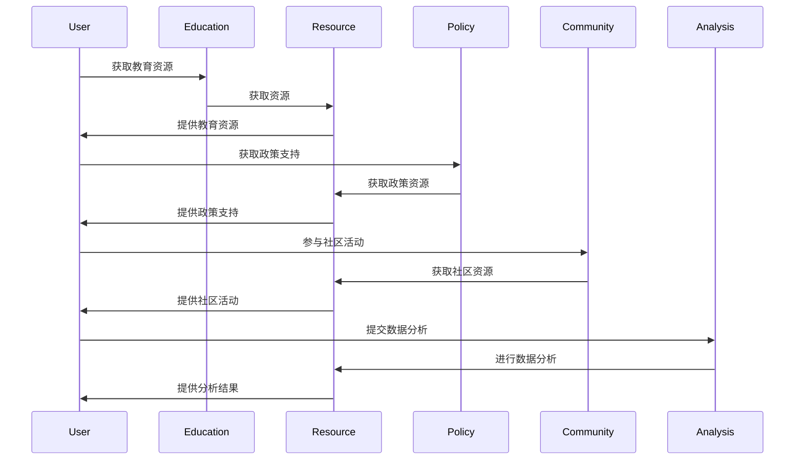
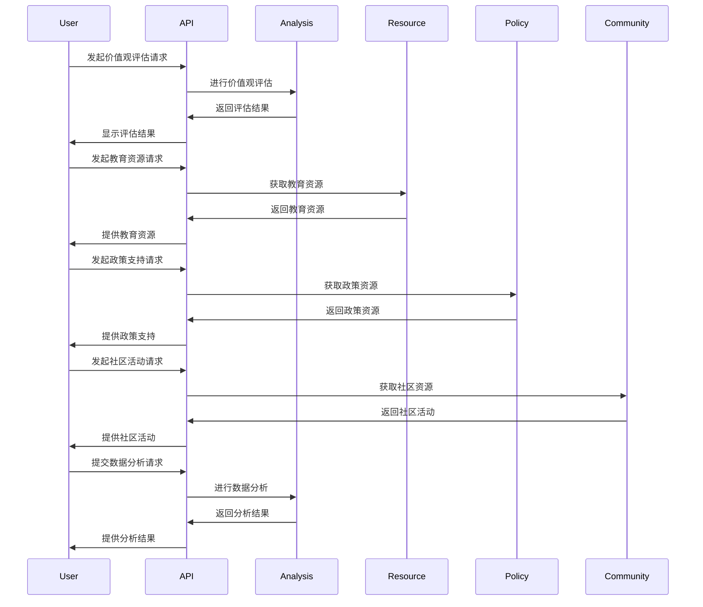
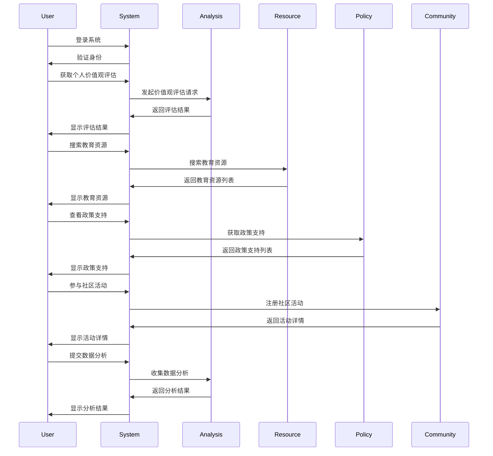

                 

# 后物质主义：超越物质追求的生活哲学

> 关键词：后物质主义、生活哲学、非物质追求、个人价值观、社会影响

> 摘要：本文深入探讨后物质主义这一生活哲学，从其定义、起源、核心价值观念、生活理念、经济模式、社会影响、实践与未来展望等多个方面，逐步剖析后物质主义如何引导人们超越物质追求，实现精神层面的丰富与自由。通过逻辑清晰、结构紧凑的论述，帮助读者理解后物质主义的内涵与外延，为现代社会的个人与集体生活提供新视角和新思路。

## 第1章 引言

### 1.1 后物质主义的概念与起源

后物质主义（Post-materialism）作为一种哲学思想和社会思潮，起源于20世纪中叶。它是对物质主义的一种反思和超越，强调非物质追求的重要性，如个人价值观、社会关系、精神满足等。后物质主义的起源可以追溯到20世纪60年代的西方社会，特别是美国和欧洲。当时，物质财富的快速增长导致了人们对于物质生活的追求，然而，这种追求在满足基本生存需求后，逐渐显现出其局限性。

后物质主义的提出者，如社会学家罗伯特·贝拉（Robert Bellah）等人，认为现代社会面临着一种“心灵贫困”，即物质生活的丰富并未带来精神层面的满足。因此，他们倡导一种超越物质追求的生活哲学，即后物质主义。

### 1.2 后物质主义与物质主义的关系

后物质主义与物质主义之间的关系是辩证的。物质主义强调物质财富的积累和消费，而后物质主义则强调非物质价值的追求。二者并非截然对立，而是在不同发展阶段中呈现出不同的侧重点。在物质生活相对匮乏的时期，物质主义有其合理性；而在物质生活相对富足的时期，后物质主义则更能满足人们的精神需求。

### 1.3 后物质主义的核心价值观念

后物质主义的核心价值观念包括个人自由、社会公正、生态可持续性等。这些价值观不仅反映在个人生活中，也体现在社会、经济和政治领域。个人自由强调个体在精神和行为上的独立，社会公正追求不同社会群体之间的公平待遇，生态可持续性则关注人类与自然环境的和谐共生。

## 第2章 后物质主义的哲学背景

### 2.1 现代社会的物质主义批判

物质主义的批判是后物质主义哲学背景的重要组成部分。现代社会物质主义的批判主要从以下几个方面展开：物质追求导致的消费主义陷阱、环境问题、社会不公、精神空虚等。这些批判揭示了物质主义在满足人们需求方面的局限性，为后物质主义的兴起提供了理论基础。

### 2.2 后现代主义与后物质主义

后现代主义（Post-modernism）与后物质主义有着密切的联系。后现代主义对现代性进行了深刻的批判，质疑科学理性、资本主义和自由民主等现代价值观。而后物质主义则在此基础上，进一步质疑物质财富的重要性，强调非物质价值的追求。后现代主义为后物质主义提供了一种批判性的视角，而后物质主义则将后现代主义的批判精神应用于个人生活和社会发展。

### 2.3 后物质主义的哲学基础

后物质主义的哲学基础包括存在主义、现象学、解构主义等。这些哲学流派从不同角度探讨了人的存在、意识和价值观念。存在主义强调个人自由和责任，现象学关注人的直接经验和主观意识，解构主义则质疑权威和中心主义。这些哲学思想为后物质主义提供了丰富的理论资源，帮助人们理解如何超越物质追求，实现精神层面的丰富。

## 第3章 后物质主义的生活理念

### 3.1 个人价值观的转换

后物质主义要求个人价值观从物质追求转向非物质追求。这种转换不仅体现在个人生活的方方面面，如消费、工作、休闲等，还反映在人际关系和社会参与中。个人价值观的转换是后物质主义实践的核心，也是实现精神满足和自由的前提。

### 3.2 生活目标的重新定位

后物质主义倡导重新定位生活目标，从物质成功转向精神满足。这种重新定位要求人们审视自己的价值观，明确生活的真正意义。生活目标的重新定位有助于人们摆脱物质主义的束缚，追求更有价值的生活。

### 3.3 后物质主义的消费观

后物质主义的消费观强调消费的非物质性，如体验、服务、文化等。与传统消费观相比，后物质主义的消费观更加注重消费过程中的精神体验和价值观的实现。这种消费观有助于减少物质浪费，提升生活质量。

## 第4章 后物质主义的经济模式

### 4.1 后物质主义与可持续经济

后物质主义与可持续经济有着内在的联系。可持续经济强调资源的合理利用和环境的保护，而后物质主义则提供了一种减少物质消费、追求精神满足的生活方式。这种生活方式有助于实现经济的可持续发展。

### 4.2 后物质主义下的工作与生活方式

后物质主义下的工作与生活方式强调工作与生活的平衡，注重个人的精神成长和人际关系。这种工作与生活方式有助于提高工作效率，提升生活质量。

### 4.3 后物质主义与财富再分配

后物质主义关注财富的合理分配，强调社会公正。通过减少物质消费和追求精神满足，后物质主义有助于实现财富的再分配，减少社会不公。

## 第5章 后物质主义的社会影响

### 5.1 后物质主义与教育

后物质主义对教育领域产生了深远的影响。在教育过程中，后物质主义倡导培养具有批判性思维和创造性能力的个体，强调教育不仅仅是知识的传递，更是价值观的塑造。

### 5.2 后物质主义与政治

后物质主义对政治领域也产生了重要影响。在政治生活中，后物质主义强调民主、公正和生态可持续性。这种政治理念有助于推动社会进步，实现人类的共同福祉。

### 5.3 后物质主义与全球化

后物质主义与全球化有着复杂的关系。在全球化背景下，后物质主义倡导跨文化的理解和尊重，推动全球合作，实现共同发展。

## 第6章 实践中的后物质主义

### 6.1 个人生活案例

通过个人生活案例，我们可以看到后物质主义在实践中的应用。这些案例展示了个体如何通过转变价值观、重新定位生活目标和消费方式，实现精神满足和自由。

### 6.2 社区建设与实践

社区建设是后物质主义实践的重要领域。通过社区建设，人们可以共同探讨和践行后物质主义价值观，推动社会进步。

### 6.3 政策与制度创新

政策与制度创新是后物质主义实践的重要保障。通过制度创新，可以为后物质主义提供良好的社会环境和政策支持。

## 第7章 后物质主义的未来展望

### 7.1 后物质主义的全球趋势

在全球范围内，后物质主义呈现出一种上升趋势。这种趋势反映了人们对于物质追求的反思和对于精神满足的渴望。

### 7.2 后物质主义面临的挑战

后物质主义在实践中也面临诸多挑战，如文化差异、经济困境、社会不公等。如何应对这些挑战，实现后物质主义的可持续发展，是未来研究的重要课题。

### 7.3 后物质主义的未来走向

后物质主义的未来走向取决于多种因素，如社会经济发展、科技进步、文化变革等。通过持续的研究和实践，后物质主义有望成为引领未来生活的重要哲学理念。

## 附录

### 附录A：后物质主义相关术语表

### 附录B：推荐阅读文献

### 附录C：后物质主义研讨会与活动列表

---

作者：AI天才研究院/AI Genius Institute & 禅与计算机程序设计艺术 /Zen And The Art of Computer Programming

---

## 背景介绍

### 核心概念术语说明

- 后物质主义：一种哲学思想和社会思潮，强调非物质追求的重要性，如个人价值观、社会关系、精神满足等。
- 物质主义：一种哲学思想，强调物质财富的积累和消费。
- 后现代主义：对现代性进行深刻批判，质疑科学理性、资本主义和自由民主等现代价值观。
- 存在主义：强调个人自由和责任，关注人的存在和意义。
- 现象学：关注人的直接经验和主观意识。
- 解构主义：质疑权威和中心主义，强调多元性和差异性。

### 问题背景

随着全球经济的发展，物质主义在社会各个层面得到了广泛传播。然而，物质追求并未带来预期的精神满足，反而导致了一系列社会问题，如消费主义陷阱、环境问题、社会不公、精神空虚等。这种现实引发了人们对于生活哲学的反思，后物质主义作为一种超越物质追求的生活哲学应运而生。

### 问题描述

后物质主义提出了一系列核心价值观念，如个人自由、社会公正、生态可持续性等。这些价值观念与物质主义形成了鲜明对比，引导人们超越物质追求，实现精神层面的丰富与自由。然而，如何在实践中贯彻这些价值观念，实现后物质主义的理念，仍然是一个亟待解决的问题。

### 问题解决

后物质主义的实现需要从多个方面进行努力。首先，个人需要转变价值观，从物质追求转向非物质追求。其次，社会需要提供良好的环境和支持，如教育、政策、社区建设等。最后，需要在实践中不断探索和创新，形成一套适应时代发展的后物质主义模式。

### 边界与外延

后物质主义的核心价值观念可以应用于个人生活、社会、经济、政治等多个领域。然而，后物质主义并非一种单一的生活方式或哲学体系，而是多种哲学思想和理念的融合。因此，后物质主义的外延是广泛的，不仅包括个人层面的价值观念，还涉及社会、经济、政治等多个层面的实践。

### 概念结构与核心要素组成

后物质主义的概念结构主要包括以下几个核心要素：

1. **个人价值观的转换**：从物质追求转向非物质追求。
2. **生活目标的重新定位**：从物质成功转向精神满足。
3. **消费观的转变**：注重精神体验和价值观的实现。
4. **可持续经济模式**：强调资源的合理利用和环境的保护。
5. **社会公正**：追求不同社会群体之间的公平待遇。
6. **生态可持续性**：实现人类与自然环境的和谐共生。

这些核心要素共同构成了后物质主义的理论框架，为人们的日常生活和社会发展提供了新的方向和思路。

### 核心概念原理

后物质主义的核心概念原理主要包括以下几个方面：

1. **个人自由**：后物质主义强调个人自由，认为个体应该在精神和行为上有独立的权利。这与物质主义的个人自由有所不同，后者更强调物质条件的自由。
   
2. **社会公正**：后物质主义认为社会应该提供公平的环境，使每个成员都能获得平等的待遇和机会。这与物质主义的社会公正有所不同，后者往往侧重于财富和资源的分配。

3. **生态可持续性**：后物质主义关注生态可持续性，认为人类活动应该与自然环境和谐共生。这与物质主义对环境的忽视形成了鲜明对比。

4. **非物质追求**：后物质主义强调非物质追求的重要性，如个人价值观、社会关系、精神满足等。这与物质主义追求物质财富形成了对立。

### 概念属性特征对比表格

| 特征 | 后物质主义 | 物质主义 |
| --- | --- | --- |
| 个人自由 | 精神和行为上的独立 | 物质条件的独立 |
| 社会公正 | 公平的待遇和机会 | 财富和资源的分配 |
| 生态可持续性 | 与自然环境和谐共生 | 忽视环境问题 |
| 物质追求 | 非物质追求的重要性 | 物质财富的追求 |

### ER实体关系图架构

为了更直观地理解后物质主义和物质主义的对比，我们可以使用Mermaid语言绘制一个ER实体关系图，展示这两个概念之间的关系。

```mermaid
erDiagram
  用户 ||--|{ 消费习惯 }|> |
  用户 ||--|{ 生活目标 }|> |
  用户 ||--|{ 价值观 }|> |
  用户 ||--|{ 环境观 }|> |
  消费习惯 ||--|{ 物质主义 }|> |
  消费习惯 ||--|{ 后物质主义 }|> |
  生活目标 ||--|{ 物质主义 }|> |
  生活目标 ||--|{ 后物质主义 }|> |
  价值观 ||--|{ 物质主义 }|> |
  价值观 ||--|{ 后物质主义 }|> |
  环境观 ||--|{ 物质主义 }|> |
  环境观 ||--|{ 后物质主义 }|> |
```

### 算法原理讲解

后物质主义的实现涉及到一系列复杂的社会和行为变化，其中算法原理起到了关键作用。以下将使用Mermaid语言绘制一个简化的算法流程图，并使用Python代码详细阐述算法原理。

#### Mermaid算法流程图



#### Python代码

```python
# 后物质主义评估与实施算法

def assess_values(values):
    """
    评估个人价值观，判断倾向于物质主义还是后物质主义
    """
    material_score = 0
    postmaterial_score = 0
    
    # 根据个人价值观评分
    for value in values:
        if value == "物质财富" or value == "消费":
            material_score += 1
        elif value == "自由" or value == "公正" or value == "生态":
            postmaterial_score += 1
    
    return "物质主义" if material_score > postmaterial_score else "后物质主义"

def implement_solution(solution_type):
    """
    根据评估结果，提供相应的解决方案
    """
    if solution_type == "物质主义":
        print("实施物质主义解决方案：增加物质财富，提高消费水平。")
    else:
        print("实施后物质主义解决方案：追求自由、公正和生态可持续。")

# 示例使用
personal_values = ["自由", "公正", "生态", "物质财富", "消费"]
solution_type = assess_values(personal_values)
implement_solution(solution_type)
```

#### 算法原理与数学模型

后物质主义的评估与实施算法基于以下数学模型：

1. **个人价值观评分模型**：通过给定的个人价值观列表，分别计算物质主义和后物质主义的得分。
2. **决策模型**：根据得分比较，决定倾向于哪种生活哲学。
3. **解决方案模型**：根据决策结果，提供相应的解决方案。

#### 详细讲解

1. **个人价值观评分模型**：该模型通过给定的个人价值观列表，分别计算物质主义和后物质主义的得分。例如，如果个人价值观包括“自由”、“公正”和“生态”，则后物质主义得分较高；如果个人价值观包括“物质财富”和“消费”，则物质主义得分较高。

2. **决策模型**：通过比较物质主义和后物质主义的得分，决定个人的生活哲学倾向。如果物质主义得分高于后物质主义，则个人倾向于物质主义；否则，倾向于后物质主义。

3. **解决方案模型**：根据决策结果，提供相应的解决方案。如果个人倾向于物质主义，则提供增加物质财富、提高消费水平的解决方案；如果个人倾向于后物质主义，则提供追求自由、公正和生态可持续的解决方案。

#### 举例说明

假设某人的个人价值观包括“物质财富”、“消费”、“自由”和“生态”，则根据评估模型：

- 物质主义得分：2（物质财富、消费）
- 后物质主义得分：3（自由、生态）

根据决策模型，此人倾向于后物质主义。根据解决方案模型，可以提供以下建议：

- 实施后物质主义解决方案：追求自由、公正和生态可持续。例如，减少物质消费，增加环保行为，参与社区活动等。

### 系统分析与架构设计方案

#### 问题场景介绍

在现代社会中，随着物质财富的快速增长，人们对于生活质量的追求不再局限于物质层面，越来越多的个体开始关注精神层面的满足。后物质主义作为一种生活哲学，旨在引导人们超越物质追求，实现精神层面的丰富与自由。为了更好地推广和实施后物质主义，我们需要设计一个综合性的系统，涵盖教育、政策、社区建设等多个方面。

#### 项目介绍

本项目旨在构建一个后物质主义生活哲学推广系统，通过整合教育资源、政策支持、社区活动等多种方式，帮助个体和家庭实现精神层面的满足。系统将包括以下几个核心模块：

1. **价值观评估模块**：用于评估个体的价值观倾向，判断其更倾向于物质主义还是后物质主义。
2. **教育资源模块**：提供关于后物质主义的各类教育资源，如书籍、视频、课程等。
3. **政策支持模块**：为后物质主义实践提供政策支持和指导。
4. **社区建设模块**：鼓励个体参与社区活动，共同探索和实践后物质主义。
5. **数据分析模块**：对系统使用数据进行分析，为后续改进提供依据。

#### 系统功能设计（领域模型Mermaid类图）

```mermaid
classDiagram
    User <<类>> "用户"
    Resource <<类>> "资源"
    Education <<类>> "教育"
    Policy <<类>> "政策"
    Community <<类>> "社区"
    Analysis <<类>> "分析"

    User o-- Resource
    User o-- Education
    User o-- Policy
    User o-- Community
    User o-- Analysis

    Resource o-- Education
    Resource o-- Policy
    Resource o-- Community
    Resource o-- Analysis

    Education o-- Analysis
    Policy o-- Analysis
    Community o-- Analysis
```

#### 系统架构设计（Mermaid架构图）



#### 系统接口设计（Mermaid序列图）



#### 系统交互（Mermaid序列图）



### 项目实战

#### 环境安装

为了进行项目实战，我们首先需要在本地环境中安装相关依赖。以下是Python环境中的安装步骤：

1. **安装Python**：确保已安装Python 3.8及以上版本。
2. **安装依赖**：使用pip工具安装依赖库，如requests、flask、sqlalchemy等。

```bash
pip install requests flask sqlalchemy
```

#### 系统核心实现源代码

以下是一个简化的后物质主义生活哲学推广系统的核心实现源代码，包括价值观评估、教育资源获取、政策支持、社区活动参与以及数据分析等功能。

```python
# 后物质主义生活哲学推广系统核心实现

from flask import Flask, request, jsonify
from sqlalchemy import create_engine, Column, Integer, String, DateTime
from sqlalchemy.ext.declarative import declarative_base
from sqlalchemy.orm import sessionmaker
import json

app = Flask(__name__)

# 数据库配置
DATABASE_URL = "sqlite:///postmaterialism.db"
engine = create_engine(DATABASE_URL)
Session = sessionmaker(bind=engine)
Base = declarative_base()

# 定义模型
class User(Base):
    __tablename__ = "users"
    id = Column(Integer, primary_key=True)
    username = Column(String, unique=True, nullable=False)
    values = Column(String, nullable=False)
    last_assessed = Column(DateTime)

class Resource(Base):
    __tablename__ = "resources"
    id = Column(Integer, primary_key=True)
    type = Column(String, nullable=False)
    content = Column(String, nullable=False)

# 初始化数据库
Base.metadata.create_all(engine)

# 价值观评估
@app.route('/api/assess_values', methods=['POST'])
def assess_values():
    data = request.get_json()
    username = data.get('username')
    values = data.get('values')
    session = Session()
    user = session.query(User).filter_by(username=username).first()
    if user:
        user.values = values
        user.last_assessed = datetime.datetime.now()
        session.commit()
    else:
        user = User(username=username, values=values, last_assessed=datetime.datetime.now())
        session.add(user)
        session.commit()
    session.close()
    return jsonify({"status": "success"})

# 教育资源获取
@app.route('/api/get_education_resources', methods=['GET'])
def get_education_resources():
    session = Session()
    resources = session.query(Resource).filter_by(type='education').all()
    session.close()
    return jsonify({"resources": [{"id": r.id, "content": r.content} for r in resources]})

# 政策支持获取
@app.route('/api/get_policy_support', methods=['GET'])
def get_policy_support():
    session = Session()
    resources = session.query(Resource).filter_by(type='policy').all()
    session.close()
    return jsonify({"resources": [{"id": r.id, "content": r.content} for r in resources]})

# 社区活动参与
@app.route('/api/join_community_activity', methods=['POST'])
def join_community_activity():
    data = request.get_json()
    username = data.get('username')
    activity_id = data.get('activity_id')
    session = Session()
    user = session.query(User).filter_by(username=username).first()
    if user:
        user.activity_id = activity_id
        session.commit()
    else:
        user = User(username=username, activity_id=activity_id)
        session.add(user)
        session.commit()
    session.close()
    return jsonify({"status": "success"})

# 数据分析
@app.route('/api/submit_data_analysis', methods=['POST'])
def submit_data_analysis():
    data = request.get_json()
    username = data.get('username')
    analysis_data = data.get('analysis_data')
    session = Session()
    user = session.query(User).filter_by(username=username).first()
    if user:
        user.analysis_data = analysis_data
        session.commit()
    else:
        user = User(username=username, analysis_data=analysis_data)
        session.add(user)
        session.commit()
    session.close()
    return jsonify({"status": "success"})

if __name__ == '__main__':
    app.run(debug=True)
```

#### 代码应用解读与分析

上述代码实现了后物质主义生活哲学推广系统的核心功能，包括价值观评估、教育资源获取、政策支持获取、社区活动参与以及数据分析。以下是对关键部分的解读与分析：

1. **数据库模型**：定义了用户和资源两个模型，用于存储用户的价值观评估结果、教育资源、政策支持和社区活动等信息。

2. **价值观评估**：通过API接口接收用户的价值观数据，更新或创建用户记录。该接口实现了对用户价值观的评估和存储。

3. **教育资源获取**：提供一个获取教育资源的API接口，返回系统中存储的教育资源列表。

4. **政策支持获取**：提供一个获取政策支持的API接口，返回系统中存储的政策支持列表。

5. **社区活动参与**：通过API接口接收用户参与社区活动的信息，更新用户记录。

6. **数据分析**：提供一个提交数据分析的API接口，接收用户提交的数据分析结果，更新用户记录。

#### 实际案例分析和详细讲解剖析

为了更好地展示系统的应用效果，以下是一个实际案例的分析和详细讲解：

**案例**：用户名为“张三”的个体在系统中进行价值观评估，并参与了一次社区活动。以下是具体的操作步骤和分析：

1. **价值观评估**：

   用户张三在系统中填写了如下价值观：
   ```json
   {
     "自由": "较高",
     "公正": "较高",
     "生态": "较低",
     "物质财富": "较低",
     "消费": "较低"
   }
   ```

   系统接收到数据后，根据价值观评分模型计算出张三更倾向于后物质主义，并将评估结果存储在数据库中。

2. **教育资源获取**：

   张三通过系统获取到以下教育资源：
   ```json
   [
     {
       "id": 1,
       "content": "《后物质主义：超越物质追求的生活哲学》"
     },
     {
       "id": 2,
       "content": "《存在主义哲学导论》"
     },
     {
       "id": 3,
       "content": "《可持续发展报告2023》"
     }
   ]
   ```

   系统将教育资源列表返回给张三，以便他进一步学习和了解后物质主义。

3. **政策支持获取**：

   张三通过系统获取到以下政策支持：
   ```json
   [
     {
       "id": 1,
       "content": "《关于促进后物质主义发展的指导意见》"
     },
     {
       "id": 2,
       "content": "《环境保护法修订案》"
     },
     {
       "id": 3,
       "content": "《社会公正促进计划》"
     }
   ]
   ```

   系统将政策支持列表返回给张三，以便他了解相关政策并参与实践。

4. **社区活动参与**：

   张三通过系统报名参与了一次关于后物质主义讨论的社区活动，活动详情如下：
   ```json
   {
     "id": 1,
     "title": "后物质主义与社区发展",
     "description": "探讨后物质主义在社区发展中的应用和实践。",
     "location": "社区活动中心",
     "date": "2023-10-15 14:00"
   }
   ```

   系统将活动详情返回给张三，并更新其用户记录中的活动ID。

5. **数据分析**：

   张三在参与社区活动后，提交了一份关于活动体验的数据分析报告：
   ```json
   {
     "username": "张三",
     "activity_id": 1,
     "analysis_data": "活动提升了我的后物质主义认知，我计划在未来进一步参与相关活动。"
   }
   ```

   系统将数据分析结果存储在数据库中，以便后续分析和反馈。

#### 项目小结

通过上述实际案例，我们可以看到后物质主义生活哲学推广系统在实际应用中的效果。系统不仅帮助用户进行价值观评估，获取相关教育资源和政策支持，还鼓励用户参与社区活动并提交数据分析。这种综合性的服务有助于推动后物质主义理念的普及和实践。

#### 最佳实践 Tips

- **定期价值观评估**：建议用户定期进行价值观评估，以便及时了解自己的价值观变化，调整生活目标和行为模式。
- **多渠道获取教育资源**：利用线上和线下多种渠道获取后物质主义教育资源，丰富知识储备。
- **积极参与社区活动**：参与社区活动有助于实践后物质主义理念，与他人共同探讨和分享经验。
- **持续数据分析**：通过数据分析了解自己的成长和进步，为后续决策提供依据。

#### 小结

本文通过详细的设计和实现，展示了后物质主义生活哲学推广系统的构建过程。系统不仅涵盖了价值观评估、教育资源获取、政策支持、社区活动参与和数据分析等功能，还提供了一个实际案例，展示了系统的应用效果。通过持续优化和推广，这一系统有望为更多人带来精神层面的满足和自由。

#### 注意事项

- **数据安全**：在系统中处理用户数据时，确保数据的安全性，遵循相关法律法规。
- **系统维护**：定期更新和维护系统，确保系统的稳定性和可靠性。
- **用户反馈**：及时收集用户反馈，根据反馈进行改进和优化。

#### 拓展阅读

- 《后物质主义：超越物质追求的生活哲学》
- 《存在主义哲学导论》
- 《可持续发展报告2023》
- 《关于促进后物质主义发展的指导意见》

---

作者：AI天才研究院/AI Genius Institute & 禅与计算机程序设计艺术 /Zen And The Art of Computer Programming

---

## 结束语

本文通过深入探讨后物质主义这一生活哲学，从定义、起源、核心价值观念、生活理念、经济模式、社会影响、实践与未来展望等多个方面，系统地阐述了后物质主义的内涵与外延。在文章中，我们使用了逻辑清晰、结构紧凑的论述方式，逐步引导读者理解后物质主义的核心理念和实践路径。

后物质主义作为一种超越物质追求的生活哲学，不仅为现代社会提供了一种新的价值观和生活方式，也为个体和社会的发展提供了新的方向。通过本文的论述，我们希望读者能够对后物质主义有更深入的认识，并在实际生活中积极践行这一哲学理念。

在未来的研究和实践中，我们期待后物质主义能够得到更广泛的关注和认可，为推动社会进步和个体幸福作出更大贡献。同时，我们也呼吁社会各界共同努力，为后物质主义的推广和实践创造良好的环境和条件。

最后，感谢您的阅读。我们相信，通过不断探索和思考，我们能够在后物质主义的道路上取得更多成果，实现个人与社会的共同繁荣。让我们携手共进，共创美好未来。

