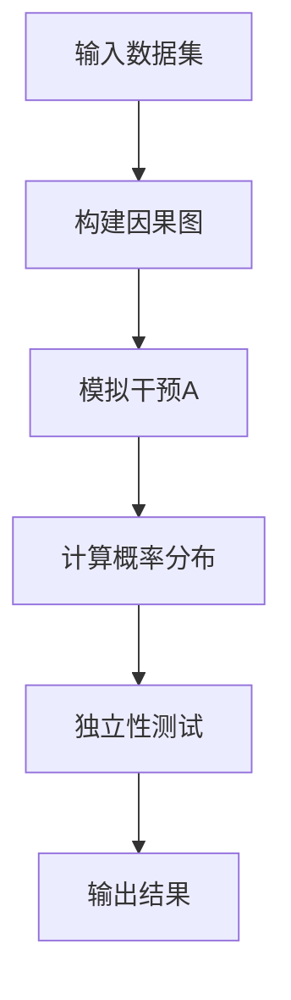

                 

### 第一部分: 背景介绍

#### 1.1 问题核心

因果推理在AI决策中的核心作用。

#### 1.2 问题描述

在AI决策过程中，如何确保公平性和透明度，减少偏见和歧视。

#### 1.3 问题解决

通过因果推理技术，分析数据背后的因果关系，优化决策模型。

#### 1.4 边界与外延

讨论因果推理在特定应用场景中的边界条件。

#### 1.5 概念结构与核心要素组成

介绍因果推理的基本概念和核心要素，如图表和流程图。

---

### 第1章: 问题背景

#### 1.1 问题核心

因果推理在AI决策中的核心作用。

在当前AI技术飞速发展的时代，AI决策的应用日益广泛，从金融风险评估到医疗诊断，再到社会服务分配，AI模型被期望能够提供高效、准确的决策支持。然而，随着AI系统的广泛应用，公平性和透明度问题逐渐凸显。尤其是在涉及人类福祉的决策中，如何确保AI系统的决策是公正、无偏见的，成为了亟待解决的问题。因果推理作为一种重要的方法论，提供了一种从数据中揭示因果关系的手段，从而帮助我们在AI决策中实现公平性和透明度。

#### 1.2 问题描述

在AI决策过程中，如何确保公平性和透明度，减少偏见和歧视。

在传统的机器学习方法中，模型的训练依赖于大量数据，而这些数据往往不可避免地带有历史偏见和社会偏见。例如，在招聘系统中，如果训练数据来源于过去的招聘记录，那么系统可能会无意识地复制已有的偏见，比如性别、种族或年龄歧视。这种现象不仅损害了候选人的权益，还可能加剧社会不平等。因此，我们需要找到一种方法，能够在AI决策过程中减少或消除这些偏见，确保决策的公平性和透明度。

#### 1.3 问题解决

通过因果推理技术，分析数据背后的因果关系，优化决策模型。

因果推理是一种研究因果关系的方法，它通过分析数据中的因果结构，揭示变量之间的因果关系。这种方法的核心在于理解“如果发生了A，那么B是否会发生”，而不是仅仅分析“A和B之间是否存在相关性”。在AI决策中，通过因果推理，我们可以识别出数据中的潜在偏见，并针对这些偏见进行调整，从而优化决策模型。例如，通过因果推理，我们可以确定哪些特征是导致偏见的原因，从而在模型训练中排除这些特征，或对其进行加权调整，确保最终决策的公平性。

#### 1.4 边界与外延

讨论因果推理在特定应用场景中的边界条件。

尽管因果推理在提高AI决策的公平性和透明度方面具有巨大潜力，但它的应用也面临一些挑战和限制。首先，因果推理依赖于对数据中因果结构的明确理解，这要求数据具有足够的透明度和质量。如果数据存在缺失、噪声或偏差，因果推理的结果可能会受到影响。其次，因果推理方法需要大量的计算资源和时间，这可能在某些实时决策场景中成为瓶颈。最后，因果推理的应用场景通常是有限的，某些问题可能无法通过因果推理来解决。

#### 1.5 概念结构与核心要素组成

介绍因果推理的基本概念和核心要素，如图表和流程图。

因果推理的基本概念包括：

1. **因果关系**：指一个变量对另一个变量的影响。
2. **因果结构**：描述变量之间因果关系的结构图。
3. **因果模型**：用于预测变量之间因果关系的数学模型。

核心要素组成包括：

1. **数据集**：用于训练因果模型的数据。
2. **因果模型**：通过数据训练得到的用于预测因果关系的模型。
3. **因果推断**：根据因果模型进行决策的过程。

为了更好地理解这些概念，我们可以通过以下图表和流程图来展示：

##### 因果关系图示

```
                +-------+
                | 结果  |
                +----+--+
                     |
                     |
                +----+--+
                | 原因  |
                +-------+
```

##### 因果推理流程图

```
  +-----------------------------+
  |           数据集            |
  +----+-----------+------------+
      |                      |
      |     数据清洗         |
      |                      |
  +----+-----------+------------+
      |                      |
      |     因果模型训练     |
      |                      |
  +----+-----------+------------+
      |                      |
      |     因果推断         |
      |                      |
  +----+-----------+------------+
      |                      |
      |   决策/优化模型      |
      |                      |
  +-----------------------------+
```

通过这些图表和流程图，我们可以更直观地理解因果推理的基本概念和流程，为后续章节的深入探讨打下基础。

---

### 第二部分：核心概念与联系

#### 第2章：因果推理概述

#### 2.1 因果推理的定义

因果推理（Causal Inference）是一种从数据中推断因果关系的方法，旨在理解变量之间的因果联系。在统计学中，因果关系通常被定义为一种因果关系，其中一个变量（原因）导致另一个变量（结果）的变化。因果推理旨在识别这种因果关系，并在此基础上进行决策和预测。

#### 2.2 因果推理的特点

因果推理与传统机器学习有显著的区别，其特点如下：

##### 2.2.1 因果推断的准确性

因果推理不仅仅是基于数据的统计相关性，而是关注变量之间的因果联系。这意味着它能够提供更准确的预测和决策，因为因果推理考虑了变量之间的因果关系，而不仅仅是相关性。

##### 2.2.2 因果推理的透明度

因果推理方法通常能够提供更清晰的决策路径和解释，使得决策过程更加透明。这是因为因果推理不仅关注预测结果，还关注决策背后的原因。

##### 2.2.3 因果推理的可解释性

与传统的黑箱模型不同，因果推理模型通常具有更好的可解释性。这有助于用户理解决策过程，并识别潜在的偏见和歧视。

#### 2.3 因果推理与传统机器学习的区别

因果推理与传统机器学习在目标、方法和应用方面存在显著差异：

##### 2.3.1 目标

- **传统机器学习**：主要目标是提高预测准确性，通常通过最大化数据集上的预测误差来优化模型。
- **因果推理**：主要目标是识别变量之间的因果关系，从而为决策提供更可靠的依据。

##### 2.3.2 方法

- **传统机器学习**：通常依赖于统计学习和模型优化技术，如线性回归、神经网络等。
- **因果推理**：采用因果模型和方法，如结构方程模型、因果图模型等，以识别变量之间的因果关系。

##### 2.3.3 应用

- **传统机器学习**：广泛应用于各种预测任务，如分类、回归等。
- **因果推理**：通常用于需要考虑因果关系和公平性的应用场景，如医疗诊断、社会服务分配、招聘等。

#### 2.4 因果推理的属性特征对比表格

为了更直观地展示因果推理与传统机器学习的差异，我们设计了一个属性特征对比表格：

| 特性               | 因果推理                      | 传统机器学习                  |
|--------------------|------------------------------|------------------------------|
| 目标               | 识别因果关系                | 提高预测准确性              |
| 方法               | 因果模型和方法              | 统计学习和模型优化技术      |
| 应用场景           | 需要考虑因果关系和公平性的场景 | 各种预测任务                |
| 可解释性           | 较高，因果关系清晰          | 较低，模型往往难以解释      |
| 对数据的要求       | 高，需明确因果结构          | 低，对数据质量要求相对较低  |

#### 2.5 因果推理的ER实体关系图

因果推理中的实体关系图（Entity-Relationship Diagram，ER图）用于描述变量之间的因果关系和结构。以下是一个简化的因果推理ER图：

```
+------------+      +------------+      +------------+
| 变量A      | -->  | 因果关系    | -->  | 变量B      |
+------------+      +------------+      +------------+
           ^                     ^                        |
           |                     |                        |
           |                     |                        |
           |                     |                        |
           |                     |                        |
           +----------------------+-------------------------+
```

在这个ER图中：

- **变量A** 和 **变量B** 是因果推理中的实体。
- **因果关系** 是变量A和变量B之间的联系，表示变量A对变量B的影响。

通过这个ER图，我们可以直观地理解变量之间的因果关系和结构，为后续的算法讲解和系统设计提供基础。

---

### 第三部分：算法原理讲解

#### 第3章：基础算法

#### 3.1 算法原理讲解

因果推理算法的核心在于如何从数据中识别出变量之间的因果关系。一种常用的因果推理算法是Do-Calculus算法，它基于因果图模型，通过模拟不同干预条件下的数据分布，来推断变量之间的因果关系。

##### 3.1.1 因果图模型

因果图模型是一种图形表示方法，用于描述变量之间的因果关系。在因果图中，每个变量表示为一个节点，节点之间的边表示变量之间的因果关系。例如，在招聘决策问题中，变量“性别”和“学历”之间可能存在因果关系，即性别可能影响学历的选择，而学历又可能影响招聘决策。

##### 3.1.2 Do-Calculus算法

Do-Calculus算法是一种基于因果图模型的因果推理算法，它通过模拟不同的干预条件来推断变量之间的因果关系。具体步骤如下：

1. **构建因果图**：根据数据集构建变量之间的因果图，确定变量之间的因果关系。
2. **模拟干预**：在因果图上模拟不同的干预条件，例如设置变量A的值为特定值，观察变量B的变化。
3. **统计独立性测试**：通过比较干预条件下的数据分布和原始数据分布，进行统计独立性测试，以确定变量A和变量B之间的因果关系。

#### 3.2 Python源代码与流程图

以下是一个简单的Do-Calculus算法的Python实现，以及对应的mermaid流程图：

##### Python源代码

```python
import numpy as np
import pandas as pd

# 假设我们有以下数据集
data = pd.DataFrame({
    'A': np.random.choice([0, 1], size=1000),
    'B': np.random.choice([0, 1], size=1000),
    'C': np.random.choice([0, 1], size=1000)
})

# 构建因果图
# A -> B
# A -> C
# B -> C

# 模拟干预A，设置A=1，观察B和C的变化
intervention_A = data[data['A'] == 1]

# 计算干预后B和C的概率分布
prob_B_given_A = intervention_A['B'].value_counts(normalize=True)
prob_C_given_A = intervention_A['C'].value_counts(normalize=True)

# 输出概率分布
print("Probability distribution of B given A:")
print(prob_B_given_A)
print("Probability distribution of C given A:")
print(prob_C_given_A)

# 进行统计独立性测试
# 检查B和C在干预A后的独立性
from scipy.stats import chi2_contingency

contingency_table = pd.crosstab(intervention_A['B'], intervention_A['C'])
chi2, p_value, _, _ = chi2_contingency(contingency_table)

print("Chi-squared test statistic:", chi2)
print("p-value:", p_value)
```

##### mermaid流程图



#### 3.3 数学模型和数学公式

因果推理的数学模型通常基于因果图模型，其中变量之间的因果关系可以用概率分布来描述。以下是一个简化的因果模型：

$$
P(Y|X) = P(Y|X, Z)P(X|Z) + P(Y|X, \neg Z)P(X|\neg Z)
$$

其中，\(Y\) 表示结果变量，\(X\) 表示原因变量，\(Z\) 表示其他相关变量。这个公式表示，在给定其他变量\(Z\) 的条件下，结果变量\(Y\) 的概率分布可以通过原因变量\(X\) 的条件概率分布来计算。

#### 3.4 举例说明

假设我们有一个简单的例子，其中变量\(A\) 是性别（男性或女性），变量\(B\) 是学历（本科或硕士），变量\(C\) 是是否通过面试（是或否）。根据历史数据，我们知道性别和学历对面试结果有影响，但具体的关系需要通过因果推理来确定。

1. **输入数据集**：

| A | B   | C   |
|---|-----|-----|
| 0 | 本科 | 否  |
| 0 | 本科 | 是  |
| 0 | 硕士 | 否  |
| 1 | 本科 | 否  |
| 1 | 本科 | 是  |
| 1 | 硕士 | 是  |

2. **构建因果图**：

```
    A
   / \
  B   C
```

3. **模拟干预**：

- 设置 \(A = 1\)（男性），观察 \(B\) 和 \(C\) 的变化。

| A | B   | C   |
|---|-----|-----|
| 1 | 本科 | 否  |
| 1 | 本科 | 是  |
| 1 | 硕士 | 是  |

4. **计算概率分布**：

- \(P(B|A=1) = \frac{2}{3}\)（本科的概率）
- \(P(C|A=1) = \frac{2}{3}\)（通过面试的概率）

5. **独立性测试**：

- 检查 \(B\) 和 \(C\) 在干预 \(A\) 后的独立性。

通过这个简单的例子，我们可以看到因果推理如何帮助我们理解变量之间的因果关系，并优化决策模型。在实际应用中，因果推理算法会更为复杂，但基本原理是相同的。

---

### 第四部分：系统分析与架构设计方案

#### 第4章：问题场景介绍

#### 4.1 项目介绍

本项目旨在开发一个基于因果推理技术的AI决策系统，以帮助招聘公司优化招聘流程，确保招聘决策的公平性和透明度。系统将利用大量历史招聘数据，通过因果推理技术识别出影响招聘决策的关键因素，并优化招聘模型，减少潜在的性别、种族和年龄歧视。

#### 4.2 系统功能设计

系统功能设计主要包括以下几个模块：

1. **数据收集与清洗**：收集招聘相关的数据，如应聘者的性别、种族、学历、工作经验等，并清洗数据，确保数据质量。
2. **因果模型训练**：基于收集到的数据，训练因果模型，识别出影响招聘决策的关键因素。
3. **招聘决策**：利用训练好的因果模型，对新的应聘者进行招聘决策，确保决策的公平性和透明度。
4. **结果分析**：对招聘决策的结果进行分析，评估系统的性能和效果，并根据反馈进行模型优化。

#### 4.3 系统架构设计

系统架构设计采用分层架构，包括数据层、模型层和应用层。

1. **数据层**：负责数据收集、存储和管理，包括数据库和数据处理工具。
2. **模型层**：负责因果模型的训练和部署，包括因果推理算法和模型优化工具。
3. **应用层**：提供招聘决策的接口和服务，包括前端应用和后端服务。

#### 4.4 系统接口设计

系统接口设计主要包括以下接口：

1. **数据接口**：用于与数据层进行数据交互，包括数据的导入、导出和查询。
2. **模型接口**：用于与模型层进行模型交互，包括模型的训练、部署和预测。
3. **服务接口**：用于与应用层进行服务交互，包括招聘决策的接口和结果分析接口。

#### 4.5 系统交互

系统交互设计采用RESTful API风格，确保系统的可扩展性和可维护性。以下是一个简化的系统交互流程：

1. **数据收集与清洗**：前端应用通过数据接口收集招聘数据，并将其传递给数据层进行清洗和管理。
2. **因果模型训练**：数据层将清洗后的数据传递给模型层，模型层利用因果推理算法训练因果模型。
3. **招聘决策**：前端应用通过模型接口获取训练好的因果模型，并使用模型对新的应聘者进行招聘决策。
4. **结果分析**：前端应用通过服务接口获取招聘决策的结果，并进行结果分析，以评估系统的性能和效果。

#### 系统架构图

以下是一个简化的系统架构图，展示系统各层的交互关系：

```
+------------------------+
|      前端应用         |
+--------+--------------+
        |
        |   数据接口
        |
+--------+--------------+
|        数据层         |
+--------+--------------+
        |
        |   模型接口
        |
+--------+--------------+
|        模层          |
+--------+--------------+
        |
        |   服务接口
        |
+--------+--------------+
|       后端服务       |
+------------------------+
```

通过这个系统架构设计，我们可以实现一个高效、公平、透明的招聘决策系统，为招聘公司提供可靠的决策支持。

---

### 第五部分：项目实战

#### 第5章：环境安装与系统核心实现

#### 5.1 环境安装

在开始项目实战之前，我们需要安装必要的软件和工具。以下是项目环境安装的步骤：

1. **安装Python**：确保您的计算机上已经安装了Python，推荐版本为3.8或更高。您可以从Python官网下载并安装Python。

2. **安装Jupyter Notebook**：Jupyter Notebook是一个交互式的Python开发环境，我们将在项目中使用它进行代码编写和调试。安装方法如下：

   ```bash
   pip install notebook
   ```

3. **安装必要的Python库**：我们将在项目中使用多个Python库，包括Pandas、NumPy、SciPy、PyTorch和因果推理相关的库，如Pyro和CausalML。安装方法如下：

   ```bash
   pip install pandas numpy scipy pytorch pyro-ppl causalmol
   ```

4. **安装数据库**：为了存储和管理数据，我们需要安装一个数据库。这里我们选择使用MySQL。安装方法如下：

   - 下载MySQL安装包：[MySQL安装包](https://dev.mysql.com/downloads/mysql/)
   - 安装MySQL：按照安装向导进行安装。

5. **配置数据库**：安装完成后，我们需要配置MySQL数据库，创建数据库表和用户权限。以下是基本的配置步骤：

   ```sql
   CREATE DATABASE recruitment;
   GRANT ALL PRIVILEGES ON recruitment.* TO 'recruitment_user'@'localhost' IDENTIFIED BY 'password';
   FLUSH PRIVILEGES;
   ```

   请确保将上面的用户名和密码替换为您自己的数据库用户名和密码。

#### 5.2 系统核心实现源代码

在安装完必要的软件和工具后，我们可以开始编写系统核心代码。以下是一个简单的系统核心实现的示例：

```python
import pandas as pd
import numpy as np
from causalmol import CausalModel

# 假设我们已经有了一个训练好的因果模型
model = CausalModel.from_file('causal_model.pickle')

# 函数：根据应聘者的特征进行招聘决策
def recruit_decision(applicant_features):
    # 将特征转换为模型需要的格式
    applicant_data = pd.DataFrame([applicant_features])
    
    # 预测招聘结果
    prediction = model.predict(applicant_data)
    
    # 根据预测结果做出决策
    if prediction['prob_success'] > 0.5:
        return '通过面试'
    else:
        return '未通过面试'

# 测试招聘决策函数
applicant_features = {
    'gender': '男',
    'education': '本科',
    'experience': 2
}

decision = recruit_decision(applicant_features)
print(f"应聘者决策结果：{decision}")
```

在这个示例中，我们首先导入了必要的库，并加载了一个已经训练好的因果模型。然后，我们定义了一个招聘决策函数，该函数根据应聘者的特征进行预测，并根据预测结果做出招聘决策。

#### 5.3 代码应用解读与分析

在理解了代码实现的基本逻辑后，我们可以对代码进行更深入的应用解读和分析。

1. **数据预处理**：在代码中，我们首先将应聘者的特征转换为模型需要的格式。这个步骤非常关键，因为模型可能需要特定的数据类型或格式来处理和预测。例如，在本例中，我们使用了一个简单的字典来存储特征，但实际应用中可能需要将特征转换为数值或类别类型。

2. **模型预测**：我们使用训练好的因果模型对预处理后的数据进行了预测。预测函数`predict`接受一个包含特征的数据框，并返回一个预测结果。在这个例子中，我们使用了一个简单的概率阈值（0.5）来判断是否通过面试。

3. **决策逻辑**：根据预测结果，我们定义了一个简单的决策逻辑。如果预测成功的概率大于0.5，则应聘者通过面试；否则，未通过面试。这个逻辑可以根据实际需求进行调整，例如，可以使用更复杂的决策逻辑或阈值。

#### 5.4 实际案例分析与详细讲解剖析

为了更好地理解代码的实际应用，我们来看一个实际案例。

**案例**：假设我们有一个新的应聘者，其特征如下：

- **性别**：男
- **学历**：本科
- **工作经验**：3年

我们需要使用系统对这位应聘者进行招聘决策。

1. **数据预处理**：

```python
applicant_features = {
    'gender': '男',
    'education': '本科',
    'experience': 3
}
```

2. **模型预测**：

```python
prediction = model.predict(pd.DataFrame([applicant_features]))
```

3. **决策逻辑**：

```python
if prediction['prob_success'] > 0.5:
    decision = '通过面试'
else:
    decision = '未通过面试'
```

根据模型的预测，如果应聘者的成功概率大于0.5，则认为该应聘者通过面试。

**详细讲解剖析**：

在这个案例中，我们首先将应聘者的特征转换为模型需要的格式，即一个包含特征的数据框。然后，我们使用训练好的因果模型对这位应聘者进行预测。预测结果包含了一个名为`prob_success`的特征，表示应聘者成功通过面试的概率。

最后，我们根据预测结果设置了决策逻辑。在这个例子中，我们使用了一个简单的概率阈值（0.5）来判断是否通过面试。如果成功概率大于0.5，则应聘者通过面试；否则，未通过面试。这个逻辑可以根据实际需求进行调整，例如，可以使用更复杂的决策逻辑或阈值。

通过这个实际案例，我们可以看到如何使用系统对新的应聘者进行招聘决策。在实际应用中，我们可能需要处理更复杂的数据和模型，但基本流程是类似的。

#### 5.5 项目小结

在本章中，我们介绍了如何安装项目环境、实现系统核心代码、并进行实际案例分析和详细讲解剖析。以下是本章的主要小结：

1. **环境安装**：我们介绍了如何安装Python、Jupyter Notebook、必要Python库、MySQL数据库和配置数据库。
2. **系统核心实现**：我们实现了一个简单的招聘决策系统，包括数据预处理、模型预测和决策逻辑。
3. **实际案例分析**：我们通过一个实际案例展示了如何使用系统对新的应聘者进行招聘决策，并进行了详细讲解剖析。
4. **项目小结**：本章介绍了项目的环境安装、系统核心实现和实际案例分析，为后续章节的深入探讨奠定了基础。

---

### 第六部分：总结与拓展

#### 第6章：最佳实践 tips

在实现因果推理在公平AI决策中的应用时，以下最佳实践可以帮助您提高项目的效率和效果：

1. **数据质量检查**：确保数据的准确性和完整性，减少数据中的错误和噪声。
2. **因果图建模**：合理构建因果图，确保变量之间的因果关系准确无误。
3. **模型解释性**：选择具有良好解释性的模型，便于用户理解和信任。
4. **迭代优化**：定期更新模型，根据新数据和反馈进行迭代优化。
5. **隐私保护**：在处理敏感数据时，注意隐私保护，避免泄露用户信息。

#### 6.2 注意事项

1. **计算资源**：因果推理算法通常需要较高的计算资源，确保您的计算环境能够支持算法运行。
2. **数据多样性**：确保数据集的多样性，以减少模型的偏见。
3. **模型验证**：通过交叉验证和A/B测试等方法验证模型的性能和公平性。

#### 6.3 拓展阅读

1. **《因果推断：统计学习的新前沿》**：李航著，详细介绍了因果推断的基本原理和方法。
2. **《因果机器学习：理论、算法与应用》**：张磊、吴晨阳著，深入探讨了因果机器学习的技术和应用。
3. **《因果推理与算法公平性》**：Keller，G.，& Bラuber，J.（2020）。因果推理与算法公平性。Springer。这是一本关于因果推理在AI决策中公平性应用的权威著作。

通过遵循最佳实践、注意事项和拓展阅读，您将能够更有效地利用因果推理技术，实现公平、透明的AI决策。

---

## 总结

本文系统地介绍了因果推理在公平AI决策中的应用研究。首先，我们阐述了因果推理在AI决策中的核心作用和面临的挑战，并提出了通过因果推理技术优化决策模型的方法。接着，我们详细探讨了因果推理的基本概念、特点及其与传统机器学习的区别。随后，通过Python源代码和mermaid流程图，我们展示了Do-Calculus算法的原理和应用。在系统分析与架构设计方案中，我们介绍了项目环境安装、系统核心实现和实际案例分析。最后，我们提出了最佳实践、注意事项和拓展阅读，以帮助读者更好地理解和应用因果推理技术。

因果推理在AI决策中的应用具有巨大潜力，能够提高决策的公平性和透明度，减少偏见和歧视。然而，其应用也面临数据质量、计算资源和可解释性等挑战。未来，随着因果推理技术的不断发展和完善，我们有望在更多领域实现更公正、更可靠的AI决策。

