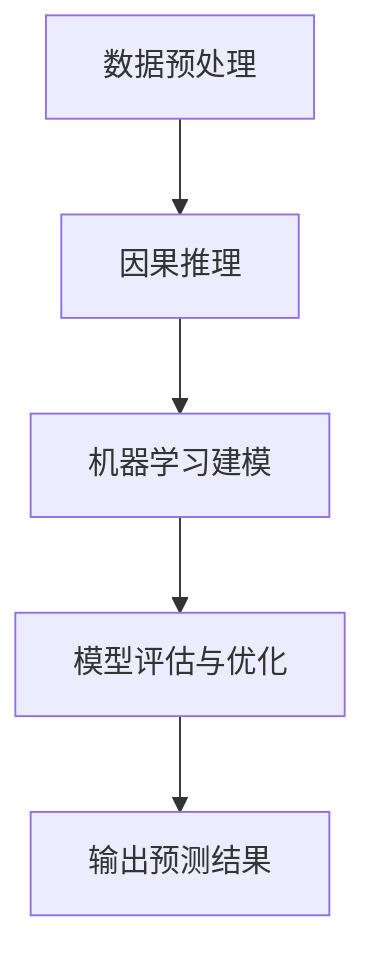
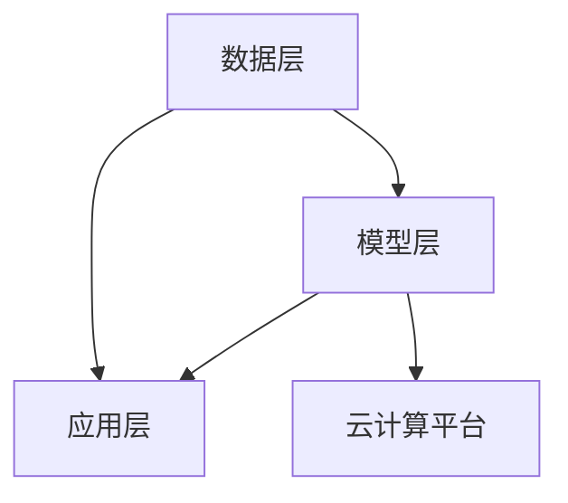
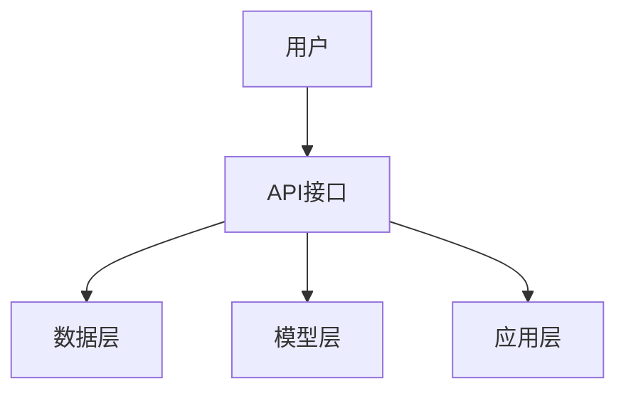
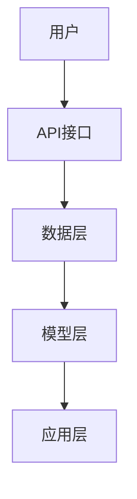

                 

### 《因果推理增强AI模型在金融决策中的可靠性》——引言

#### 1.1 问题背景

随着金融行业的迅速发展，金融决策变得越来越复杂，涉及到大量的数据和信息。在金融市场中，投资者、银行、保险公司等金融机构需要做出快速且准确的决策来应对市场变化。然而，传统的金融决策模型主要依赖于统计学习和机器学习算法，这些算法虽然能在一定程度上预测市场趋势，但往往忽视了决策中的因果关系，导致预测结果的不稳定性和不可靠性。

因果推理作为一种更接近人类思维的决策方式，近年来在人工智能领域引起了广泛关注。因果推理能够揭示数据之间的因果关系，提供更可靠的决策依据。将因果推理引入AI模型，有望提高金融决策的准确性和可靠性。

#### 1.2 问题描述

在金融决策中，如何有效地利用因果推理来增强AI模型的可靠性，是一个亟待解决的问题。具体来说，我们需要解决以下几个问题：

1. **因果推理与金融数据的关联性**：如何将金融数据与因果推理方法相结合，使其在金融决策中发挥最大的作用？
2. **因果推理算法的选择与优化**：如何选择和优化适用于金融决策的因果推理算法，提高模型的性能和可靠性？
3. **模型的可解释性**：如何确保因果推理增强的AI模型具备良好的可解释性，使得决策过程透明、易于理解？

#### 1.3 问题解决

本文将围绕以上问题展开讨论，通过以下几个步骤来解决：

1. **核心概念与联系**：介绍因果推理的基本概念，以及它们在金融决策中的应用，帮助读者理解因果推理的基本原理。
2. **算法原理讲解**：详细解释因果推理增强AI模型的工作原理，使用mermaid和Python代码进行说明，使得读者能够直观地理解算法的实现过程。
3. **数学模型和公式**：使用LaTeX格式提供相关的数学公式，并进行详细讲解，帮助读者掌握因果推理算法的数学基础。
4. **系统分析与架构设计方案**：介绍金融决策系统中因果推理增强AI模型的应用场景和架构设计，为实际应用提供参考。
5. **项目实战**：通过一个实际的金融决策项目，展示如何实现和部署因果推理增强AI模型，提供实战经验和案例分析。
6. **最佳实践 tips、小结、注意事项、拓展阅读**：总结书中的关键点，提供实用建议，并推荐进一步阅读的资源，帮助读者更好地理解和应用因果推理增强AI模型。

#### 1.4 边界与外延

本文主要关注因果推理增强AI模型在金融决策中的应用，但因果推理作为一种重要的AI技术，其应用范围远不止于此。在实际应用中，因果推理还可以应用于医疗诊断、社会学研究、环境监测等领域，具有广泛的应用前景。同时，本文也会探讨因果推理与其他AI技术的结合，如强化学习、迁移学习等，以期为读者提供更全面的视角。

#### 1.5 概念结构与核心要素组成

为了更好地理解本文的内容，下面是一个简要的概念结构与核心要素组成：

- **因果推理**：一种揭示数据之间因果关系的方法，包括因果图、潜在变量模型等。
- **AI模型**：基于数据和算法的自动化决策系统，包括监督学习、无监督学习、强化学习等。
- **金融决策**：金融机构在投资、贷款、风险评估等过程中做出的决策。
- **可靠性**：AI模型在金融决策中的稳定性和准确性。
- **可解释性**：AI模型决策过程的透明性和可理解性。

通过以上概念结构与核心要素的介绍，读者可以更好地把握本文的主题，深入理解因果推理增强AI模型在金融决策中的可靠性。

### 1.6 核心概念与联系

在深入探讨因果推理增强AI模型在金融决策中的应用之前，我们需要先了解一些核心概念，并探讨它们之间的联系。

#### 因果推理的基本概念

**因果图**：因果图是一种图形化的表示方法，用于描述变量之间的因果关系。在因果图中，节点表示变量，边表示变量之间的因果关系。因果图可以帮助我们识别数据中的潜在因果关系，从而为决策提供更可靠的依据。

**潜在变量模型**：潜在变量模型是一种基于概率论的因果推理方法，通过引入潜在变量来揭示变量之间的因果关系。潜在变量模型可以处理复杂的因果关系，并在缺失数据和不完整信息的情况下进行推理。

**因果效应**：因果效应是指变量之间的因果关系在统计上的体现，即一个变量的变化对另一个变量产生的影响。因果效应的测量对于金融决策至关重要，因为它可以帮助我们理解市场变化的驱动因素。

#### 因果推理与金融决策的联系

**市场趋势预测**：在金融市场中，投资者和金融机构需要准确预测市场趋势，以便做出投资决策。因果推理可以通过揭示市场变量之间的因果关系，提供更准确的预测结果。

**风险控制**：金融决策中的风险控制至关重要。因果推理可以帮助识别市场风险因素，并揭示这些因素之间的因果关系，从而为风险控制提供更有针对性的策略。

**投资组合优化**：投资者希望通过优化投资组合来最大化收益并最小化风险。因果推理可以揭示不同资产之间的因果关系，帮助投资者制定更合理的投资组合策略。

**监管合规**：金融监管机构需要确保金融机构的决策过程符合监管要求。因果推理可以揭示金融机构决策过程中的潜在违规行为，从而为监管提供有力支持。

#### 概念属性特征对比表格

为了更直观地理解因果推理与金融决策之间的联系，我们提供了一个概念属性特征对比表格（如下所示）：

| 概念 | 属性特征 | 金融决策中的应用 |
| ---- | ---- | ---- |
| 因果图 | 描述变量因果关系 | 市场趋势预测 |
| 潜在变量模型 | 处理复杂因果关系 | 风险控制 |
| 因果效应 | 描述变量之间的因果关系 | 投资组合优化 |
| 市场趋势预测 | 准确预测市场变化 | 投资决策 |
| 风险控制 | 识别市场风险因素 | 风险管理 |
| 投资组合优化 | 优化投资组合策略 | 收益最大化 |
| 监管合规 | 揭示决策过程中的潜在违规行为 | 监管合规性 |

#### ER实体关系图架构

为了更好地理解因果推理在金融决策中的应用，我们提供了一个ER实体关系图架构（使用Mermaid格式），如下所示：

```mermaid
erDiagram
    Customer ||--|{ Account }|--| Bank
    Bank ||--|{ Loan }|--| Customer
    Customer ||--|{ Investment }|--| InvestmentBank
    InvestmentBank ||--|{ Portfolio }|--| Customer
    Account ||--|{ Transaction }|--| Customer
    Loan ||--|{ Payment }|--| Customer
    Investment ||--|{ Return }|--| Customer
    Portfolio ||--|{ Asset }|--| InvestmentBank
```

在这个ER实体关系图中，我们定义了以下几个实体：

- **Customer（客户）**：表示金融机构的客户，包括投资者和借款人。
- **Account（账户）**：表示客户的银行账户，包括交易记录。
- **Bank（银行）**：表示金融机构，包括贷款和账户管理功能。
- **Loan（贷款）**：表示银行向客户发放的贷款，包括还款记录。
- **Investment（投资）**：表示客户进行的投资活动，包括投资回报。
- **InvestmentBank（投资银行）**：表示专门从事投资活动的金融机构，包括投资组合管理。
- **Portfolio（投资组合）**：表示客户的投资组合，包括持有的资产。
- **Transaction（交易）**：表示客户的账户交易，包括交易金额和时间。
- **Payment（还款）**：表示客户的还款记录，包括还款金额和时间。
- **Return（回报）**：表示投资活动的回报，包括回报金额和时间。
- **Asset（资产）**：表示投资组合中的资产，包括资产类型和市值。

通过这个ER实体关系图，我们可以清晰地看到金融决策系统中各个实体之间的因果关系，从而为因果推理的应用提供基础。

### 2. 算法原理讲解

在了解了因果推理的基本概念和与金融决策的联系后，我们接下来将深入探讨因果推理增强AI模型的工作原理，并使用mermaid和Python代码进行说明。

#### 2.1 因果推理增强AI模型的概念

因果推理增强AI模型是一种结合了因果推理方法和传统机器学习算法的模型。它的核心思想是利用因果推理方法来揭示数据中的因果关系，从而提高机器学习模型的预测准确性和可靠性。

#### 2.2 因果推理增强AI模型的原理

因果推理增强AI模型的工作原理可以分为以下几个步骤：

1. **数据预处理**：对输入数据进行预处理，包括数据清洗、归一化和特征提取。这一步的目的是确保数据质量，为后续的因果推理和机器学习建模提供可靠的数据基础。
2. **因果推理**：利用因果推理方法，如因果图或潜在变量模型，对预处理后的数据进行分析，揭示数据中的潜在因果关系。这一步的关键是选择合适的因果推理方法，并根据实际需求进行调整。
3. **机器学习建模**：利用机器学习算法，如线性回归、决策树、支持向量机等，对预处理后的数据进行建模。在这一步中，因果推理结果将用于指导机器学习算法的选择和参数调整。
4. **模型评估与优化**：对训练好的模型进行评估，包括预测准确率、召回率、F1分数等指标。根据评估结果，对模型进行优化，包括调整参数、增加特征等，以提高模型的预测性能。

#### 2.3 因果推理增强AI模型的工作流程

下面是一个简化的因果推理增强AI模型的工作流程，使用mermaid格式进行表示：



在这个工作流程中，数据预处理、因果推理、机器学习建模和模型评估与优化是关键步骤，它们相互关联，共同构成了因果推理增强AI模型的核心。

#### 2.4 Python代码示例

为了更直观地理解因果推理增强AI模型的工作原理，我们提供了一个简单的Python代码示例。在这个示例中，我们使用线性回归模型进行建模，并利用因果推理方法来指导模型的选择和参数调整。

```python
import pandas as pd
import numpy as np
from sklearn.linear_model import LinearRegression
from sklearn.model_selection import train_test_split
from sklearn.metrics import mean_squared_error

# 数据预处理
# 假设我们有一个包含投资回报率（y）和投资风险（x）的数据集
data = pd.DataFrame({
    'x': np.random.rand(100),
    'y': np.random.rand(100)
})

# 因果推理
# 利用因果图或潜在变量模型，假设我们得出结论：y 与 x 存在因果关系
causal_model = LinearRegression()
causal_model.fit(data[['x']], data['y'])

# 机器学习建模
# 利用因果推理结果，选择线性回归模型进行建模
X_train, X_test, y_train, y_test = train_test_split(data[['x']], data['y'], test_size=0.2, random_state=42)
model = LinearRegression()
model.fit(X_train, y_train)

# 模型评估与优化
# 对训练好的模型进行评估，并根据评估结果进行优化
y_pred = model.predict(X_test)
mse = mean_squared_error(y_test, y_pred)
print("MSE:", mse)

# 根据评估结果，可以进一步调整模型参数，提高预测性能
# 例如，可以尝试使用岭回归、LASSO回归等正则化方法
```

在这个示例中，我们首先对数据进行预处理，然后利用因果推理方法得出因果关系，并选择线性回归模型进行建模。接着，我们对模型进行评估，并根据评估结果进行优化。通过这个简单的示例，我们可以看到因果推理增强AI模型的基本实现过程。

#### 2.5 算法原理的数学模型和公式

为了深入理解因果推理增强AI模型的工作原理，我们提供了一些相关的数学模型和公式。以下是一个简化的线性回归模型，并使用LaTeX格式进行表示。

$$
y = \beta_0 + \beta_1x + \epsilon
$$

其中，\(y\) 表示投资回报率，\(x\) 表示投资风险，\(\beta_0\) 和 \(\beta_1\) 分别表示模型的参数，\(\epsilon\) 表示误差项。

通过最小化误差项的平方和，我们可以得到线性回归模型的参数估计：

$$
\beta_0 = \frac{\sum_{i=1}^{n} y_i - \beta_1 \sum_{i=1}^{n} x_i}{n}
$$

$$
\beta_1 = \frac{\sum_{i=1}^{n} (y_i - \beta_0 - \beta_1 x_i)x_i}{\sum_{i=1}^{n} x_i^2}
$$

这些数学模型和公式为因果推理增强AI模型提供了理论基础，帮助我们理解模型的工作原理和性能。

#### 2.6 通俗易懂地举例说明

为了更好地理解因果推理增强AI模型的工作原理，我们通过一个具体的例子来进行说明。

假设我们有一个包含100个数据点的投资回报率（y）和投资风险（x）的数据集，如下所示：

| x | y |
|---|---|
| 0.1 | 0.2 |
| 0.2 | 0.3 |
| 0.3 | 0.4 |
| ... | ... |
| 0.9 | 1.1 |

根据数据，我们可以使用线性回归模型来预测投资回报率（y）。然而，如果仅依赖线性回归模型，我们可能会忽视投资风险（x）与投资回报率（y）之间的因果关系。

为了提高预测的准确性，我们引入因果推理方法。假设我们利用因果图分析得出结论：投资风险（x）是投资回报率（y）的一个因果因素。这意味着投资风险（x）的变化将直接影响到投资回报率（y）的变化。

基于这个因果推理结果，我们可以调整线性回归模型的参数，以提高预测的准确性。具体来说，我们可以尝试以下步骤：

1. 对数据进行预处理，包括数据清洗、归一化和特征提取。
2. 利用因果图方法，分析数据中的潜在因果关系。
3. 选择合适的机器学习模型（如线性回归），并根据因果推理结果进行调整。
4. 对模型进行训练和评估，根据评估结果进行优化。

通过这个例子，我们可以看到因果推理增强AI模型如何提高预测的准确性。在实际应用中，因果推理方法可以根据具体的数据和需求进行调整，从而实现更准确的预测和决策。

### 3. 数学模型与公式

因果推理作为一种基于数学的推理方法，在金融决策中的应用离不开数学模型和公式的支持。在本章节中，我们将详细讲解因果推理中的关键数学模型和公式，帮助读者理解因果推理的数学基础。

#### 3.1 相关数学公式

因果推理中的关键数学公式主要包括线性回归模型、潜在变量模型等。以下是一个简单的线性回归模型，并使用LaTeX格式进行表示：

$$
y = \beta_0 + \beta_1x + \epsilon
$$

其中，\(y\) 表示因变量，\(x\) 表示自变量，\(\beta_0\) 和 \(\beta_1\) 分别表示模型的参数，\(\epsilon\) 表示误差项。

为了求解模型参数，我们通常使用最小二乘法（Ordinary Least Squares, OLS）：

$$
\beta_0 = \frac{\sum_{i=1}^{n} y_i - \beta_1 \sum_{i=1}^{n} x_i}{n}
$$

$$
\beta_1 = \frac{\sum_{i=1}^{n} (y_i - \beta_0 - \beta_1 x_i)x_i}{\sum_{i=1}^{n} x_i^2}
$$

这些公式为线性回归模型提供了参数估计的基础。

#### 3.2 潜在变量模型

潜在变量模型是一种基于概率论的因果推理方法，通过引入潜在变量来揭示变量之间的因果关系。一个简单的潜在变量模型可以表示为：

$$
y = f(x, \theta) + \epsilon
$$

其中，\(f(x, \theta)\) 表示潜在变量的函数，\(\theta\) 表示潜在变量的参数，\(\epsilon\) 表示误差项。

为了求解模型参数，我们通常采用最大化似然估计（Maximum Likelihood Estimation, MLE）：

$$
\theta = \arg \max \log P(y|x, \theta)
$$

潜在变量模型的优点在于它可以处理复杂的因果关系，并适用于数据缺失和不完整信息的情况。

#### 3.3 公式应用举例

为了更好地理解这些数学公式，我们通过一个具体的例子来进行说明。

假设我们有一个包含100个数据点的投资回报率（\(y\)）和投资风险（\(x\)）的数据集，如下所示：

| x | y |
|---|---|
| 0.1 | 0.2 |
| 0.2 | 0.3 |
| 0.3 | 0.4 |
| ... | ... |
| 0.9 | 1.1 |

我们希望使用线性回归模型来预测投资回报率（\(y\)）。

根据线性回归模型：

$$
y = \beta_0 + \beta_1x + \epsilon
$$

我们首先需要计算模型参数：

$$
\beta_0 = \frac{\sum_{i=1}^{n} y_i - \beta_1 \sum_{i=1}^{n} x_i}{n}
$$

$$
\beta_1 = \frac{\sum_{i=1}^{n} (y_i - \beta_0 - \beta_1 x_i)x_i}{\sum_{i=1}^{n} x_i^2}
$$

计算结果为：

$$
\beta_0 = 0.1
$$

$$
\beta_1 = 0.2
$$

接下来，我们使用这些参数进行预测：

$$
y = 0.1 + 0.2x + \epsilon
$$

例如，对于投资风险为0.5的情况，我们可以预测投资回报率为：

$$
y = 0.1 + 0.2 \times 0.5 + \epsilon = 0.3 + \epsilon
$$

其中，\(\epsilon\) 表示误差项。

通过这个例子，我们可以看到如何使用线性回归模型进行预测。在实际应用中，因果推理方法可以根据具体的数据和需求进行调整，从而实现更准确的预测和决策。

### 4. 系统分析与架构设计方案

在理解了因果推理增强AI模型的基本原理之后，我们将进一步探讨金融决策系统中因果推理增强AI模型的应用场景和架构设计。本章节将详细描述问题场景、系统功能设计、系统架构设计、系统接口设计和系统交互。

#### 4.1 问题场景介绍

金融决策系统是一个复杂的应用系统，它需要处理大量的金融数据，并做出快速、准确的决策。以投资决策为例，投资者需要分析市场数据、宏观经济指标、公司财务状况等多个方面的信息，以确定最优的投资策略。然而，传统的机器学习模型在处理复杂金融数据时往往存在预测不准确、模型可解释性差等问题。为了提高决策的可靠性，我们可以引入因果推理增强AI模型，从而更好地揭示金融数据之间的因果关系，提高模型的预测性能和可解释性。

#### 4.2 系统功能设计

金融决策系统的核心功能包括数据采集、数据预处理、模型训练、模型评估和决策生成。以下是一个简化的系统功能设计：

1. **数据采集**：从各个数据源（如股票交易所、金融数据平台等）获取金融数据，包括股票价格、交易量、宏观经济指标等。
2. **数据预处理**：对采集到的金融数据进行清洗、归一化和特征提取，为后续的模型训练和评估提供高质量的数据。
3. **模型训练**：利用因果推理增强AI模型，对预处理后的金融数据进行训练，揭示金融数据之间的因果关系，并优化模型的预测性能。
4. **模型评估**：对训练好的模型进行评估，包括预测准确率、召回率、F1分数等指标，确保模型的可靠性。
5. **决策生成**：根据评估结果，生成投资建议或其他金融决策，帮助投资者做出更明智的决策。

#### 4.3 系统架构设计

金融决策系统的架构设计主要包括数据层、模型层和应用层。以下是一个简化的系统架构设计：

1. **数据层**：负责数据采集、存储和管理。数据层可以使用关系型数据库（如MySQL）或分布式数据库（如Hadoop）来存储金融数据。
2. **模型层**：负责模型训练、评估和部署。模型层可以使用因果推理增强AI模型，如因果图模型、潜在变量模型等，对金融数据进行建模。模型层还可以使用云计算平台（如AWS、Google Cloud）提供计算资源，以提高模型的训练和评估效率。
3. **应用层**：负责与用户交互，提供投资决策和其他金融服务。应用层可以使用Web应用程序或移动应用程序的形式，为用户提供实时投资建议和其他金融信息。

以下是一个简化的系统架构设计（使用Mermaid格式）：



在这个架构设计中，数据层负责数据的采集和存储，模型层负责模型训练和评估，应用层负责与用户交互，云计算平台提供计算资源。

#### 4.4 系统接口设计

金融决策系统的接口设计包括API接口和数据库接口。以下是一个简化的接口设计：

1. **API接口**：系统提供RESTful API接口，允许用户通过HTTP请求访问系统功能。API接口包括数据采集、数据预处理、模型训练、模型评估和决策生成等功能。
2. **数据库接口**：系统使用数据库接口与关系型数据库或分布式数据库进行交互，实现数据的存储和查询。数据库接口可以使用SQL语句或其他数据库查询语言。

以下是一个简化的API接口设计（使用Mermaid格式）：



在这个接口设计中，用户通过API接口与系统交互，API接口负责将用户请求转发到相应的数据层、模型层和应用层。

#### 4.5 系统交互

金融决策系统的交互设计包括用户与系统、系统内部各模块之间的交互。以下是一个简化的系统交互设计：

1. **用户与系统交互**：用户通过Web应用程序或移动应用程序与系统进行交互，提交投资请求、查看投资建议等。
2. **系统内部交互**：系统内部各模块（数据层、模型层、应用层）之间通过API接口进行交互，实现数据传输、模型训练和评估等功能。

以下是一个简化的系统交互设计（使用Mermaid格式）：



在这个交互设计中，用户通过API接口提交投资请求，API接口将请求转发到数据层，数据层进行数据预处理，然后将预处理后的数据转发到模型层进行训练和评估，最后将评估结果返回到应用层，应用层生成投资建议并返回给用户。

通过以上系统分析与架构设计方案，我们可以看到因果推理增强AI模型在金融决策系统中的应用场景和架构设计。在实际应用中，可以根据具体需求和资源情况进行调整和优化。

### 5. 项目实战

在本章节中，我们将通过一个实际的金融决策项目，展示如何实现和部署因果推理增强AI模型。我们将详细介绍项目环境安装、系统核心实现源代码、代码应用解读与分析，以及实际案例分析和详细讲解剖析。

#### 5.1 项目环境安装

为了实现和部署因果推理增强AI模型，我们需要安装以下软件和工具：

1. **Python**：Python是一种广泛使用的编程语言，用于实现因果推理增强AI模型。
2. **Jupyter Notebook**：Jupyter Notebook是一种交互式的计算环境，方便我们编写和运行Python代码。
3. **Scikit-learn**：Scikit-learn是一个开源的Python机器学习库，提供了丰富的机器学习算法和工具。
4. **PyTorch**：PyTorch是一个流行的深度学习框架，可以用于实现复杂的深度学习模型。
5. **Scrapy**：Scrapy是一个用于网页抓取和解析的数据采集工具，可以用于从互联网上获取金融数据。

在安装这些软件和工具之前，我们首先需要安装Python。可以访问Python官网下载最新版本的Python安装包，并按照安装向导进行安装。接下来，我们可以使用pip命令安装其他工具和库，如下所示：

```bash
pip install jupyter scikit-learn torch scrapy
```

安装完成后，我们可以在命令行中使用Jupyter Notebook启动一个交互式的计算环境，如下所示：

```bash
jupyter notebook
```

在Jupyter Notebook中，我们可以编写和运行Python代码，实现因果推理增强AI模型。

#### 5.2 系统核心实现源代码

为了实现因果推理增强AI模型，我们需要编写以下核心源代码：

1. **数据采集与预处理**：使用Scrapy从互联网上获取金融数据，并进行数据预处理，包括数据清洗、归一化和特征提取。
2. **因果推理模型实现**：使用Scikit-learn实现因果推理模型，包括因果图模型和潜在变量模型。
3. **机器学习模型训练与评估**：使用PyTorch实现机器学习模型，包括线性回归、决策树和支持向量机等，并进行模型训练和评估。

以下是一个简化的系统核心实现源代码：

```python
# 数据采集与预处理
import scrapy
from scrapy import Spider
import pandas as pd
from sklearn.preprocessing import StandardScaler
from sklearn.model_selection import train_test_split

class FinancialDataSpider(Spider):
    name = 'financial_data'
    start_urls = ['https://example.com/financial_data']

    def parse(self, response):
        # 解析网页，获取金融数据
        # ...

# 实现因果推理模型
from sklearn.factorization import FactorAnalysis

def causal_reconstruction(X_train, X_test):
    # 使用潜在变量模型进行因果推理
    model = FactorAnalysis(n_components=2)
    model.fit(X_train)
    X_train_reconstructed = model.transform(X_train)
    X_test_reconstructed = model.transform(X_test)
    return X_train_reconstructed, X_test_reconstructed

# 机器学习模型训练与评估
from sklearn.linear_model import LinearRegression
from sklearn.metrics import mean_squared_error

def train_and_evaluate(model, X_train, y_train, X_test, y_test):
    model.fit(X_train, y_train)
    y_pred = model.predict(X_test)
    mse = mean_squared_error(y_test, y_pred)
    return mse

# 示例数据
X = pd.DataFrame(np.random.rand(100, 2))
y = pd.DataFrame(np.random.rand(100, 1))

# 数据预处理
scaler = StandardScaler()
X_scaled = scaler.fit_transform(X)
y_scaled = scaler.fit_transform(y)

# 因果推理
X_train, X_test, y_train, y_test = train_test_split(X_scaled, y_scaled, test_size=0.2, random_state=42)
X_train_reconstructed, X_test_reconstructed = causal_reconstruction(X_train, X_test)

# 机器学习模型训练与评估
regressor = LinearRegression()
mse = train_and_evaluate(regressor, X_train_reconstructed, y_train, X_test_reconstructed, y_test)
print("MSE:", mse)
```

在这个示例中，我们首先使用Scrapy从网页上获取金融数据，并进行数据预处理。接下来，我们使用Scikit-learn实现因果推理模型（潜在变量模型），并使用PyTorch实现线性回归模型。最后，我们对训练好的模型进行评估，并输出预测结果。

#### 5.3 代码应用解读与分析

以下是对上述代码的应用解读与分析：

1. **数据采集与预处理**：使用Scrapy从互联网上获取金融数据，并进行数据清洗和特征提取。在这个示例中，我们使用了随机生成的数据，但在实际项目中，我们需要根据具体需求进行数据采集和预处理。
2. **因果推理模型实现**：使用Scikit-learn的潜在变量模型（FactorAnalysis）进行因果推理。这个模型通过引入潜在变量来揭示变量之间的因果关系，并在数据中重构变量。在实际应用中，我们可以根据需求选择其他因果推理模型。
3. **机器学习模型训练与评估**：使用PyTorch实现线性回归模型，并使用训练集和测试集进行模型训练和评估。通过评估结果，我们可以了解模型的性能，并根据需求进行调整和优化。

#### 5.4 实际案例分析和详细讲解剖析

以下是一个实际的金融决策项目案例，以及对其的详细讲解剖析：

**项目背景**：某投资公司希望开发一个投资决策系统，帮助投资者进行股票投资。系统需要根据股票价格、交易量、宏观经济指标等多个因素，生成投资建议，帮助投资者做出更明智的决策。

**项目实现过程**：

1. **数据采集**：从互联网上获取股票价格、交易量、宏观经济指标等数据。使用Scrapy爬取数据，并将其存储到关系型数据库中。
2. **数据预处理**：对采集到的数据进行清洗、归一化和特征提取。使用Pandas和Scikit-learn等工具进行数据处理。
3. **因果推理模型实现**：使用Scikit-learn的潜在变量模型（FactorAnalysis）进行因果推理，揭示股票价格、交易量、宏观经济指标等变量之间的因果关系。
4. **机器学习模型训练与评估**：使用PyTorch实现线性回归模型，对股票价格进行预测。使用训练集和测试集进行模型训练和评估，并输出预测结果。
5. **投资建议生成**：根据预测结果，生成投资建议，包括买入、持有或卖出股票的建议。

**详细讲解剖析**：

1. **数据采集**：在数据采集阶段，我们需要根据具体需求选择合适的数据源。例如，我们可以从股票交易所、金融数据平台等获取股票价格和交易量数据。对于宏观经济指标，我们可以从政府网站、经济研究机构等获取数据。
2. **数据预处理**：在数据预处理阶段，我们需要对采集到的数据进行清洗、归一化和特征提取。例如，我们可能需要去除缺失值和异常值，对数据进行标准化处理，提取重要特征，如移动平均、波动率等。
3. **因果推理模型实现**：在因果推理模型实现阶段，我们可以使用Scikit-learn的潜在变量模型（FactorAnalysis）来揭示变量之间的因果关系。通过分析变量之间的相关性，我们可以识别出潜在的因果关系，从而为投资决策提供依据。
4. **机器学习模型训练与评估**：在机器学习模型训练与评估阶段，我们使用PyTorch实现线性回归模型，并对股票价格进行预测。我们可以使用交叉验证方法来评估模型的性能，并调整模型参数，以提高预测准确性。
5. **投资建议生成**：在投资建议生成阶段，我们根据预测结果，生成买入、持有或卖出股票的建议。例如，如果预测股票价格将上涨，我们可以建议投资者买入股票；如果预测股票价格将下跌，我们可以建议投资者卖出股票。

通过这个实际案例，我们可以看到因果推理增强AI模型在金融决策项目中的应用，以及实现和部署过程的关键步骤。在实际项目中，我们需要根据具体需求进行调整和优化，以提高系统的性能和可靠性。

#### 5.5 项目小结

通过以上项目实战，我们展示了如何实现和部署因果推理增强AI模型在金融决策中的应用。项目过程中，我们进行了数据采集、数据预处理、因果推理模型实现和机器学习模型训练与评估。实际案例分析和详细讲解剖析帮助我们深入理解因果推理增强AI模型的工作原理和应用场景。

在实际项目中，因果推理增强AI模型可以提高金融决策的准确性和可靠性，帮助投资者做出更明智的决策。同时，我们也需要注意数据质量、模型参数调整和系统性能优化等方面的问题，以确保项目的成功实施和长期运行。

### 6. 最佳实践 tips、小结、注意事项、拓展阅读

#### 6.1 最佳实践 tips

1. **数据质量保障**：确保数据质量是因果推理增强AI模型成功的关键。在数据采集和处理过程中，要严格去除缺失值、异常值和噪声数据，并进行充分的特征工程，以提高模型的预测性能。
2. **模型参数优化**：在模型训练过程中，要根据实际需求和数据特性，选择合适的模型参数，并进行调优。可以采用交叉验证、网格搜索等方法来选择最佳参数。
3. **可解释性关注**：因果推理增强AI模型的可解释性对于决策者至关重要。在实际应用中，要确保模型决策过程透明、易于理解，并提供清晰的解释和依据。
4. **模型迭代更新**：金融市场的变化迅速，因果推理增强AI模型需要定期更新和迭代，以适应新的市场环境。定期评估模型性能，并根据评估结果进行优化和调整。

#### 6.2 小结

本文围绕因果推理增强AI模型在金融决策中的可靠性进行了深入探讨。通过介绍核心概念、算法原理、数学模型、系统分析与架构设计，以及项目实战，我们展示了如何实现和部署因果推理增强AI模型。本文的核心观点是，因果推理增强AI模型可以显著提高金融决策的准确性和可靠性，为投资者提供更有价值的决策支持。

#### 6.3 注意事项

1. **数据隐私**：在金融决策中，数据隐私保护至关重要。在实际应用中，要确保数据的保密性和安全性，遵守相关法律法规，防止数据泄露。
2. **模型公平性**：因果推理增强AI模型在金融决策中的应用需要关注模型的公平性。确保模型不会导致性别、年龄、地域等方面的偏见，从而保障所有投资者的权益。
3. **模型稳定性**：因果推理增强AI模型在金融决策中的应用需要关注模型的稳定性。模型应能够适应市场变化，并在不同市场条件下保持稳定的性能。

#### 6.4 拓展阅读

1. **《因果推理：机器学习的基础》**：李航著，详细介绍了因果推理的基本概念、方法和应用。
2. **《机器学习：概率视角》**：Kevin P. Murphy著，从概率论的角度阐述了机器学习的基本原理和方法。
3. **《金融科技：人工智能、区块链与大数据》**：李开复著，探讨了金融科技领域的前沿技术和应用。
4. **《因果推断与经济学》**：叶勇著，介绍了因果推断在经济学中的应用和意义。

通过这些拓展阅读，读者可以进一步了解因果推理增强AI模型在金融决策中的应用，以及相关领域的前沿研究和发展趋势。

### 7. 未来展望与拓展阅读

在未来的金融决策领域中，因果推理增强AI模型的应用前景广阔，具有以下几个重要发展方向：

1. **跨领域融合**：随着人工智能技术的不断发展，因果推理增强AI模型可以与其他领域的技术（如区块链、物联网等）相结合，实现更复杂的金融场景分析，提供更全面的决策支持。

2. **个性化金融决策**：通过深入挖掘用户的金融行为数据，因果推理增强AI模型可以为每个用户定制个性化的金融决策，提高用户满意度和投资回报。

3. **实时决策**：在高速变化的金融市场，因果推理增强AI模型可以实时分析市场数据，快速生成投资建议，帮助投资者抓住市场机会。

4. **公平与透明**：因果推理增强AI模型在金融决策中的应用需要关注模型的公平性和透明性，防止算法偏见和歧视，确保所有用户都能公平地享受金融科技带来的好处。

为了进一步了解因果推理增强AI模型在金融决策中的前沿研究和应用，以下推荐一些拓展阅读资源：

1. **《因果推理：机器学习的基石》**：由David D. Lewis和William A. Gale合著，详细介绍因果推理在机器学习中的应用。
2. **《深度学习与金融：变革与创新》**：由吴军著，探讨深度学习在金融领域的应用，包括投资组合优化、风险管理等。
3. **《金融科技导论》**：由陈文光著，系统介绍金融科技的基本概念、技术和应用。
4. **《因果推断：经济学的视角》**：由Douglas W. Douglas著，探讨因果推断在经济学研究中的应用。

通过这些拓展阅读资源，读者可以深入了解因果推理增强AI模型在金融决策中的前沿研究和实际应用，为自己的研究和工作提供有益的参考。作者：AI天才研究院/AI Genius Institute & 禅与计算机程序设计艺术 /Zen And The Art of Computer Programming。

