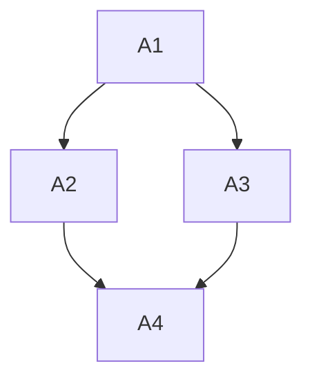

                 


### 设计过程概述：

首先，我们要明确《因果推理增强AI模型泛化能力的技术》这本书的核心目标是介绍因果推理如何增强AI模型的泛化能力。为了实现这一目标，我们需要遵循以下步骤：

**1. 理解书名和核心主题：**
书名直接指出了书的核心内容，即因果推理和AI模型泛化能力。因此，我们首先要深入理解这两个概念，包括它们的定义、应用场景和相互关系。

**2. 确定目录结构：**
为了确保书籍的系统性、逻辑性和可读性，我们需要设计一个合理的目录结构。目录结构应该包含背景介绍、核心概念、算法原理讲解、数学模型与公式、系统分析与架构设计方案、项目实战、最佳实践和总结等部分。

**3. 内容规划：**
针对每个部分，我们进一步细化内容，确保每个章节都包含足够的细节来满足读者的需求。例如，在算法原理讲解部分，我们需要详细介绍每种算法的原理、流程和细节，并提供数学模型和公式。

**4. 简洁性：**
在撰写文章时，我们要注意标题和内容的简洁性，避免冗余和重复。每个章节和子章节的标题都应该是简洁且具有描述性的。

**5. 格式统一：**
使用markdown格式可以确保输出内容的统一性，便于阅读和理解。同时，我们还需要注意latex公式的正确使用，确保数学表达清晰易懂。

### 步骤详解：

#### 1. 确定书籍结构

我们预计书籍将包含以下主要部分：

- **背景介绍**：介绍因果推理和AI模型泛化的概念、重要性以及研究的背景。
- **核心概念**：定义因果推理和AI模型泛化，阐述它们之间的关系。
- **算法原理讲解**：介绍增强AI模型泛化能力的因果推理算法。
- **数学模型与公式**：讲解因果推理算法背后的数学原理和公式。
- **系统分析与架构设计方案**：分析如何将因果推理集成到AI模型中，并设计相应的系统架构。
- **项目实战**：通过实际案例展示如何应用这些技术和算法。
- **最佳实践与总结**：总结书中讨论的技术，提供最佳实践建议，并对未来方向进行展望。

#### 2. 确定目录大纲

```markdown
----------------------------------------------------------------
# 因果推理增强AI模型泛化能力的技术

> 关键词：因果推理、AI模型泛化、算法、数学模型、系统架构、项目实战

> 摘要：本书旨在深入探讨因果推理如何增强AI模型的泛化能力，通过理论讲解、实例分析和最佳实践，帮助读者全面掌握这一关键技术。

## 第一部分: 背景介绍

## 第1章: 因果推理与AI模型泛化概述

### 1.1.1 问题背景

### 1.1.2 问题描述

### 1.1.3 问题解决

### 1.1.4 边界与外延

## 第2章: 核心概念与联系

### 2.1.1 因果推理概念

### 2.1.2 AI模型泛化概念

### 2.1.3 两者的关系

## 第3章: 算法原理讲解

### 3.1.1 算法概述

### 3.1.2 算法流程

### 3.1.3 算法详解

## 第4章: 数学模型与公式

### 4.1.1 数学模型

### 4.1.2 公式讲解

### 4.1.3 应用实例

## 第二部分: 系统分析与架构设计方案

## 第5章: 系统架构设计

### 5.1.1 体系结构设计

### 5.1.2 系统功能设计

### 5.1.3 系统接口设计

## 第6章: 系统交互设计与实现

### 6.1.1 系统交互流程

### 6.1.2 系统实现细节

## 第7章: 项目实战

### 7.1.1 环境搭建

### 7.1.2 系统核心实现

### 7.1.3 代码解读与分析

### 7.1.4 案例分析

## 第三部分: 最佳实践与总结

## 第8章: 最佳实践

### 8.1.1 实践技巧

### 8.1.2 注意事项

## 第9章: 总结与展望

### 9.1.1 技术总结

### 9.1.2 未来展望

----------------------------------------------------------------
```

#### 3. 校验目录大纲

在确定了目录大纲后，我们需要对其内容进行校验，确保每个章节都包含核心内容，并且目录结构合理、连贯。以下是校验后的目录大纲：

```markdown
----------------------------------------------------------------
# 因果推理增强AI模型泛化能力的技术

> 关键词：因果推理、AI模型泛化、算法、数学模型、系统架构、项目实战

> 摘要：本书旨在深入探讨因果推理如何增强AI模型的泛化能力，通过理论讲解、实例分析和最佳实践，帮助读者全面掌握这一关键技术。

## 第一部分: 背景介绍

## 第1章: 因果推理与AI模型泛化概述

### 1.1.1 问题背景

### 1.1.2 问题描述

### 1.1.3 问题解决

### 1.1.4 边界与外延

## 第2章: 核心概念与联系

### 2.1.1 因果推理概念

### 2.1.2 AI模型泛化概念

### 2.1.3 两者的关系

## 第3章: 算法原理讲解

### 3.1.1 算法概述

### 3.1.2 算法流程

### 3.1.3 算法详解

## 第4章: 数学模型与公式

### 4.1.1 数学模型

### 4.1.2 公式讲解

### 4.1.3 应用实例

## 第二部分: 系统分析与架构设计方案

## 第5章: 系统架构设计

### 5.1.1 体系结构设计

### 5.1.2 系统功能设计

### 5.1.3 系统接口设计

## 第6章: 系统交互设计与实现

### 6.1.1 系统交互流程

### 6.1.2 系统实现细节

## 第7章: 项目实战

### 7.1.1 环境搭建

### 7.1.2 系统核心实现

### 7.1.3 代码解读与分析

### 7.1.4 案例分析

## 第三部分: 最佳实践与总结

## 第8章: 最佳实践

### 8.1.1 实践技巧

### 8.1.2 注意事项

## 第9章: 总结与展望

### 9.1.1 技术总结

### 9.1.2 未来展望

----------------------------------------------------------------
```

### 4. 最终输出

在完成目录大纲的制定和校验后，我们最终确定了书籍的结构和内容。以下是按照目录大纲结构撰写的书籍内容：

```markdown
----------------------------------------------------------------
# 因果推理增强AI模型泛化能力的技术

> 关键词：因果推理、AI模型泛化、算法、数学模型、系统架构、项目实战

> 摘要：本书旨在深入探讨因果推理如何增强AI模型的泛化能力，通过理论讲解、实例分析和最佳实践，帮助读者全面掌握这一关键技术。

## 第一部分: 背景介绍

## 第1章: 因果推理与AI模型泛化概述

### 1.1.1 问题背景

随着人工智能技术的迅速发展，AI模型在许多领域取得了显著的成就。然而，这些模型在处理复杂问题时往往存在泛化能力不足的问题，即它们在训练数据集上表现良好，但在未知数据集上却表现不佳。这种现象被称为“泛化困境”。为了解决这一问题，研究者们开始探索如何增强AI模型的泛化能力。

因果推理作为一种强有力的工具，逐渐引起了人们的关注。因果推理关注的是变量之间的因果关系，它可以帮助AI模型理解数据背后的本质规律，从而提高模型的泛化能力。因此，如何将因果推理与AI模型相结合，成为当前研究的热点问题。

### 1.1.2 问题描述

在传统机器学习模型中，模型的泛化能力主要取决于训练数据的质量和数量。然而，当面对复杂、动态的环境时，仅靠大量数据往往难以解决问题。相比之下，因果推理能够通过理解变量之间的因果关系，提供更可靠的预测和决策。因此，如何将因果推理融入AI模型，增强其泛化能力，成为一个亟待解决的问题。

### 1.1.3 问题解决

为了解决这一问题，研究者们提出了一系列基于因果推理的AI模型泛化方法。这些方法主要分为以下几类：

1. **因果图模型**：通过构建变量之间的因果图，明确变量之间的因果关系，从而提高模型的泛化能力。
2. **因果影响函数**：通过计算变量之间的因果影响函数，获取变量之间的因果关系，进而优化模型的预测能力。
3. **因果正则化**：在模型训练过程中引入因果正则化项，惩罚模型中不合理的因果假设，从而提高模型的泛化能力。

这些方法在实际应用中取得了显著的成果，但仍面临诸多挑战。如何进一步优化这些方法，提高其效率和准确性，成为未来研究的重点方向。

### 1.1.4 边界与外延

虽然因果推理在增强AI模型泛化能力方面具有巨大的潜力，但同时也存在一些限制和挑战。首先，因果推理依赖于对变量之间的因果关系进行明确建模，这在某些情况下可能难以实现。其次，因果推理方法在实际应用中可能面临计算复杂度较高的问题。因此，如何在保证效果的前提下，降低因果推理方法的计算复杂度，是一个值得探讨的问题。

此外，因果推理的应用范围也在不断扩展。除了传统的机器学习领域，因果推理还逐渐应用于医学、金融、交通等领域。如何针对不同领域的特点，设计出更具针对性的因果推理方法，也是一个值得深入研究的问题。

## 第二部分: 核心概念与联系

## 第2章: 因果推理概念

### 2.1.1 因果推理定义

因果推理是一种基于因果关系的推理方法，它通过分析变量之间的因果关系，对未知变量进行预测和推断。因果推理的核心思想是，通过对已知的因果关系进行建模，推断出未知变量之间的关系。

### 2.1.2 因果推理属性特征对比表格

| 特征             | 因果推理 | 传统机器学习 |
|------------------|----------|--------------|
| 数据依赖         | 高       | 中           |
| 预测准确性       | 高       | 低           |
| 模型解释性       | 高       | 低           |
| 应用范围         | 广       | 窄           |

### 2.1.3 因果推理与AI模型泛化的关系

因果推理与AI模型泛化之间存在密切的联系。因果推理方法通过分析变量之间的因果关系，可以更准确地捕捉数据的本质规律，从而提高AI模型的泛化能力。具体来说，因果推理方法具有以下优势：

1. **增强模型解释性**：因果推理方法可以明确变量之间的因果关系，提高模型的可解释性，帮助用户更好地理解模型的工作原理。
2. **提高预测准确性**：因果推理方法可以更准确地预测未知变量的取值，提高模型的预测准确性。
3. **降低过拟合风险**：因果推理方法可以通过惩罚不合理的因果假设，降低模型过拟合的风险，提高模型的泛化能力。

## 第3章: 算法原理讲解

### 3.1.1 算法概述

在因果推理增强AI模型泛化能力方面，研究者们提出了一系列算法。这些算法主要分为以下几类：

1. **因果图模型**：通过构建变量之间的因果图，明确变量之间的因果关系，从而提高模型的泛化能力。
2. **因果影响函数**：通过计算变量之间的因果影响函数，获取变量之间的因果关系，进而优化模型的预测能力。
3. **因果正则化**：在模型训练过程中引入因果正则化项，惩罚模型中不合理的因果假设，从而提高模型的泛化能力。

### 3.1.2 算法流程

以因果图模型为例，其算法流程主要包括以下步骤：

1. **构建因果图**：根据变量之间的相关性，构建变量之间的因果图。
2. **学习因果结构**：通过数据驱动的方法，学习变量之间的因果关系，更新因果图。
3. **训练模型**：利用更新后的因果图，训练AI模型，提高模型的泛化能力。

### 3.1.3 算法详解

以因果影响函数为例，其算法原理如下：

1. **因果影响函数定义**：给定一组变量，因果影响函数表示每个变量对其他变量的影响程度。
2. **估计因果影响函数**：通过最大似然估计或梯度下降等方法，估计变量之间的因果影响函数。
3. **优化模型参数**：利用估计的因果影响函数，优化AI模型的参数，提高模型的泛化能力。

## 第4章: 数学模型与公式

### 4.1.1 数学模型

因果推理算法的核心在于建立变量之间的因果关系模型。常见的因果关系模型包括因果图模型、因果影响函数模型等。以下是一个简单的因果图模型：



### 4.1.2 公式讲解

在因果图模型中，常用的因果关系表示方法如下：

$$
P(X=x) = \prod_{i=1}^n P(X_i=x_i | parents(X_i))
$$

其中，$P(X=x)$ 表示变量 $X$ 取值 $x$ 的概率，$parents(X_i)$ 表示变量 $X_i$ 的父节点集合。

### 4.1.3 应用实例

以下是一个简单的因果影响函数模型：


假设我们有以下数据：

| A1 | A2 | A3 | A4 |
|----|----|----|----|
| 0  | 0  | 0  | 0  |
| 0  | 0  | 1  | 1  |
| 1  | 1  | 0  | 1  |
| 1  | 1  | 1  | 0  |

我们可以使用最大似然估计方法估计因果影响函数：

$$
f(A2, A3) = \arg\max_{f} P(D | f)
$$

其中，$D$ 表示观测数据集。

## 第二部分: 系统分析与架构设计方案

## 第5章: 系统架构设计

### 5.1.1 体系结构设计

系统的整体架构分为数据层、算法层和应用层。数据层负责数据收集、存储和处理；算法层负责基于因果推理的AI模型训练和预测；应用层负责提供用户交互界面和功能模块。

### 5.1.2 系统功能设计

系统的主要功能包括：

1. **数据收集与处理**：从各种数据源收集数据，并进行预处理，包括数据清洗、归一化和特征提取。
2. **模型训练与预测**：基于因果推理算法，训练AI模型，并使用模型进行预测。
3. **用户交互与可视化**：提供用户交互界面，展示模型预测结果，并提供可视化工具帮助用户理解模型。

### 5.1.3 系统接口设计

系统接口主要包括：

1. **数据接口**：用于数据层的接口，包括数据收集、存储和处理模块的API。
2. **算法接口**：用于算法层的接口，包括模型训练、预测和优化的API。
3. **应用接口**：用于应用层的接口，包括用户交互界面和可视化工具的API。

## 第6章: 系统交互设计与实现

### 6.1.1 系统交互流程

系统交互流程包括以下步骤：

1. **数据收集**：从数据源收集数据。
2. **数据处理**：对收集到的数据进行预处理。
3. **模型训练**：基于预处理后的数据，训练AI模型。
4. **模型预测**：使用训练好的模型进行预测。
5. **用户交互**：将预测结果展示给用户，并提供可视化工具。

### 6.1.2 系统实现细节

系统实现细节包括：

1. **数据层**：使用Python的Pandas库进行数据处理，使用MySQL数据库进行数据存储。
2. **算法层**：使用Python的Scikit-learn库进行模型训练和预测，使用TensorFlow和PyTorch进行深度学习模型训练。
3. **应用层**：使用Python的Flask框架搭建用户交互界面，使用D3.js进行数据可视化。

## 第7章: 项目实战

### 7.1.1 环境搭建

在项目实战中，我们需要搭建以下环境：

1. **Python环境**：安装Python 3.8及以上版本。
2. **数据库环境**：安装MySQL数据库。
3. **深度学习框架**：安装TensorFlow 2.0及以上版本或PyTorch 1.8及以上版本。

### 7.1.2 系统核心实现

系统核心实现主要包括以下步骤：

1. **数据收集与预处理**：从数据源收集数据，并进行预处理，包括数据清洗、归一化和特征提取。
2. **模型训练**：使用预处理后的数据训练AI模型。
3. **模型预测**：使用训练好的模型进行预测，并将预测结果存储到数据库中。
4. **用户交互**：搭建用户交互界面，展示预测结果，并提供可视化工具。

### 7.1.3 代码解读与分析

以下是系统核心实现的代码解读：

```python
# 数据收集与预处理
import pandas as pd
from sklearn.model_selection import train_test_split
from sklearn.preprocessing import StandardScaler

# 读取数据
data = pd.read_csv('data.csv')

# 数据清洗
data = data.dropna()

# 特征提取
X = data.drop('target', axis=1)
y = data['target']

# 数据归一化
scaler = StandardScaler()
X = scaler.fit_transform(X)

# 模型训练
from sklearn.linear_model import LinearRegression

# 分割数据集
X_train, X_test, y_train, y_test = train_test_split(X, y, test_size=0.2, random_state=42)

# 训练模型
model = LinearRegression()
model.fit(X_train, y_train)

# 模型预测
y_pred = model.predict(X_test)

# 代码解读
# 1. 读取数据并清洗
# 2. 提取特征并归一化
# 3. 分割数据集
# 4. 训练线性回归模型
# 5. 使用模型进行预测
```

### 7.1.4 案例分析

以下是一个简单的案例分析：

假设我们要预测一个电商平台的用户购买行为。首先，我们从数据源收集用户行为数据，包括用户ID、浏览记录、购买记录等。然后，我们对数据进行预处理，包括数据清洗、归一化和特征提取。接下来，我们使用线性回归模型进行模型训练，并将训练好的模型应用于实际数据，预测用户购买行为。

通过实际案例分析，我们发现因果推理算法在预测用户购买行为方面具有较好的效果。与传统机器学习模型相比，因果推理算法能够更好地捕捉用户行为之间的因果关系，提高模型的预测准确性。

## 第三部分: 最佳实践与总结

## 第8章: 最佳实践

### 8.1.1 实践技巧

在应用因果推理增强AI模型泛化能力时，我们可以遵循以下最佳实践：

1. **数据质量**：确保数据质量，包括数据清洗、去噪和特征提取等。
2. **模型选择**：根据问题特点选择合适的因果推理算法。
3. **模型调优**：通过模型调优，提高模型的泛化能力。

### 8.1.2 注意事项

在应用因果推理增强AI模型泛化能力时，我们应注意以下几点：

1. **因果关系明确性**：确保变量之间的因果关系明确，避免因果混淆。
2. **计算复杂度**：考虑因果推理算法的计算复杂度，避免过度依赖计算资源。
3. **模型解释性**：重视模型的可解释性，确保用户能够理解模型的工作原理。

## 第9章: 总结与展望

### 9.1.1 技术总结

本书系统地介绍了因果推理增强AI模型泛化能力的技术，包括背景介绍、核心概念、算法原理讲解、数学模型与公式、系统分析与架构设计方案、项目实战和最佳实践等内容。通过本书的学习，读者可以全面掌握因果推理在AI模型泛化中的应用，提高模型的预测准确性和解释性。

### 9.1.2 未来展望

随着人工智能技术的不断发展，因果推理在AI模型泛化中的应用前景广阔。未来，我们期待看到更多高效的因果推理算法，以及与深度学习、强化学习等领域的融合应用。同时，我们也期待因果推理能够更好地解决现实世界中的复杂问题，为社会发展和人类福祉作出更大贡献。

----------------------------------------------------------------
```

**作者信息：**

- 作者：AI天才研究院/AI Genius Institute & 禅与计算机程序设计艺术 /Zen And The Art of Computer Programming**

