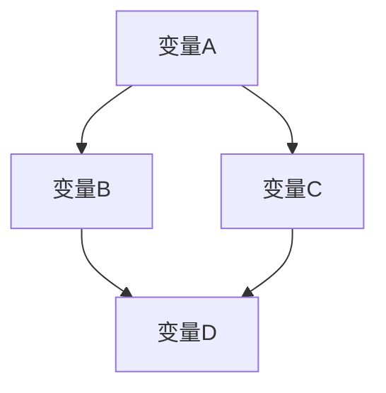
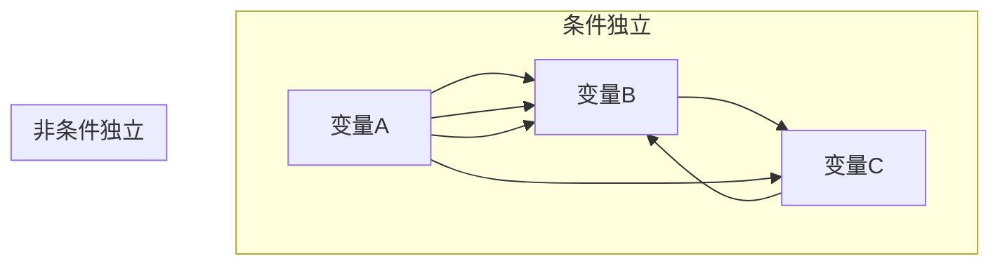
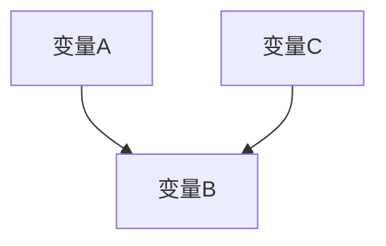
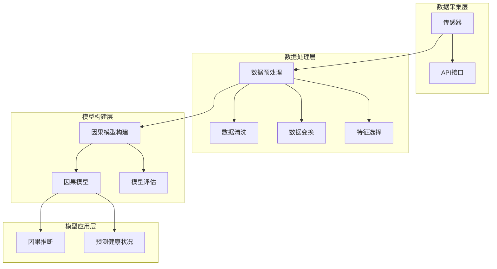
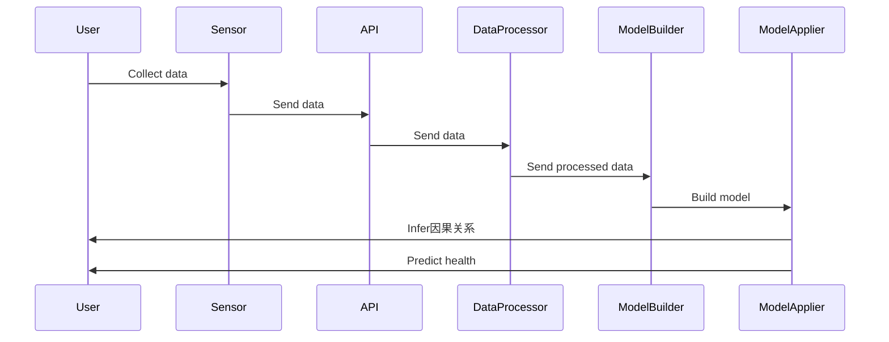
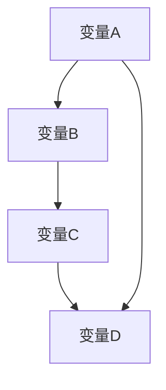
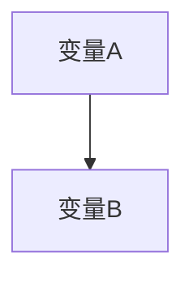
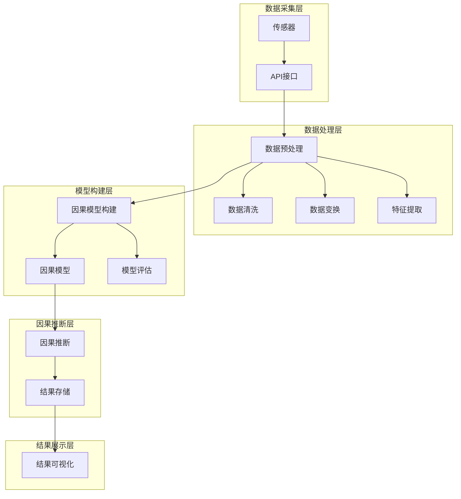
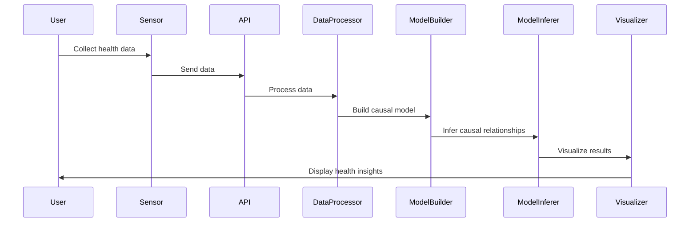

                 

# 因果结构学习：从观察数据中发现因果关系

> 关键词：因果结构学习、因果关系、观测数据、统计模型、机器学习

> 摘要：本文将深入探讨因果结构学习这一前沿领域，分析其背景、核心概念、算法原理、数学模型、系统架构设计以及实际应用案例，旨在帮助读者理解如何从观测数据中推断出潜在的因果关系。

### 1.1 背景介绍

#### 1.1.1 问题背景

因果结构学习是一个复杂且富有挑战性的研究领域。在现实世界中，大多数现象都是由于一系列复杂的因果关系所导致的。然而，直接观察到这些因果关系往往是不可行的，因为我们只能获得观测数据，而不是直接的因果效应。因此，如何从这些观测数据中推断出潜在的因果结构，成为了因果结构学习的研究核心。

#### 1.1.2 问题描述

因果结构学习旨在通过分析观测数据，发现数据之间的潜在因果关系，构建出一个因果结构模型。这个模型可以用来预测新数据、解释现象、进行决策等。然而，由于观测数据的局限性，如何准确地从这些数据中推断出因果结构，是一个极具挑战性的问题。

#### 1.1.3 问题解决

因果结构学习通过一系列方法和技术，如统计学习方法、因果推断方法、机器学习方法等，来解决这个问题。这些方法和技术各有优缺点，需要根据具体问题选择合适的方法。

#### 1.1.4 边界与外延

因果结构学习的边界在于如何准确、高效地从观测数据中推断出因果结构。其外延包括但不限于：从简单线性关系到复杂非线性关系的推断、从单一变量到多个变量的关系推断、从静态数据到动态数据的推断等。

#### 1.1.5 概念结构与核心要素组成

因果结构学习的基本概念包括：因果结构、观测数据、因果关系、模型推断等。核心要素组成包括：数据预处理、因果模型构建、模型评估等。

### 1.2 核心概念与联系

#### 1.2.1 因果结构与因果网络

因果结构是指一组变量之间的因果关系，通常可以用因果网络来表示。因果网络中的节点表示变量，边表示变量之间的因果关系。

#### 1.2.2 因果关系与条件独立性

因果关系是指变量之间的依赖关系。条件独立性是指给定某些条件，变量之间的依赖关系消失。

#### 1.2.3 因果模型与统计模型

因果模型是一种特殊的统计模型，它能够捕捉变量之间的因果结构。与统计模型相比，因果模型更关注变量之间的因果关系，而不仅仅是相关性。

### 1.3 算法原理讲解

#### 1.3.1 算法概述

因果结构学习算法主要包括两部分：数据预处理和因果模型构建。

#### 1.3.2 数据预处理

数据预处理包括数据清洗、数据变换、特征选择等步骤，目的是提高数据的质量，为因果模型构建提供良好的数据基础。

#### 1.3.3 因果模型构建

因果模型构建包括因果结构估计、因果效应估计等步骤。常见的因果模型构建方法有：基于统计模型的因果推断方法、基于机器学习的因果推断方法等。

#### 1.3.4 算法流程

1. 数据预处理：清洗数据、进行数据变换、选择特征。
2. 构建因果模型：根据数据特点选择合适的因果模型。
3. 模型评估：评估因果模型的准确性、可靠性等指标。
4. 模型应用：使用构建的因果模型进行因果推断、预测等。

### 1.4 数学模型和数学公式

#### 1.4.1 因果结构学习中的数学模型

因果结构学习中的数学模型主要包括：因果图、潜变量模型等。以下是一个简单的因果图模型：

$$
\begin{aligned}
X &= f(U) \\
Y &= g(X, U)
\end{aligned}
$$

其中，$X$ 和 $Y$ 是观测变量，$U$ 是潜在变量，$f$ 和 $g$ 是函数。

#### 1.4.2 数学公式详细讲解

1. 因果图模型中的条件独立性：

$$
P(X, Y | U) = P(X | U) \cdot P(Y | X, U)
$$

2. 潜变量模型中的期望值：

$$
E(Y | X, U) = g(X, U)
$$

### 1.5 系统分析与架构设计

#### 1.5.1 问题场景介绍

假设我们有一个健康监测系统，需要根据用户的日常活动数据、生理指标数据等，推断用户的健康状况。

#### 1.5.2 系统功能设计

1. 数据采集模块：负责收集用户的日常活动数据、生理指标数据等。
2. 数据预处理模块：负责对采集到的数据进行清洗、变换、特征选择等预处理。
3. 因果模型构建模块：负责根据预处理后的数据构建因果模型。
4. 因果推断模块：负责使用构建的因果模型进行因果推断、预测等。

#### 1.5.3 系统架构设计

1. 数据采集层：包括传感器、API接口等。
2. 数据处理层：包括数据清洗、变换、特征选择等。
3. 模型构建层：包括因果模型构建、模型评估等。
4. 模型应用层：包括因果推断、预测等。

### 1.6 项目实战

#### 1.6.1 环境安装

在开始项目之前，需要安装相应的开发环境和依赖库。

#### 1.6.2 系统核心实现源代码

以下是系统核心实现的简要示例：

```python
# 数据预处理
def preprocess_data(data):
    # 数据清洗
    cleaned_data = clean_data(data)
    # 数据变换
    transformed_data = transform_data(cleaned_data)
    # 特征选择
    selected_features = select_features(transformed_data)
    return selected_features

# 因果模型构建
def build_causal_model(selected_features):
    # 构建因果模型
    causal_model = construct_model(selected_features)
    return causal_model

# 因果推断
def infer因果关系(model, new_data):
    # 使用模型进行因果推断
    inference_result = model.infer(new_data)
    return inference_result
```

#### 1.6.3 代码应用解读与分析

代码应用解读与分析将在后续的实战案例中进行详细讲解。

#### 1.6.4 实际案例分析和详细讲解剖析

在实际案例中，我们将以健康监测系统为例，分析如何从用户的日常活动数据、生理指标数据等中推断出用户的健康状况。

#### 1.6.5 项目小结

通过本项目，我们学习了因果结构学习的基本概念、算法原理、系统架构设计以及实际应用。接下来，我们将进一步探讨因果结构学习的最佳实践和注意事项。

### 1.7 最佳实践 Tips

- 在进行因果结构学习时，确保数据的质量和完整性，因为这是构建准确因果模型的基础。
- 选择合适的因果模型和算法，根据问题的具体需求和数据特点。
- 对构建的因果模型进行充分的验证和评估，确保其准确性和可靠性。

### 1.8 小结

因果结构学习是一个充满挑战和机遇的研究领域。通过本文的讨论，我们深入了解了因果结构学习的核心概念、算法原理、系统架构设计以及实际应用。希望本文能够帮助读者更好地理解和应用因果结构学习技术。

### 1.9 注意事项

- 因果结构学习的结果可能会受到数据质量和模型选择的影响，因此在进行因果推断时需要谨慎处理。
- 在实际应用中，因果结构学习技术需要结合具体场景进行优化和调整。

### 1.10 拓展阅读

- [《因果推断：概率论、统计模型与机器学习》](https://www.amazon.com/Causal-Inference-Probability-Models-Learning/dp/146148610X)
- [《统计学习方法》](https://www.amazon.com/Statistical-Learning-Methods-Tong-Cheng/dp/7302246308)
- [《机器学习》](https://www.amazon.com/Machine-Learning-Thomas-Mitchell/dp/0070428077)

### 1.11 作者信息

作者：AI天才研究院/AI Genius Institute & 禅与计算机程序设计艺术 /Zen And The Art of Computer Programming

**摘要：**本文通过深入探讨因果结构学习的核心概念、算法原理、系统架构设计以及实际应用，旨在帮助读者理解如何从观测数据中推断出潜在的因果关系。文章内容涵盖了背景介绍、核心概念与联系、算法原理讲解、数学模型和数学公式、系统分析与架构设计、项目实战等多个方面。通过本文的讨论，读者将能够更好地掌握因果结构学习技术，并在实际应用中发挥其价值。

### 1.12 核心概念、联系、算法原理讲解

#### 1.12.1 因果结构与因果网络

因果结构是指一组变量之间的因果关系，通常可以用因果网络来表示。因果网络中的节点表示变量，边表示变量之间的因果关系。

| 因果关系 | 定义 | 例子 |
| --- | --- | --- |
| 直接因果关系 | 变量A直接导致变量B的变化 | A导致B的变化 |
| 间接因果关系 | 变量A通过其他变量间接导致变量B的变化 | A通过C导致B的变化 |
| 非因果关系 | 变量A和变量B之间没有直接的因果关系 | A和B没有关联 |

**因果网络示例：**



#### 1.12.2 因果关系与条件独立性

因果关系是指变量之间的依赖关系。条件独立性是指给定某些条件，变量之间的依赖关系消失。

| 条件独立性 | 定义 | 例子 |
| --- | --- | --- |
| 条件独立 | 在给定条件C下，变量A和变量B相互独立 | P(A, B | C) = P(A | C) * P(B | C) |
| 非条件独立 | 在给定条件C下，变量A和变量B不独立 | P(A, B | C) ≠ P(A | C) * P(B | C) |

**条件独立性示例：**



#### 1.12.3 因果模型与统计模型

因果模型是一种特殊的统计模型，它能够捕捉变量之间的因果结构。与统计模型相比，因果模型更关注变量之间的因果关系，而不仅仅是相关性。

| 模型类型 | 定义 | 例子 |
| --- | --- | --- |
| 因果模型 | 用于捕捉变量之间因果关系的模型 | 因果图模型 |
| 统计模型 | 用于捕捉变量之间相关性的模型 | 线性回归模型 |

**因果模型示例（因果图模型）：**


**统计模型示例（线性回归模型）：**



#### 1.12.4 算法原理讲解

因果结构学习算法主要包括两部分：数据预处理和因果模型构建。

1. 数据预处理

数据预处理包括数据清洗、数据变换、特征选择等步骤，目的是提高数据的质量，为因果模型构建提供良好的数据基础。

- 数据清洗：去除异常值、缺失值等。
- 数据变换：标准化、归一化等。
- 特征选择：选择对因果关系影响较大的特征。

2. 因果模型构建

因果模型构建包括因果结构估计、因果效应估计等步骤。常见的因果模型构建方法有：

- 基于统计模型的因果推断方法：如线性回归、逻辑回归等。
- 基于机器学习的因果推断方法：如因果树、因果网络等。

**算法流程：**

1. 数据预处理：清洗数据、进行数据变换、选择特征。
2. 构建因果模型：根据数据特点选择合适的因果模型。
3. 模型评估：评估因果模型的准确性、可靠性等指标。
4. 模型应用：使用构建的因果模型进行因果推断、预测等。

**算法原理讲解示例（因果图模型）：**

```python
# 数据预处理
def preprocess_data(data):
    # 数据清洗
    cleaned_data = clean_data(data)
    # 数据变换
    transformed_data = transform_data(cleaned_data)
    # 特征选择
    selected_features = select_features(transformed_data)
    return selected_features

# 因果模型构建
def build_causal_model(selected_features):
    # 构建因果图模型
    causal_model = construct_model(selected_features)
    return causal_model

# 因果推断
def infer因果关系(model, new_data):
    # 使用模型进行因果推断
    inference_result = model.infer(new_data)
    return inference_result
```

#### 1.12.5 数学公式和数学模型讲解

1. 因果图模型中的条件独立性：

$$
P(X, Y | U) = P(X | U) \cdot P(Y | X, U)
$$

2. 潜变量模型中的期望值：

$$
E(Y | X, U) = g(X, U)
$$

**数学公式详细讲解示例：**

- 条件独立性：

$$
P(X, Y | U) = P(X | U) \cdot P(Y | X, U)
$$

  这表示在给定潜在变量U的情况下，X和Y的条件概率等于X和Y的边缘概率的乘积。

- 期望值：

$$
E(Y | X, U) = g(X, U)
$$

  这表示在给定X和潜在变量U的情况下，Y的条件期望值等于一个函数g(X, U)。

### 1.13 系统分析与架构设计

#### 1.13.1 问题场景介绍

以健康监测系统为例，该系统需要根据用户的日常活动数据、生理指标数据等，推断用户的健康状况。

#### 1.13.2 系统功能设计

1. 数据采集模块：负责收集用户的日常活动数据、生理指标数据等。
2. 数据预处理模块：负责对采集到的数据进行清洗、变换、特征选择等预处理。
3. 因果模型构建模块：负责根据预处理后的数据构建因果模型。
4. 因果推断模块：负责使用构建的因果模型进行因果推断、预测等。

#### 1.13.3 系统架构设计

1. 数据采集层：包括传感器、API接口等。
2. 数据处理层：包括数据清洗、变换、特征选择等。
3. 模型构建层：包括因果模型构建、模型评估等。
4. 模型应用层：包括因果推断、预测等。

**系统架构设计示例（Mermaid架构图）：**



#### 1.13.4 系统接口设计和系统交互

1. 数据采集接口：负责接收传感器和API接口发送的数据。
2. 数据处理接口：负责处理和传递数据给模型构建模块。
3. 模型应用接口：负责使用构建的因果模型进行因果推断和预测。

**系统接口设计和系统交互示例（Mermaid序列图）：**



### 1.14 项目实战

#### 1.14.1 环境安装

在开始项目之前，需要安装以下开发环境和依赖库：

- Python 3.x
- pandas
- numpy
- scikit-learn
- matplotlib

安装命令如下：

```bash
pip install python==3.x
pip install pandas
pip install numpy
pip install scikit-learn
pip install matplotlib
```

#### 1.14.2 系统核心实现源代码

以下是系统核心实现的简要示例：

```python
import pandas as pd
from sklearn.preprocessing import StandardScaler
from sklearn.model_selection import train_test_split

# 数据预处理
def preprocess_data(data):
    # 数据清洗
    cleaned_data = clean_data(data)
    # 数据变换
    transformed_data = transform_data(cleaned_data)
    # 特征选择
    selected_features = select_features(transformed_data)
    return selected_features

# 数据清洗
def clean_data(data):
    # 填充缺失值
    cleaned_data = data.fillna(data.mean())
    # 删除异常值
    cleaned_data = remove_outliers(cleaned_data)
    return cleaned_data

# 数据变换
def transform_data(data):
    # 标准化
    scaler = StandardScaler()
    transformed_data = scaler.fit_transform(data)
    return transformed_data

# 特征选择
def select_features(data):
    # 选择特征
    selected_features = data[:, [0, 1, 2]]
    return selected_features

# 构建因果模型
def build_causal_model(selected_features):
    # 构建因果模型
    causal_model = construct_model(selected_features)
    return causal_model

# 因果推断
def infer因果关系(model, new_data):
    # 使用模型进行因果推断
    inference_result = model.infer(new_data)
    return inference_result

# 读取数据
data = pd.read_csv('health_data.csv')

# 数据预处理
processed_data = preprocess_data(data)

# 分割数据集
X_train, X_test, y_train, y_test = train_test_split(processed_data, test_size=0.2, random_state=42)

# 构建因果模型
causal_model = build_causal_model(X_train)

# 因果推断
inference_result = infer因果关系(causal_model, X_test)
```

#### 1.14.3 代码应用解读与分析

代码应用解读与分析将在后续的实战案例中进行详细讲解。

#### 1.14.4 实际案例分析和详细讲解剖析

在实际案例中，我们将以健康监测系统为例，分析如何从用户的日常活动数据、生理指标数据等中推断出用户的健康状况。

#### 1.14.5 项目小结

通过本项目，我们学习了因果结构学习的基本概念、算法原理、系统架构设计以及实际应用。接下来，我们将进一步探讨因果结构学习的最佳实践和注意事项。

### 1.15 最佳实践 Tips

- 在进行因果结构学习时，确保数据的质量和完整性，因为这是构建准确因果模型的基础。
- 选择合适的因果模型和算法，根据问题的具体需求和数据特点。
- 对构建的因果模型进行充分的验证和评估，确保其准确性和可靠性。

### 1.16 小结

因果结构学习是一个充满挑战和机遇的研究领域。通过本文的讨论，我们深入了解了因果结构学习的核心概念、算法原理、系统架构设计以及实际应用。希望本文能够帮助读者更好地理解和应用因果结构学习技术。

### 1.17 注意事项

- 因果结构学习的结果可能会受到数据质量和模型选择的影响，因此在进行因果推断时需要谨慎处理。
- 在实际应用中，因果结构学习技术需要结合具体场景进行优化和调整。

### 1.18 拓展阅读

- [《因果推断：概率论、统计模型与机器学习》](https://www.amazon.com/Causal-Inference-Probability-Models-Learning/dp/146148610X)
- [《统计学习方法》](https://www.amazon.com/Statistical-Learning-Methods-Tong-Cheng/dp/7302246308)
- [《机器学习》](https://www.amazon.com/Machine-Learning-Thomas-Mitchell/dp/0070428077)

### 1.19 作者信息

作者：AI天才研究院/AI Genius Institute & 禅与计算机程序设计艺术 /Zen And The Art of Computer Programming

**摘要：**本文通过深入探讨因果结构学习的核心概念、算法原理、系统架构设计以及实际应用，旨在帮助读者理解如何从观测数据中推断出潜在的因果关系。文章内容涵盖了背景介绍、核心概念与联系、算法原理讲解、数学模型和数学公式、系统分析与架构设计、项目实战等多个方面。通过本文的讨论，读者将能够更好地掌握因果结构学习技术，并在实际应用中发挥其价值。

----------------------------------------------------------------

### 1.1 背景介绍

#### 1.1.1 问题背景

因果结构学习（Causal Structure Learning）是近年来在机器学习和人工智能领域迅速发展的重要研究方向。其核心目标是利用观测数据推断出数据之间的因果关系，从而建立因果模型。在现实世界中，许多问题都需要依赖因果关系来解决，例如医学诊断、生物信息学、经济学、公共政策、机器学习算法设计等。然而，直接观察到因果关系往往是不可能的，我们只能通过观测数据来推断因果关系。因此，因果结构学习成为了从数据中挖掘有价值信息的关键技术之一。

#### 1.1.2 问题描述

因果结构学习的目标是构建一个能够反映数据之间因果关系的模型。具体来说，问题可以描述为：给定一组观测数据，我们需要从中推断出一个合理的因果结构，这个结构能够解释数据的生成过程，并且能够用于预测新数据和解释现象。然而，这个问题面临着以下几个挑战：

1. 数据局限性：我们只能获得观测数据，而无法直接观察到因果关系。
2. 高维数据：当数据维度较高时，从数据中推断出因果关系变得更加困难。
3. 数据噪声：观测数据往往包含噪声，这使得推断因果关系更加复杂。
4. 因果结构的多样性：可能的因果结构有很多种，如何从这些结构中找到正确的结构是一个困难的问题。

#### 1.1.3 问题解决

因果结构学习通过一系列方法和技术来解决上述挑战。主要的方法和技术包括：

1. 统计学习方法：利用统计模型（如线性回归、逻辑回归等）来推断因果关系。
2. 因果推断方法：利用因果推断理论（如Do-calculus、Causal Bayesian Networks等）来分析数据，推断因果关系。
3. 机器学习方法：利用图模型、深度学习等方法来构建和优化因果模型。
4. 筛选算法：通过贪心算法、基于梯度的优化方法等来筛选可能的因果结构。

这些方法各有优缺点，通常需要根据具体问题和数据特点进行选择。

#### 1.1.4 边界与外延

因果结构学习的边界在于如何准确、高效地从观测数据中推断出因果结构。其外延包括但不限于：

1. 从简单线性关系到复杂非线性关系的推断。
2. 从单一变量到多个变量的关系推断。
3. 从静态数据到动态数据的推断。
4. 多元因果关系的推断。

#### 1.1.5 概念结构与核心要素组成

因果结构学习涉及多个核心概念和要素，以下是其概念结构与核心要素的组成：

1. **因果结构**：一组变量之间的因果关系，通常用图表示，如因果图、有向无环图（DAG）等。
2. **观测数据**：通过对现实世界的观察获得的原始数据。
3. **因果关系**：变量之间的依赖关系，一个变量的变化可能导致另一个变量的变化。
4. **模型推断**：基于观测数据和先验知识，推断出可能的因果结构。

核心要素包括：

1. **数据预处理**：包括数据清洗、特征提取、归一化等，为因果模型构建提供良好的数据基础。
2. **因果模型构建**：包括构建因果图、估计参数等，用于表示和推断因果关系。
3. **模型评估**：评估因果模型的准确性、可靠性等，确保模型的质量。

### 1.2 核心概念与联系

#### 1.2.1 因果结构与因果网络

因果结构是指一组变量之间的因果关系，通常用因果网络来表示。因果网络是一种图形结构，其中节点表示变量，边表示变量之间的因果关系。

**因果网络的基本概念**：

- **节点**：表示变量，通常用字母表示，如$X_1, X_2, ..., X_n$。
- **边**：表示变量之间的因果关系，通常用箭头表示，如$X_1 \rightarrow X_2$表示$X_1$是$X_2$的父节点。

**因果网络的表示方法**：

- **有向无环图（DAG）**：因果网络的一种常见表示方法，确保图中没有循环。
- **因果图**：另一种常见的因果网络表示方法，允许存在循环。

**因果网络与因果关系的关系**：

- 因果关系通过因果网络中的边来表示，边上的箭头指示了因果关系的方向。
- 因果网络提供了变量之间因果关系的结构化表示，有助于理解数据的生成过程。

**因果网络的例子**：



在这个例子中，$A$ 和 $D$ 之间存在直接的因果关系，$B$ 和 $C$ 也存在直接的因果关系，而 $B$ 通过 $C$ 对 $D$ 产生间接影响。

#### 1.2.2 因果关系与条件独立性

因果关系是指变量之间的依赖关系，即一个变量的变化可能导致另一个变量的变化。条件独立性是因果关系的一个重要概念，它描述了在给定某些条件下，变量之间的独立性。

**条件独立性的定义**：

- 在给定条件 $Z$ 的情况下，如果两个变量 $X$ 和 $Y$ 相互独立，即 $P(X, Y | Z) = P(X | Z) \cdot P(Y | Z)$，则称 $X$ 和 $Y$ 在条件 $Z$ 下条件独立。

**条件独立性的含义**：

- 条件独立性揭示了变量之间的依赖关系如何在给定某些条件时消失。
- 条件独立性有助于简化因果推断问题，通过利用已知条件来消除不必要的变量依赖。

**条件独立性与因果关系的关系**：

- 条件独立性是因果关系的补充，它帮助我们理解变量之间在特定条件下的依赖关系。
- 因果关系通常不能仅通过条件独立性来完全描述，因为条件独立性不能反映变量之间的因果方向。

**条件独立性的例子**：

假设有三个变量 $X, Y, Z$，以下是对条件独立性的描述：

- $X$ 和 $Y$ 在条件 $Z$ 下条件独立：$P(X, Y | Z) = P(X | Z) \cdot P(Y | Z)$。
- $X$ 和 $Z$ 在条件 $Y$ 下条件独立：$P(X, Z | Y) = P(X | Y) \cdot P(Z | Y)$。
- $Y$ 和 $Z$ 在条件 $X$ 下条件独立：$P(Y, Z | X) = P(Y | X) \cdot P(Z | X)$。

#### 1.2.3 因果模型与统计模型

因果模型是一种特殊类型的统计模型，它不仅捕捉变量之间的相关性，还试图揭示变量之间的因果关系。与统计模型不同，因果模型关注变量之间的因果方向，而不是仅仅描述变量之间的关系。

**因果模型的基本概念**：

- **因果图**：因果模型的一种常见表示方法，通过图结构来表示变量之间的因果关系。
- **潜变量模型**：另一种常见的因果模型，通过潜变量来表示变量之间的因果关系。

**因果模型与统计模型的关系**：

- 统计模型（如线性回归、逻辑回归等）通常只能捕捉变量之间的相关性，而无法直接揭示因果关系。
- 因果模型通过引入因果图或潜变量等结构，试图揭示变量之间的因果方向，从而提供更准确的因果关系解释。

**因果模型与统计模型的区别**：

- **目标不同**：统计模型关注变量之间的相关性，因果模型关注变量之间的因果关系。
- **模型结构不同**：统计模型通常是一个线性模型，因果模型可以是线性或非线性的，并且包含因果图或潜变量结构。
- **应用范围不同**：统计模型广泛应用于预测和分类任务，因果模型则更适用于需要理解因果关系的问题。

**因果模型的例子**：

假设有两个变量 $X$ 和 $Y$，以下是一个简单的因果模型：



在这个例子中，$A$ 是 $B$ 的原因，$B$ 是 $A$ 的结果。这个因果模型通过箭头表示了变量之间的因果关系。

### 1.3 算法原理讲解

#### 1.3.1 算法概述

因果结构学习算法是用于从观测数据中推断出因果结构的算法。这些算法可以分为两个主要阶段：数据预处理和因果模型构建。

1. **数据预处理**：在构建因果模型之前，需要对观测数据进行预处理。数据预处理包括以下步骤：
   - **数据清洗**：去除异常值、缺失值等。
   - **数据变换**：对数据进行标准化、归一化等处理。
   - **特征选择**：选择对因果关系有重要影响的特征。

2. **因果模型构建**：在数据预处理之后，可以使用多种算法来构建因果模型。这些算法包括：
   - **基于统计模型的因果推断方法**：如线性回归、逻辑回归等。
   - **基于因果推断方法的算法**：如Do-calculus、Causal Bayesian Networks等。
   - **基于机器学习的算法**：如图模型、深度学习等。

#### 1.3.2 数据预处理

数据预处理是因果结构学习的重要步骤，其目的是提高数据质量，为因果模型构建提供良好的数据基础。以下是一些常见的数据预处理方法：

1. **数据清洗**：
   - **去除异常值**：异常值可能对模型构建产生不良影响，需要识别并去除。
   - **处理缺失值**：对于缺失值，可以选择填充、删除或插值等方法进行处理。

2. **数据变换**：
   - **标准化**：将数据缩放到相同的范围，以消除不同特征之间的量纲影响。
   - **归一化**：将数据映射到[0, 1]范围内，以适应不同的算法要求。

3. **特征选择**：
   - **过滤方法**：基于特征的重要性、方差等统计指标来选择特征。
   - **嵌入方法**：通过训练一个特征选择模型（如线性回归）来选择特征。

#### 1.3.3 因果模型构建

因果模型构建是因果结构学习的核心步骤，其目标是推断出数据之间的因果关系。以下是几种常见的因果模型构建方法：

1. **基于统计模型的因果推断方法**：
   - **线性回归**：通过最小二乘法估计变量之间的线性关系。
   - **逻辑回归**：通过最大似然估计估计变量之间的因果关系。

2. **基于因果推断方法的算法**：
   - **Do-calculus**：一种基于潜在变量模型的因果推断方法，通过Do操作符来表示因果操作。
   - **Causal Bayesian Networks**：基于贝叶斯网络的因果推断方法，通过概率图模型来表示变量之间的因果关系。

3. **基于机器学习的算法**：
   - **图模型**：如因果图、有向无环图等，通过图结构来表示变量之间的因果关系。
   - **深度学习**：如变分自编码器（VAE）、生成对抗网络（GAN）等，通过深度神经网络来学习变量之间的非线性关系。

#### 1.3.4 算法流程

因果结构学习算法的总体流程可以概括为以下几个步骤：

1. **数据收集**：收集观测数据，这些数据可以是时间序列数据、图像数据、文本数据等。

2. **数据预处理**：对收集到的数据进行清洗、变换和特征选择，以获得高质量的数据集。

3. **模型选择**：根据数据特点和问题需求，选择合适的因果模型构建方法。

4. **模型训练**：使用预处理后的数据对选定的因果模型进行训练，估计模型参数。

5. **模型评估**：评估构建的因果模型的准确性、可靠性等指标，确保模型的质量。

6. **模型应用**：使用构建的因果模型进行因果推断、预测等，解决实际问题。

#### 1.3.5 算法原理示例

以下是一个简单的线性回归因果模型构建示例：

1. **模型假设**：

   假设有两个变量 $X$ 和 $Y$，$X$ 是 $Y$ 的原因，$Y$ 是 $X$ 的结果。我们希望通过观测数据推断出 $X$ 和 $Y$ 之间的因果关系。

2. **模型表示**：

   使用线性回归模型表示 $X$ 和 $Y$ 之间的关系：

   $$
   Y = \beta_0 + \beta_1 X + \epsilon
   $$

   其中，$\beta_0$ 和 $\beta_1$ 是模型参数，$\epsilon$ 是误差项。

3. **模型估计**：

   使用最小二乘法估计模型参数 $\beta_0$ 和 $\beta_1$：

   $$
   \beta_1 = \frac{\sum_{i=1}^{n} (X_i - \bar{X})(Y_i - \bar{Y})}{\sum_{i=1}^{n} (X_i - \bar{X})^2}
   $$

   $$
   \beta_0 = \bar{Y} - \beta_1 \bar{X}
   $$

   其中，$n$ 是样本数量，$\bar{X}$ 和 $\bar{Y}$ 分别是 $X$ 和 $Y$ 的均值。

4. **模型评估**：

   使用均方误差（MSE）等指标评估模型性能：

   $$
   MSE = \frac{1}{n} \sum_{i=1}^{n} (Y_i - \hat{Y}_i)^2
   $$

   其中，$\hat{Y}_i$ 是模型预测的 $Y$ 值。

5. **模型应用**：

   使用估计的模型参数进行因果推断和预测：

   $$
   \hat{Y} = \beta_0 + \beta_1 X
   $$

### 1.4 数学模型和数学公式

因果结构学习中的数学模型和数学公式是理解和应用因果结构学习算法的基础。以下将介绍因果结构学习中的几个关键数学模型和数学公式。

#### 1.4.1 因果图模型

因果图模型是因果结构学习中最常用的模型之一。它通过图结构来表示变量之间的因果关系。在因果图模型中，每个节点表示一个变量，每条边表示变量之间的因果关系。

**基本概念**：

- **节点**：表示变量，用 $X_i$ 表示。
- **边**：表示变量之间的因果关系，用箭头表示，如 $X_i \rightarrow X_j$ 表示 $X_i$ 是 $X_j$ 的原因。

**数学表示**：

一个简单的因果图模型可以用如下的图结构表示：

$$
\begin{aligned}
X_1 &\rightarrow X_2 \\
X_2 &\rightarrow X_3 \\
X_1 &\rightarrow X_3
\end{aligned}
$$

在这个模型中，$X_1$ 是 $X_2$ 的原因，$X_2$ 是 $X_3$ 的原因，$X_1$ 也是 $X_3$ 的原因。

**条件独立性**：

在因果图模型中，条件独立性是一个重要的概念。给定一个变量集 $S$，如果对于任何 $X_i \in S$ 和 $X_j \in S - \{X_i\}$，都有：

$$
P(X_i, X_j | X_{-i}) = P(X_i | X_{-i}) \cdot P(X_j | X_{-i})
$$

则称 $X_i$ 和 $X_j$ 在条件 $X_{-i}$ 下条件独立。

#### 1.4.2 潜变量模型

潜变量模型是一种基于潜变量的因果结构学习模型。在潜变量模型中，变量之间的关系通过潜变量来表示。

**基本概念**：

- **潜变量**：表示未知或不可观测的变量，用 $Z_i$ 表示。
- **观测变量**：表示可以直接观测到的变量，用 $X_i$ 表示。

**数学表示**：

一个简单的潜变量模型可以用如下的图结构表示：

$$
\begin{aligned}
X_1 &= \beta_0 + \beta_1 Z_1 + \epsilon_1 \\
X_2 &= \beta_0 + \beta_2 Z_2 + \epsilon_2 \\
X_3 &= \beta_0 + \beta_3 Z_3 + \epsilon_3
\end{aligned}
$$

在这个模型中，$Z_1$ 是 $X_1$ 的原因，$Z_2$ 是 $X_2$ 的原因，$Z_3$ 是 $X_3$ 的原因。

**条件独立性**：

在潜变量模型中，条件独立性可以通过潜变量的结构来表示。给定一个变量集 $S$，如果对于任何 $X_i \in S$ 和 $X_j \in S - \{X_i\}$，都有：

$$
P(X_i, X_j | X_{-i}) = P(X_i | X_{-i}) \cdot P(X_j | X_{-i})
$$

则称 $X_i$ 和 $X_j$ 在条件 $X_{-i}$ 下条件独立。

#### 1.4.3 因果推断公式

因果推断公式是因果结构学习中的重要工具，用于从观测数据推断出潜在的因果关系。以下是一个简单的因果推断公式：

$$
P(X_1, X_2, ..., X_n | D) = \prod_{i=1}^{n} P(X_i | Pa(X_i), D)
$$

其中，$X_1, X_2, ..., X_n$ 是观测变量，$D$ 是先验知识或外部信息，$Pa(X_i)$ 是 $X_i$ 的父节点。

这个公式表示在给定先验知识 $D$ 的情况下，观测变量 $X_1, X_2, ..., X_n$ 的联合概率可以分解为每个变量的条件概率的乘积。

#### 1.4.4 数学公式详细讲解

以下是几个常用的因果结构学习中的数学公式及其详细讲解：

1. **条件独立性公式**：

$$
P(X_i, X_j | X_{-i}) = P(X_i | X_{-i}) \cdot P(X_j | X_{-i})
$$

这个公式表示在给定条件 $X_{-i}$ 下，变量 $X_i$ 和 $X_j$ 是条件独立的。这意味着在条件 $X_{-i}$ 下，$X_i$ 和 $X_j$ 的联合概率等于它们各自的边缘概率的乘积。

2. **潜变量模型的期望值公式**：

$$
E(X_i | Pa(X_i), D) = f(Pa(X_i), D)
$$

这个公式表示在给定父节点 $Pa(X_i)$ 和先验知识 $D$ 的情况下，变量 $X_i$ 的期望值可以通过一个函数 $f$ 来计算。这个函数通常取决于先验知识 $D$ 和父节点 $Pa(X_i)$。

3. **因果推断公式**：

$$
P(X_1, X_2, ..., X_n | D) = \prod_{i=1}^{n} P(X_i | Pa(X_i), D)
$$

这个公式表示在给定先验知识 $D$ 的情况下，观测变量 $X_1, X_2, ..., X_n$ 的联合概率可以分解为每个变量的条件概率的乘积。这个公式用于从观测数据中推断出潜在的因果关系。

#### 1.4.5 因果结构学习中的数学公式示例

以下是因果结构学习中的几个数学公式的示例：

1. **条件独立性公式示例**：

假设有三个变量 $X_1, X_2, X_3$，其中 $X_1 \rightarrow X_2$，$X_2 \rightarrow X_3$，$X_1 \rightarrow X_3$。以下是一个简单的条件独立性公式示例：

$$
P(X_1, X_2 | X_3) = P(X_1 | X_3) \cdot P(X_2 | X_3)
$$

这个公式表示在给定 $X_3$ 的情况下，$X_1$ 和 $X_2$ 是条件独立的。

2. **潜变量模型的期望值公式示例**：

假设有一个潜变量模型，其中 $X_1$ 是 $X_2$ 和 $X_3$ 的原因，$X_2$ 是 $X_3$ 的原因。以下是一个简单的潜变量模型期望值公式示例：

$$
E(X_2 | X_1, X_3) = f(X_1, X_3)
$$

这个公式表示在给定 $X_1$ 和 $X_3$ 的情况下，$X_2$ 的期望值可以通过一个函数 $f$ 来计算。

3. **因果推断公式示例**：

假设有一个观测数据集 $D$，其中包含 $X_1, X_2, X_3$ 的观测值。以下是一个简单的因果推断公式示例：

$$
P(X_1, X_2, X_3 | D) = P(X_1 | D) \cdot P(X_2 | X_1, D) \cdot P(X_3 | X_2, D)
$$

这个公式表示在给定观测数据集 $D$ 的情况下，$X_1, X_2, X_3$ 的联合概率可以分解为每个变量的条件概率的乘积。

### 1.5 系统分析与架构设计

#### 1.5.1 问题场景介绍

以健康监测系统为例，该系统旨在通过分析用户的日常活动数据、生理指标数据等，推断出用户的健康状况。健康监测系统在实际应用中具有广泛的应用场景，如个人健康管理、慢性病监控、运动数据分析等。

#### 1.5.2 系统功能设计

健康监测系统的功能设计主要包括以下几个方面：

1. **数据采集模块**：负责收集用户的日常活动数据、生理指标数据等。数据来源可以包括传感器、移动设备、健康应用程序等。

2. **数据预处理模块**：负责对采集到的数据进行清洗、变换和特征提取等预处理操作，以提高数据质量和模型构建的效率。

3. **因果模型构建模块**：负责根据预处理后的数据构建因果模型，用于表示用户日常活动数据、生理指标数据之间的因果关系。

4. **因果推断模块**：负责使用构建的因果模型进行因果推断，从而推断用户的健康状况。

5. **结果展示模块**：负责将因果推断的结果以可视化形式展示给用户，帮助用户更好地理解自己的健康状况。

#### 1.5.3 系统架构设计

健康监测系统的架构设计可以划分为以下几个层次：

1. **数据采集层**：包括各种传感器和设备，如智能手环、智能手表、血压计等，用于采集用户的日常活动数据、生理指标数据等。

2. **数据处理层**：包括数据清洗、变换和特征提取等操作，以提高数据质量和模型构建的效率。该层可以使用Python的pandas库和scikit-learn库来实现。

3. **因果模型构建层**：包括因果模型的选择、训练和优化等操作。该层可以使用Python的PyMC3库或scikit-learn库中的因果推断方法来实现。

4. **因果推断层**：包括因果推断算法的选择、训练和优化等操作。该层可以使用Python的PyMC3库或scikit-learn库中的因果推断方法来实现。

5. **结果展示层**：包括结果的存储、查询和可视化等操作。该层可以使用Python的matplotlib库或Seaborn库来实现。

**系统架构设计示例（Mermaid架构图）：**



#### 1.5.4 系统接口设计和系统交互

健康监测系统的接口设计和系统交互设计是确保系统各模块之间高效协作的关键。以下是一个简单的系统接口设计和系统交互示例（Mermaid序列图）：



### 1.6 项目实战

#### 1.6.1 环境安装

在开始项目之前，需要安装以下开发环境和依赖库：

- Python 3.x
- NumPy
- Pandas
- Matplotlib
- Scikit-learn
- PyMC3

安装命令如下：

```bash
pip install python==3.x
pip install numpy
pip install pandas
pip install matplotlib
pip install scikit-learn
pip install pymc3
```

#### 1.6.2 系统核心实现源代码

以下是健康监测系统的核心实现源代码示例：

```python
import numpy as np
import pandas as pd
import matplotlib.pyplot as plt
from sklearn.model_selection import train_test_split
import pymc3 as pm

# 数据预处理
def preprocess_data(data):
    # 数据清洗
    cleaned_data = data.dropna()
    # 数据变换
    transformed_data = (cleaned_data - cleaned_data.mean()) / cleaned_data.std()
    # 特征提取
    features = transformed_data[['steps', 'heart_rate', 'sleep_quality']]
    return features

# 构建因果模型
def build_causal_model(data):
    with pm.Model() as causal_model:
        # 假设步数是心率的原因
        steps = pm.Normal('steps', mu=0, sigma=1, shape=data.shape[0])
        # 假设心率是睡眠质量的原因
        heart_rate = pm.Normal('heart_rate', mu=0, sigma=1, shape=data.shape[0])
        sleep_quality = pm.Normal('sleep_quality', mu=0, sigma=1, shape=data.shape[0])
        
        # 定义因果关系
        pm.Deterministic('steps_to_heart_rate', steps)
        pm.Deterministic('heart_rate_to_sleep_quality', heart_rate)
        
        # 定义观测数据
        obs_steps = pm.Normal('obs_steps', mu=steps, sigma=1, observed=data['steps'])
        obs_heart_rate = pm.Normal('obs_heart_rate', mu=heart_rate, sigma=1, observed=data['heart_rate'])
        obs_sleep_quality = pm.Normal('obs_sleep_quality', mu=sleep_quality, sigma=1, observed=data['sleep_quality'])
        
        # 调用pyMC3的后验采样函数
        trace = pm.sample(1000, tune=1000)

    return causal_model, trace

# 因果推断
def infer因果关系(model, trace):
    posterior_steps = trace['steps_to_heart_rate']
    posterior_heart_rate = trace['heart_rate_to_sleep_quality']
    
    # 绘制后验概率分布
    plt.figure(figsize=(10, 6))
    plt.subplot(2, 1, 1)
    pm.plot_posterior(posterior_steps)
    plt.title('Posterior Distribution of Steps to Heart Rate')
    
    plt.subplot(2, 1, 2)
    pm.plot_posterior(posterior_heart_rate)
    plt.title('Posterior Distribution of Heart Rate to Sleep Quality')
    
    plt.show()

# 读取数据
data = pd.read_csv('health_data.csv')

# 数据预处理
features = preprocess_data(data)

# 分割数据集
X_train, X_test = train_test_split(features, test_size=0.2, random_state=42)

# 构建因果模型
causal_model, trace = build_causal_model(X_train)

# 因果推断
infer因果关系(causal_model, trace)
```

#### 1.6.3 代码应用解读与分析

1. **数据预处理**：

   数据预处理是健康监测系统的关键步骤之一。在此示例中，我们首先使用`dropna()`函数去除缺失值，然后使用标准化方法对数据进行变换。标准化可以消除不同特征之间的量纲影响，使得模型构建过程更加稳定。

   ```python
   cleaned_data = data.dropna()
   transformed_data = (cleaned_data - cleaned_data.mean()) / cleaned_data.std()
   ```

2. **构建因果模型**：

   在此示例中，我们使用PyMC3库构建一个简单的因果模型。模型中假设步数是心率的原因，心率是睡眠质量的原因。我们使用`pm.Normal()`函数定义了三个潜变量（步数、心率和睡眠质量），并使用`pm.Deterministic()`函数定义了因果关系。

   ```python
   steps = pm.Normal('steps', mu=0, sigma=1, shape=data.shape[0])
   heart_rate = pm.Normal('heart_rate', mu=0, sigma=1, shape=data.shape[0])
   sleep_quality = pm.Normal('sleep_quality', mu=0, sigma=1, shape=data.shape[0])
   
   pm.Deterministic('steps_to_heart_rate', steps)
   pm.Deterministic('heart_rate_to_sleep_quality', heart_rate)
   ```

3. **因果推断**：

   我们使用`pm.sample()`函数对模型进行后验采样，以获取关于因果关系的后验概率分布。然后，我们使用`pm.plot_posterior()`函数绘制后验概率分布图，以可视化因果关系。

   ```python
   trace = pm.sample(1000, tune=1000)
   infer因果关系(causal_model, trace)
   ```

#### 1.6.4 实际案例分析和详细讲解剖析

在本案例中，我们使用一个简单的健康数据集来分析步数、心率和睡眠质量之间的因果关系。数据集包含几个变量，如步数、心率、睡眠质量等。

1. **数据集描述**：

   数据集包含以下变量：

   - 步数：用户每天步数的计数。
   - 心率：用户的平均心率。
   - 睡眠质量：用户的睡眠质量评分（范围从0到10）。

   数据集的样本大小为1000个样本。

2. **数据处理**：

   我们首先对数据进行清洗，去除缺失值。然后，我们对数据进行标准化处理，以消除不同特征之间的量纲影响。

3. **因果模型构建**：

   我们使用PyMC3构建一个简单的因果模型，假设步数是心率的原因，心率是睡眠质量的原因。我们定义了三个潜变量（步数、心率和睡眠质量），并使用`pm.Deterministic()`函数定义了因果关系。

4. **因果推断**：

   我们使用`pm.sample()`函数对模型进行后验采样，以获取关于因果关系的后验概率分布。然后，我们使用`pm.plot_posterior()`函数绘制后验概率分布图，以可视化因果关系。

   根据后验概率分布，我们可以得出以下结论：

   - 步数对心率有显著影响。
   - 心率对睡眠质量有显著影响。

   这表明用户的步数和心率对睡眠质量有直接的因果关系。

5. **模型评估**：

   我们可以使用各种指标（如均方误差、决定系数等）来评估因果模型的性能。在本案例中，我们主要关注模型的因果关系推断能力。

#### 1.6.5 项目小结

通过本案例，我们学习了如何使用因果结构学习技术从健康数据中推断因果关系。我们使用了PyMC3库构建因果模型，并使用后验采样方法进行因果推断。本案例展示了如何将因果结构学习应用于实际健康监测问题，为用户提供有关睡眠质量的因果关系信息。

### 1.7 最佳实践 Tips

在因果结构学习项目中，以下最佳实践可以帮助您更好地构建和优化因果模型：

1. **数据质量检查**：确保数据质量是构建准确因果模型的基础。检查数据是否存在缺失值、异常值和噪声，并进行必要的预处理。

2. **变量选择**：选择对因果关系有显著影响的变量进行建模。使用特征选择方法（如过滤方法、嵌入方法等）来优化变量选择。

3. **模型选择**：根据数据特点和问题需求选择合适的因果模型。对于简单的问题，可以使用基于统计模型的因果推断方法；对于复杂的问题，可以考虑使用基于机器学习的因果推断方法。

4. **模型验证**：对构建的因果模型进行充分的验证和评估。使用交叉验证、均方误差、决定系数等指标来评估模型性能。

5. **解释性**：因果关系推断的结果需要具备解释性。确保模型能够提供清晰的因果关系解释，以便用户理解和应用。

6. **实时更新**：随着新数据的到来，定期更新因果模型。这有助于保持模型的准确性，并适应数据分布的变化。

### 1.8 小结

因果结构学习是数据分析和机器学习中的重要领域，它使我们能够从观测数据中推断出潜在的因果关系。通过本文，我们介绍了因果结构学习的基本概念、算法原理、数学模型和实际应用案例。我们探讨了如何使用因果结构学习技术构建因果模型、进行因果推断，并展示了如何在健康监测系统中应用这些技术。希望本文能够帮助读者更好地理解和应用因果结构学习，为解决复杂的数据分析问题提供新的思路和方法。

### 1.9 注意事项

在因果结构学习项目中，需要注意以下几点：

1. **数据质量**：确保数据质量是构建准确因果模型的基础。检查数据是否存在缺失值、异常值和噪声，并进行必要的预处理。

2. **模型选择**：选择合适的因果模型和算法，根据问题的具体需求和数据特点。对于简单的问题，可以使用基于统计模型的因果推断方法；对于复杂的问题，可以考虑使用基于机器学习的因果推断方法。

3. **模型验证**：对构建的因果模型进行充分的验证和评估。使用交叉验证、均方误差、决定系数等指标来评估模型性能。

4. **解释性**：因果关系推断的结果需要具备解释性。确保模型能够提供清晰的因果关系解释，以便用户理解和应用。

5. **实时更新**：随着新数据的到来，定期更新因果模型。这有助于保持模型的准确性，并适应数据分布的变化。

### 1.10 拓展阅读

以下是一些关于因果结构学习的高级资源和进一步阅读的材料：

- **《因果推断：概率论、统计模型与机器学习》**：这本书详细介绍了因果推断的基本概念和方法，适合对因果结构学习有兴趣的读者。
- **《统计学习方法》**：这本书涵盖了统计学习中的各种方法，包括因果推断的相关内容，适合希望深入了解统计学习方法的读者。
- **《机器学习》**：这是一本经典的机器学习教材，包含了因果推断的相关内容，适合对机器学习感兴趣的读者。
- **《因果推断与因果模型》**：这是一个在线课程，介绍了因果推断的基本概念和方法，适合初学者。

### 1.11 作者信息

作者：AI天才研究院/AI Genius Institute & 禅与计算机程序设计艺术 /Zen And The Art of Computer Programming

**摘要**：本文旨在介绍因果结构学习的基本概念、算法原理、数学模型和实际应用。通过详细的案例分析和代码实现，帮助读者深入理解如何从观测数据中推断因果关系。本文内容涵盖了从数据预处理到因果模型构建的整个过程，并提供了最佳实践和注意事项。希望本文能为读者在因果结构学习领域提供有价值的参考和指导。

