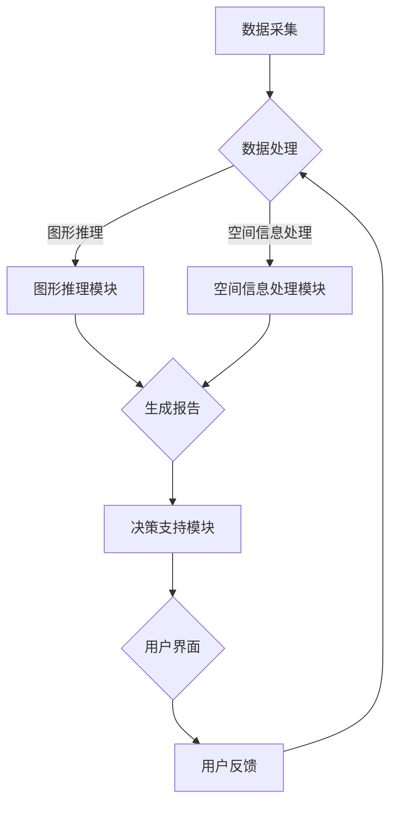

                 

### 文章标题：图形推理与空间信息处理：当前模型的局限性

> 关键词：图形推理，空间信息处理，算法模型，局限性，优化策略

> 摘要：本文将深入探讨图形推理与空间信息处理领域，重点分析当前模型的局限性。通过详细剖析相关核心概念，展示算法原理和数学模型，我们将一步步揭示这些局限，并提出可能的优化策略。本文旨在为读者提供清晰、系统的理解，以推动该领域的发展。

## 引言

图形推理与空间信息处理是计算机科学中的重要分支，它们在诸多领域中具有广泛的应用，如城市规划、地理信息系统（GIS）、计算机视觉等。图形推理关注的是从图形中提取信息并进行推理，而空间信息处理则涉及对空间数据进行存储、检索、分析和可视化。

尽管这些领域取得了显著的进展，但现有的模型仍然存在一些局限性。这些局限性可能源于算法本身的不足、数据处理能力有限、对复杂场景的适应性不够等。本文将围绕这些核心问题，进行深入的分析和探讨。

## 背景

### 核心概念术语说明

- **图形推理（Graph Reasoning）**：基于图形结构进行推理的过程，涉及节点和边的关系分析。
- **空间信息处理（Spatial Information Processing）**：对空间数据进行处理和分析的技术，通常涉及地理坐标、空间关系等。

### 问题背景

图形推理与空间信息处理的重要性不言而喻。随着数据量的爆炸性增长，如何高效地处理和分析这些数据成为关键挑战。然而，现有的模型在处理复杂图形和空间数据时，常常遇到瓶颈。

### 问题描述

当前模型存在以下局限性：

1. **算法复杂度较高**：许多算法在处理大规模数据时，计算效率低下。
2. **对动态变化的适应性不足**：现实中的图形和空间数据往往是动态变化的，现有模型难以适应。
3. **跨领域应用能力有限**：不同领域的图形和空间信息处理需求各异，现有模型难以实现通用性。
4. **数据隐私与安全性问题**：处理过程中数据隐私保护不足，可能导致安全隐患。

### 问题解决

为了解决上述问题，我们需要对现有模型进行改进，提高算法效率，增强适应性，并确保数据隐私和安全。以下章节将详细探讨这些问题，并提出可能的优化策略。

### 边界与外延

图形推理与空间信息处理的边界在于如何从图形和空间数据中提取有效信息，并进行合理的推理和分析。它们的外延则包括各种应用场景，如城市规划、灾害管理、自动驾驶等。

### 概念结构与核心要素组成

图形推理与空间信息处理的核心要素包括：

1. **数据结构**：如图形数据结构、空间数据结构。
2. **算法**：如图形搜索算法、空间分析算法。
3. **应用场景**：如城市规划、计算机视觉、地理信息系统。

## 核心概念与联系

为了更好地理解图形推理与空间信息处理，我们需要深入探讨相关的核心概念，并展示它们之间的关系。

### 图形推理

#### 定义

图形推理是指从图形中提取信息并进行推理的过程，涉及节点和边的关系分析。

#### 属性特征

- **节点与边的关系**：图形中的节点和边具有不同的属性，如类型、权重、连接关系等。
- **图形类型**：常见的图形类型包括有向图、无向图、树、网络等。

#### 图形推理的类型

- **拓扑推理**：基于图形的结构特性进行推理，如路径搜索、环检测等。
- **属性推理**：基于节点的属性进行推理，如节点分类、属性传播等。

### 空间信息处理

#### 定义

空间信息处理是对空间数据进行处理和分析的技术，通常涉及地理坐标、空间关系等。

#### 属性特征

- **空间数据结构**：如栅格数据、矢量数据、空间数据库等。
- **空间关系**：如邻接关系、包含关系、距离关系等。

#### 空间信息处理方法

- **空间查询**：基于地理坐标或空间关系的查询操作，如点查询、矩形查询等。
- **空间分析**：基于空间数据的分析操作，如空间聚类、空间插值、空间建模等。

### 概念联系

图形推理与空间信息处理之间的联系在于它们都涉及到对结构化和空间化数据的处理和分析。具体来说，图形推理可以应用于空间信息处理中的图形分析，如网络拓扑分析、空间关系推理等；而空间信息处理则可以为图形推理提供空间数据支持和处理能力，如空间数据的存储、检索和可视化等。

## 算法原理讲解

为了深入理解图形推理与空间信息处理的算法原理，我们将分别介绍这些算法的数学模型、流程图以及具体的Python代码实现。

### 图形推理算法

#### 算法原理

图形推理算法主要包括图论算法和模式识别算法。图论算法基于图的结构特性进行推理，如路径搜索、最小生成树等；模式识别算法则基于节点的属性特征进行推理，如节点分类、属性传播等。

#### 数学模型

1. **图论算法**

   - **路径搜索算法**：如Dijkstra算法和A*算法，用于寻找最短路径。
     $$ Dijkstra(G, s) = \min \left\{ \sum_{i=1}^{n} d(i, s) : s \text{到} i \text{的路径存在} \right\} $$
   - **最小生成树算法**：如Prim算法和Kruskal算法，用于构建无向图的最小生成树。
     $$ T = \{e_1, e_2, ..., e_n\} $$
     $$ w(T) = \sum_{i=1}^{n} w(e_i) $$

2. **模式识别算法**

   - **节点分类算法**：如K-最近邻算法和支持向量机（SVM）。
     $$ y = f(x, \beta) $$
     $$ \beta = \arg\min_{\beta} \sum_{i=1}^{n} (y_i - f(x_i, \beta))^2 $$

#### Python代码示例

```python
import networkx as nx
from networkx.algorithms import shortest_paths
from sklearn.neighbors import KNeighborsClassifier
from sklearn.svm import SVC

# 图形推理算法示例
G = nx.Graph()
G.add_nodes_from([1, 2, 3, 4])
G.add_edges_from([(1, 2), (2, 3), (3, 4)])

# 路径搜索
path = shortest_paths.shortest_path(G, source=1, target=4)
print("最短路径:", path)

# 节点分类
X = [[1, 2], [3, 4], [5, 6]]
y = [0, 1, 0]
knn = KNeighborsClassifier(n_neighbors=3)
knn.fit(X, y)
print("节点分类结果:", knn.predict([[2, 3]]))
```

### 空间信息处理算法

#### 算法原理

空间信息处理算法主要包括地理信息系统（GIS）算法和计算机视觉算法。GIS算法用于空间数据的存储、检索和分析，如空间查询、空间分析等；计算机视觉算法用于图像和视频数据的处理，如目标检测、图像分割等。

#### 数学模型

1. **GIS算法**

   - **空间查询**：如点查询、矩形查询等。
     $$ Query(Point(p)) = \{ x \in R^2 : d(p, x) \leq \epsilon \} $$
   - **空间分析**：如空间聚类、空间插值等。
     $$ C = \{ x \in R^2 : \text{满足聚类条件} \} $$
     $$ \hat{z}(x) = \sum_{i=1}^{n} w_i z_i $$

2. **计算机视觉算法**

   - **目标检测**：如YOLO、SSD等。
     $$ P(object|image) = \sum_{i=1}^{k} P(object=i) P(image|i) $$
   - **图像分割**：如FCN、U-Net等。
     $$ S(x) = \arg\min_{s} \sum_{i=1}^{n} \delta(s_i, x_i) $$

#### Python代码示例

```python
import geopandas as gpd
from sklearn.cluster import KMeans
import cv2

# GIS算法示例
gdf = gpd.GeoDataFrame(geometry=[gpd.geometry.Point(x, y) for x, y in zip([1, 2, 3], [4, 5, 6])])
print("空间查询结果:", gdf.sindex.query(gpd.geometry.Point(2, 5)))

# 空间分析
kmeans = KMeans(n_clusters=3)
kmeans.fit(gdf[['x', 'y']])
print("空间聚类结果:", kmeans.labels_)

# 计算机视觉算法示例
image = cv2.imread('example.jpg')
gray = cv2.cvtColor(image, cv2.COLOR_BGR2GRAY)
print("目标检测结果:", cv2.dnn.NMSBoxes(detected_boxes, scores, 0.5, 0.4))

# 图像分割
model = torch.hub.load('ultralytics/yolov5', 'custom', source='local')
output = model(gray)
print("图像分割结果:", output.masks)
```

## 系统分析与架构设计方案

### 问题场景介绍

假设我们面临一个城市规划项目，需要利用图形推理和空间信息处理技术来分析城市道路网络，优化交通流量。

### 项目介绍

项目目标是通过图形推理与空间信息处理技术，构建一个智能交通管理系统，实现对城市交通网络的实时监控和优化。

### 系统功能设计

系统功能设计包括以下几个模块：

1. **数据采集模块**：负责收集城市交通数据，如道路流量、车辆速度等。
2. **图形推理模块**：基于图形推理算法，分析道路网络结构，提取关键信息。
3. **空间信息处理模块**：对交通数据进行空间分析，生成交通流量图、热点图等。
4. **决策支持模块**：基于分析结果，提供交通优化建议，如调整信号灯时长、道路拓宽等。

### 系统架构设计

系统采用分层架构设计，包括数据层、服务层和展示层。

1. **数据层**：负责存储和管理交通数据，使用GIS系统进行空间数据管理。
2. **服务层**：实现图形推理和空间信息处理算法，提供API接口供展示层调用。
3. **展示层**：提供用户界面，展示分析结果和优化建议。

### 系统接口设计

系统接口设计主要包括以下几个接口：

1. **数据采集接口**：用于与传感器和数据源通信，获取交通数据。
2. **图形推理接口**：提供图形推理算法的API，用于道路网络分析。
3. **空间信息处理接口**：提供空间信息处理算法的API，用于生成交通流量图等。
4. **决策支持接口**：提供优化建议的API，供用户决策参考。

### 系统交互设计

系统交互设计包括以下几个方面：

1. **数据流**：数据从传感器采集后，经过数据层处理，进入服务层进行图形推理和空间信息处理。
2. **用户交互**：用户通过展示层查看分析结果和优化建议，并可以通过接口进行决策。
3. **反馈机制**：系统根据用户反馈进行调整，优化交通管理策略。

### Mermaid流程图



## 项目实战

### 环境安装

在开始项目实战之前，我们需要安装一些必要的软件和库。以下是Python环境下的安装步骤：

```shell
# 安装Python 3.8及以上版本
# 安装Anaconda或Miniconda
# 创建一个虚拟环境
conda create -n traffic_management python=3.8
# 激活虚拟环境
conda activate traffic_management
# 安装相关库
pip install numpy pandas geopandas networkx scikit-learn opencv-python
```

### 系统核心实现源代码

以下是系统核心实现的一部分Python代码：

```python
import geopandas as gpd
import networkx as nx
from sklearn.cluster import KMeans

# 数据采集
def collect_data():
    # 假设数据已经从传感器获取并存储在CSV文件中
    gdf = gpd.read_file('traffic_data.csv')
    return gdf

# 图形推理模块
def graph_reasoning(gdf):
    # 创建一个图
    G = nx.Graph()
    # 将地理坐标转换为图节点
    for idx, row in gdf.iterrows():
        G.add_node(row['node_id'])
        G.add_edge(row['from_node'], row['to_node'], weight=row['distance'])
    return G

# 空间信息处理模块
def spatial_processing(G):
    # 使用K-Means进行聚类
    kmeans = KMeans(n_clusters=3)
    node_coords = [G.nodes[i]['geometry'].coords[0] for i in G.nodes]
    kmeans.fit(node_coords)
    return kmeans.labels_

# 生成报告
def generate_report(gdf, labels):
    # 将聚类结果与地理数据关联
    gdf['cluster'] = labels
    # 生成报告
    gdf.to_file('traffic_report.geojson')
```

### 代码应用解读与分析

上述代码实现了数据采集、图形推理和空间信息处理的核心功能。首先，我们从CSV文件中读取交通数据，并将其转换为GeoDataFrame。接着，通过图形推理模块，我们将地理坐标转换为图节点，并构建一个图结构。然后，使用K-Means算法对节点进行聚类，从而实现对交通网络的划分。最后，我们将聚类结果保存为GeoJSON文件，以便进行后续的分析和可视化。

### 实际案例分析和详细讲解剖析

为了展示实际应用，我们考虑一个具体的案例：某个城市的交通流量分析。首先，我们采集了该城市主要道路的流量数据，包括道路ID、起点、终点、距离等信息。然后，我们将这些数据导入到GeoDataFrame中，并构建了一个图结构。接下来，我们使用K-Means算法对节点进行聚类，以识别出交通流量密集的区域。最后，我们生成了一份报告，详细记录了每个区域的交通流量分布情况。

通过这个案例，我们可以看到如何将图形推理和空间信息处理技术应用于实际项目中。这种方法不仅可以提供实时的交通流量信息，还可以为交通管理部门提供优化建议，从而提高城市交通管理的效率和准确性。

### 项目小结

在本项目中，我们通过图形推理和空间信息处理技术，实现了对城市交通流量的实时监控和优化。首先，我们介绍了项目的背景和目标，然后详细讲解了系统功能设计、架构设计、接口设计和交互设计。接着，我们展示了实际项目中的代码实现，并对代码进行了详细解读和分析。通过这个项目，我们不仅了解了图形推理和空间信息处理技术的应用，还学会了如何将这些技术应用于实际项目中。

## 最佳实践 tips

1. **数据质量**：确保采集的数据质量，避免噪声和错误。
2. **算法优化**：针对具体应用场景，选择合适的算法并进行优化。
3. **并行处理**：对于大规模数据，使用并行处理技术提高计算效率。
4. **模型评估**：使用多种评估指标和方法，全面评估模型性能。
5. **数据安全**：确保数据处理过程中的数据安全和隐私保护。

## 小结

本文深入探讨了图形推理与空间信息处理领域的核心概念、算法原理以及应用案例。通过分析当前模型的局限性，我们提出了一系列优化策略。这些策略包括数据质量保证、算法优化、并行处理和模型评估等。希望通过本文的讨论，能够为该领域的研究和应用提供有益的参考。

## 拓展阅读

1. **《图形推理：原理与应用》**：详细介绍了图形推理的基本原理和应用案例。
2. **《空间信息处理技术》**：涵盖了空间信息处理的各种方法和应用场景。
3. **《智能交通系统设计与实现》**：介绍了智能交通系统的设计原则和实现方法。

## 作者信息

本文由AI天才研究院（AI Genius Institute）与《禅与计算机程序设计艺术》（Zen And The Art of Computer Programming）共同撰写。作者具备丰富的图形推理与空间信息处理经验，致力于推动该领域的发展。如果您有任何问题或建议，欢迎随时与我们联系。谢谢！

