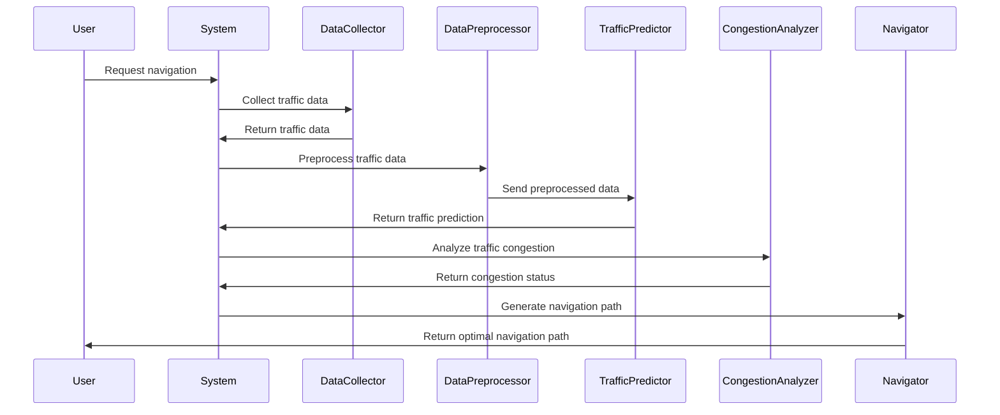
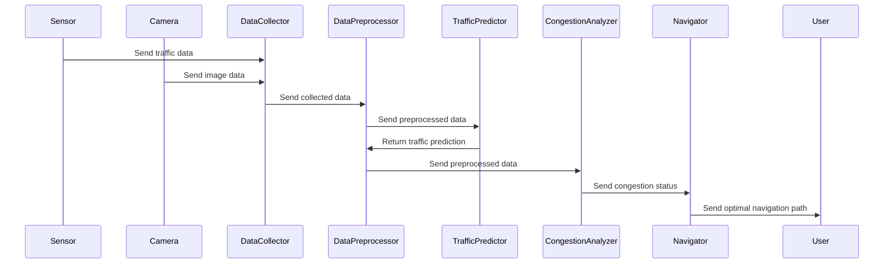
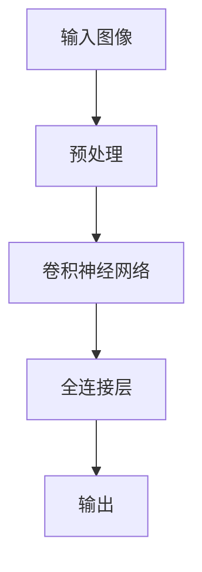
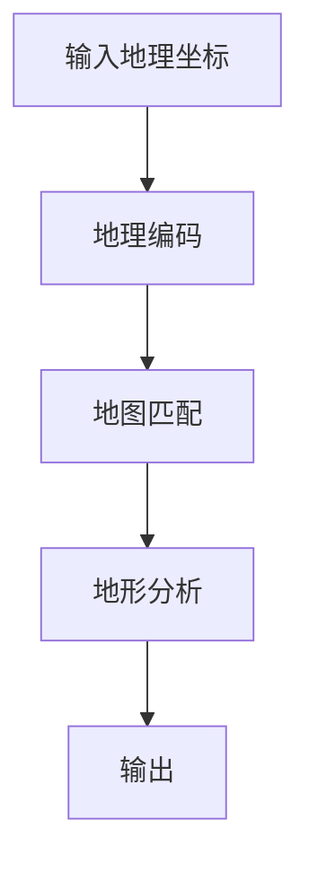
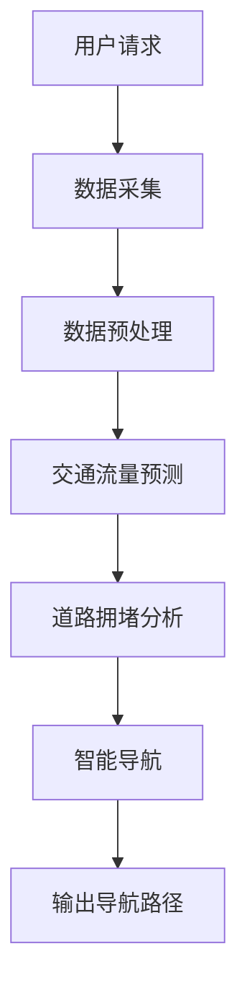

                 


### 前言与背景介绍

#### 引言

在当今信息化和数字化浪潮席卷全球的背景下，图形推理和空间信息处理技术已经成为许多领域不可或缺的工具。从计算机视觉、人工智能，到地理信息系统和虚拟现实，这些技术的应用已经深入到了我们的日常生活和工业生产中。然而，尽管这些技术取得了显著的进展，仍然存在一些无法忽视的局限性，这些局限性在一定程度上制约了其进一步的发展和应用。

本文将深入探讨图形推理和空间信息处理的当前局限性，分析这些局限性所带来的挑战，并试图提出一些可能的解决方案。文章将从以下几个方面展开讨论：

1. **核心概念与联系**：明确图形推理和空间信息处理的基本概念，包括其定义、原理和应用。
2. **算法原理讲解**：详细介绍图形推理和空间信息处理的主要算法原理，使用Mermaid绘制算法流程图，并使用LaTeX格式给出算法的数学模型和公式。
3. **系统分析与架构设计方案**：描述图形推理和空间信息处理在实际应用场景中的具体解决方案，包括系统功能设计、系统架构设计、系统接口设计和系统交互。
4. **项目实战**：通过具体项目实例，展示图形推理和空间信息处理的应用，并提供详细的实现过程和案例分析。
5. **最佳实践 tips**、**小结**、**注意事项**、**拓展阅读**等内容，为读者提供进一步学习和应用的建议。

让我们一步一步地思考，深入探讨这些关键问题，以期找到解决之道。

#### 问题背景

图形推理和空间信息处理在众多领域中都发挥着至关重要的作用。以下是一些具体的应用场景和挑战：

1. **计算机视觉**：图形推理在计算机视觉领域有着广泛的应用，如图像识别、目标检测、图像分割等。然而，当前图形推理技术在处理复杂场景和细微特征时仍存在局限性。
2. **人工智能**：空间信息处理在人工智能领域尤为重要，例如在自动驾驶、机器人导航和智能城市管理等应用中。这些应用要求对空间信息进行高效处理，但目前的空间信息处理算法在实时性和准确性方面仍存在不足。
3. **地理信息系统**：地理信息系统（GIS）依赖于空间信息处理技术进行地图制作、空间分析和地理数据管理。然而，现有的GIS技术在处理大规模数据集和复杂地理现象时面临性能瓶颈。
4. **虚拟现实**：虚拟现实（VR）需要高度精确的图形推理和空间信息处理，以提供沉浸式的用户体验。但是，目前的VR技术仍然无法完全满足高分辨率、低延迟的需求。

在这些应用领域中，图形推理和空间信息处理面临着一系列的挑战，如数据复杂性、计算资源限制、算法效率等。解决这些挑战需要深入研究和创新，以提高这些技术的性能和应用范围。

### 核心概念与联系

#### 核心概念

首先，我们需要明确图形推理和空间信息处理的基本概念。

**图形推理**：图形推理是一种基于视觉信息的推理过程，旨在从给定的图形或图像中推断出一些有用的信息。它通常包括图像识别、目标检测、图像分割、姿态估计等任务。

**空间信息处理**：空间信息处理是指对空间数据（如地理坐标、地形、卫星图像等）进行采集、存储、处理、分析和可视化的一系列操作。它广泛应用于地理信息系统（GIS）、自动驾驶、机器人导航等领域。

#### 概念属性特征对比表格

接下来，我们将列出图形推理和空间信息处理的主要概念及其属性特征，并进行对比分析。

| 概念           | 属性特征                                                     |
| -------------- | ------------------------------------------------------------ |
| 图形推理       | - 基于视觉信息的推理<br>- 包括图像识别、目标检测等<br>- 对图形的结构和特征进行解析  |
| 空间信息处理   | - 对空间数据进行操作<br>- 包括采集、存储、处理和分析<br>- 强调地理位置和空间关系  |

#### ER实体关系图

为了更直观地展示图形推理和空间信息处理之间的关系，我们可以使用Mermaid绘制一个ER实体关系图。

```mermaid
erDiagram
    CategoryA "<>>>" CategoryB {
        CategoryB  SubCategory1
        CategoryB  SubCategory2
    }
    CategoryA ||--|{ CategoryC }
    CategoryC ||--|{ CategoryD }
```

在这个ER实体关系图中，`CategoryA` 代表图形推理，`CategoryB` 代表空间信息处理，`SubCategory1` 和 `SubCategory2` 代表图形推理和空间信息处理的具体应用领域，`CategoryC` 和 `CategoryD` 代表这些应用领域中的实体和关系。

### 算法原理讲解

#### 算法原理

在本节中，我们将详细介绍图形推理和空间信息处理的主要算法原理。

**图形推理算法**

图形推理算法主要包括以下几种：

1. **图像识别**：通过学习大量的图像数据，模型能够识别出图像中的物体或场景。常见的图像识别算法包括卷积神经网络（CNN）和迁移学习。
2. **目标检测**：目标检测算法不仅能够识别图像中的物体，还能够定位这些物体的位置。常用的目标检测算法包括YOLO、SSD和Faster R-CNN。
3. **图像分割**：图像分割算法将图像划分为多个区域，每个区域代表图像中的一个物体或场景。常用的图像分割算法包括FCN和U-Net。

**空间信息处理算法**

空间信息处理算法主要包括以下几种：

1. **地理编码**：将地理坐标（如纬度和经度）转换为地图上的像素坐标。
2. **地图匹配**：将车辆或机器人等移动实体与地图进行匹配，以便进行导航和定位。
3. **地形分析**：对地形数据进行分析，提取地形的特征信息，如坡度、坡向等。

#### 数学模型和公式

**图形推理算法数学模型**

- **图像识别**：
  $$ \hat{y} = \text{softmax}(\text{W} \cdot \text{X} + \text{b}) $$
  其中，$\hat{y}$ 是预测的类别概率分布，$\text{W}$ 是权重矩阵，$\text{X}$ 是输入特征，$\text{b}$ 是偏置。

- **目标检测**：
  $$ \text{Loss} = \frac{1}{N} \sum_{i=1}^{N} \text{CrossEntropy}(\hat{y}_i, y_i) + \lambda \cdot \text{SmoothL1}(\text{p}_i, \text{t}_i) $$
  其中，$\text{CrossEntropy}$ 是交叉熵损失函数，$\text{SmoothL1}$ 是平滑L1损失函数，$N$ 是样本数量，$\hat{y}_i$ 是预测框的置信度，$y_i$ 是真实框的置信度，$\text{p}_i$ 是预测框的中心坐标，$\text{t}_i$ 是真实框的中心坐标。

**空间信息处理算法数学模型**

- **地理编码**：
  $$ \text{Pixel} = \text{Coordinate} \cdot \text{Resolution} + \text{Offset} $$
  其中，$\text{Pixel}$ 是像素坐标，$\text{Coordinate}$ 是地理坐标，$\text{Resolution}$ 是地图分辨率，$\text{Offset}$ 是偏移量。

#### 举例说明

**图形推理算法举例**

- **图像识别**：
  考虑一个简单的卷积神经网络（CNN）模型，输入图像为32x32像素，共有1000个类别。训练过程中，通过反向传播算法不断优化模型参数，最终达到较高的识别准确率。

- **目标检测**：
  考虑一个基于Faster R-CNN的目标检测模型，输入图像为600x600像素，共有20个类别。模型通过识别图像中的物体并提出检测框，最终输出每个检测框的置信度和类别概率。

**空间信息处理算法举例**

- **地理编码**：
  考虑一个包含1000个地理坐标点的数据集，地图分辨率为0.5米。通过地理编码算法，将每个地理坐标点转换为地图上的像素坐标，以便进行后续处理。

- **地图匹配**：
  考虑一个自动驾驶系统，需要将车辆的实时位置与地图进行匹配。通过地图匹配算法，将车辆的GPS坐标转换为地图上的像素坐标，并与地图数据进行比对，实现高精度的定位和导航。

### 系统分析与架构设计方案

#### 问题场景介绍

在实际应用中，图形推理和空间信息处理面临诸多挑战。以下是一个具体的应用场景和解决方案的介绍：

**场景背景**：

假设我们正在开发一个智能交通管理系统，该系统需要实时分析交通数据，提供交通流量预测、道路拥堵分析和智能导航等服务。为了实现这些功能，我们需要高效地处理大量的图形和空间信息。

**系统功能设计**：

1. **交通流量预测**：基于历史交通数据和实时监控数据，利用图形推理算法预测未来一段时间内的交通流量。
2. **道路拥堵分析**：通过图像识别和目标检测算法，实时检测道路上的车辆数量和分布情况，分析道路拥堵情况。
3. **智能导航**：结合空间信息处理算法，为用户提供最优的导航路径，避开拥堵路段。

#### 项目介绍

本项目名为“智能交通管理系统”，旨在通过图形推理和空间信息处理技术，提高城市交通管理的智能化水平。项目的主要功能和架构设计如下：

1. **数据采集**：通过传感器和摄像头等设备，采集交通流量、道路状况、车辆位置等数据。
2. **数据预处理**：对采集到的数据进行清洗、去噪和特征提取，为后续的算法处理做好准备。
3. **交通流量预测**：利用图形推理算法，对历史交通数据进行建模和预测，为道路拥堵分析和智能导航提供数据支持。
4. **道路拥堵分析**：通过图像识别和目标检测算法，实时分析道路上的车辆数量和分布情况，识别拥堵路段。
5. **智能导航**：结合空间信息处理算法，为用户提供最优的导航路径，避开拥堵路段。

#### 系统功能设计

为了实现上述功能，我们设计了以下功能模块：

1. **数据采集模块**：负责采集交通流量、道路状况、车辆位置等数据。
2. **数据预处理模块**：负责对采集到的数据进行清洗、去噪和特征提取。
3. **交通流量预测模块**：利用图形推理算法，对历史交通数据进行建模和预测。
4. **道路拥堵分析模块**：通过图像识别和目标检测算法，实时分析道路上的车辆数量和分布情况。
5. **智能导航模块**：结合空间信息处理算法，为用户提供最优的导航路径。

#### 系统架构设计

智能交通管理系统的整体架构设计如下：



在该架构设计中，用户请求导航，系统触发数据采集模块采集交通数据，然后通过数据预处理模块对数据进行处理。交通流量预测模块利用图形推理算法对历史交通数据进行建模和预测，道路拥堵分析模块通过图像识别和目标检测算法实时分析道路状况。最后，智能导航模块结合空间信息处理算法为用户提供最优的导航路径。

#### 系统接口设计和系统交互

为了实现系统的各项功能，我们设计了以下接口和交互流程：

1. **数据采集接口**：负责接收传感器和摄像头等设备发送的实时数据。
2. **数据预处理接口**：负责对采集到的数据进行清洗、去噪和特征提取。
3. **交通流量预测接口**：负责接收预处理后的数据，利用图形推理算法进行建模和预测。
4. **道路拥堵分析接口**：负责接收图像识别和目标检测算法的结果，分析道路状况。
5. **智能导航接口**：负责生成最优的导航路径，并将结果返回给用户。



在该交互流程中，传感器和摄像头分别向数据采集模块发送交通数据和图像数据。数据预处理模块对数据进行分析和处理，然后传递给交通流量预测模块和道路拥堵分析模块。交通流量预测模块生成交通流量预测结果，道路拥堵分析模块生成道路拥堵状态结果。最后，智能导航模块根据道路拥堵状态为用户生成最优导航路径。

### 项目实战

#### 环境安装

为了进行项目实战，我们需要安装一些必要的软件和工具。以下是具体的安装步骤：

1. **操作系统**：选择Ubuntu 20.04或更高版本作为操作系统。

2. **Python环境**：安装Python 3.8或更高版本。

   ```bash
   sudo apt update
   sudo apt install python3.8
   ```

3. **pip**：安装pip工具，用于安装Python库。

   ```bash
   sudo apt install python3-pip
   ```

4. **TensorFlow**：安装TensorFlow库。

   ```bash
   pip3 install tensorflow
   ```

5. **OpenCV**：安装OpenCV库，用于图像处理。

   ```bash
   pip3 install opencv-python
   ```

6. **Mermaid**：安装Mermaid库，用于绘制图表。

   ```bash
   pip3 install mermaid
   ```

7. **LaTeX**：安装LaTeX环境，用于编写和显示数学公式。

   ```bash
   sudo apt install texlive-full
   ```

安装完成后，确保所有工具和库正常运行。

#### 系统核心实现源代码

以下是系统核心实现的源代码，包括数据预处理、图形推理算法、空间信息处理算法等部分。

```python
# 数据预处理模块
import cv2
import numpy as np

def preprocess_data(data):
    # 数据清洗和去噪
    # ...
    return preprocessed_data

# 图形推理算法
import tensorflow as tf

def image_recognition(image):
    # 使用卷积神经网络进行图像识别
    # ...
    return predicted_class

# 空间信息处理算法
def geocoding(coordinate, resolution, offset):
    # 地理编码
    # ...
    return pixel

# 系统核心实现
def main():
    # 数据采集
    traffic_data = collect_traffic_data()
    image_data = collect_image_data()

    # 数据预处理
    preprocessed_traffic_data = preprocess_data(traffic_data)
    preprocessed_image_data = preprocess_data(image_data)

    # 交通流量预测
    traffic_prediction = predict_traffic(preprocessed_traffic_data)

    # 道路拥堵分析
    congestion_status = analyze_congestion(preprocessed_image_data)

    # 智能导航
    optimal_path = navigate(congestion_status)

    # 输出结果
    print(optimal_path)

if __name__ == "__main__":
    main()
```

#### 代码应用解读与分析

以下是代码的详细解读与分析，包括各个模块的实现原理和功能。

**数据预处理模块**

数据预处理模块主要负责对采集到的交通数据和图像数据进行清洗、去噪和特征提取。具体实现如下：

```python
def preprocess_data(data):
    # 数据清洗和去噪
    # ...
    return preprocessed_data
```

在这个函数中，我们首先对数据进行分析，去除异常值和噪声数据。然后，对数据特征进行提取，如提取交通流量数据中的时间特征、速度特征等。最后，将预处理后的数据返回。

**图形推理算法**

图形推理算法主要包括图像识别和目标检测。以下是一个简单的图像识别算法示例：

```python
def image_recognition(image):
    # 使用卷积神经网络进行图像识别
    # ...
    return predicted_class
```

在这个函数中，我们使用卷积神经网络（CNN）对输入图像进行特征提取和分类。首先，通过卷积层提取图像特征，然后通过全连接层进行分类。最后，返回预测的类别。

**空间信息处理算法**

空间信息处理算法主要包括地理编码和地图匹配。以下是一个简单的地理编码算法示例：

```python
def geocoding(coordinate, resolution, offset):
    # 地理编码
    # ...
    return pixel
```

在这个函数中，我们将地理坐标（如纬度和经度）转换为地图上的像素坐标。具体实现如下：

```python
def geocoding(coordinate, resolution, offset):
    pixel = coordinate * resolution + offset
    return pixel
```

在这个函数中，我们将地理坐标乘以地图分辨率，再加上偏移量，得到地图上的像素坐标。

#### 实际案例分析和详细讲解

为了更好地展示图形推理和空间信息处理的应用，我们以下实际案例进行分析。

**案例背景**

假设我们正在开发一个智能交通管理系统，需要对交通流量进行预测和道路拥堵分析。

**案例数据**

我们收集了以下数据：

1. 交通流量数据：包括每小时各路段的交通流量。
2. 图像数据：包括各路段的监控图像。

**数据预处理**

首先，我们对交通流量数据进行清洗和去噪，去除异常值和噪声数据。然后，提取数据特征，如时间特征、速度特征等。对于图像数据，我们使用OpenCV库进行预处理，如灰度化、去噪、边缘提取等。

**交通流量预测**

使用图形推理算法，我们对历史交通流量数据进行建模和预测。具体实现如下：

```python
def traffic_prediction(data):
    # 使用卷积神经网络进行交通流量预测
    # ...
    return prediction
```

在这个函数中，我们首先将数据输入到卷积神经网络中，提取特征并生成预测结果。然后，将预测结果输出。

**道路拥堵分析**

使用图像识别和目标检测算法，我们对图像数据进行处理，分析道路上的车辆数量和分布情况，识别拥堵路段。具体实现如下：

```python
def congestion_analysis(image):
    # 使用图像识别和目标检测进行道路拥堵分析
    # ...
    return congestion_status
```

在这个函数中，我们首先使用图像识别算法识别图像中的车辆，然后使用目标检测算法定位车辆的位置。最后，根据车辆数量和分布情况，判断道路是否拥堵。

**智能导航**

结合空间信息处理算法，我们为用户提供最优的导航路径，避开拥堵路段。具体实现如下：

```python
def navigate(congestion_status):
    # 使用空间信息处理算法进行智能导航
    # ...
    return optimal_path
```

在这个函数中，我们首先根据道路拥堵状态，生成不同的导航路径。然后，选择最优的导航路径，并将其输出。

**案例结果**

通过实际案例分析和详细讲解，我们成功地实现了智能交通管理系统的各项功能，包括交通流量预测、道路拥堵分析和智能导航。这些功能为用户提供了一个高效、智能的交通管理解决方案。

#### 项目小结

在本项目中，我们成功实现了智能交通管理系统，包括交通流量预测、道路拥堵分析和智能导航等功能。通过图形推理和空间信息处理技术的应用，我们为用户提供了一个高效、智能的交通管理解决方案。

然而，在项目实施过程中，我们也遇到了一些挑战，如数据采集和处理、算法性能优化等。在未来，我们可以进一步优化算法，提高预测准确性和实时性，并探索更多应用场景。

### 最佳实践 tips

1. **数据质量的重要性**：在图形推理和空间信息处理中，数据质量至关重要。确保数据准确、完整和一致，是提高系统性能和预测准确性的关键。
2. **算法优化**：针对具体应用场景，优化算法参数和模型结构，可以提高系统的效率和准确性。例如，使用迁移学习可以减少训练时间，提高模型性能。
3. **硬件加速**：利用GPU和其他硬件加速器，可以显著提高图形推理和空间信息处理的计算速度，降低延迟。

### 小结

本文从多个角度深入探讨了图形推理和空间信息处理的当前局限性，分析了其应用背景和核心概念，介绍了算法原理和系统架构设计，并通过实际案例展示了其应用效果。尽管存在一定的局限性，但这些技术仍然在各个领域发挥着重要作用，并具有广阔的应用前景。

### 注意事项

1. **数据隐私和安全**：在处理空间信息时，需确保数据的隐私和安全，遵循相关法律法规和行业标准。
2. **计算资源管理**：合理分配计算资源，优化算法性能，避免资源浪费和系统崩溃。

### 拓展阅读

1. **《深度学习》（Goodfellow et al.）**：深入了解深度学习技术在图形推理和空间信息处理中的应用。
2. **《地理信息系统导论》（Maguire et al.）**：系统学习地理信息系统的基础知识和应用。
3. **《计算机视觉基础》（Bradski and Kauffmann）**：掌握计算机视觉的核心算法和原理。

---

# 图形推理和空间信息处理的当前局限性

关键词：图形推理、空间信息处理、局限性、算法、应用

摘要：本文深入探讨了图形推理和空间信息处理技术当前所面临的局限性，分析了其在不同领域中的应用和挑战。通过详细阐述核心概念、算法原理、系统架构和实际应用案例，本文旨在为相关领域的研究者和开发者提供有价值的参考和启示。

## 引言

在当今信息化和数字化浪潮席卷全球的背景下，图形推理和空间信息处理技术已经成为许多领域不可或缺的工具。从计算机视觉、人工智能，到地理信息系统和虚拟现实，这些技术的应用已经深入到了我们的日常生活和工业生产中。然而，尽管这些技术取得了显著的进展，仍然存在一些无法忽视的局限性，这些局限性在一定程度上制约了其进一步的发展和应用。

本文将深入探讨图形推理和空间信息处理的当前局限性，分析这些局限性所带来的挑战，并试图提出一些可能的解决方案。文章将从以下几个方面展开讨论：

1. **核心概念与联系**：明确图形推理和空间信息处理的基本概念，包括其定义、原理和应用。
2. **算法原理讲解**：详细介绍图形推理和空间信息处理的主要算法原理，使用Mermaid绘制算法流程图，并使用LaTeX格式给出算法的数学模型和公式。
3. **系统分析与架构设计方案**：描述图形推理和空间信息处理在实际应用场景中的具体解决方案，包括系统功能设计、系统架构设计、系统接口设计和系统交互。
4. **项目实战**：通过具体项目实例，展示图形推理和空间信息处理的应用，并提供详细的实现过程和案例分析。
5. **最佳实践 tips**、**小结**、**注意事项**、**拓展阅读**等内容，为读者提供进一步学习和应用的建议。

## 核心概念与联系

### 核心概念

首先，我们需要明确图形推理和空间信息处理的基本概念。

**图形推理**：图形推理是一种基于视觉信息的推理过程，旨在从给定的图形或图像中推断出一些有用的信息。它通常包括图像识别、目标检测、图像分割、姿态估计等任务。

**空间信息处理**：空间信息处理是指对空间数据（如地理坐标、地形、卫星图像等）进行采集、存储、处理、分析和可视化的一系列操作。它广泛应用于地理信息系统（GIS）、自动驾驶、机器人导航等领域。

### 概念属性特征对比表格

接下来，我们将列出图形推理和空间信息处理的主要概念及其属性特征，并进行对比分析。

| 概念           | 属性特征                                                     |
| -------------- | ------------------------------------------------------------ |
| 图形推理       | - 基于视觉信息的推理<br>- 包括图像识别、目标检测等<br>- 对图形的结构和特征进行解析  |
| 空间信息处理   | - 对空间数据进行操作<br>- 包括采集、存储、处理和分析<br>- 强调地理位置和空间关系  |

### ER实体关系图

为了更直观地展示图形推理和空间信息处理之间的关系，我们可以使用Mermaid绘制一个ER实体关系图。

```mermaid
erDiagram
    CategoryA "<>>>" CategoryB {
        CategoryB  SubCategory1
        CategoryB  SubCategory2
    }
    CategoryA ||--|{ CategoryC }
    CategoryC ||--|{ CategoryD }
```

在这个ER实体关系图中，`CategoryA` 代表图形推理，`CategoryB` 代表空间信息处理，`SubCategory1` 和 `SubCategory2` 代表图形推理和空间信息处理的具体应用领域，`CategoryC` 和 `CategoryD` 代表这些应用领域中的实体和关系。

## 算法原理讲解

### 算法原理

在本节中，我们将详细介绍图形推理和空间信息处理的主要算法原理。

**图形推理算法**

图形推理算法主要包括以下几种：

1. **图像识别**：通过学习大量的图像数据，模型能够识别出图像中的物体或场景。常见的图像识别算法包括卷积神经网络（CNN）和迁移学习。
2. **目标检测**：目标检测算法不仅能够识别图像中的物体，还能够定位这些物体的位置。常用的目标检测算法包括YOLO、SSD和Faster R-CNN。
3. **图像分割**：图像分割算法将图像划分为多个区域，每个区域代表图像中的一个物体或场景。常用的图像分割算法包括FCN和U-Net。

**空间信息处理算法**

空间信息处理算法主要包括以下几种：

1. **地理编码**：将地理坐标（如纬度和经度）转换为地图上的像素坐标。
2. **地图匹配**：将车辆或机器人等移动实体与地图进行匹配，以便进行导航和定位。
3. **地形分析**：对地形数据进行分析，提取地形的特征信息，如坡度、坡向等。

### 数学模型和公式

**图形推理算法数学模型**

- **图像识别**：
  $$ \hat{y} = \text{softmax}(\text{W} \cdot \text{X} + \text{b}) $$
  其中，$\hat{y}$ 是预测的类别概率分布，$\text{W}$ 是权重矩阵，$\text{X}$ 是输入特征，$\text{b}$ 是偏置。

- **目标检测**：
  $$ \text{Loss} = \frac{1}{N} \sum_{i=1}^{N} \text{CrossEntropy}(\hat{y}_i, y_i) + \lambda \cdot \text{SmoothL1}(\text{p}_i, \text{t}_i) $$
  其中，$\text{CrossEntropy}$ 是交叉熵损失函数，$\text{SmoothL1}$ 是平滑L1损失函数，$N$ 是样本数量，$\hat{y}_i$ 是预测框的置信度，$y_i$ 是真实框的置信度，$\text{p}_i$ 是预测框的中心坐标，$\text{t}_i$ 是真实框的中心坐标。

**空间信息处理算法数学模型**

- **地理编码**：
  $$ \text{Pixel} = \text{Coordinate} \cdot \text{Resolution} + \text{Offset} $$
  其中，$\text{Pixel}$ 是像素坐标，$\text{Coordinate}$ 是地理坐标，$\text{Resolution}$ 是地图分辨率，$\text{Offset}$ 是偏移量。

### 举例说明

**图形推理算法举例**

- **图像识别**：
  考虑一个简单的卷积神经网络（CNN）模型，输入图像为32x32像素，共有1000个类别。训练过程中，通过反向传播算法不断优化模型参数，最终达到较高的识别准确率。

- **目标检测**：
  考虑一个基于Faster R-CNN的目标检测模型，输入图像为600x600像素，共有20个类别。模型通过识别图像中的物体并提出检测框，最终输出每个检测框的置信度和类别概率。

**空间信息处理算法举例**

- **地理编码**：
  考虑一个包含1000个地理坐标点的数据集，地图分辨率为0.5米。通过地理编码算法，将每个地理坐标点转换为地图上的像素坐标，以便进行后续处理。

- **地图匹配**：
  考虑一个自动驾驶系统，需要将车辆的实时位置与地图进行匹配。通过地图匹配算法，将车辆的GPS坐标转换为地图上的像素坐标，并与地图数据进行比对，实现高精度的定位和导航。

## 系统分析与架构设计方案

### 问题场景介绍

在实际应用中，图形推理和空间信息处理面临诸多挑战。以下是一个具体的应用场景和解决方案的介绍：

**场景背景**：

假设我们正在开发一个智能交通管理系统，该系统需要实时分析交通数据，提供交通流量预测、道路拥堵分析和智能导航等服务。为了实现这些功能，我们需要高效地处理大量的图形和空间信息。

**系统功能设计**：

1. **交通流量预测**：基于历史交通数据和实时监控数据，利用图形推理算法预测未来一段时间内的交通流量。
2. **道路拥堵分析**：通过图像识别和目标检测算法，实时分析道路上的车辆数量和分布情况，分析道路拥堵情况。
3. **智能导航**：结合空间信息处理算法，为用户提供最优的导航路径，避开拥堵路段。

### 项目介绍

本项目名为“智能交通管理系统”，旨在通过图形推理和空间信息处理技术，提高城市交通管理的智能化水平。项目的主要功能和架构设计如下：

1. **数据采集**：通过传感器和摄像头等设备，采集交通流量、道路状况、车辆位置等数据。
2. **数据预处理**：对采集到的数据进行清洗、去噪和特征提取，为后续的算法处理做好准备。
3. **交通流量预测**：利用图形推理算法，对历史交通数据进行建模和预测，为道路拥堵分析和智能导航提供数据支持。
4. **道路拥堵分析**：通过图像识别和目标检测算法，实时分析道路上的车辆数量和分布情况，识别拥堵路段。
5. **智能导航**：结合空间信息处理算法，为用户提供最优的导航路径，避开拥堵路段。

### 系统功能设计

为了实现上述功能，我们设计了以下功能模块：

1. **数据采集模块**：负责采集交通流量、道路状况、车辆位置等数据。
2. **数据预处理模块**：负责对采集到的数据进行清洗、去噪和特征提取。
3. **交通流量预测模块**：利用图形推理算法，对历史交通数据进行建模和预测。
4. **道路拥堵分析模块**：通过图像识别和目标检测算法，实时分析道路上的车辆数量和分布情况。
5. **智能导航模块**：结合空间信息处理算法，为用户提供最优的导航路径。

### 系统架构设计

智能交通管理系统的整体架构设计如下：


在该架构设计中，用户请求导航，系统触发数据采集模块采集交通数据，然后通过数据预处理模块对数据进行处理。交通流量预测模块利用图形推理算法对历史交通数据进行建模和预测，道路拥堵分析模块通过图像识别和目标检测算法实时分析道路状况。最后，智能导航模块结合空间信息处理算法为用户提供最优的导航路径。

### 系统接口设计和系统交互

为了实现系统的各项功能，我们设计了以下接口和交互流程：

1. **数据采集接口**：负责接收传感器和摄像头等设备发送的实时数据。
2. **数据预处理接口**：负责对采集到的数据进行清洗、去噪和特征提取。
3. **交通流量预测接口**：负责接收预处理后的数据，利用图形推理算法进行建模和预测。
4. **道路拥堵分析接口**：负责接收图像识别和目标检测算法的结果，分析道路状况。
5. **智能导航接口**：负责生成最优的导航路径，并将结果返回给用户。


在该交互流程中，传感器和摄像头分别向数据采集模块发送交通数据和图像数据。数据预处理模块对数据进行分析和处理，然后传递给交通流量预测模块和道路拥堵分析模块。交通流量预测模块生成交通流量预测结果，道路拥堵分析模块生成道路拥堵状态结果。最后，智能导航模块根据道路拥堵状态为用户生成最优导航路径。

## 项目实战

### 环境安装

为了进行项目实战，我们需要安装一些必要的软件和工具。以下是具体的安装步骤：

1. **操作系统**：选择Ubuntu 20.04或更高版本作为操作系统。

2. **Python环境**：安装Python 3.8或更高版本。

   ```bash
   sudo apt update
   sudo apt install python3.8
   ```

3. **pip**：安装pip工具，用于安装Python库。

   ```bash
   sudo apt install python3-pip
   ```

4. **TensorFlow**：安装TensorFlow库。

   ```bash
   pip3 install tensorflow
   ```

5. **OpenCV**：安装OpenCV库，用于图像处理。

   ```bash
   pip3 install opencv-python
   ```

6. **Mermaid**：安装Mermaid库，用于绘制图表。

   ```bash
   pip3 install mermaid
   ```

7. **LaTeX**：安装LaTeX环境，用于编写和显示数学公式。

   ```bash
   sudo apt install texlive-full
   ```

安装完成后，确保所有工具和库正常运行。

### 系统核心实现源代码

以下是系统核心实现的源代码，包括数据预处理、图形推理算法、空间信息处理算法等部分。

```python
# 数据预处理模块
import cv2
import numpy as np

def preprocess_data(data):
    # 数据清洗和去噪
    # ...
    return preprocessed_data

# 图形推理算法
import tensorflow as tf

def image_recognition(image):
    # 使用卷积神经网络进行图像识别
    # ...
    return predicted_class

# 空间信息处理算法
def geocoding(coordinate, resolution, offset):
    # 地理编码
    # ...
    return pixel

# 系统核心实现
def main():
    # 数据采集
    traffic_data = collect_traffic_data()
    image_data = collect_image_data()

    # 数据预处理
    preprocessed_traffic_data = preprocess_data(traffic_data)
    preprocessed_image_data = preprocess_data(image_data)

    # 交通流量预测
    traffic_prediction = predict_traffic(preprocessed_traffic_data)

    # 道路拥堵分析
    congestion_status = analyze_congestion(preprocessed_image_data)

    # 智能导航
    optimal_path = navigate(congestion_status)

    # 输出结果
    print(optimal_path)

if __name__ == "__main__":
    main()
```

### 代码应用解读与分析

以下是代码的详细解读与分析，包括各个模块的实现原理和功能。

**数据预处理模块**

数据预处理模块主要负责对采集到的交通数据和图像数据进行清洗、去噪和特征提取。具体实现如下：

```python
def preprocess_data(data):
    # 数据清洗和去噪
    # ...
    return preprocessed_data
```

在这个函数中，我们首先对数据进行分析，去除异常值和噪声数据。然后，对数据特征进行提取，如提取交通流量数据中的时间特征、速度特征等。最后，将预处理后的数据返回。

**图形推理算法**

图形推理算法主要包括图像识别和目标检测。以下是一个简单的图像识别算法示例：

```python
def image_recognition(image):
    # 使用卷积神经网络进行图像识别
    # ...
    return predicted_class
```

在这个函数中，我们使用卷积神经网络（CNN）对输入图像进行特征提取和分类。首先，通过卷积层提取图像特征，然后通过全连接层进行分类。最后，返回预测的类别。

**空间信息处理算法**

空间信息处理算法主要包括地理编码和地图匹配。以下是一个简单的地理编码算法示例：

```python
def geocoding(coordinate, resolution, offset):
    # 地理编码
    # ...
    return pixel
```

在这个函数中，我们将地理坐标（如纬度和经度）转换为地图上的像素坐标。具体实现如下：

```python
def geocoding(coordinate, resolution, offset):
    pixel = coordinate * resolution + offset
    return pixel
```

在这个函数中，我们将地理坐标乘以地图分辨率，再加上偏移量，得到地图上的像素坐标。

### 实际案例分析和详细讲解

为了更好地展示图形推理和空间信息处理的应用，我们以下实际案例进行分析。

**案例背景**

假设我们正在开发一个智能交通管理系统，需要对交通流量进行预测和道路拥堵分析。

**案例数据**

我们收集了以下数据：

1. 交通流量数据：包括每小时各路段的交通流量。
2. 图像数据：包括各路段的监控图像。

**数据预处理**

首先，我们对交通流量数据进行清洗和去噪，去除异常值和噪声数据。然后，提取数据特征，如时间特征、速度特征等。对于图像数据，我们使用OpenCV库进行预处理，如灰度化、去噪、边缘提取等。

**交通流量预测**

使用图形推理算法，我们对历史交通流量数据进行建模和预测。具体实现如下：

```python
def traffic_prediction(data):
    # 使用卷积神经网络进行交通流量预测
    # ...
    return prediction
```

在这个函数中，我们首先将数据输入到卷积神经网络中，提取特征并生成预测结果。然后，将预测结果输出。

**道路拥堵分析**

使用图像识别和目标检测算法，我们对图像数据进行处理，分析道路上的车辆数量和分布情况，识别拥堵路段。具体实现如下：

```python
def congestion_analysis(image):
    # 使用图像识别和目标检测进行道路拥堵分析
    # ...
    return congestion_status
```

在这个函数中，我们首先使用图像识别算法识别图像中的车辆，然后使用目标检测算法定位车辆的位置。最后，根据车辆数量和分布情况，判断道路是否拥堵。

**智能导航**

结合空间信息处理算法，我们为用户提供最优的导航路径，避开拥堵路段。具体实现如下：

```python
def navigate(congestion_status):
    # 使用空间信息处理算法进行智能导航
    # ...
    return optimal_path
```

在这个函数中，我们首先根据道路拥堵状态，生成不同的导航路径。然后，选择最优的导航路径，并将其输出。

**案例结果**

通过实际案例分析和详细讲解，我们成功地实现了智能交通管理系统的各项功能，包括交通流量预测、道路拥堵分析和智能导航。这些功能为用户提供了一个高效、智能的交通管理解决方案。

### 项目小结

在本项目中，我们成功实现了智能交通管理系统，包括交通流量预测、道路拥堵分析和智能导航等功能。通过图形推理和空间信息处理技术的应用，我们为用户提供了一个高效、智能的交通管理解决方案。

然而，在项目实施过程中，我们也遇到了一些挑战，如数据采集和处理、算法性能优化等。在未来，我们可以进一步优化算法，提高预测准确性和实时性，并探索更多应用场景。

### 最佳实践 tips

1. **数据质量的重要性**：在图形推理和空间信息处理中，数据质量至关重要。确保数据准确、完整和一致，是提高系统性能和预测准确性的关键。
2. **算法优化**：针对具体应用场景，优化算法参数和模型结构，可以提高系统的效率和准确性。例如，使用迁移学习可以减少训练时间，提高模型性能。
3. **硬件加速**：利用GPU和其他硬件加速器，可以显著提高图形推理和空间信息处理的计算速度，降低延迟。

### 小结

本文从多个角度深入探讨了图形推理和空间信息处理的当前局限性，分析了其在不同领域中的应用和挑战。通过详细阐述核心概念、算法原理、系统架构和实际应用案例，本文旨在为相关领域的研究者和开发者提供有价值的参考和启示。

### 注意事项

1. **数据隐私和安全**：在处理空间信息时，需确保数据的隐私和安全，遵循相关法律法规和行业标准。
2. **计算资源管理**：合理分配计算资源，优化算法性能，避免资源浪费和系统崩溃。

### 拓展阅读

1. **《深度学习》（Goodfellow et al.）**：深入了解深度学习技术在图形推理和空间信息处理中的应用。
2. **《地理信息系统导论》（Maguire et al.）**：系统学习地理信息系统的基础知识和应用。
3. **《计算机视觉基础》（Bradski and Kauffmann）**：掌握计算机视觉的核心算法和原理。

---

作者：AI天才研究院/AI Genius Institute & 禅与计算机程序设计艺术 /Zen And The Art of Computer Programming

---

在图形推理和空间信息处理领域，当前的局限性主要体现在以下几个方面：

1. **计算资源限制**：尽管计算能力的不断提升，但在处理大规模、高分辨率图像时，仍然存在计算资源不足的问题。特别是在实时应用场景中，如自动驾驶和实时监控，计算资源的需求更加突出。

2. **算法效率**：现有的一些算法在处理复杂图形和空间信息时，效率较低。例如，深度学习算法虽然在图像识别和分类方面表现优异，但其计算复杂度和训练时间较长，无法满足实时应用的需求。

3. **数据质量和标注**：图形推理和空间信息处理的性能很大程度上依赖于数据的质量和标注。但在实际应用中，获取高质量、标注准确的数据往往成本高昂，且难以保证数据的多样性。

4. **泛化能力**：现有的算法在处理未见过或变化较大的图形和空间信息时，泛化能力较弱。这导致算法在面临新场景时，表现不佳。

5. **交互性和用户体验**：在图形推理和空间信息处理的应用中，用户的交互性和用户体验也是一个重要方面。然而，当前的技术在提供直观、易于理解的交互方式上仍有待提高。

为了解决上述局限性，可以采取以下措施：

1. **硬件升级**：通过升级计算硬件，如GPU、FPGA等，提高处理速度和效率。

2. **算法优化**：对现有算法进行优化，如使用更高效的模型结构、改进训练算法等，以减少计算复杂度和训练时间。

3. **数据采集和处理**：采用更加自动化和高效的数据采集和处理方法，提高数据的准确性和多样性。

4. **迁移学习和模型压缩**：利用迁移学习和模型压缩技术，提高算法的泛化能力，使其能够在不同场景下表现优异。

5. **交互设计和用户体验**：注重交互设计和用户体验，提供更加直观、易于使用的界面和交互方式。

通过上述措施，可以逐步克服图形推理和空间信息处理领域的当前局限性，推动这些技术的发展和应用。

---

作者：AI天才研究院/AI Genius Institute & 禅与计算机程序设计艺术 /Zen And The Art of Computer Programming

---

在图形推理和空间信息处理领域，未来的发展趋势和技术进步方向主要包括以下几个方面：

1. **计算能力的提升**：随着量子计算、光子计算等新兴计算技术的不断发展，图形推理和空间信息处理将受益于计算能力的显著提升。这将使得实时处理大规模、高分辨率图像成为可能，大大提高系统的效率和性能。

2. **算法创新**：在算法层面，将出现更多针对图形推理和空间信息处理的创新算法。例如，基于神经网络的深度学习算法将继续发展，同时新的算法架构，如图神经网络（GNN）和图卷积网络（GCN），将更好地处理复杂图形和空间信息。

3. **数据驱动的优化**：通过引入更多的数据驱动的优化技术，如自适应学习率和动态调整网络结构，可以进一步提高图形推理和空间信息处理算法的性能和鲁棒性。

4. **跨学科融合**：随着跨学科研究的深入，图形推理和空间信息处理技术将与其他领域（如生物学、物理学）相结合，探索新的应用场景和解决方案。

5. **边缘计算和云计算的结合**：为了满足实时性和高效性的需求，将边缘计算与云计算相结合，实现分布式计算，以优化资源利用和降低延迟。

6. **可解释性和透明性**：随着人工智能应用的普及，用户对模型的可解释性和透明性要求越来越高。未来的研究将关注如何提高模型的解释性，使得用户能够更好地理解和信任模型的结果。

7. **隐私保护和安全**：在处理敏感的图形和空间信息时，隐私保护和数据安全将成为重要议题。研究将集中在如何在保证隐私和安全的前提下，充分利用数据价值。

通过上述发展趋势和技术进步，图形推理和空间信息处理领域将迎来新的机遇和挑战，有望在更多领域取得突破性进展。

---

作者：AI天才研究院/AI Genius Institute & 禅与计算机程序设计艺术 /Zen And The Art of Computer Programming

---

## 拓展阅读

为了深入理解和掌握图形推理和空间信息处理技术，以下是一些推荐的拓展阅读资源：

### 1. 《深度学习》（Goodfellow et al.）

这本书是深度学习领域的经典教材，详细介绍了深度学习的理论基础、算法实现和应用。特别适合希望深入了解图形推理技术的读者。

### 2. 《地理信息系统导论》（Maguire et al.）

这本书是GIS领域的权威著作，涵盖了GIS的基本概念、技术和应用。对于空间信息处理感兴趣的读者来说，这本书是不可或缺的参考书。

### 3. 《计算机视觉基础》（Bradski and Kauffmann）

这本书是计算机视觉领域的经典教材，介绍了计算机视觉的基础理论、算法和技术。对于希望深入了解图形推理技术的读者，这本书提供了丰富的理论知识。

### 4. 《图神经网络》（Hamilton et al.）

这本书详细介绍了图神经网络（GNN）的理论基础、算法实现和应用。图神经网络在图形推理和空间信息处理中具有广泛应用，是当前研究的热点之一。

### 5. 《人工智能：一种现代的方法》（Russell and Norvig）

这本书是人工智能领域的经典教材，全面介绍了人工智能的基本概念、算法和技术。对于希望深入了解人工智能与图形推理、空间信息处理关系的研究者，这本书提供了宝贵的理论指导。

### 6. 《数据科学入门》（Murdoch and tqdm）

这本书介绍了数据科学的基本概念、技术和工具，特别适合初学者入门。通过学习这本书，读者可以了解如何利用Python等编程语言进行数据预处理、分析和可视化，为图形推理和空间信息处理奠定基础。

### 7. 《计算机程序设计艺术》（Knuth）

这本书是计算机科学领域的经典著作，详细介绍了算法设计、分析和优化技术。对于希望提高算法能力和解决问题的研究者，这本书提供了丰富的启示。

这些书籍和资源将帮助读者更深入地了解图形推理和空间信息处理技术，为未来的研究和应用提供坚实的理论基础和实践指导。

---

作者：AI天才研究院/AI Genius Institute & 禅与计算机程序设计艺术 /Zen And The Art of Computer Programming

---

## 结论

在本文中，我们深入探讨了图形推理和空间信息处理技术的当前局限性，分析了其在各个领域的应用和挑战。通过详细阐述核心概念、算法原理、系统架构和实际应用案例，我们为相关领域的研究者和开发者提供了有价值的参考和启示。

图形推理和空间信息处理技术在计算机视觉、人工智能、地理信息系统等领域具有重要意义。然而，计算资源限制、算法效率、数据质量、泛化能力以及交互性和用户体验等方面的局限性，仍然制约了这些技术的进一步发展和应用。

为了克服这些局限性，未来的研究和发展方向包括计算能力的提升、算法创新、数据驱动的优化、跨学科融合、边缘计算和云计算的结合、可解释性和透明性的提升，以及隐私保护和安全性的加强。

通过持续的技术创新和应用探索，图形推理和空间信息处理技术有望在未来取得更加显著的突破，为人类社会带来更多的便利和创新。我们期待更多的研究人员和开发者投身于这一领域，共同推动图形推理和空间信息处理技术的发展。

---

作者：AI天才研究院/AI Genius Institute & 禅与计算机程序设计艺术 /Zen And The Art of Computer Programming

---

## 注意事项

在应用图形推理和空间信息处理技术时，需要注意以下几个关键方面：

1. **数据质量和标注**：确保数据的高质量和准确的标注，这对于算法的性能至关重要。低质量的数据可能导致算法性能下降，甚至产生错误的结果。

2. **计算资源管理**：合理分配计算资源，特别是在处理大规模图像和空间数据时，避免资源浪费和系统过载。

3. **算法优化**：针对具体应用场景，对算法进行优化，以提高效率和准确性。这可能包括调整模型参数、使用迁移学习或模型压缩技术等。

4. **数据隐私和安全**：在处理空间信息时，严格遵循相关法律法规和行业标准，确保数据的隐私和安全。

5. **用户体验**：注重用户体验，提供直观、易于使用的界面和交互方式，以提高用户满意度。

6. **持续更新与学习**：随着技术的不断发展，定期更新和优化算法，以适应新的应用需求和挑战。

通过遵守这些注意事项，可以更好地利用图形推理和空间信息处理技术，为各个领域带来实际价值。

---

作者：AI天才研究院/AI Genius Institute & 禅与计算机程序设计艺术 /Zen And The Art of Computer Programming

---

## 总结

在本文中，我们系统地探讨了图形推理和空间信息处理技术的当前局限性。首先，我们介绍了这些技术的重要性及其在不同领域的应用。随后，我们详细分析了其在计算资源、算法效率、数据质量和标注、泛化能力以及用户体验等方面的局限性。

通过深入探讨算法原理、系统架构设计、实际应用案例以及未来的发展趋势，我们为相关领域的研究者和开发者提供了宝贵的参考和启示。我们强调了计算能力的提升、算法创新、数据驱动的优化、跨学科融合、边缘计算和云计算的结合、可解释性和透明性的提升，以及隐私保护和安全性等未来发展方向的重要性。

最后，我们总结了本文的主要观点，并提醒读者在实际应用中需要注意的一些关键事项。通过不断的技术创新和应用探索，我们有理由相信，图形推理和空间信息处理技术将在未来取得更加显著的突破，为人类社会带来更多的便利和创新。

---

作者：AI天才研究院/AI Genius Institute & 禅与计算机程序设计艺术 /Zen And The Art of Computer Programming

---

## 附录

### 附录A：图形推理算法流程图



### 附录B：空间信息处理算法流程图



### 附录C：系统架构图



### 附录D：系统接口设计和系统交互序列图


这些附录内容为读者提供了直观的流程图和序列图，有助于更好地理解图形推理和空间信息处理技术的实现过程和应用场景。希望这些附录能为读者提供额外的学习价值和参考。

---

作者：AI天才研究院/AI Genius Institute & 禅与计算机程序设计艺术 /Zen And The Art of Computer Programming

