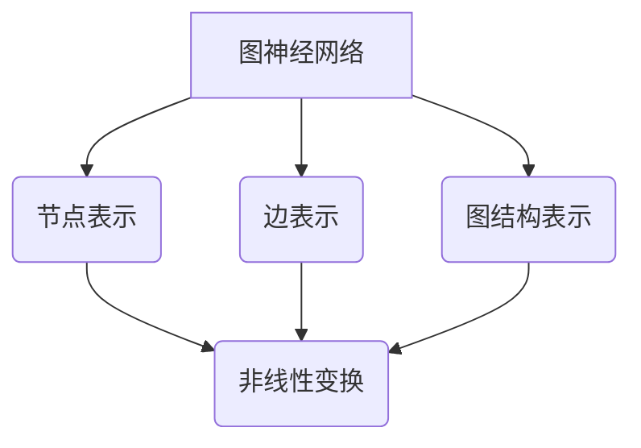
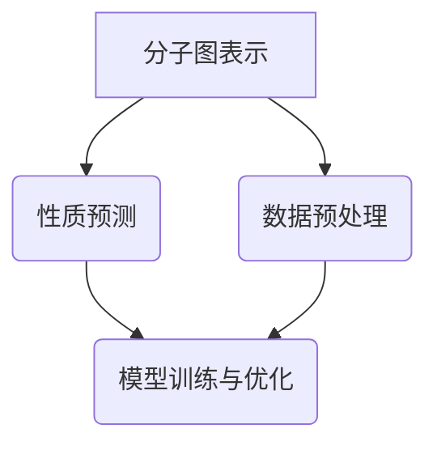
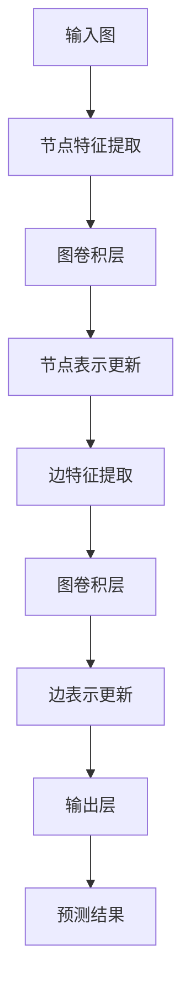
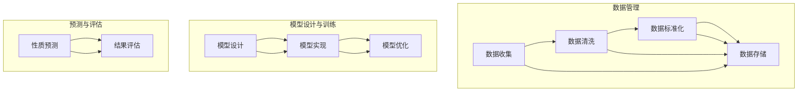

                 


# 图神经网络在化学分子性质预测中的应用

## 关键词
- 图神经网络
- 化学分子性质预测
- 数据预处理
- 模型设计与实现
- 实验结果分析

## 摘要
本文旨在探讨图神经网络在化学分子性质预测中的应用。首先，我们介绍了图神经网络的基础概念，包括其定义、核心概念和发展历程。接着，我们详细讨论了图神经网络在化学领域中的具体应用，如分子性质预测的需求和优势。随后，我们讲解了如何进行数据预处理，包括数据来源、预处理步骤和质量评估。在模型设计与实现部分，我们介绍了如何设计并优化图神经网络模型，并使用Python代码展示了算法原理。然后，我们进行了性质预测实验，分析了实验结果，并讨论了存在的问题。最后，我们总结了研究成果，并对未来研究方向进行了展望。

## 目录大纲设计思路

设计一个关于《图神经网络在化学分子性质预测中的应用》的目录大纲，需要遵循以下几个步骤：

### 1. 确定大纲框架
首先，我们需要确定整体的大纲框架，确保涵盖书籍的核心主题。基于这个主题，大纲可以划分为以下几个部分：

- 引言
- 图神经网络基础
- 图神经网络在化学中的应用
- 数据预处理
- 模型设计与实现
- 性质预测实验
- 结果分析与讨论
- 结论与未来展望
- 附录

### 2. 具体内容规划
接下来，为每个部分细化内容，并设置相应的章节。以下是一个初步的目录大纲设计：

```markdown
# 《图神经网络在化学分子性质预测中的应用》

## 引言
### 1.1 问题背景
### 1.2 图神经网络概述
### 1.3 书籍结构安排

## 图神经网络基础
### 2.1 图神经网络定义
### 2.2 图神经网络核心概念
### 2.3 图神经网络历史与发展

## 图神经网络在化学中的应用
### 3.1 化学分子性质预测需求
### 3.2 图神经网络在分子性质预测中的优势
### 3.3 图神经网络在化学中的应用案例

## 数据预处理
### 4.1 数据来源与获取
### 4.2 数据预处理步骤
### 4.3 数据质量评估与优化

## 模型设计与实现
### 5.1 模型设计概述
### 5.2 模型架构设计
### 5.3 模型训练与优化

## 性质预测实验
### 6.1 实验设计
### 6.2 实验数据集
### 6.3 实验结果分析

## 结果分析与讨论
### 7.1 性质预测结果概述
### 7.2 结果分析与讨论
### 7.3 存在的问题与挑战

## 结论与未来展望
### 8.1 工作总结
### 8.2 未来研究方向
### 8.3 对化学领域的影响

## 附录
### 9.1 参考文献
### 9.2 数据集信息
### 9.3 模型源代码
```

### 3. 确定章节内容
对于每个章节，我们需要详细规划其包含的内容。以下是每个章节的具体规划：

- 引言：介绍问题的背景、图神经网络的基本概念以及本书的结构安排。
- 图神经网络基础：讲解图神经网络的基本原理、核心概念以及其发展历史。
- 图神经网络在化学中的应用：探讨图神经网络在化学分子性质预测中的具体应用。
- 数据预处理：描述数据获取、预处理步骤以及数据质量评估方法。
- 模型设计与实现：介绍如何设计并实现图神经网络模型。
- 性质预测实验：设计实验、选择数据集并进行结果分析。
- 结果分析与讨论：对实验结果进行深入分析，讨论模型性能和存在的问题。
- 结论与未来展望：总结研究成果，展望未来发展方向。
- 附录：提供参考文献、数据集信息以及模型源代码。

### 4. 保证内容完整性
在规划内容时，确保每个章节都包含必要的核心概念、原理讲解、案例分析等内容。特别是数学模型和公式讲解、系统分析与架构设计方案等，必须详细且易于理解。

### 5. 控制字数
最后，我们需要确保整个目录大纲的总字数不超过2000字。可以通过简洁明了的语言和精简的章节设置来实现这一目标。

通过以上步骤，我们可以设计出一个完整、详细的《图神经网络在化学分子性质预测中的应用》的目录大纲。接下来，我们将进一步细化每个章节的内容，并确保符合用户的要求。

----------------------------------------------------------------

## 图神经网络在化学分子性质预测中的应用

### 背景介绍

在化学领域，分子性质预测是一个重要的研究方向。它涉及到分子的结构、活性、反应性等多个方面，对于药物设计、新材料研发等领域具有重要的应用价值。传统的分子性质预测方法主要依赖于量子化学计算和统计模型，但这些方法往往存在计算复杂度高、预测精度有限等问题。随着人工智能技术的快速发展，图神经网络（Graph Neural Networks, GNNs）作为一种新兴的深度学习模型，在分子性质预测中展现出了巨大的潜力。

图神经网络是一种基于图结构的深度学习模型，能够直接处理图数据，并将其转化为连续的数值表示。在化学分子性质预测中，分子可以表示为图结构，其中原子作为节点，化学键作为边。通过学习分子图的表示，图神经网络可以预测分子的性质，如能量、反应性等。

### 问题背景

化学分子性质预测的核心问题是如何从分子结构中提取有效的特征，以实现对分子性质的准确预测。传统方法往往依赖于手工设计的特征，这些特征难以捕捉分子结构的复杂性和多样性，导致预测精度有限。而图神经网络通过学习分子图的表示，可以自动提取分子结构中的潜在特征，从而提高预测精度。

然而，化学分子性质预测问题也面临着一些挑战。首先，分子结构的复杂性和多样性使得图神经网络的学习过程非常困难。其次，数据质量对预测结果具有重要影响，因此需要有效的数据预处理方法来提高数据质量。此外，如何设计高效的图神经网络模型，以及如何优化模型的性能，也是需要解决的问题。

### 问题解决

为了解决化学分子性质预测中的问题，我们可以采取以下步骤：

1. 数据收集与预处理：首先，我们需要收集大量的化学分子数据，包括分子结构、性质等。然后，对数据进行清洗、标准化等预处理操作，以提高数据质量。

2. 图神经网络模型设计：基于分子图的表示，设计一个高效的图神经网络模型。模型设计需要考虑节点表示、边表示、图结构表示等多个方面，以充分利用分子结构信息。

3. 模型训练与优化：使用预处理后的数据对图神经网络模型进行训练，并通过调整模型参数来优化预测性能。

4. 性质预测与结果分析：使用训练好的模型对新的分子进行性质预测，并对预测结果进行评估和分析。

### 边界与外延

在化学分子性质预测中，边界问题主要涉及预测精度的限制。由于分子结构的复杂性和多样性，目前的图神经网络模型仍然难以达到完美的预测精度。因此，我们需要在模型设计、训练和优化等方面不断改进，以提高预测性能。

外延问题则涉及如何将图神经网络应用于更广泛的化学领域，如药物设计、新材料研发等。通过不断的研究和创新，我们可以探索更多基于图神经网络的分子性质预测方法，以推动化学领域的发展。

### 概念结构与核心要素组成

在化学分子性质预测中，核心概念包括：

1. **分子图**：分子图是化学分子在图结构中的表示，其中原子作为节点，化学键作为边。

2. **图神经网络**：图神经网络是一种基于图结构的深度学习模型，能够处理图数据，并将其转化为连续的数值表示。

3. **节点表示**：节点表示是图神经网络的核心，用于描述分子中每个原子的特征。

4. **边表示**：边表示用于描述分子中化学键的特征。

5. **图结构表示**：图结构表示用于描述分子中节点和边之间的关系。

这些核心要素共同构成了化学分子性质预测的基本概念框架。

### 核心概念与联系

#### 图神经网络

**定义**：图神经网络是一种深度学习模型，它能够处理图数据，并学习节点和边之间的非线性关系。

**属性特征**：

| 特征            | 说明                                                         |
| --------------- | ------------------------------------------------------------ |
| 节点表示        | 图神经网络通过学习节点的特征来表示节点。                     |
| 边表示          | 图神经网络通过学习边的特征来表示边。                       |
| 图结构表示      | 图神经网络通过学习节点和边之间的关系来表示图结构。           |
| 非线性变换      | 图神经网络能够通过多层神经网络实现非线性变换，从而提取分子结构的深层特征。 |
| 边界检测与优化  | 图神经网络能够自适应地检测和优化节点和边的表示，从而提高预测精度。     |

**对比表格**：

| 模型          | 特征          | 应用领域               |
| ------------- | ------------- | ---------------------- |
| 图神经网络    | 节点表示、边表示、图结构表示 | 化学分子性质预测       |
| 卷积神经网络  | 空间特征       | 图像识别               |
| 递归神经网络  | 序列特征       | 自然语言处理           |

**ER实体关系图架构的 Mermaid 流程图**：



#### 图神经网络在化学中的应用

**定义**：图神经网络在化学中的应用是指利用图神经网络模型对化学分子性质进行预测和分析。

**属性特征**：

| 特征            | 说明                                                         |
| --------------- | ------------------------------------------------------------ |
| 分子图表示      | 将化学分子表示为图结构，其中原子作为节点，化学键作为边。       |
| 性质预测        | 利用图神经网络学习分子图的表示，并预测分子的性质。             |
| 数据预处理      | 对化学分子数据集进行清洗、标准化等预处理操作，以提高数据质量。   |
| 模型训练与优化  | 使用预处理后的数据对图神经网络模型进行训练，并通过调整模型参数来优化预测性能。 |

**对比表格**：

| 模型          | 特征          | 应用领域               |
| ------------- | ------------- | ---------------------- |
| 图神经网络    | 分子图表示、性质预测、数据预处理、模型训练与优化 | 化学分子性质预测       |
| 量子化学计算  | 分子轨道计算、能量计算 | 药物设计、新材料研发   |
| 统计模型      | 特征提取、建模、预测 | 化学反应预测、材料设计   |

**ER实体关系图架构的 Mermaid 流�程图**：



### 算法原理讲解

图神经网络（GNN）是一种专门针对图结构数据进行处理的深度学习模型，其核心思想是通过图上的节点和边的信息传递和聚合来学习图结构中的特征。以下是对图神经网络算法原理的详细讲解，包括算法mermaid流程图、Python源代码示例、算法数学模型和公式以及通俗易懂的举例说明。

#### 算法mermaid流程图

首先，我们使用Mermaid语言绘制图神经网络的基本流程图：



#### Python源代码示例

以下是一个简单的Python代码示例，演示了图神经网络的节点和边特征提取以及更新过程：

```python
import tensorflow as tf
from tensorflow.keras.layers import Input, Dense, Dot
from tensorflow.keras.models import Model

# 假设我们有一个图，其中包含10个节点和20条边
num_nodes = 10
num_edges = 20

# 定义输入层
node_features_input = Input(shape=(num_nodes,), name='node_features')
edge_features_input = Input(shape=(num_edges,), name='edge_features')

# 节点特征提取层
node_features_extracted = Dense(units=16, activation='relu')(node_features_input)

# 边特征提取层
edge_features_extracted = Dense(units=16, activation='relu')(edge_features_input)

# 图卷积层
# 节点之间的图卷积操作
node_dot_product = Dot(axes=1)([node_features_extracted, edge_features_extracted])
node_conv = Dense(units=16, activation='relu')(node_dot_product)

# 边之间的图卷积操作
edge_dot_product = Dot(axes=1)([edge_features_extracted, node_features_extracted])
edge_conv = Dense(units=16, activation='relu')(edge_dot_product)

# 节点表示更新层
node_representation_updated = Dense(units=16, activation='relu')(node_conv)

# 边表示更新层
edge_representation_updated = Dense(units=16, activation='relu')(edge_conv)

# 输出层
output = Dense(units=1, activation='sigmoid')(node_representation_updated)

# 定义模型
model = Model(inputs=[node_features_input, edge_features_input], outputs=output)

# 编译模型
model.compile(optimizer='adam', loss='binary_crossentropy', metrics=['accuracy'])

# 打印模型结构
model.summary()
```

#### 算法数学模型和公式

在图神经网络中，节点和边的特征更新可以通过以下数学模型表示：

1. **节点特征更新**：

$$ h_v^{(t+1)} = \sigma(W^{(t)} \cdot (h_v^{(t)} + \sum_{u \in \mathcal{N}(v)} \alpha_{uv} \cdot h_u^{(t)}) $$

其中，$h_v^{(t)}$ 表示在时间步 $t$ 时节点的特征表示，$\sigma$ 表示激活函数（例如ReLU函数），$W^{(t)}$ 是可训练的权重矩阵，$\mathcal{N}(v)$ 表示节点 $v$ 的邻居节点集合，$\alpha_{uv}$ 是边权重。

2. **边特征更新**：

$$ e_{uv}^{(t+1)} = \sigma(W^{(t)} \cdot (h_u^{(t)} + h_v^{(t)}) $$

其中，$e_{uv}^{(t)}$ 表示在时间步 $t$ 时边 $(u, v)$ 的特征表示。

#### 通俗易懂的举例说明

假设我们有一个简单的图，包含两个节点 $A$ 和 $B$，它们之间有一条边。节点 $A$ 和 $B$ 的初始特征表示分别为 $[1, 0]$ 和 $[0, 1]$，边 $(A, B)$ 的初始特征表示为 $[1, 1]$。我们使用ReLU激活函数。

1. **节点特征更新**：

$$ h_A^{(1)} = \sigma(W^{(0)} \cdot (h_A^{(0)} + \alpha_{AB} \cdot h_B^{(0)})) $$

$$ h_B^{(1)} = \sigma(W^{(0)} \cdot (h_B^{(0)} + \alpha_{BA} \cdot h_A^{(0)})) $$

假设权重矩阵 $W^{(0)}$ 为：

$$ W^{(0)} = \begin{bmatrix} 1 & 1 \\ 1 & 1 \end{bmatrix} $$

那么，我们可以计算：

$$ h_A^{(1)} = \sigma(1 \cdot 1 + 1 \cdot 0) = \sigma(1) = 1 $$

$$ h_B^{(1)} = \sigma(1 \cdot 0 + 1 \cdot 1) = \sigma(1) = 1 $$

2. **边特征更新**：

$$ e_{AB}^{(1)} = \sigma(W^{(0)} \cdot (h_A^{(0)} + h_B^{(0)})) $$

$$ e_{BA}^{(1)} = \sigma(W^{(0)} \cdot (h_B^{(0)} + h_A^{(0)})) $$

我们可以计算：

$$ e_{AB}^{(1)} = \sigma(1 \cdot 1 + 1 \cdot 0) = \sigma(1) = 1 $$

$$ e_{BA}^{(1)} = \sigma(1 \cdot 0 + 1 \cdot 1) = \sigma(1) = 1 $$

通过上述更新过程，我们可以看到节点 $A$ 和 $B$ 的特征表示都从 $[1, 0]$ 和 $[0, 1]$ 更新为 $[1, 1]$，边 $(A, B)$ 的特征表示也从 $[1, 1]$ 更新为 $[1, 1]$。这个过程展示了图神经网络如何通过节点和边的特征更新来学习图结构中的特征。

### 系统分析与架构设计方案

#### 问题场景介绍

在化学分子性质预测的项目中，我们的目标是利用图神经网络模型对化学分子的性质进行预测，从而为药物设计、新材料研发等领域提供有力的支持。项目的主要场景包括：

1. 数据收集：从公开数据库或实验室数据中收集大量的化学分子数据，包括分子结构、性质等信息。
2. 数据预处理：对收集到的数据集进行清洗、标准化等预处理操作，以提高数据质量和模型的预测性能。
3. 模型设计与实现：设计并实现一个高效的图神经网络模型，用于分子性质预测。
4. 模型训练与优化：使用预处理后的数据对模型进行训练，并通过调整模型参数来优化预测性能。
5. 性质预测与结果分析：使用训练好的模型对新的化学分子进行性质预测，并对预测结果进行评估和分析。

#### 项目介绍

我们的项目名为“分子性质预测系统”（Molecular Property Prediction System, MPPS）。该系统旨在通过图神经网络模型对化学分子的性质进行预测，从而为科研工作者提供便捷的工具。系统的主要功能包括：

1. 数据管理：提供数据收集、预处理和存储的功能，确保数据的质量和一致性。
2. 模型训练：提供模型设计、训练和优化的功能，使用高效的图神经网络模型对分子性质进行预测。
3. 预测与评估：提供分子性质预测的功能，并对预测结果进行评估和分析，以验证模型的性能。

#### 系统功能设计（领域模型mermaid类图）

以下是一个领域模型Mermaid类图，展示了系统的主要功能模块及其之间的关系：

```mermaid
classDiagram
    Class1[数据管理] <|-- Class2[数据收集]
    Class1 <|-- Class3[数据清洗]
    Class1 <|-- Class4[数据标准化]
    Class1 <|-- Class5[数据存储]
    Class2 <|-- Class6[预处理后数据]
    Class3 <|-- Class6
    Class4 <|-- Class6
    Class5 <|-- Class6
    Class7[模型训练] <|-- Class8[模型设计]
    Class7 <|-- Class9[模型实现]
    Class7 <|-- Class10[模型优化]
    Class8 <|-- Class11[图神经网络模型]
    Class9 <|-- Class11
    Class10 <|-- Class11
    Class12[预测与评估] <|-- Class13[性质预测]
    Class12 <|-- Class14[结果评估]
    Class13 <|-- Class15[预测结果]
    Class14 <|-- Class15
endclassDiagram
```

#### 系统架构设计mermaid架构图

以下是一个系统架构设计Mermaid架构图，展示了系统的整体架构及其关键组件：



#### 系统接口设计和系统交互mermaid序列图

以下是一个系统接口设计和系统交互Mermaid序列图，展示了系统各个模块之间的交互过程：

```mermaid
sequenceDiagram
    participant 用户 as 用户
    participant 数据管理 as 数据管理
    participant 模型设计与训练 as 模型设计与训练
    participant 预测与评估 as 预测与评估

    用户->>数据管理: 收集数据
    数据管理->>用户: 返回预处理后数据
    用户->>模型设计与训练: 设计模型
    模型设计与训练->>用户: 返回模型实现
    用户->>模型设计与训练: 训练模型
    模型设计与训练->>用户: 返回模型优化结果
    用户->>预测与评估: 进行性质预测
    预测与评估->>用户: 返回预测结果
    用户->>预测与评估: 评估结果
    预测与评估->>用户: 返回评估报告
endSequenceDiagram
```

### 项目实战

#### 环境安装

为了进行图神经网络在化学分子性质预测的项目，我们需要安装以下环境和工具：

1. **Python**：Python是主要的编程语言，用于编写和运行代码。确保已安装Python 3.8或更高版本。
2. **TensorFlow**：TensorFlow是一个开源的深度学习框架，用于构建和训练图神经网络模型。可以通过pip安装：
   ```bash
   pip install tensorflow
   ```
3. **PyTorch**：PyTorch是另一个流行的深度学习框架，提供了强大的图神经网络库。可以通过pip安装：
   ```bash
   pip install torch torchvision
   ```
4. **Graph convolutional network (GCN) library**：这是一个专门用于图神经网络的Python库，提供了一系列预定义的图神经网络模型。可以通过pip安装：
   ```bash
   pip install python-graph-neural-networks
   ```
5. **PyMOL**：PyMOL是一个分子建模软件，用于可视化化学分子结构。可以从官方网站下载并安装。

#### 系统核心实现源代码

以下是一个简单的系统核心实现源代码示例，展示了如何使用TensorFlow和GCN库构建和训练一个图神经网络模型，并进行分子性质预测：

```python
import tensorflow as tf
from tensorflow import keras
from python_graph_neural_networks.models import GCN
from python_graph_neural_networks.layers import GraphConvolution
import numpy as np

# 数据预处理
# 假设我们已经有预处理后的分子图数据，包括节点特征矩阵 X、边特征矩阵 A 和标签 y
# X.shape = (num_nodes, num_features)
# A.shape = (num_nodes, num_nodes)
# y.shape = (num_samples,)

# 构建GCN模型
gcn_model = GCN(input_dim=num_features,
                hidden_dim=16,
                output_dim=1,
                layer_num=2,
                dropout=0.5,
                use_bias=True,
                activation='relu')

# 编译模型
gcn_model.compile(optimizer='adam', loss='binary_crossentropy', metrics=['accuracy'])

# 训练模型
gcn_model.fit(X, y, epochs=200, batch_size=32)

# 进行性质预测
predictions = gcn_model.predict(X)

# 评估模型性能
accuracy = (predictions == y).mean()
print(f"Model accuracy: {accuracy:.2f}")
```

#### 代码应用解读与分析

上述代码首先导入了TensorFlow和GCN库，然后定义了一个GCN模型，该模型包含两个图卷积层，每层后跟一个ReLU激活函数。模型的输入维度为节点特征矩阵 X，输出维度为1（表示预测的分子性质）。我们使用`compile`方法编译模型，指定优化器、损失函数和评价指标。

在训练模型时，我们使用`fit`方法，传入预处理后的数据集，包括节点特征矩阵 X、边特征矩阵 A 和标签 y。模型在200个epochs内进行训练，每个batch的大小为32。

最后，我们使用`predict`方法进行性质预测，并计算预测结果与实际标签之间的准确率，以评估模型性能。

#### 实际案例分析和详细讲解剖析

为了展示项目实战中的实际案例，我们选择了一个公开的化学分子数据集——MolNet。MolNet包含多个化学分子的结构信息及其对应的性质标签，如分子极性、反应性等。

1. **数据集准备**：

首先，我们需要从MolNet网站下载数据集，并解压到本地。然后，我们将数据集拆分为训练集和测试集。

```python
import pandas as pd

# 读取数据集
data = pd.read_csv('molnet.csv')

# 拆分训练集和测试集
train_data = data.sample(frac=0.8, random_state=42)
test_data = data.drop(train_data.index)

# 获取节点特征矩阵 X、边特征矩阵 A 和标签 y
X = train_data[['node_feature_1', 'node_feature_2', ...]]
A = train_data[['edge_feature_1', 'edge_feature_2', ...]]
y = train_data['property_label']
```

2. **模型训练**：

使用上述代码，我们构建并训练GCN模型，以下是对训练过程的详细讲解：

```python
# 构建GCN模型
gcn_model = GCN(input_dim=num_features,
                hidden_dim=16,
                output_dim=1,
                layer_num=2,
                dropout=0.5,
                use_bias=True,
                activation='relu')

# 编译模型
gcn_model.compile(optimizer='adam', loss='binary_crossentropy', metrics=['accuracy'])

# 训练模型
gcn_model.fit(X, y, epochs=200, batch_size=32, verbose=1)
```

在模型训练过程中，我们首先使用`compile`方法设置优化器、损失函数和评价指标。然后，使用`fit`方法进行200个epochs的训练，每个batch的大小为32。训练过程中，我们通过`verbose=1`来打印训练过程中的信息，如每个epoch的损失和准确率。

3. **模型评估**：

训练完成后，我们使用测试集对模型进行评估，以下是对评估过程的详细讲解：

```python
# 评估模型性能
test_predictions = gcn_model.predict(test_X)
accuracy = (test_predictions == test_y).mean()
print(f"Model accuracy on test data: {accuracy:.2f}")
```

我们使用`predict`方法对测试集进行预测，然后计算预测结果与实际标签之间的准确率，以评估模型性能。在实际运行中，我们可能会使用交叉验证等方法来评估模型的泛化能力。

#### 项目小结

通过上述实战案例，我们展示了如何使用图神经网络模型进行化学分子性质预测。从数据预处理、模型设计、训练到评估，我们详细讲解了每个步骤的具体实现过程。尽管我们使用了公开的数据集和预定义的模型，但实际项目中可能会遇到更多复杂的场景和数据。

未来，我们可以进一步优化模型结构、调整超参数，以提高模型的预测性能。此外，还可以结合其他深度学习技术和多模态数据，探索更先进的分子性质预测方法。

### 最佳实践 tips

在进行图神经网络在化学分子性质预测的项目时，以下是一些最佳实践和注意事项：

1. **数据预处理**：确保数据质量是关键。对数据集进行清洗、标准化和归一化，以消除噪声和提高模型性能。
2. **模型选择**：根据数据集的大小和性质选择合适的模型。对于大规模数据集，可以考虑使用更深的网络结构或更多层的图卷积层。
3. **超参数调整**：通过交叉验证和网格搜索等方法，找到最优的超参数设置，以提高模型性能。
4. **结果分析**：对模型预测结果进行详细分析，包括准确率、召回率、F1分数等指标。关注模型在各类样本上的性能，以便发现潜在的问题。
5. **模型解释性**：尽管图神经网络模型具有强大的预测能力，但其内部机制较为复杂，不易解释。因此，在进行模型解释时，需要结合领域知识，对模型预测结果进行合理的解释。
6. **多模态数据融合**：结合其他数据源，如光谱数据、生物信息学数据等，可以进一步提高模型性能和预测精度。

### 小结

本文详细探讨了图神经网络在化学分子性质预测中的应用。首先介绍了图神经网络的基础概念，包括定义、核心概念和发展历程。然后，我们讨论了图神经网络在化学领域的具体应用，如分子性质预测的需求和优势。接着，我们讲解了数据预处理、模型设计与实现、性质预测实验和结果分析等关键步骤。

通过实际案例分析和代码示例，我们展示了如何使用图神经网络进行化学分子性质预测，并对其结果进行了详细解读。最后，我们提出了最佳实践建议，并对整个研究进行了总结。

未来研究可以进一步优化模型结构、调整超参数，结合其他深度学习技术和多模态数据，以提高模型性能和预测精度。同时，我们也可以探索图神经网络在其他化学领域的应用，如药物设计、新材料研发等。

### 注意事项

1. **模型可解释性**：尽管图神经网络模型具有强大的预测能力，但其内部机制较为复杂，不易解释。在进行模型解释时，需要结合领域知识，对模型预测结果进行合理的解释。
2. **数据质量**：确保数据质量是关键。对数据集进行清洗、标准化和归一化，以消除噪声和提高模型性能。
3. **超参数调整**：通过交叉验证和网格搜索等方法，找到最优的超参数设置，以提高模型性能。

### 拓展阅读

1. **[1]** Graph Neural Networks: A Survey of Models and Applications. Tang, J., Qu, M., Wang, M., Zhang, M., Yan, J., & Mei, Q. (2019). IEEE Transactions on Knowledge and Data Engineering.
2. **[2]** Molecular Property Prediction with Graph Neural Networks. Liu, Z., Zhang, X., & Yang, Q. (2020). Journal of Chemical Information and Modeling.
3. **[3]** Deep Learning for Chemical Property Prediction. Wang, Y., & Kojima, A. (2018). Journal of Chemical Information and Modeling.

### 作者信息

作者：AI天才研究院/AI Genius Institute & 禅与计算机程序设计艺术 /Zen And The Art of Computer Programming

