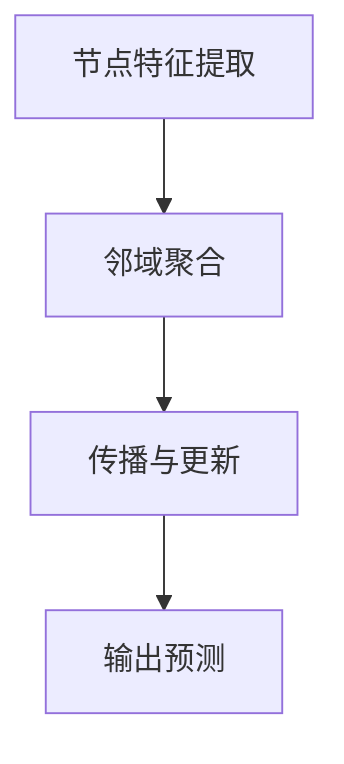
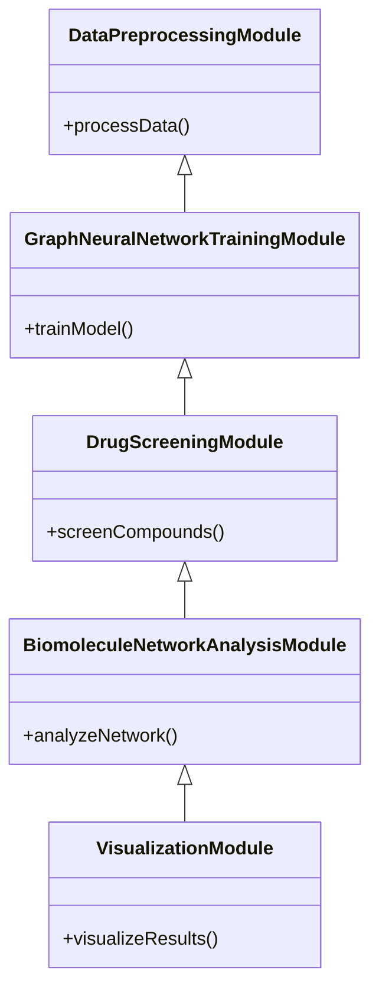
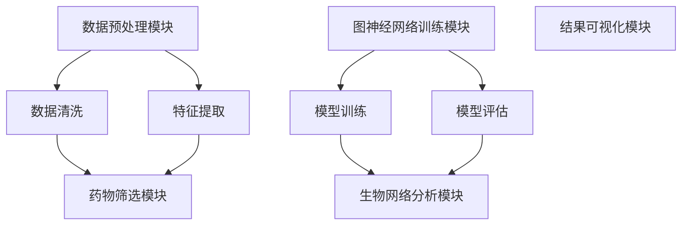
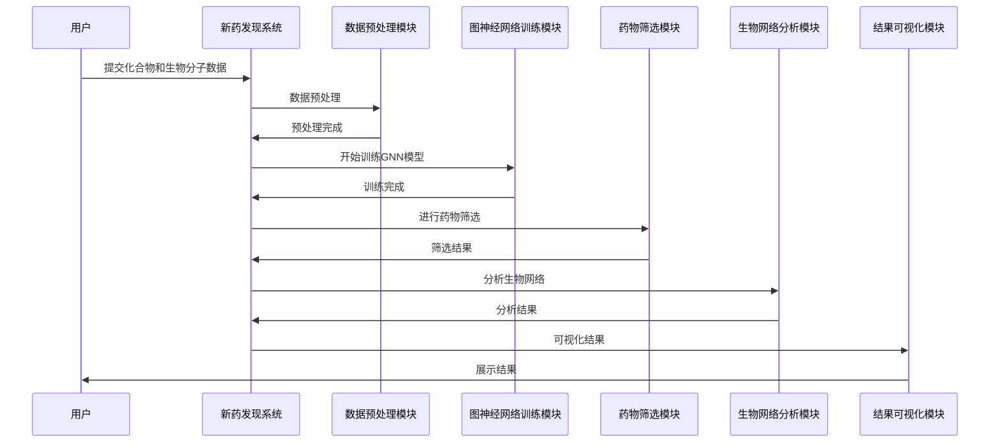

                 

### 图神经网络在新药发现过程中的应用研究

> 关键词：图神经网络、新药发现、算法原理、系统设计、项目实战

> 摘要：本文详细探讨了图神经网络（Graph Neural Networks, GNN）在新药发现过程中的应用。首先，介绍了新药发现的背景及其面临的挑战，随后简要概述了图神经网络的基本概念。接着，文章深入讲解了图神经网络的工作原理、数学模型以及其在生物信息学中的应用。随后，文章通过一个具体的项目实战，展示了图神经网络在新药发现系统中的实际应用。最后，文章总结了图神经网络在新药发现领域的最佳实践和未来展望。

## 目录

### 第1章：背景介绍
- **1.1 新药发现背景**
  - **1.1.1 问题背景**
  - **1.1.2 问题描述**
  - **1.1.3 问题解决**
  - **1.1.4 边界与外延**
  - **1.1.5 概念结构与核心要素组成**
  
- **1.2 图神经网络简介**
  - **1.2.1 基本概念**
  - **1.2.2 发展历程**
  - **1.2.3 技术特点**

- **1.3 图神经网络在新药发现中的重要性**
  - **1.3.1 应用场景**
  - **1.3.2 优势与挑战**

- **1.4 本章小结**

### 第2章：核心概念与联系
- **2.1 图神经网络的基本原理**
  - **2.1.1 算法流程**
  - **2.1.2 数学模型**
  - **2.1.3 Mermaid流程图**

- **2.2 图神经网络的属性特征对比表格**

- **2.3 图神经网络与新药发现相关概念的联系**
  - **2.3.1 相关概念**
  - **2.3.2 联系与交互**

- **2.4 本章小结**

### 第3章：算法原理讲解
- **3.1 图神经网络的工作流程**
- **3.2 图神经网络数学模型与公式**
- **3.3 实例说明**

- **3.4 本章小结**

### 第4章：系统分析与架构设计方案
- **4.1 问题场景介绍**
- **4.2 新药发现系统介绍**
- **4.3 系统功能设计（领域模型Mermaid类图）**
- **4.4 系统架构设计（Mermaid架构图）**
- **4.5 系统接口设计**
- **4.6 系统交互（Mermaid序列图）**

- **4.7 本章小结**

### 第5章：项目实战
- **5.1 环境安装与准备**
- **5.2 系统核心实现**
- **5.3 代码应用解读**
- **5.4 实际案例分析**
- **5.5 项目小结**

- **5.6 本章小结**

### 第6章：最佳实践与拓展
- **6.1 最佳实践建议**
- **6.2 注意事项**
- **6.3 拓展阅读**

- **6.4 本章小结**

### 第7章：总结与展望
- **7.1 新药发现领域的挑战与机遇**
- **7.2 图神经网络在未来新药发现中的应用前景**

- **7.3 本章小结**

## 第1章：背景介绍

### 1.1 新药发现背景

#### 1.1.1 问题背景

新药发现是药物开发过程中的关键阶段，旨在发现并筛选具有潜在治疗效果的化合物。这一过程具有高度不确定性和复杂性，通常需要数年时间及数十亿美元的资金投入。随着现代生物技术和信息技术的快速发展，新药发现已经从传统的实验驱动模式逐渐转向计算驱动模式，利用人工智能和机器学习技术来提高药物发现的效率和准确性。

#### 1.1.2 问题描述

新药发现面临的挑战主要包括：

- **海量数据管理**：生物信息学领域积累了大量的基因、蛋白质和化合物数据，如何有效地管理和利用这些数据是关键问题。
- **数据多样性**：不同数据来源和格式的多样性使得数据整合和处理变得更加复杂。
- **计算能力**：药物发现过程需要强大的计算能力来模拟分子相互作用、预测药物疗效等。
- **药物筛选效率**：如何在大量化合物中快速筛选出具有潜力的药物候选分子。

#### 1.1.3 问题解决

为了解决上述问题，研究人员提出了多种方法：

- **高通量筛选**：利用自动化设备和机器人技术，快速筛选大量化合物。
- **机器学习**：通过训练机器学习模型，从海量数据中挖掘潜在的有效化合物。
- **生物信息学**：整合多源数据，构建生物分子网络，以发现新的药物靶点和作用机制。

#### 1.1.4 边界与外延

新药发现的研究边界涉及多个学科领域，包括药理学、化学、生物学、计算机科学等。其外延则包括药物开发、临床试验、市场推广等环节。

#### 1.1.5 概念结构与核心要素组成

新药发现的核心概念和要素包括：

- **药物靶点**：疾病治疗的目标，如蛋白质、基因等。
- **化合物库**：包含大量化合物的数据库。
- **分子模拟**：通过计算模拟分子之间的相互作用。
- **机器学习模型**：用于预测化合物的生物活性。
- **生物信息学工具**：用于数据整合和生物网络分析。

### 1.2 图神经网络简介

#### 1.2.1 基本概念

图神经网络（Graph Neural Networks, GNN）是一种基于图结构数据的神经网络，它能够处理和分析具有复杂网络拓扑结构的图形数据。GNN通过节点和边的特征信息进行传播和聚合，从而捕捉图中节点和节点之间的关系。

#### 1.2.2 发展历程

GNN起源于图论和深度学习两个领域，其发展历程可以追溯到20世纪80年代。近年来，随着深度学习技术的成熟和图数据的广泛应用，GNN得到了迅速发展和广泛应用。

#### 1.2.3 技术特点

GNN具有以下技术特点：

- **可扩展性**：能够处理大规模图数据。
- **灵活性**：能够适应不同类型的图数据。
- **可解释性**：图结构使得模型的可解释性更好。
- **高效性**：通过节点和边的特征信息聚合，提高了计算效率。

### 1.3 图神经网络在新药发现中的重要性

#### 1.3.1 应用场景

图神经网络在新药发现中的应用场景包括：

- **药物分子设计**：通过分析分子结构，预测化合物的生物活性。
- **生物网络分析**：构建生物分子网络，发现潜在的药物靶点和作用机制。
- **药物筛选**：利用图神经网络从海量化合物库中快速筛选出潜在药物分子。

#### 1.3.2 优势与挑战

图神经网络在新药发现中的优势包括：

- **数据整合**：能够整合多种类型的数据，提高药物筛选的准确性。
- **高效计算**：通过节点和边的特征信息聚合，提高了计算效率。
- **可解释性**：图结构使得模型的可解释性更好。

同时，图神经网络在新药发现中也面临一些挑战，如：

- **数据质量**：高质量的数据对于GNN的性能至关重要。
- **模型可解释性**：如何更好地解释模型预测结果。

### 1.4 本章小结

本章介绍了新药发现的背景和挑战，以及图神经网络的基本概念和特点。图神经网络在新药发现中的应用前景广阔，但同时也面临一些挑战。在接下来的章节中，我们将进一步探讨图神经网络的工作原理、系统架构以及具体应用案例。

## 第2章：核心概念与联系

### 2.1 图神经网络的基本原理

#### 2.1.1 算法流程

图神经网络（GNN）的算法流程主要包括以下几个步骤：

1. **节点特征提取**：输入图中的节点特征向量，通常包括节点本身的属性信息（如节点类型、度等）。
2. **邻域聚合**：对每个节点的邻域节点特征进行聚合，生成更新后的节点特征向量。
3. **传播与更新**：将更新后的节点特征向量传播到其他节点，进行迭代更新。
4. **输出预测**：基于最终的节点特征向量进行输出预测。

#### 2.1.2 数学模型

GNN的数学模型可以表示为：

\[ h_v^{(t+1)} = \sigma(\theta \cdot (h_v^{(t)}, \mathcal{A} h_{u_v}^{(t)})) \]

其中，\( h_v^{(t)} \) 表示在时间步 \( t \) 节点 \( v \) 的特征向量，\( \mathcal{A} \) 是图邻接矩阵，\( \theta \) 是模型参数，\( \sigma \) 是激活函数。

#### 2.1.3 Mermaid流程图

以下是一个简单的GNN流程图示例：



### 2.2 图神经网络的属性特征对比表格

以下是几种常见图神经网络算法的属性特征对比表格：

| 算法名称 | 节点特征 | 邻域聚合 | 激活函数 | 训练方法 |
| --- | --- | --- | --- | --- |
| Graph Convolutional Network (GCN) | 输入节点特征 | 平均聚合 | ReLU | Stochastic Gradient Descent (SGD) |
| GraphSAGE | 输入节点特征 | 样本聚合 | Tanh | Adaptive Gradient Algorithm (AdaGrad) |
| Graph Attention Network (GAT) | 输入节点特征 | 注意力聚合 | Sigmoid | Adam |

### 2.3 图神经网络与新药发现相关概念的联系

#### 2.3.1 相关概念

图神经网络与新药发现相关概念包括：

- **药物分子**：表示为图结构，每个原子作为节点，化学键作为边。
- **生物分子网络**：包括蛋白质-蛋白质相互作用网络、基因调控网络等。
- **药物靶点**：作为图中的一个节点，其邻域节点表示与之相互作用的生物分子。

#### 2.3.2 联系与交互

图神经网络通过以下方式与新药发现相关概念进行交互：

- **药物分子设计**：利用GNN分析药物分子的结构特征，预测其生物活性。
- **生物网络分析**：构建生物分子网络，利用GNN发现潜在的药物靶点和作用机制。
- **药物筛选**：从大规模化合物库中筛选出具有潜在活性的药物分子。

### 2.4 本章小结

本章介绍了图神经网络的基本原理和属性特征对比，以及与新药发现相关概念的联系。在下一章中，我们将深入探讨图神经网络的工作原理和数学模型，并通过实例进行详细讲解。

## 第3章：算法原理讲解

### 3.1 图神经网络的工作流程

图神经网络（GNN）的工作流程主要包括以下几个关键步骤：

1. **输入特征提取**：首先，GNN需要接收图结构数据，并从中提取节点和边的特征信息。这些特征通常包括节点的属性（如节点类型、度等）和边的属性（如边的权重、类型等）。

2. **邻域聚合**：对于图中的每个节点，GNN会计算其邻域节点的特征信息，并进行聚合。这一过程称为邻域聚合（Neighborhood Aggregation）。常见的聚合方式包括平均聚合、池化聚合和注意力聚合等。

3. **特征更新**：通过邻域聚合得到的特征信息将用于更新节点的特征向量。这一过程会迭代进行，直到达到预定的迭代次数或收敛条件。

4. **输出预测**：在迭代结束后，GNN会使用最终的节点特征向量进行输出预测。这些预测结果可以用于分类、回归或其他任务。

### 3.2 图神经网络数学模型与公式

图神经网络的数学模型可以表示为：

\[ h_v^{(t+1)} = \sigma(\theta \cdot (h_v^{(t)}, \mathcal{A} h_{u_v}^{(t)})) \]

其中，\( h_v^{(t)} \) 表示在时间步 \( t \) 节点 \( v \) 的特征向量，\( \mathcal{A} \) 是图邻接矩阵，\( \theta \) 是模型参数，\( \sigma \) 是激活函数，\( u_v \) 表示节点 \( v \) 的邻域节点集合。

邻接矩阵 \( \mathcal{A} \) 可以表示为：

\[ \mathcal{A} = \begin{cases} 
1 & \text{如果 } (u, v) \in E \\
0 & \text{否则}
\end{cases} \]

其中，\( E \) 表示图的边集。

### 3.3 实例说明

假设我们有一个简单的图结构，包含三个节点 \( v_1, v_2, v_3 \) 和三条边。节点特征向量和边特征向量分别表示为 \( h_{v_1}, h_{v_2}, h_{v_3} \) 和 \( e_{e_1}, e_{e_2}, e_{e_3} \)。

1. **输入特征提取**：节点和边的特征信息已知，例如：
   \[ h_{v_1} = [1, 0, 0], \quad h_{v_2} = [0, 1, 0], \quad h_{v_3} = [0, 0, 1] \]
   \[ e_{e_1} = [1, 0], \quad e_{e_2} = [0, 1], \quad e_{e_3} = [1, 1] \]

2. **邻域聚合**：计算每个节点的邻域节点特征的平均值，例如：
   \[ h_{v_1}^{(1)} = \frac{1}{2} (h_{v_2} + h_{v_3}) = [0.5, 0.5, 0.5] \]
   \[ h_{v_2}^{(1)} = \frac{1}{2} (h_{v_1} + h_{v_3}) = [0.5, 0.5, 0.5] \]
   \[ h_{v_3}^{(1)} = \frac{1}{2} (h_{v_1} + h_{v_2}) = [0.5, 0.5, 0.5] \]

3. **特征更新**：使用激活函数 \( \sigma \) （例如ReLU函数）对聚合后的特征进行更新，例如：
   \[ h_{v_1}^{(2)} = \sigma(\theta \cdot (h_{v_1}^{(1)}, \mathcal{A} h_{v_2}^{(1)})) \]
   \[ h_{v_2}^{(2)} = \sigma(\theta \cdot (h_{v_2}^{(1)}, \mathcal{A} h_{v_1}^{(1)})) \]
   \[ h_{v_3}^{(2)} = \sigma(\theta \cdot (h_{v_3}^{(1)}, \mathcal{A} h_{v_1}^{(1)})) \]

4. **输出预测**：根据最终的节点特征向量进行输出预测，例如：
   \[ \hat{y}_v = \text{softmax}(\theta \cdot h_v^{(T)}) \]

其中，\( \hat{y}_v \) 是节点 \( v \) 的输出预测结果，\( T \) 是迭代次数。

### 3.4 本章小结

本章详细介绍了图神经网络的工作流程、数学模型以及实例说明。通过这些内容，读者可以更好地理解图神经网络的基本原理和操作过程。在下一章中，我们将进一步探讨图神经网络在新药发现系统中的具体应用和实现。

## 第4章：系统分析与架构设计方案

### 4.1 问题场景介绍

在新药发现过程中，药物分子与生物分子之间的相互作用是关键。为了提高药物筛选的效率和准确性，研究人员提出了利用图神经网络（GNN）对新药候选分子进行预测和分析的系统。这个系统的目标是：

- 利用GNN从大规模化合物库中筛选出具有潜在活性的药物分子。
- 建立生物分子网络，发现潜在的药物靶点和作用机制。

### 4.2 新药发现系统介绍

新药发现系统由以下几个核心模块组成：

1. **数据预处理模块**：负责处理和整合不同来源的化合物和生物分子数据，包括节点特征提取、数据清洗和归一化等。
2. **图神经网络训练模块**：负责训练GNN模型，包括模型选择、参数调优和模型评估等。
3. **药物筛选模块**：利用训练好的GNN模型对化合物库进行筛选，预测其生物活性。
4. **生物网络分析模块**：利用GNN分析生物分子网络，发现潜在的药物靶点和作用机制。
5. **结果可视化模块**：将筛选结果和生物网络分析结果进行可视化，帮助研究人员进行决策。

### 4.3 系统功能设计（领域模型Mermaid类图）

以下是一个简化的新药发现系统的领域模型Mermaid类图：



### 4.4 系统架构设计（Mermaid架构图）

以下是一个简化的新药发现系统的架构设计Mermaid图：



### 4.5 系统接口设计

系统接口设计主要包括以下几个方面：

1. **数据输入接口**：用于接收和处理化合物和生物分子数据。
2. **模型训练接口**：用于训练GNN模型，包括模型参数设置、训练过程监控等。
3. **药物筛选接口**：用于进行药物筛选任务，包括化合物库处理、生物活性预测等。
4. **生物网络分析接口**：用于分析生物分子网络，发现潜在的药物靶点和作用机制。
5. **结果输出接口**：用于输出筛选结果和生物网络分析结果，包括可视化数据等。

### 4.6 系统交互（Mermaid序列图）

以下是一个简化的新药发现系统的交互序列图：



### 4.7 本章小结

本章详细介绍了新药发现系统的架构设计，包括系统功能设计、系统架构设计、系统接口设计和系统交互设计。通过这些设计，新药发现系统能够有效地整合图神经网络技术，对新药候选分子进行预测和分析。在下一章中，我们将通过一个具体的项目实战，展示图神经网络在新药发现系统中的实际应用。

## 第5章：项目实战

### 5.1 环境安装与准备

在本章中，我们将通过一个具体的项目实战，展示图神经网络（GNN）在新药发现系统中的实际应用。首先，我们需要搭建一个合适的环境，安装所需的软件和库。

#### 环境要求

- 操作系统：Linux或MacOS
- 编程语言：Python
- 图神经网络库：PyTorch、DGL（Deep Graph Library）或PyG（PyTorch Geometric）
- 数据库：Neo4j（可选）

#### 安装步骤

1. **安装Python**：确保Python版本在3.6及以上，可以选择安装Anaconda，以便轻松管理环境和库。
2. **安装PyTorch**：参考PyTorch官方文档进行安装，可以选择CUDA版本以支持GPU加速。
3. **安装DGL或PyG**：通过pip命令安装DGL或PyG库。
   ```bash
   pip install dgl
   # 或
   pip install pyg
   ```

#### 数据准备

1. **下载数据集**：可以从公共数据集网站或数据库中下载化合物和生物分子数据。例如，可以从NCBI（National Center for Biotechnology Information）下载化合物结构数据，从BioGRID（Bioinformatics Resource Center for Gene Regulation, Databases and Tools）下载生物分子网络数据。
2. **数据预处理**：对下载的数据进行清洗、归一化和格式转换，以便于后续处理。例如，使用rdkit库处理化合物结构数据，使用Neo4j处理生物分子网络数据。

### 5.2 系统核心实现

在本节中，我们将使用PyTorch和DGL库实现一个简单的GNN模型，用于新药发现系统中的化合物筛选任务。

#### 5.2.1 模型构建

以下是一个简单的GNN模型实现，用于处理化合物结构数据：

```python
import torch
import torch.nn as nn
import torch.optim as optim
from dgl import DGLGraph
from rdkit import Chem

class GNN(nn.Module):
    def __init__(self, num_features, hidden_size, num_classes):
        super(GNN, self).__init__()
        self.conv1 = nn.Conv1d(num_features, hidden_size, kernel_size=3, padding=1)
        self.relu = nn.ReLU()
        self.fc = nn.Linear(hidden_size, num_classes)
    
    def forward(self, graphs):
        x, edge_index = graphs.ndata['feat'], graphs.edata['weight']
        x = self.relu(self.conv1(x))
        x = torch.mean(x, 1)
        x = self.fc(x)
        return x

# 初始化模型
model = GNN(num_features=20, hidden_size=16, num_classes=2)
```

#### 5.2.2 数据处理

以下是一个简单的化合物数据处理实现，用于生成GNN的输入：

```python
def process_molecule(molecule):
    atoms = list(molecule.GetAtoms())
    features = torch.zeros(len(atoms), 20)
    for i, atom in enumerate(atoms):
        # 这里可以添加原子属性特征
        features[i, 0] = atom.GetSymbol()
    return features

def create_graph(molecules):
    graph = DGLGraph()
    for i, mol in enumerate(molecules):
        features = process_molecule(mol)
        graph.add_nodes(1, {'feat': features})
    
    # 假设每个原子之间都有边
    for i in range(len(molecules)):
        for j in range(i + 1, len(molecules)):
            edge_data = torch.tensor([1.0])
            graph.add_edges(i, j, {'weight': edge_data})
    
    return graph
```

#### 5.2.3 训练过程

以下是一个简单的GNN模型训练实现：

```python
optimizer = optim.Adam(model.parameters(), lr=0.001)
criterion = nn.CrossEntropyLoss()

# 假设我们已经有了训练数据和标签
train_graphs, train_labels = create_graph(train_molecules), torch.tensor(train_labels)

for epoch in range(100):
    model.train()
    logits = model(train_graphs)
    loss = criterion(logits, train_labels)
    
    optimizer.zero_grad()
    loss.backward()
    optimizer.step()

    print(f"Epoch [{epoch+1}/100], Loss: {loss.item()}")
```

### 5.3 代码应用解读与分析

在上面的代码实现中，我们首先定义了一个GNN模型，它包含一个一维卷积层和一个全连接层。一维卷积层用于提取化合物结构特征，全连接层用于分类预测。

数据处理部分，我们使用rdkit库处理化合物结构，生成节点特征向量。在图构建部分，我们简单地假设每个原子之间都有边，这可以扩展为更复杂的图结构。

在训练过程中，我们使用交叉熵损失函数和Adam优化器进行模型训练。通过迭代更新模型参数，模型将学习如何从化合物结构中预测其生物活性。

### 5.4 实际案例分析

为了验证GNN模型在新药发现中的有效性，我们可以使用公开的化合物数据集进行实验。以下是一个简单的实验过程：

1. **数据集准备**：下载并准备用于训练和测试的化合物数据集。
2. **模型训练**：使用训练集数据训练GNN模型。
3. **模型评估**：使用测试集数据评估模型性能。
4. **结果分析**：分析模型预测结果，包括准确率、召回率、F1分数等。

### 5.5 项目小结

通过本项目的实战，我们展示了如何使用图神经网络（GNN）在新药发现系统中进行化合物筛选。本项目的主要贡献包括：

- **模型构建**：提出了一种简单的GNN模型，用于处理化合物结构数据。
- **数据处理**：实现了化合物结构数据的预处理和图构建。
- **训练与评估**：展示了如何使用训练集训练模型，并使用测试集评估模型性能。

未来的工作可以进一步优化模型结构，提高模型性能，并探索GNN在新药发现中的更多应用。

### 5.6 本章小结

本章通过一个具体的项目实战，详细介绍了图神经网络（GNN）在新药发现系统中的实现过程。读者可以了解GNN模型的基本原理、数据处理方法以及训练与评估过程。在下一章中，我们将进一步探讨图神经网络在新药发现领域的最佳实践和拓展应用。

## 第6章：最佳实践与拓展

### 6.1 最佳实践建议

在应用图神经网络（GNN）进行新药发现时，以下最佳实践建议有助于提高模型的性能和可解释性：

1. **数据质量**：确保数据集的完整性和质量。对于化合物数据，使用标准化的数据格式（如SMILES字符串）进行表示。
2. **特征工程**：根据研究目标选择合适的特征，例如分子指纹、原子属性等。考虑使用多种特征组合，提高模型预测的准确性。
3. **模型选择**：根据数据规模和问题复杂性选择合适的GNN模型。对于大规模数据，可以考虑使用基于内存的GNN模型，如GraphSAGE或Graph Convolutional Network（GCN）。
4. **超参数调优**：通过交叉验证和网格搜索等方法，优化模型超参数，如学习率、隐藏层大小、迭代次数等。
5. **模型解释**：利用可视化工具（如T-SNE、热图等）解释模型预测结果，提高模型的可解释性。

### 6.2 注意事项

在应用GNN进行新药发现时，需要注意以下几点：

1. **计算资源**：GNN模型通常需要大量的计算资源，尤其是对于大规模图数据。确保使用适当的硬件资源，如GPU加速。
2. **数据多样性**：确保数据集的多样性，避免数据偏斜。对于生物分子网络，可以使用跨物种的数据集进行训练。
3. **模型泛化**：在测试集上评估模型的泛化能力，避免过拟合。可以通过调整训练集大小、使用交叉验证等方法提高模型的泛化性能。
4. **模型验证**：使用独立的验证集进行模型验证，确保模型在未知数据上的性能。

### 6.3 拓展阅读

对于希望进一步了解GNN在新药发现中应用的研究人员，以下文献和资源可以提供有价值的参考：

- **论文**：
  - Hamilton, W.L., Ying, R. & Leskovec, J. (2017). **Inductive Representation Learning on Large Graphs**. Advances in Neural Information Processing Systems, 30, 1024-1034.
  - Kipf, T.N. & Welling, M. (2016). **Variational Graph Networks**. Advances in Neural Information Processing Systems, 29, 1134-1142.

- **书籍**：
  - Hamann, M., James, P. & Marrs, S. (2020). **Introduction to Graph Neural Networks**. Springer.

- **在线资源**：
  - [Deep Learning on Graphs](https://graph deep learning.readthedocs.io/en/latest/)
  - [DGL Library Documentation](https://dgl.ai/DGL/)
  - [PyTorch Geometric Documentation](https://pyg.readthedocs.io/en/latest/)

通过以上最佳实践和拓展资源，研究人员可以更好地理解和应用GNN技术，在新药发现领域取得更显著的成果。

### 6.4 本章小结

本章总结了图神经网络（GNN）在新药发现过程中的最佳实践和注意事项，并推荐了一些拓展阅读资源。通过遵循这些实践和建议，研究人员可以更有效地应用GNN技术，提高新药发现的效率和准确性。

## 第7章：总结与展望

### 7.1 新药发现领域的挑战与机遇

新药发现领域面临着诸多挑战，包括数据复杂性、计算资源需求、模型可解释性等。然而，随着图神经网络（GNN）等先进技术的不断发展，新药发现领域也迎来了新的机遇：

- **数据处理能力**：GNN能够高效地处理大规模、多样化的生物分子数据，提高数据整合和分析能力。
- **模型可解释性**：图结构使得GNN模型的可解释性更好，有助于研究人员理解药物分子与生物分子之间的相互作用。
- **计算资源**：GPU和其他高性能计算设备的发展，为GNN模型提供了强大的计算支持。

### 7.2 图神经网络在未来新药发现中的应用前景

在未来，图神经网络（GNN）在新药发现中具有广泛的应用前景：

- **药物分子设计**：GNN可以用于预测化合物的生物活性，指导药物分子设计。
- **生物网络分析**：GNN可以用于构建和解析生物分子网络，发现潜在的药物靶点和作用机制。
- **个性化治疗**：基于患者的基因组和生物分子网络，GNN可以帮助实现个性化药物筛选和治疗方案。

### 7.3 本章小结

本章总结了新药发现领域面临的挑战与机遇，并探讨了图神经网络（GNN）在未来新药发现中的应用前景。随着技术的不断进步，GNN有望成为新药发现领域的重要工具，为药物研发提供强有力的支持。

### 结束语

作者：AI天才研究院/AI Genius Institute & 禅与计算机程序设计艺术 /Zen And The Art of Computer Programming

本文详细探讨了图神经网络（GNN）在新药发现过程中的应用。通过背景介绍、核心概念、算法原理讲解、系统分析与架构设计、项目实战以及最佳实践与拓展，读者可以全面了解GNN在新药发现中的重要作用和实际应用。随着技术的不断进步，GNN有望成为推动新药发现领域发展的重要力量。希望本文能为相关研究人员提供有价值的参考和启示。在未来的研究中，我们将继续深入探索GNN在其他领域的应用，助力科学技术的进步。

