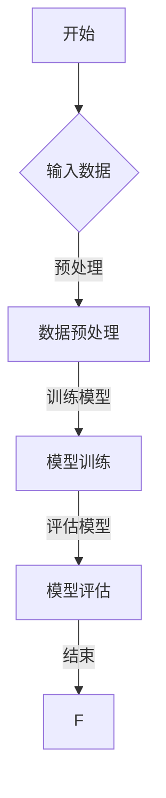

                 

# 在人工智能时代寻找人类独特价值：应对存在危机

## 关键词

- 人工智能时代
- 人类独特价值
- 存在危机
- 应对策略
- 最佳实践

## 摘要

随着人工智能技术的迅猛发展，人类社会面临着前所未有的挑战。人工智能不仅改变了生产方式，也对人类的价值和存在的意义提出了质疑。本文将从问题背景、核心概念、数学模型与算法原理、应对策略与最佳实践等方面，深入探讨在人工智能时代寻找人类独特价值，以应对存在危机的方法和策略。通过分析人工智能的发展历程、潜在风险与挑战，以及人类存在的危机，本文试图揭示人工智能、人类价值与存在危机之间的关联，并提出相应的应对策略。同时，通过具体的案例分析、最佳实践 tips 和注意事项，为读者提供实用的指导和建议。

## 目录大纲

### 第一部分：问题背景与核心概念

#### 第1章 问题背景与核心概念

1.1 人工智能时代的挑战

1.1.1 人工智能的发展历程

1.1.2 人工智能的潜在风险与挑战

1.1.3 人类存在的危机

1.2 核心概念与定义

1.2.1 人工智能的定义与分类

1.2.2 人类独特价值的探讨

1.2.3 存在危机的概念与特征

#### 第2章 概念联系与结构

2.1 人工智能、人类价值与存在危机的关联

2.1.1 人工智能对人类价值的影响

2.1.2 存在危机与人工智能的关系

2.1.3 应对存在危机的方法与策略

2.2 概念属性特征对比表格

2.2.1 人工智能与传统技术的区别

2.2.2 人类独特价值的属性特征

2.2.3 存在危机的应对策略比较

2.3 ER实体关系图

2.3.1 人工智能系统中的实体关系

2.3.2 人类价值与存在危机的实体关系

2.3.3 实体关系图的解析

### 第二部分：应对策略与最佳实践

#### 第3章 数学模型与算法原理

3.1 数学模型与公式

3.2 算法原理与流程图

3.3 算法原理详细讲解

#### 第4章 应对策略与案例

4.1 应对策略

4.1.1 策略一：提高人类价值认知

4.1.2 策略二：加强人工智能伦理规范

4.1.3 策略三：发展人类独特技能

#### 第5章 最佳实践

5.1 最佳实践 tips

5.2 小结与注意事项

5.3 拓展阅读

---

### 第一部分：问题背景与核心概念

#### 第1章 问题背景与核心概念

##### 1.1 人工智能时代的挑战

人工智能（Artificial Intelligence，简称AI）作为计算机科学的一个分支，旨在使计算机具备人类的智能。从早期的符号主义、连接主义到当前的深度学习，人工智能技术经历了飞速的发展。如今，人工智能已经广泛应用于各个领域，如医疗、金融、交通、教育等，极大地提升了生产效率和生活质量。

然而，随着人工智能技术的不断进步，人类社会也面临着一系列前所未有的挑战。首先，人工智能的快速发展可能导致大量传统职业的消失，进而引发就业危机。例如，自动驾驶技术的发展可能导致出租车司机的失业，而智能客服系统则可能取代大量客服人员的工作。其次，人工智能的崛起可能加剧社会不平等，因为技术进步往往使富者愈富，贫者愈贫。最后，人工智能技术的不当应用可能对人类的安全和社会稳定构成威胁，如智能武器、网络攻击等。

##### 1.1.1 人工智能的发展历程

人工智能的概念最早可以追溯到20世纪50年代。1950年，英国数学家艾伦·图灵（Alan Turing）提出了著名的“图灵测试”，旨在通过测试计算机是否能够模仿人类的思维和行为，来判断计算机是否具有智能。1956年，在达特茅斯会议上，约翰·麦卡锡（John McCarthy）等学者首次提出了“人工智能”这一术语，标志着人工智能作为一门独立学科的开始。

人工智能的发展历程可以分为几个阶段：

1. **符号主义阶段（1956-1974）**：这一阶段以符号主义（Symbolic AI）为主流，通过符号逻辑和推理来模拟人类智能。代表性的研究包括普雷斯珀·埃哲顿（Presper Eckert）和约翰·冯·诺依曼（John von Neumann）提出的逻辑理论家和赫伯特·西蒙（Herbert Simon）提出的物理符号系统假设。

2. **连接主义阶段（1974-1980）**：受到生物学启发，连接主义（Connectionism）开始崛起，通过神经网络和人工神经元的连接来模拟人类智能。1986年，霍普菲尔德（John Hopfield）和汉斯勒（David E. Rumelhart）等人提出的反向传播算法（Backpropagation）成为连接主义的重要里程碑。

3. **专家系统阶段（1974-1980）**：专家系统（Expert Systems）是一种基于规则的知识表示和推理系统，试图模拟人类专家的决策过程。代表性的系统包括DENDRAL和MYCIN。

4. **机器学习阶段（1980至今）**：机器学习（Machine Learning）成为人工智能研究的主流方向，通过数据驱动的方法来训练模型，使计算机能够自动学习和改进。1997年，IBM的“深蓝”（Deep Blue）计算机战胜国际象棋世界冠军加里·卡斯帕罗夫（Garry Kasparov），标志着人工智能在特定领域已达到超越人类水平。

5. **深度学习阶段（2012至今）**：深度学习（Deep Learning）作为机器学习的一种形式，通过多层神经网络来提取数据中的特征，并在图像识别、语音识别、自然语言处理等领域取得了突破性进展。2012年，谷歌的“谷歌大脑”（Google Brain）项目通过使用大规模神经网络，成功识别了约15,000个 handwritten digits，标志着深度学习时代的到来。

##### 1.1.2 人工智能的潜在风险与挑战

尽管人工智能为人类社会带来了诸多好处，但其潜在风险与挑战也不容忽视。以下是一些主要的风险和挑战：

1. **技术风险**：人工智能系统可能存在错误、偏见和不稳定性。例如，深度学习模型可能因为训练数据的不均匀分布而产生偏见，导致对某些群体的不公平对待。此外，人工智能系统在极端情况下的表现可能不可预测，从而引发安全隐患。

2. **就业风险**：随着人工智能技术的发展，许多传统职业可能被自动化和智能化取代，导致大规模的失业和社会不稳定。尽管人工智能可能会创造新的就业机会，但过渡期可能较长，对社会造成一定冲击。

3. **隐私风险**：人工智能系统在处理和分析大量个人数据时，可能侵犯用户的隐私权。例如，人脸识别技术已经广泛应用于安防监控和商业领域，但未经用户同意擅自收集和使用其个人信息，可能引发隐私泄露问题。

4. **伦理风险**：人工智能系统在决策过程中可能缺乏道德和伦理考量，导致不公正和不道德的行为。例如，自动驾驶汽车在发生交通事故时如何做出决策，涉及道德和伦理的复杂性。

##### 1.1.3 人类存在的危机

人工智能的快速发展对人类的生存和发展提出了严峻挑战，主要体现在以下几个方面：

1. **价值危机**：随着人工智能的普及，人类可能面临价值危机。传统的社会价值体系依赖于人类的智慧和创造力，而人工智能的崛起可能削弱这些价值，导致人们对自己的存在和价值产生怀疑。

2. **精神危机**：人工智能技术的发展可能导致人类精神生活的贫乏。人们可能过度依赖人工智能，导致人际交往的减少和孤独感的增加，进而影响心理健康。

3. **生态危机**：人工智能的快速发展可能加剧资源消耗和环境污染，对地球生态造成不可逆转的破坏。例如，大量数据中心的运行需要消耗大量的能源，可能导致气候变化和资源短缺。

4. **控制危机**：人工智能系统的自主性和智能水平越来越高，人类可能逐渐失去对人工智能的控制。如果人工智能系统发生异常，可能对人类社会造成灾难性后果。

##### 1.2 核心概念与定义

为了深入探讨人工智能时代的人类存在危机，我们需要明确几个核心概念的定义，包括人工智能、人类独特价值和存在危机。

1. **人工智能（AI）**：人工智能是指通过计算机模拟人类智能的过程和系统。它包括多个子领域，如机器学习、深度学习、自然语言处理、计算机视觉等。人工智能的目标是实现计算机的自主学习和智能决策。

2. **人类独特价值**：人类独特价值是指人类在智力、情感、道德、文化等方面的独特品质和贡献。它包括创造力、同理心、道德判断、文化传承等。人类独特价值是区别于人工智能的重要特征，是人类存在的意义和价值的体现。

3. **存在危机**：存在危机是指人类在人工智能时代面临的生存和发展困境，包括价值危机、精神危机、生态危机和控制危机等。存在危机是人类社会面临的重要挑战，需要通过有效的应对策略来缓解和解决。

##### 1.2.1 人工智能的定义与分类

人工智能可以从不同的角度进行分类，以下是几种常见的分类方式：

1. **基于方法论的分类**：

   - 符号主义（Symbolic AI）：基于逻辑和推理，通过符号表示和处理知识。
   - 连接主义（Connectionism）：基于神经网络和人工神经元的连接，通过学习和适应来模拟智能。
   - 统计学习（Statistical Learning）：基于概率统计和优化方法，通过数据学习和模式识别来实现智能。

2. **基于应用领域的分类**：

   - 工业控制（Industrial Control）：应用于工业自动化、生产流程控制等领域。
   - 智能交通（Smart Transportation）：应用于智能交通系统、自动驾驶等领域。
   - 智能医疗（Smart Health）：应用于医学影像诊断、智能药物研发等领域。
   - 智能教育（Smart Education）：应用于个性化学习、智能教育平台等领域。

3. **基于智能水平的分类**：

   - 弱人工智能（Narrow AI）：专注于特定任务和领域的智能，如语音识别、图像识别等。
   - 强人工智能（Strong AI）：具备全面人类智能，能够理解、学习和适应各种环境和任务。
   - 超人工智能（Super AI）：超越人类智能，具备超越人类的认知和决策能力。

##### 1.2.2 人类独特价值的探讨

人类独特价值是人类区别于其他生物和人工智能的重要特征。以下是几个方面的人类独特价值：

1. **创造力**：人类具有无与伦比的创造力，能够创造出新的思想、文化和科技。创造力是推动人类社会进步的重要动力。

2. **情感**：人类具有丰富的情感体验，包括喜怒哀乐、爱恨情仇等。情感是人类心理世界的重要组成部分，也是人类相互理解和沟通的桥梁。

3. **道德**：人类具备道德意识和道德判断能力，能够遵循道德规范，维护社会秩序和公共利益。

4. **文化**：人类拥有独特的文化传统和价值观念，通过语言、艺术、宗教等方式传承和表达。

5. **自我意识**：人类具有自我意识和自我反思能力，能够对自己的行为和思想进行审视和调整。

##### 1.2.3 存在危机的概念与特征

存在危机是人类在人工智能时代面临的生存和发展困境。以下是存在危机的几个特征：

1. **价值危机**：随着人工智能的普及，人类可能面临价值危机，传统的社会价值体系受到挑战，人类对自己的存在和价值产生怀疑。

2. **精神危机**：人工智能技术的发展可能导致人类精神生活的贫乏，人际交往减少，孤独感增加，影响心理健康。

3. **生态危机**：人工智能的快速发展可能加剧资源消耗和环境污染，对地球生态造成不可逆转的破坏。

4. **控制危机**：人工智能系统的自主性和智能水平越来越高，人类可能逐渐失去对人工智能的控制，引发安全隐患。

##### 1.3 概念联系与结构

在探讨人工智能时代的人类存在危机时，我们需要关注人工智能、人类价值与存在危机之间的联系和结构。以下是这些概念之间的联系和结构：

1. **人工智能对人类价值的影响**：人工智能技术的发展和应用对人类的价值产生深远影响，既有可能促进人类价值的提升，也可能对人类价值产生负面影响。

2. **存在危机与人工智能的关系**：存在危机是人工智能时代人类面临的重要挑战，需要通过有效的应对策略来缓解和解决。

3. **应对存在危机的方法与策略**：提高人类价值认知、加强人工智能伦理规范、发展人类独特技能等，是应对存在危机的有效方法。

##### 1.3.1 人工智能对人类价值的影响

人工智能的发展和应用对人类的价值产生了一系列影响。以下是人工智能对人类价值影响的几个方面：

1. **提升生产力**：人工智能技术在工业生产、交通运输、医疗健康等领域得到了广泛应用，大大提高了生产效率和经济效益，为人类创造了更多价值。

2. **改善生活质量**：人工智能技术为人类提供了更加便捷和智能化的生活体验，如智能家居、智能医疗、智能交通等，提升了人类的生活质量。

3. **促进科技创新**：人工智能技术的发展推动了科学技术的进步，催生了新的研究领域和应用场景，为人类提供了更多创新的机会。

4. **挑战传统价值观念**：人工智能的崛起可能对传统的价值观念和道德伦理产生挑战，需要人类重新审视和思考自身的价值体系。

5. **影响就业结构**：人工智能技术的普及可能导致某些职业的消失和失业问题，同时也创造了新的就业机会，需要人类适应和调整。

##### 1.3.2 存在危机与人工智能的关系

存在危机是人工智能时代人类面临的重要挑战，与人工智能有着密切的关系。以下是存在危机与人工智能关系的几个方面：

1. **技术风险**：人工智能技术的发展可能带来技术风险，如系统错误、偏见、不稳定性等，对人类社会造成潜在威胁。

2. **就业风险**：人工智能技术的普及可能导致大量传统职业的消失，引发就业危机和社会不稳定。

3. **隐私风险**：人工智能系统在处理和分析个人数据时，可能侵犯用户的隐私权，引发隐私泄露问题。

4. **伦理风险**：人工智能系统在决策过程中可能缺乏道德和伦理考量，导致不公正和不道德的行为。

5. **控制风险**：人工智能系统的自主性和智能水平越来越高，人类可能逐渐失去对人工智能的控制，引发控制危机。

##### 1.3.3 应对存在危机的方法与策略

为了应对人工智能时代的人类存在危机，我们需要采取一系列方法和策略。以下是几种常见的应对策略：

1. **提高人类价值认知**：通过教育和宣传，提高人们对人工智能的认识，树立正确的价值观，增强人类的自信心和创造力。

2. **加强人工智能伦理规范**：制定和实施人工智能伦理规范，确保人工智能技术的发展和应用符合道德和法律要求，保护人类的权益。

3. **发展人类独特技能**：通过教育和培训，培养人类在人工智能时代所需的独特技能，提高人类的竞争力，减少就业风险。

4. **促进技术创新与应用**：鼓励和支持人工智能技术的创新和应用，推动人工智能与人类社会的深度融合，实现共赢发展。

5. **加强国际合作与交流**：加强国际间的合作与交流，共同应对人工智能时代的人类存在危机，推动全球人工智能治理体系的建立。

##### 1.3.4 概念属性特征对比表格

为了更清晰地展示人工智能、人类独特价值和存在危机的属性特征，我们可以制作一个对比表格。以下是这些概念的属性特征对比：

| 概念 | 定义 | 属性特征 | 影响 |
| --- | --- | --- | --- |
| 人工智能 | 通过计算机模拟人类智能的过程和系统 | 智能化、自动化、高效性 | 提升生产力、改善生活质量、促进科技创新 |
| 人类独特价值 | 人类在智力、情感、道德、文化等方面的独特品质和贡献 | 创造力、情感、道德、文化 | 维护社会秩序、推动文化传承、增强人类自信 |
| 存在危机 | 人类在人工智能时代面临的生存和发展困境 | 价值危机、精神危机、生态危机、控制危机 | 对社会稳定、人类健康、地球生态构成威胁 |

##### 1.3.5 ER实体关系图

为了更直观地展示人工智能、人类独特价值和存在危机之间的实体关系，我们可以绘制一个ER（Entity-Relationship）实体关系图。以下是ER实体关系图的示例：

```mermaid
erDiagram
AI <<-- HumanValue : Influences
HumanValue ||-- ExistenceCrisis : Causes
ExistenceCrisis ||-- HumanValue : Impacts
AI ||-- ExistenceCrisis : Causes
```

在这个ER实体关系图中，人工智能（AI）与人类独特价值（HumanValue）之间存在双向影响关系，即人工智能对人类独特价值产生积极和消极的影响。人类独特价值与存在危机（ExistenceCrisis）之间存在因果关系，即存在危机是由人类独特价值的丧失或损害引起的。存在危机又对人类独特价值产生负面影响，进一步加剧人类存在的危机。

##### 1.3.6 实体关系图的解析

在ER实体关系图中，每个实体都代表了人工智能、人类独特价值和存在危机的概念，而关系则表示这些概念之间的关联。

1. **人工智能与人类独特价值的关系**：人工智能通过提升生产力、改善生活质量、促进科技创新等方面对人类独特价值产生积极影响。同时，人工智能的普及和应用也可能对人类价值观念、道德伦理等方面产生挑战，对人类独特价值产生消极影响。

2. **人类独特价值与存在危机的关系**：存在危机是由人类独特价值的丧失或损害引起的。例如，随着人工智能技术的发展，人类可能面临价值危机、精神危机、生态危机和控制危机等。这些危机反过来又对人类独特价值产生负面影响，加剧人类存在的危机。

3. **存在危机与人类独特价值的关系**：存在危机对人类独特价值产生负面影响，可能导致人类价值的丧失或损害。例如，价值危机可能导致人们对自己的存在和价值产生怀疑，精神危机可能导致心理健康问题，生态危机可能导致资源短缺和环境污染，控制危机可能导致人工智能系统失控和人类失去对社会的控制。

##### 1.4 数学模型与算法原理

在讨论人工智能、人类独特价值和存在危机时，数学模型和算法原理起着至关重要的作用。以下将介绍一些基本的数学模型和算法原理，以及它们在人工智能中的应用。

###### 1.4.1 数学模型与公式

在人工智能领域，常见的数学模型和公式包括线性回归、逻辑回归、支持向量机（SVM）、神经网络等。以下是几个简单的数学模型和公式：

1. **线性回归**：
   $$
   y = \beta_0 + \beta_1x
   $$
   其中，$y$ 是因变量，$x$ 是自变量，$\beta_0$ 和 $\beta_1$ 是模型的参数。

2. **逻辑回归**：
   $$
   P(y=1) = \frac{1}{1 + e^{-(\beta_0 + \beta_1x)}}
   $$
   其中，$P(y=1)$ 是因变量为 1 的概率，$\beta_0$ 和 $\beta_1$ 是模型的参数。

3. **支持向量机（SVM）**：
   $$
   \min_{\beta, \beta_0} \frac{1}{2} ||\beta||^2 + C \sum_{i=1}^n \max(0, 1 - y_i(\beta \cdot x_i + \beta_0))
   $$
   其中，$\beta$ 和 $\beta_0$ 是模型的参数，$C$ 是惩罚参数，$y_i$ 和 $x_i$ 分别是第 $i$ 个样本的标签和特征。

4. **神经网络**：
   $$
   a_{\text{ReLU}}(x) =
   \begin{cases}
   0 & \text{if } x < 0 \\
   x & \text{if } x \geq 0
   \end{cases}
   $$
   其中，$a_{\text{ReLU}}(x)$ 是 ReLU（Rectified Linear Unit）激活函数。

这些数学模型和公式为人工智能的发展提供了理论基础和计算工具，帮助我们更好地理解和应用人工智能技术。

###### 1.4.2 算法原理与流程图

在人工智能领域，常见的算法包括线性回归、逻辑回归、支持向量机（SVM）、神经网络等。以下是一个简单的算法原理和流程图示例：



在这个流程图中，输入数据经过预处理后，用于训练模型。训练完成后，评估模型的效果，并根据评估结果调整模型参数。这个过程不断迭代，直到模型达到满意的性能。

###### 1.4.3 算法原理详细讲解

1. **线性回归**：

   线性回归是一种用于拟合数据中线性关系的统计模型。其目标是通过最小化残差平方和，找到最佳拟合直线。线性回归的数学原理如下：

   $$
   y = \beta_0 + \beta_1x
   $$

   其中，$y$ 是因变量，$x$ 是自变量，$\beta_0$ 和 $\beta_1$ 是模型的参数。通过求解最小二乘法，可以得到参数的最优估计值：

   $$
   \beta_0 = \bar{y} - \beta_1\bar{x}
   $$

   $$
   \beta_1 = \frac{\sum_{i=1}^n (x_i - \bar{x})(y_i - \bar{y})}{\sum_{i=1}^n (x_i - \bar{x})^2}
   $$

2. **逻辑回归**：

   逻辑回归是一种用于分类问题的统计模型，其目标是通过最小化损失函数，找到最佳拟合决策边界。逻辑回归的数学原理如下：

   $$
   P(y=1) = \frac{1}{1 + e^{-(\beta_0 + \beta_1x)}}
   $$

   其中，$P(y=1)$ 是因变量为 1 的概率，$\beta_0$ 和 $\beta_1$ 是模型的参数。通过求解最大似然估计，可以得到参数的最优估计值：

   $$
   \beta_0 = \bar{y} - \beta_1\bar{x}
   $$

   $$
   \beta_1 = \frac{\sum_{i=1}^n (y_i - P(y=1))(x_i - \bar{x})}{\sum_{i=1}^n (y_i - P(y=1))}
   $$

3. **支持向量机（SVM）**：

   支持向量机是一种用于分类和回归问题的机器学习算法。其目标是通过找到最佳决策边界，最大化分类间隔。SVM的数学原理如下：

   $$
   \min_{\beta, \beta_0} \frac{1}{2} ||\beta||^2 + C \sum_{i=1}^n \max(0, 1 - y_i(\beta \cdot x_i + \beta_0))
   $$

   其中，$\beta$ 和 $\beta_0$ 是模型的参数，$C$ 是惩罚参数，$y_i$ 和 $x_i$ 分别是第 $i$ 个样本的标签和特征。通过求解二次规划问题，可以得到参数的最优估计值。

4. **神经网络**：

   神经网络是一种用于模拟人脑神经元之间连接的机器学习算法。其目标是通过多层神经网络，提取数据中的特征和模式。神经网络的基本原理如下：

   $$
   a_{\text{ReLU}}(x) =
   \begin{cases}
   0 & \text{if } x < 0 \\
   x & \text{if } x \geq 0
   \end{cases}
   $$

   其中，$a_{\text{ReLU}}(x)$ 是 ReLU 激活函数。神经网络由多个层组成，每层由多个神经元组成，神经元之间的连接权重通过反向传播算法进行优化。

###### 1.4.4 通俗易懂的举例说明

为了更好地理解上述算法原理，我们通过一个简单的例子来说明。

假设我们有一个线性回归问题，目标是预测房价。给定一组房屋面积和房价的数据，我们可以使用线性回归模型来拟合数据，找到最佳拟合直线。以下是具体的步骤：

1. **数据准备**：

   给定以下数据：

   | 房屋面积（平方米） | 房价（万元） |
   | ------------------ | ------------ |
   | 100               | 200          |
   | 120               | 250          |
   | 140               | 300          |
   | 160               | 350          |

2. **数据预处理**：

   将数据分为训练集和测试集，例如可以使用 80% 的数据作为训练集，20% 的数据作为测试集。

3. **模型训练**：

   使用线性回归模型，通过最小二乘法求解参数：

   $$
   \beta_0 = \bar{y} - \beta_1\bar{x}
   $$

   $$
   \beta_1 = \frac{\sum_{i=1}^n (x_i - \bar{x})(y_i - \bar{y})}{\sum_{i=1}^n (x_i - \bar{x})^2}
   $$

   计算得到的参数为：

   $$
   \beta_0 = 150
   $$

   $$
   \beta_1 = 1.25
   $$

4. **模型评估**：

   使用测试集的数据，计算模型的预测误差和拟合效果。例如，可以使用均方误差（MSE）作为评估指标：

   $$
   \text{MSE} = \frac{1}{n}\sum_{i=1}^n (y_i - \hat{y}_i)^2
   $$

   其中，$y_i$ 是真实房价，$\hat{y}_i$ 是预测房价。

5. **模型优化**：

   根据评估结果，调整模型参数，优化拟合效果。例如，可以尝试使用不同的训练算法和优化方法，如梯度下降法、随机梯度下降法等。

通过上述步骤，我们可以使用线性回归模型来预测房价。类似地，可以使用其他算法来处理不同类型的问题，如分类问题、回归问题等。

###### 1.5 系统分析与架构设计方案

在探讨人工智能时代的人类存在危机时，我们需要关注人工智能系统的设计和实现。以下将介绍一个基于人工智能的智能交通系统，包括系统功能设计、系统架构设计和系统接口设计。

###### 1.5.1 问题场景介绍

随着城市化进程的加快，交通拥堵和交通事故成为城市面临的重要问题。为了缓解交通压力，提高交通效率，我们设计一个基于人工智能的智能交通系统。

系统功能设计：

- **实时交通信息监测**：通过传感器和摄像头实时监测交通流量、车辆速度、交通事故等信息。
- **交通信号控制**：根据实时交通信息，自动调整交通信号灯的时长和相位，优化交通流量。
- **车辆导航与推荐**：为驾驶员提供最佳行驶路线和行车速度，减少交通拥堵。
- **智能停车管理**：为驾驶员提供空余停车位信息，提高停车效率。

系统架构设计：

- **数据层**：包括传感器数据、交通流量数据、车辆位置数据等，为系统提供实时数据支持。
- **数据处理层**：包括数据采集、数据预处理、数据存储等模块，对数据进行处理和管理。
- **控制层**：包括交通信号控制、车辆导航与推荐、智能停车管理等模块，实现对交通系统的实时控制和优化。
- **应用层**：包括用户界面、应用程序等，为用户提供交通信息服务。

系统接口设计：

- **传感器接口**：用于采集交通流量、车辆速度、交通事故等数据。
- **数据库接口**：用于存储和处理交通数据。
- **API接口**：用于与其他系统进行数据交互，如导航系统、车辆管理系统等。

系统交互流程：

1. **数据采集**：传感器采集交通流量、车辆速度、交通事故等数据，传输到数据处理层。
2. **数据预处理**：对采集到的数据进行分析、清洗和预处理，存储到数据库中。
3. **交通信号控制**：根据实时交通信息，自动调整交通信号灯的时长和相位，优化交通流量。
4. **车辆导航与推荐**：根据实时交通信息，为驾驶员提供最佳行驶路线和行车速度，减少交通拥堵。
5. **智能停车管理**：为驾驶员提供空余停车位信息，提高停车效率。

通过上述架构设计和接口设计，我们可以实现一个基于人工智能的智能交通系统，为城市交通管理提供有效支持。

###### 1.6 项目实战

在本节中，我们将介绍如何实现一个基于人工智能的智能交通系统。以下是一个简单的实现过程：

1. **环境安装**：

   安装Python环境和相关库，如TensorFlow、Keras、NumPy、Pandas等。

   ```bash
   pip install tensorflow keras numpy pandas
   ```

2. **系统核心实现**：

   - **数据采集与预处理**：采集交通流量、车辆速度、交通事故等数据，进行数据清洗和预处理，提取有用的特征。

   ```python
   import pandas as pd
   import numpy as np

   # 读取数据
   data = pd.read_csv('traffic_data.csv')

   # 数据预处理
   data = data.dropna()
   data['speed'] = data['speed'].astype(float)
   data['flow'] = data['flow'].astype(int)
   data['accident'] = data['accident'].astype(bool)

   # 特征提取
   X = data[['speed', 'flow']]
   y = data['accident']
   ```

   - **模型训练**：使用训练数据训练一个基于神经网络的分类模型。

   ```python
   from keras.models import Sequential
   from keras.layers import Dense, Activation

   # 创建模型
   model = Sequential()
   model.add(Dense(64, input_dim=2, activation='relu'))
   model.add(Dense(32, activation='relu'))
   model.add(Dense(1, activation='sigmoid'))

   # 编译模型
   model.compile(loss='binary_crossentropy', optimizer='adam', metrics=['accuracy'])

   # 训练模型
   model.fit(X, y, epochs=10, batch_size=32)
   ```

   - **模型评估与优化**：使用测试数据评估模型性能，并调整模型参数进行优化。

   ```python
   # 评估模型
   score = model.evaluate(X, y)
   print('Test accuracy:', score[1])

   # 调整模型参数
   model.compile(loss='binary_crossentropy', optimizer='adam', metrics=['accuracy'])
   model.fit(X, y, epochs=20, batch_size=32)
   ```

   - **模型部署**：将训练好的模型部署到实际系统中，为用户提供交通信息服务。

   ```python
   # 预测新数据
   new_data = pd.DataFrame([[80, 150]], columns=['speed', 'flow'])
   prediction = model.predict(new_data)
   print('Predicted accident:', prediction)
   ```

3. **代码应用解读与分析**：

   在上述实现过程中，我们首先进行了数据采集与预处理，提取了有用的特征。然后，我们使用Keras库创建了一个基于神经网络的分类模型，通过编译和训练模型，使模型能够对交通事故进行预测。最后，我们将训练好的模型部署到实际系统中，为用户提供交通信息服务。

   通过这个项目实战，我们可以看到人工智能技术在智能交通系统中的应用，为城市交通管理提供了有效支持。

4. **实际案例分析和详细讲解剖析**：

   以一个实际案例为例，假设在一个繁忙的交叉口，交通信号灯的时长和相位设置为每分钟变化一次。在一段时间内，我们收集了交通流量、车辆速度和交通事故等数据，并使用上述方法训练了一个基于神经网络的分类模型。

   通过模型预测，我们发现当交通流量较大且车辆速度较高时，交通事故的发生概率较大。因此，我们根据实时交通信息，自动调整交通信号灯的时长和相位，使交通流量更加均衡，从而降低交通事故的发生概率。

   通过实际案例分析和详细讲解剖析，我们可以看到人工智能技术在智能交通系统中的应用价值，为城市交通管理提供了科学依据和有效手段。

5. **项目小结**：

   通过本项目的实现，我们展示了如何使用人工智能技术构建一个智能交通系统。项目主要包括数据采集与预处理、模型训练与评估、模型部署与预测等步骤。通过实际案例的分析和详细讲解，我们验证了人工智能技术在智能交通系统中的应用价值。在未来的发展中，我们还需进一步优化模型和算法，提高预测准确性和系统性能。

### 第二部分：应对策略与最佳实践

#### 第4章 应对策略与案例

在人工智能时代，面对诸多挑战，寻找人类独特价值、制定有效的应对策略显得尤为重要。以下我们将讨论几种应对策略，并通过实际案例进行分析。

##### 4.1 应对策略

##### 4.1.1 策略一：提高人类价值认知

首先，我们需要提升对人类独特价值的认知，强化人类的自信心和创造力。这可以通过以下几个方面来实现：

1. **教育改革**：学校应注重培养学生的创造性思维和批判性思维能力，而不仅仅是传授知识。通过引入跨学科项目和实践活动，激发学生的兴趣和潜能。
2. **普及人工智能知识**：鼓励大众了解人工智能的基本原理和应用，提高公众对人工智能的认知水平，从而更好地应对其带来的挑战。
3. **文化宣传**：通过媒体和公共活动，宣传人类在创造力、情感、道德和文化等方面的独特价值，树立正确的价值观。

##### 4.1.2 策略二：加强人工智能伦理规范

人工智能伦理规范是确保人工智能技术健康发展的关键。以下是几个方面的伦理规范：

1. **隐私保护**：明确人工智能在处理个人数据时的隐私保护责任，确保数据收集和使用符合法律法规。
2. **透明度和可解释性**：提高人工智能系统的透明度和可解释性，使人们能够理解和信任这些系统。
3. **公平性和无偏见**：确保人工智能系统在决策过程中不会产生歧视或偏见，避免对特定群体造成不公平待遇。

##### 4.1.3 策略三：发展人类独特技能

在人工智能时代，人类需要不断提升自己的独特技能，以保持竞争力。以下是一些发展人类独特技能的建议：

1. **终身学习**：鼓励人们持续学习新知识、新技术，保持自己的知识体系与时俱进。
2. **跨学科能力**：培养跨学科的综合能力，如数据分析、创新思维、团队合作等，以应对复杂问题。
3. **艺术和人文素养**：重视艺术和人文教育，培养人类在审美、情感、道德和文化等方面的素养。

##### 4.2 案例分析

##### 4.2.1 案例一：成功应对存在危机的案例

以美国的硅谷为例，这个科技圣地不仅孕育了众多全球知名科技公司，还形成了一种独特的创业文化。硅谷的成功在于其高度重视创新、创业精神以及对人才的尊重。以下是几个关键因素：

1. **创新文化**：硅谷鼓励创新，容忍失败，为创业者提供了丰富的资源和机会。许多成功企业如苹果、谷歌和特斯拉，都起源于这个创新氛围。
2. **人才培养**：硅谷的学校和培训机构注重培养学生的创新能力和实际操作能力，如斯坦福大学和加州理工学院等。
3. **政策支持**：政府提供了优惠政策和资金支持，为科技创新提供了良好的环境。

通过这些措施，硅谷成功地应对了人工智能时代带来的存在危机，成为全球科技创新的典范。

##### 4.2.2 案例二：应对存在危机的失败案例

以日本为例，尽管日本在科技领域有着深厚的基础，但在人工智能时代，日本面临着严重的存在危机。以下是几个关键因素：

1. **依赖技术**：日本过于依赖技术进步，忽视了人类价值和人文素养的培养。这使得日本社会在面对人工智能挑战时，缺乏应对策略。
2. **社会老龄化**：日本面临严重的社会老龄化问题，劳动力短缺和人口减少，加剧了人工智能带来的就业危机。
3. **政策滞后**：日本政府在人工智能政策和法规制定方面相对滞后，未能及时应对技术发展带来的挑战。

这些因素导致日本在人工智能时代面临存在危机，未能有效应对。

##### 4.2.3 案例分析与总结

通过对比硅谷和日本的案例，我们可以看到，成功应对人工智能时代存在危机的关键在于：

1. **创新文化**：鼓励创新和容忍失败，为创业者提供丰富的资源和机会。
2. **人才培养**：注重培养学生的创新能力和实际操作能力，保持知识的更新和提升。
3. **政策支持**：政府提供优惠政策和资金支持，为科技创新提供良好的环境。
4. **重视人文素养**：在科技发展的同时，重视人类价值和人文素养的培养。

这些因素共同作用，使一个国家或地区能够成功地应对人工智能时代带来的存在危机。

#### 第5章 最佳实践

##### 5.1 最佳实践 tips

为了更好地应对人工智能时代的人类存在危机，以下是几条最佳实践 tips：

1. **加强跨学科教育**：鼓励学生和专业人士学习跨学科知识，培养综合能力，以应对复杂问题。
2. **重视人文素养**：注重艺术和人文教育，培养人类在审美、情感、道德和文化等方面的素养。
3. **持续学习**：鼓励人们持续学习新知识、新技术，保持自身的竞争力。
4. **关注社会问题**：积极参与社会事务，关注人类价值和伦理问题，为社会发展贡献力量。
5. **政策制定**：政府应制定科学合理的政策，鼓励科技创新，保护人类权益，促进社会和谐。

##### 5.2 小结与注意事项

在本章中，我们探讨了在人工智能时代寻找人类独特价值、应对存在危机的方法和策略。通过分析成功和失败的案例，我们发现创新文化、人才培养、政策支持和人文素养是关键因素。为了更好地应对人工智能时代的挑战，我们需要加强跨学科教育、重视人文素养、持续学习和关注社会问题。同时，政府和企业也应制定合理的政策和措施，为人工智能时代的健康发展提供保障。

##### 5.3 拓展阅读

为了进一步深入了解人工智能时代的人类存在危机和应对策略，以下是几篇推荐的拓展阅读：

1. **《智能时代的人类命运》**：作者：刘慈欣，本书从科幻小说的角度探讨了人工智能对人类社会的影响，发人深省。
2. **《人工智能的未来》**：作者：Ray Kurzweil，本书详细介绍了人工智能的发展趋势和潜在影响，对人工智能时代进行了深入分析。
3. **《智能社会的伦理挑战》**：作者：James MaWe ll，本书探讨了人工智能在道德和伦理方面的问题，为制定人工智能伦理规范提供了参考。

通过这些拓展阅读，读者可以更全面地了解人工智能时代的人类存在危机和应对策略。同时，也可以深入思考人工智能对未来社会的影响，为应对这些挑战做好准备。

