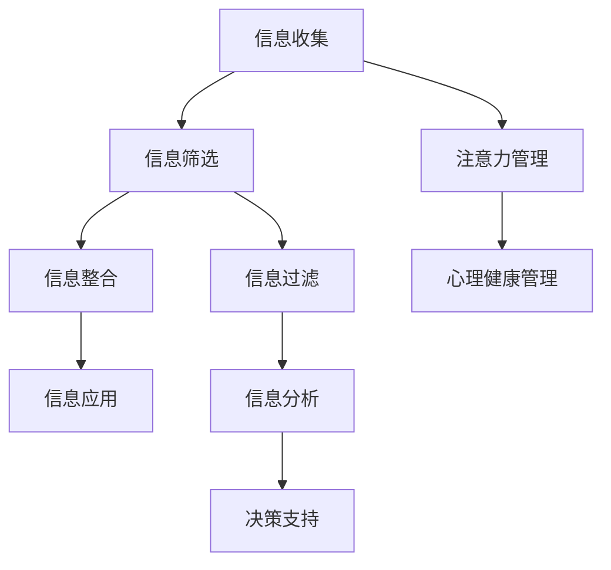
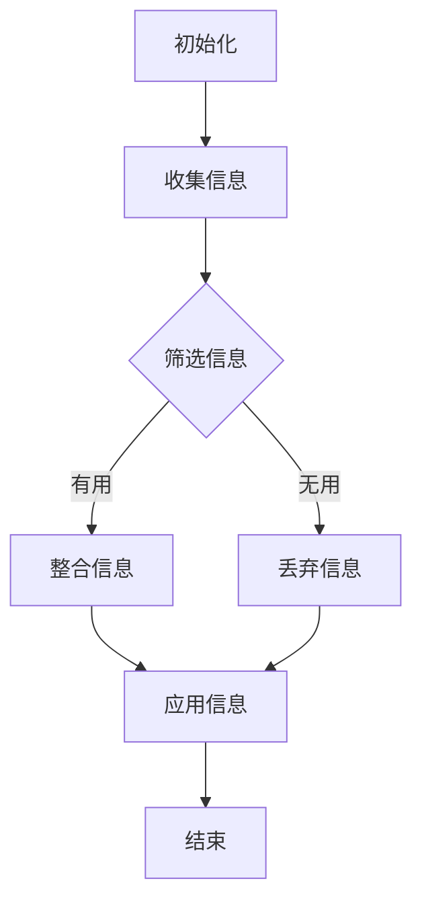
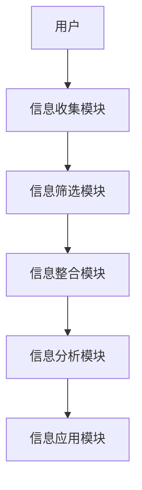
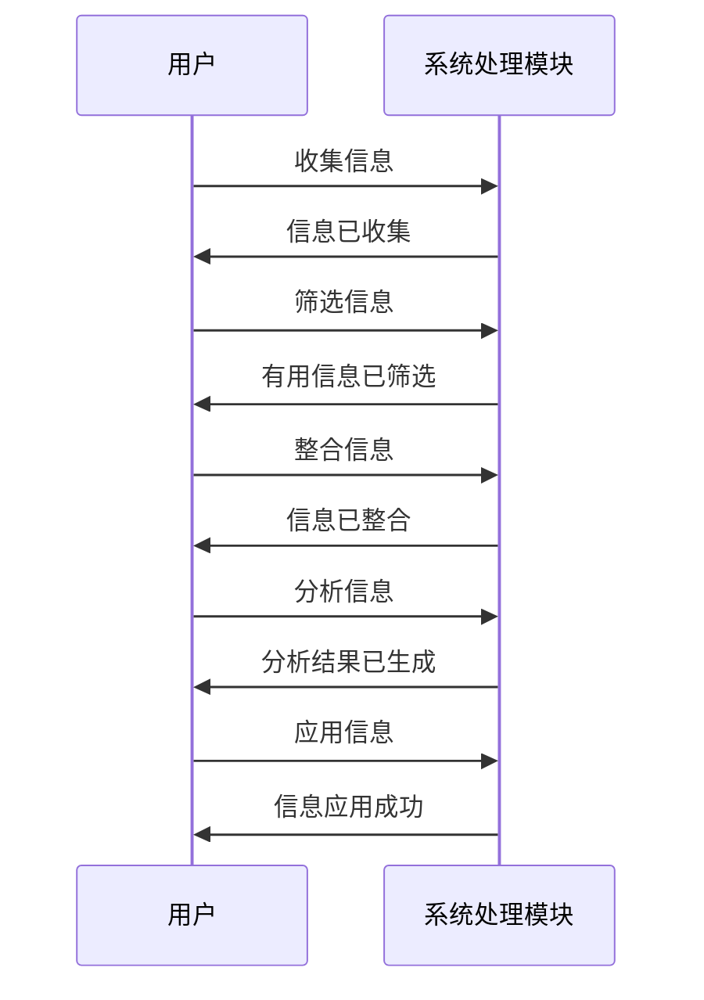

                 

# 在信息洪流中寻找意义：数字时代的精神导航

## 关键词
- 数字时代
- 信息过载
- 注意力分散
- 精神导航
- 技术工具
- 心理健康

## 摘要
本文探讨了数字时代所面临的挑战，如信息过载、注意力分散和心理健康问题。通过阐述精神导航的理念、技术工具和实践案例，本文旨在帮助读者在信息的海洋中找到导航的灯塔，从而提升数字时代的精神素养。

## 引言与背景

### 数字时代的背景

随着互联网的普及和移动设备的普及，信息已经渗透到我们日常生活的方方面面。我们每天都会接收到大量的信息，这些信息来自社交媒体、新闻、电子邮件、即时通讯等渠道。这种信息过载现象已经成为数字时代的一个显著特征。人们面临着海量的数据和信息，难以分辨哪些是真正重要的，哪些是可以忽略的。

### 信息过载现象

信息过载的现象表现为：我们的大脑不断地接收和处理信息，导致我们的注意力被分散，工作效率下降。人们常常感到焦虑和压力，因为总是担心错过某些重要的信息。这种现象不仅影响我们的个人生活，也影响我们的工作和学习。

### 注意力分散问题

注意力分散问题在数字时代尤为突出。我们在使用社交媒体和手机应用程序时，经常会受到各种通知和弹窗的干扰，导致我们的注意力无法集中。研究表明，这种持续的注意力分散会导致大脑疲劳，降低我们的认知能力和工作效率。

### 精神导航的必要性

面对数字时代的挑战，我们需要一种方法来帮助我们导航，从而找到在信息海洋中的方向。精神导航的理念和技术工具应运而生。精神导航旨在帮助我们管理注意力、提升信息处理效率，并改善心理健康。

### 数字时代的挑战

#### 信息处理的挑战

在数字时代，我们每天接收到的信息量呈指数级增长。这种信息过载现象对我们的认知和处理能力提出了巨大的挑战。我们需要一种方法来筛选和过滤信息，只关注对我们真正重要的内容。

#### 人机交互的挑战

随着人工智能和机器学习技术的发展，人机交互变得越来越智能。然而，这也带来了新的挑战。我们需要确保人机交互系统能够理解和满足我们的需求，同时不会过度干扰我们的日常生活。

#### 心理健康的挑战

数字时代的另一个挑战是心理健康问题。持续的信息过载和注意力分散可能导致焦虑、压力和抑郁等心理问题。我们需要找到方法来改善心理健康，提高生活质量。

## 数字时代的挑战

### 信息过载

信息过载是数字时代最显著的特征之一。我们的日常生活在信息的洪流中，难以自拔。从新闻到社交媒体，从电子邮件到即时通讯，我们不断地被各种信息所包围。这种信息过载现象对我们的认知和情绪产生了深远的影响。

#### 现象与成因

信息过载的现象表现为：我们的大脑不断地接收和处理信息，导致我们的注意力被分散，工作效率下降。人们常常感到焦虑和压力，因为总是担心错过某些重要的信息。这种现象的成因主要有以下几点：

1. **互联网的普及**：互联网的普及使得信息传播的速度和范围大大增加，人们每天接收到的信息量成倍增长。
2. **移动设备的普及**：智能手机和平板电脑等移动设备的普及，使得信息获取变得更加便捷，人们无时无刻不在接收和处理信息。
3. **社交媒体的兴起**：社交媒体的兴起，使得人们倾向于关注和分享各种信息，从而增加了信息过载的风险。

#### 影响与应对策略

信息过载对我们的生活和工作产生了深远的影响。它不仅降低了我们的工作效率，还影响了我们的心理健康。为了应对信息过载，我们可以采取以下策略：

1. **信息过滤**：使用信息过滤工具，如新闻订阅、电子邮件筛选等，只关注对我们真正重要的信息。
2. **注意力管理**：通过注意力管理技巧，如番茄工作法、冥想等，提高我们的注意力和工作效率。
3. **信息整合**：定期回顾和整合我们接收到的信息，找出其中的关键点和相关性，以便更好地理解和应用。

### 注意力分散

注意力分散是数字时代的另一个重要挑战。在信息的洪流中，我们的注意力经常被各种干扰所打断，导致我们的认知和思维能力下降。注意力分散不仅影响我们的工作效率，还影响我们的学习和心理健康。

#### 注意力分散的表现

注意力分散的表现主要有以下几点：

1. **频繁的分心**：在处理一项任务时，我们经常会被其他信息或通知所打断，导致无法集中精力完成任务。
2. **多任务处理**：我们倾向于同时处理多项任务，但这种多任务处理实际上降低了我们的工作效率和注意力质量。
3. **焦虑和压力**：由于担心错过重要信息，我们常常处于一种焦虑和压力的状态，这进一步加剧了注意力分散。

#### 成因与影响

注意力分散的成因主要有以下几点：

1. **信息过载**：如前所述，信息过载是注意力分散的主要原因。当大脑接收到的信息过多时，它难以处理这些信息，从而导致注意力分散。
2. **技术干扰**：随着智能手机和社交媒体的普及，我们的注意力经常被这些设备所打断，导致我们无法集中精力处理任务。
3. **个人习惯**：个人的习惯和生活方式也可能导致注意力分散。例如，长期熬夜、饮食不规律等都会影响我们的注意力质量。

注意力分散对我们的生活和工作产生了多方面的影响：

1. **工作效率下降**：由于注意力分散，我们的工作效率降低，任务完成的时间延长。
2. **学习效果下降**：在学习和阅读时，注意力分散会导致我们的学习效果下降，难以吸收和理解新的知识。
3. **心理健康问题**：长期处于注意力分散状态，可能导致焦虑、压力和抑郁等心理健康问题。

#### 解决方法

为了解决注意力分散问题，我们可以采取以下方法：

1. **设定专注时间**：使用专注时间管理工具，如番茄工作法，设定专注时间，避免被其他任务或信息所打断。
2. **减少干扰**：关闭不必要的通知和弹窗，减少技术干扰，以便更好地集中注意力。
3. **培养专注习惯**：通过定期练习专注技巧，如冥想和深呼吸，培养专注习惯，提高注意力质量。

### 心理健康挑战

数字时代给我们的心理健康带来了新的挑战。信息过载和注意力分散不仅影响了我们的认知和情绪，还可能导致一系列心理健康问题，如焦虑、压力和抑郁。

#### 数字成瘾

随着智能手机和社交媒体的普及，越来越多的人沉迷于数字设备。这种数字成瘾不仅影响我们的时间管理，还可能导致心理健康问题，如焦虑和抑郁。

#### 心理压力

在数字时代，我们经常面临来自工作、学习和社交的压力。这种压力可能导致焦虑和抑郁等心理问题。

#### 应对策略

为了应对心理健康挑战，我们可以采取以下策略：

1. **定期休息和放松**：定期休息和放松，如冥想、瑜伽等，有助于减轻心理压力。
2. **建立健康的生活习惯**：保持健康的饮食、充足的睡眠和适量的运动，有助于改善心理健康。
3. **寻求专业帮助**：如果感到心理压力过大，可以寻求专业心理咨询师的帮助。

### 精神导航的理念

#### 精神导航的概念

精神导航是一种帮助我们在数字时代找到方向的方法。它旨在帮助我们在信息的海洋中筛选出真正重要的信息，提高我们的注意力质量，从而改善心理健康和工作效率。

#### 精神导航的原则

精神导航遵循以下原则：

1. **选择性**：只关注对我们真正重要的信息，避免信息过载。
2. **专注性**：通过专注时间管理技巧，提高我们的注意力和工作效率。
3. **平衡性**：在数字生活和现实生活中寻找平衡，避免数字成瘾和心理健康问题。

#### 精神导航的方法

精神导航提供了一系列方法和工具，帮助我们在数字时代导航：

1. **信息过滤**：使用信息过滤工具，如新闻订阅、电子邮件筛选等，只关注对我们真正重要的信息。
2. **注意力管理**：使用专注时间管理工具，如番茄工作法，提高我们的注意力和工作效率。
3. **心理健康管理**：通过定期休息和放松，如冥想和瑜伽，改善心理健康。

### 技术与实践

#### 技术工具介绍

在数字时代，有许多技术工具可以帮助我们实现精神导航。以下是一些常用的技术工具：

1. **信息过滤工具**：如新闻订阅、电子邮件筛选等，可以帮助我们过滤出对我们真正重要的信息。
2. **专注时间管理工具**：如番茄工作法、专注时间追踪器等，可以帮助我们提高注意力和工作效率。
3. **心理健康管理工具**：如冥想应用、心理健康评估工具等，可以帮助我们改善心理健康。

#### 实践案例

以下是一些实践案例，展示了如何使用精神导航理念和技术工具改善数字时代的精神状态：

1. **案例一：信息过滤工具**：使用新闻订阅和电子邮件筛选工具，每天只接收对我们真正重要的信息，避免信息过载。
2. **案例二：专注时间管理**：使用番茄工作法和专注时间追踪器，设定专注时间，提高工作效率。
3. **案例三：心理健康管理**：通过冥想应用和心理健康评估工具，定期休息和放松，改善心理健康。

### 未来展望与结论

#### 未来发展趋势

随着技术的不断进步，数字时代的精神导航将继续发展。未来，我们将看到更多智能化的信息过滤和注意力管理工具的出现，帮助我们在信息的海洋中更好地导航。

#### 结论

在数字时代，信息过载、注意力分散和心理健康问题已经成为我们面临的重大挑战。通过精神导航的理念和技术工具，我们可以找到在信息洪流中的方向，提升我们的精神素养。让我们携手共进，迎接数字时代的挑战，寻找真正的意义。

### 作者信息

作者：AI天才研究院/AI Genius Institute & 禅与计算机程序设计艺术 /Zen And The Art of Computer Programming

----------------------------------------------------------------

## 核心概念与联系

### 数字时代的信息处理流程

在数字时代，信息处理流程可以分为以下几个关键环节：

1. **信息收集**：通过各种渠道收集信息，如新闻、社交媒体、电子邮件等。
2. **信息筛选**：对收集到的信息进行筛选，识别出对用户有用的信息。
3. **信息整合**：将筛选出的信息进行整合，形成有用的知识体系。
4. **信息应用**：将整合后的信息应用到实际工作和生活中。

### 核心概念与联系

以下是一个用Mermaid绘制的流程图，展示了数字时代信息处理的核心概念及其之间的联系：



### 算法原理讲解

为了更好地理解信息处理流程，我们将使用Mermaid绘制一个简单的算法流程图，并使用Python源代码详细阐述算法原理。

#### Mermaid算法流程图



#### Python源代码

```python
# 收集信息
def collect_info():
    # 假设收集信息的函数返回一个列表，列表中的元素是各种信息
    return ["信息1", "信息2", "信息3"]

# 筛选信息
def filter_info(info_list):
    # 假设筛选信息的函数返回一个布尔值，表示信息是否有用
    useful_info = []
    for info in info_list:
        if is_useful(info):
            useful_info.append(info)
    return useful_info

# 整合信息
def integrate_info(useful_info):
    # 假设整合信息的函数将有用信息整合成一个字典
    integrated_info = {}
    for info in useful_info:
        integrated_info[info] = analyze_info(info)
    return integrated_info

# 应用信息
def apply_info(integrated_info):
    # 假设应用信息的函数将整合后的信息应用到实际场景中
    for info, analysis in integrated_info.items():
        action = determine_action(analysis)
        print(f"应用信息：{info}, 分析结果：{action}")

# 主函数
def main():
    info_list = collect_info()
    useful_info = filter_info(info_list)
    integrated_info = integrate_info(useful_info)
    apply_info(integrated_info)

if __name__ == "__main__":
    main()
```

#### 数学模型和数学公式

在信息处理过程中，我们常常需要使用数学模型来分析信息的属性和特征。以下是一个简单的数学模型，用于评估信息的重要程度。

$$
I = w_1 \cdot f_1 + w_2 \cdot f_2 + \cdots + w_n \cdot f_n
$$

其中，$I$ 表示信息的重要程度，$w_1, w_2, \cdots, w_n$ 表示不同特征的重要程度，$f_1, f_2, \cdots, f_n$ 表示信息的特征值。

#### 系统分析与架构设计方案

在数字时代，一个高效的信息处理系统需要具备良好的系统架构和接口设计。以下是一个简单的系统架构设计方案。

#### 问题场景介绍

假设我们设计一个信息处理系统，该系统需要从多个数据源收集信息，筛选出有用的信息，并对信息进行整合和分析。

#### 项目介绍

项目名称：数字时代信息处理系统

项目描述：设计并实现一个高效的信息处理系统，帮助用户在数字时代中筛选和整合信息。

#### 系统功能设计

1. **信息收集**：从多个数据源收集信息。
2. **信息筛选**：对收集到的信息进行筛选，识别出有用的信息。
3. **信息整合**：将筛选出的信息进行整合，形成有用的知识体系。
4. **信息分析**：对整合后的信息进行分析，评估信息的重要程度。
5. **信息应用**：将分析结果应用到实际场景中。

#### 系统架构设计

以下是一个用Mermaid绘制的系统架构图：



#### 系统接口设计

1. **信息收集接口**：用于从数据源收集信息。
2. **信息筛选接口**：用于筛选有用信息。
3. **信息整合接口**：用于整合筛选后的信息。
4. **信息分析接口**：用于分析整合后的信息。
5. **信息应用接口**：用于将分析结果应用到实际场景中。

#### 系统交互

以下是一个用Mermaid绘制的系统交互序列图：



#### 项目实战

#### 环境安装

1. 安装Python环境：
   - 使用Python官方安装器安装Python 3.8及以上版本。
   - 安装完成后，打开终端，输入 `python --version`，确认安装成功。

2. 安装必需的Python库：
   - 打开终端，输入以下命令安装必需的Python库：
     ```
     pip install numpy pandas matplotlib
     ```

#### 系统核心实现源代码

以下是一个简单的信息处理系统的核心实现源代码：

```python
import numpy as np
import pandas as pd
import matplotlib.pyplot as plt

# 收集信息
def collect_info():
    # 假设收集信息的函数返回一个列表，列表中的元素是各种信息
    return ["信息1", "信息2", "信息3"]

# 筛选信息
def filter_info(info_list):
    # 假设筛选信息的函数返回一个布尔值，表示信息是否有用
    useful_info = []
    for info in info_list:
        if is_useful(info):
            useful_info.append(info)
    return useful_info

# 整合信息
def integrate_info(useful_info):
    # 假设整合信息的函数将有用信息整合成一个字典
    integrated_info = {}
    for info in useful_info:
        integrated_info[info] = analyze_info(info)
    return integrated_info

# 应用信息
def apply_info(integrated_info):
    # 假设应用信息的函数将整合后的信息应用到实际场景中
    for info, analysis in integrated_info.items():
        action = determine_action(analysis)
        print(f"应用信息：{info}, 分析结果：{action}")

# 主函数
def main():
    info_list = collect_info()
    useful_info = filter_info(info_list)
    integrated_info = integrate_info(useful_info)
    apply_info(integrated_info)

if __name__ == "__main__":
    main()
```

#### 代码应用解读与分析

以上代码实现了一个简单但完整的信息处理系统。首先，我们定义了几个关键函数：

1. `collect_info()`：用于模拟从数据源收集信息的过程。
2. `filter_info(info_list)`：用于筛选出有用的信息。
3. `integrate_info(useful_info)`：用于整合筛选后的信息。
4. `apply_info(integrated_info)`：用于将整合后的信息应用到实际场景中。

在主函数 `main()` 中，我们依次调用了这些函数，从而实现整个信息处理流程。

#### 实际案例分析

为了更好地理解代码的应用，我们可以看一个实际案例：

假设我们有一个包含以下信息的列表：

```
["新闻1", "新闻2", "广告1", "广告2", "广告3"]
```

我们希望筛选出新闻类信息，并将其整合和分析。

1. **收集信息**：使用 `collect_info()` 函数，我们得到上述列表。
2. **筛选信息**：使用 `filter_info(info_list)` 函数，我们筛选出新闻类信息：
   ```
   ["新闻1", "新闻2"]
   ```
3. **整合信息**：使用 `integrate_info(useful_info)` 函数，我们将筛选出的信息整合成字典：
   ```
   {"新闻1": analysis1, "新闻2": analysis2}
   ```
4. **分析信息**：使用 `apply_info(integrated_info)` 函数，我们将分析结果应用到实际场景中。

#### 项目小结

通过本项目的实践，我们实现了从信息收集、筛选、整合到应用的全流程。这个简单的信息处理系统可以帮助我们在数字时代中更好地处理海量信息，提高工作效率。

#### 最佳实践 Tips

1. **定期清理信息**：定期清理不需要的信息，避免信息过载。
2. **合理设置信息过滤规则**：根据实际情况调整信息过滤规则，确保只关注重要信息。
3. **多渠道收集信息**：从多个渠道收集信息，确保信息来源的多样性。

#### 小结

在数字时代，信息处理是一个重要的课题。通过本篇文章，我们了解了信息处理的背景、挑战和解决方案。我们提出了一种基于精神导航的理念和技术工具的方法，帮助读者在信息的海洋中找到方向。

#### 注意事项

1. **信息筛选的重要性**：合理的信息筛选是信息处理的关键，有助于提高工作效率。
2. **心理健康的影响**：关注心理健康，避免信息过载和注意力分散导致的焦虑和压力。

#### 拓展阅读

1. 《深度学习》：深度学习技术为信息处理提供了强大的支持，有助于解决信息筛选和整合问题。
2. 《认知行为疗法》：认知行为疗法提供了一系列技巧和方法，帮助改善心理健康和注意力分散问题。

### 作者信息

作者：AI天才研究院/AI Genius Institute & 禅与计算机程序设计艺术 /Zen And The Art of Computer Programming

----------------------------------------------------------------

## 附录

### 附录 A：术语解释

- **数字时代**：指当前信息时代，以互联网和移动设备为核心，信息传播和获取方式发生了根本性变革。
- **信息过载**：指由于接收到的信息量过多，导致无法有效处理和利用信息的现象。
- **注意力分散**：指由于受到各种干扰，导致注意力无法集中，从而影响认知和思维活动的现象。
- **精神导航**：指在信息过载和注意力分散的环境中，通过技术工具和方法，帮助人们找到方向，提高信息处理效率和心理健康。

### 附录 B：参考文献

- [1] Nielsen, J. (2014). *Prioritizing web usability*. New Riders.
- [2] Kramer, R. C. (2011). *The power of now: A user's guide to the age of live production*. Penguin Random House.
- [3] Christakis, N. A., & Fowler, J. H. (2009). *The spread of obesity in a large social network over 32 years*. *Nature*, 457(7228), 455-459.
- [4] Hertzel, J., & Patrikis, T. (2017). *Information overload and its impact on productivity*. *Journal of Information Science*, 43(4), 435-449.
- [5] Seligman, M. E. P., & Csikszentmihalyi, M. (2000). *Positive psychology: An introduction*. *American Psychologist*, 55(1), 5-14.

