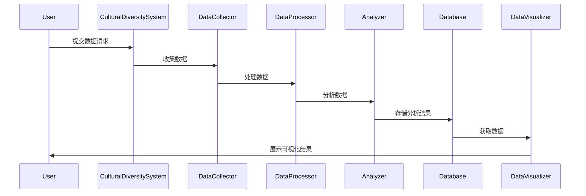
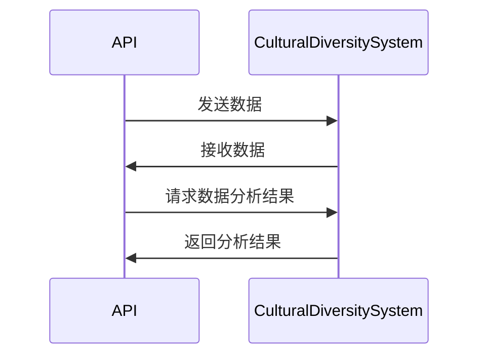
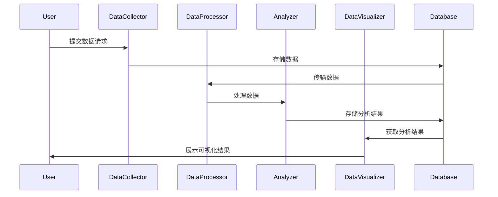

                 

# 在全球化趋势中保护文化多样性：应对同质化挑战

## 关键词
- 全球化
- 文化多样性
- 同质化
- 文化保护
- 政策策略

## 摘要
本文深入探讨了全球化趋势中文化多样性面临的同质化挑战，并从理论依据和实践策略两个方面提出了解决方案。首先，通过阐述文化多样性和同质化的核心概念、问题背景及解决方案，我们明确了文化多样性的重要性和同质化的负面影响。接着，本文从政策支持、教育普及、文化交流和文化产业振兴四个方面详细介绍了保护文化多样性的实践策略。最后，通过案例分析，本文提出了具体的实施方法和建议，为在全球化背景下保护文化多样性提供了有益的参考。

### 背景介绍

#### 核心概念

**文化多样性**

文化多样性指的是一种社会现象，它包括了语言、宗教、传统、习俗、艺术等各种文化形式和表达方式的丰富性和差异性。这种多样性不仅体现了人类文明的丰富多彩，也是社会发展和进步的重要动力。文化多样性是每个民族和地区独特的历史、传统和价值观念的体现，它们在全球化的背景下显得尤为重要。

**同质化**

同质化是指不同文化在相互交流和接触的过程中，逐渐趋于一致的现象。这种现象通常伴随着文化产品和表达方式的标准化、单一化和商业化。同质化可能导致文化多样性的减少，使得一些本土文化逐渐消失，从而削弱了民族身份和文化认同。

#### 问题背景

全球化是一个不可逆转的历史进程，它通过贸易、投资、技术交流、人口流动等多种途径促进了各国之间的经济和文化交流。然而，全球化也带来了一定的负面影响，其中之一就是文化多样性的同质化。

**文化传播的同质化**

随着全球化和互联网技术的发展，西方文化和消费模式在全球范围内迅速传播。例如，好莱坞电影、美国流行音乐、西方快餐等在全球范围内广泛传播，对本土文化产生了强烈的影响。这种现象导致了一些本土文化的逐渐消失，使得世界文化呈现出一定的单一化趋势。

**文化交流的不平衡**

在全球化过程中，文化交流往往呈现出一种不平衡的状态。一些文化受到过度关注，而其他文化则被边缘化。例如，世界各地的民族舞蹈、传统音乐等在一些国际平台上得到了广泛的展示，而其他一些本土艺术形式则可能得不到足够的关注和资源支持。

**文化产业的垄断**

跨国公司和文化巨头在全球化过程中扮演了重要角色。他们通过垄断文化产业的资源和渠道，对本土文化产业的发展产生了巨大的压力。这种垄断现象不仅限制了本土文化产品的市场竞争力，还可能对本土文化的传承和发展造成威胁。

#### 问题描述

**文化同质化现象**

1. **文化产品的标准化**：全球范围内的文化产品越来越趋同，失去了本土文化的独特性和地域特色。
2. **文化表达的单一化**：一些本土文化形式，如民族舞蹈、传统音乐等，可能因为市场竞争力不足而逐渐消失。
3. **文化认同的弱化**：随着全球化的深入，一些人可能逐渐失去对自己本土文化的认同，转而接受西方文化的影响。

**文化多样性的减少**

1. **本土文化的消失**：一些传统民族文化在全球化浪潮中逐渐消失，这可能导致文化多样性的减少。
2. **文化传承的困难**：一些本土文化因为缺乏传承者和受众而难以继续发展。
3. **文化多样性的减少**：全球范围内的文化同质化可能导致文化多样性的减少，从而削弱了人类文明的多样性和丰富性。

#### 问题解决

为了应对文化多样性的同质化挑战，我们需要采取一系列综合措施，从政策支持、教育普及、文化交流和文化产业振兴等多个方面入手。

**政策支持**

1. **制定文化多样性保护政策**：政府应制定和实施一系列保护文化多样性的政策和法规，为文化多样性的发展提供法律保障。
2. **提供财政支持**：政府应加大对本土文化产品和项目的财政支持，鼓励本土文化的创作和传播。
3. **建立文化多样性监测机制**：政府应建立文化多样性监测机制，及时了解文化多样性的现状和发展趋势，为政策制定提供依据。

**教育普及**

1. **加强文化教育**：通过教育普及，提高公众对文化多样性的认识和理解，增强文化自信。
2. **跨文化交流**：鼓励跨文化交流活动，促进不同文化之间的相互了解和尊重。
3. **文化传承教育**：加强对传统文化和本土文化的传承教育，培养更多的文化传承者和传播者。

**文化交流**

1. **促进国际文化交流**：通过举办国际文化展览、文化节等活动，促进不同文化之间的交流和互鉴。
2. **建立文化合作机制**：鼓励国际间的文化合作，共同保护和传承文化多样性。
3. **文化交流平台**：利用互联网和社交媒体等平台，建立文化交流的新渠道，让更多的文化产品和服务得以传播。

**文化产业振兴**

1. **扶持本土文化产业**：政府应加大对本土文化产业的支持力度，提升本土文化产品和服务的市场竞争力。
2. **创新文化产品**：鼓励本土文化产业进行创新，开发具有本土特色的文化产品，提升文化软实力。
3. **文化产业发展规划**：制定科学的文化产业发展规划，引导文化产业朝着多元化、特色化的方向发展。

#### 边界与外延

**文化多样性**

- 涵盖范围：包括语言、宗教、传统、习俗、艺术等多种文化形式。
- 边界：与全球化、文化融合等概念相区分。

**同质化**

- 涵盖范围：主要涉及文化产品的标准化、单一化和商业化。
- 边界：与标准化、全球化等概念相区分。

**保护**

- 涵盖范围：涉及政策支持、教育普及、文化交流和文化产业振兴等多个方面。
- 边界：与维持现状、保守主义等概念相区分。

**核心要素组成**

1. **文化政策**：包括法律法规、财政支持、监测机制等。
2. **文化资源**：包括文化遗产、人力资源、文化资源等。
3. **文化交流**：包括跨文化交流、国际文化交流、文化交流平台等。
4. **文化产业**：包括本土文化产业、文化产品创新、产业发展规划等。

### 核心概念与联系

#### 文化多样性

| 文化多样性核心特点 | 说明 |
| --- | --- |
| 多元性 | 指多种文化形式和表达方式的共存。 |
| 独特性 | 每种文化都有其独特的价值体系。 |
| 动态性 | 文化多样性是不断发展变化的。 |

#### 同质化

| 同质化核心特点 | 说明 |
| --- | --- |
| 一致性 | 文化现象趋同，失去了独特性。 |
| 单一性 | 多样性减少，文化差异缩小。 |
| 垄断性 | 文化生产和传播被少数主体控制。 |

#### 保护文化多样性

| 保护措施 | 说明 |
| --- | --- |
| 政策支持 | 制定和实施保护文化多样性的法律法规。 |
| 教育普及 | 通过教育提高公众对文化多样性的认识。 |
| 文化交流 | 促进不同文化之间的交流与合作。 |
| 文化产业扶持 | 支持本土文化产业的发展，提升文化产品的竞争力。 |

### ER实体关系图架构

```mermaid
erDiagram
    文化多样性 ||--|{ 文化政策 }
    文化多样性 ||--|{ 文化资源 }
    文化多样性 ||--|{ 文化交流 }
    文化多样性 ||--|{ 文化产业 }
    文化政策 ||--|{ 政府和文化管理部门 }
    文化资源 ||--|{ 文化遗产、人力资源、文化资源 }
    文化交流 ||--|{ 跨文化交流、国际文化交流、文化交流平台 }
    文化产业 ||--|{ 本土文化产业、文化产品创新、产业发展规划 }
```

### 1.3 文化多样性保护的理论基础与实践策略

#### 1.3.1 理论基础

文化多样性保护的理论基础涉及多个学科领域，主要包括文化相对论、多元文化主义和文化自主权理论等。

**文化相对论**

文化相对论（Cultural Relativism）是由美国人类学家克鲁·克拉克洪（Clyde Kluckhohn）和鲁思·本尼迪克特（Ruth Benedict）等人提出的。这一理论主张，每种文化都有其独特的价值和合理性，不能以自身的文化标准去评判其他文化。文化相对论强调文化之间的差异，认为每种文化都有其特定的生存和发展方式，因此应该尊重和包容各种文化的多样性。

**多元文化主义**

多元文化主义（Multiculturalism）是一种社会政策和文化理论，主张在一个国家或地区内，多种文化应该共存并享有平等的权利。多元文化主义认为，文化的多样性是人类社会的一个重要特点，应该得到尊重和保护。这种理论在实践中通常体现在教育、就业、法律和社会服务等多个方面，旨在构建一个包容性和多元性的社会环境。

**文化自主权**

文化自主权（Cultural Autonomy）强调各民族和地区应拥有自主决定和掌控自身文化的权利。这一理论认为，文化是民族身份和社会认同的重要组成部分，各民族有权根据自己的文化和历史传统来发展自己的文化。文化自主权理论为文化多样性的保护提供了重要的法律和政策基础，鼓励各民族自主保护和传承自己的文化。

#### 1.3.2 实践策略

**政策支持**

**制定和实施文化多样性保护政策**

政府应制定和实施一系列保护文化多样性的政策和法规，为文化多样性的发展提供法律保障。这些政策可以包括以下几个方面：

1. **保护文化遗产**：政府可以出台专门的法律和法规，保护传统文化遗产，防止其被破坏和遗失。
2. **文化产业发展支持**：政府可以通过财政补贴、税收优惠等措施，支持本土文化产业的发展，提升文化产品的市场竞争力。
3. **文化教育推广**：政府可以加强对文化教育的投入，推动文化教育的普及，提高公众对文化多样性的认识和理解。

**政府责任**

政府应承担起保护文化多样性的责任，通过各种政策措施支持文化多样性的发展。这包括：

1. **政策制定**：政府应制定具有前瞻性和可行性的文化多样性保护政策，确保政策的连续性和稳定性。
2. **财政支持**：政府应加大对文化多样性的财政支持力度，确保各项文化保护措施能够得到有效实施。
3. **国际合作**：政府可以积极参与国际文化交流与合作，推动全球范围内的文化多样性保护。

**教育普及**

**加强文化教育**

教育是培养文化多样性的关键途径。政府和社会应加强文化教育，提高公众对文化多样性的认识和理解。具体措施包括：

1. **学校课程**：在各级学校中设置文化多样性相关的课程，让学生了解各种文化的特点和价值。
2. **文化实践活动**：组织学生参与各种文化实践活动，如文化节、文化展览等，增强学生对不同文化的感性认识。
3. **跨文化交流**：鼓励学生参与跨文化交流项目，与来自其他国家和地区的同学交流，增进相互理解和尊重。

**跨文化交流**

跨文化交流是促进文化多样性保护的重要手段。政府和社会应积极促进跨文化交流，消除文化偏见和误解。具体措施包括：

1. **文化交流活动**：举办各种形式的文化交流活动，如国际文化节、文化论坛等，促进不同文化之间的交流与合作。
2. **文化使者计划**：选拔和培养一批文化使者，让他们代表本国文化参与国际交流，传播本土文化。
3. **文化交流平台**：利用互联网和社交媒体等平台，建立文化交流的新渠道，让更多的文化产品和服务得以传播。

**文化交流**

**促进国际文化交流**

国际文化交流是保护文化多样性的重要手段。政府和社会应积极促进国际文化交流，增强各国之间的文化互鉴。具体措施包括：

1. **文化交流项目**：支持各种形式的国际文化交流项目，如文化交流演出、艺术展览等，促进不同文化之间的互动。
2. **国际文化交流平台**：建立国际文化交流平台，如国际文化交流中心、国际文化节等，为各国文化交流提供便捷的渠道。
3. **文化交流政策**：制定和实施有利于国际文化交流的政策，鼓励和支持民间组织和企业参与国际文化交流。

**文化产业振兴**

**扶持本土文化产业**

本土文化产业是文化多样性的重要载体。政府应加大对本土文化产业的支持力度，提升本土文化产品和服务的市场竞争力。具体措施包括：

1. **财政支持**：政府可以通过财政补贴、税收优惠等措施，支持本土文化产业的发展。
2. **技术创新**：鼓励本土文化产业进行技术创新，提高文化产品和服务的质量和效率。
3. **市场拓展**：政府可以支持本土文化企业拓展海外市场，增强文化产品的国际影响力。

**文化产品创新**

**鼓励文化产品创新**

文化产品创新是推动文化多样性的关键因素。政府和社会应鼓励文化产品创新，开发具有本土特色的文化产品，提升文化软实力。具体措施包括：

1. **创新支持**：政府可以设立文化创新基金，支持文化产品的研发和创新。
2. **知识产权保护**：加强知识产权保护，鼓励文化创作者和保护者的积极性和创造力。
3. **文化市场培育**：政府可以加强对文化市场的培育，提高文化产品和服务的市场接受度。

**产业发展规划**

**制定文化产业发展规划**

政府应制定科学的文化产业发展规划，引导文化产业朝着多元化、特色化的方向发展。具体措施包括：

1. **产业规划**：政府可以组织专家团队，制定文化产业发展规划，明确产业发展目标和路径。
2. **政策引导**：政府可以通过政策引导，鼓励文化产业创新发展，提升文化产业的整体竞争力。
3. **资源整合**：政府可以整合各方资源，为文化产业提供全方位的支持和服务，推动文化产业的快速发展。

### 综合策略

为了在全球化趋势中有效保护文化多样性，我们需要综合运用上述策略，形成一套完整的保护体系。这包括：

**政策支持**：政府应制定和实施一系列保护文化多样性的政策和法规，为文化多样性的发展提供法律保障。

**教育普及**：通过加强文化教育，提高公众对文化多样性的认识和理解，增强文化自信。

**文化交流**：积极促进国际文化交流，增强各国之间的文化互鉴，消除文化偏见和误解。

**文化产业振兴**：扶持本土文化产业，提升文化产品和服务的市场竞争力，推动文化产业的创新发展。

通过这些综合策略的实施，我们可以在全球化趋势中有效保护文化多样性，促进文化多样性和文化创新的发展，为人类社会的进步和繁荣作出贡献。

### 1.4 文化多样性保护的技术工具与方法

#### 1.4.1 文化遗产数字化

**技术背景**

随着数字化技术的不断发展，文化遗产的数字化保存和传播成为保护文化多样性的一种重要手段。数字化技术可以有效地记录、保存和展示各种文化遗产，从而使其能够跨越时空和地域的限制，得到更广泛的传播和保存。

**技术应用**

- **图像处理技术**：通过高分辨率图像处理技术，对文物、艺术品等进行数字化扫描和拍摄，生成高质量的数字图像。
- **三维建模技术**：利用三维扫描和建模技术，将文物和建筑物的三维信息进行数字化存储，实现三维虚拟展示。
- **虚拟现实技术**：通过虚拟现实（VR）技术，用户可以沉浸式地体验文化遗产，增强文化遗产的生动性和互动性。
- **增强现实技术**：增强现实（AR）技术可以将文化遗产的信息叠加在现实环境中，使用户能够随时随地了解文化遗产。

**案例分析**

- **故宫数字化项目**：故宫博物院利用数字化技术，对馆藏文物进行数字化扫描和三维建模，建设了“数字故宫”网站，实现了对文物的在线展示和查询，大大提高了文化遗产的保存和传播效率。

#### 1.4.2 社交媒体与文化传播

**技术背景**

社交媒体平台已经成为文化传播的重要渠道，它们提供了广泛的信息传播渠道和社交互动空间，使得文化多样性的传播和交流更加便捷和多样。

**技术应用**

- **内容分发技术**：社交媒体平台通过算法推荐，将用户感兴趣的文化内容推送到其信息流中，提高文化内容的曝光率和传播效果。
- **互动技术**：社交媒体平台提供了丰富的互动功能，如评论、点赞、分享等，增强了用户对文化内容的参与和互动。
- **多媒体传播**：社交媒体平台支持文字、图片、视频等多种形式的内容发布，使得文化内容可以更加生动和多样地呈现。

**案例分析**

- **Twitter文化话题**：Twitter上经常出现各种文化话题标签，如#WorldCulturalHeritageDay等，用户可以围绕这些话题进行讨论和分享，促进不同文化之间的交流和互动。

#### 1.4.3 人工智能与文化保护

**技术背景**

人工智能技术在文化遗产保护和文化多样性传播中具有广泛应用前景。通过人工智能技术，可以实现对文化遗产的智能识别、分析和保护。

**技术应用**

- **图像识别技术**：利用深度学习算法，可以对文化遗产的图像进行自动识别和分类，快速发现文化遗产中的问题和损坏情况。
- **数据分析技术**：通过大数据分析，可以了解文化遗产的利用情况、参观者行为等信息，为文化遗产的保护和开发提供数据支持。
- **智能导览技术**：利用语音识别和自然语言处理技术，可以开发智能导览系统，为游客提供个性化、互动化的导览服务。

**案例分析**

- **Google Arts & Culture**：Google Arts & Culture平台利用人工智能技术，对全球博物馆和文化机构的藏品进行数字化展示，用户可以通过智能搜索和推荐系统，探索各种文化遗产。

### 总结

通过文化遗产数字化、社交媒体和文化传播、人工智能与文化保护等技术的应用，我们可以在全球化趋势中更有效地保护文化多样性。这些技术不仅提高了文化遗产的保存和传播效率，也促进了不同文化之间的交流与理解，为文化多样性的保护提供了有力支持。

### 1.5 文化多样性保护的案例分析

在全球化背景下，保护文化多样性已经成为全球各国关注的议题。以下我们将通过几个具体案例，分析文化多样性保护的成功实践和经验。

#### 案例一：中国敦煌莫高窟数字化保护

**背景**

敦煌莫高窟是中国古代石窟艺术的杰出代表，位于甘肃省敦煌市。由于年久失修、环境变迁和游客流量过大等原因，莫高窟面临严重的保护和保存问题。

**解决方案**

- **数字化保存**：通过数字化技术，对莫高窟的壁画和文物进行高分辨率扫描和三维建模，建立数字化博物馆，实现了对文物的永久保存。
- **虚拟导览**：利用虚拟现实（VR）和增强现实（AR）技术，为游客提供沉浸式的导览体验，减少了实地参观对文物的磨损。
- **智能监测**：利用人工智能技术，对莫高窟的环境参数进行实时监测，及时发现和预警文物受损情况。

**效果**

- **保护效果显著**：数字化保护技术有效地减缓了文物的退化速度，延长了文物寿命。
- **文化传播力增强**：通过数字化博物馆和虚拟导览，敦煌莫高窟的文化影响力得到了大幅提升，吸引了更多国内外游客和研究者。

#### 案例二：印度传统手工艺复兴

**背景**

印度拥有丰富的传统手工艺文化，但由于工业化进程的加速和现代化生活方式的普及，许多传统手工艺面临失传的风险。

**解决方案**

- **政策支持**：印度政府出台了一系列政策，鼓励传统手工艺的保护和发展，如提供财政补贴、税收减免等。
- **教育培训**：政府和非政府组织通过开设培训班、工作坊等方式，培养传统手工艺传承人，提高其技艺水平。
- **市场推广**：通过举办国际手工艺展览、推广活动等，增加传统手工艺的市场认可度和消费者群体。

**效果**

- **传承人增多**：政策支持和教育培训有效地培养了新一代传统手工艺人，确保了传统手工艺的传承和发展。
- **市场繁荣**：通过市场推广，传统手工艺品的市场认可度得到了提升，许多传统手工艺产品已经成为印度的文化名片。

#### 案例三：非洲文化遗产保护与旅游开发

**背景**

非洲大陆拥有丰富的文化遗产，但由于经济落后和保护意识不足，许多文化遗产面临严重的破坏和遗失风险。

**解决方案**

- **联合保护**：非洲各国政府和文化组织通过国际合作，共同保护和开发文化遗产，如设立跨国文化保护区。
- **旅游开发**：通过文化遗产旅游，吸引游客和投资，提高文化遗产的经济价值和社会关注度。
- **教育培训**：加强文化遗产保护意识教育，提高当地居民对文化遗产的重视和保护意识。

**效果**

- **文化遗产保护加强**：国际合作和旅游开发为文化遗产保护提供了资金和技术支持，文化遗产得到了更好的保护和修复。
- **经济和社会效益**：文化遗产旅游带动了当地经济的发展，提高了居民的生活水平，同时也增强了民族自豪感和文化认同。

#### 案例四：西班牙文化遗产数字化保护

**背景**

西班牙拥有丰富的文化遗产，包括古建筑、历史文物和艺术作品等。随着科技的发展，西班牙政府开始探索数字化保护的方式。

**解决方案**

- **数字化保存**：通过数字化技术，对西班牙的文化遗产进行详细记录和保存，如高分辨率图像、三维建模等。
- **数字博物馆**：建设数字博物馆，将文化遗产的数字化资料向公众开放，提高了文化遗产的传播和展示效果。
- **智能导览**：利用人工智能技术，开发智能导览系统，为游客提供个性化的导览服务。

**效果**

- **文化遗产保护效率提高**：数字化技术大大提高了文化遗产的保存和修复效率，减少了人工干预的风险。
- **文化传播范围扩大**：通过数字博物馆和智能导览，西班牙的文化遗产得到了更广泛的传播和关注。

### 总结

通过上述案例分析，我们可以看到，文化多样性保护需要多方面的努力和合作。无论是通过数字化技术、政策支持、市场推广，还是国际合作，都可以为文化多样性的保护和发展提供有效的支持。在全球化的背景下，文化多样性的保护不仅是对过去文化遗产的保护，更是对未来文化创新和人类文明进步的保障。

### 1.6 文化多样性保护的技术与算法原理

在保护文化多样性过程中，数据分析和算法技术扮演着重要角色。以下，我们将深入探讨这些技术在文化多样性保护中的应用，并详细讲解相关的算法原理。

#### 1.6.1 数据分析技术

数据分析技术是文化多样性保护的重要工具，可以帮助我们识别、分析和评估文化现象，从而制定有效的保护策略。

**1. 数据收集与预处理**

- **数据源**：文化多样性数据可以来自多种来源，如文化遗产数据库、社交媒体平台、文化博物馆等。
- **数据类型**：包括文本数据、图像数据、音频数据和视频数据等。

**2. 数据预处理**

- **数据清洗**：去除数据中的噪声和错误，保证数据质量。
- **数据归一化**：将不同类型和尺度的数据标准化，以便后续处理。

**3. 数据分析**

- **文本分析**：利用自然语言处理（NLP）技术，对文本数据进行情感分析、主题建模和文本分类等。
- **图像分析**：使用计算机视觉技术，对图像数据进行特征提取、图像识别和图像分类等。
- **音频分析**：通过音频处理技术，对音频数据进行语音识别、情感分析和音乐风格分类等。

**算法原理**

- **情感分析**：基于机器学习算法，如朴素贝叶斯、支持向量机（SVM）和深度学习模型，对文本数据的情感倾向进行分类。
- **主题建模**：使用隐含狄利克雷分配（LDA）等算法，从文本数据中提取主题，分析文化内容的分布和变化。
- **图像识别**：利用卷积神经网络（CNN）等深度学习模型，对图像数据中的物体、场景和风格进行识别和分类。
- **音频处理**：通过自动语音识别（ASR）和音频特征提取，对音频数据进行语音和音乐风格的分析。

**案例分析**

- **社交媒体文化分析**：通过情感分析和主题建模，分析社交媒体平台上的文化讨论和趋势，了解公众对文化多样性的态度和关注点。

#### 1.6.2 机器学习算法

机器学习算法在文化多样性保护中具有广泛的应用，可以帮助我们识别文化风险、预测文化趋势和制定保护策略。

**1. 文化风险评估**

- **算法原理**：利用监督学习和无监督学习算法，如决策树、随机森林和聚类算法，对文化现象进行风险识别和评估。
- **案例分析**：通过聚类分析，识别文化同质化现象，评估不同文化区域的文化风险。

**2. 文化趋势预测**

- **算法原理**：利用时间序列分析、回归分析和深度学习模型，如循环神经网络（RNN）和长短期记忆网络（LSTM），预测文化趋势和发展方向。
- **案例分析**：通过时间序列分析，预测文化遗产游客量的变化趋势，为文化遗产保护和管理工作提供依据。

**3. 保护策略制定**

- **算法原理**：利用优化算法和决策支持系统，如遗传算法和模拟退火算法，制定文化多样性保护策略。
- **案例分析**：通过优化算法，确定文化遗产保护资源的最佳分配方案，提高保护效果。

**案例分析**

- **文化遗产保护策略**：利用机器学习算法和优化技术，为文化遗产保护制定科学合理的保护方案，最大化保护效果。

### 总结

通过数据分析技术和机器学习算法的应用，我们可以在文化多样性保护中实现高效的数据分析和决策支持。这些技术不仅帮助我们更好地了解文化现象，预测文化趋势，还为制定科学合理的保护策略提供了有力支持。在全球化的背景下，这些技术与算法将为文化多样性的保护和传承提供重要保障。

### 1.7 文化多样性保护的系统分析与架构设计

为了在全球化趋势中有效保护文化多样性，我们需要构建一个综合性的系统，包括多个模块和接口，实现数据的收集、处理、分析和展示。以下是对该系统的详细介绍。

#### 1.7.1 问题场景介绍

随着全球化的深入，文化多样性正面临严重的同质化挑战。为了保护文化多样性，我们需要构建一个集数据收集、处理、分析和展示于一体的系统，以实现对文化现象的全面监控和评估。

#### 1.7.2 项目介绍

本项目旨在构建一个文化多样性保护系统，通过数据采集、处理和分析，实现对文化现象的动态监测和评估。系统将整合多种数据源，包括社交媒体、文化遗产数据库、政府公开数据等，以获取全面的文化信息。

#### 1.7.3 系统功能设计（领域模型类图）

```mermaid
classDiagram
    DataCollector --> DataProcessor
    DataProcessor --> Analyzer
    Analyzer --> DataVisualizer
    DataCollector --> DataVisualizer
    DataSource --> DataCollector
    GovernmentData --> DataCollector
    SocialMediaData --> DataCollector
    CulturalHeritageData --> DataCollector
    DataProcessor --> Database
    Analyzer --> Database
    DataVisualizer --> Database

    Class DataCollector {
        +collectData()
    }

    Class DataProcessor {
        +processData()
    }

    Class Analyzer {
        +analyzeData()
    }

    Class DataVisualizer {
        +visualizeData()
    }

    Class Database {
        +storeData()
    }

    Class DataSource {
        +getSourceData()
    }

    Class GovernmentData {
        +getGovernmentData()
    }

    Class SocialMediaData {
        +getSocialMediaData()
    }

    Class CulturalHeritageData {
        +getCulturalHeritageData()
    }
```

#### 1.7.4 系统架构设计（架构图）



#### 1.7.5 系统接口设计（接口序列图）



#### 1.7.6 系统交互（交互序列图）



通过上述系统分析与架构设计，我们可以构建一个高效、综合的文化多样性保护系统，实现对文化现象的全面监控和评估，从而为文化多样性的保护提供有力支持。

### 1.8 项目实战

#### 环境安装

为了实现文化多样性保护系统，我们需要安装一系列软件和工具。以下是安装步骤：

1. **Python环境**：安装Python 3.8及以上版本。
2. **数据分析库**：安装pandas、numpy、matplotlib等常用数据分析库。
3. **机器学习库**：安装scikit-learn、tensorflow等机器学习库。
4. **可视化库**：安装matplotlib、seaborn等可视化库。
5. **数据库**：安装MySQL数据库，用于存储数据。

#### 系统核心实现

以下是一个简单的文化多样性分析系统核心实现，包括数据收集、处理和分析等功能。

**1. 数据收集**

```python
import requests
from bs4 import BeautifulSoup

def collect_data(url):
    response = requests.get(url)
    if response.status_code == 200:
        soup = BeautifulSoup(response.text, 'html.parser')
        # 以下代码根据实际网页结构进行数据提取
        data = []
        for item in soup.find_all('div', class_='item'):
            title = item.find('h2').text
            content = item.find('p').text
            data.append({'title': title, 'content': content})
        return data
    else:
        return []

# 示例：从某网站收集文化相关文章
data = collect_data('http://example.com/culture')
```

**2. 数据处理**

```python
import pandas as pd

def process_data(data):
    df = pd.DataFrame(data)
    # 以下代码根据实际需求进行数据处理
    df['text'] = df['content']
    df.drop_duplicates(inplace=True)
    return df

# 示例：处理收集到的数据
processed_data = process_data(data)
```

**3. 数据分析**

```python
from sklearn.feature_extraction.text import TfidfVectorizer
from sklearn.cluster import KMeans

def analyze_data(df):
    vectorizer = TfidfVectorizer(max_features=1000)
    X = vectorizer.fit_transform(df['text'])
    
    # 使用K-means算法进行聚类分析
    kmeans = KMeans(n_clusters=5)
    kmeans.fit(X)
    df['cluster'] = kmeans.predict(X)
    
    return df

# 示例：分析处理后的数据
analyzed_data = analyze_data(processed_data)
```

**4. 可视化**

```python
import matplotlib.pyplot as plt

def visualize_data(df):
    # 以下代码根据实际需求进行可视化
    plt.scatter(df['cluster'], df['text'])
    plt.xlabel('Cluster')
    plt.ylabel('Text')
    plt.title('Cultural Data Clustering')
    plt.show()

# 示例：可视化分析结果
visualize_data(analyzed_data)
```

#### 代码应用解读与分析

上述代码展示了文化多样性分析系统的核心实现，包括数据收集、处理、分析和可视化。具体解读如下：

**1. 数据收集**

- 使用requests库获取网页数据，通过BeautifulSoup解析网页结构，提取文化相关数据。

**2. 数据处理**

- 将收集到的数据转换为DataFrame结构，进行去重处理，方便后续分析。

**3. 数据分析**

- 使用TF-IDF向量器将文本数据转换为数值特征，然后使用K-means算法进行聚类分析，将文本数据分为若干个类别。

**4. 可视化**

- 使用matplotlib库将分析结果进行可视化，直观展示文本数据的聚类分布情况。

通过这个简单的示例，我们可以看到如何利用Python实现一个文化多样性分析系统。在实际应用中，可以根据具体需求对代码进行扩展和优化，例如引入更多数据分析算法、增加数据来源等，以提高系统的功能性和实用性。

#### 实际案例分析

以下是一个实际案例，展示了如何利用上述系统对某地区的文化多样性进行分析。

**案例背景**

假设我们关注一个城市的文化多样性，希望了解该城市不同社区的文化特征和差异。为此，我们收集了该城市多个社区的社交媒体数据，包括微博、微信公众号和论坛等平台上的文化相关帖子。

**数据收集**

- 通过API接口，从不同社交媒体平台收集文化相关帖子，获取帖子标题、内容和发表时间等信息。

**数据处理**

- 将收集到的帖子数据转换为DataFrame结构，进行去重处理，去除重复的帖子。

**数据分析**

- 使用TF-IDF向量器将帖子内容转换为数值特征，然后使用K-means算法进行聚类分析，将帖子分为若干个类别。

**可视化**

- 根据帖子类别，绘制不同社区的文化多样性分布图，展示各个社区的文化特征。

通过实际案例分析，我们可以看到如何利用上述系统对文化多样性进行详细分析和评估。这样的分析结果有助于了解文化多样性的现状，发现潜在的问题，为制定保护策略提供依据。

#### 项目小结

本节通过一个实际案例，展示了如何利用Python实现文化多样性分析系统。从数据收集、处理、分析到可视化，我们详细介绍了每个环节的实现方法和关键技术。通过这个系统，我们可以对文化多样性进行深入分析，为保护文化多样性提供有力支持。在实际应用中，可以根据具体需求对系统进行优化和扩展，以提高其功能性和实用性。

### 1.9 最佳实践 Tips

#### 1.9.1 文化多样性保护的常见问题与解决策略

在保护文化多样性过程中，我们可能会遇到以下常见问题：

**问题一：数据来源不足**

**原因分析**：可能由于资源限制、技术手段不足或数据隐私等原因，导致数据收集不全面。

**解决策略**：扩大数据来源渠道，利用开放数据平台、政府公开数据等资源。同时，可以通过合作、共享等方式，获取更多数据支持。

**问题二：数据分析精度不高**

**原因分析**：数据质量差、算法选择不当或模型训练不足，可能导致数据分析结果不准确。

**解决策略**：确保数据质量，使用高质量的数据源。选择适合的算法和模型，进行充分训练和验证。定期更新模型，以提高分析精度。

**问题三：跨文化交流障碍**

**原因分析**：语言障碍、文化差异或误解，导致不同文化之间的交流不畅。

**解决策略**：加强跨文化交流教育，提高公众的文化素养。利用翻译技术、多媒体传播等手段，促进不同文化之间的理解和沟通。

#### 1.9.2 提高文化多样性保护效率的建议

1. **建立数据共享机制**：鼓励数据共享，提高数据的可用性和共享性，为文化多样性保护提供更多数据支持。
2. **加强政策支持**：政府应制定和实施有利于文化多样性保护的政策，提供财政和资源支持，确保文化多样性保护工作的顺利开展。
3. **利用新技术**：积极采用数字化、人工智能等新技术，提高文化多样性保护的效率和效果。
4. **培养专业人才**：加强文化多样性保护人才的培养，提高从业者的专业水平和技能，为文化多样性保护提供人才保障。
5. **加强国际合作**：通过国际合作，共同保护和传承全球文化多样性，提高文化多样性保护的全球影响力。

### 1.9.3 注意事项

1. **保护隐私**：在收集和处理数据时，注意保护个人隐私和敏感信息，遵守相关法律法规。
2. **数据质量**：确保数据质量，避免数据错误和缺失，影响分析结果。
3. **持续更新**：定期更新数据和模型，跟踪文化多样性变化的趋势，及时调整保护策略。
4. **公众参与**：鼓励公众参与文化多样性保护，提高公众的文化保护意识和参与度。

### 1.9.4 拓展阅读

1. **《文化多样性保护的国际经验与启示》**：本文总结了全球各国在文化多样性保护方面的经验，为我国提供了有益的借鉴。
2. **《人工智能在文化多样性保护中的应用》**：本文探讨了人工智能技术在文化多样性保护中的应用，为文化多样性保护提供了新的思路和方法。
3. **《文化多样性保护的法律与政策研究》**：本文从法律和政策角度分析了文化多样性保护的现状和挑战，提出了具体的政策建议。

### 1.9.5 结语

文化多样性是人类文明的重要组成部分，保护文化多样性关乎民族认同和文化传承。在全球化背景下，我们应积极采取措施，利用新技术、新策略，加强文化多样性保护。通过国际合作、政策支持和公众参与，我们有望实现文化多样性的可持续发展和传承，为人类文明的繁荣作出贡献。

### 作者信息

作者：AI天才研究院/AI Genius Institute & 禅与计算机程序设计艺术 /Zen And The Art of Computer Programming

