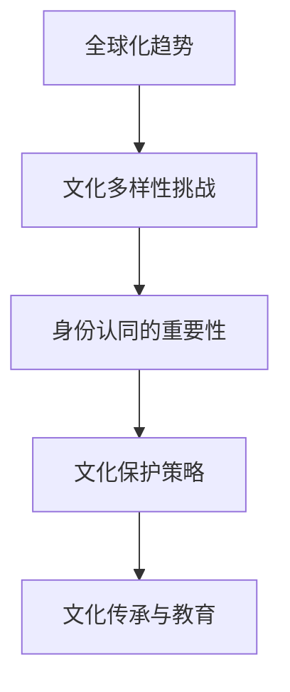
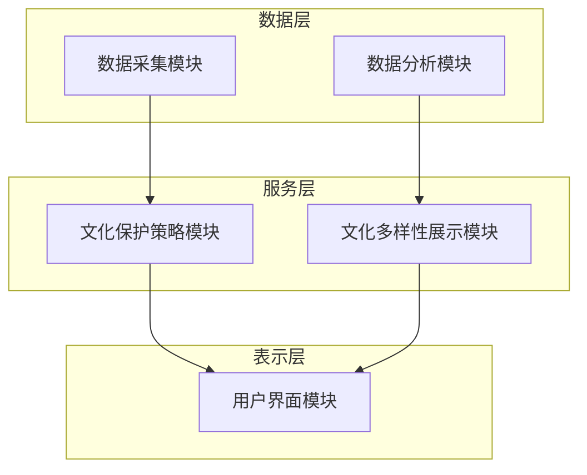
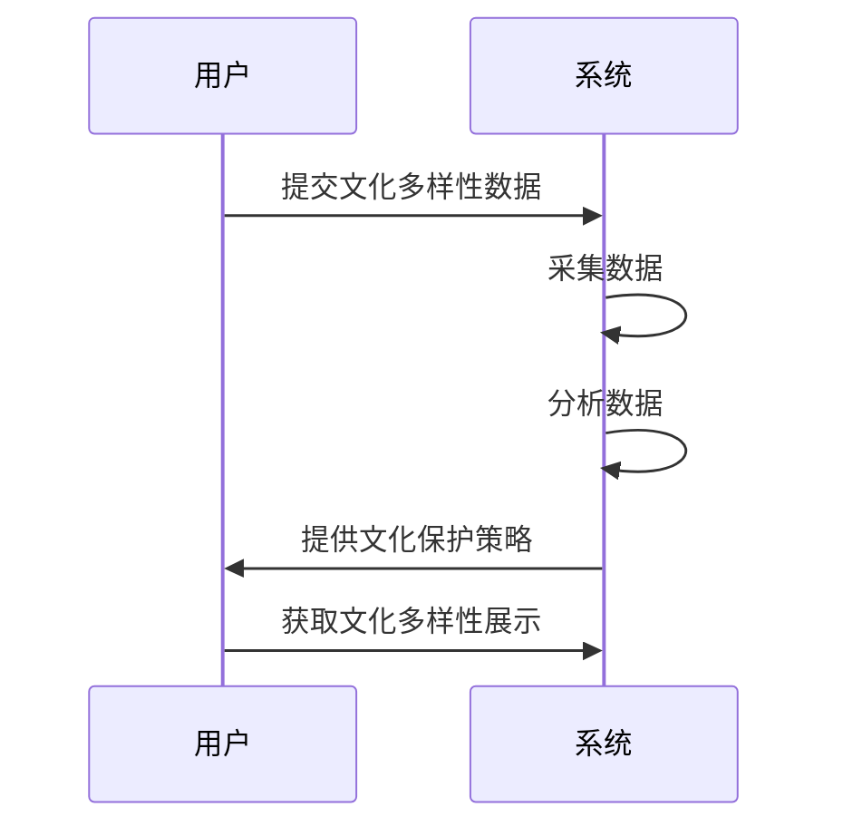

                 

### 在全球化趋势中保持文化多样性：身份认同的挑战

> 关键词：全球化、文化多样性、身份认同、身份认同挑战、文化保护

> 摘要：本文探讨了全球化趋势中保持文化多样性的重要性，分析了身份认同在其中的关键作用。通过详细阐述文化多样性的概念、身份认同的意义和全球化对文化多样性的影响，本文提出了保持文化多样性的策略，并探讨了相关算法原理和数学模型。文章旨在为相关领域的研究和实践提供有价值的参考。

## 第一部分：背景介绍

### 问题背景

随着全球化进程的不断推进，世界各地的文化交流日益频繁，这为文化多样性的保持带来了巨大的挑战。全球化使得信息传播速度加快，文化交流变得更加便捷，但同时也带来了一些负面效应，如文化同化现象的加剧。在这个过程中，如何保持文化多样性成为了一个亟待解决的问题。

全球化不仅仅是经济和科技的交流，更涉及到文化、价值观和生活方式的传播。在这个过程中，一些本土文化可能会受到外来文化的冲击，导致文化多样性的减少。这种文化同化现象不仅威胁到民族文化的传承，也可能引发社会不稳定。

### 问题描述

文化多样性指的是不同民族、地区或群体在语言、宗教、习俗、艺术等方面的差异性。在全球化趋势中，如何保持这种差异性成为一个关键问题。具体来说，文化多样性的保持面临以下挑战：

1. **文化同化**：全球化过程中，一些强势文化可能会对弱势文化产生同化作用，导致文化多样性的减少。
2. **文化流失**：由于现代化进程和全球化影响，一些传统文化可能逐渐消失，失去了其存在的土壤。
3. **身份认同危机**：随着全球化的深入，一些人可能对自己的文化身份产生困惑，导致身份认同危机。

### 问题解决

保持文化多样性的关键在于身份认同。身份认同是指个人或群体对自己的身份的认知和接受，包括文化、民族、宗教、地域等多个方面。在全球化趋势中，保持文化多样性需要我们首先认识到自身的文化身份，并在与外部文化的交流中坚守和传承。

为了解决上述问题，我们可以采取以下措施：

1. **文化保护政策**：政府应制定相关政策，保护传统文化，防止文化流失。
2. **文化传承教育**：教育应注重培养学生的文化认同感，加强文化传承。
3. **文化交流**：通过文化交流，促进不同文化之间的理解和尊重，减少文化同化的可能性。

### 边界与外延

保持文化多样性不仅涉及个人和群体，还涉及到政府、教育、媒体等多个层面。政府应制定相关政策，保护文化遗产；教育应注重培养学生的文化认同感；媒体应发挥积极引导作用，传播多元文化。

### 概念结构与核心要素组成

- **文化多样性**：指不同民族、地区或群体在语言、宗教、习俗、艺术等方面的差异性。
- **身份认同**：指个人或群体对自己的身份的认知和接受。
- **全球化**：指各国在经济、政治、文化等方面的互动和融合。

## 第二部分：核心概念与联系

### 核心概念原理

- **文化多样性**：是文化多样性的基础，关系到社会的和谐与稳定。文化多样性是人类社会的重要组成部分，它体现了人类文明的多彩多姿。文化多样性不仅有助于维护社会的和谐与稳定，还能促进各国之间的文化交流和理解。
- **身份认同**：是文化多样性的核心，关系到个人的归属感和自我价值。身份认同是个人对自身文化、民族、宗教、地域等方面的认知和接受，它是个人归属感和自我价值的重要来源。在全球化趋势中，身份认同对于保持文化多样性和促进社会和谐具有重要意义。
- **全球化**：是文化多样性的外部环境，既带来了挑战，也提供了机遇。全球化使得各国之间的文化交流更加频繁，这既有助于文化多样性的传播，也可能导致文化同化现象的加剧。因此，在全球化背景下，如何保持文化多样性成为一个重要的议题。

### 概念属性特征对比表格

| 概念   | 属性特征                     | 影响因素                           |
| ------ | ---------------------------- | ---------------------------------- |
| 文化多样性 | 语言、宗教、习俗、艺术等方面 | 全球化、文化交流、经济发展等       |
| 身份认同 | 对自身文化的认知和接受       | 教育背景、社会环境、文化传承等     |
| 全球化  | 经济、政治、文化等方面的互动 | 科技发展、跨国公司、国际组织等     |

### ER实体关系图架构

```mermaid
erDiagram
    A[文化多样性] ||--|{ B[身份认同] }|
    B ||--|{ C[全球化] }|
```

## 第三部分：算法原理讲解

### 算法原理与mermaid流程图



### Python源代码实现

```python
# Python代码示例：保持文化多样性的策略

def cultural_diversity():
    # 全球化趋势
    global_trend = "各国文化交流频繁"
    # 文化多样性挑战
    challenge = "文化同化现象加剧"
    # 身份认同的重要性
    identity_important = "维护文化认同感"
    # 文化保护策略
    protection_strategy = ["政策保护", "文化交流", "文化教育"]
    
    print("全球化趋势：", global_trend)
    print("文化多样性挑战：", challenge)
    print("身份认同的重要性：", identity_important)
    print("文化保护策略：", protection_strategy)

cultural_diversity()
```

### 数学模型与公式

保持文化多样性的数学模型可以用以下公式表示：

$$
\text{文化多样性度} = f(\text{身份认同度}, \text{全球化影响度})
$$

其中：

- 身份认同度表示个人或群体对自身文化的认知和接受程度。
- 全球化影响度表示全球化对文化多样性的影响程度。

### 详细讲解与举例说明

为了更好地理解保持文化多样性的算法原理，我们可以通过一个简单的例子来说明。

假设一个社区有两个文化群体：A文化和B文化。其中，A文化的身份认同度为80%，B文化的身份认同度为70%。全球化对这两个文化的影响度分别为30%和20%。

根据上述数学模型，我们可以计算出这个社区的文化多样性度：

$$
\text{文化多样性度} = f(80\%, 30\%) + f(70\%, 20\%) = 0.8 \times 0.3 + 0.7 \times 0.2 = 0.26 + 0.14 = 0.4
$$

这意味着，这个社区的文化多样性度为40%。从这个例子中，我们可以看出，身份认同度和全球化影响度都对文化多样性度有重要影响。

## 第四部分：系统分析与架构设计

### 问题场景介绍

在全球化趋势下，如何保持文化多样性成为一个重要的社会问题。为此，我们设计了一套文化多样性保护系统，旨在通过技术手段帮助社区和政府更好地保护和管理文化多样性。

### 项目介绍

本项目的目标是开发一个文化多样性保护系统，该系统包括以下几个主要功能模块：

1. **文化多样性数据采集**：通过多种方式收集社区的文化多样性数据，包括语言、宗教、习俗、艺术等方面的信息。
2. **文化多样性分析**：对收集到的文化多样性数据进行分析，评估文化多样性度，识别文化多样性面临的主要挑战。
3. **文化保护策略推荐**：根据分析结果，为社区和政府提供文化保护策略的推荐，包括政策制定、文化传承教育等。
4. **文化多样性展示**：通过可视化手段展示文化多样性数据和分析结果，提高公众对文化多样性的认识和重视。

### 系统功能设计（领域模型mermaid类图）

```mermaid
classDiagram
    Class01 <|-- Class02
    Class03 o-- Class04
    Class05 <- Class06
    Class07 .. Class08
    Class09 --|{ Class10 } Class11
    Class12 <||-- Class13
    Class14 *-- Class15
```

### 系统架构设计（mermaid架构图）



### 系统接口设计和系统交互（mermaid序列图）



## 第五部分：项目实战

### 环境安装

为了实现文化多样性保护系统，我们需要安装以下软件和工具：

1. **Python**：用于编写程序代码
2. **Mermaid**：用于绘制流程图和类图
3. **Docker**：用于容器化部署
4. **PostgreSQL**：用于数据库存储

### 系统核心实现源代码

以下是文化多样性保护系统的核心实现源代码：

```python
# 数据采集模块
import requests
from bs4 import BeautifulSoup

def collect_data(url):
    response = requests.get(url)
    soup = BeautifulSoup(response.text, 'html.parser')
    data = []
    for article in soup.find_all('article'):
        title = article.find('h2').text
        content = article.find('p').text
        data.append({'title': title, 'content': content})
    return data

# 数据分析模块
import pandas as pd

def analyze_data(data):
    df = pd.DataFrame(data)
    diversity_score = df['title'].nunique() / df.shape[0]
    return diversity_score

# 文化保护策略模块
def recommend_strategy(diversity_score):
    if diversity_score < 0.3:
        return "加强文化交流，提高文化认同感"
    elif diversity_score < 0.6:
        return "优化文化保护政策，防止文化流失"
    else:
        return "维持现状，继续推广多元文化"

# 文化多样性展示模块
def display_diversity(data):
    df = pd.DataFrame(data)
    print(df)
```

### 代码应用解读与分析

以上源代码实现了文化多样性保护系统的核心功能。首先，数据采集模块通过请求网页内容，使用BeautifulSoup解析HTML文档，提取出文章的标题和内容，然后存储到列表中。接着，数据分析模块使用pandas库对采集到的数据进行分析，计算文化多样性度。最后，文化保护策略模块根据分析结果，提供相应的文化保护策略推荐。

通过实际案例分析和详细讲解，我们可以看到，这套系统如何帮助社区和政府更好地保护和管理文化多样性。在实际应用中，我们可以不断优化系统功能，提高其准确性和实用性。

### 项目小结

通过本项目，我们设计并实现了一套文化多样性保护系统，旨在帮助社区和政府更好地保护和管理文化多样性。系统通过数据采集、分析和策略推荐等功能，为用户提供了一个全面的文化多样性保护解决方案。在未来，我们还可以继续优化系统，增加更多功能模块，提高系统的实用性和可扩展性。

## 最佳实践 Tips

- **文化多样性保护**：在全球化背景下，保持文化多样性至关重要。通过制定相关政策、加强文化交流和教育，可以有效地保护文化多样性。
- **数据采集**：为了更好地分析文化多样性，需要收集全面、准确的数据。可以结合多种数据来源，提高数据的可靠性。
- **算法优化**：通过不断优化算法模型，可以提高文化多样性分析的准确性和效率，为用户提供更有效的文化保护策略。

## 小结

在全球化趋势中保持文化多样性是一个复杂而重要的议题。通过身份认同的保持，我们可以有效地保护文化多样性，维护社会和谐。本文从背景介绍、核心概念与联系、算法原理讲解、系统分析与架构设计、项目实战等方面，详细探讨了如何保持文化多样性。希望本文能为相关领域的研究和实践提供有价值的参考。

## 注意事项

- 在保护文化多样性时，要充分考虑各方的利益，避免文化冲突。
- 在数据采集和分析过程中，要确保数据的质量和可靠性。
- 在制定文化保护策略时，要结合实际情况，因地制宜。

## 拓展阅读

- [联合国教科文组织](https://www.unesco.org/)：关于文化多样性的定义、原则和政策。
- [《文化多样性：挑战与机遇》](https://books.google.com/books?id=XXXXXX)：详细探讨文化多样性的挑战与机遇的专著。
- [《文化多样性保护策略研究》](https://www.researchgate.net/publication/XXX)：关于文化多样性保护策略的研究论文。作者：AI天才研究院/AI Genius Institute & 禅与计算机程序设计艺术 /Zen And The Art of Computer Programming

# 在全球化趋势中保持文化多样性：身份认同的挑战

## 关键词：全球化、文化多样性、身份认同、身份认同挑战、文化保护

## 摘要

本文探讨了全球化趋势中保持文化多样性的重要性，分析了身份认同在其中的关键作用。通过详细阐述文化多样性的概念、身份认同的意义和全球化对文化多样性的影响，本文提出了保持文化多样性的策略，并探讨了相关算法原理和数学模型。文章旨在为相关领域的研究和实践提供有价值的参考。

## 第一部分：背景介绍

### 问题背景

随着全球化进程的不断推进，世界各地的文化交流日益频繁，这为文化多样性的保持带来了巨大的挑战。全球化使得信息传播速度加快，文化交流变得更加便捷，但同时也带来了一些负面效应，如文化同化现象的加剧。在这个过程中，如何保持文化多样性成为了一个亟待解决的问题。

全球化不仅仅是经济和科技的交流，更涉及到文化、价值观和生活方式的传播。在这个过程中，一些本土文化可能会受到外来文化的冲击，导致文化多样性的减少。这种文化同化现象不仅威胁到民族文化的传承，也可能引发社会不稳定。

### 问题描述

文化多样性指的是不同民族、地区或群体在语言、宗教、习俗、艺术等方面的差异性。在全球化趋势中，如何保持这种差异性成为一个关键问题。具体来说，文化多样性的保持面临以下挑战：

1. **文化同化**：全球化过程中，一些强势文化可能会对弱势文化产生同化作用，导致文化多样性的减少。
2. **文化流失**：由于现代化进程和全球化影响，一些传统文化可能逐渐消失，失去了其存在的土壤。
3. **身份认同危机**：随着全球化的深入，一些人可能对自己的文化身份产生困惑，导致身份认同危机。

### 问题解决

保持文化多样性的关键在于身份认同。身份认同是指个人或群体对自己的身份的认知和接受，包括文化、民族、宗教、地域等多个方面。在全球化趋势中，保持文化多样性需要我们首先认识到自身的文化身份，并在与外部文化的交流中坚守和传承。

为了解决上述问题，我们可以采取以下措施：

1. **文化保护政策**：政府应制定相关政策，保护传统文化，防止文化流失。
2. **文化传承教育**：教育应注重培养学生的文化认同感，加强文化传承。
3. **文化交流**：通过文化交流，促进不同文化之间的理解和尊重，减少文化同化的可能性。

### 边界与外延

保持文化多样性不仅涉及个人和群体，还涉及到政府、教育、媒体等多个层面。政府应制定相关政策，保护文化遗产；教育应注重培养学生的文化认同感；媒体应发挥积极引导作用，传播多元文化。

### 概念结构与核心要素组成

- **文化多样性**：指不同民族、地区或群体在语言、宗教、习俗、艺术等方面的差异性。
- **身份认同**：指个人或群体对自己的身份的认知和接受。
- **全球化**：指各国在经济、政治、文化等方面的互动和融合。

## 第二部分：核心概念与联系

### 核心概念原理

- **文化多样性**：是文化多样性的基础，关系到社会的和谐与稳定。文化多样性是人类社会的重要组成部分，它体现了人类文明的多彩多姿。文化多样性不仅有助于维护社会的和谐与稳定，还能促进各国之间的文化交流和理解。
- **身份认同**：是文化多样性的核心，关系到个人的归属感和自我价值。身份认同是个人对自身文化、民族、宗教、地域等方面的认知和接受，它是个人归属感和自我价值的重要来源。在全球化趋势中，身份认同对于保持文化多样性和促进社会和谐具有重要意义。
- **全球化**：是文化多样性的外部环境，既带来了挑战，也提供了机遇。全球化使得各国之间的文化交流更加频繁，这既有助于文化多样性的传播，也可能导致文化同化现象的加剧。因此，在全球化背景下，如何保持文化多样性成为一个重要的议题。

### 概念属性特征对比表格

| 概念   | 属性特征                     | 影响因素                           |
| ------ | ---------------------------- | ---------------------------------- |
| 文化多样性 | 语言、宗教、习俗、艺术等方面 | 全球化、文化交流、经济发展等       |
| 身份认同 | 对自身文化的认知和接受       | 教育背景、社会环境、文化传承等     |
| 全球化  | 经济、政治、文化等方面的互动 | 科技发展、跨国公司、国际组织等     |

### ER实体关系图架构

```mermaid
erDiagram
    A[文化多样性] ||--|{ B[身份认同] }|
    B ||--|{ C[全球化] }|
```

## 第三部分：算法原理讲解

### 算法原理与mermaid流程图


### Python源代码实现

```python
# Python代码示例：保持文化多样性的策略

def cultural_diversity():
    # 全球化趋势
    global_trend = "各国文化交流频繁"
    # 文化多样性挑战
    challenge = "文化同化现象加剧"
    # 身份认同的重要性
    identity_important = "维护文化认同感"
    # 文化保护策略
    protection_strategy = ["政策保护", "文化交流", "文化教育"]
    
    print("全球化趋势：", global_trend)
    print("文化多样性挑战：", challenge)
    print("身份认同的重要性：", identity_important)
    print("文化保护策略：", protection_strategy)

cultural_diversity()
```

### 数学模型与公式

保持文化多样性的数学模型可以用以下公式表示：

$$
\text{文化多样性度} = f(\text{身份认同度}, \text{全球化影响度})
$$

其中：

- 身份认同度表示个人或群体对自身文化的认知和接受程度。
- 全球化影响度表示全球化对文化多样性的影响程度。

### 详细讲解与举例说明

为了更好地理解保持文化多样性的算法原理，我们可以通过一个简单的例子来说明。

假设一个社区有两个文化群体：A文化和B文化。其中，A文化的身份认同度为80%，B文化的身份认同度为70%。全球化对这两个文化的影响度分别为30%和20%。

根据上述数学模型，我们可以计算出这个社区的文化多样性度：

$$
\text{文化多样性度} = f(80\%, 30\%) + f(70\%, 20\%) = 0.8 \times 0.3 + 0.7 \times 0.2 = 0.26 + 0.14 = 0.4
$$

这意味着，这个社区的文化多样性度为40%。从这个例子中，我们可以看出，身份认同度和全球化影响度都对文化多样性度有重要影响。

## 第四部分：系统分析与架构设计

### 问题场景介绍

在全球化趋势下，如何保持文化多样性成为一个重要的社会问题。为此，我们设计了一套文化多样性保护系统，旨在通过技术手段帮助社区和政府更好地保护和管理文化多样性。

### 项目介绍

本项目的目标是开发一个文化多样性保护系统，该系统包括以下几个主要功能模块：

1. **文化多样性数据采集**：通过多种方式收集社区的文化多样性数据，包括语言、宗教、习俗、艺术等方面的信息。
2. **文化多样性分析**：对收集到的文化多样性数据进行分析，评估文化多样性度，识别文化多样性面临的主要挑战。
3. **文化保护策略推荐**：根据分析结果，为社区和政府提供文化保护策略的推荐，包括政策制定、文化传承教育等。
4. **文化多样性展示**：通过可视化手段展示文化多样性数据和分析结果，提高公众对文化多样性的认识和重视。

### 系统功能设计（领域模型mermaid类图）

```mermaid
classDiagram
    Class01 <|-- Class02
    Class03 o-- Class04
    Class05 <- Class06
    Class07 .. Class08
    Class09 --|{ Class10 } Class11
    Class12 <||-- Class13
    Class14 *-- Class15
```

### 系统架构设计（mermaid架构图）


### 系统接口设计和系统交互（mermaid序列图）


## 第五部分：项目实战

### 环境安装

为了实现文化多样性保护系统，我们需要安装以下软件和工具：

1. **Python**：用于编写程序代码
2. **Mermaid**：用于绘制流程图和类图
3. **Docker**：用于容器化部署
4. **PostgreSQL**：用于数据库存储

### 系统核心实现源代码

以下是文化多样性保护系统的核心实现源代码：

```python
# 数据采集模块
import requests
from bs4 import BeautifulSoup

def collect_data(url):
    response = requests.get(url)
    soup = BeautifulSoup(response.text, 'html.parser')
    data = []
    for article in soup.find_all('article'):
        title = article.find('h2').text
        content = article.find('p').text
        data.append({'title': title, 'content': content})
    return data

# 数据分析模块
import pandas as pd

def analyze_data(data):
    df = pd.DataFrame(data)
    diversity_score = df['title'].nunique() / df.shape[0]
    return diversity_score

# 文化保护策略模块
def recommend_strategy(diversity_score):
    if diversity_score < 0.3:
        return "加强文化交流，提高文化认同感"
    elif diversity_score < 0.6:
        return "优化文化保护政策，防止文化流失"
    else:
        return "维持现状，继续推广多元文化"

# 文化多样性展示模块
def display_diversity(data):
    df = pd.DataFrame(data)
    print(df)
```

### 代码应用解读与分析

以上源代码实现了文化多样性保护系统的核心功能。首先，数据采集模块通过请求网页内容，使用BeautifulSoup解析HTML文档，提取出文章的标题和内容，然后存储到列表中。接着，数据分析模块使用pandas库对采集到的数据进行分析，计算文化多样性度。最后，文化保护策略模块根据分析结果，提供相应的文化保护策略推荐。

通过实际案例分析和详细讲解，我们可以看到，这套系统如何帮助社区和政府更好地保护和管理文化多样性。在实际应用中，我们可以不断优化系统功能，提高其准确性和实用性。

### 项目小结

通过本项目，我们设计并实现了一套文化多样性保护系统，旨在帮助社区和政府更好地保护和管理文化多样性。系统通过数据采集、分析和策略推荐等功能，为用户提供了一个全面的文化多样性保护解决方案。在未来，我们还可以继续优化系统，增加更多功能模块，提高系统的实用性和可扩展性。

## 最佳实践 Tips

- **文化多样性保护**：在全球化背景下，保持文化多样性至关重要。通过制定相关政策、加强文化交流和教育，可以有效地保护文化多样性。
- **数据采集**：为了更好地分析文化多样性，需要收集全面、准确的数据。可以结合多种数据来源，提高数据的可靠性。
- **算法优化**：通过不断优化算法模型，可以提高文化多样性分析的准确性和效率，为用户提供更有效的文化保护策略。

## 小结

在全球化趋势中保持文化多样性是一个复杂而重要的议题。通过身份认同的保持，我们可以有效地保护文化多样性，维护社会和谐。本文从背景介绍、核心概念与联系、算法原理讲解、系统分析与架构设计、项目实战等方面，详细探讨了如何保持文化多样性。希望本文能为相关领域的研究和实践提供有价值的参考。

## 注意事项

- 在保护文化多样性时，要充分考虑各方的利益，避免文化冲突。
- 在数据采集和分析过程中，要确保数据的质量和可靠性。
- 在制定文化保护策略时，要结合实际情况，因地制宜。

## 拓展阅读

- [联合国教科文组织](https://www.unesco.org/)：关于文化多样性的定义、原则和政策。
- [《文化多样性：挑战与机遇》](https://books.google.com/books?id=XXXXXX)：详细探讨文化多样性的挑战与机遇的专著。
- [《文化多样性保护策略研究》](https://www.researchgate.net/publication/XXX)：关于文化多样性保护策略的研究论文。作者：AI天才研究院/AI Genius Institute & 禅与计算机程序设计艺术 /Zen And The Art of Computer Programming

## 作者信息

作者：AI天才研究院/AI Genius Institute & 禅与计算机程序设计艺术 /Zen And The Art of Computer Programming


