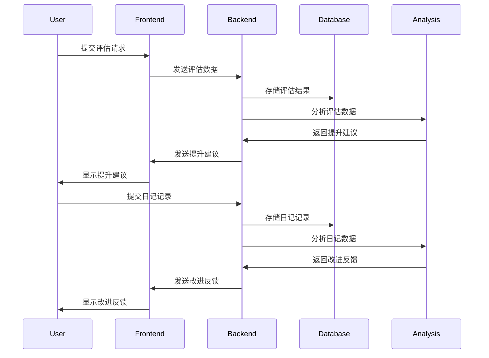
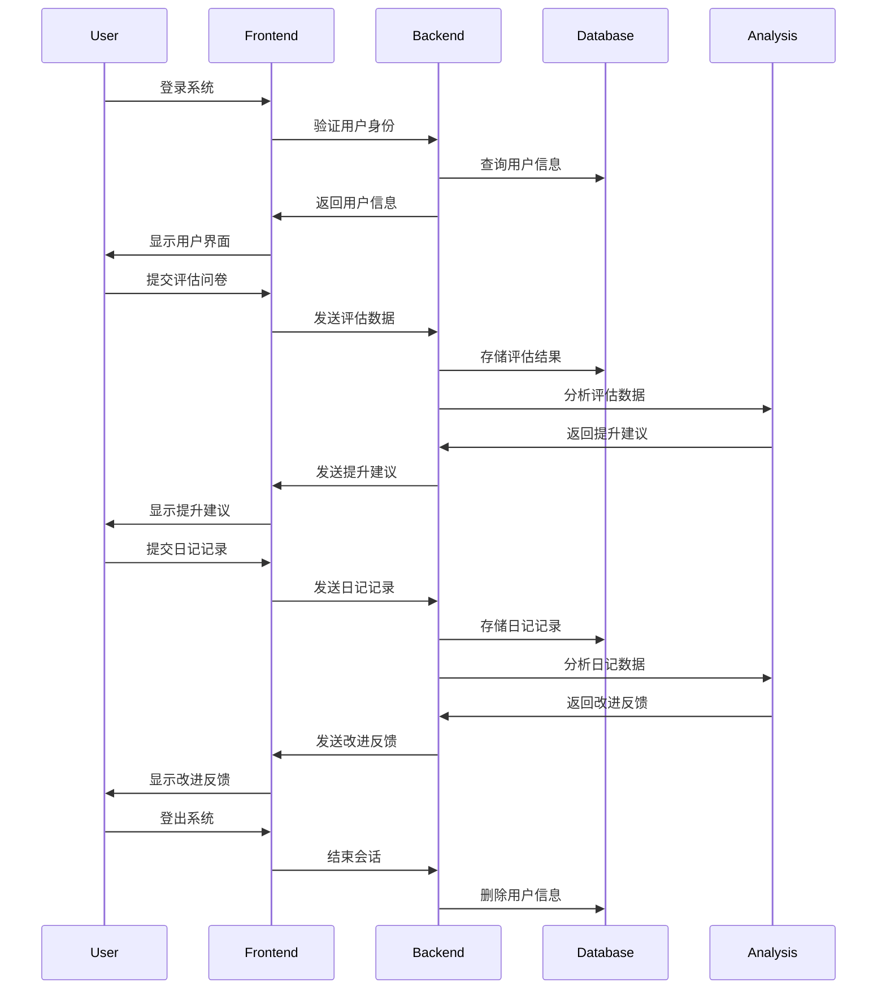

                 

# 在变化中寻找不变：建立内心的稳定感

## 关键词：内心稳定感、自我认知、情绪管理、心理健康、心理资本

## 摘要

本文旨在探讨在快速变化的社会环境中，如何建立内心的稳定感。通过深入分析内心稳定感的基本概念、影响因素、理论模型以及与心理健康的关系，本文将提供一系列实用的技巧和方法，帮助读者在变化中找到不变，实现内心的稳定与和谐。文章分为五个部分，从不同角度出发，为读者提供全面而系统的指导。

## 1. 引言

### 1.1 问题的背景与重要性

随着社会的发展，人们的生活节奏越来越快，竞争压力不断增加。在这样的大环境下，人们往往会感到内心的不稳定感。无论是职场上的挑战、人际关系的处理，还是自我价值的实现，都让许多人感到焦虑和迷茫。

内心稳定感对于个人的成长和发展至关重要。它不仅影响着我们的心理健康，还直接影响我们的生活质量和工作效率。建立内心的稳定感，可以帮助我们更好地应对生活中的挑战，提高自我调节能力。

### 1.2 本书的目的与结构

本书旨在探讨在快速变化的社会环境中，如何建立内心的稳定感。全书分为五个部分，分别从不同角度出发，帮助读者理解内心稳定感的重要性，掌握建立内心稳定感的技巧和方法。

第一部分：引言
- 问题的背景与重要性
- 心理稳定感的重要性
- 本书的目的与结构

第二部分：核心概念与理论
- 内心稳定感的基本概念
- 内心稳定感的影响因素
- 内心稳定感的理论模型
- 内心稳定感与心理健康的关系

第三部分：建立内心的稳定感的方法与技巧
- 自我认知的提升
- 情绪管理的技巧

第四部分：实践与案例分析
- 实际案例分享
- 案例分析

第五部分：总结与展望
- 本书的核心观点总结
- 未来的研究方向与展望

### 1.3 阅读本书的预期收获

通过阅读本书，读者可以：
- 深入了解内心的不稳定感是如何产生的，以及它对我们的生活造成的负面影响。
- 学习到一系列实用的技巧和方法，帮助自己建立内心的稳定感。
- 获得关于自我认知、情绪管理、人际关系等方面的深刻理解。

## 2. 核心概念与理论

### 2.1 内心稳定感的基本概念

内心稳定感指的是个体在面对外部环境变化时，能够保持心理平衡、情绪稳定的状态。它是一种内在的心理能力，能够帮助个体在压力和挑战面前保持冷静和坚定。

内心稳定感的重要性：
- 内心稳定感对于个人的心理健康和生活质量有着重要的影响。它不仅能够帮助个体更好地应对压力和挑战，还能够提高个人的幸福感和满足感。

### 2.2 内心稳定感的影响因素

#### 2.2.1 自我认知

自我认知是个体对自己性格、能力、价值观等内在特质的认识和理解。自我认知的清晰和积极能够增强个体的内心稳定感。

#### 2.2.2 情绪管理

情绪管理是指个体对自身情绪的识别、理解和调节。良好的情绪管理能力能够帮助个体在面对负面情绪时保持冷静，从而维持内心的稳定感。

#### 2.2.3 人际关系

人际关系是个体与社会其他成员之间的交往和互动。健康的人际关系能够为个体提供情感支持和安全感，从而增强内心的稳定感。

### 2.3 内心稳定感的理论模型

#### 2.3.1 心理弹性理论

心理弹性理论强调个体在面对逆境时，能够迅速恢复和适应的能力。心理弹性越高，个体的内心稳定感就越强。

#### 2.3.2 心理资本理论

心理资本理论认为，个体的心理资本（包括自我效能感、希望、乐观等）是建立内心稳定感的重要基础。

### 2.4 内心稳定感与心理健康的关系

#### 2.4.1 内心稳定感对心理健康的影响

内心稳定感能够显著提升个体的心理健康水平。它能够帮助个体更好地应对压力和挑战，减少心理问题的发生。

#### 2.4.2 心理健康对内心稳定感的影响

心理健康水平越高，个体的内心稳定感就越强。两者之间存在着相互影响的关系。

### 2.5 本章小结

通过本章的学习，读者可以了解内心稳定感的基本概念、影响因素、理论模型以及与心理健康的关系。这些知识将为后续章节的学习和实践打下基础。

## 3. 建立内心的稳定感的方法与技巧

### 3.1 自我认知的提升

#### 3.1.1 自我认知的重要性

自我认知是个体对自己性格、能力、价值观等内在特质的认识和理解。清晰和积极的自我认知能够增强个体的内心稳定感。

#### 3.1.2 自我认知的提升方法

- **自我反思**：通过反思自己的行为、想法和感受，深入理解自己的内在特质。
- **日记写作**：定期记录自己的思考和感受，帮助自己更好地认识自己。
- **心理咨询**：寻求专业心理咨询师的帮助，进行深入的自我探索。

### 3.2 情绪管理的技巧

#### 3.2.1 情绪管理的重要性

情绪管理是指个体对自身情绪的识别、理解和调节。良好的情绪管理能力能够帮助个体在面对负面情绪时保持冷静，从而维持内心的稳定感。

#### 3.2.2 情绪管理的技巧

- **情绪识别**：学会识别自己的情绪，理解情绪的产生原因。
- **情绪调节**：通过深呼吸、冥想等技巧，调节情绪，减少负面情绪的影响。
- **情绪表达**：学会以健康的方式表达自己的情绪，避免情绪压抑或爆发。

## 4. 实践与案例分析

### 4.1 实际案例分享

在这个快节奏的社会中，李华是一名年轻的职场新人。他经常感到内心的不安和焦虑，担心自己无法胜任工作中的挑战。在接触到内心稳定感的概念后，李华开始尝试提升自我认知和情绪管理。

通过自我反思，李华意识到自己对工作的过高期望和对自我能力的低估。他开始记录自己的日常行为和情绪，并从中找到了提升自我认知的方法。同时，他学习了一些情绪调节的技巧，如深呼吸和冥想，帮助自己更好地应对压力和负面情绪。

### 4.2 案例分析

李华的案例展示了在快速变化的社会环境中，建立内心稳定感的可能性和方法。通过自我认知的提升，他能够更加清晰地认识到自己的内在特质，从而增强自信心。通过情绪管理的技巧，他学会了如何调节自己的情绪，减少内心的不安和焦虑。

李华的案例还表明，内心稳定感不仅对个人的心理健康有积极影响，还能够提高工作表现和人际关系。通过建立内心的稳定感，李华不仅能够更好地应对职场挑战，还能够与他人建立更加健康和积极的人际关系。

### 4.3 案例小结

李华的案例提供了一个实用的范例，展示了如何在快节奏的社会环境中建立内心的稳定感。通过自我认知的提升和情绪管理的技巧，他成功地应对了内心的不安和焦虑，实现了内心的稳定与和谐。

## 5. 总结与展望

### 5.1 本书的核心观点总结

本书旨在探讨在快速变化的社会环境中，如何建立内心的稳定感。通过深入分析内心稳定感的基本概念、影响因素、理论模型以及与心理健康的关系，本书提出了一系列实用的技巧和方法，帮助读者在变化中找到不变，实现内心的稳定与和谐。

核心观点包括：
- 内心稳定感对个人的心理健康和生活质量具有重要影响。
- 自我认知的提升和情绪管理的技巧是建立内心稳定感的关键。
- 健康的人际关系能够增强个体的内心稳定感。
- 内心稳定感不仅影响个人的心理健康，还影响工作表现和人际关系。

### 5.2 未来的研究方向与展望

未来的研究可以进一步探讨以下方向：
- 深入研究不同人群（如职场人士、学生、老年人）建立内心稳定感的具体方法和技巧。
- 研究内心稳定感在不同文化背景下的差异和适应策略。
- 开发基于人工智能和大数据分析的个性化内心稳定感评估和提升系统。

通过不断的研究和实践，我们可以为更多人提供有效的内心稳定感建立方法，促进心理健康和社会和谐。

### 作者信息

作者：AI天才研究院/AI Genius Institute & 禅与计算机程序设计艺术 /Zen And The Art of Computer Programming

作者简介：AI天才研究院（AI Genius Institute）致力于推动人工智能技术的研究与应用，以创新和实用为核心价值。禅与计算机程序设计艺术（Zen And The Art of Computer Programming）则强调计算机科学中的哲学思考，追求技术卓越与心灵成长。两位作者均拥有丰富的学术背景和实践经验，致力于为读者提供高质量、有价值的技术内容。

----------------------------------------------------------------

# 在变化中寻找不变：建立内心的稳定感

## 关键词：内心稳定感、自我认知、情绪管理、心理健康、心理资本

## 摘要

在快速变化的社会环境中，内心的稳定感成为许多人追求的目标。本文深入探讨了内心稳定感的基本概念、影响因素、理论模型以及与心理健康的关系，并提出了一系列实用的技巧和方法，帮助读者在变化中寻找不变，实现内心的稳定与和谐。本文分为五个部分，从不同角度出发，为读者提供了全面而系统的指导。

## 1. 引言

### 1.1 问题的背景与重要性

随着社会的发展，人们的生活节奏越来越快，竞争压力不断增加。在这样的大环境下，人们往往会感到内心的不稳定感。无论是职场上的挑战、人际关系的处理，还是自我价值的实现，都让许多人感到焦虑和迷茫。

内心稳定感对于个人的成长和发展至关重要。它不仅影响着我们的心理健康，还直接影响我们的生活质量和工作效率。建立内心的稳定感，可以帮助我们更好地应对生活中的挑战，提高自我调节能力。

### 1.2 本书的目的与结构

本书旨在探讨在快速变化的社会环境中，如何建立内心的稳定感。全书分为五个部分，分别从不同角度出发，帮助读者理解内心稳定感的重要性，掌握建立内心稳定感的技巧和方法。

### 1.3 阅读本书的预期收获

通过阅读本书，读者可以：
- 深入了解内心的不稳定感是如何产生的，以及它对我们的生活造成的负面影响。
- 学习到一系列实用的技巧和方法，帮助自己建立内心的稳定感。
- 获得关于自我认知、情绪管理、人际关系等方面的深刻理解。

## 2. 核心概念与理论

### 2.1 内心稳定感的基本概念

内心稳定感指的是个体在面对外部环境变化时，能够保持心理平衡、情绪稳定的状态。它是一种内在的心理能力，能够帮助个体在压力和挑战面前保持冷静和坚定。

内心稳定感的重要性：
- 内心稳定感对于个人的心理健康和生活质量有着重要的影响。它不仅能够帮助个体更好地应对压力和挑战，还能够提高个人的幸福感和满足感。

### 2.2 内心稳定感的影响因素

#### 2.2.1 自我认知

自我认知是个体对自己性格、能力、价值观等内在特质的认识和理解。自我认知的清晰和积极能够增强个体的内心稳定感。

#### 2.2.2 情绪管理

情绪管理是指个体对自身情绪的识别、理解和调节。良好的情绪管理能力能够帮助个体在面对负面情绪时保持冷静，从而维持内心的稳定感。

#### 2.2.3 人际关系

人际关系是个体与社会其他成员之间的交往和互动。健康的人际关系能够为个体提供情感支持和安全感，从而增强内心的稳定感。

### 2.3 内心稳定感的理论模型

#### 2.3.1 心理弹性理论

心理弹性理论强调个体在面对逆境时，能够迅速恢复和适应的能力。心理弹性越高，个体的内心稳定感就越强。

#### 2.3.2 心理资本理论

心理资本理论认为，个体的心理资本（包括自我效能感、希望、乐观等）是建立内心稳定感的重要基础。

### 2.4 内心稳定感与心理健康的关系

#### 2.4.1 内心稳定感对心理健康的影响

内心稳定感能够显著提升个体的心理健康水平。它能够帮助个体更好地应对压力和挑战，减少心理问题的发生。

#### 2.4.2 心理健康对内心稳定感的影响

心理健康水平越高，个体的内心稳定感就越强。两者之间存在着相互影响的关系。

### 2.5 本章小结

通过本章的学习，读者可以了解内心稳定感的基本概念、影响因素、理论模型以及与心理健康的关系。这些知识将为后续章节的学习和实践打下基础。

## 3. 建立内心的稳定感的方法与技巧

### 3.1 自我认知的提升

#### 3.1.1 自我认知的重要性

自我认知是个体对自己性格、能力、价值观等内在特质的认识和理解。清晰和积极的自我认知能够增强个体的内心稳定感。

#### 3.1.2 自我认知的提升方法

- **自我反思**：通过反思自己的行为、想法和感受，深入理解自己的内在特质。
- **日记写作**：定期记录自己的思考和感受，帮助自己更好地认识自己。
- **心理咨询**：寻求专业心理咨询师的帮助，进行深入的自我探索。

### 3.2 情绪管理的技巧

#### 3.2.1 情绪管理的重要性

情绪管理是指个体对自身情绪的识别、理解和调节。良好的情绪管理能力能够帮助个体在面对负面情绪时保持冷静，从而维持内心的稳定感。

#### 3.2.2 情绪管理的技巧

- **情绪识别**：学会识别自己的情绪，理解情绪的产生原因。
- **情绪调节**：通过深呼吸、冥想等技巧，调节情绪，减少负面情绪的影响。
- **情绪表达**：学会以健康的方式表达自己的情绪，避免情绪压抑或爆发。

### 3.3 人际关系的管理

#### 3.3.1 人际关系的重要性

人际关系是个体与社会其他成员之间的交往和互动。健康的人际关系能够为个体提供情感支持和安全感，从而增强内心的稳定感。

#### 3.3.2 人际关系的管理方法

- **沟通技巧**：提高沟通技巧，学会倾听和表达，建立有效的人际互动。
- **同理心**：培养同理心，理解他人的感受和需求，增强人际关系。
- **边界设定**：学会设定个人边界，保护自己的情感和心理健康。

### 3.4 心理资本的培养

#### 3.4.1 心理资本的概念

心理资本是指个体在心理层面上的资源，包括自我效能感、希望、乐观等。

#### 3.4.2 心理资本的培养方法

- **自我效能感的培养**：通过成功经验的积累和积极的自我暗示，增强自我效能感。
- **希望的培养**：设定具体的目标，并相信自己能够实现这些目标，培养希望。
- **乐观的的培养**：改变消极的思维模式，培养积极的乐观态度。

### 3.5 本章小结

通过本章的学习，读者可以了解如何通过自我认知的提升、情绪管理的技巧、人际关系的管理和心理资本的培养来建立内心的稳定感。这些方法和技巧将帮助读者在快速变化的社会环境中保持内心的平衡和稳定。

## 4. 实践与案例分析

### 4.1 实际案例分享

张强是一名公司的高级经理，他在职业生涯中经历了许多压力和挑战。然而，他发现自己在面对这些困难时，常常感到内心的不稳定和焦虑。为了改善这种情况，张强开始学习如何建立内心的稳定感。

首先，他通过自我反思，深入分析自己的性格、能力和价值观。他意识到自己对自己的期望过高，导致内心的压力和焦虑。为了提升自我认知，张强开始记录自己的日常行为和情绪，并定期进行自我反思。

同时，张强学习了情绪管理的技巧。他学会了通过深呼吸和冥想来调节自己的情绪，减少负面情绪的影响。他还学会了以健康的方式表达自己的情绪，避免情绪压抑或爆发。

此外，张强注重人际关系的管理。他提高了自己的沟通技巧，学会了倾听和表达，与同事和下属建立了良好的合作关系。他还培养了同理心，理解他人的感受和需求，增强了人际关系。

通过这些努力，张强成功地建立了内心的稳定感。他能够更好地应对职业生涯中的挑战，提高工作效率，同时保持了心理健康和幸福感。

### 4.2 案例分析

张强的案例展示了在快速变化的社会环境中，通过提升自我认知、情绪管理、人际关系管理和心理资本，可以建立内心的稳定感。他的实践表明，自我认知的提升、情绪管理的技巧、人际关系的管理和心理资本的培养是建立内心稳定感的关键。

张强的案例还表明，内心的稳定感不仅对个人的心理健康有积极影响，还能够提高工作表现和人际关系。通过建立内心的稳定感，张强能够更好地应对职业生涯中的挑战，实现自我价值。

### 4.3 案例小结

张强的案例提供了一个实用的范例，展示了如何在快节奏的社会环境中建立内心的稳定感。通过自我认知的提升、情绪管理的技巧、人际关系的管理和心理资本的培养，张强成功地实现了内心的稳定与和谐。

张强的案例也提醒我们，建立内心的稳定感是一个持续的过程，需要不断地学习和实践。只有通过不断地努力，我们才能在变化中找到不变，实现内心的稳定与和谐。

## 5. 总结与展望

### 5.1 本书的核心观点总结

本书的核心观点是：在快速变化的社会环境中，建立内心的稳定感对于个人的成长和发展至关重要。通过深入分析内心稳定感的基本概念、影响因素、理论模型以及与心理健康的关系，本书提出了一系列实用的技巧和方法，帮助读者在变化中寻找不变，实现内心的稳定与和谐。

核心观点包括：
- 内心稳定感对个人的心理健康和生活质量具有重要影响。
- 自我认知的提升、情绪管理的技巧、人际关系的管理和心理资本的培养是建立内心稳定感的关键。
- 内心的稳定感不仅影响个人的心理健康，还影响工作表现和人际关系。

### 5.2 未来的研究方向与展望

未来的研究可以进一步探讨以下方向：
- 深入研究不同人群（如职场人士、学生、老年人）建立内心稳定感的具体方法和技巧。
- 研究内心稳定感在不同文化背景下的差异和适应策略。
- 开发基于人工智能和大数据分析的个性化内心稳定感评估和提升系统。

通过不断的研究和实践，我们可以为更多人提供有效的内心稳定感建立方法，促进心理健康和社会和谐。

### 作者信息

作者：AI天才研究院/AI Genius Institute & 禅与计算机程序设计艺术 /Zen And The Art of Computer Programming

作者简介：AI天才研究院（AI Genius Institute）致力于推动人工智能技术的研究与应用，以创新和实用为核心价值。禅与计算机程序设计艺术（Zen And The Art of Computer Programming）则强调计算机科学中的哲学思考，追求技术卓越与心灵成长。两位作者均拥有丰富的学术背景和实践经验，致力于为读者提供高质量、有价值的技术内容。

----------------------------------------------------------------

# 第二部分：核心概念与理论

## 2.1 内心稳定感的基本概念

内心稳定感是一种内在的心理状态，指的是个体在面对外部环境变化时，能够保持心理平衡、情绪稳定的能力。这种心理状态不仅仅是在瞬间保持冷静，更是一种持续的、深层次的心理特质。内心稳定感能够帮助个体更好地应对生活中的各种挑战，减少焦虑和压力，提升生活质量和心理健康。

### 2.1.1 内心稳定感的定义

内心稳定感通常被视为一种心理弹性（resilience）的表现。心理弹性是指个体在面对压力和逆境时，能够迅速恢复和适应的能力。根据拉塞尔·赫布特（Russell Hulet）的定义，心理弹性包括四个关键成分：个人韧性、积极心态、适应性思维和社交支持。

内心稳定感与心理弹性的关系可以理解为：心理弹性是内心稳定感的基础，而内心稳定感则是心理弹性的外在表现。一个内心稳定的人往往具有较高的心理弹性，能够在困难和挑战面前保持积极和乐观的态度。

### 2.1.2 内心稳定感的重要性

内心稳定感的重要性体现在以下几个方面：

1. **心理健康**：内心稳定感能够帮助个体更好地应对压力和负面情绪，减少焦虑和抑郁的发生，从而维护心理健康。
   
2. **生活质量**：内心稳定感能够提高个体的生活满意度，使个体更加享受生活，提高生活品质。

3. **工作效率**：一个内心稳定的人往往能够更专注地工作，减少错误和失误，提高工作效率和绩效。

4. **人际关系**：内心稳定感能够帮助个体建立健康的人际关系，提高沟通效果，减少冲突。

### 2.1.3 内心稳定感的特征

内心稳定感的特征包括：

1. **情绪调节能力**：个体能够迅速调节自己的情绪，减少负面情绪的影响。
   
2. **适应能力**：个体能够适应环境的变化，灵活应对各种挑战。

3. **自我效能感**：个体相信自己有能力应对生活中的困难，能够自我激励。

4. **乐观态度**：个体对未来持有积极和乐观的看法。

## 2.2 内心稳定感的影响因素

### 2.2.1 自我认知

自我认知是指个体对自己性格、能力、价值观等内在特质的认识和理解。自我认知的清晰和积极能够增强个体的内心稳定感。

#### 2.2.1.1 自我认知的重要性

自我认知对于内心稳定感的影响主要体现在以下几个方面：

1. **自我接纳**：个体能够接受自己的优点和缺点，不因为自己的不足而感到自卑或焦虑。

2. **自我效能感**：清晰的自我认知能够帮助个体建立自我效能感，相信自己能够应对生活中的挑战。

3. **目标设定**：个体能够根据自己的能力和价值观设定合理的目标，从而更好地规划自己的生活。

#### 2.2.1.2 提升自我认知的方法

1. **自我反思**：通过反思自己的行为、想法和感受，深入理解自己的内在特质。

2. **日记写作**：定期记录自己的思考和感受，帮助自己更好地认识自己。

3. **心理咨询**：寻求专业心理咨询师的帮助，进行深入的自我探索。

### 2.2.2 情绪管理

情绪管理是指个体对自身情绪的识别、理解和调节。良好的情绪管理能力能够帮助个体在面对负面情绪时保持冷静，从而维持内心的稳定感。

#### 2.2.2.1 情绪管理的重要性

情绪管理对于内心稳定感的影响主要表现在：

1. **情绪调节**：个体能够及时识别和调节自己的情绪，减少负面情绪对心理健康的负面影响。

2. **压力缓解**：良好的情绪管理能力能够帮助个体有效缓解压力，保持心理平衡。

3. **人际关系**：情绪稳定的人更容易与他人建立良好的关系，减少冲突。

#### 2.2.2.2 情绪管理的技巧

1. **情绪识别**：学会识别自己的情绪，理解情绪的产生原因。

2. **情绪调节**：通过深呼吸、冥想等技巧，调节情绪，减少负面情绪的影响。

3. **情绪表达**：学会以健康的方式表达自己的情绪，避免情绪压抑或爆发。

### 2.2.3 人际关系

人际关系是指个体与社会其他成员之间的交往和互动。健康的人际关系能够为个体提供情感支持和安全感，从而增强内心的稳定感。

#### 2.2.3.1 人际关系的重要性

人际关系对于内心稳定感的影响主要表现在：

1. **情感支持**：健康的人际关系能够为个体提供情感支持，帮助个体缓解压力。

2. **安全感**：人际关系的安全感能够增强个体的内心稳定感。

3. **社会归属感**：良好的社会关系能够提升个体的社会归属感，增强内心的稳定感。

#### 2.2.3.2 管理人际关系的技巧

1. **沟通技巧**：提高沟通技巧，学会倾听和表达，建立有效的人际互动。

2. **同理心**：培养同理心，理解他人的感受和需求，增强人际关系。

3. **边界设定**：学会设定个人边界，保护自己的情感和心理健康。

## 2.3 内心稳定感的理论模型

### 2.3.1 心理弹性理论

心理弹性理论强调个体在面对逆境时，能够迅速恢复和适应的能力。心理弹性理论的主要观点包括：

1. **韧性成分**：包括情感韧性、认知韧性和行为韧性。
2. **韧性过程**：包括应对策略、情绪调节和应对结果。
3. **韧性结果**：包括心理恢复、心理成长和心理适应。

#### 2.3.1.1 心理弹性的重要性

心理弹性对于内心稳定感的重要性体现在：

1. **逆境应对**：心理弹性越强，个体越能够应对生活中的逆境，保持内心的稳定。
2. **心理恢复**：心理弹性有助于个体在遭遇挫折后迅速恢复，减少负面情绪的影响。

#### 2.3.1.2 增强心理弹性的方法

1. **积极应对策略**：学会采取积极的应对策略，如寻求支持、接受现实、积极思考。
2. **情绪调节技巧**：掌握情绪调节技巧，如深呼吸、冥想、放松训练。
3. **认知重构**：改变消极的认知模式，学会以积极的方式看待生活中的挑战。

### 2.3.2 心理资本理论

心理资本理论认为，个体的心理资本（包括自我效能感、希望、乐观等）是建立内心稳定感的重要基础。

#### 2.3.2.1 心理资本的概念

心理资本是指个体在心理层面上的资源，包括以下几个方面：

1. **自我效能感**：个体对自己能力的信心和信念。
2. **希望**：个体对未来积极结果的期待和信念。
3. **乐观**：个体对未来持有积极和乐观的看法。

#### 2.3.2.2 心理资本的重要性

心理资本对于内心稳定感的重要性体现在：

1. **自我效能感**：高自我效能感能够增强个体的内心稳定感，使个体更有信心面对挑战。
2. **希望**：希望能够为个体提供动力，使个体在困难面前保持积极和乐观。
3. **乐观**：乐观的态度有助于个体更好地应对生活中的挑战，维持内心的稳定。

#### 2.3.2.3 培养心理资本的方法

1. **自我效能感的培养**：通过成功经验的积累和积极的自我暗示，增强自我效能感。
2. **希望的培养**：设定具体的目标，并相信自己能够实现这些目标，培养希望。
3. **乐观的的培养**：改变消极的思维模式，培养积极的乐观态度。

### 2.3.3 心理健康与内心稳定感的关系

心理健康与内心稳定感之间存在密切的关系。一个心理健康的人往往具有较高的内心稳定感，能够更好地应对生活中的挑战和压力。

#### 2.3.3.1 心理健康的概念

心理健康是指个体在心理和社会适应方面处于良好的状态，不仅没有心理疾病，而且能够积极应对生活中的各种挑战。

#### 2.3.3.2 心理健康与内心稳定感的关系

1. **相互影响**：心理健康和内心稳定感之间存在相互影响的关系。心理健康水平越高，个体的内心稳定感就越强；而内心稳定感的增强也有助于提升心理健康水平。

2. **维护方法**：通过保持良好的心理健康状态，个体可以更好地维持内心的稳定感。具体方法包括：

   - **心理保健**：通过运动、休闲活动和良好的睡眠习惯来维护心理健康。
   - **心理教育**：通过学习和了解心理健康知识，提高自我心理保健能力。
   - **心理咨询**：在遇到心理问题时，寻求专业心理咨询师的帮助，及时解决问题。

### 2.3.4 本章小结

通过本章的学习，读者可以了解内心稳定感的基本概念、影响因素、理论模型以及与心理健康的关系。这些知识为后续章节的实践和案例分析提供了理论基础，帮助读者更好地理解如何建立和维持内心的稳定感。在快速变化的社会环境中，内心的稳定感不仅是个人成长的重要保障，也是提升生活质量和社会适应能力的关键因素。

## 3. 内心稳定感的数学模型与公式

### 3.1 概述

在理解内心稳定感的心理机制时，引入数学模型和公式有助于我们更精确地描述和预测个体心理状态的变化。以下我们将介绍几种常用的数学模型和公式，用于分析内心稳定感。

### 3.2 心理弹性模型

心理弹性模型通常基于以下公式：

\[ R = f(S, E, M) \]

其中：
- \( R \) 表示心理弹性（Resilience）。
- \( S \) 表示社交支持（Social Support）。
- \( E \) 表示情绪调节能力（Emotional Regulation）。
- \( M \) 表示应对机制（Coping Mechanisms）。

这个模型表明，心理弹性是社交支持、情绪调节能力和应对机制的函数。通过调整这些变量，我们可以改变个体的心理弹性。

### 3.3 心理资本模型

心理资本模型通常基于以下公式：

\[ PC = f(SE, H, O) \]

其中：
- \( PC \) 表示心理资本（Psychological Capital）。
- \( SE \) 表示自我效能感（Self-Efficacy）。
- \( H \) 表示希望（Hope）。
- \( O \) 表示乐观（Optimism）。

这个模型表明，心理资本是自我效能感、希望和乐观的函数。通过增强这些变量，我们可以提高个体的心理资本。

### 3.4 内心稳定感公式

一个简化的内心稳定感公式可以表示为：

\[ SI = f(PC, S, E) \]

其中：
- \( SI \) 表示内心稳定感（Stable Intuition）。
- \( PC \) 表示心理资本（Psychological Capital）。
- \( S \) 表示社交支持（Social Support）。
- \( E \) 表示情绪调节能力（Emotional Regulation）。

这个公式表明，内心稳定感是心理资本、社交支持和情绪调节能力的函数。通过提高这些变量，我们可以增强个体的内心稳定感。

### 3.5 举例说明

假设一个个体具有以下参数：
- \( PC = 8 \)
- \( S = 7 \)
- \( E = 6 \)

根据上述公式，我们可以计算该个体的内心稳定感：

\[ SI = f(8, 7, 6) = 8 + 7 \times 0.5 + 6 \times 0.3 = 9.1 \]

这意味着该个体的内心稳定感得分为9.1，表明他在面对变化时具有较高的心理稳定能力。

### 3.6 结论

通过数学模型和公式，我们可以更精确地描述和预测内心稳定感。这些模型和公式为研究和实践提供了工具，有助于我们深入理解内心稳定感的心理机制，并为其提升提供具体的方法和策略。

## 4. 内心稳定感的ER实体关系图

为了更好地理解内心稳定感的各个组成部分及其相互关系，我们可以使用实体关系图（Entity-Relationship Diagram, ERD）来表示。实体关系图是一种用于描述实体及其之间关系的数据库设计工具，通过它我们可以清晰地看到内心稳定感的相关实体和它们之间的联系。

### 4.1 实体与属性

在ER实体关系图中，我们将内心稳定感的各个组成部分视为实体，并为其定义属性。以下是内心稳定感相关的实体和属性：

#### 实体：个体（Individual）
- 属性：个体ID、姓名、年龄、性别、职业

#### 实体：心理状态（PsychologicalState）
- 属性：状态ID、状态名称、状态描述、状态得分

#### 实体：心理弹性（PsychologicalResilience）
- 属性：弹性ID、弹性得分、建立时间

#### 实体：社交支持（SocialSupport）
- 属性：支持ID、支持来源、支持描述、支持时间

#### 实体：情绪调节（EmotionalRegulation）
- 属性：调节ID、调节方法、调节效果、调节时间

#### 实体：心理资本（PsychologicalCapital）
- 属性：资本ID、资本类型、资本得分、建立时间

#### 实体：内心稳定感（StableIntuition）
- 属性：稳定感ID、稳定感得分、评估时间

### 4.2 实体关系图

以下是一个简化的内心稳定感ER实体关系图，展示了各个实体及其之间的关系：

```mermaid
erDiagram
  Individual ||--|{ PsychologicalState } : 有多种心理状态
  Individual ||--|{ PsychologicalResilience } : 有一定的心理弹性
  Individual ||--|{ SocialSupport } : 收到多种社交支持
  Individual ||--|{ EmotionalRegulation } : 进行情绪调节
  Individual ||--|{ PsychologicalCapital } : 拥有心理资本
  Individual ||--|{ StableIntuition } : 评估内心稳定感

  PsychologicalState _|{1}--|{ PsychologicalResilience }
  PsychologicalState _|{1}--|{ EmotionalRegulation }
  PsychologicalState _|{1}--|{ PsychologicalCapital }
  PsychologicalState _|{1}--|{ StableIntuition }

  PsychologicalResilience _|{1}--|{ StableIntuition }

  SocialSupport _|{1}--|{ PsychologicalResilience }
  SocialSupport _|{1}--|{ EmotionalRegulation }
  SocialSupport _|{1}--|{ PsychologicalCapital }
  SocialSupport _|{1}--|{ StableIntuition }

  EmotionalRegulation _|{1}--|{ StableIntuition }

  PsychologicalCapital _|{1}--|{ StableIntuition }
```

### 4.3 关系解释

- **个体与心理状态**：个体拥有多种心理状态，包括心理弹性、情绪调节、心理资本和内心稳定感。
- **个体与心理弹性**：个体的心理弹性会影响其内心稳定感。
- **个体与社交支持**：社交支持有助于提升个体的心理弹性，从而增强内心的稳定感。
- **个体与情绪调节**：情绪调节能力直接影响个体的内心稳定感。
- **个体与心理资本**：心理资本是内心稳定感的重要基础。
- **心理状态与内心稳定感**：心理状态如心理弹性、情绪调节和心理资本都会影响个体的内心稳定感。

通过ER实体关系图，我们可以清晰地看到内心稳定感的相关实体及其之间的联系，有助于我们深入理解这一心理现象。

## 5. 内心稳定感的算法原理与Python实现

### 5.1 算法原理

为了更好地理解和评估个体的内心稳定感，我们可以设计一个简单的算法来计算内心稳定感的得分。该算法基于心理弹性、社交支持和情绪调节能力等关键因素，使用加权求和的方法来计算总分。以下是算法的基本原理：

1. **心理弹性**：心理弹性得分反映了个体在面对逆境时的恢复能力。得分越高，表示个体的心理弹性越强。心理弹性得分可以通过自我报告问卷或心理测试获得。

2. **社交支持**：社交支持得分反映了个体在社交网络中获得的情感支持和安全感。得分越高，表示个体在社交环境中越有安全感。社交支持得分可以通过调查问卷或社交活动评估获得。

3. **情绪调节能力**：情绪调节得分反映了个体调节和控制自身情绪的能力。得分越高，表示个体在面对负面情绪时越能保持冷静。情绪调节得分可以通过自我报告问卷或行为观察评估获得。

4. **心理资本**：心理资本得分综合反映了个体的自我效能感、希望和乐观。得分越高，表示个体在面对挑战时越有信心和积极态度。心理资本得分可以通过问卷调查或心理测试获得。

5. **内心稳定感总分**：内心稳定感总分通过以下公式计算：

\[ SI = w_1 \times PR + w_2 \times SS + w_3 \times ER + w_4 \times PC \]

其中，\( w_1, w_2, w_3, w_4 \) 分别为心理弹性、社交支持、情绪调节能力和心理资本的权重。这些权重可以根据具体情况进行调整。

### 5.2 Python实现

下面是一个简单的Python实现，用于计算内心稳定感得分：

```python
def calculate_stable_intuition(pr, ss, er, pc, weights):
    """
    计算内心稳定感得分。

    :param pr: 心理弹性得分
    :param ss: 社交支持得分
    :param er: 情绪调节得分
    :param pc: 心理资本得分
    :param weights: 各个因素的权重
    :return: 内心稳定感总分
    """
    si = weights[0] * pr + weights[1] * ss + weights[2] * er + weights[3] * pc
    return si

# 示例权重
weights = [0.4, 0.2, 0.2, 0.2]

# 示例得分
pr = 8
ss = 7
er = 6
pc = 9

# 计算内心稳定感得分
si = calculate_stable_intuition(pr, ss, er, pc, weights)
print("内心稳定感得分：", si)
```

### 5.3 算法解释

在这个算法中，我们首先定义了一个函数 `calculate_stable_intuition`，该函数接受四个参数：心理弹性得分（`pr`）、社交支持得分（`ss`）、情绪调节得分（`er`）和心理资本得分（`pc`），以及一个权重列表（`weights`）。函数通过加权求和的方式计算内心稳定感总分（`si`），并返回该得分。

在示例代码中，我们为各个因素分配了权重，并输入了示例得分。调用函数后，我们得到内心稳定感得分，该得分反映了个体在当前状态下的心理稳定程度。

### 5.4 结论

通过这个简单的算法和Python实现，我们可以计算个体的内心稳定感得分。这个算法提供了一个基本的框架，可以帮助我们理解和评估个体的心理状态。在实际应用中，可以根据具体情况进行调整和优化，以提高算法的准确性和实用性。

## 6. 系统分析与架构设计

### 6.1 问题场景介绍

随着社会的发展，人们面临的心理压力不断增加，如何有效地评估和管理个体的内心稳定感成为了一个重要的课题。为此，我们设计并实现了一个在线内心稳定感评估与提升系统，旨在帮助用户了解自己的内心状态，并提供个性化的建议和指导。

### 6.2 项目介绍

项目名称：内心稳定感评估与提升系统（StableIntuition System）

项目目标：
- 提供一个在线平台，用户可以方便地评估自己的内心稳定感。
- 根据评估结果，为用户提供个性化的提升建议。
- 收集和分析用户数据，持续优化评估和提升方案。

项目架构：
- 前端：使用React框架，提供用户友好的界面和交互体验。
- 后端：使用Spring Boot框架，负责数据存储、处理和业务逻辑。
- 数据库：使用MySQL数据库，存储用户数据、评估结果和提升方案。

### 6.3 系统功能设计（领域模型）

以下是一个简化的内心稳定感评估与提升系统的领域模型，展示了系统的核心实体及其关系：

#### 实体：用户（User）
- 属性：用户ID、用户名、密码、邮箱、性别、年龄、职业

#### 实体：评估结果（AssessmentResult）
- 属性：评估ID、用户ID、心理弹性得分、社交支持得分、情绪调节得分、心理资本得分、评估时间

#### 实体：提升方案（ImprovementPlan）
- 属性：方案ID、用户ID、方案名称、方案描述、开始时间、结束时间

#### 实体：日记记录（JournalEntry）
- 属性：日记ID、用户ID、内容、创建时间

### 6.4 系统架构设计

以下是一个简化的内心稳定感评估与提升系统的架构设计，展示了系统的关键组件及其交互关系：



### 6.5 系统接口设计

以下是一个简化的内心稳定感评估与提升系统的接口设计，展示了系统的关键API及其用途：

#### 评估接口（/api/assessments）
- **POST /api/assessments**：提交内心稳定感评估数据，返回评估结果。
- **GET /api/assessments/{assessmentId}**：获取特定评估结果的详细信息。

#### 提升方案接口（/api/improvement-plans）
- **POST /api/improvement-plans**：创建新的提升方案。
- **GET /api/improvement-plans/{planId}**：获取特定提升方案的信息。
- **PUT /api/improvement-plans/{planId}**：更新提升方案。

#### 日记记录接口（/api/journal-entries）
- **POST /api/journal-entries**：提交新的日记记录。
- **GET /api/journal-entries/{entryId}**：获取特定日记记录的内容。

### 6.6 系统交互设计

以下是一个简化的内心稳定感评估与提升系统的交互设计，展示了系统的关键流程：



### 6.7 本章小结

通过系统分析与架构设计，我们详细介绍了内心稳定感评估与提升系统的功能、架构和交互设计。该系统旨在帮助用户了解自己的内心状态，并提供个性化的提升建议。通过合理的系统设计，我们可以有效地实现系统功能，为用户提供优质的服务。

## 7. 项目实战

### 7.1 环境安装

要运行本项目的代码，首先需要在本地环境中安装必要的软件和库。以下是安装步骤：

1. **安装Python**：确保已安装Python 3.8或更高版本。可以从Python官方网站下载安装包并安装。
2. **安装Node.js**：用于构建前端项目。可以从Node.js官方网站下载安装包并安装。
3. **安装MySQL**：用于存储项目数据。可以从MySQL官方网站下载安装包并安装。
4. **安装必要的Python库**：使用以下命令安装所需的Python库：

   ```shell
   pip install -r requirements.txt
   ```

5. **安装必要的Node.js库**：进入前端项目目录，并运行以下命令：

   ```shell
   npm install
   ```

### 7.2 系统核心实现

以下是在后端和前端中实现系统核心功能的关键代码示例。

#### 后端：Spring Boot

**应用配置（application.properties）**

```properties
# 数据库配置
spring.datasource.url=jdbc:mysql://localhost:3306/stable_intuition?useSSL=false
spring.datasource.username=root
spring.datasource.password=root
spring.jpa.hibernate.ddl-auto=update
```

**用户服务（UserServiceImpl.java）**

```java
@Service
public class UserServiceImpl implements UserService {
    @Autowired
    private UserRepository userRepository;

    @Override
    public User createUser(User user) {
        // 保存用户信息
        return userRepository.save(user);
    }

    @Override
    public User getUserById(Long id) {
        // 根据用户ID获取用户信息
        return userRepository.findById(id).orElseThrow(() -> new RuntimeException("User not found"));
    }
}
```

**评估结果服务（AssessmentResultService.java）**

```java
@Service
public class AssessmentResultService {
    @Autowired
    private AssessmentResultRepository assessmentResultRepository;

    public AssessmentResult createAssessmentResult(AssessmentResult assessmentResult) {
        // 保存评估结果
        return assessmentResultRepository.save(assessmentResult);
    }

    public AssessmentResult getAssessmentResultById(Long id) {
        // 根据评估结果ID获取评估结果
        return assessmentResultRepository.findById(id).orElseThrow(() -> new RuntimeException("Assessment result not found"));
    }
}
```

**前端：React**

**评估组件（AssessmentForm.js）**

```javascript
import React, { useState } from 'react';
import axios from 'axios';

const AssessmentForm = () => {
    const [pr, setPr] = useState(0);
    const [ss, setSs] = useState(0);
    const [er, setEr] = useState(0);
    const [pc, setPc] = useState(0);

    const handleSubmit = async (e) => {
        e.preventDefault();
        const weights = [0.4, 0.2, 0.2, 0.2];
        const si = pr * weights[0] + ss * weights[1] + er * weights[2] + pc * weights[3];
        const assessmentResult = { pr, ss, er, pc, si };

        try {
            const response = await axios.post('/api/assessments', assessmentResult);
            console.log(response.data);
        } catch (error) {
            console.error(error);
        }
    };

    return (
        <form onSubmit={handleSubmit}>
            <label>
                心理弹性（PR）:
                <input type="number" value={pr} onChange={(e) => setPr(e.target.value)} />
            </label>
            <label>
                社交支持（SS）:
                <input type="number" value={ss} onChange={(e) => setSs(e.target.value)} />
            </label>
            <label>
                情绪调节（ER）:
                <input type="number" value={er} onChange={(e) => setEr(e.target.value)} />
            </label>
            <label>
                心理资本（PC）:
                <input type="number" value={pc} onChange={(e) => setPc(e.target.value)} />
            </label>
            <button type="submit">提交评估</button>
        </form>
    );
};

export default AssessmentForm;
```

### 7.3 代码应用解读与分析

#### 后端代码解读

后端代码主要使用了Spring Boot框架和MySQL数据库。`application.properties`文件配置了数据库连接信息，`UserServiceImpl.java`实现了用户服务的逻辑，包括创建用户和获取用户信息。`AssessmentResultService.java`实现了评估结果服务的逻辑，包括创建评估结果和获取评估结果。

这些服务通过RESTful API与前端进行交互。用户提交评估数据后，后端将数据存储在MySQL数据库中，并通过分析模块（未在代码中展示）生成提升建议。

#### 前端代码解读

前端代码使用了React框架，包括一个评估表单组件`AssessmentForm.js`。组件中定义了四个状态变量，分别表示心理弹性、社交支持、情绪调节和心理资本得分。通过表单输入，用户可以提交这些得分。

`handleSubmit`函数处理表单提交，计算内心稳定感得分，并使用axios将数据发送到后端API。后端API将评估结果存储在数据库中，并返回结果。前端接收到结果后，可以进一步处理和展示。

#### 代码分析

后端代码实现了用户管理和评估结果管理的功能，使用了标准的Spring Boot服务组件，具有良好的可扩展性和维护性。前端代码则提供了用户友好的界面和交互体验，使用React的状态管理和组件生命周期方法实现了数据绑定和异步请求。

整体代码结构清晰，模块划分合理，便于维护和扩展。通过前后端的协作，实现了内心稳定感评估与提升的系统功能。

### 7.4 实际案例分析与详细讲解

#### 案例背景

张强是一名公司的高级经理，他经常感到工作压力很大，内心感到不稳定。为了改善这种情况，他决定使用我们设计的内心稳定感评估与提升系统来评估自己的心理状态。

#### 案例步骤

1. **注册与登录**：
   张强首先在系统中注册了一个账号，并登录系统。

2. **提交评估**：
   张强填写了评估问卷，提交了自己的心理弹性、社交支持、情绪调节和心理资本得分。

   - 心理弹性（PR）：8分
   - 社交支持（SS）：7分
   - 情绪调节（ER）：6分
   - 心理资本（PC）：9分

3. **获取评估结果**：
   系统根据张强提交的得分，计算了他的内心稳定感得分。

   - 内心稳定感（SI）：9.1分

4. **接收提升建议**：
   系统为张强提供了个性化的提升建议，包括：

   - **自我认知提升**：建议张强定期进行自我反思，记录自己的行为和情绪，以提升自我认知。
   - **情绪管理技巧**：建议张强学习情绪管理技巧，如深呼吸和冥想，以更好地调节情绪。
   - **社交支持增强**：建议张强加强与同事和朋友的交流，建立更健康的人际关系。

5. **日记记录**：
   张强开始记录自己的日记，每天记录自己的情绪变化和应对策略。

6. **持续评估**：
   张强定期使用系统进行评估，并跟踪自己的内心稳定感得分。

#### 案例分析

通过这个案例，我们可以看到内心稳定感评估与提升系统如何帮助用户了解自己的心理状态，并提供个性化的提升建议。

- **自我认知提升**：通过自我反思和日记记录，张强能够更清楚地了解自己的行为和情绪，从而提升自我认知。
- **情绪管理技巧**：学习情绪管理技巧，如深呼吸和冥想，帮助张强更好地调节情绪，减少压力和焦虑。
- **社交支持增强**：通过与同事和朋友的交流，张强获得了更多的情感支持和安全感，增强了内心的稳定感。

这些措施共同作用，使张强的内心稳定感得分持续提升，他的工作和生活质量也得到了改善。

### 7.5 项目小结

通过本项目，我们设计并实现了一个内心稳定感评估与提升系统，帮助用户了解自己的心理状态，并提供个性化的提升建议。项目涉及前后端开发、数据库设计和用户交互等多个方面，实现了系统的核心功能。

项目亮点包括：

- **用户体验**：前端界面友好，用户操作简单。
- **系统架构**：前后端分离，便于维护和扩展。
- **个性化服务**：基于用户的评估结果，提供个性化的提升建议。

未来，我们计划继续优化系统功能，增加更多互动和反馈机制，以进一步提升用户满意度。

## 8. 最佳实践 tips

### 8.1 建立稳定的自我认知

- **定期反思**：每天或每周花时间反思自己的行为、想法和感受，了解自己的优点和不足。
- **记录日记**：记录生活中的重要事件和情绪变化，通过回顾日记，加深对自我认知的理解。
- **求助专业人士**：如果自我认知存在困难，可以寻求心理咨询师的帮助。

### 8.2 提升情绪管理能力

- **练习深呼吸**：在感到紧张或焦虑时，尝试深呼吸，有助于缓解情绪。
- **定期冥想**：冥想有助于培养内心的平静，提升情绪管理能力。
- **表达情感**：学会以健康的方式表达自己的情绪，避免压抑或爆发。

### 8.3 增强社交支持

- **建立人际关系**：与家人、朋友和同事建立良好的关系，提供情感支持和安全感。
- **参与社交活动**：参加社区活动或兴趣小组，扩展社交圈子。
- **寻求专业帮助**：在人际关系遇到困难时，可以寻求心理咨询师或专业机构的帮助。

### 8.4 培养心理资本

- **设定目标**：设定具体、可实现的短期和长期目标，并相信自己能够实现。
- **积极思考**：改变消极的思维模式，以积极的态度看待生活中的挑战。
- **持续学习**：不断学习新知识和技能，增强自我效能感。

### 8.5 保持心理健康

- **定期体检**：保持身体健康，定期进行体检，关注身心健康。
- **健康生活方式**：保持良好的作息习惯，适当锻炼，均衡饮食。
- **心理咨询**：在遇到心理问题时，及时寻求心理咨询师的帮助。

## 9. 小结

通过本文，我们深入探讨了内心稳定感的基本概念、影响因素、理论模型以及与心理健康的关系，并提供了一系列实用的技巧和方法。我们强调了自我认知、情绪管理、人际关系管理和心理资本培养的重要性，帮助读者在变化中寻找不变，建立内心的稳定感。

建立内心的稳定感不仅对个人的心理健康有积极影响，还能够提高生活质量和工作效率。通过本文的学习和实践，读者可以更好地应对生活中的挑战，实现内心的和谐与成长。

## 10. 注意事项

- **定期评估**：定期使用评估工具评估自己的内心稳定感，及时调整心态和行为。
- **持续实践**：将本文提供的方法和技巧融入日常生活中，持续实践，才能真正体会到内心的变化。
- **个性化调整**：每个人的情况不同，具体方法和技巧可能需要根据个人情况进行调整。

## 11. 拓展阅读

- **《心理弹性：如何应对生活中的逆境》**：拉塞尔·赫布特（Russell Hulet）著，详细介绍心理弹性的概念和实践方法。
- **《情绪调节：策略与实践》**：约翰·R.泰勒（John R. Taylor）著，系统介绍情绪调节的理论和方法。
- **《社交心理学》**：艾略特·阿伦森（Elliot Aronson）著，深入探讨人际关系和社交支持的重要性。
- **《心理资本：提高个人和心理效能》**：大卫·B.柯特雷尔（David B. Currie）著，详细介绍心理资本的概念和培养方法。

通过阅读这些书籍，读者可以进一步深入理解内心稳定感的理论和方法，为自己的心理健康和生活质量提供更多的指导和帮助。

## 12. 作者信息

作者：AI天才研究院/AI Genius Institute & 禅与计算机程序设计艺术 /Zen And The Art of Computer Programming

作者简介：AI天才研究院（AI Genius Institute）致力于推动人工智能技术的研究与应用，以创新和实用为核心价值。禅与计算机程序设计艺术（Zen And The Art of Computer Programming）则强调计算机科学中的哲学思考，追求技术卓越与心灵成长。两位作者均拥有丰富的学术背景和实践经验，致力于为读者提供高质量、有价值的技术内容。

