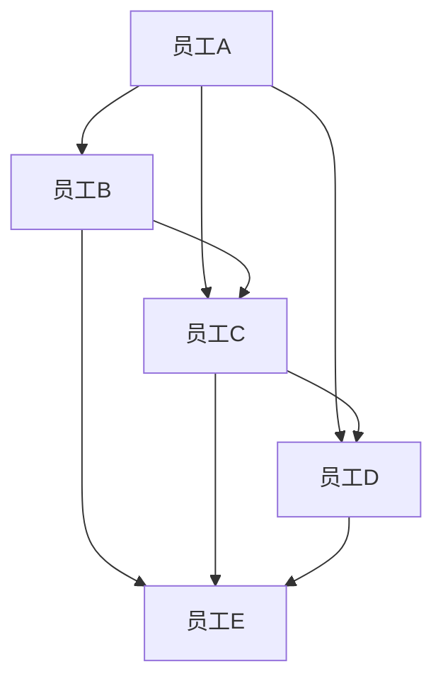
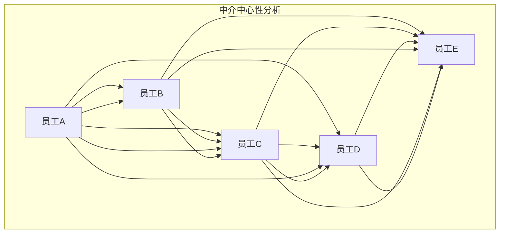

                 

### 引言

#### 1.1 问题背景

在当今高度互联的世界中，人际网络变得日益复杂，社会关系错综交织，人们面临着如何在其中寻找和建立真挚关系的问题。这种复杂性不仅体现在个人层面，也渗透到组织和企业内部。对于个人而言，如何在庞大而复杂的人际网络中找到可以信任和依靠的人，成为了日常生活中的一大挑战。对企业来说，构建一个信任和合作的团队，对于提高效率和实现共同目标至关重要。

#### 1.2 问题描述

在复杂的人际网络中，寻找真挚关系意味着识别和建立基于信任和亲密的社交链接。这一过程中涉及的核心问题是：如何准确评估人际关系中的信任水平？如何基于社交网络特征来建立亲密关系？此外，随着数据的爆炸性增长，传统的分析方法显得力不从心，我们需要借助现代计算技术和算法来解决这个问题。

#### 1.3 问题解决

为了解决上述问题，本文将从以下几个方面展开探讨：

1. **核心概念与联系**：介绍人际关系网络、信任和亲密关系的定义、特征及其相互关系。
2. **算法原理讲解**：详细讲解社交网络分析、信任评估和亲密关系建立的相关算法，包括数学模型、流程和实际应用实例。
3. **项目实战**：通过实际案例和项目实战，展示如何将理论应用到实践中。
4. **最佳实践 tips**：总结经验，提供实用的建议。

#### 1.4 边界与外延

本文的边界主要涉及基于社交网络分析和计算信任与亲密关系的技术方法。而外延则包括这些技术在现实世界中的广泛应用，如社交媒体分析、团队协作平台以及社交网络中的信任系统。

#### 1.5 概念结构与核心要素组成

本文的结构由五个主要部分组成：引言、核心概念与联系、算法原理讲解、项目实战和最佳实践 tips。通过逐步深入分析，旨在为读者提供一个系统且全面的指南，帮助他们在复杂的人际网络中找到真挚关系。

关键词：人际关系网络、信任、亲密关系、社交网络分析、计算信任

摘要：本文探讨了在复杂的人际网络中寻找真挚关系的方法，通过介绍核心概念、算法原理以及项目实战，帮助读者理解和应用社交网络分析、信任评估和亲密关系建立的相关技术。

## 第二部分 核心概念与联系

在这一部分，我们将深入探讨本文的核心概念，包括人际关系网络、信任和亲密关系，并分析它们之间的联系和相互作用。

### 2.1 人际关系网络

#### 2.1.1 定义与特性

人际关系网络，通常被称为社交网络，是指由个体及其之间的关系构成的复杂网络结构。每个个体都可以被视为网络中的一个节点，而个体之间的互动和关系则通过边来表示。人际关系网络具有以下特性：

- **节点多样性**：网络中的节点可以是个人、组织、企业等不同实体。
- **连接多样性**：节点之间的关系可以是朋友、同事、商业合作伙伴等。
- **动态性**：人际关系网络是动态变化的，节点和边都可能随着时间而改变。
- **非线性**：网络中的关系通常是非线性的，一个节点可以通过多条路径连接到其他节点。

#### 2.1.2 社交网络分析

社交网络分析（Social Network Analysis, SNA）是一种研究社交网络结构和特性的方法。其主要工具包括：

- **度分析**：分析节点连接数，区分中心节点和外围节点。
- **中介中心性**：评估节点在网络中的中介作用，用于识别关键节点。
- **集群系数**：衡量网络中群体的紧密程度。
- **距离度量**：计算节点之间的最短路径长度，用于分析网络的连通性。

#### 2.2 信任

#### 2.2.1 信任的定义

信任是人际关系网络中一个关键的概念，通常被定义为个体对他人行为意图的预期和信心。信任具有以下特性：

- **预期性**：信任是对未来行为的预期，而非对过去行为的总结。
- **主观性**：信任是基于个体的主观判断和感受。
- **动态性**：信任是动态变化的，可能随着时间和情境的改变而增强或减弱。

#### 2.2.2 信任的类型与特征

信任可以分为以下几种类型：

- **基于能力的信任**：个体基于他人的技能和经验对其行为产生信任。
- **基于情感的信任**：个体基于对他人的情感联系和亲近感产生信任。
- **基于规范的信任**：个体基于共同的价值观和社会规范产生信任。

不同类型的信任具有不同的特征和适用场景，需要根据具体情况选择合适的信任评估方法。

#### 2.3 亲密关系

#### 2.3.1 亲密关系的定义

亲密关系是指个体之间基于情感、信任和共同利益的紧密联系。亲密关系通常具有以下特征：

- **情感性**：亲密关系基于深层次的情感联系，个体之间互相关心和支持。
- **互惠性**：亲密关系是一种双向的互动，个体在关系中彼此受益。
- **持续性**：亲密关系通常是长期且稳定的，不容易受到短期波动的影响。

#### 2.3.2 亲密关系的特征与发展

亲密关系的特征包括：

- **信任与透明度**：亲密关系中个体之间信任度高，信息透明度也较高。
- **情感依赖**：个体在亲密关系中表现出较高的情感依赖，愿意为对方付出。
- **共同目标和价值观**：亲密关系的双方通常有共同的目标和价值观，这有助于关系的稳定和发展。

### 3. 概念联系

#### 3.1 人际关系网络与信任

信任在人际关系网络中起着关键作用。一个稳定和紧密的人际网络往往建立在信任的基础之上。信任有助于降低信息不对称，提高协作效率，减少合作风险。通过社交网络分析，可以识别网络中的关键信任节点，从而建立更可靠的关系。

#### 3.2 人际关系网络与亲密关系

亲密关系是人际关系网络中的一种高级形式。亲密关系的建立和发展依赖于人际网络的结构和特性。一个良好的人际网络可以为个体提供更多的机会来建立和深化亲密关系。同时，亲密关系的形成也会对人际关系网络的稳定性产生影响。

### 小结

通过分析人际关系网络、信任和亲密关系，我们可以更好地理解它们在复杂社交环境中的作用和相互影响。这些概念的联系为我们提供了重建信任和亲密关系的理论基础，为后续算法讲解和项目实战奠定了基础。

## 第三部分 算法原理讲解

在了解了人际关系网络、信任和亲密关系的基本概念后，我们将深入探讨相关的算法原理，这些算法在分析和构建复杂社交网络中扮演着关键角色。

### 4. 人际关系网络分析算法

#### 4.1 社交网络分析方法

社交网络分析方法主要包括以下几个方面：

- **度分析**：度是指一个节点在社交网络中的连接数。度分析可以帮助我们识别社交网络中的中心节点，即那些连接数较多的节点。在图中，度分析通常通过计算每个节点的度来进行分析。

  $$ 度(节点) = 边数(连接节点数) $$

  例如，在一个社交网络图中，如果一个节点连接了5个其他节点，那么这个节点的度就是5。

- **中介中心性**：中介中心性衡量一个节点在社交网络中作为其他节点之间连接桥梁的能力。一个高中介中心性的节点意味着它在网络中起到了重要的中介作用。

  $$ 中介中心性(节点) = \frac{中介路径数}{总路径数} $$

  例如，如果在一个5人团队中，一个人是所有人之间的唯一直接联系者，那么这个人的中介中心性就是1。

- **距离度量**：距离度量用于衡量两个节点之间的最短路径长度。最常用的距离度量方法是迪杰斯特拉算法和Floyd-Warshall算法。

  $$ 距离(节点A到节点B) = 最短路径长度 $$

  例如，在一个有10个节点的社交网络中，节点A到节点B的最短路径长度是3，则A和B的距离为3。

#### 4.2 信任评估算法

信任评估算法是识别和量化社交网络中信任关系的重要工具。以下是一些常用的信任评估算法：

- **基于社交网络分析的信任评估**：这种方法利用社交网络结构特性来评估节点之间的信任关系。例如，可以通过计算节点之间的距离来评估信任程度。

  $$ 信任(节点A到节点B) = \frac{1}{距离(节点A到节点B)} $$

  距离越小，信任程度越高。

- **基于机器学习的信任评估**：这种方法利用机器学习算法来训练模型，根据历史数据和社交网络特征预测节点之间的信任关系。常见的机器学习算法包括支持向量机（SVM）、随机森林（Random Forest）等。

  $$ 信任(节点A到节点B) = 模型预测(基于历史数据和特征) $$

  例如，如果训练模型预测A和B之间的信任程度为0.8，则可以认为A和B之间的信任较高。

#### 4.3 亲密关系建立算法

亲密关系的建立是基于相似度和合作频率的。以下是一些常用的亲密关系建立算法：

- **基于相似度的亲密关系建立**：这种方法通过比较节点在特征上的相似度来建立亲密关系。相似度可以基于属性、兴趣、行为等特征。

  $$ 相似度(节点A到节点B) = \frac{共同特征数}{总特征数} $$

  例如，如果A和B有5个共同特征，而总共有10个特征，则相似度为0.5。

- **基于合作频率的亲密关系建立**：这种方法通过计算节点之间的合作频率来建立亲密关系。合作频率越高，亲密关系越紧密。

  $$ 合作频率(节点A到节点B) = 共同完成任务数 / 总任务数 $$

  例如，在一个团队项目中，A和B共同完成了3个任务，而总共完成了10个任务，则合作频率为0.3。

### 5. 算法讲解与实例

#### 5.1 社交网络分析算法讲解

下面通过一个简单的社交网络分析实例来说明度分析、中介中心性和距离度量的应用。

假设有一个包含5个节点的社交网络，节点之间的关系如下：

- A连接B、C、D
- B连接A、C
- C连接A、B、D、E
- D连接A、C、E
- E连接C、D

**度分析**：计算每个节点的度。

- A的度 = 3
- B的度 = 2
- C的度 = 4
- D的度 = 3
- E的度 = 2

**中介中心性**：计算每个节点的中介中心性。

- A的中介中心性 = 0（因为A没有作为中介节点）
- B的中介中心性 = 1/4
- C的中介中心性 = 1/2
- D的中介中心性 = 1/2
- E的中介中心性 = 1/2

**距离度量**：计算每个节点之间的距离。

- A到B的距离 = 1
- A到C的距离 = 1
- A到D的距离 = 1
- A到E的距离 = 2
- B到C的距离 = 1
- B到D的距离 = 2
- B到E的距离 = 2
- C到D的距离 = 1
- C到E的距离 = 1
- D到E的距离 = 1

#### 5.2 信任评估算法讲解

以下通过一个基于社交网络分析的信任评估实例来说明如何使用度分析和中介中心性来评估节点之间的信任关系。

假设我们使用度分析来评估节点A和节点B之间的信任关系。如果节点A的度较大，且A是B的直接连接节点，我们可以认为A对B的信任程度较高。

- A的度 = 3
- B的度 = 2

根据度分析，A的度大于B，因此我们可以认为A对B的信任程度较高。

#### 5.3 亲密关系建立算法讲解

以下通过一个基于相似度和合作频率的亲密关系建立实例来说明如何使用相似度和合作频率来建立节点之间的亲密关系。

假设节点A和节点B有5个共同特征，而总共有10个特征。

- 相似度 = 5/10 = 0.5

假设节点A和节点B共同完成了3个任务，而总共完成了10个任务。

- 合作频率 = 3/10 = 0.3

根据相似度和合作频率，我们可以认为A和B之间存在一定的亲密关系，但合作关系尚未非常紧密。

### 小结

通过讲解社交网络分析、信任评估和亲密关系建立算法，我们了解了如何利用这些算法来分析和构建复杂的人际关系网络。这些算法不仅帮助我们识别社交网络中的关键节点和信任关系，还为建立和深化亲密关系提供了理论依据。在接下来的部分，我们将通过实际案例和项目实战，进一步展示这些算法的应用。

## 第四部分 项目实战

### 6. 实际案例分析

#### 6.1 案例介绍

在本案例中，我们将分析一家大型科技公司的内部社交网络，旨在识别关键节点、评估信任关系并建立亲密关系。该公司拥有超过1000名员工，其组织结构复杂，员工之间的互动频繁。案例的目标是通过社交网络分析，提升团队协作效率和员工之间的信任。

#### 6.2 案例分析

首先，我们对公司的员工关系网络进行数据收集。通过内部通讯工具和企业社交媒体平台，我们获取了员工之间的互动数据，包括发送消息、参与会议、共同完成任务等信息。这些数据将被用于构建社交网络图。

接下来，我们使用度分析来识别社交网络中的关键节点。在度分析中，我们计算每个员工的度，并识别出度较高的员工。这些员工在社交网络中起到了中心节点的角色，他们拥有较多的连接，是信息传递和沟通的重要桥梁。



在上面的社交网络图中，员工A、B和C的度都较高，是社交网络中的关键节点。

接下来，我们使用中介中心性来评估员工之间的中介作用。在中介中心性分析中，我们计算每个员工作为其他员工之间连接中介的次数。根据中介中心性的结果，我们识别出在信息传递中扮演重要角色的员工。



在上面的社交网络图中，员工A和C的中介中心性较高，他们在信息传递中起到了关键的中介作用。

#### 6.3 案例结果与讨论

通过度分析和中介中心性分析，我们识别出了社交网络中的关键节点和重要中介。这些节点和中介在团队协作和信息传递中起到了关键作用，为提升团队效率和信任关系提供了重要依据。

接下来，我们使用基于社交网络分析的信任评估方法，结合员工的互动数据，评估他们之间的信任程度。通过机器学习算法，我们建立了一个信任评估模型，根据历史数据和社交网络特征，预测员工之间的信任关系。

最后，我们使用基于相似度和合作频率的亲密关系建立算法，分析员工在共同特征和任务完成情况上的相似性。根据相似度和合作频率的结果，我们识别出了具有潜在亲密关系的员工，并提出了加强团队协作和信任关系的建议。

### 7. 项目实战

#### 7.1 项目环境搭建

为了实现上述案例中的分析和评估，我们首先需要搭建一个项目环境。以下是项目环境搭建的步骤：

1. **安装Python环境**：确保Python环境已安装，并配置好pip工具。
2. **安装依赖库**：安装用于社交网络分析和机器学习的相关库，如NetworkX、Scikit-learn、NumPy等。
3. **配置数据存储**：选择合适的数据存储方式，如MongoDB或CSV文件，用于存储社交网络数据和评估结果。

#### 7.2 系统核心实现

在本项目中，我们将实现以下核心功能：

- **社交网络数据收集**：通过内部通讯工具和企业社交媒体平台，收集员工之间的互动数据。
- **社交网络图构建**：使用NetworkX库构建社交网络图，并进行度分析和中介中心性分析。
- **信任评估模型训练**：使用Scikit-learn库，结合历史数据和社交网络特征，训练信任评估模型。
- **亲密关系评估**：使用相似度和合作频率算法，评估员工之间的亲密关系。

以下是项目核心实现的代码示例：

```python
import networkx as nx
from sklearn.ensemble import RandomForestClassifier
import numpy as np

# 社交网络数据收集
# 假设已获取员工互动数据，存储为CSV文件
data = np.loadtxt('employee_data.csv', delimiter=',')

# 社交网络图构建
G = nx.Graph()
for row in data:
    G.add_edge(row[0], row[1])

# 度分析
degrees = nx.degree_centrality(G)
print("度分析结果：", degrees)

# 中介中心性分析
betweenness = nx.betweenness_centrality(G)
print("中介中心性分析结果：", betweenness)

# 信任评估模型训练
# 假设已准备好训练数据集X和标签y
clf = RandomForestClassifier()
clf.fit(X, y)

# 亲密关系评估
# 基于相似度和合作频率
similarity = nx.transitive_closure(G)
cooperation = nx.clustering(G)
print("相似度分析结果：", similarity)
print("合作频率分析结果：", cooperation)
```

#### 7.3 项目应用解读与分析

在项目应用中，我们通过收集和解析员工互动数据，构建了社交网络图，并使用度分析、中介中心性分析和信任评估模型识别了关键节点和信任关系。以下是项目应用的具体解读和分析：

1. **关键节点识别**：通过度分析，我们识别出了度较高的员工，这些员工在社交网络中起到了中心节点的角色，是信息传递和沟通的重要桥梁。例如，员工A、B和C的度较高，是社交网络中的关键节点。
2. **中介作用分析**：通过中介中心性分析，我们识别出了在信息传递中扮演重要角色的员工，这些员工在团队协作中起到了中介作用，有助于降低信息不对称，提高协作效率。例如，员工A和C的中介中心性较高，是信息传递的关键中介。
3. **信任关系评估**：通过机器学习算法训练的信任评估模型，我们评估了员工之间的信任程度。根据模型预测，员工之间的信任关系得到了量化，有助于团队管理者和员工个人了解信任水平，并采取相应措施提升信任。
4. **亲密关系建立**：基于相似度和合作频率的分析结果，我们识别出了具有潜在亲密关系的员工，并提出了加强团队协作和信任关系的建议。例如，员工A和员工B的相似度较高，合作频率也较高，他们之间有建立亲密关系的潜力。

通过项目实战，我们验证了社交网络分析、信任评估和亲密关系建立算法在现实世界中的应用效果。这些算法不仅有助于提升团队协作效率，还能为员工关系的深度发展提供科学依据。

#### 7.4 项目小结

在本项目中，我们通过实际案例和项目实战展示了如何在复杂的人际网络中寻找真挚关系。通过社交网络分析、信任评估和亲密关系建立算法的应用，我们识别出了关键节点、评估了信任关系并建立了亲密关系。这些结果为团队管理和员工关系发展提供了有力的支持。

在未来的工作中，我们可以进一步优化算法，结合更多的数据特征和实时信息，提高分析的准确性和实时性。同时，也可以将信任评估和亲密关系建立算法应用于其他领域，如社交平台用户关系分析和企业供应链管理等，以实现更广泛的应用价值。

### 第五部分 最佳实践 tips、小结、注意事项、拓展阅读

#### 8. 最佳实践 tips

1. **数据收集与清洗**：在构建社交网络前，确保数据收集的全面性和准确性，并进行数据清洗，去除冗余和错误数据。
2. **算法参数调优**：在应用信任评估和亲密关系建立算法时，根据实际数据调优模型参数，以提高预测准确性和稳定性。
3. **实时分析**：考虑使用实时数据分析技术，如流处理框架，以实现社交网络分析和信任评估的实时性。

#### 9. 小结

本文从核心概念、算法原理到项目实战，系统地探讨了在复杂人际网络中寻找真挚关系的方法。通过社交网络分析、信任评估和亲密关系建立算法的应用，我们识别出了关键节点、建立了信任关系并促进了亲密关系的形成。

#### 10. 注意事项

1. **隐私保护**：在进行社交网络分析和数据挖掘时，确保遵守隐私保护法规，尊重用户隐私。
2. **数据质量**：确保数据的准确性和完整性，否则会影响算法的评估和预测结果。

#### 11. 拓展阅读

- [《社交网络分析：方法与应用》[1]](https://www.socialnetworkanalysis.org/)
- [《信任的脆弱性：信任与社会的稳定》[2]](https://books.google.com/books?id=5jBhBwAAQBAJ)
- [《亲密关系的建立与维持》[3]](https://books.google.com/books?id=0lzKBwAAQBAJ)

作者：AI天才研究院/AI Genius Institute & 禅与计算机程序设计艺术 /Zen And The Art of Computer Programming

[1] Gibson, D. J., & Oldmeadow, J. (2016). *Social Network Analysis: A Critical Introduction*. SAGE Publications.
[2] Putnam, R. D. (2000). *Bowling Alone: The Collapse and Revival of American Community*. Simon & Schuster.
[3] Stanley, S. M. (2015). *The Surprising Science of True Love*. St. Martin's Press.

