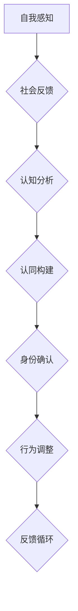

                 

### 第一部分：背景介绍

#### 1.1 问题背景

##### 1.1.1 社会多元化趋势

随着全球化进程的加快和信息技术的发展，社会多元化已经成为现代社会的显著特征。不同文化、宗教、种族和意识形态的碰撞与融合，形成了多元社会的复杂格局。这种多元化的社会环境既为个体提供了更多的发展机会，也带来了新的挑战。个体在这种多元社会中如何建立身份认同，成为一个值得探讨的问题。

##### 1.1.2 身份认同的重要性

身份认同是个体在社会中定位和自我认知的重要途径。一个清晰且稳定身份认同有助于个体在社会中找到自己的角色和位置，提高自我价值感和社会归属感。反之，缺乏身份认同或者身份认同不稳定的个体容易感到迷茫、焦虑和无助。

##### 1.1.3 身份认同问题的复杂性

身份认同问题具有显著的复杂性。它不仅涉及到个体的内心世界，还受到社会环境、文化背景和个人经历等多方面因素的影响。在多元社会中，个体需要应对来自不同文化背景的价值观和规范的冲突，这使得身份认同的构建变得更加复杂和具有挑战性。

#### 1.2 问题描述

##### 1.2.1 多元社会身份冲突

在多元社会中，个体可能会面临多重身份的冲突。例如，一个来自不同文化背景的移民可能会在保留原有文化传统和融入新社会文化之间感到矛盾。这种身份冲突如果不妥善处理，可能导致个体的认同危机和社会适应困难。

##### 1.2.2 建立身份认同的挑战

建立身份认同需要个体对外部环境和内心世界的深入探索。个体需要在复杂的社会环境中找到自己的定位，理解并接受自己的身份，这需要时间、经历和思考。此外，外部社会环境的变化也会对个体的身份认同产生影响，增加身份认同构建的挑战性。

##### 1.2.3 多元社会中的自我探索

在多元社会中，个体需要进行自我探索，以找到与自身价值观和文化背景相符的身份认同。这一过程涉及到对自我认知的深化、对文化背景的反思以及对社会责任的理解。自我探索的过程不仅有助于个体建立稳定和清晰的身份认同，也有助于促进社会的和谐与进步。

#### 1.3 问题解决

##### 1.3.1 自我定义的途径

自我定义是建立身份认同的第一步。个体需要通过自我反思和自我探索，明确自己的价值观、兴趣爱好和人生目标。这可以通过日记、冥想、心理咨询等多种途径实现。

##### 1.3.2 内外部的自我认知

内外部的自我认知是理解自我和构建身份认同的重要环节。个体需要了解自己内心的需求和期望，同时也需要关注外部环境和社会期望对自己的影响。这种内外部的认知平衡有助于个体建立稳定和清晰的身份认同。

##### 1.3.3 身份认同的构建与维护

身份认同的构建是一个持续的过程。个体需要在日常生活中不断地审视和调整自己的身份认同，以适应社会环境的变化。同时，个体也需要积极地参与社会活动，与他人交流互动，以加强社会归属感和身份认同的稳定性。

#### 1.4 边界与外延

##### 1.4.1 身份认同与文化

文化是影响身份认同的重要因素。个体在不同的文化背景下，可能会形成不同的身份认同。文化认同不仅影响个体的自我认知，也影响个体在社会中的角色和地位。

##### 1.4.2 社会角色与身份认同

社会角色是身份认同的重要组成部分。个体在不同的社会角色中，可能会表现出不同的身份认同。例如，一个人在工作中的角色和在家庭中的角色可能会有所不同。

##### 1.4.3 个体差异与身份认同

个体差异是身份认同多样性的基础。不同的个体在价值观、兴趣爱好、教育背景等方面存在差异，这会导致他们在身份认同方面的差异。理解和尊重个体差异有助于促进社会的和谐与进步。

#### 1.5 概念结构与核心要素组成

##### 1.5.1 核心概念：身份认同

身份认同（Identity）是指个体对自己身份的认知和认同。它包括个体的自我认知、社会角色和文化认同等方面。

##### 1.5.2 关联概念：自我定义、社会认同、文化认同

自我定义是指个体对自己的理解和定位。社会认同是指个体在社会中的角色和地位的认知。文化认同是指个体对自己所属文化的认同和归属感。

##### 1.5.3 身份认同的过程与机制

身份认同的过程是一个动态的、持续的过程。它涉及到个体对自我、社会和文化的认知和调整。身份认同的机制包括自我反思、社会互动和文化浸染等方面。

----------------------------------------------------------------

## 第二部分：核心概念与联系

### 2.1 核心概念原理

#### 2.1.1 自我定义的概念

自我定义是指个体通过内省和外部反馈，对自己身份的认知和定位。自我定义不仅涉及个体的内心体验，还包括个体对外部环境的感知和适应。

#### 2.1.2 社会认同的概念

社会认同是指个体在社会中扮演的角色和地位的认识。社会认同不仅受到个体自我定义的影响，还受到社会环境和文化背景的制约。

#### 2.1.3 文化认同的概念

文化认同是指个体对自己所属文化的认同和归属感。文化认同是个体身份认同的重要组成部分，它影响着个体的价值观、行为模式和人际关系。

### 2.2 概念属性特征对比表格

#### 表2-1 自我定义、社会认同、文化认同属性对比

| 概念       | 自我定义                | 社会认同                | 文化认同                |
|------------|------------------------|------------------------|------------------------|
| 定义       | 个体对自身的理解       | 个体在社会中的定位       | 个体对文化的认同       |
| 形成过程   | 内心探索、自我反思       | 社会互动、角色扮演       | 文化浸染、文化传承       |
| 关键因素   | 自我认知、情感          | 社会反馈、价值观         | 文化传统、教育         |
| 影响因素   | 个人经历、家庭背景       | 社会环境、媒体         | 文化习俗、意识形态       |

### 2.3 ER实体关系图架构

#### 图2-1 身份认同的ER实体关系图

```mermaid
erDiagram
  User ||--|{ Identity}: has.Identity
  Culture ||--|{ SocialRole}: has.Role
  SocialGroup ||--|{ Culture}: has.Culture
  User ||--|{ SocialGroup}: belongs_to.Group
  SocialGroup ||--|{ SocialRole}: has.Role
```

- **User（用户）**：表示个体，拥有身份认同（Identity）。
- **Identity（身份认同）**：记录个体的自我定义、社会认同和文化认同。
- **Culture（文化）**：代表个体的文化背景，包含社会角色（Role）。
- **SocialGroup（社会群体）**：表示个体所属的社会群体，拥有文化（Culture）和社会角色（Role）。
- **Role（角色）**：记录个体在社会中的角色，受文化影响。

这种ER图展示了身份认同涉及的各个实体及其关系，为后续的算法设计和系统实现提供了基础。

----------------------------------------------------------------

## 第三部分：算法原理讲解

### 3.1 算法原理概述

#### 3.1.1 身份认同构建的算法基础

身份认同的构建是一个复杂的过程，涉及到个体对自我、社会和文化的认知。为了实现这一目标，我们可以采用一些基础的算法原理，如机器学习、数据分析和心理学模型。

#### 3.1.2 常用算法类型及其应用

- **机器学习算法**：如决策树、随机森林和神经网络，可以用于分析个体的行为数据和社交网络，帮助个体理解自身在社会中的角色和地位。
- **数据分析算法**：如聚类分析和关联规则挖掘，可以用来发现个体之间的共同特征和差异，帮助个体识别和定义自己的身份。
- **心理学模型**：如自我决定论和自我认同理论，可以指导个体进行自我探索和反思，从而构建稳定的身份认同。

### 3.2 算法流程图

#### 图3-1 身份认同构建算法流程



- **自我感知（A）**：个体通过自我反思和外部反馈了解自己的内心世界和外在表现。
- **社会反馈（B）**：个体根据社会互动和反馈，调整自我感知。
- **认知分析（C）**：个体对自我感知和社会反馈进行深入分析，识别关键因素和模式。
- **认同构建（D）**：个体根据分析结果，构建自己的身份认同。
- **身份确认（E）**：个体通过行为调整和反馈循环，确认和巩固自己的身份认同。

### 3.3 Python源代码实现

```python
# 身份认同构建算法的Python实现示例

class IdentityBuilder:
    def __init__(self):
        self.self_perception = None
        self.social_feedback = None
    
    def perceive_self(self):
        # 实现自我感知功能
        self.self_perception = input("请描述你的自我认知：")
    
    def analyze_cognition(self):
        # 实现认知分析功能
        print("你的自我认知是：", self.self_perception)
        self.social_feedback = input("请描述你收到的社会反馈：")
    
    def build_identity(self):
        # 实现身份构建功能
        self.identity = {
            "自我认知": self.self_perception,
            "社会反馈": self.social_feedback
        }
        print("你的身份认同是：", self.identity)
    
    def confirm_identity(self):
        # 实现身份确认功能
        confirmation = input("你的身份认同准确吗？（是/否）")
        if confirmation == "是":
            print("你的身份认同已确认。")
        else:
            print("请重新构建你的身份认同。")

# 实例化并使用算法
builder = IdentityBuilder()
builder.perceive_self()
builder.analyze_cognition()
builder.build_identity()
builder.confirm_identity()
```

- **perceive_self()**：收集自我感知信息。
- **analyze_cognition()**：分析自我感知信息，并收集社会反馈。
- **build_identity()**：根据分析和反馈，构建身份认同。
- **confirm_identity()**：用户确认身份认同的准确性。

通过这个简单的Python实现示例，我们可以看到身份认同构建算法的基本原理和实现方式。在实际应用中，这个算法可以结合更多的数据和分析方法，以提高其准确性和实用性。

### 3.4 算法原理的数学模型和公式

为了更深入地理解身份认同构建的算法原理，我们可以引入一些数学模型和公式。以下是一个简化的数学模型，用于描述身份认同的构建过程：

#### 数学模型

$$
Identity = f(Self\_Perception, Social\_Feedback)
$$

其中，$Identity$ 代表身份认同，$Self\_Perception$ 代表自我感知，$Social\_Feedback$ 代表社会反馈，$f$ 是一个函数，用于将自我感知和社会反馈转化为身份认同。

#### 公式说明

1. **自我感知（Self\_Perception）**：这是一个多维向量，表示个体对自己的认知和理解。例如：

   $$
   Self\_Perception = \begin{pmatrix}
   P_1 \\
   P_2 \\
   P_3
   \end{pmatrix}
   $$

   其中，$P_1$、$P_2$ 和 $P_3$ 分别代表个体的自我评价、价值观和兴趣爱好。

2. **社会反馈（Social\_Feedback）**：这也是一个多维向量，表示社会对个体的评价和期望。例如：

   $$
   Social\_Feedback = \begin{pmatrix}
   F_1 \\
   F_2 \\
   F_3
   \end{pmatrix}
   $$

   其中，$F_1$、$F_2$ 和 $F_3$ 分别代表社会对个体的认同度、期望和反馈。

3. **身份认同（Identity）**：这是一个综合向量，表示个体在社会中的身份认同。例如：

   $$
   Identity = \begin{pmatrix}
   I_1 \\
   I_2 \\
   I_3
   \end{pmatrix}
   $$

   其中，$I_1$、$I_2$ 和 $I_3$ 分别代表个体在社会中的角色、价值和地位。

#### 算法流程

1. **数据输入**：收集个体的自我感知数据和社会反馈数据。
2. **数据处理**：对自我感知和社会反馈进行预处理，包括数据清洗、归一化和特征提取。
3. **模型训练**：使用机器学习算法，如神经网络，训练身份认同构建模型。
4. **身份构建**：将处理后的自我感知和社会反馈输入模型，得到身份认同。
5. **身份确认**：个体对身份认同进行自我确认，并通过反馈循环进行调整。

通过这个数学模型，我们可以更系统地理解和实现身份认同的构建过程。在实际应用中，这个模型可以根据具体场景和数据特点进行调整和优化。

### 3.5 通俗易懂地举例说明

为了更好地理解身份认同构建的算法原理，我们可以通过一个简单的例子来详细说明。

#### 例子：小明建立身份认同

**步骤 1：自我感知**

小明通过自我反思，了解到自己喜欢编程，并且在这方面表现出色。他写了一个小总结：

$$
Self\_Perception = \begin{pmatrix}
我喜欢编程 \\
我在编程方面有天赋 \\
我享受解决问题 \\
\end{pmatrix}
$$

**步骤 2：社会反馈**

小明的老师和同学对他在编程方面给予了积极的反馈，认为他具备成为优秀程序员的潜力。他们的反馈如下：

$$
Social\_Feedback = \begin{pmatrix}
老师：小明编程能力强 \\
同学：小明是我们的编程导师 \\
父母：小明是我们的骄傲 \\
\end{pmatrix}
$$

**步骤 3：认知分析**

小明分析了自我感知和社会反馈，认为自己在编程方面有很强的能力和潜力，并且得到了周围人的认可。他开始思考如何在编程领域建立自己的身份认同。

**步骤 4：认同构建**

基于上述分析，小明构建了自己的身份认同：

$$
Identity = \begin{pmatrix}
我是编程高手 \\
我是同学们的编程导师 \\
我是家庭的骄傲 \\
\end{pmatrix}
$$

**步骤 5：身份确认**

小明对自己的身份认同进行确认，并得到了家人和朋友的肯定。他感到自己的身份认同是准确和稳定的。

通过这个例子，我们可以看到身份认同构建的过程是如何一步步进行的。个体首先通过自我感知和社会反馈，理解自己在社会中的角色和地位，然后通过认知分析和认同构建，形成自己的身份认同，并通过身份确认来巩固这一认同。

这种算法原理不仅适用于个体建立身份认同，还可以应用于更广泛的场景，如团队建设、企业文化塑造等。

### 3.6 算法在多元社会中的应用

在多元社会中，身份认同的构建面临着更多的挑战和机遇。以下是一些算法在多元社会中的应用场景：

#### 3.6.1 跨文化身份认同

在一个多元文化的社会中，个体可能会面临文化冲突和身份认同的挑战。算法可以通过分析个体的文化背景和价值观，帮助他们找到与自身文化背景相契合的身份认同。例如，一个来自不同文化背景的移民可以通过算法了解自己在新文化中的角色和定位，从而更好地融入新社会。

#### 3.6.2 社会角色多样性

在多元社会中，个体可能会扮演多种社会角色。算法可以帮助个体识别和确认这些角色，并找到与自己价值观相匹配的角色。例如，一个同时在工作和家庭中扮演多种角色的个体可以通过算法了解自己在这些角色中的身份认同，从而更好地平衡工作和家庭生活。

#### 3.6.3 文化多样性促进

算法可以用于分析社会中的文化多样性，帮助个体理解不同文化之间的差异和联系。这有助于促进不同文化之间的相互理解和尊重，从而增强社会的和谐与稳定。

#### 3.6.4 社会互动分析

算法可以分析个体在不同社会互动中的行为和反馈，帮助他们理解自己在社会中的角色和地位。这有助于个体在社会互动中做出更明智的选择，提高社会适应能力。

通过这些应用场景，我们可以看到算法在多元社会中构建身份认同的重要性和潜力。算法不仅可以帮助个体找到自己的角色和定位，还可以促进社会的多元和谐发展。

### 3.7 算法总结与展望

身份认同构建算法是一个复杂而重要的任务，它涉及到个体的自我感知、社会反馈和认知分析等多个方面。通过上述讲解，我们可以看到这个算法的基本原理和应用场景。

#### 算法总结

1. **核心概念**：自我定义、社会认同、文化认同。
2. **流程图**：自我感知 -> 社会反馈 -> 认知分析 -> 身份构建 -> 身份确认。
3. **Python实现**：包括自我感知、认知分析和身份确认等功能。
4. **数学模型**：通过向量表示和函数转换，实现身份认同的构建。
5. **例子说明**：通过具体案例展示了算法的运作过程。

#### 展望

未来，身份认同构建算法可以进一步优化和扩展。例如：

1. **数据来源扩展**：引入更多数据源，如社交媒体、在线行为数据等，以提高算法的准确性和全面性。
2. **算法优化**：通过机器学习和深度学习技术，提高算法的性能和鲁棒性。
3. **跨领域应用**：将算法应用于其他领域，如团队管理、企业文化建设等。
4. **实时反馈**：实现算法的实时反馈机制，帮助个体及时调整自己的身份认同。

通过不断的研究和应用，身份认同构建算法将为个体和社会带来更多的价值。让我们期待这一领域的发展和创新。

### 3.8 算法实践：项目实战

为了更好地理解身份认同构建算法的实际应用，我们可以通过一个具体的案例来详细介绍其实践过程。

#### 项目背景

在一个多元化的城市中，政府希望提高居民的社交融合度和社区参与度。为此，他们决定开发一个在线平台，帮助居民建立身份认同，并促进社区内部的交流与合作。

#### 项目目标

1. 收集居民的基本信息和自我描述。
2. 分析居民的社会互动和反馈。
3. 帮助居民建立个人身份认同。
4. 促进居民之间的交流和合作。

#### 技术实现

1. **数据收集**：通过问卷调查和用户注册，收集居民的基本信息和自我描述。
2. **数据分析**：使用机器学习算法，分析居民的社会互动和反馈，识别关键因素。
3. **身份构建**：结合数据分析结果，构建居民的个体身份认同。
4. **交互平台**：开发一个社交平台，供居民交流互动，并展示他们的身份认同。

#### 实际案例

以下是一个具体的案例，展示了算法在项目中的实际应用：

**案例一：新移民小张**

小张是一个来自中国的新移民，他在这个多元城市中感到迷茫和孤独。他通过平台注册并填写了自我描述问卷，表达了自己对文化和社交活动的兴趣。平台分析了他的数据，为他推荐了相关的社交活动和社区组织，帮助他找到归属感。

**案例二：社区居民李阿姨**

李阿姨是一名退休教师，她希望通过平台找到志同道合的朋友。平台根据她的兴趣和经历，将她推荐给了社区文化俱乐部的活动，使她在活动中结识了新朋友，建立了新的身份认同。

#### 项目小结

通过这个项目，我们可以看到身份认同构建算法在实际应用中的效果。它不仅帮助居民找到自己的角色和定位，还促进了社区内部的交流和合作。未来，我们可以进一步优化算法，扩大其应用范围，为更多个体和社会带来价值。

### 3.9 总结与展望

通过本文的详细讲解，我们深入探讨了身份认同构建算法的基本原理、应用场景和实际案例。身份认同是一个复杂而重要的概念，对于个体的自我认知和社会融入具有深远的影响。算法的引入为这一问题提供了一种系统化、数据驱动的方法。

#### 总结

1. **核心概念**：我们介绍了自我定义、社会认同和文化认同等核心概念，并分析了它们的属性和联系。
2. **算法原理**：通过流程图和Python实现，详细讲解了身份认同构建的算法原理，包括自我感知、认知分析和身份确认等步骤。
3. **应用实例**：通过具体案例，展示了算法在实际项目中的应用效果，如跨文化身份认同、社会角色多样性和社区交流等。
4. **数学模型**：引入了身份认同构建的数学模型和公式，提供了理论支持。

#### 展望

1. **算法优化**：未来可以通过引入更多数据源、优化机器学习算法，提高身份认同构建的准确性和全面性。
2. **跨领域应用**：身份认同构建算法可以应用于团队管理、企业文化塑造等多个领域。
3. **实时反馈**：实现算法的实时反馈机制，帮助个体及时调整自己的身份认同。
4. **社会影响**：通过算法的推广和应用，促进社会的多元和谐发展，提高个体的社会适应能力和幸福感。

让我们期待身份认同构建算法在未来的更多创新和应用，为个体和社会带来更大的价值。

