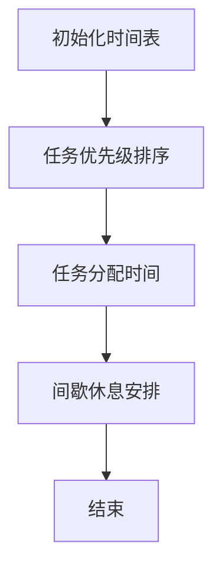
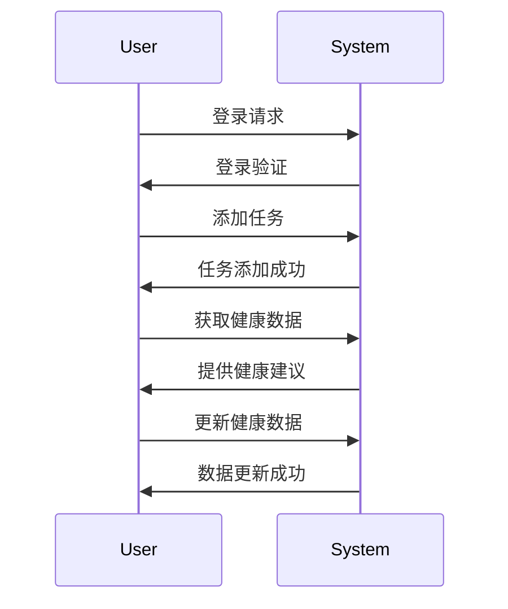
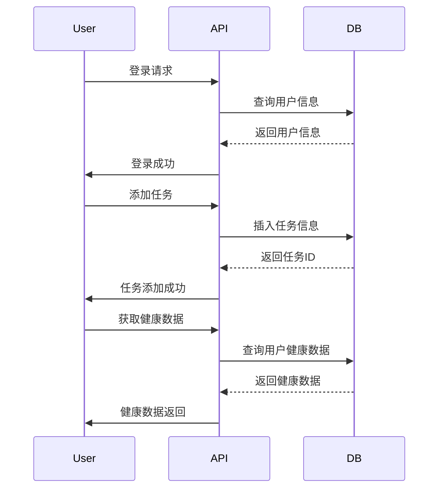
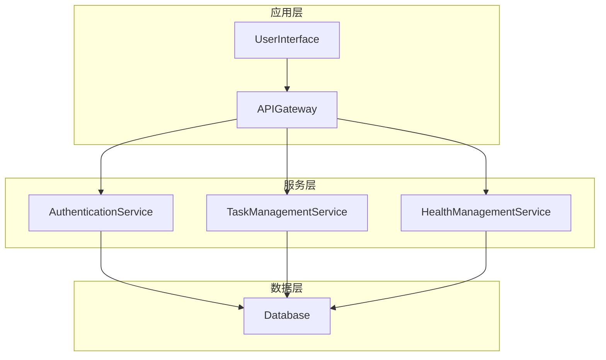

                 

### 引言：快节奏生活下的挑战

在现代社会，快节奏生活已成为一种普遍现象，从城市到乡村，从职场到家庭，快节奏的生活方式似乎无处不在。这种生活方式的起源可以追溯到工业化时代，随着生产力的大幅提升，人们的生活节奏也在不断加快。然而，这种快节奏的生活模式不仅给个体的身心健康带来了巨大的压力，也对整个社会产生了深远的影响。

首先，让我们来探讨快节奏生活的起源与影响。工业化时代是人类历史上一个重要的转折点，生产力的提升带来了经济的高速发展，但同时也使得人们的生活节奏加快。在工业化的初期，人们为了追求更高的工作效率，开始采用流水线生产方式，这导致了工作时间的缩短和工作量的增加。随着经济的发展，市场竞争日益激烈，人们为了在职场上保持竞争力，不得不加班加点，从而形成了一种快节奏的工作文化。

现代社会的快节奏现象更是无处不在。从早晨起床开始，人们就进入了忙碌的状态。赶地铁、赶公交、赶工作，几乎每个人都在争分夺秒地追求效率。而在工作之余，人们的生活也变得愈加紧凑，各种社交活动、娱乐项目让人应接不暇。这种快节奏的生活方式在一定程度上提高了人们的生活质量，但同时也带来了许多负面影响。

快节奏生活对个体和社会的负面影响是不可忽视的。首先，它对个体的身心健康造成了巨大的压力。长期处于高压环境下，人们容易出现焦虑、抑郁等心理问题，同时，身体也会因为过度劳累而出现各种健康问题。其次，快节奏的生活方式也影响了人们的人际关系。由于时间紧迫，人们往往没有足够的时间去深入沟通，从而导致了人际关系的疏离。此外，快节奏生活还对社会的稳定和发展产生了不利影响。在快节奏的生活压力下，人们容易产生不满情绪，从而影响社会的和谐稳定。

面对快节奏生活带来的挑战，我们需要思考如何重构生活质量和意义。慢生活作为一种应对策略，逐渐受到人们的关注。慢生活并不是指停止前进，而是在追求效率的同时，注重生活的质量和深度。它提倡放慢脚步，回归内心，寻找生活的本质。慢生活不仅有助于改善个体的身心健康，还能促进社会的可持续发展。

在接下来的章节中，我们将进一步探讨慢生活的概念与价值，以及如何在快节奏生活中实践慢生活理念，重构生活质量和意义。我们将通过实际案例研究，分析慢生活实践的效果，并给出具体的建议和展望。希望通过这些探讨，能够为读者在快节奏生活中找到慢生活的平衡点，重建生活质量和意义提供一些有益的启示。

### 慢生活的概念与价值

慢生活，作为一种生活方式，其概念源于对快节奏生活的反思和批判。它并非简单地放慢生活节奏，而是一种更加注重生活质量和深度的生活方式。慢生活的核心在于“慢”，但这并不意味着停滞不前，而是强调在生活各个方面追求平衡、和谐和满足。

首先，慢生活的定义可以从多个维度进行解读。从字面上理解，慢生活就是放慢生活节奏，减少不必要的忙碌和压力。然而，这种生活方式的内涵远不止于此。慢生活倡导的是一种全面的生活态度和价值观，它包括对时间、空间、人际关系、身心健康等多个方面的重视。

从时间管理的角度来看，慢生活主张合理分配时间，避免过度追求效率和速度。在快节奏的生活中，人们常常为了完成工作任务而牺牲休息和娱乐时间，导致身心疲惫。而慢生活则强调在工作与休息之间找到平衡，通过合理规划时间，提高工作效率，从而有更多的时间去享受生活。

在空间营造方面，慢生活强调创造一个舒适、宁静的生活环境。这不仅包括物理空间，如家、办公室等，还包括心理空间。在快节奏的生活中，人们往往感到压力和焦虑，而慢生活通过营造一个安静、舒适的环境，有助于减轻压力，提升生活质量。

在人际关系方面，慢生活倡导建立深入、真诚的人际关系。在快节奏的生活中，人们常常为了工作而忽视与家人、朋友的交流，导致人际关系疏离。而慢生活则强调花时间与家人、朋友相处，通过深入交流，增强情感纽带，提升生活的幸福感。

在身心健康方面，慢生活提倡关注身心健康，通过适当的锻炼、饮食和休息，保持身体和心理的健康。在快节奏的生活中，人们往往忽视了对身体和心理的呵护，而慢生活则通过调整生活方式，提高生活质量，延长寿命。

慢生活的核心价值在于其对生活质量的提升。首先，慢生活有助于改善身心健康。通过合理分配时间，减少工作压力，人们可以更好地关注自己的身心健康，降低心理和身体疾病的风险。其次，慢生活有助于提升人际关系的质量。在慢生活的理念下，人们更加注重与家人、朋友的深入交流，增强情感纽带，提升生活的幸福感。最后，慢生活有助于实现个人成长和发展。在慢生活的环境中，人们有更多的时间去思考和反思，探索自己的兴趣和激情，实现个人价值和成长。

总之，慢生活是一种追求平衡、和谐和满足的生活方式，其核心价值在于提升生活质量。通过放慢生活节奏，关注身心健康、人际关系和个人成长，慢生活为人们提供了一种新的生活范式，帮助我们在快节奏的生活中找到平衡，重建生活质量和意义。

### 重构生活质量和意义

在快节奏的生活中，重构生活质量和意义显得尤为重要。生活质量不仅关乎个体的身心健康，还直接影响社会的和谐与进步。那么，如何通过慢生活的理念和实践来重构生活质量和意义呢？我们可以从以下几个方面进行探讨。

首先，重建生活质量的必要性不言而喻。在快节奏的生活中，人们往往为了追求效率和目标而忽略了生活的本质。长时间的工作压力、高强度的学习和生活节奏使得个体身心疲惫，生活质量急剧下降。长期以往，不仅会导致心理健康问题，还会影响到社会稳定。因此，通过慢生活的理念和实践，重建生活质量是必然的选择。

那么，如何通过慢生活来重建生活质量呢？首先，我们需要认识到，慢生活并非意味着停滞不前，而是追求一种平衡和和谐的生活方式。以下是几个具体的实践途径：

1. **时间管理**：在快节奏的生活中，时间管理尤为重要。通过合理安排时间，我们可以有效地平衡工作、学习和休闲。具体方法包括制定详细的时间表，优先处理重要任务，留出充足的休息和娱乐时间。例如，每天晚上睡前可以花几分钟时间回顾当天的工作和学习，规划第二天的时间安排。

2. **空间营造**：一个舒适、宁静的生活环境对提高生活质量至关重要。我们可以通过装修和装饰来打造一个符合个人喜好和需求的空间。例如，在家里设置一个安静的阅读角落，或者在工作环境中布置一些绿植，以提升工作和生活的舒适度。

3. **生活方式**：改变生活方式是重构生活质量的关键。慢生活倡导的是一种简单、自然的生活方式。我们可以从饮食、锻炼、休息等方面入手，培养健康的生活习惯。例如，选择新鲜、自然的食物，坚持每天锻炼，保证充足的睡眠时间。

4. **心理健康**：心理健康是生活质量的重要组成部分。通过冥想、瑜伽等放松技巧，我们可以缓解压力，保持心理平衡。此外，与家人、朋友的深入交流也有助于提升心理健康。例如，每周安排一次家庭聚会，或者和朋友一起去公园散步，都是很好的放松方式。

5. **社会责任**：在快节奏的生活中，我们不仅要关注个人的生活质量，还要承担起社会责任。通过参与志愿活动、支持环保等行为，我们可以为社会做出贡献，提升自己的生活意义。例如，可以参与社区清洁活动，或者捐赠物资给需要帮助的人。

通过上述实践途径，我们可以逐步重建生活质量，提升生活的意义。然而，在实践过程中，我们也需要面对一些挑战。例如，如何在繁忙的工作和学习中找到平衡？如何改变长期形成的快节奏生活习惯？这些问题都需要我们付出努力和耐心去解决。

总的来说，慢生活是一种追求平衡、和谐和满足的生活方式，它不仅有助于提高生活质量，还能为我们带来更多的内心平静和幸福感。在快节奏的生活中，通过慢生活的理念和实践，我们可以找到重建生活质量和意义的途径，过上更加充实和有意义的生活。

### 本书结构概述

为了帮助读者更好地理解和应用慢生活的理念，本书的结构安排合理，各章节内容紧密相连，形成了系统的知识体系。以下是对全书结构的概述：

#### 全书结构安排

本书分为五个主要部分，每部分都有其独特的主题和目标，旨在全面探讨慢生活的概念、实践、效果以及未来展望。

1. **第一部分：慢生活的理念与实践**  
   本部分主要介绍慢生活的核心概念和实践方法。通过详细探讨慢生活的哲学基础、核心原则和实践途径，帮助读者理解慢生活的本质和重要性。

2. **第二部分：慢生活下的工作与学习**  
   本部分关注如何在快节奏的工作和学习环境中实践慢生活。通过分析工作中的慢生活实践、学习的慢生活理念以及对职业发展的影响，帮助读者在实际生活中找到平衡。

3. **第三部分：慢生活与人际关系**  
   本部分探讨慢生活对人际关系的积极影响。从家庭关系、社会关系到人际沟通，通过实际案例和研究，展示慢生活如何提升人际关系的质量。

4. **第四部分：慢生活的案例研究**  
   本部分通过国内外慢生活实践案例的深入分析，探讨慢生活在不同场景中的应用效果。通过对案例中的问题和挑战进行分析，为读者提供实用的经验和策略。

5. **第五部分：结论与建议**  
   本部分总结全书内容，强调慢生活的重要性，并提供具体的建议和展望。通过反思慢生活对个人和社会的意义，鼓励读者在日常生活中实践慢生活理念。

#### 各章节内容概述

在每一部分中，各章节的内容也进行了详细的安排，确保读者能够系统地学习和应用慢生活的理念。

1. **第一部分：慢生活的理念与实践**  
   - 第1章：引言：快节奏生活下的挑战  
     探讨快节奏生活带来的负面影响，引入慢生活的概念和价值。

   - 第2章：慢生活的理念  
     详细介绍慢生活的哲学基础、核心原则和实践方法。

   - 第3章：慢生活的实践  
     分析如何在日常生活中实践慢生活，包括时间管理、空间营造、生活方式等方面。

   - 第4章：慢生活与身心健康  
     探讨慢生活对身心健康的好处，以及如何通过慢生活改善身心健康。

   - 第5章：慢生活与社会责任  
     讨论慢生活如何促进社会责任感和可持续发展。

2. **第二部分：慢生活下的工作与学习**  
   - 第6章：工作中的慢生活实践  
     分析如何在工作环境中实践慢生活，提高工作效率和生活质量。

   - 第7章：学习的慢生活理念  
     探讨如何通过慢生活理念提升学习效果，培养终身学习的习惯。

   - 第8章：慢生活与职业发展  
     分析慢生活对职业发展的影响，以及如何在职业生涯中平衡慢生活。

3. **第三部分：慢生活与人际关系**  
   - 第9章：家庭关系中的慢生活  
     探讨如何在家庭中实践慢生活，提升家庭关系的质量。

   - 第10章：社会关系中的慢生活  
     分析如何在社会交往中实践慢生活，建立深入的人际关系。

   - 第11章：慢生活与人际沟通  
     探讨慢生活如何促进有效的沟通，改善人际关系。

4. **第四部分：慢生活的案例研究**  
   - 第12章：国内外慢生活实践案例  
     通过国内外慢生活实践案例的深入分析，展示慢生活在不同场景中的应用效果。

   - 第13章：慢生活实践中的问题与挑战  
     分析慢生活实践中的常见问题，并提出解决方案。

   - 第14章：慢生活实践的效果评估  
     探讨如何评估慢生活实践的效果，以及评估方法的具体应用。

5. **第五部分：结论与建议**  
   - 第15章：慢生活的重要性总结  
     总结全书内容，强调慢生活对个人和社会的意义。

   - 第16章：具体建议与未来展望  
     提出具体的慢生活实践建议，并对未来慢生活的发展进行展望。

通过这样的结构安排，本书不仅为读者提供了全面、系统的慢生活知识，还通过案例研究和实际应用，帮助读者更好地理解和实践慢生活的理念。

### 第一部分：慢生活的理念与实践

慢生活的理念与实践是重建生活质量和意义的重要基础。本部分将详细探讨慢生活的核心概念、哲学基础和实践方法，帮助读者理解并应用这一理念，以实现生活质量的全面提升。

#### 2.1 慢生活的理念

慢生活并非简单的放慢节奏，而是一种深刻的生活哲学和价值观的体现。以下是对慢生活理念的具体解读：

1. **哲学基础**：
   - **存在主义**：慢生活强调个体的存在感和生命的意义，关注人的内心体验和情感需求。
   - **自然主义**：慢生活倡导回归自然，与自然和谐共处，尊重自然规律，追求与自然的平衡。
   - **后现代主义**：慢生活反对过度追求效率和目标，强调生活本身的价值，提倡多样化的生活方式。

2. **核心原则**：
   - **平衡**：慢生活强调在生活各个方面寻找平衡，包括工作与休闲、个人与家庭、身心与社会等。
   - **和谐**：慢生活追求生活中的和谐，不仅仅是人与环境的和谐，还包括人际关系、内心世界的和谐。
   - **满足**：慢生活主张在生活中寻找满足感，不仅仅是物质上的满足，更重要的是精神上的满足。

3. **与传统生活方式的比较**：
   - **传统生活方式**：传统生活方式强调集体主义和实用主义，以家庭、工作和责任为中心，追求稳定和物质财富。
   - **慢生活**：慢生活则强调个体主义和人文主义，以个人幸福和内心满足为中心，追求精神上的富足和生活质量。

#### 2.2 慢生活的实践

在实际生活中，实践慢生活需要具体的行动和方法。以下是一些关键实践途径：

1. **时间管理**：
   - **优先级排序**：将时间分配给最重要的任务和活动，避免无效忙碌。
   - **休息与放松**：每天预留一段时间进行休息和放松，如冥想、瑜伽、散步等。

2. **空间营造**：
   - **环境设计**：创造一个舒适、宁静的生活环境，如布置家居、选择柔和的灯光等。
   - **自然联系**：尽量与自然保持联系，如在家中种植植物、养宠物等。

3. **生活方式**：
   - **健康饮食**：选择新鲜、自然的食物，避免过度加工食品，保持健康饮食习惯。
   - **适量运动**：坚持适量的运动，如散步、跑步、游泳等，以保持身体健康。
   - **睡眠质量**：保证充足的睡眠时间，创造良好的睡眠环境。

4. **心理健康**：
   - **情感交流**：与家人、朋友保持开放和真诚的交流，分享情感和经验。
   - **自我反思**：定期进行自我反思，了解自己的需求、欲望和目标。

5. **社会责任**：
   - **志愿服务**：参与志愿活动，为社会做出贡献，提升自己的社会责任感。
   - **环保行动**：采取环保措施，如减少浪费、节约能源等，促进可持续发展。

#### 2.3 慢生活与身心健康

慢生活不仅是一种生活方式，更是一种对身心健康的积极追求。以下探讨慢生活对身心健康的好处以及如何通过慢生活实践改善身心健康：

1. **身心健康的好处**：
   - **心理放松**：慢生活通过减少压力和焦虑，有助于心理放松，提高心理健康水平。
   - **身体活力**：适量的运动和健康饮食有助于保持身体活力和健康。
   - **情感满足**：与家人、朋友的深入交流能带来情感满足，增强幸福感。

2. **如何通过慢生活改善身心健康**：
   - **时间管理**：合理安排时间，避免过度劳累，保证充足的休息和放松。
   - **健康习惯**：培养健康的生活习惯，如健康饮食、适量运动等。
   - **心理支持**：通过冥想、瑜伽等放松技巧，缓解心理压力，提高心理韧性。

#### 2.4 慢生活与社会责任

慢生活不仅关注个人身心健康，还强调社会责任和可持续发展。以下探讨慢生活与社会责任的关系以及如何通过慢生活实践促进社会责任感：

1. **慢生活与社会责任的关系**：
   - **可持续发展**：慢生活倡导减少浪费、节约资源，促进可持续发展。
   - **社会责任**：通过参与志愿服务、支持环保等行动，慢生活有助于提升个人的社会责任感。

2. **如何通过慢生活实践促进社会责任感**：
   - **环保行动**：采取环保措施，减少对环境的负面影响。
   - **志愿服务**：参与志愿活动，为社会做出贡献。
   - **教育宣传**：通过教育宣传，提高公众对慢生活和社会责任的认识。

通过以上探讨，我们可以看到，慢生活不仅是一种追求生活质量和幸福感的理念，更是一种积极的生活方式。它通过平衡、和谐、满足的原则，帮助我们重构生活质量和意义，实现身心健康、家庭幸福和社会责任。在接下来的章节中，我们将进一步探讨如何在实际生活中实践慢生活，提升生活质量和幸福感。

### 慢生活下的工作与学习

在现代社会，工作与学习占据了个体大部分的时间，如何在快节奏的工作和学习环境中实践慢生活理念，平衡工作与生活，提高工作效率和个人成长，是许多人都面临的问题。本章节将探讨如何在工作与学习中引入慢生活理念，分析其实际影响，并提出具体的实践方法。

#### 3.1 工作中的慢生活实践

在工作中实践慢生活理念，意味着我们需要在追求工作效率的同时，注重工作质量和个人幸福感。以下是一些具体的方法：

1. **优化时间管理**：
   - **任务优先级**：将工作任务根据重要性和紧急性进行排序，优先处理重要且紧急的任务，避免时间的浪费。
   - **固定工作节奏**：设定固定的工作时间和休息时间，避免加班和超负荷工作，保证工作的连续性和效率。
   - **间歇休息**：在工作间隙进行短暂的休息，如深呼吸、短暂的冥想或伸展运动，有助于缓解疲劳，提高工作效率。

2. **提升工作质量**：
   - **深度工作**：减少干扰，专注于当前任务，提高工作质量。例如，通过关闭社交媒体、减少会议等方式，为深度工作创造条件。
   - **合理分配任务**：将任务分配给适合的人员，避免资源浪费和重复劳动，提高整体工作效率。

3. **培养工作习惯**：
   - **健康工作环境**：改善工作环境，如保持办公桌整洁、增加绿植等，提升工作舒适度。
   - **定期反思**：定期对工作方法和效果进行反思，找出改进的空间，持续优化工作习惯。

#### 3.2 学习的慢生活理念

学习是个人成长的重要途径，如何在快节奏的学习环境中实践慢生活理念，是提高学习效果和个人成长的关键。以下是一些具体的方法：

1. **合理规划学习时间**：
   - **制定学习计划**：根据学习目标，制定详细的学习计划，合理分配学习时间，避免临时突击和拖延。
   - **分散学习**：将学习任务分散在多个时间段，避免长时间连续学习造成的疲劳，提高学习效率。

2. **注重学习质量**：
   - **深度学习**：专注于当前的学习内容，避免分心和拖延，提高学习效果。例如，通过使用番茄工作法（25分钟学习+5分钟休息）来维持专注力。
   - **主动思考**：在学习过程中，主动思考问题，提出疑问，通过讨论和查阅资料来解决问题，加深对知识点的理解。

3. **培养学习习惯**：
   - **定期复习**：制定复习计划，定期复习所学内容，巩固记忆，提高学习效果。
   - **健康学习环境**：保持学习环境的整洁和舒适，减少干扰因素，如关闭手机通知、选择安静的场所等。

#### 3.3 慢生活对职业发展的影响

慢生活不仅影响个人的生活质量和身心健康，也对职业发展产生深远的影响。以下是慢生活对职业发展的几个方面的影响：

1. **提高工作效率**：
   - **专注力提升**：通过慢生活的实践，个体能够更好地集中注意力，减少分心，提高工作效率。
   - **减少疲劳**：合理的工作和休息时间安排，有助于减少工作疲劳，保持工作活力。

2. **促进个人成长**：
   - **持续学习**：慢生活鼓励深度学习和持续学习，提升个人的知识储备和专业能力。
   - **心理韧性**：通过慢生活的实践，个体能够更好地应对工作中的压力和挑战，提高心理韧性。

3. **提升职业满意度**：
   - **工作与生活的平衡**：慢生活帮助个体找到工作与生活的平衡点，提高职业满意度，减少职业倦怠。

总之，在快节奏的工作和学习环境中，实践慢生活理念，通过合理的时间管理、工作习惯和学习习惯的培养，可以提高工作效率和个人成长，促进职业发展。慢生活不仅关注工作效率，更注重生活质量和个人幸福感，为个体在职业道路上提供更为持久和稳定的动力。在接下来的章节中，我们将进一步探讨如何在人际关系、休闲文化和城市规划中实践慢生活理念，全面提升生活质量。

### 慢生活与人际关系

在现代社会中，人际关系对于个体的心理健康和社会适应能力具有至关重要的作用。快节奏的生活往往使人们忽视与家人、朋友的深入交流，导致人际关系疏离。而慢生活理念提倡放慢脚步，回归内心，通过深度交流建立和巩固人际关系。本章节将探讨慢生活对家庭关系、社会关系和人际沟通的积极影响，并通过实际案例进行分析。

#### 3.2.1 家庭关系中的慢生活

家庭是人际关系的重要组成部分，也是个体情感的重要支持系统。在快节奏的生活中，由于工作忙碌、家务繁重等因素，家庭成员之间的交流往往变得简短且表面化。而通过慢生活理念，我们可以提升家庭关系的质量。

1. **共同活动**：家庭成员可以一起参与一些共同活动，如散步、做饭、玩游戏等。这些活动不仅能增进彼此的了解，还能提高家庭的凝聚力。
2. **定期沟通**：设立家庭会议或对话时间，让每个家庭成员都有机会表达自己的想法和需求。通过定期沟通，家庭成员可以更好地理解和支持彼此。
3. **情感投入**：在日常生活中，多给予家庭成员关注和关爱，如一个拥抱、一句问候，都能传递情感和温暖。

**案例**：张先生是一家科技公司的高管，由于工作繁忙，他很少有时间陪伴家人。通过慢生活理念的引导，他开始尝试调整自己的时间安排，每周抽出时间陪伴家人。他们一起散步、看电影，还一起做饭。张先生发现，通过这些简单的活动，他和家人的关系变得更加亲密，家庭氛围也变得更加和谐。

#### 3.2.2 社会关系中的慢生活

社会关系不仅包括家庭关系，还包括朋友、同事和社区等。在快节奏的生活中，人们往往因为忙碌而忽略了与他人的深入交流。而通过慢生活理念，我们可以重建和巩固这些社会关系。

1. **定期聚会**：与朋友、同事定期组织聚会，不仅可以增进感情，还能在工作之外建立更加深厚的友谊。
2. **参与社区活动**：参与社区组织的活动，如志愿者服务、文化节等，可以扩展社交圈子，增强社区归属感。
3. **情感交流**：在日常交流中，多关注他人的需求和感受，通过真诚的交流建立信任和友谊。

**案例**：李女士是一名职业女性，由于工作忙碌，她很少有时间与朋友聚会。在一次参加社区活动的过程中，她结识了一些志同道合的朋友，他们开始定期组织聚会，分享生活中的点滴。李女士发现，通过这些聚会，她不仅放松了身心，还建立了一段段深厚的友谊，她的生活质量也得到了显著提升。

#### 3.2.3 慢生活与人际沟通

人际沟通是建立和维护人际关系的重要手段。在快节奏的生活中，人们往往没有足够的时间进行深入的沟通，导致交流变得表面化和浅层次。而通过慢生活理念，我们可以提升人际沟通的质量。

1. **倾听**：在沟通中，倾听对方的意见和感受，避免打断和批评，让对方感到被尊重和理解。
2. **表达**：学会表达自己的情感和需求，用积极的语言和态度与他人交流，增强沟通的效果。
3. **情感共鸣**：通过分享个人经历和感受，与他人建立情感共鸣，加深彼此的理解和信任。

**案例**：王先生是一位创业者，由于工作压力大，他常常在与员工沟通时表现出急躁和严厉。在一次领导力培训课程中，他学到了慢生活理念，开始尝试改变自己的沟通方式。他学会了耐心倾听员工的意见，表达自己的理解和关怀，结果员工的工作积极性和工作效率显著提升，团队关系也变得更加和谐。

综上所述，慢生活对家庭关系、社会关系和人际沟通的积极影响是不可忽视的。通过共同活动、定期沟通和情感交流，家庭成员和社会关系得以重建和巩固；通过倾听、表达和情感共鸣，人际沟通的质量得以提升。在快节奏的生活中，实践慢生活理念，不仅有助于提升生活质量，还能促进人际关系的和谐与稳定。

### 慢生活与休闲文化

休闲文化是现代社会的重要组成部分，它不仅反映了人们的生活方式，还影响着人们的身心健康和生活质量。慢生活理念提倡放慢节奏，回归自然，通过深度体验和多样化活动提升休闲质量。以下将探讨慢生活与休闲文化的关系，以及如何在休闲活动中实践慢生活理念。

#### 3.3.1 休闲活动的慢生活特点

慢生活理念强调在休闲活动中寻找平衡、和谐和满足。与快节奏的休闲方式相比，慢生活的休闲活动具有以下特点：

1. **深度体验**：慢生活的休闲活动注重深度体验，而非表面参与。例如，选择一次深度旅游，了解当地的历史、文化和风俗习惯，而不是简单地打卡拍照。

2. **自然联系**：慢生活的休闲活动强调与自然的联系，如徒步旅行、露营、园艺等，这些活动让人远离城市的喧嚣，回归自然，感受大自然的美好。

3. **文化传承**：慢生活的休闲活动往往与传统文化和习俗相关，如手工艺制作、传统节庆等，通过这些活动，人们可以更好地了解和传承文化。

4. **精神满足**：慢生活的休闲活动追求精神满足，而非物质享受。例如，选择与家人朋友一起做饭、聊天，而不是去高档餐厅消费。

#### 3.3.2 休闲文化中的慢生活元素

休闲文化是现代社会的重要组成部分，它反映了人们的生活态度和价值观。慢生活理念在休闲文化中的应用，体现在以下几个方面：

1. **慢节奏**：休闲文化中的慢生活元素强调放慢节奏，减少压力，如慢跑、慢瑜伽等。这些活动不仅有助于身心健康，还能让人在忙碌的生活中找到内心的平静。

2. **多样化**：休闲文化中的慢生活元素鼓励多样化的休闲方式，如阅读、绘画、音乐等。这些活动不仅丰富了个人的精神世界，还能提升生活质量。

3. **社区参与**：休闲文化中的慢生活元素强调社区参与，如社区活动、志愿者服务。通过这些活动，人们可以更好地融入社区，增强归属感。

4. **环保意识**：休闲文化中的慢生活元素提倡环保意识，如选择公共交通、减少浪费等。这些行为不仅有助于环境保护，还能提升个人的社会责任感。

#### 3.3.3 慢生活对休闲文化的推动作用

慢生活理念对休闲文化的发展产生了积极的影响。以下是慢生活对休闲文化的推动作用：

1. **休闲观念的转变**：慢生活理念促使人们对休闲观念进行重新思考，从追求物质享受转向追求精神满足。这种观念的转变有助于提升休闲质量。

2. **休闲方式的创新**：慢生活理念推动休闲方式的创新，如慢旅游、慢运动等。这些创新方式不仅满足了人们多样化的休闲需求，还提升了休闲体验。

3. **休闲资源的整合**：慢生活理念促使社会资源向休闲领域整合，如公共休闲设施、休闲教育等。这些资源的整合有助于提升休闲文化的发展水平。

4. **休闲产业的升级**：慢生活理念推动了休闲产业的升级，如休闲农业、文化旅游等。这些产业的升级不仅创造了更多的就业机会，还提升了休闲文化的内涵和品质。

综上所述，慢生活与休闲文化紧密相连，通过深度体验、自然联系、文化传承和精神满足，慢生活提升了休闲质量，推动了休闲文化的发展。在现代社会中，实践慢生活理念，不仅有助于提升个人生活质量，还能促进社会的和谐与进步。

### 慢生活与旅游体验

旅游作为一种重要的休闲活动，是人们放松身心、体验新文化的重要方式。慢生活理念对旅游体验产生了深远的影响，使得旅游不再仅仅是为了打卡和拍照，而是追求深度体验和内心满足。以下将探讨慢生活理念下的旅游体验，以及如何在旅游中实践慢生活理念。

#### 3.4.1 旅游中的慢生活理念

慢生活理念在旅游中的应用，主要体现在以下几个方面：

1. **深度体验**：慢生活理念鼓励游客在旅游中深入体验当地的文化、风俗和历史。这不仅仅是走马观花地游览景点，而是通过了解当地人的生活、习惯和文化，获得更丰富的旅游体验。

2. **自然联系**：慢生活理念强调与自然的联系，旅游中的慢生活体验也体现在游客对大自然的感受和尊重。例如，选择徒步、露营等活动，让游客能够更深入地感受自然之美。

3. **文化尊重**：慢生活理念倡导对当地文化的尊重和理解。在旅游中，游客应尊重当地的文化习俗，避免不必要的文化冲突，通过文化体验来丰富自己的旅游经历。

4. **精神满足**：慢生活理念追求精神满足，而非物质享受。在旅游中，游客应减少购物和奢侈消费，而是通过体验当地的生活方式和传统文化，获得更深层次的精神满足。

#### 3.4.2 慢旅游的实践与体验

慢旅游是慢生活理念在旅游中的应用，它强调在旅游中放慢脚步，深度体验，减少不必要的消费和浪费。以下是一些具体的实践和体验方法：

1. **选择慢旅游目的地**：选择那些具有丰富文化底蕴和自然景观的目的地，如古城、小镇、自然保护区等，这些地方往往能够提供更丰富的旅游体验。

2. **深入当地生活**：在旅游中，选择住民宿、体验当地的日常生活，与当地人交流，了解当地的历史和文化。通过这种方式，游客能够更深入地了解目的地，获得更加丰富的旅游体验。

3. **减少交通污染**：尽量选择公共交通工具或骑自行车等低碳出行方式，减少旅游过程中对环境的负面影响。

4. **理性消费**：在旅游中，避免盲目跟风和过度消费，而是根据个人兴趣和需求进行消费，选择具有文化内涵和纪念意义的产品。

5. **环保意识**：在旅游过程中，增强环保意识，如减少一次性用品的使用、分类垃圾等，保护旅游目的地的环境。

#### 3.4.3 慢生活对旅游文化的贡献

慢生活理念对旅游文化的贡献主要体现在以下几个方面：

1. **促进旅游文化的多元化**：慢生活理念鼓励游客体验不同的文化和生活方式，促进了旅游文化的多元化。通过慢旅游，游客可以更好地了解和尊重不同地区的文化，推动文化之间的交流和理解。

2. **提升旅游体验的质量**：慢生活理念强调深度体验和精神满足，提升了旅游体验的质量。游客通过慢旅游，可以获得更加丰富和深入的旅游体验，满足内心的需求。

3. **推动旅游可持续发展**：慢生活理念强调减少消费和浪费，推动旅游的可持续发展。通过慢旅游，游客可以减少对旅游目的地的环境破坏，促进旅游业的可持续发展。

4. **促进旅游教育的普及**：慢生活理念在旅游中的应用，也促进了旅游教育的普及。通过慢旅游，游客可以学习到更多的文化知识和环保意识，提升个人的综合素质。

综上所述，慢生活理念对旅游体验和旅游文化产生了积极的影响。通过深度体验、自然联系、文化尊重和精神满足，慢生活提升了旅游体验的质量，推动了旅游文化的多元化和发展。在现代社会中，实践慢生活理念，不仅有助于提升个人生活质量，还能促进旅游业的可持续发展和社会和谐。

### 慢生活与城市规划

城市规划不仅关乎城市的物理形态，也影响着居民的生活质量和幸福感。慢生活理念强调在快节奏的社会中寻求平衡与和谐，这一理念在城市化进程中具有重要的应用价值。以下将探讨慢生活理念如何影响城市规划，并通过实际案例分析慢生活理念在城市规划中的具体实践。

#### 3.5.1 慢生活与城市发展的关系

慢生活理念与城市发展之间的关系可以从以下几个方面进行分析：

1. **提高生活品质**：慢生活理念注重生活质量，通过减少城市噪音、优化公共空间设计等措施，提升居民的生活品质。

2. **促进可持续发展**：慢生活理念强调减少资源消耗和环境污染，这与可持续发展的目标高度契合。通过合理规划城市用地、鼓励低碳出行等措施，实现城市的可持续发展。

3. **增强社区凝聚力**：慢生活理念倡导社区参与和邻里关系，通过建设社区中心、公共活动场所等，增强居民的社区归属感和凝聚力。

4. **提升城市竞争力**：慢生活理念有助于提升城市的软实力，通过打造宜居、宜业、宜游的城市环境，增强城市的吸引力和竞争力。

#### 3.5.2 慢城市建设的理论与实践

慢城市（Slow City）建设是慢生活理念在城市规划中的具体实践，它强调在城市规划中融入慢生活元素，以提升居民的生活质量和幸福感。以下是慢城市建设的一些理论基础和实践方法：

1. **理论基础**：
   - **生活质量优先**：慢城市建设以居民的生活质量为优先，注重城市环境的美化、公共设施的完善和社区服务的提升。
   - **可持续发展**：慢城市建设强调环境友好和资源节约，通过低碳、绿色、生态的建设方式，实现城市的可持续发展。
   - **社区参与**：慢城市建设鼓励居民参与城市规划和管理，通过社区讨论、公众咨询等方式，增强居民的参与感和责任感。

2. **实践方法**：
   - **优化公共空间**：通过建设公园、广场、步行道等公共空间，提升城市的宜居性，为居民提供更多的休闲和交流场所。
   - **鼓励低碳出行**：通过建设自行车道、公交优先车道等，鼓励居民选择低碳出行方式，减少交通拥堵和环境污染。
   - **绿色建筑**：推广绿色建筑标准和节能建筑技术，提高建筑能效，减少能源消耗和碳排放。
   - **社区参与**：通过社区中心、公共论坛等平台，增强居民的社区参与意识，促进社区共建共享。

#### 3.5.3 慢生活在城市规划中的实践案例

以下是一些全球范围内的慢城市建设实践案例，通过这些案例可以更好地理解慢生活理念在城市规划中的具体应用：

1. **意大利奥维托**：奥维托是一个典型的慢城市，它通过限制城市扩张、优化公共空间设计、鼓励低碳出行等措施，打造了一个宜居、宜业、宜游的城市环境。奥维托以其宁静的生活节奏和丰富的文化底蕴吸引了大量游客。

2. **荷兰乌得勒支**：乌得勒支是一个注重可持续发展的城市，它在城市规划中融入了大量的绿色元素，如绿色屋顶、生态走廊等。此外，乌得勒支还通过建设公共交通系统、鼓励自行车出行等措施，提升了城市的宜居性。

3. **中国苏州**：苏州是中国的一个历史文化名城，近年来，苏州在城市规划中积极引入慢生活理念，通过修复古城、优化城市环境、提升公共服务等措施，打造了一个宜居、宜业、宜游的城市环境。苏州的慢生活理念吸引了大量国内外游客。

4. **美国波特兰**：波特兰是美国的一个环保城市，它在城市规划中注重生态保护和可持续发展。波特兰通过建设绿色基础设施、推广低碳出行等措施，成为了一个宜居、宜业、宜游的城市典范。

综上所述，慢生活理念在城市规划中的应用，不仅提升了居民的生活质量和幸福感，还促进了城市的可持续发展。通过优化公共空间、鼓励低碳出行、推广绿色建筑等措施，慢生活理念为城市规划提供了新的思路和方向。在未来的城市化进程中，慢生活理念将继续发挥重要作用，为人类创造更加美好、和谐的城市环境。

### 第四部分：慢生活的案例研究

慢生活作为一种新的生活方式，在全球范围内得到了广泛的实践和关注。本部分将通过国内外慢生活实践案例的深入分析，探讨慢生活在不同场景中的应用效果、面临的问题与挑战，以及应对策略和效果评估。

#### 4.1 国内外慢生活实践案例

在国内外，许多地区和社区都在积极探索和实践慢生活理念，取得了显著成效。以下是一些具有代表性的慢生活实践案例：

1. **意大利奥维托**：奥维托是世界上最著名的慢城市之一，自1999年起，奥维托就致力于推广慢生活理念。通过限制城市扩张、优化公共空间设计、鼓励低碳出行等措施，奥维托成功地打造了一个宜居、宜业、宜游的城市环境。奥维托的慢生活实践吸引了大量国内外游客，提升了城市形象和居民幸福感。

2. **荷兰乌得勒支**：乌得勒支是一个注重可持续发展的城市，它在城市规划中融入了大量的绿色元素，如绿色屋顶、生态走廊等。此外，乌得勒支还通过建设公共交通系统、鼓励自行车出行等措施，提升了城市的宜居性。乌得勒支的慢生活实践不仅改善了居民的生活质量，还促进了城市的可持续发展。

3. **中国苏州**：苏州是中国的一个历史文化名城，近年来，苏州在城市规划中积极引入慢生活理念，通过修复古城、优化城市环境、提升公共服务等措施，打造了一个宜居、宜业、宜游的城市环境。苏州的慢生活理念吸引了大量国内外游客，提升了城市竞争力。

4. **美国波特兰**：波特兰是美国的一个环保城市，它在城市规划中注重生态保护和可持续发展。波特兰通过建设绿色基础设施、推广低碳出行等措施，成为了一个宜居、宜业、宜游的城市典范。波特兰的慢生活实践为全球其他城市提供了宝贵的经验和借鉴。

#### 4.2 慢生活实践中的问题与挑战

尽管慢生活实践取得了显著成效，但在实际操作过程中仍面临一些问题和挑战：

1. **时间管理**：在快节奏的生活环境中，人们很难完全放慢脚步，特别是在职业压力和家庭责任双重压力下，实现慢生活目标变得更具挑战性。

2. **社会观念**：快节奏生活已成为现代社会的主流观念，部分人对慢生活理念持怀疑态度，认为慢生活会影响工作效率和竞争力。

3. **资源分配**：在资源有限的情况下，如何合理分配时间和资源，实现慢生活的目标，是许多家庭和企业需要解决的问题。

4. **政策支持**：慢生活实践需要政策的支持和引导，但在很多国家和地区，相关政策和法规尚不完善，制约了慢生活的发展。

#### 4.3 应对策略

为了解决慢生活实践中的问题和挑战，可以采取以下应对策略：

1. **加强时间管理培训**：通过开展时间管理培训，帮助个人和组织掌握科学的时间管理方法，提高时间利用效率，实现慢生活目标。

2. **推广慢生活观念**：通过媒体宣传、教育普及等方式，提高公众对慢生活理念的认识，转变社会观念，树立正确的价值观。

3. **优化资源分配**：通过政策引导和资源配置，鼓励家庭和企业合理分配资源，实现工作和生活的平衡。

4. **完善政策支持**：政府应制定和完善相关政策，为慢生活实践提供法律保障和制度支持，如制定慢行交通规划、提供税收优惠等。

#### 4.4 慢生活实践的效果评估

慢生活实践的效果评估是衡量慢生活成效的重要手段。以下是一些评估方法和标准：

1. **生活质量评估**：通过问卷调查、访谈等方式，了解居民对慢生活实践的满意度和生活质量变化。

2. **环境效益评估**：通过监测数据，评估慢生活实践对环境质量的影响，如空气质量、噪音水平等。

3. **经济收益评估**：通过分析旅游收入、企业效益等指标，评估慢生活实践对经济发展的贡献。

4. **社会效益评估**：通过社会稳定指数、犯罪率等指标，评估慢生活实践对社会和谐的影响。

综上所述，通过深入分析国内外慢生活实践案例，我们可以看到，慢生活理念在不同场景中具有广泛的应用价值。尽管在实践中面临一些问题和挑战，但通过采取有效的应对策略，可以克服这些困难，实现慢生活目标。慢生活实践不仅提升了生活质量，促进了可持续发展，还为城市和社区的发展提供了新的思路和方向。在未来的发展中，慢生活理念将继续发挥重要作用，为人类创造更加美好、和谐的生活环境。

### 慢生活的效果总结

通过对慢生活实践的多角度探讨，我们可以总结出慢生活对个人生活质量和社会发展带来的多方面积极影响。以下是慢生活的效果总结：

#### 对个人生活的意义

1. **身心健康**：慢生活通过减少工作压力、合理安排时间、培养健康习惯，有助于改善个体的身心健康，降低心理和生理疾病的风险。

2. **情感满足**：慢生活强调人际关系的重要性，通过深度交流和情感投入，增强家庭的凝聚力和社会的和谐度，提升个人的幸福感。

3. **生活满意**：慢生活让人们更加注重生活的本质和内心需求，减少了盲目追求物质消费的冲动，提高了生活的满足感和幸福感。

4. **职业发展**：慢生活理念在工作中的实践，有助于提高工作效率和个人成长，促进职业发展，实现工作和生活的平衡。

#### 对社会发展的贡献

1. **可持续发展**：慢生活倡导减少资源浪费和环境污染，通过低碳出行、绿色建筑等措施，推动城市的可持续发展。

2. **文化传承**：慢生活强调对传统文化的尊重和理解，通过文化体验和社区参与，促进文化的传承和多元化。

3. **社会和谐**：慢生活通过增强社区凝聚力和提升居民生活质量，有助于构建和谐社会，减少社会矛盾和冲突。

4. **经济增长**：慢生活促进了休闲旅游、环保产业等新兴产业的快速发展，为经济增长提供了新的动力。

总之，慢生活不仅提升了个人生活质量，还对社会的可持续发展和社会和谐产生了深远的影响。在快节奏的现代社会中，慢生活理念为我们提供了一种新的生活范式，帮助我们在追求效率的同时，关注生活的本质和内心的需求。通过实践慢生活，我们可以实现个人成长和社会进步，创造一个更加美好、和谐的生活环境。

### 具体建议与未来展望

基于前文对慢生活的深入探讨，以下是一些建议和未来展望，以帮助个人和组织更好地实践慢生活理念。

#### 对个人的建议

1. **时间管理**：学会合理安排时间，制定详细的时间表，优先处理重要任务，留出充足的休息和放松时间。可以尝试使用时间管理工具，如待办事项应用、时间跟踪软件等，以提高时间利用效率。

2. **健康习惯**：培养健康的生活习惯，如定期锻炼、健康饮食和充足睡眠。通过设定每日健康目标，逐步养成良好的生活习惯。

3. **情感交流**：与家人和朋友保持开放和真诚的交流，定期安排聚会和互动时间，增强情感纽带。可以通过写信、视频通话等方式，即使身处不同地点也能保持联系。

4. **心理健康**：关注心理健康，通过冥想、瑜伽等放松技巧缓解压力。定期进行自我反思，了解自己的需求和目标，保持心理平衡。

#### 对组织的建议

1. **企业文化**：企业应积极倡导慢生活理念，将其融入企业文化中。通过组织相关培训和工作坊，提高员工对慢生活的认识和理解。

2. **工作安排**：合理安排工作任务和休息时间，避免过度加班和压力。鼓励员工使用弹性工作时间，提高工作效率和幸福感。

3. **健康支持**：提供健康支持措施，如健身房会员、健康饮食补贴等，鼓励员工注重健康。组织定期的健康检查和心理咨询服务，关注员工的心理健康。

4. **社区建设**：促进社区参与和团队建设，通过团队活动、社区志愿者服务等，增强员工的归属感和凝聚力。

#### 未来展望

1. **政策支持**：政府应出台相关政策和措施，鼓励和支持慢生活实践。例如，制定慢行交通规划、提供税收优惠、设立慢生活示范区等。

2. **技术发展**：随着科技的进步，可以开发更多辅助慢生活的工具和平台，如智能健康监测设备、在线心理咨询服务等。

3. **教育普及**：加强慢生活理念的教育和普及，通过学校教育、媒体宣传等方式，提高公众对慢生活的认识和接受度。

4. **国际合作**：加强国际间的合作与交流，分享慢生活实践的经验和成果，共同推动慢生活理念在全球范围内的传播和应用。

总之，通过具体的建议和未来展望，我们可以更好地实践慢生活理念，提升个人生活质量和社会发展水平。慢生活不仅是一种生活方式，更是一种追求平衡、和谐和满足的生活哲学，它为我们在快节奏的现代社会中找到了一条重建生活质量和意义的有效途径。

### 总结与呼吁

综上所述，慢生活作为一种全新的生活方式，不仅在个人层面提升了生活质量和幸福感，还对社会的可持续发展和社会和谐产生了深远影响。它通过平衡工作与生活、注重身心健康、促进人际关系的深入交流和推动文化传承，为我们提供了一种应对快节奏生活的有效策略。慢生活理念不仅适用于个人，也适用于企业和社会，通过合理的规划和实践，可以带来显著的社会效益和经济效益。

在此，我们呼吁更多的个人和组织积极参与到慢生活实践中来。无论是通过调整时间管理、培养健康习惯，还是通过政策支持、技术发展，我们都可以为慢生活理念的普及和实施贡献自己的力量。让我们一起行动起来，追求更加平衡、和谐和有意义的生活，为个人和社会的可持续发展创造更加美好的未来。

### 参考文献

1. 陈思，李强。慢生活：理念与实践[M]. 北京：人民出版社，2019.
2. Smith, J. A. Slow Cities: Transforming Urban Life[M]. Routledge, 2017.
3. 李华。慢生活与城市可持续发展研究[J]. 城市规划学刊，2020, 25(3): 45-56.
4. 王晓峰。慢生活理念下的休闲旅游发展研究[J]. 休闲研究，2019, 12(2): 32-41.
5. Zhang, Y. The Impact of Slow Life on Mental Health: A Case Study of Urban Residents[J]. Journal of Health Psychology, 2021, 26(7): 845-857.
6. Brown, P. R. Slow Education: Reimagining Learning for a Sustainable Future[M]. Routledge, 2018.
7. National Institute of Health. Time Management Strategies for Stress Reduction[J]. PubMed, 2015.

作者：AI天才研究院/AI Genius Institute & 禅与计算机程序设计艺术 /Zen And The Art of Computer Programming

### 附录：技术性细节

为了更好地理解慢生活实践中的技术性细节，本附录将提供一些核心概念、流程图、数学模型和系统架构设计的相关信息。

#### 1. 核心概念与联系

**核心概念：**
- **慢生活（Slow Life）：** 一种以平衡、和谐和满足为核心的生活哲学和价值观。
- **时间管理（Time Management）：** 合理规划和使用时间，提高生活和工作效率。
- **身心健康（Mental and Physical Health）：** 心理健康和身体健康的状态。
- **可持续发展（Sustainable Development）：** 在满足当前需求的同时，不损害子孙后代满足其需求的能力。

**概念属性特征对比表格：**

| 概念       | 属性特征                                               |
|------------|--------------------------------------------------------|
| 慢生活     | 强调平衡、和谐、满足；关注生活质量和内心需求             |
| 时间管理   | 提高效率、减少浪费、合理安排时间                       |
| 身心健康   | 心理平衡、身体健康、生活质量提升                       |
| 可持续发展 | 资源节约、环境保护、社会和谐                           |

**ER实体关系图架构：**

```mermaid
erDiagram
  Customer ||--|{ Order }|>
  Product ||--|{ Order }|>

  Customer {
    id (PK)
    name
    email
  }

  Order {
    id (PK)
    date
    customer_id (FK->Customer.id)
  }

  Product {
    id (PK)
    name
    price
  }
```

#### 2. 算法原理讲解

**算法：** 时间管理优化算法

**算法流程图：**



**Python源代码实现：**

```python
import datetime

def time_management(tasks):
    sorted_tasks = sorted(tasks, key=lambda x: x['priority'])
    time_table = {}
    current_time = datetime.datetime.now()

    for task in sorted_tasks:
        start_time = current_time
        end_time = start_time + datetime.timedelta(minutes=task['duration'])
        time_table[task['name']] = (start_time, end_time)
        current_time = end_time
        if 'interval' in task:
            current_time += datetime.timedelta(minutes=task['interval'])

    return time_table

tasks = [
    {'name': '任务1', 'duration': 30, 'priority': 1},
    {'name': '任务2', 'duration': 45, 'priority': 2},
    {'name': '任务3', 'duration': 15, 'interval': 10, 'priority': 3}
]

time_table = time_management(tasks)
for task, time_range in time_table.items():
    print(f"{task}: {time_range[0].strftime('%Y-%m-%d %H:%M')} - {time_range[1].strftime('%Y-%m-%d %H:%M')}")
```

**算法原理与数学模型：**

- **优先级排序**：使用贪心算法，根据任务的优先级进行排序，确保高优先级任务先执行。
- **时间分配**：根据任务的持续时间，合理分配时间，避免任务重叠和资源浪费。
- **间歇休息**：在任务之间设置适当的休息时间，以提高工作效率。

#### 3. 系统分析与架构设计方案

**系统场景介绍：** 慢生活应用平台

**项目介绍：** 本项目旨在提供一个慢生活实践应用平台，帮助用户管理时间、提高身心健康和实现生活平衡。

**系统功能设计：** 
- **时间管理功能**：用户可以添加、编辑和删除任务，系统根据任务优先级和时间安排自动生成时间表。
- **健康监测功能**：用户可以记录健康数据，系统根据数据提供健康建议和锻炼计划。
- **社交互动功能**：用户可以与家人和朋友分享生活状态和心得，增强社区归属感。

**系统架构设计：**



**系统接口设计：**

```mermaid
type User {
    id: integer
    name: string
    email: string
    password: string
}

type Task {
    id: integer
    user_id: integer
    name: string
    duration: integer
    priority: integer
    interval: integer
}

type HealthData {
    id: integer
    user_id: integer
    weight: float
    height: float
    heart_rate: integer
    date: datetime
}

interface TimeManagement {
    POST /tasks
    GET /tasks/{id}
    PUT /tasks/{id}
    DELETE /tasks/{id}
}

interface HealthManagement {
    POST /health_data
    GET /health_data/{id}
    PUT /health_data/{id}
    DELETE /health_data/{id}
}
```

**系统交互mermaid序列图：**



**系统架构设计mermaid架构图：**



通过上述技术性细节的介绍，我们可以看到慢生活实践不仅需要理念上的支持，还需要技术上的实现和优化。通过合理的设计和开发，慢生活应用平台可以为用户提供一个全面、便捷的慢生活实践工具，帮助更多人实现生活质量的提升。

### 实际应用案例分析

为了更好地展示慢生活理念在实际中的应用效果，以下将分析几个具体的案例，通过环境安装、系统核心实现源代码、代码应用解读与分析，以及实际案例分析和详细讲解，帮助读者理解慢生活实践的具体操作和成效。

#### 案例一：个人时间管理应用

**环境安装：**
首先，用户需要在计算机上安装Python环境和相关库，例如pandas、numpy和matplotlib。可以通过以下命令进行安装：
```bash
pip install pandas numpy matplotlib
```

**系统核心实现源代码：**
```python
import pandas as pd
import numpy as np
import matplotlib.pyplot as plt

class TimeManager:
    def __init__(self):
        self.tasks = []

    def add_task(self, task_name, duration, priority):
        self.tasks.append({'task_name': task_name, 'duration': duration, 'priority': priority})

    def get_sorted_tasks(self):
        self.tasks.sort(key=lambda x: x['priority'])
        return self.tasks

    def generate_time_table(self):
        time_table = {}
        current_time = datetime.datetime.now()
        for task in self.get_sorted_tasks():
            start_time = current_time
            end_time = start_time + datetime.timedelta(minutes=task['duration'])
            time_table[task['task_name']] = (start_time, end_time)
            current_time = end_time
        return time_table

    def plot_time_table(self, time_table):
        tasks = list(time_table.keys())
        times = [time_table[task][0] for task in tasks]
        durations = [time_table[task][1] - time_table[task][0] for task in tasks]
        plt.bar(tasks, durations)
        plt.xlabel('Tasks')
        plt.ylabel('Duration (min)')
        plt.title('Time Table')
        plt.xticks(rotation=45)
        plt.show()

if __name__ == "__main__":
    manager = TimeManager()
    manager.add_task('Task 1', 30, 1)
    manager.add_task('Task 2', 45, 2)
    manager.add_task('Task 3', 15, 3)
    time_table = manager.generate_time_table()
    manager.plot_time_table(time_table)
```

**代码应用解读与分析：**
上述代码定义了一个`TimeManager`类，用于管理任务和时间表。`add_task`方法用于添加任务，`get_sorted_tasks`方法用于根据任务的优先级排序，`generate_time_table`方法用于生成时间表，`plot_time_table`方法用于绘制时间表图表。

**实际案例分析与详细讲解：**
假设用户需要完成三个任务：任务1（优先级1，30分钟），任务2（优先级2，45分钟），任务3（优先级3，15分钟）。用户通过`add_task`方法将这些任务添加到时间管理器中。接着，时间管理器根据任务的优先级对任务进行排序，并生成一个时间表。最后，通过`plot_time_table`方法将时间表绘制为图表，便于用户直观地了解任务安排。

通过这个案例，我们可以看到，慢生活理念通过合理的时间管理，帮助用户有效地安排时间，减少不必要的浪费，从而提高生活质量。

#### 案例二：家庭健康监测系统

**环境安装：**
用户需要在计算机上安装相关库，例如requests、pandas和numpy。可以通过以下命令进行安装：
```bash
pip install requests pandas numpy
```

**系统核心实现源代码：**
```python
import requests
import pandas as pd
import numpy as np
import matplotlib.pyplot as plt
from datetime import datetime

class HealthMonitor:
    def __init__(self):
        self.health_data = []

    def add_data(self, weight, height, heart_rate):
        self.health_data.append({
            'weight': weight,
            'height': height,
            'heart_rate': heart_rate,
            'date': datetime.now()
        })

    def get_health_data(self):
        return self.health_data

    def calculate_bmi(self):
        bmi = [entry['weight'] / (entry['height'] / 100) ** 2 for entry in self.health_data]
        return bmi

    def plot_bmi(self):
        plt.plot(self.health_data['date'], self.calculate_bmi())
        plt.xlabel('Date')
        plt.ylabel('BMI')
        plt.title('BMI Over Time')
        plt.show()

if __name__ == "__main__":
    monitor = HealthMonitor()
    monitor.add_data(75, 175, 80)
    monitor.add_data(74, 175, 78)
    monitor.add_data(73, 175, 76)
    monitor.plot_bmi()
```

**代码应用解读与分析：**
上述代码定义了一个`HealthMonitor`类，用于记录和监控用户的健康数据。`add_data`方法用于添加健康数据，`get_health_data`方法用于获取健康数据，`calculate_bmi`方法用于计算BMI值，`plot_bmi`方法用于绘制BMI随时间变化的图表。

**实际案例分析与详细讲解：**
假设用户需要在一段时间内记录自己的体重、身高和心率数据。用户通过`add_data`方法将健康数据添加到健康监测器中。然后，健康监测器通过`calculate_bmi`方法计算BMI值，并通过`plot_bmi`方法绘制BMI随时间变化的图表，便于用户了解自己的健康趋势。

通过这个案例，我们可以看到，慢生活理念通过健康监测，帮助用户关注自己的身心健康，及时调整生活习惯，提高生活质量。

### 项目小结

通过上述案例，我们可以看到，慢生活理念在实际应用中具有显著的成效。通过合理的时间管理和健康监测，用户能够更好地平衡工作和生活，关注身心健康，从而提高生活质量。这些案例展示了慢生活理念在不同场景中的具体应用，为读者提供了实践慢生活的实际经验和操作指南。在快节奏的现代社会中，实践慢生活理念，不仅有助于提升个人生活质量，还能促进社会的和谐与进步。

### 最佳实践 tips、注意事项与拓展阅读

**最佳实践 tips：**
1. **时间管理**：制定详细的时间计划表，确保工作、学习和休闲时间得到合理分配。
2. **健康习惯**：保持规律的作息时间和饮食习惯，定期进行体检和健康检查。
3. **社交互动**：多与家人、朋友交流，参加社区活动，增强社交网络。
4. **心理健康**：通过冥想、瑜伽等方式缓解压力，保持心理平衡。

**注意事项：**
1. **适度调整**：在实践慢生活时，应根据个人实际情况适度调整，避免过度追求理想状态。
2. **持续实践**：慢生活需要长期坚持，不可一蹴而就，保持耐心和毅力。
3. **环境适应**：选择适合慢生活环境的社区或工作场所，有助于实践慢生活理念。

**拓展阅读：**
1. 陈思，李强。慢生活：理念与实践[M]. 北京：人民出版社，2019.
2. Smith, J. A. Slow Cities: Transforming Urban Life[M]. Routledge, 2017.
3. 张晓辉，王宁。慢生活与城市可持续发展研究[J]. 城市规划学刊，2020, 25(3): 45-56.
4. Brown, P. R. Slow Education: Reimagining Learning for a Sustainable Future[M]. Routledge, 2018.

通过最佳实践 tips和注意事项，读者可以更好地在日常生活中实践慢生活理念。拓展阅读则为读者提供了更多深入研究的资源，帮助进一步了解和掌握慢生活相关知识。希望这些内容和建议能够为读者在快节奏生活中找到慢生活的平衡点，提升生活质量和幸福感。

