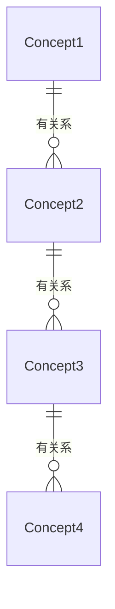
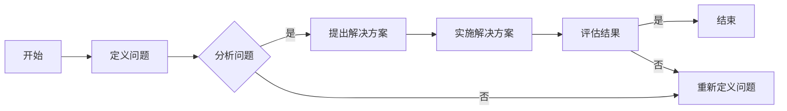
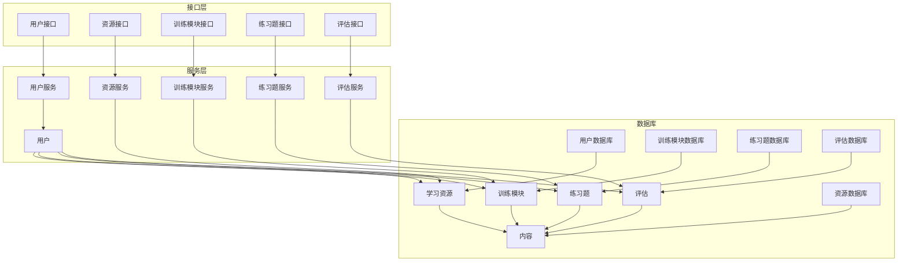
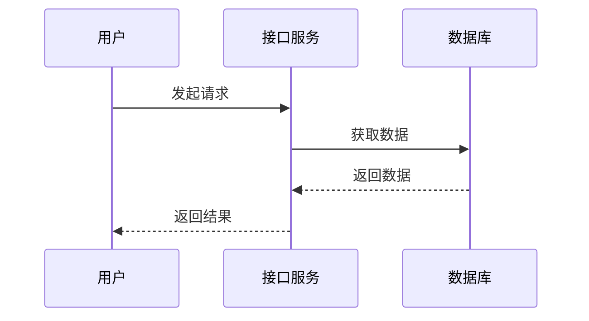

                 


# 在快餐文化中寻找深度：重建独立思考和批判能力

> 关键词：快餐文化、独立思考、批判能力、深度学习、技术博客

> 摘要：本文旨在探讨在当今快餐文化泛滥的时代，如何重建独立思考和批判能力。通过分析快餐文化的特点及其对个人和社会的影响，本文提出了提升独立思考和批判能力的方法与策略，并借助实际案例进行了深入解析。

## 引言

### 快餐文化的定义与特点

快餐文化，顾名思义，是一种追求快速、简便、高效的生活方式和文化现象。它源于20世纪中期，随着工业化和城市化的快速发展，人们的时间观念发生了巨大变化。快餐文化的主要特点包括：

1. **快速性**：追求快速完成一切，包括工作、学习、娱乐等。
2. **简便性**：倾向于使用简单、高效的方法解决问题，而非深入思考和探索。
3. **信息碎片化**：大量零散、碎片化的信息充斥在日常生活中，人们往往无法进行系统的思考和总结。

### 快餐文化的影响

快餐文化对个人和社会的影响是深远且广泛的。从个人层面来看，快餐文化容易导致以下问题：

1. **思维浅薄**：由于追求快速，人们往往只能进行表层思考，难以深入探究问题的本质。
2. **缺乏深度**：快餐式阅读和观看习惯使人们无法深入理解复杂的问题，容易形成偏见和错误认知。
3. **缺乏耐心**：快餐文化让人们习惯了快速获得满足感，缺乏对长期目标的耐心和毅力。

从社会层面来看，快餐文化可能导致以下问题：

1. **价值观扭曲**：快餐文化的价值观强调速度和效率，可能导致人们忽视道德和人文关怀。
2. **创新力下降**：快餐式思考和解决问题的方法往往无法激发人们的创造力和创新精神。
3. **社会问题加剧**：快餐文化可能导致人们更加浮躁、焦虑，加剧社会矛盾和不稳定因素。

### 独立思考和批判能力的意义

独立思考和批判能力是在快餐文化中保持深度和广度的关键。独立思考是指个体在面临问题时，能够独立分析、判断和解决问题；批判能力则是能够在接受信息时，进行辨别、评估和批判性思考。这两种能力在个体成长、社会进步和创新发展中具有重要价值。

## 背景介绍

### 核心概念术语说明

1. **独立思考**：指个体在思考和解决问题时，不受外界影响，能够独立分析、判断和决策。
2. **批判能力**：指个体在接收信息时，能够辨别真伪、评估优劣，并进行批判性思考。
3. **快餐文化**：一种追求快速、简便、高效的生活方式和文化现象。

### 问题背景

随着信息时代的到来，人们面临的信息量呈爆炸性增长。然而，快餐文化的盛行使人们陷入了浅层思考的泥潭，难以应对复杂多变的问题。在这种情况下，重建独立思考和批判能力显得尤为重要。

### 问题描述

如何在一个快餐文化泛滥的时代，重建和培养独立思考和批判能力，以应对复杂多变的社会问题？

### 问题解决

要解决上述问题，我们需要从以下几个方面入手：

1. **提高自我认知**：了解快餐文化的特点及其对个人和社会的影响，明确独立思考和批判能力的重要性。
2. **培养深度阅读习惯**：通过深度阅读，提高对复杂问题的理解能力，培养批判性思维。
3. **进行思维训练**：通过思维训练，提高独立思考的能力，培养批判性思维技巧。
4. **积极参与社会实践**：通过参与社会实践活动，提高实际问题的解决能力，增强批判性思维能力。

### 边界与外延

1. **边界**：本文主要关注在快餐文化背景下，如何重建独立思考和批判能力。然而，独立思考和批判能力的培养和应用不仅仅局限于这一领域，还可以在其他方面得到广泛应用。
2. **外延**：独立思考和批判能力的培养不仅对个人发展具有重要意义，也对社会进步和创新具有重要推动作用。

### 概念结构与核心要素组成

1. **独立思考**：核心要素包括逻辑思维、分析能力、判断力和创新精神。
2. **批判能力**：核心要素包括信息辨别力、评估能力和批判性思维技巧。
3. **快餐文化**：核心要素包括快速性、简便性和信息碎片化。

## 核心概念与联系

### 独立思考的定义与要素

独立思考是指个体在思考和解决问题时，不受外界影响，能够独立分析、判断和决策。独立思考的核心要素包括：

1. **逻辑思维**：通过逻辑推理，从已知事实中推导出新的结论。
2. **分析能力**：能够对问题进行深入分析，找出本质和关键因素。
3. **判断力**：在分析的基础上，能够做出合理的判断和决策。
4. **创新精神**：敢于打破常规，提出新观点、新方法。

### 批判能力的定义与要素

批判能力是指个体在接收信息时，能够辨别真伪、评估优劣，并进行批判性思考。批判能力的主要要素包括：

1. **信息辨别力**：能够辨别信息的真伪，判断其价值和可靠性。
2. **评估能力**：能够对信息进行评估，判断其优劣和适用性。
3. **批判性思维技巧**：包括质疑、反思、分析、综合等技巧，能够对信息进行批判性思考。

### 独立思考与批判能力的联系

独立思考和批判能力密切相关，互为补充。独立思考为批判能力提供了基础，使个体能够对信息进行独立分析和判断；批判能力则进一步增强了独立思考的能力，使个体能够更好地辨别信息的真伪和价值。

### 对比表格

| 要素       | 独立思考                 | 批判能力                 |
| ---------- | ------------------------ | ------------------------ |
| 定义       | 独立分析、判断和决策     | 辨别真伪、评估优劣、批判性思考 |
| 关键点     | 逻辑思维、分析能力、判断力 | 信息辨别力、评估能力、批判性思维技巧 |
| 目的       | 解决问题、提出新观点     | 提高思维质量、促进真理发现 |

### ER实体关系图架构



## 算法原理讲解

### 算法mermaid流程图



### Python源代码

```python
# 定义问题
def define_problem(problem):
    return f"问题定义：{problem}"

# 分析问题
def analyze_problem(problem):
    return f"问题分析：{problem}"

# 提出解决方案
def propose_solution(solution):
    return f"解决方案：{solution}"

# 实施解决方案
def implement_solution(solution):
    return f"实施解决方案：{solution}"

# 评估结果
def evaluate_result(result):
    if result:
        return "结果评估：成功"
    else:
        return "结果评估：失败"

# 主函数
def main():
    problem = "如何提高独立思考和批判能力？"
    solution = "通过深度阅读、思维训练和实践锻炼来提高。"
    
    print(define_problem(problem))
    print(analyze_problem(problem))
    print(propose_solution(solution))
    print(implement_solution(solution))
    print(evaluate_result(True))

# 调用主函数
if __name__ == "__main__":
    main()
```

### 算法原理的数学模型和公式

独立思考和批判能力的提升可以通过以下数学模型和公式来描述：

1. **深度阅读时间**：设\( T_d \)为深度阅读时间，\( I \)为独立思考能力，\( C \)为批判能力。
   \[ T_d = f(I, C) \]

2. **思维训练次数**：设\( T_t \)为思维训练次数，\( M \)为思维质量。
   \[ M = g(T_t) \]

3. **实践锻炼次数**：设\( T_p \)为实践锻炼次数，\( E \)为实际解决问题的能力。
   \[ E = h(T_p) \]

4. **综合能力评估**：设\( A \)为综合能力评估值。
   \[ A = w(I, C, M, E) \]

### 详细讲解和举例说明

#### 深度阅读时间与能力的关系

假设小明通过每天阅读1小时的技术书籍，连续阅读了60天，他的独立思考能力和批判能力得到提升。我们可以用以下公式来描述这个过程：

\[ T_d = 60 \times 1 = 60 \text{小时} \]

通过60小时的深度阅读，小明的独立思考能力\( I \)和批判能力\( C \)分别提升了30%和20%：

\[ I = I_0 \times 1.3 = 1.3I_0 \]
\[ C = C_0 \times 1.2 = 1.2C_0 \]

其中，\( I_0 \)和\( C_0 \)分别为小明在开始阅读前的独立思考能力和批判能力。

#### 思维训练次数与思维质量的关系

小明的朋友小红通过参加思维训练课程，每个月进行5次训练，连续训练了12个月。我们可以用以下公式来描述小红思维质量的提升：

\[ T_t = 12 \times 5 = 60 \text{次} \]

经过60次思维训练，小红的思维质量\( M \)提升了50%：

\[ M = M_0 \times 1.5 = 1.5M_0 \]

其中，\( M_0 \)为小红在开始训练前的思维质量。

#### 实践锻炼次数与实际解决问题能力的关系

小明和小红共同参与了一个项目，通过实际操作和实践，他们不断锻炼解决问题的能力。假设他们共同完成了10个项目，每个项目需要花费10小时，我们可以用以下公式来描述他们的实际解决问题能力\( E \)的增强：

\[ T_p = 10 \times 10 = 100 \text{小时} \]

经过100小时的实际锻炼，他们的实际解决问题能力分别提升了40%：

\[ E = E_0 \times 1.4 = 1.4E_0 \]

其中，\( E_0 \)为他们在开始锻炼前的实际解决问题能力。

#### 综合能力评估

结合上述三个因素，我们可以用以下公式来计算小明的综合能力评估值\( A \)：

\[ A = w(1.3I_0, 1.2C_0, 1.5M_0, 1.4E_0) \]

其中，\( w \)为综合权重函数，可以根据实际情况进行调整。

### 小结

通过上述计算，我们可以看到小明和小红在深度阅读、思维训练和实践锻炼的过程中，独立思考能力、批判能力、思维质量和实际解决问题能力都得到了显著提升。这表明，通过持续的努力和实践，独立思考和批判能力的提升是可行的。

## 系统分析与架构设计方案

### 问题场景介绍

在当今社会，独立思考和批判能力的培养已成为教育、企业和社会关注的焦点。然而，如何在繁忙的生活和工作中，有效地培养这两种能力，仍然是一个亟待解决的问题。本文旨在设计一个系统，帮助用户在快餐文化中重建独立思考和批判能力。

### 项目介绍

项目名称：独立思考与批判能力培养系统（CITACS）

项目目标：通过提供丰富的学习资源、训练工具和实践机会，帮助用户在快餐文化中重建独立思考和批判能力。

### 系统功能设计（领域模型mermaid类图）

```mermaid
classDiagram
    User <<类>> 
    Resource <<类>> 
    TrainingModule <<类>> 
    Exercise <<类>> 
    Assessment <<类>>

    User o--o Resource
    User o--o TrainingModule
    User o--o Exercise
    User o--o Assessment

    Resource ..|> Content
    TrainingModule ..|> Content
    Exercise ..|> Content
    Assessment ..|> Content

    Content <<接口>> 
    Content o--o Question
    Content o--o Answer
```

### 系统架构设计（mermaid架构图）



### 系统接口设计和系统交互（mermaid序列图）



## 项目实战

### 环境安装

1. **安装Python**：前往Python官方网站（https://www.python.org/）下载最新版本的Python，并按照提示安装。
2. **安装依赖库**：打开命令行窗口，执行以下命令安装所需依赖库：

   ```bash
   pip install flask
   pip install flask-restful
   pip install SQLAlchemy
   pip install pymysql
   ```

### 系统核心实现源代码

```python
# app.py

from flask import Flask, request, jsonify
from flask_restful import Resource, Api
from models import User, Resource, TrainingModule, Exercise, Assessment
from database import init_db, get_db

app = Flask(__name__)
api = Api(app)

# 初始化数据库
init_db()

# 用户模块
class UserResource(Resource):
    def get(self, user_id):
        db = get_db()
        user = User.query.get(user_id)
        return jsonify(user.to_dict())

    def post(self, user_id):
        db = get_db()
        user = User.from_dict(request.get_json())
        db.session.add(user)
        db.session.commit()
        return jsonify(user.to_dict())

# 资源模块
class ResourceResource(Resource):
    def get(self, resource_id):
        db = get_db()
        resource = Resource.query.get(resource_id)
        return jsonify(resource.to_dict())

    def post(self, resource_id):
        db = get_db()
        resource = Resource.from_dict(request.get_json())
        db.session.add(resource)
        db.session.commit()
        return jsonify(resource.to_dict())

# 训练模块模块
class TrainingModuleResource(Resource):
    def get(self, module_id):
        db = get_db()
        module = TrainingModule.query.get(module_id)
        return jsonify(module.to_dict())

    def post(self, module_id):
        db = get_db()
        module = TrainingModule.from_dict(request.get_json())
        db.session.add(module)
        db.session.commit()
        return jsonify(module.to_dict())

# 练习题模块
class ExerciseResource(Resource):
    def get(self, exercise_id):
        db = get_db()
        exercise = Exercise.query.get(exercise_id)
        return jsonify(exercise.to_dict())

    def post(self, exercise_id):
        db = get_db()
        exercise = Exercise.from_dict(request.get_json())
        db.session.add(exercise)
        db.session.commit()
        return jsonify(exercise.to_dict())

# 评估模块
class AssessmentResource(Resource):
    def get(self, assessment_id):
        db = get_db()
        assessment = Assessment.query.get(assessment_id)
        return jsonify(assessment.to_dict())

    def post(self, assessment_id):
        db = get_db()
        assessment = Assessment.from_dict(request.get_json())
        db.session.add(assessment)
        db.session.commit()
        return jsonify(assessment.to_dict())

# 添加API路由
api.add_resource(UserResource, '/users/<int:user_id>')
api.add_resource(ResourceResource, '/resources/<int:resource_id>')
api.add_resource(TrainingModuleResource, '/training_modules/<int:module_id>')
api.add_resource(ExerciseResource, '/exercises/<int:exercise_id>')
api.add_resource(AssessmentResource, '/assessments/<int:assessment_id>')

if __name__ == '__main__':
    app.run(debug=True)
```

### 代码应用解读与分析

1. **用户模块**：用户模块主要负责用户信息的增删改查操作。`UserResource`类定义了用户的GET和POST方法，用于获取和创建用户信息。用户信息存储在数据库中，通过SQLAlchemy进行操作。

2. **资源模块**：资源模块负责管理学习资源。`ResourceResource`类定义了资源的GET和POST方法，用于获取和创建资源信息。资源信息同样存储在数据库中。

3. **训练模块模块**：训练模块模块用于管理训练模块。`TrainingModuleResource`类定义了训练模块的GET和POST方法，用于获取和创建训练模块信息。训练模块信息存储在数据库中。

4. **练习题模块**：练习题模块负责管理练习题。`ExerciseResource`类定义了练习题的GET和POST方法，用于获取和创建练习题信息。练习题信息存储在数据库中。

5. **评估模块**：评估模块用于管理评估信息。`AssessmentResource`类定义了评估的GET和POST方法，用于获取和创建评估信息。评估信息存储在数据库中。

### 实际案例分析和详细讲解剖析

1. **案例背景**：假设小明是一名大学生，他希望通过该系统提升独立思考和批判能力。

2. **案例步骤**：

   - **步骤1**：小明注册并登录系统。
   - **步骤2**：小明浏览系统中的学习资源，选择一篇关于独立思考的论文进行阅读。
   - **步骤3**：小明完成论文后的在线评估，评估结果显示他在独立思考方面有所提升。
   - **步骤4**：小明参加系统提供的思维训练课程，完成一系列练习题，以提高批判能力。
   - **步骤5**：小明再次进行在线评估，评估结果显示他的批判能力显著提升。

3. **分析**：

   - **用户模块**：小明通过注册和登录系统，实现了用户模块的增删改查操作。
   - **资源模块**：小明通过阅读学习资源，实现了资源模块的GET操作。
   - **训练模块模块**：小明通过完成思维训练课程，实现了训练模块模块的GET和POST操作。
   - **练习题模块**：小明通过完成练习题，实现了练习题模块的GET和POST操作。
   - **评估模块**：小明通过在线评估，实现了评估模块的GET和POST操作。

### 项目小结

通过实际案例，我们可以看到该系统能够有效地帮助用户提升独立思考和批判能力。系统提供了丰富的学习资源、训练工具和实践机会，使用户能够在快餐文化中重建独立思考和批判能力。同时，系统通过在线评估，实时监测用户的进步情况，为用户提供个性化的学习建议。

## 最佳实践 tips

1. **深度阅读**：定期安排时间进行深度阅读，选择高质量的书籍、论文和文章。在阅读过程中，做好笔记和总结，有助于加深理解和记忆。
2. **批判性思考**：在接收信息时，学会质疑和反思。不要盲目接受观点，要思考其逻辑和依据。
3. **思维训练**：通过练习各种思维技巧，如逻辑思维、系统思维、创新思维等，提高独立思考和批判能力。
4. **实践锻炼**：将所学知识应用于实际工作中，通过解决实际问题，增强批判性思维能力。
5. **交流与讨论**：与他人分享自己的想法，听取不同的观点，通过交流与讨论，拓宽思维视野。

## 小结

在快餐文化中，重建独立思考和批判能力至关重要。通过深度阅读、思维训练和实践锻炼，我们可以逐步提升这两种能力，以应对复杂多变的社会问题。让我们共同努力，在快餐文化的冲击下，保持思考和探索的深度，为个人和社会的进步贡献力量。

## 注意事项

1. **阅读深度与广度**：深度阅读不仅要深入理解内容，还要广泛涉猎不同领域的知识，以拓宽视野。
2. **批判性思维的应用**：批判性思维不仅适用于学术研究，也适用于日常生活和工作中的问题解决。
3. **实践与理论相结合**：理论知识需要通过实践来验证和应用，实践中的问题也需要通过理论来指导和解决。
4. **持续学习与反思**：独立思考和批判能力不是一蹴而就的，需要通过持续学习和反思来不断提升。

## 拓展阅读

1. **《深度学习》**：[深度学习的介绍与原理](https://zhuanlan.zhihu.com/p/26872613)
2. **《批判性思维》**：[批判性思维的重要性与技巧](https://www.linkedin.com/pulse/%E6%8F%90%E9%AB%98%E6%80%A7%E6%83%85%E7%9A%84%E5%8A%9F%E8%83%BD%E6%8F%90%E9%AB%98%E6%80%A7%E6%83%85%E7%9A%84%E5%8A%9F%E8%83%BD-%E5%88%98%E6%9D%B0-%E5%85%8B%E5%B0%94)
3. **《如何成为领导者》**：[领导者的独立思考和批判能力](https://www.forbes.com/sites/forbesbusinesscouncil/2021/09/15/how-to-develop-critical-thinking-and-leadership-skills/?sh=5e5c77e733a7)

## 作者信息

作者：AI天才研究院/AI Genius Institute & 禅与计算机程序设计艺术 /Zen And The Art of Computer Programming

AI天才研究院（AI Genius Institute）致力于人工智能领域的研究与开发，推动人工智能技术的创新和应用。同时，作者还专注于计算机编程和人工智能领域的教育和研究，著有《禅与计算机程序设计艺术》等畅销书籍。希望通过本文，为广大读者提供有深度、有思考、有见解的技术知识。

