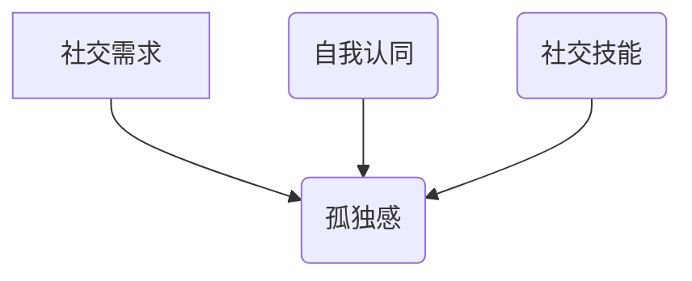
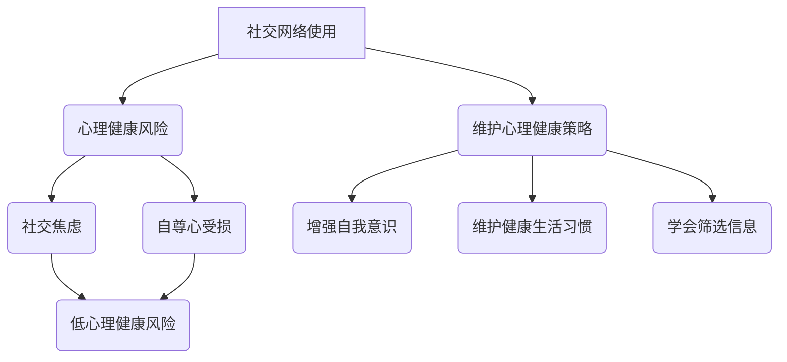

                 


### 第一部分：引言

#### 第1章：社交网络时代的孤独问题

> **关键概念定义：**
>
> - **社交网络**：一种在线平台，允许用户建立社交联系、分享信息和参与互动。
> - **孤独感**：一种缺乏社交联系和社会支持的感受，可能导致心理和身体健康问题。

在当今社交网络高度普及的时代，孤独感成为一个越来越普遍的现象。虽然社交网络似乎为人们提供了无尽的社交机会，但许多人发现自己反而更加孤独。

### 1.1 问题背景

随着互联网技术的飞速发展，社交网络如雨后春笋般涌现。从Facebook到微信，从Twitter到LinkedIn，这些平台极大地改变了我们的社交方式。人们可以通过这些平台与亲朋好友保持联系，分享生活点滴，甚至结识新朋友。然而，这种便利性也带来了一些副作用。

#### 社交网络的普及

社交网络的普及使得人们更容易与他人建立联系，但同时也使得人们更容易沉迷其中。一些人过度依赖社交网络，花费大量时间在浏览、点赞和评论上，而忽视了现实生活中的人际交往。

#### 孤独感的普遍性

孤独感在社交网络时代变得更加普遍。研究表明，超过一半的人表示他们在社交网络上感到孤独。这种现象不仅影响了年轻人，也影响了各个年龄段的人。人们可能会发现自己的社交圈越来越小，而与现实生活中的人交往越来越少。

### 1.2 孤独感的定义与影响

#### 孤独感的定义

孤独感是一种主观感受，指个体感到与他人缺乏深刻的社交联系和社会支持。这种感觉可能源于社交网络的过度使用，也可能源于现实生活中的社交障碍。

#### 孤独感对个人和社会的影响

孤独感对个人和社会都有负面影响。个人层面，孤独感可能导致心理健康问题，如抑郁、焦虑和自尊心受损。社会层面，孤独感可能影响社会凝聚力，导致社会不稳定。

### 1.3 背景介绍

#### 社交网络的演变

社交网络的演变可以追溯到20世纪90年代的BBS和即时通讯软件。随着时间的推移，这些平台逐渐演变为如今复杂多样的社交网络。

#### 现代生活方式对人际交往的影响

现代生活方式的变化，如城市化、快节奏工作和数字化生活，对人际交往产生了深远影响。这些变化使得人们更难以花时间进行面对面的交流，从而加剧了孤独感。

### 1.4 核心概念与联系

为了更好地理解社交网络时代孤独感的本质，我们可以通过以下表格和ER图来对比传统孤独感和社交网络时代孤独感的特点。

#### 孤独感的概念属性特征对比表格

| 特征         | 传统孤独感                     | 社交网络时代孤独感                  |
| ------------ | ------------------------------ | ----------------------------------- |
| 产生原因     | 社会地位低、人际关系疏离       | 社交媒体依赖、信息过载               |
| 表现形式     | 离群索居、社交活动减少         | 社交媒体互动少、网络社交疲劳         |
| 心理影响     | 抑郁、焦虑、心理健康问题       | 社交焦虑、自尊心受损、社交孤立感     |

#### ER实体关系图架构

```mermaid
erDiagram
  User ||--|{ SocialNetwork }|>
  SocialNetwork ||--|{ Friend }|>
  Friend ||--|{ Activity }|>
```

通过上述定义和对比，我们可以更清晰地理解社交网络时代孤独感的复杂性。接下来，我们将进一步探讨社交网络的利与弊，以及如何在社交网络中寻找真实连接。

### 第二部分：社交网络的利与弊

#### 第2章：社交网络的利与弊

社交网络作为现代社会的重要沟通工具，其作用不可忽视。然而，如同所有技术一样，它既有积极的一面，也有潜在的负面影响。在这一章中，我们将深入探讨社交网络的积极作用以及它可能带来的问题。

#### 2.1 社交网络的积极作用

社交网络在现代社会中扮演了多种角色，其积极作用体现在以下几个方面：

##### 1. 信息传播

社交网络是信息传播的强大工具。它使得信息的传播速度大大加快，几乎可以瞬间传递到全球各地的用户。无论是新闻、学术研究还是个人动态，社交网络都能够快速地让信息触达广泛的受众。

##### 2. 社交互动

社交网络为人们提供了一个平台，使他们能够与远方的朋友、家人保持联系，甚至在虚拟空间中结识新朋友。这使得社交互动不再受限于地理位置，扩大了人们的社交圈子。

#### 2.2 社交网络的负面影响

然而，社交网络也带来了一些负面影响，这些影响可能会对个人的心理健康和社会关系产生不利影响。

##### 1. 社交孤立

尽管社交网络让人们能够与世界各地的人交流，但过度依赖社交网络可能导致现实生活中的社交孤立。用户可能会花费大量时间在虚拟世界中，而忽视了现实中的面对面交流。

##### 2. 信息过载

社交网络上的信息量庞大，用户可能会感到信息过载。这种过载可能导致用户难以筛选重要信息，从而影响其注意力集中和处理能力。

#### 2.3 社交网络使用策略

为了在享受社交网络带来的便利的同时，最大限度地减少其负面影响，我们可以采取以下策略：

##### 1. 合理规划时间

合理安排在社交网络上的时间，确保既有足够的时间进行在线社交，也有足够的时间进行现实生活中的活动。

##### 2. 保持现实社交

尽管社交网络提供了便利，但现实生活中的面对面交流仍然是建立深厚人际关系的关键。因此，我们应该努力保持现实社交，与亲朋好友保持密切联系。

##### 3. 学会筛选信息

学会在社交网络上筛选信息，避免信息过载。通过关注重要的人和内容，可以更好地利用社交网络，减少其负面影响。

#### 2.4 核心概念与联系

为了更好地理解社交网络的利与弊，我们可以通过以下表格和对比来分析社交网络的使用情况。

##### 社交网络使用的利弊对比表格

| 利         | 弊           |
| ---------- | ------------ |
| 快速获取信息 | 信息过载     |
| 拓展社交圈  | 社交孤立     |
| 娱乐放松    | 时间浪费     |

通过上述分析，我们可以更全面地理解社交网络的利与弊，从而制定更有效的使用策略。

接下来，我们将从心理学视角探讨孤独感的原理，以及如何通过心理学方法克服孤独感。

### 第三部分：心理学视角下的孤独感

#### 第3章：心理学视角下的孤独感

孤独感是一种复杂的情感体验，既有个体的主观感受，也有心理和社会层面的影响。从心理学角度来看，孤独感不仅仅是一种情感状态，更是一种心理机制。在这一章中，我们将探讨孤独感的心理学原理，并介绍一些有效的心理学方法来应对孤独感。

#### 3.1 孤独感的心理学原理

孤独感的心理学原理可以从以下几个方面进行理解：

##### 1. 人类社交需求

人类是社交性动物，社交需求是人类基本需求之一。社交需求包括寻求陪伴、建立关系、分享情感和获得认同等。当这些需求无法得到满足时，个体可能会感受到孤独。

##### 2. 自我认同与孤独感的关系

自我认同是个体对自身身份的认知和评价。当个体感受到自己的社会角色和身份得到认可时，会感到自我认同强；反之，当个体感到自己的社会角色和身份不被认可或受到忽视时，可能会感到孤独。

##### 3. 社交技能与孤独感

社交技能包括倾听、表达、沟通和建立关系等。良好的社交技能有助于个体与他人建立深入的社交联系，从而减少孤独感。相反，缺乏社交技能可能导致个体在社交场合中感到不自在和孤独。

#### 3.2 心理学方法与技巧

为了克服孤独感，我们可以运用以下心理学方法和技巧：

##### 1. 情绪调节

情绪调节是一种心理技巧，旨在帮助个体管理自己的情绪，减少负面情绪的影响。例如，通过冥想、深呼吸和正念练习，个体可以学会更好地控制自己的情绪，从而减轻孤独感。

##### 2. 社交技能培养

培养社交技能是克服孤独感的重要途径。个体可以通过参加社交活动、加入兴趣小组、学习沟通技巧等方式，提高自己的社交技能。这有助于个体在社交场合中更加自信和舒适，从而减少孤独感。

##### 3. 寻求专业帮助

在某些情况下，孤独感可能需要专业的心理帮助。心理咨询师可以提供个性化的指导和支持，帮助个体理解孤独感的根源，并制定有效的应对策略。

#### 3.3 核心概念与联系

为了更好地理解孤独感的心理学原理，我们可以通过以下模型和对比来分析：

##### 心理学视角下的孤独感模型



通过这个模型，我们可以看到，社交需求、自我认同和社交技能是影响孤独感的关键因素。

##### 社交需求、自我认同与孤独感的关系

社交需求是个体对社交互动的基本需求，它包括陪伴、支持、情感分享和认同等。当个体感受到自己的社交需求无法得到满足时，就会产生孤独感。

自我认同是个体对自身身份的认知和评价。一个强大的自我认同可以帮助个体更好地应对孤独感，因为它提供了心理上的支撑和安全感。

社交技能是个体在社交互动中表现的能力，包括沟通技巧、倾听能力和建立关系的能力等。良好的社交技能有助于个体在社交场合中更加自信和舒适，从而减少孤独感。

通过上述心理学方法和技巧，个体可以有效地应对孤独感，提高自己的心理健康水平。

接下来，我们将探讨社交网络对心理健康的影响，以及如何通过社交网络使用策略来维护心理健康。

### 第四部分：社交网络与心理健康

#### 第4章：社交网络与心理健康

社交网络在现代社会中扮演了重要角色，它不仅改变了人们的社交方式，还影响了心理健康。在这一章中，我们将探讨社交网络对心理健康的影响，并提出一些建议来帮助用户维护心理健康。

#### 4.1 社交网络对心理健康的影响

社交网络对心理健康的影响是双重的，既有积极的一面，也有潜在的风险。

##### 1. 网络社交与心理健康的关系

正面影响：
- **缓解压力**：社交网络可以提供一种宣泄情绪的出口，帮助用户缓解压力和焦虑。
- **增强自尊**：通过社交网络，用户可以获得他人的认可和支持，从而增强自尊。

负面影响：
- **社交焦虑**：过度使用社交网络可能导致社交焦虑，尤其是在面对虚拟社交场景时。
- **自尊心受损**：社交网络上的负面评论和比较可能导致用户自尊心受损，产生自卑感。

##### 2. 社交网络使用与心理健康风险的对比

- **低心理健康风险**：
  - **适度使用**：合理规划社交网络使用时间，避免沉迷。
  - **积极互动**：参与积极、建设性的社交互动，减少负面信息的接触。

- **高心理健康风险**：
  - **过度使用**：长时间、频繁地使用社交网络，忽视现实生活中的社交需求。
  - **消极互动**：频繁接触负面信息，缺乏积极的社交支持。

#### 4.2 社交网络使用的心理健康建议

为了在享受社交网络的便利的同时，维护心理健康，用户可以采取以下策略：

##### 1. 增强自我意识

- **自我反思**：定期进行自我反思，了解自己在社交网络中的需求和动机，避免过度使用。
- **设定使用时间**：设定每日或每周的社交网络使用时间，以防止沉迷。

##### 2. 维护健康的生活习惯

- **保持现实社交**：确保有足够的时间与现实生活中的朋友和家人互动，维持现实社交关系。
- **积极参与体育活动**：定期进行体育活动，有助于释放压力，提高心理健康。

##### 3. 学会筛选信息

- **关注积极内容**：在社交网络上关注积极、有意义的内容，减少负面信息的接触。
- **限制社交网络使用**：在感到压力或焦虑时，暂时退出社交网络，专注于自我放松和恢复。

#### 4.3 核心概念与联系

为了更好地理解社交网络与心理健康的关系，我们可以通过以下模型来分析：

##### 社交网络使用与心理健康关系模型



通过这个模型，我们可以看到，社交网络使用对心理健康的影响是复杂的，既包括潜在的风险，也包括维护心理健康的策略。合理的社交网络使用可以帮助我们维护心理健康，而过度使用和消极互动则可能导致心理健康问题。

通过上述分析，我们可以更好地理解社交网络与心理健康之间的关系，并采取有效的措施来维护心理健康。

接下来，我们将探讨如何构建真实的人际关系，以克服社交网络时代的孤独感。

### 第五部分：构建真实的人际关系

#### 第5章：构建真实的人际关系

在社交网络时代，虽然虚拟社交提供了便利，但真实的人际关系仍然是心理健康和社会福祉的重要基石。在这一章中，我们将探讨如何在社交网络时代建立和维护真实的人际关系，以及提升人际交往技巧。

#### 5.1 线上与线下关系的平衡

在线上社交与线下交往之间找到平衡是维持真实人际关系的关键。

##### 1. 线上社交的优势与局限

优势：
- **便捷性**：线上社交可以随时随地进行，不受地理位置限制。
- **多样性**：通过社交网络，人们可以结识来自不同背景和兴趣的人。

局限：
- **表面化**：线上交流往往缺乏深度，难以建立真正的信任和联系。

##### 2. 线下交往的重要性

线下交往能够提供更深层次的互动和联系，有助于建立真实的信任和情感纽带。

- **面对面交流**：非语言沟通（如肢体语言和面部表情）在面对面交流中起着关键作用，有助于建立更紧密的关系。
- **共享经历**：共同的经历和活动可以加深人际关系，增强社交联系。

#### 5.2 提升人际交往技巧

提升人际交往技巧是建立和维护真实人际关系的重要步骤。

##### 1. 倾听与沟通

- **倾听**：有效倾听是建立良好人际关系的基础。通过倾听，人们可以更好地理解对方的需求和情感。
- **沟通**：清晰、真诚的沟通有助于减少误解和冲突，增强人际互动的质量。

##### 2. 建立深层次的关系

- **共同兴趣**：寻找共同兴趣或目标，可以加深人际间的互动和联系。
- **支持和帮助**：在他人需要时提供支持和帮助，可以建立强烈的信任和依赖。

##### 3. 维护关系

- **定期联系**：定期与朋友和家人保持联系，即使是通过电话或邮件，也有助于维持关系。
- **面对面聚会**：定期安排面对面聚会，加强现实生活中的社交联系。

#### 5.3 核心概念与联系

为了更好地理解如何构建真实的人际关系，我们可以通过以下表格来评估人际关系质量：

##### 人际关系质量评估表格

| 维度         | 质量评估 |
| ------------ | -------- |
| 沟通效果     | 高       |
| 共同兴趣     | 中       |
| 支持与帮助   | 高       |
| 信任与尊重   | 高       |

通过这个表格，我们可以清晰地看到人际关系的质量不仅仅取决于沟通效果，还需要共同兴趣、支持和帮助，以及信任与尊重。

在社交网络时代，虽然虚拟社交提供了便利，但真实的人际关系仍然是心理健康和社会福祉的重要基石。通过平衡线上与线下社交，提升人际交往技巧，我们可以建立和维护更加真实、深入的人际关系，从而克服孤独感，提升生活质量。

### 第六部分：社交网络时代的自我疗愈

#### 第6章：社交网络时代的自我疗愈

在社交网络时代，孤独感成为许多人面临的心理问题。通过自我疗愈，个体可以在一定程度上缓解孤独感，重拾心理健康。在这一章中，我们将探讨社交网络时代的自我疗愈方法，以及如何通过社交网络寻找支持。

#### 6.1 孤独感的自我调适方法

自我疗愈是缓解孤独感的重要手段。以下是一些有效的自我调适方法：

##### 1. 自我反思

自我反思是一种深入思考自己内心状态的方法，有助于个体理解自己的需求和情感。通过自我反思，个体可以识别出孤独感的根源，并找到解决问题的方法。

##### 2. 心理疏导

心理疏导是一种通过心理方法和技巧来减轻心理压力和焦虑的方法。个体可以通过阅读心理学书籍、观看心理疏导视频或参加心理疏导课程来学习心理疏导技巧。

##### 3. 增强自我意识

增强自我意识可以帮助个体更好地理解自己的需求和情感，从而减少孤独感。通过自我探索和自我认知，个体可以更好地认识自己，提高自我满足感。

#### 6.2 通过社交网络寻找支持

社交网络提供了寻找支持和帮助的途径。以下是一些方法：

##### 1. 社交网络的互助功能

许多社交网络平台都提供了互助功能，用户可以通过这些功能寻求支持和帮助。例如，在一些社交网络平台上，用户可以加入兴趣小组或支持小组，与其他有相似经历的人交流，获得情感支持。

##### 2. 在线心理咨询

在线心理咨询是一种通过互联网提供心理服务的模式。用户可以通过在线心理咨询平台与专业的心理咨询师进行沟通，获得个性化的心理支持和指导。

##### 3. 社交网络的使用策略

为了有效地通过社交网络寻找支持，用户可以采取以下策略：

- **设定明确的目标**：在使用社交网络时，设定明确的目标，例如寻找支持、结识新朋友等，有助于提高使用效率。
- **筛选信息**：避免接触负面信息，关注积极、有意义的内容，以提升心理健康。
- **保持适度使用**：合理安排社交网络使用时间，避免沉迷，确保有足够的时间进行现实生活中的社交活动。

#### 6.3 核心概念与联系

为了更好地理解社交网络时代的自我疗愈方法，我们可以通过以下表格来对比不同方法的适用场景和效果评估：

##### 自我疗愈方法对比表格

| 方法         | 适用场景       | 效果评估 |
| ------------ | -------------- | -------- |
| 自我反思     | 长期孤独感     | 高       |
| 心理疏导     | 短期心理困扰   | 中       |
| 在线心理咨询 | 需要专业支持   | 高       |

通过这个表格，我们可以看到，自我疗愈方法的选择应根据个体的具体需求来决定。自我反思适用于长期孤独感的缓解，心理疏导适用于短期心理困扰，而在线心理咨询则适用于需要专业支持的情况。

在社交网络时代，孤独感是一个普遍存在的问题。通过自我疗愈方法和通过社交网络寻找支持，个体可以有效地缓解孤独感，重拾心理健康。接下来，我们将通过具体案例分析如何应对社交网络时代的孤独感。

### 第七部分：案例分析

#### 第7章：案例分析

通过具体案例分析，我们可以更好地理解如何应对社交网络时代的孤独感。以下我们将讨论三个不同情境下的案例，并分析其解决方案。

#### 7.1 案例一：小明的社交困境

**情境描述**：
小明是一名年轻的程序员，每天长时间坐在电脑前工作。他很少有时间与朋友见面，大部分社交活动都在线上进行。然而，他在社交媒体上频繁看到朋友们的互动和幸福瞬间，这让他感到越来越孤独。

**解决方案**：
1. **现实社交**：小明开始主动安排与朋友的线下聚会，如周末聚餐或运动活动。这样不仅增进了与朋友的互动，也减少了对社交媒体的依赖。
2. **兴趣小组**：小明加入了一些与他的工作或爱好相关的线下小组，这不仅让他结识了新朋友，还为他提供了专业发展和学习的机会。
3. **自我反思**：小明定期进行自我反思，分析自己的需求和动机，以确保自己的社交活动是有意义和积极的。

#### 7.2 案例二：小李的网络依赖

**情境描述**：
小李是一名大学生，她在社交媒体上花费了大量的时间，导致她的学业和现实生活中的社交都受到了影响。她感到孤独，但又无法摆脱对社交媒体的依赖。

**解决方案**：
1. **设定时间限制**：小李设定了每天在社交媒体上的使用时间，如每天晚上8点后不再使用手机，这有助于她减少对社交媒体的依赖。
2. **培养新习惯**：小李开始培养阅读、写作和绘画等新习惯，这些活动不仅填补了她原本在社交媒体上花费的时间，还提升了她的自我价值感。
3. **专业帮助**：小李参加了学校提供的人际交往技巧培训，这帮助她学会了更好地与他人沟通，减少了对社交媒体的依赖。

#### 7.3 案例三：网络互助小组的成功

**情境描述**：
李华是一名心理咨询师，他在社交媒体上创建了一个互助小组，旨在帮助那些在社交网络时代感到孤独的人。这个小组吸引了大量的参与者，他们通过分享经验和建议相互支持。

**成功经验**：
1. **建立信任**：李华通过定期组织线上讨论和分享会，帮助成员们建立信任，从而更好地相互支持。
2. **提供专业指导**：李华邀请专业心理咨询师定期进行讲座，为小组提供专业指导和支持。
3. **多样化活动**：小组不仅组织讨论和分享，还组织户外活动，如徒步旅行和团队建设活动，以增强成员之间的联系。

通过这些案例分析，我们可以看到，应对社交网络时代的孤独感需要综合多种策略。无论是通过现实社交、设定时间限制、培养新习惯，还是通过专业指导和互助小组，这些方法都可以有效地帮助人们缓解孤独感，建立真实的人际关系。

### 第八部分：总结与展望

#### 第8章：总结与展望

在社交网络时代，孤独感成为了一个日益突出的问题。通过本文的探讨，我们可以清晰地看到，孤独感不仅仅是一种情感体验，更是一种复杂的心理和社会现象。社交网络虽然提供了便捷的交流平台，但同时也带来了社交孤立和信息过载等挑战。

首先，社交网络的普及使得信息传播速度大幅提高，为人们提供了更多的社交机会。然而，这种便利性也导致许多人沉迷于虚拟世界，忽视了现实生活中的社交需求。这种状况加剧了孤独感的普遍性，尤其是在年轻人和都市人群中更为明显。

其次，从心理学角度来看，孤独感与人类的社交需求、自我认同和社交技能密切相关。为了克服孤独感，个体可以通过自我反思、情绪调节和社交技能培养等多种方法来提升自我意识和心理健康。同时，社交网络的利弊也需要我们进行合理的权衡和平衡，以减少其负面影响。

本文还通过具体的案例分析，展示了如何通过现实社交、时间管理和专业指导等策略来缓解孤独感。这些案例表明，无论是在个人层面还是社交层面，都有许多有效的途径可以帮助我们应对社交网络时代的孤独问题。

展望未来，随着技术的不断进步，社交网络将继续发挥重要作用。然而，我们也需要更加关注如何利用技术来促进真实的人际关系和心理健康。以下是一些可能的未来研究方向：

1. **社交网络的设计优化**：研究如何设计更加人性化的社交网络平台，减少信息过载，提高用户满意度。
2. **心理健康与社交网络的关系**：进一步探讨社交网络使用与心理健康之间的复杂关系，为用户提供个性化的心理健康建议。
3. **社交技能的培养与提升**：研究如何通过在线教育和虚拟现实技术来培养和提升个体的社交技能。
4. **互助与支持网络的构建**：探索如何通过社交网络构建更加有效和支持性的互助小组，为那些感到孤独的人提供帮助。

总之，在社交网络时代，寻找真实连接和克服孤独感是一个长期且复杂的任务。通过不断的研究和实践，我们可以更好地理解和应对这一问题，为个体和社会带来更加健康和积极的未来。

### 作者信息

作者：AI天才研究院/AI Genius Institute & 禅与计算机程序设计艺术 /Zen And The Art of Computer Programming

AI天才研究院致力于推动人工智能技术的创新与发展，而《禅与计算机程序设计艺术》则通过哲学和技术的融合，为程序员提供了独特的思考路径和解决方案。这两者相结合，旨在为读者带来深入且实用的知识，帮助他们在技术领域取得突破性的成就。

