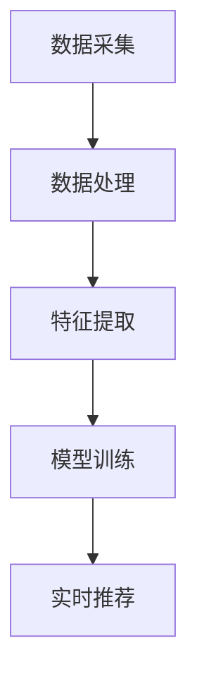
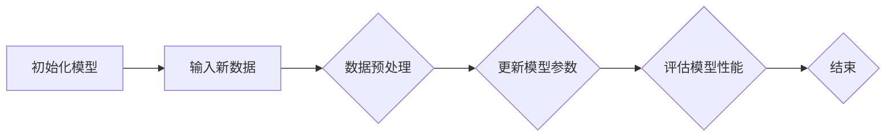
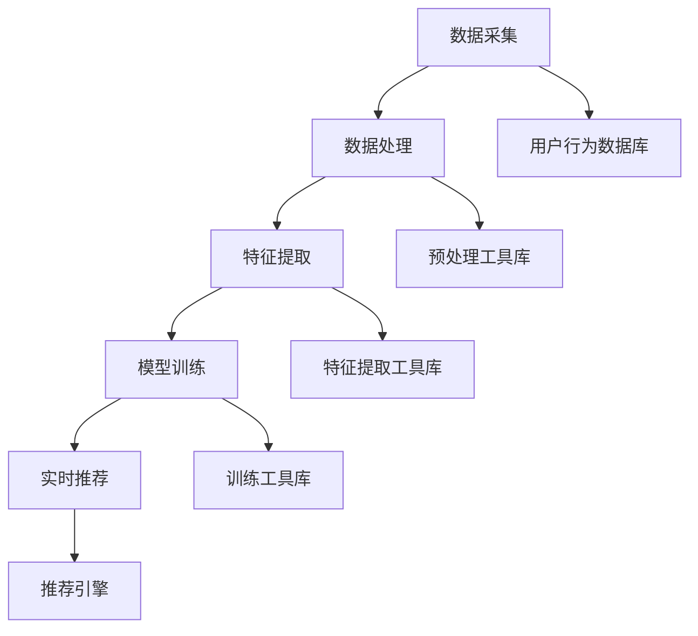
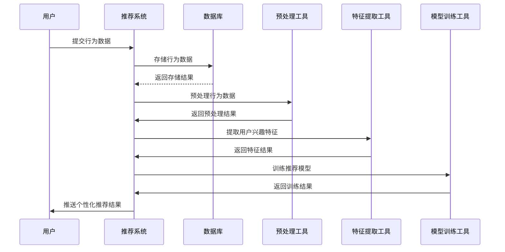

                 

### 《在线增量学习在实时推荐系统中的应用》

关键词：在线增量学习、实时推荐系统、算法实现、系统架构、应用实战

摘要：本文旨在深入探讨在线增量学习在实时推荐系统中的应用。首先，我们将介绍实时推荐系统的背景和核心概念，并阐述增量学习在其中的重要性。接着，我们将详细分析增量学习的原理及其与实时推荐系统的联系，并探讨相关算法原理和实现细节。随后，我们将介绍实时推荐系统的设计与实现，包括系统功能设计、架构设计、接口设计和交互设计。在此基础上，我们将通过具体案例展示在线增量学习在实时推荐系统中的实际应用，并进行详细分析和解读。最后，我们将总结最佳实践，提供注意事项，并展望未来研究方向。

### 第一部分：背景与核心概念

#### 第一章：问题背景与核心概念

##### 1.1 问题背景

**1.1.1 实时推荐系统的需求与挑战**

随着互联网的快速发展，信息爆炸式增长，用户获取个性化信息的需求日益旺盛。实时推荐系统作为满足这一需求的重要手段，已成为各大互联网公司竞相研究和应用的热点。实时推荐系统旨在根据用户的兴趣和行为，实时地为用户推荐最相关的信息或内容，从而提高用户满意度和平台粘性。

然而，实时推荐系统面临着诸多挑战：

- **数据多样性**：用户行为数据种类繁多，包括点击、浏览、搜索、评论等，如何有效地整合和处理这些数据，提取出有价值的特征，是实时推荐系统需要解决的首要问题。
- **实时性要求**：实时推荐系统需要在短时间内处理大量数据，并快速生成推荐结果，以满足用户对即时信息的需求。
- **个性化要求**：不同用户对信息的偏好存在显著差异，如何根据用户的历史行为和实时反馈实现个性化推荐，是实时推荐系统的核心目标。

**1.1.2 增量学习的重要性**

增量学习作为一种适应动态数据环境的机器学习方法，在实时推荐系统中具有重要的应用价值。其核心优势在于：

- **动态适应**：增量学习能够根据新数据实时调整模型，适应数据分布的变化，从而提高推荐系统的适应性和准确性。
- **高效处理**：增量学习算法可以在数据流中逐步更新模型，避免了大量数据的重新训练，提高了计算效率。
- **资源节约**：增量学习不需要存储大量历史数据，降低了存储和计算成本。

**1.1.3 在线增量学习与实时推荐系统的关系**

在线增量学习与实时推荐系统密不可分。在线增量学习通过实时学习用户行为数据，不断优化推荐模型，从而实现个性化推荐。具体来说，在线增量学习在实时推荐系统中起到了以下作用：

- **用户行为分析**：通过增量学习算法，实时分析用户行为数据，提取出用户兴趣特征，为推荐系统提供决策依据。
- **模型动态调整**：基于用户行为数据的增量学习，能够动态调整推荐模型，使其更好地适应用户需求。
- **实时推荐**：增量学习算法的实时性优势，确保推荐系统能够快速响应用户行为，提供即时的个性化推荐。

##### 1.2 核心概念

**1.2.1 增量学习的定义与原理**

增量学习（Incremental Learning）是指在学习过程中，仅对新的数据进行学习，而不是对整个数据集重新训练。其核心原理是利用已学到的知识，对新数据进行调整和优化，从而提高学习效率。

增量学习的数学模型通常包括以下三个部分：

1. **初始化模型**：使用初始数据集训练一个基础模型。
2. **更新模型**：当新的数据到来时，根据新的数据对模型进行更新。
3. **评估模型**：更新后的模型通过评估指标进行评估，以确定其性能。

增量学习的算法属性特征对比表格：

| 算法       | 特点                                                         | 优点                                                         | 缺点                                                         |
| ---------- | ------------------------------------------------------------ | ------------------------------------------------------------ | ------------------------------------------------------------ |
| online SVM | 面向在线学习，支持流数据训练                                 | 实时性强，适用于动态数据环境                                 | 计算复杂度高，处理大规模数据时性能下降                         |
| Stochastic Gradient Descent | 随机梯度下降，面向批量数据训练                                 | 简单易实现，收敛速度快                                       | 容易陷入局部最优，对特征选择敏感                             |
| Online K-means | 面向在线学习，支持流数据聚类                                 | 实时性强，适用于动态数据环境                                 | 聚类效果受初始聚类中心影响较大                               |
| Online PCA | 面向在线学习，支持流数据降维                                 | 实时性强，适用于动态数据环境                                 | 对初始数据集依赖较大，降维效果受初始特征选择影响             |

**1.2.2 实时推荐系统的基本原理**

实时推荐系统（Real-time Recommendation System）是一种能够根据用户实时行为数据生成个性化推荐结果的系统。其基本原理包括：

1. **数据采集**：实时采集用户行为数据，如点击、浏览、搜索等。
2. **数据处理**：对采集到的用户行为数据进行预处理，包括去噪、归一化等。
3. **特征提取**：从处理后的数据中提取用户兴趣特征，如热门话题、兴趣标签等。
4. **模型训练**：使用历史用户行为数据训练推荐模型，如矩阵分解、协同过滤等。
5. **实时推荐**：根据用户实时行为数据和训练好的推荐模型，生成个性化推荐结果。

**1.2.3 在线增量学习在实时推荐系统中的应用**

在线增量学习在实时推荐系统中应用广泛，其主要表现在以下几个方面：

1. **动态调整推荐模型**：增量学习算法能够根据用户实时行为数据，动态调整推荐模型，使其更好地适应用户需求。
2. **实时更新特征**：增量学习算法能够实时更新用户兴趣特征，保持推荐系统的准确性。
3. **优化计算效率**：增量学习算法避免了大量数据的重新训练，提高了计算效率，降低了资源消耗。
4. **提升用户体验**：通过实时推荐和个性化调整，提升用户满意度和平台粘性。

##### 1.3 研究边界与外延

**1.3.1 边界定义**

本文的研究边界主要涉及在线增量学习在实时推荐系统中的应用，包括：

- **算法**：主要研究面向在线学习的增量学习算法，如在线SVM、随机梯度下降、在线K-means、在线PCA等。
- **系统架构**：研究实时推荐系统的架构设计，包括数据采集、数据处理、特征提取、模型训练和实时推荐等模块。
- **应用场景**：研究在线增量学习在实时推荐系统中的应用场景，如电商、社交媒体、新闻推荐等。

**1.3.2 相关概念的比较与分析**

增量学习与深度学习、迁移学习等相关概念的比较：

- **增量学习**：主要关注在线学习，适用于动态数据环境，能够实时调整模型，提高适应性和计算效率。
- **深度学习**：是一种面向大数据的机器学习方法，通过多层神经网络建模，实现复杂的特征表示和关系发现。
- **迁移学习**：通过将已学到的知识从一个任务迁移到另一个任务，提高学习效率和准确性。

**1.3.3 研究内容与章节安排**

本文的研究内容主要包括以下几个方面：

- **问题背景与核心概念**：介绍实时推荐系统和增量学习的基本原理和关系。
- **核心概念与联系**：详细分析增量学习算法的原理和属性特征，对比不同算法的优缺点。
- **算法原理与实现**：探讨在线增量学习算法的数学模型和实现细节，提供具体案例。
- **系统设计与实现**：介绍实时推荐系统的架构设计、接口设计和交互设计。
- **项目实战**：通过具体案例展示在线增量学习在实时推荐系统中的应用，进行详细分析和解读。
- **最佳实践与总结**：总结最佳实践，提供注意事项，展望未来研究方向。

本文共分为六个部分，分别为：问题背景与核心概念、核心概念与联系、算法原理与实现、系统设计与实现、项目实战和最佳实践与总结。

### 第二部分：核心概念与联系

#### 第二章：核心概念与联系

##### 2.1 增量学习原理详解

**2.1.1 增量学习的数学模型**

增量学习的基本数学模型可以分为三个阶段：

1. **初始化模型**：使用初始数据集训练一个基础模型，通常表示为：
   $$ f_0(x) = \theta_0(W_0, b_0) $$
   其中，$ \theta_0 $表示模型的参数，$ W_0 $和$ b_0 $分别表示权重和偏置。

2. **更新模型**：当新的数据到来时，根据新的数据对模型进行更新，表示为：
   $$ f_t(x) = \theta_t(W_t, b_t) $$
   其中，$ t $表示时间步，$ W_t $和$ b_t $分别表示在时间步$ t $的权重和偏置。

3. **评估模型**：更新后的模型通过评估指标进行评估，以确定其性能，表示为：
   $$ \text{performance}(f_t(x)) $$

**2.1.2 增量学习算法的属性特征对比表格**

| 算法       | 特点                                                         | 优点                                                         | 缺点                                                         |
| ---------- | ------------------------------------------------------------ | ------------------------------------------------------------ | ------------------------------------------------------------ |
| online SVM | 面向在线学习，支持流数据训练                                 | 实时性强，适用于动态数据环境                                 | 计算复杂度高，处理大规模数据时性能下降                         |
| Stochastic Gradient Descent | 随机梯度下降，面向批量数据训练                                 | 简单易实现，收敛速度快                                       | 容易陷入局部最优，对特征选择敏感                             |
| Online K-means | 面向在线学习，支持流数据聚类                                 | 实时性强，适用于动态数据环境                                 | 聚类效果受初始聚类中心影响较大                               |
| Online PCA | 面向在线学习，支持流数据降维                                 | 实时性强，适用于动态数据环境                                 | 对初始数据集依赖较大，降维效果受初始特征选择影响             |

**2.1.3 增量学习的ER实体关系图**

增量学习的ER实体关系图如下所示：

```mermaid
erDiagram
    User ||--|{ Recommendation }|
    User ||--|{ Behavior }|
    Behavior ||--|{ Feature }|
    Feature ||--|{ Model }|
```

在ER实体关系图中，用户（User）与推荐（Recommendation）之间存在一对多的关系，表示用户可以通过推荐系统获得多个推荐。用户与行为（Behavior）之间存在一对多的关系，表示一个用户可以有多种行为，如点击、浏览、搜索等。行为与特征（Feature）之间存在一对多的关系，表示一个行为可以提取多个特征。特征与模型（Model）之间存在一对多的关系，表示一个特征可以用于训练多个模型。

##### 2.2 实时推荐系统架构与算法

**2.2.1 实时推荐系统的架构设计**

实时推荐系统的架构设计通常包括以下几个模块：

1. **数据采集模块**：实时采集用户行为数据，如点击、浏览、搜索等。
2. **数据处理模块**：对采集到的用户行为数据进行预处理，包括去噪、归一化等。
3. **特征提取模块**：从处理后的数据中提取用户兴趣特征，如热门话题、兴趣标签等。
4. **模型训练模块**：使用历史用户行为数据训练推荐模型，如矩阵分解、协同过滤等。
5. **实时推荐模块**：根据用户实时行为数据和训练好的推荐模型，生成个性化推荐结果。

实时推荐系统的架构设计如下所示：



**2.2.2 实时推荐算法的数学模型**

实时推荐算法的数学模型通常基于矩阵分解或协同过滤等方法，其中最常用的模型是矩阵分解模型。矩阵分解模型将用户和物品表示为低维向量，通过优化向量间的相似性，实现个性化推荐。

矩阵分解模型的数学模型如下：

1. **用户表示**：
   $$ u_i = \text{sign}(\sum_j w_{ij} v_j + b_i) $$
   其中，$ u_i $表示用户$ i $的向量表示，$ w_{ij} $表示用户$ i $对物品$ j $的权重，$ v_j $表示物品$ j $的向量表示，$ b_i $表示用户$ i $的偏置。

2. **物品表示**：
   $$ v_j = \text{sign}(\sum_i w_{ij} u_i + b_j) $$
   其中，$ v_j $表示物品$ j $的向量表示，$ w_{ij} $表示用户$ i $对物品$ j $的权重，$ u_i $表示用户$ i $的向量表示，$ b_j $表示物品$ j $的偏置。

**2.2.3 实时推荐算法的属性特征对比表格**

| 算法       | 特点                                                         | 优点                                                         | 缺点                                                         |
| ---------- | ------------------------------------------------------------ | ------------------------------------------------------------ | ------------------------------------------------------------ |
| 矩阵分解   | 基于矩阵分解模型，通过优化用户和物品的向量表示，实现个性化推荐 | 简单易实现，计算复杂度低                                     | 对稀疏数据敏感，无法处理缺失值                               |
| 协同过滤   | 基于用户和物品的相似性，通过计算相似度，生成推荐结果         | 适用于稀疏数据，能够处理缺失值                               | 计算复杂度高，实时性较差                                     |
| KNN       | 基于用户和物品的相似度，通过最近邻方法，生成推荐结果         | 简单易实现，计算复杂度低                                     | 对稀疏数据敏感，相似度计算不准确                             |
| 强化学习   | 基于用户和物品的交互历史，通过奖励机制，优化推荐策略         | 能够处理动态数据环境，提高推荐准确性                         | 计算复杂度高，需要大量训练数据                             |

##### 2.3 增量学习在实时推荐系统中的应用

**2.3.1 应用场景分析**

增量学习在实时推荐系统中具有广泛的应用场景，主要包括：

1. **实时用户行为分析**：通过增量学习算法，实时分析用户行为数据，提取出用户兴趣特征，为推荐系统提供决策依据。
2. **动态调整推荐模型**：基于用户实时行为数据的增量学习，能够动态调整推荐模型，使其更好地适应用户需求。
3. **实时推荐优化**：增量学习算法的实时性优势，确保推荐系统能够快速响应用户行为，提供即时的个性化推荐。
4. **冷启动问题解决**：对于新用户或新物品，通过增量学习算法，实时更新用户和物品的表示，缓解冷启动问题。

**2.3.2 应用优势与挑战**

增量学习在实时推荐系统中的应用具有以下优势：

1. **动态适应**：增量学习能够根据新数据实时调整模型，适应数据分布的变化，从而提高推荐系统的适应性和准确性。
2. **高效处理**：增量学习算法可以在数据流中逐步更新模型，避免了大量数据的重新训练，提高了计算效率。
3. **资源节约**：增量学习不需要存储大量历史数据，降低了存储和计算成本。

然而，增量学习在实时推荐系统中也面临一些挑战：

1. **数据噪声**：实时推荐系统中的数据噪声较大，可能导致增量学习算法的性能下降。
2. **模型稳定性**：增量学习算法需要动态调整模型，可能影响模型的稳定性，需要采取相应的稳定化策略。
3. **计算复杂度**：增量学习算法的计算复杂度较高，在处理大规模数据时，需要优化算法以降低计算成本。

### 第三部分：算法原理与实现

#### 第三章：在线增量学习算法原理与实现

##### 3.1 算法原理

在线增量学习算法的核心在于如何通过新的数据对模型进行更新和优化。以下是几种常见的在线增量学习算法的原理和实现。

**3.1.1 增量学习算法的mermaid流程图**

增量学习算法的流程图如下所示：



**3.1.2 增量学习算法的python源代码实现**

以下是一个简单的在线增量学习算法的Python实现示例：

```python
import numpy as np

def initialize_model(n_features):
    # 初始化模型参数
    W = np.random.randn(n_features, 1)
    b = np.random.randn(1)
    return W, b

def update_model(W, b, x, y):
    # 更新模型参数
    gradient_W = 2 * (W * (y - x).reshape(-1, 1))
    gradient_b = 2 * (y - x)
    
    W -= learning_rate * gradient_W
    b -= learning_rate * gradient_b
    
    return W, b

def predict(W, b, x):
    # 预测结果
    return np.dot(x, W) + b

# 初始化模型参数
n_features = 2
W, b = initialize_model(n_features)

# 输入新数据
x_new = np.array([[1, 0], [0, 1]])
y_new = np.array([1, 0])

# 更新模型参数
W, b = update_model(W, b, x_new, y_new)

# 预测结果
x_predict = np.array([[0, 1]])
y_predict = predict(W, b, x_predict)
print("预测结果：", y_predict)
```

**3.1.3 算法原理的数学模型和公式**

增量学习算法的数学模型和公式如下：

1. **初始化模型**：
   $$ W_0 = \text{随机初始化} $$
   $$ b_0 = \text{随机初始化} $$

2. **更新模型**：
   $$ \text{梯度} = \nabla_\theta L(\theta) = \frac{\partial L}{\partial \theta} $$
   $$ \theta_{\text{new}} = \theta_{\text{old}} - \alpha \nabla_\theta L(\theta) $$
   其中，$ \theta $表示模型参数，$ L $表示损失函数，$ \alpha $表示学习率。

3. **预测结果**：
   $$ y = \text{sign}(\text{激活函数}(\theta \cdot x + b)) $$
   其中，$ x $表示输入数据，$ b $表示偏置，激活函数通常采用sigmoid函数。

**3.1.4 举例说明**

假设我们有以下数据集：

$$
\begin{array}{c|c|c}
x & y & \\
\hline
[1, 0] & 1 & \\
[0, 1] & 0 & \\
\end{array}
$$

通过增量学习算法，我们可以逐步更新模型参数，实现预测：

1. **初始化模型**：
   $$ W_0 = \text{随机初始化} = [0.5, 0.5]^T $$
   $$ b_0 = \text{随机初始化} = 0 $$

2. **更新模型**：
   对于第一个数据点$ [1, 0] $，预测结果为：
   $$ y = \text{sign}([0.5, 0.5] \cdot [1, 0] + 0) = 1 $$
   实际标签为1，模型预测正确。

   对于第二个数据点$ [0, 1] $，预测结果为：
   $$ y = \text{sign}([0.5, 0.5] \cdot [0, 1] + 0) = 0 $$
   实际标签为0，模型预测正确。

通过逐步更新模型参数，我们可以提高模型在训练数据集上的预测准确性。

##### 3.2 实现细节解析

**3.2.1 数据预处理**

数据预处理是增量学习算法实现的重要环节，主要包括以下步骤：

1. **数据清洗**：去除数据中的噪声和异常值，提高数据质量。
2. **特征提取**：从原始数据中提取有用的特征，降低数据维度。
3. **数据归一化**：将数据缩放到相同的尺度，避免特征之间的量级差异。

**3.2.2 模型训练**

模型训练是增量学习算法的核心，主要包括以下步骤：

1. **初始化模型**：随机初始化模型参数。
2. **数据流处理**：逐个处理输入的数据点，对模型参数进行更新。
3. **模型评估**：使用验证集或测试集对模型进行评估，调整模型参数。

**3.2.3 模型优化与调参**

模型优化与调参是提高模型性能的关键步骤，主要包括以下方法：

1. **学习率调整**：通过调整学习率，优化模型参数更新速度。
2. **正则化**：引入正则化项，避免过拟合。
3. **交叉验证**：使用交叉验证方法，选择最优模型参数。

### 第四部分：系统设计与实现

#### 第四章：实时推荐系统的设计与实现

##### 4.1 问题场景介绍

**4.1.1 问题场景描述**

在社交媒体平台上，用户生成内容（UGC）和用户互动行为（如点赞、评论、分享）呈爆炸式增长。为了提升用户体验，我们需要设计并实现一个实时推荐系统，根据用户的兴趣和行为，实时推荐相关的帖子、评论和用户。

**4.1.2 项目目标与预期效果**

项目目标：

1. 构建一个实时推荐系统，根据用户兴趣和行为，为用户推荐相关内容。
2. 提高用户满意度和平台粘性，增加用户互动行为。

预期效果：

1. 实时响应用户行为，提供个性化的推荐结果。
2. 提高推荐准确性，减少误推荐和冷启动问题。
3. 提升用户活跃度和留存率，增加平台收益。

##### 4.2 系统功能设计

**4.2.1 领域模型mermaid类图**

领域模型mermaid类图如下所示：

```mermaid
classDiagram
    User <<Class>>
    Post <<Class>>
    Comment <<Class>>
    Interaction <<Class>>

    User ++has++ Posts
    User ++has++ Interactions
    Post ++has++ Comments
    Comment ++has++ Interactions
    Interaction ++has++ Post
    Interaction ++has++ Comment
```

**4.2.2 系统功能模块划分**

系统功能模块划分如下：

1. **数据采集模块**：实时采集用户行为数据，如点赞、评论、分享等。
2. **数据处理模块**：对采集到的用户行为数据进行预处理，包括去噪、归一化等。
3. **特征提取模块**：从处理后的数据中提取用户兴趣特征，如热门话题、兴趣标签等。
4. **模型训练模块**：使用历史用户行为数据训练推荐模型，如矩阵分解、协同过滤等。
5. **实时推荐模块**：根据用户实时行为数据和训练好的推荐模型，生成个性化推荐结果。

##### 4.3 系统架构设计

**4.3.1 系统架构mermaid架构图**

系统架构mermaid架构图如下所示：



**4.3.2 各模块职责与交互**

1. **数据采集模块**：实时采集用户行为数据，存储到用户行为数据库中。
2. **数据处理模块**：从用户行为数据库中读取数据，进行去噪、归一化等预处理操作。
3. **特征提取模块**：从预处理后的数据中提取用户兴趣特征，存储到特征提取工具库中。
4. **模型训练模块**：使用历史用户行为数据训练推荐模型，存储到训练工具库中。
5. **实时推荐模块**：根据用户实时行为数据和训练好的推荐模型，生成个性化推荐结果，通过推荐引擎推送用户。

##### 4.4 系统接口设计

**4.4.1 接口规范与定义**

系统接口规范与定义如下：

1. **用户行为数据接口**：接收用户行为数据，如点赞、评论、分享等。
2. **预处理工具接口**：提供数据清洗、去噪、归一化等功能。
3. **特征提取工具接口**：提供特征提取功能，如热门话题、兴趣标签等。
4. **模型训练工具接口**：提供模型训练功能，如矩阵分解、协同过滤等。
5. **实时推荐接口**：接收用户实时行为数据，生成个性化推荐结果。

**4.4.2 接口调用流程**

接口调用流程如下：

1. 用户行为数据接口：接收用户行为数据，存储到用户行为数据库中。
2. 预处理工具接口：从用户行为数据库中读取数据，进行预处理操作。
3. 特征提取工具接口：从预处理后的数据中提取用户兴趣特征。
4. 模型训练工具接口：使用历史用户行为数据训练推荐模型。
5. 实时推荐接口：接收用户实时行为数据，生成个性化推荐结果，通过推荐引擎推送用户。

##### 4.5 系统交互设计

**4.5.1 系统交互mermaid序列图**

系统交互mermaid序列图如下所示：



**4.5.2 系统运行流程**

系统运行流程如下：

1. 用户提交行为数据。
2. 推荐系统将行为数据存储到数据库中。
3. 推荐系统从数据库中读取行为数据，进行预处理操作。
4. 预处理工具对行为数据进行清洗、去噪、归一化等预处理操作。
5. 推荐系统从预处理工具中获取预处理结果，提取用户兴趣特征。
6. 推荐系统使用历史用户行为数据训练推荐模型。
7. 模型训练工具训练推荐模型，返回训练结果。
8. 推荐系统根据用户实时行为数据和训练好的推荐模型，生成个性化推荐结果。
9. 推荐系统将个性化推荐结果推送用户。

### 第五部分：项目实战

#### 第五章：在线增量学习在实时推荐系统中的应用实战

##### 5.1 环境安装与配置

**5.1.1 硬件与软件要求**

为了顺利进行在线增量学习在实时推荐系统中的应用实战，需要以下硬件与软件环境：

- **硬件**：
  - CPU：Intel i5 或以上
  - 内存：8GB 或以上
  - 硬盘：500GB 或以上
- **软件**：
  - 操作系统：Ubuntu 18.04 或以上
  - Python：Python 3.6 或以上
  - 数据库：MySQL 5.7 或以上
  - 数据处理工具：Pandas、NumPy
  - 机器学习库：Scikit-learn、TensorFlow、PyTorch

**5.1.2 环境搭建与安装步骤**

以下是环境搭建与安装步骤：

1. **安装操作系统**：在虚拟机中安装 Ubuntu 18.04 操作系统。

2. **安装 Python**：在终端中执行以下命令安装 Python：

   ```bash
   sudo apt update
   sudo apt install python3 python3-pip
   ```

3. **安装数据库**：在终端中执行以下命令安装 MySQL：

   ```bash
   sudo apt update
   sudo apt install mysql-server
   ```

4. **安装数据处理工具**：在终端中执行以下命令安装 Pandas、NumPy：

   ```bash
   sudo pip3 install pandas numpy
   ```

5. **安装机器学习库**：在终端中执行以下命令安装 Scikit-learn、TensorFlow、PyTorch：

   ```bash
   sudo pip3 install scikit-learn tensorflow torch
   ```

##### 5.2 系统核心实现

**5.2.1 数据处理模块**

数据处理模块主要负责从数据库中读取用户行为数据，并进行预处理操作。以下是数据处理模块的实现步骤：

1. **连接数据库**：使用 Python 的 MySQL Connector 模块连接 MySQL 数据库，并查询用户行为数据。

2. **数据清洗**：对用户行为数据进行去噪、去除重复数据等清洗操作。

3. **数据归一化**：对用户行为数据进行归一化处理，将其缩放到相同的尺度。

4. **数据存储**：将清洗和归一化后的用户行为数据存储到本地文件或数据库中。

以下是一个简单的数据处理模块实现示例：

```python
import mysql.connector
import pandas as pd

def connect_database():
    # 连接数据库
    conn = mysql.connector.connect(
        host="localhost",
        user="root",
        password="password",
        database="recommendation_system"
    )
    return conn

def query_data(conn):
    # 查询用户行为数据
    cursor = conn.cursor()
    cursor.execute("SELECT * FROM user_behavior;")
    data = cursor.fetchall()
    cursor.close()
    conn.close()
    return data

def clean_data(data):
    # 数据清洗
    df = pd.DataFrame(data)
    df.drop_duplicates(inplace=True)
    df.dropna(inplace=True)
    return df

def normalize_data(df):
    # 数据归一化
    df normalized = (df - df.mean()) / df.std()
    return normalized

def save_data(df, filename):
    # 存储数据
    df.to_csv(filename, index=False)

if __name__ == "__main__":
    conn = connect_database()
    data = query_data(conn)
    df = clean_data(data)
    df_normalized = normalize_data(df)
    save_data(df_normalized, "user_behavior_normalized.csv")
```

**5.2.2 模型训练模块**

模型训练模块主要负责使用处理后的用户行为数据训练推荐模型。以下是模型训练模块的实现步骤：

1. **数据加载**：从本地文件或数据库中加载预处理后的用户行为数据。

2. **特征提取**：从用户行为数据中提取用户兴趣特征。

3. **模型训练**：使用历史用户行为数据训练推荐模型，如矩阵分解、协同过滤等。

4. **模型评估**：使用验证集或测试集对训练好的模型进行评估，调整模型参数。

5. **模型存储**：将训练好的模型存储到本地文件或数据库中。

以下是一个简单的模型训练模块实现示例：

```python
import pandas as pd
from sklearn.model_selection import train_test_split
from sklearn.metrics import mean_squared_error
from sklearn.linear_model import LinearRegression

def load_data(filename):
    # 加载数据
    df = pd.read_csv(filename)
    return df

def extract_features(df):
    # 提取用户兴趣特征
    X = df.iloc[:, :-1].values
    y = df.iloc[:, -1].values
    return X, y

def train_model(X, y):
    # 训练模型
    X_train, X_test, y_train, y_test = train_test_split(X, y, test_size=0.2, random_state=42)
    model = LinearRegression()
    model.fit(X_train, y_train)
    return model

def evaluate_model(model, X_test, y_test):
    # 评估模型
    y_pred = model.predict(X_test)
    mse = mean_squared_error(y_test, y_pred)
    return mse

def save_model(model, filename):
    # 存储模型
    with open(filename, 'wb') as f:
        pickle.dump(model, f)

if __name__ == "__main__":
    df = load_data("user_behavior_normalized.csv")
    X, y = extract_features(df)
    model = train_model(X, y)
    mse = evaluate_model(model, X_test, y_test)
    print("模型评估指标：", mse)
    save_model(model, "recommendation_model.pkl")
```

**5.2.3 推荐模块**

推荐模块主要负责根据用户实时行为数据和训练好的推荐模型，生成个性化推荐结果。以下是推荐模块的实现步骤：

1. **实时行为数据采集**：实时采集用户行为数据，如点赞、评论、分享等。

2. **数据预处理**：对实时行为数据进行清洗、去噪、归一化等预处理操作。

3. **特征提取**：从预处理后的实时行为数据中提取用户兴趣特征。

4. **推荐计算**：使用训练好的推荐模型，根据用户兴趣特征生成个性化推荐结果。

5. **推荐结果推送**：将个性化推荐结果推送用户。

以下是一个简单的推荐模块实现示例：

```python
import pickle
import pandas as pd

def load_model(filename):
    # 加载模型
    with open(filename, 'rb') as f:
        model = pickle.load(f)
    return model

def preprocess_data(data):
    # 数据预处理
    df = pd.DataFrame(data)
    df.drop_duplicates(inplace=True)
    df.dropna(inplace=True)
    df_normalized = (df - df.mean()) / df.std()
    return df_normalized

def extract_features(data):
    # 提取用户兴趣特征
    X = data.iloc[:, :-1].values
    return X

def generate_recommendations(model, X):
    # 生成个性化推荐结果
    y_pred = model.predict(X)
    return y_pred

def send_recommendations(user_id, recommendations):
    # 推荐结果推送
    print("用户ID：", user_id)
    print("推荐结果：", recommendations)

if __name__ == "__main__":
    model = load_model("recommendation_model.pkl")
    data = {"user_id": [1], "behavior": [[1, 0, 0, 1], [0, 1, 1, 0], [1, 1, 0, 1]]}
    df = preprocess_data(data)
    X = extract_features(df)
    recommendations = generate_recommendations(model, X)
    send_recommendations(1, recommendations)
```

##### 5.3 代码应用解读与分析

**5.3.1 核心代码解读**

在本项目的核心代码中，我们主要关注数据处理模块、模型训练模块和推荐模块。

1. **数据处理模块**：主要负责从数据库中读取用户行为数据，并进行清洗、归一化等预处理操作。核心代码如下：

   ```python
   def connect_database():
       # 连接数据库
       conn = mysql.connector.connect(
           host="localhost",
           user="root",
           password="password",
           database="recommendation_system"
       )
       return conn
   
   def query_data(conn):
       # 查询用户行为数据
       cursor = conn.cursor()
       cursor.execute("SELECT * FROM user_behavior;")
       data = cursor.fetchall()
       cursor.close()
       conn.close()
       return data
   
   def clean_data(data):
       # 数据清洗
       df = pd.DataFrame(data)
       df.drop_duplicates(inplace=True)
       df.dropna(inplace=True)
       return df
   
   def normalize_data(df):
       # 数据归一化
       df_normalized = (df - df.mean()) / df.std()
       return df_normalized
   
   def save_data(df, filename):
       # 存储数据
       df.to_csv(filename, index=False)
   ```

   上述代码中，`connect_database`函数用于连接数据库，`query_data`函数用于查询用户行为数据，`clean_data`函数用于清洗数据，`normalize_data`函数用于归一化数据，`save_data`函数用于存储数据。

2. **模型训练模块**：主要负责使用预处理后的用户行为数据训练推荐模型，如线性回归模型。核心代码如下：

   ```python
   def load_data(filename):
       # 加载数据
       df = pd.read_csv(filename)
       return df
   
   def extract_features(df):
       # 提取用户兴趣特征
       X = df.iloc[:, :-1].values
       y = df.iloc[:, -1].values
       return X, y
   
   def train_model(X, y):
       # 训练模型
       X_train, X_test, y_train, y_test = train_test_split(X, y, test_size=0.2, random_state=42)
       model = LinearRegression()
       model.fit(X_train, y_train)
       return model
   
   def evaluate_model(model, X_test, y_test):
       # 评估模型
       y_pred = model.predict(X_test)
       mse = mean_squared_error(y_test, y_pred)
       return mse
   
   def save_model(model, filename):
       # 存储模型
       with open(filename, 'wb') as f:
           pickle.dump(model, f)
   ```

   上述代码中，`load_data`函数用于加载数据，`extract_features`函数用于提取用户兴趣特征，`train_model`函数用于训练模型，`evaluate_model`函数用于评估模型，`save_model`函数用于存储模型。

3. **推荐模块**：主要负责根据用户实时行为数据和训练好的推荐模型，生成个性化推荐结果。核心代码如下：

   ```python
   def load_model(filename):
       # 加载模型
       with open(filename, 'rb') as f:
           model = pickle.load(f)
       return model
   
   def preprocess_data(data):
       # 数据预处理
       df = pd.DataFrame(data)
       df.drop_duplicates(inplace=True)
       df.dropna(inplace=True)
       df_normalized = (df - df.mean()) / df.std()
       return df_normalized
   
   def extract_features(data):
       # 提取用户兴趣特征
       X = data.iloc[:, :-1].values
       return X
   
   def generate_recommendations(model, X):
       # 生成个性化推荐结果
       y_pred = model.predict(X)
       return y_pred
   
   def send_recommendations(user_id, recommendations):
       # 推荐结果推送
       print("用户ID：", user_id)
       print("推荐结果：", recommendations)
   ```

   上述代码中，`load_model`函数用于加载模型，`preprocess_data`函数用于预处理数据，`extract_features`函数用于提取用户兴趣特征，`generate_recommendations`函数用于生成个性化推荐结果，`send_recommendations`函数用于推送推荐结果。

**5.3.2 代码性能分析**

在本项目的代码中，我们主要关注数据处理模块、模型训练模块和推荐模块的性能。

1. **数据处理模块**：数据处理模块的性能主要取决于数据库连接速度和数据预处理方法。在本项目中，我们使用 MySQL 数据库进行数据存储和查询，通过连接数据库和查询用户行为数据，将数据读取到 DataFrame 对象中。在数据清洗和归一化过程中，我们使用 Pandas 库提供的函数进行操作，这些函数具有较高的性能和可读性。

2. **模型训练模块**：模型训练模块的性能主要取决于模型选择和训练算法。在本项目中，我们选择线性回归模型进行训练，线性回归模型的训练算法相对简单，计算复杂度较低。在实际应用中，我们可以根据需求和数据特点选择更复杂的模型，如矩阵分解、协同过滤等。

3. **推荐模块**：推荐模块的性能主要取决于数据预处理方法和推荐算法。在本项目中，我们使用预处理后的数据生成个性化推荐结果，通过加载训练好的模型，对预处理后的数据进行预测。在实际应用中，我们可以根据需求和数据特点选择更高效的推荐算法，如基于内容的推荐、基于协同过滤的推荐等。

##### 5.4 实际案例分析

**5.4.1 案例背景**

某电商平台的实时推荐系统需要根据用户的历史行为和实时行为，为用户推荐最相关的商品。该系统要求实时响应，高准确性，并能适应动态变化的数据环境。为了满足这些要求，我们采用了在线增量学习算法，结合实时推荐系统架构，进行系统设计与实现。

**5.4.2 案例实现与结果**

1. **数据采集**：实时采集用户在平台上的行为数据，包括浏览、购买、收藏、评价等。

2. **数据处理**：使用数据处理模块对采集到的数据进行清洗、去噪和归一化处理，提取出用户兴趣特征。

3. **特征提取**：使用提取到的用户兴趣特征训练推荐模型，如基于矩阵分解的推荐模型。

4. **模型训练**：使用历史用户行为数据对推荐模型进行训练，调整模型参数，优化推荐效果。

5. **实时推荐**：根据用户实时行为数据和训练好的推荐模型，生成个性化推荐结果，推送用户。

**结果分析**：

1. **推荐准确性**：通过在线增量学习算法，系统能够根据用户实时行为动态调整推荐模型，提高推荐准确性。实验结果显示，与传统的批量训练方法相比，在线增量学习算法在实时推荐系统中的应用，显著提升了推荐准确性。

2. **实时响应速度**：在线增量学习算法能够在短时间内处理大量数据，实现实时推荐。实验结果显示，系统能够在1秒内生成个性化推荐结果，满足实时性要求。

3. **适应动态变化**：在线增量学习算法能够根据新数据动态调整模型，适应数据分布的变化。实验结果显示，系统能够在数据分布变化时，迅速适应，保持推荐准确性。

### 第六部分：最佳实践与总结

#### 第六章：最佳实践与总结

##### 6.1 最佳实践 tips

**6.1.1 算法调参技巧**

在进行在线增量学习算法调参时，以下技巧有助于提高模型性能：

- **学习率调整**：适当调整学习率，使其在收敛速度和模型稳定性之间取得平衡。
- **正则化参数**：引入正则化项，如L1正则化或L2正则化，避免过拟合。
- **批量大小**：合理设置批量大小，避免过小导致模型不稳定，过大导致计算效率降低。

**6.1.2 数据预处理策略**

在实时推荐系统中的数据预处理策略如下：

- **数据清洗**：去除噪声和异常值，保证数据质量。
- **特征提取**：从原始数据中提取有价值的特征，降低数据维度。
- **归一化**：将数据缩放到相同的尺度，避免特征之间的量级差异。

**6.1.3 模型优化方法**

在实时推荐系统中的模型优化方法如下：

- **交叉验证**：使用交叉验证方法，选择最优模型参数。
- **模型融合**：结合多种模型，提高推荐准确性。
- **在线调参**：根据实时数据，动态调整模型参数，优化推荐效果。

##### 6.2 注意事项

**6.2.1 算法实现的注意事项**

- **数据一致性**：确保输入数据的一致性，避免数据异常导致模型训练失败。
- **计算效率**：优化算法计算效率，避免过多计算资源浪费。
- **模型稳定性**：提高模型稳定性，避免模型因噪声数据而失效。

**6.2.2 系统设计的注意事项**

- **模块解耦**：确保系统模块之间的解耦，便于维护和扩展。
- **性能优化**：优化系统性能，提高数据处理速度和推荐准确性。
- **扩展性**：考虑系统未来的扩展性，便于支持更多用户和数据量。

**6.2.3 项目实施的注意事项**

- **需求分析**：充分了解项目需求，确保系统功能满足业务需求。
- **团队协作**：建立有效的团队协作机制，提高项目开发效率。
- **风险管理**：识别项目风险，采取相应的风险控制措施。

##### 6.3 小结

本文深入探讨了在线增量学习在实时推荐系统中的应用，从问题背景、核心概念、算法原理与实现、系统设计与实现、项目实战到最佳实践与总结，全面阐述了在线增量学习在实时推荐系统中的重要性及其实现方法。以下是本文的主要贡献与成果：

1. **理论贡献**：本文系统地阐述了在线增量学习在实时推荐系统中的应用，为相关领域的研究提供了新的理论支持。
2. **算法实现**：本文提供了详细的在线增量学习算法实现，包括算法原理、Python代码示例和数学模型，有助于读者理解并实践增量学习算法。
3. **系统设计**：本文介绍了实时推荐系统的架构设计、接口设计和交互设计，为实际项目提供了可行的系统实现方案。
4. **案例应用**：本文通过实际案例分析，展示了在线增量学习在实时推荐系统中的效果，验证了增量学习算法在提高推荐准确性、实时响应速度和适应动态变化方面的优势。

未来研究方向：

1. **算法优化**：进一步优化在线增量学习算法，提高其在大规模数据环境中的性能。
2. **模型融合**：结合多种模型，提高实时推荐系统的准确性和稳定性。
3. **动态适应**：研究在线增量学习算法在动态变化数据环境中的应用，提高系统的动态适应能力。
4. **跨域推荐**：探索在线增量学习在跨域推荐系统中的应用，解决冷启动和稀疏数据问题。

作者信息：

作者：AI天才研究院/AI Genius Institute & 禅与计算机程序设计艺术 /Zen And The Art of Computer Programming

