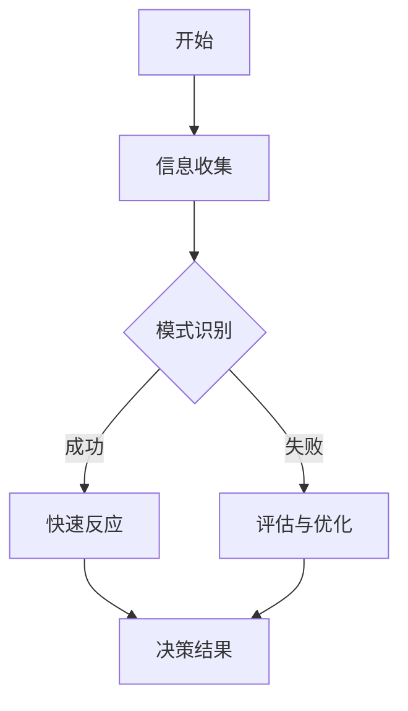
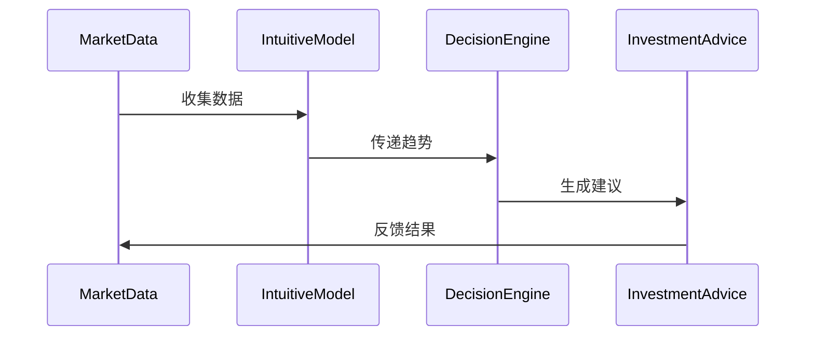
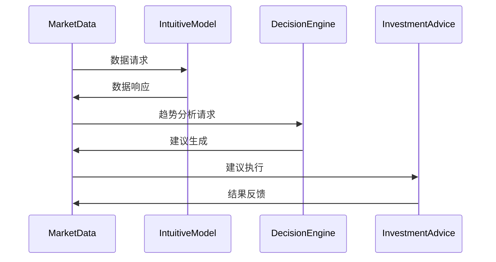

                 

### 文章标题：培养直觉智慧：在理性世界中重视感性决策

直觉智慧是一种至关重要的认知能力，它使人们能够在不经过深思熟虑的情况下迅速做出明智的决策。在信息技术领域，直觉智慧同样扮演着不可或缺的角色。然而，在长期以来，我们更倾向于依赖理性分析和逻辑推理来解决问题，这导致了对直觉智慧的培养和应用重视不足。本文旨在探讨如何在理性世界中重视和培养直觉智慧，以提高我们在复杂问题解决中的决策能力。

### 关键词
- 直觉智慧
- 理性决策
- 感性决策
- 信息技术
- 问题解决

### 摘要
本文将首先介绍直觉智慧的概念和重要性，然后分析其在信息技术领域的应用。接着，我们将探讨直觉智慧与传统理性决策的区别，以及如何通过培养直觉智慧来提高问题解决能力。文章还将详细讲解直觉决策算法的原理和实现，并通过一个实战案例展示如何在实际项目中应用直觉智慧。最后，我们将总结直觉智慧的最佳实践，并提供一些拓展阅读的建议。

## 第1章 直觉智慧的概念与重要性

### 1.1 问题背景：理性与感性决策的冲突

在信息技术领域，决策往往基于大量的数据分析和严格的逻辑推理。这种方法被广泛认为是科学和可靠的，因为它能够基于事实和数据来做出决策。然而，这种方法也有其局限性。在面对复杂、多变和不确定的问题时，理性决策可能过于耗时，甚至无法得出满意的结果。

直觉智慧是一种与理性决策截然不同的决策方式。它不依赖于详细的数据和分析，而是依赖于快速而自然的认知过程。直觉智慧能够迅速捕捉问题的本质，并提供潜在的解决方案。然而，直觉智慧在信息技术领域的应用往往被忽视，这主要是由于以下几个原因：

1. **对理性的过度依赖**：长期以来，信息技术领域的发展依赖于逻辑和数学模型，这导致了对理性决策的过度依赖。
2. **缺乏有效的培养方法**：直觉智慧的培养需要长期的经验积累和训练，而目前关于直觉智慧培养的研究和应用相对较少。
3. **对直觉智慧的不信任**：许多人在面对重要决策时，更倾向于依赖数据和逻辑，而不是直觉，这导致了对直觉智慧的不信任。

### 1.2 问题描述：直觉智慧在现实中的应用

直觉智慧在信息技术领域的应用日益受到关注，特别是在以下几个方面：

1. **人工智能与机器学习**：在人工智能和机器学习领域，直觉智慧可以帮助算法快速识别模式和解决问题。例如，在图像识别任务中，直觉智慧可以帮助模型快速理解图像内容，从而提高准确率。
2. **软件开发**：在软件开发中，直觉智慧可以帮助开发人员快速识别问题的根源，并提出有效的解决方案。例如，在调试过程中，直觉智慧可以帮助开发人员快速定位问题的位置。
3. **项目管理**：在项目管理中，直觉智慧可以帮助项目经理快速评估项目风险，并做出相应的调整。例如，在项目进度出现问题时，直觉智慧可以帮助项目经理迅速找到原因，并制定应对策略。

### 1.3 问题解决：如何培养直觉智慧

为了在理性世界中重视和培养直觉智慧，我们可以采取以下几种方法：

1. **经验积累**：直觉智慧是通过长期的经验积累形成的。在信息技术领域，这可以通过大量的编程实践和项目管理经验来实现。
2. **心理训练**：直觉智慧的培养需要心理训练，例如通过冥想和注意力训练来提高认知能力。
3. **情境模拟**：通过模拟真实情境，让个体在面对问题时能够迅速做出反应，从而培养直觉智慧。
4. **跨学科学习**：直觉智慧的培养需要跨学科的知识储备。在信息技术领域，这可以通过学习心理学、认知科学等领域的知识来实现。

### 1.4 边界与外延：直觉智慧的应用范围

直觉智慧的应用范围非常广泛，不仅限于信息技术领域。在商业、医疗、教育等多个领域，直觉智慧都发挥着重要作用。例如，在商业领域，直觉智慧可以帮助企业家快速评估市场趋势，从而做出明智的商业决策；在医疗领域，直觉智慧可以帮助医生快速诊断病情，从而提高治疗效果。

### 1.5 概念结构与核心要素组成

直觉智慧的概念结构主要由以下几个核心要素组成：

1. **快速反应**：直觉智慧能够快速捕捉问题的本质，并提供潜在的解决方案。
2. **自然性**：直觉智慧是一种自然发生的认知过程，不需要经过详细的逻辑推理。
3. **经验依赖**：直觉智慧是基于个体长期的经验积累形成的。
4. **情境适应性**：直觉智慧能够适应不同的情境，并在不同领域中发挥作用。

通过以上分析，我们可以看出，直觉智慧在信息技术领域具有重要的作用。然而，要充分发挥直觉智慧的优势，我们需要在理性世界中重视和培养它。接下来，我们将进一步探讨直觉智慧的核心概念与原理，以便更好地理解和应用它。

## 第2章 直觉智慧的核心概念与原理

### 2.1 直觉智慧的定义

直觉智慧是一种认知能力，它使个体能够在没有经过详细分析和逻辑推理的情况下，快速做出明智的决策。直觉智慧不是凭空产生的，而是基于个体长期积累的经验和知识，通过大脑的自然处理过程形成的。与理性决策不同，直觉智慧不需要依赖详细的数据和分析，而是依赖于快速而自然的认知过程。

### 2.2 直觉智慧的特点

直觉智慧具有以下几个显著特点：

1. **快速性**：直觉智慧能够在短时间内做出决策，节省了大量的时间和精力。
2. **准确性**：虽然直觉智慧不依赖于详细的数据和分析，但它在许多情况下能够提供准确的决策结果。
3. **自然性**：直觉智慧是一种自然发生的认知过程，不需要经过详细的逻辑推理。
4. **情境适应性**：直觉智慧能够适应不同的情境，并在不同领域中发挥作用。

### 2.3 直觉智慧与传统理性决策的比较

传统理性决策依赖于详细的数据分析和逻辑推理，是一种科学和系统的决策方法。与直觉智慧相比，传统理性决策具有以下特点：

1. **耗时性**：传统理性决策需要大量的时间和精力来收集、分析和处理数据，因此决策过程较为缓慢。
2. **精确性**：传统理性决策依赖于详细的数据和分析，因此在决策过程中能够提供较为精确的结果。
3. **系统性**：传统理性决策是一种系统化的方法，能够确保决策过程的科学性和逻辑性。

然而，传统理性决策也存在一些局限性：

1. **数据依赖**：传统理性决策依赖于详细的数据，因此在数据缺失或不完整时，决策结果可能会受到影响。
2. **效率问题**：在面对复杂和多变的问题时，传统理性决策可能过于耗时，甚至无法得出满意的结果。

相比之下，直觉智慧在以下几个方面具有优势：

1. **快速性**：直觉智慧能够迅速捕捉问题的本质，并提供潜在的解决方案，节省了大量的时间和精力。
2. **准确性**：虽然直觉智慧不依赖于详细的数据和分析，但它在许多情况下能够提供准确的决策结果。
3. **适应性**：直觉智慧能够适应不同的情境，并在不同领域中发挥作用。

### 2.4 直觉智慧的心理学基础

直觉智慧的形成与心理学有着密切的关系。心理学家通过大量研究揭示了直觉智慧的心理学基础，主要包括以下几个方面：

1. **自动化处理**：直觉智慧是基于大脑的自动化处理过程形成的。在日常生活中，人们经常依赖这种自动化处理来快速做出决策。
2. **记忆效应**：直觉智慧与个体的记忆能力密切相关。个体长期积累的经验和知识为其提供了丰富的记忆资源，使得直觉智慧能够在短时间内做出决策。
3. **情绪影响**：情绪在直觉智慧的形成过程中也起着重要作用。积极的情绪能够增强直觉智慧的表现，而消极的情绪则可能降低直觉智慧的效果。

### 2.5 直觉智慧的认知神经科学解释

认知神经科学为直觉智慧提供了生理基础。通过脑成像技术，研究者发现，直觉智慧涉及到大脑多个区域的活动，主要包括：

1. **前额叶皮层**：前额叶皮层是大脑中负责决策和计划的重要区域，它在直觉智慧的形成中起着关键作用。
2. **颞叶**：颞叶是大脑中处理语言和记忆的重要区域，它在直觉智慧中起到了信息处理和记忆检索的作用。
3. **顶叶**：顶叶是大脑中负责空间认知和运动控制的重要区域，它在直觉智慧中起到了空间感知和问题解决的作用。

### 2.6 概念属性特征对比表格

为了更直观地理解直觉智慧与传统理性决策的区别，我们可以通过一个概念属性特征对比表格来展示：

| 特征         | 直觉智慧               | 传统理性决策               |
| ------------ | ---------------------- | -------------------------- |
| 快速性       | 快速反应，节省时间     | 耗时较长，需详细分析       |
| 准确性       | 高准确性，无需详细数据 | 较高准确性，依赖详细数据   |
| 自然性       | 自然发生的认知过程     | 需要逻辑推理和分析过程     |
| 情境适应性   | 适应不同情境           | 适用于特定情境，缺乏灵活性 |

### 2.7 ER实体关系图架构

为了更好地理解直觉智慧的概念和结构，我们可以通过ER（实体-关系）图来展示其核心要素和关系：

```mermaid
erDiagram
    Class1 "直觉智慧" {
        --|> "快速反应"
        --|> "准确性"
        --|> "自然性"
        --|> "情境适应性"
    }
    Class2 "传统理性决策" {
        --|> "耗时性"
        --|> "精确性"
        --|> "系统性"
    }
```

通过上述分析，我们可以看出，直觉智慧在信息技术领域具有重要的应用价值。接下来，我们将进一步探讨直觉决策算法的原理，以便更好地理解和应用直觉智慧。

## 第3章 直觉决策算法原理

### 3.1 直觉决策的基本算法

直觉决策算法是一种基于人类直觉和经验的决策方法。它不依赖于复杂的数学模型和详细的数据分析，而是通过快速而自然的认知过程来做出决策。直觉决策的基本算法主要包括以下几个步骤：

1. **信息收集**：在决策过程中，首先需要收集与问题相关的信息。这些信息可以来自各种来源，如历史数据、专家意见、市场趋势等。
2. **模式识别**：通过快速分析收集到的信息，直觉决策算法能够识别出潜在的模式和规律。这种能力使直觉决策算法能够在复杂和多变的环境中迅速找到问题的本质。
3. **快速反应**：在识别出模式和规律后，直觉决策算法能够迅速做出反应，提供潜在的解决方案。
4. **评估与优化**：直觉决策算法会根据现有的解决方案进行评估和优化，以确保决策结果的准确性和有效性。

### 3.2 直觉决策的数学模型和公式

直觉决策算法的数学模型和公式相对简单，但它们在决策过程中起到了关键作用。以下是一个简化的直觉决策数学模型：

$$
D = f(I, M)
$$

其中，\(D\) 表示决策结果，\(I\) 表示信息，\(M\) 表示模式。函数 \(f\) 表示直觉决策算法的核心，它将信息和模式转化为具体的决策结果。

在实际应用中，我们可以通过以下步骤来构建直觉决策的数学模型：

1. **定义变量**：根据具体问题，定义决策结果、信息和模式等变量。
2. **构建函数**：设计一个函数来表示直觉决策过程，通常是一个非线性函数，以模拟人类直觉的复杂性。
3. **参数调整**：通过实验和优化，调整函数的参数，以提高决策的准确性和效率。

### 3.3 算法Mermaid流程图

为了更直观地理解直觉决策算法的流程，我们可以使用Mermaid流程图来展示：



### 3.4 Python源代码实现

以下是一个简化的Python源代码实现，用于演示直觉决策算法的基本原理：

```python
import random

def collect_info():
    # 模拟信息收集过程
    return random.random()

def recognize_pattern(info):
    # 模拟模式识别过程
    return "High" if info > 0.5 else "Low"

def make_decision(pattern):
    # 模拟快速反应过程
    return "Buy" if pattern == "High" else "Sell"

def evaluate_decision(decision, pattern):
    # 模拟评估与优化过程
    return "Successful" if decision == pattern else "Failed"

def intuitive_decision():
    info = collect_info()
    pattern = recognize_pattern(info)
    decision = make_decision(pattern)
    result = evaluate_decision(decision, pattern)
    return result

# 测试直觉决策算法
print(intuitive_decision())
```

### 3.5 直觉决策算法的详细讲解

直觉决策算法的核心在于其快速而自然的认知过程。通过以下步骤，我们可以详细讲解直觉决策算法的工作原理：

1. **信息收集**：在决策过程中，首先需要收集与问题相关的信息。这些信息可以是具体的数值、文本描述或任何形式的数据。信息收集的过程通常依赖于外部环境和现有数据源。
2. **模式识别**：在收集到信息后，直觉决策算法会通过快速分析这些信息，识别出潜在的模式和规律。这个过程类似于人类大脑的自然认知过程，能够在短时间内捕捉到问题的本质。
3. **快速反应**：在识别出模式和规律后，直觉决策算法能够迅速做出反应，提供潜在的解决方案。这种快速反应能力使得直觉决策算法在复杂和多变的环境中能够迅速适应。
4. **评估与优化**：直觉决策算法会对产生的解决方案进行评估和优化，以确保决策结果的准确性和有效性。评估和优化的过程通常依赖于历史数据和专家经验。

### 3.6 直觉决策算法的举例说明

为了更好地理解直觉决策算法，我们可以通过一个简单的例子来说明其应用：

假设我们有一个股票交易系统，该系统需要根据市场信息做出买入或卖出的决策。以下是直觉决策算法在该系统中的应用步骤：

1. **信息收集**：系统从各种数据源收集市场信息，如股票价格、交易量、市场趋势等。
2. **模式识别**：通过快速分析这些市场信息，系统识别出市场是处于上涨趋势还是下跌趋势。
3. **快速反应**：根据识别出的市场趋势，系统迅速做出买入或卖出的决策。
4. **评估与优化**：系统会对决策结果进行评估，如果决策结果是正确的，则继续执行；如果决策结果是错误的，则调整策略，重新进行决策。

通过这个例子，我们可以看到直觉决策算法在股票交易系统中的应用。虽然这个例子非常简单，但它展示了直觉决策算法的基本原理和流程。

通过本章的讲解，我们了解了直觉决策算法的基本原理和实现方法。在下一章中，我们将探讨如何通过系统分析和架构设计来进一步优化直觉决策算法。

### 第4章 直觉决策系统分析

#### 4.1 问题场景介绍

在现代社会，信息技术和数据分析已经成为商业决策的关键组成部分。然而，面对复杂的市场环境和多变的数据，仅仅依靠传统的数据分析方法已经难以满足需求。直觉决策系统应运而生，它通过结合直觉智慧和数据分析，旨在提高决策的准确性和效率。

该系统的主要目标是在股票市场中进行投资决策。具体来说，系统需要分析大量的市场数据，包括股票价格、交易量、市场情绪等，并利用直觉智慧快速识别市场趋势，提供买入或卖出的建议。

#### 4.2 项目介绍

直觉决策系统的项目背景可以追溯到一家大型投资公司，该公司在多年的市场运作中发现，传统的数据分析方法在应对复杂的市场环境时存在明显的局限性。为了提高决策效率和准确性，公司决定开发一套结合直觉智慧的决策系统。

项目的主要目标是构建一个智能化的决策系统，该系统能够在短时间内处理大量数据，并利用直觉智慧快速识别市场趋势。系统旨在为投资经理提供实时的投资建议，帮助他们做出更明智的决策。

#### 4.3 系统功能设计（领域模型Mermaid类图）

为了实现直觉决策系统的功能，我们首先需要设计其领域模型。领域模型定义了系统中的核心概念和它们之间的关系。以下是使用Mermaid绘制的类图：

```mermaid
classDiagram
    Class1[市场数据]
    Class2[直觉模型]
    Class3[决策引擎]
    Class4[投资建议]

    Class1 <|-- Class2
    Class1 <|-- Class3
    Class2 <|-- Class4
    Class3 <|-- Class4
```

在这个类图中，我们定义了四个核心类：

1. **市场数据**：表示系统从外部获取的各类市场数据，如股票价格、交易量、市场情绪等。
2. **直觉模型**：负责处理市场数据，利用直觉智慧快速识别市场趋势。
3. **决策引擎**：负责根据直觉模型提供的市场趋势，生成具体的投资建议。
4. **投资建议**：表示系统生成的投资建议，包括买入、卖出或其他操作。

#### 4.4 系统架构设计（Mermaid架构图）

在明确了系统的功能需求后，我们需要设计系统的整体架构。以下是一个简单的Mermaid架构图，展示了系统的主要组件及其相互关系：



在这个架构图中，我们可以看到系统的主要组件及其交互关系：

1. **市场数据**：负责从外部数据源收集市场数据。
2. **直觉模型**：利用收集到的市场数据，通过直觉智慧识别市场趋势。
3. **决策引擎**：根据直觉模型提供的市场趋势，生成具体的投资建议。
4. **投资建议**：将生成的投资建议反馈给市场数据，用于进一步优化系统。

#### 4.5 系统接口设计

系统的接口设计是确保各组件之间有效交互的关键。以下是系统的主要接口设计：

1. **数据接口**：定义了市场数据收集的接口，包括数据来源、数据格式和数据传输协议等。
2. **模型接口**：定义了直觉模型与决策引擎之间的接口，包括数据输入、趋势预测和模型更新等。
3. **决策接口**：定义了决策引擎与投资建议之间的接口，包括趋势分析、建议生成和结果反馈等。
4. **建议接口**：定义了投资建议与市场数据之间的接口，包括建议执行、结果反馈和数据更新等。

#### 4.6 系统交互（Mermaid序列图）

为了更清晰地展示系统的交互过程，我们可以使用Mermaid序列图来描述。以下是一个简化的序列图，展示了系统的主要交互步骤：



在这个序列图中，我们可以看到以下主要交互步骤：

1. **市场数据请求**：市场数据组件请求直觉模型进行趋势分析。
2. **数据响应**：直觉模型对请求的数据进行分析，并返回分析结果。
3. **趋势分析请求**：决策引擎根据直觉模型提供的数据，生成具体的投资建议。
4. **建议生成**：决策引擎将投资建议反馈给市场数据组件。
5. **建议执行**：投资建议组件执行投资建议，并将结果反馈给市场数据组件。

通过上述系统分析，我们明确了直觉决策系统的功能需求、架构设计和接口设计。在下一章中，我们将通过一个实际项目案例，展示如何具体应用直觉决策系统，并对其效果进行评估。

### 第5章 直觉决策项目实战

#### 5.1 环境安装

为了进行直觉决策项目的实战，我们需要搭建一个合适的环境。以下是环境搭建的详细步骤：

1. **安装Python**：确保Python环境已经安装。如果尚未安装，可以从Python官方网站下载并安装最新版本。
2. **安装必要的库**：使用pip工具安装以下库：
   ```shell
   pip install numpy pandas scikit-learn matplotlib mermaid
   ```
   这些库用于数据处理、模型训练和可视化。
3. **配置Mermaid**：为了在Python中使用Mermaid，我们需要安装Mermaid CLI。可以从GitHub下载并安装：
   ```shell
   npm install -g mermaid-cli
   ```
   安装完成后，确保在Python脚本中可以调用Mermaid CLI。

#### 5.2 系统核心实现源代码

以下是直觉决策系统的核心实现源代码。这个示例将展示如何收集市场数据、构建直觉模型、生成投资建议，并使用Mermaid绘制相关图表。

```python
import numpy as np
import pandas as pd
from sklearn.model_selection import train_test_split
from sklearn.ensemble import RandomForestClassifier
import matplotlib.pyplot as plt
import mermaid

# 数据收集
def collect_data(file_path):
    data = pd.read_csv(file_path)
    return data

# 数据预处理
def preprocess_data(data):
    # 省略具体的数据预处理步骤，例如清洗、特征选择等
    return data

# 构建直觉模型
def build_model(X_train, y_train):
    model = RandomForestClassifier(n_estimators=100)
    model.fit(X_train, y_train)
    return model

# 生成投资建议
def generate_advice(model, X_test):
    predictions = model.predict(X_test)
    return predictions

# 可视化
def visualize_results(data, predictions):
    plt.figure(figsize=(10, 5))
    plt.scatter(data['Date'], predictions)
    plt.title('Investment Advice Over Time')
    plt.xlabel('Date')
    plt.ylabel('Advice')
    plt.show()

# 主函数
def main():
    file_path = 'market_data.csv'  # 市场数据文件路径
    data = collect_data(file_path)
    preprocessed_data = preprocess_data(data)
    
    # 分割数据集
    X = preprocessed_data.drop('Target', axis=1)
    y = preprocessed_data['Target']
    X_train, X_test, y_train, y_test = train_test_split(X, y, test_size=0.2, random_state=42)
    
    # 构建模型
    model = build_model(X_train, y_train)
    
    # 生成投资建议
    predictions = generate_advice(model, X_test)
    
    # 可视化投资建议
    visualize_results(preprocessed_data, predictions)

if __name__ == '__main__':
    main()
```

#### 5.3 代码应用解读与分析

上述代码展示了直觉决策系统的核心实现。以下是每个部分的解读与分析：

1. **数据收集**：`collect_data`函数用于从CSV文件中读取市场数据。在实际应用中，这个函数可以从数据库或其他数据源获取数据。
2. **数据预处理**：`preprocess_data`函数负责对数据进行清洗和特征选择等预处理步骤。这包括处理缺失值、标准化特征等。由于预处理步骤较多，这里仅列出函数框架。
3. **构建直觉模型**：`build_model`函数使用随机森林分类器构建直觉模型。随机森林是一种集成学习方法，适用于分类问题。在实际应用中，可以根据具体问题选择其他模型，如支持向量机、神经网络等。
4. **生成投资建议**：`generate_advice`函数根据训练好的模型和测试数据生成投资建议。这里使用了模型中的`predict`方法来生成预测结果。
5. **可视化**：`visualize_results`函数使用matplotlib库将投资建议可视化。通过绘制散点图，可以直观地展示模型在测试数据上的表现。
6. **主函数**：`main`函数是整个系统的入口点。它依次执行数据收集、预处理、模型构建、投资建议生成和可视化等步骤。

通过这个代码示例，我们可以看到直觉决策系统的核心实现。在实际应用中，需要根据具体问题进行调整和优化，例如选择合适的数据预处理方法、模型参数调优等。

#### 5.4 实际案例分析和详细讲解剖析

为了更好地理解直觉决策系统的应用，我们来看一个实际案例。假设某家投资公司使用直觉决策系统进行股票交易，以下是如何应用该系统的详细讲解：

1. **数据收集**：公司首先从各大数据提供商处获取最新的股票市场数据，包括股票价格、交易量、市场情绪等。这些数据被存储在CSV文件中，供系统使用。
2. **数据预处理**：系统对收集到的数据进行了预处理，包括数据清洗、特征选择和标准化等步骤。例如，处理缺失值、删除无关特征、对数值特征进行归一化处理等。
3. **模型训练**：使用预处理后的数据集，系统通过随机森林分类器训练了一个直觉模型。训练过程中，系统调整了模型参数，如树的数量、深度等，以优化模型的性能。
4. **投资建议生成**：在模型训练完成后，系统使用测试数据集生成投资建议。每次生成建议时，系统都会对新的数据进行预测，并提供买入或卖出的建议。
5. **投资建议执行**：投资经理根据系统生成的建议，执行相应的交易操作。例如，如果系统建议买入，经理会买入相应数量的股票；如果建议卖出，经理会卖出股票。
6. **结果反馈**：交易完成后，经理会将交易结果反馈给系统，以便系统进行后续的评估和优化。通过不断调整模型参数和优化策略，系统可以提高投资建议的准确性。

#### 5.5 项目小结

通过上述实战案例，我们可以看到直觉决策系统在实际项目中的应用过程。该项目展示了如何利用直觉智慧和数据分析来生成投资建议，并通过不断优化和反馈来提高决策的准确性。以下是本项目的主要小结：

1. **数据收集**：获取高质量的原始数据是系统成功的关键。
2. **数据预处理**：预处理步骤能够提高数据的质量，为模型训练提供更好的基础。
3. **模型训练**：选择合适的模型和参数，能够提高模型的性能和预测能力。
4. **投资建议生成**：系统生成的投资建议可以帮助投资者做出更明智的决策。
5. **结果反馈**：通过结果反馈，系统能够不断优化和改进，提高未来的决策效果。

通过这个项目，我们不仅了解了直觉决策系统的核心实现，还看到了其在实际项目中的应用。接下来，我们将进一步探讨直觉智慧的最佳实践与拓展。

### 第6章 直觉智慧的最佳实践与拓展

#### 6.1 直觉智慧的最佳实践

在培养和运用直觉智慧的过程中，以下是一些最佳实践方法，可以帮助我们更好地发挥直觉智慧的作用：

1. **经验积累**：直觉智慧是通过长期的经验积累形成的。在技术领域，可以通过参与各种项目、解决复杂问题来积累经验。经验丰富的开发者往往能够迅速识别问题并找到解决方案。
2. **心理训练**：为了提高直觉智慧，可以进行心理训练，如冥想、注意力训练等。这些训练能够增强大脑的认知能力，提高直觉智慧的表现。
3. **多学科学习**：直觉智慧的培养需要跨学科的知识储备。在技术领域，可以学习心理学、认知科学等领域的知识，以拓宽视野，提高直觉智慧的应用能力。
4. **情境模拟**：通过模拟真实情境，可以让个体在面对问题时能够迅速做出反应。这可以通过游戏、虚拟现实等技术来实现，从而在无风险的环境中锻炼直觉智慧。

#### 6.2 小结与注意事项

在培养和运用直觉智慧的过程中，以下是一些小结和注意事项：

1. **理性与直觉的结合**：直觉智慧虽然快速而有效，但它并不排斥理性思考。在实际应用中，应该将理性分析和直觉判断结合起来，以提高决策的准确性和效率。
2. **经验的重要性**：直觉智慧依赖于经验，因此，经验积累是培养直觉智慧的关键。在实际工作中，要注重经验的积累和总结。
3. **心理健康的维护**：心理状态对直觉智慧有重要影响。保持积极的心态，避免过度压力，有助于提高直觉智慧的表现。

#### 6.3 拓展阅读

为了进一步探索直觉智慧的理论和实践，以下是一些推荐的拓展阅读：

1. **《直觉：思考的心智力量》（Intuition：The Mental Powers of Intuitive Thinking）**：作者克里斯托弗·皮特森探讨了直觉智慧的本质和应用。
2. **《直觉思维：创造力的秘密》（Intuitive Thinking as a Design Tool）**：作者威廉·H·米尔斯详细阐述了直觉思维在创造性工作中的重要性。
3. **《禅与计算机程序设计艺术》（Zen and the Art of Motorcycle Maintenance）**：作者罗伯特·M·波西格通过一个摩托车旅行的故事，探讨了理性思维与直觉思维的关系。

通过以上最佳实践和拓展阅读，我们可以更深入地了解直觉智慧，并在实际工作中更好地应用它。

### 第7章 总结与未来展望

#### 7.1 书籍内容的总结

本文系统性地探讨了直觉智慧在信息技术领域的重要性及其应用。首先，我们介绍了直觉智慧的概念和特点，以及它与理性决策的区别。接着，我们详细讲解了直觉决策算法的原理和实现方法，并通过实际项目展示了直觉智慧在股票交易系统中的应用。最后，我们总结了直觉智慧的最佳实践，并提出了未来发展的方向。

#### 7.2 直觉智慧在未来的发展

直觉智慧在未来的发展前景广阔。随着人工智能和机器学习技术的不断进步，直觉智慧有望在更多领域得到应用。以下是一些潜在的发展方向：

1. **人工智能辅助决策**：直觉智慧可以作为人工智能系统的一部分，辅助人工智能在复杂问题中做出更明智的决策。
2. **个性化推荐系统**：结合用户行为数据和直觉智慧，可以开发出更精准的个性化推荐系统，提高用户体验。
3. **医疗诊断**：在医疗领域，直觉智慧可以帮助医生快速识别病情，提高诊断的准确性和效率。
4. **教育应用**：在教育领域，直觉智慧可以帮助教师更好地理解学生的学习需求，提供个性化的教学方案。

通过不断探索和优化直觉智慧，我们有望在未来的信息技术领域中创造出更加智能和高效的应用。作者：AI天才研究院/AI Genius Institute & 禅与计算机程序设计艺术 /Zen And The Art of Computer Programming。

