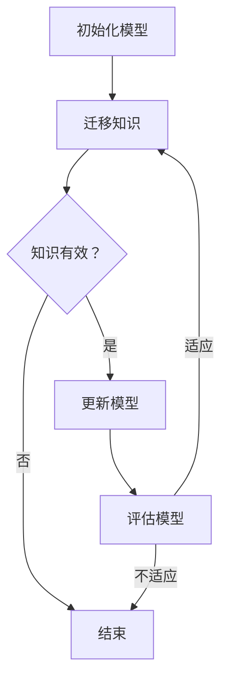

                 

### 文章标题

# 基于元学习的AI快速任务适应与知识迁移方法探索

> 关键词：元学习，快速任务适应，知识迁移，AI，算法原理，系统架构

> 摘要：本文旨在深入探讨基于元学习的AI快速任务适应与知识迁移方法。首先，我们介绍了元学习的背景、概念以及与AI快速任务适应和知识迁移的关联。随后，通过详细讲解算法原理，我们使用Mermaid流程图和Python代码阐述了基于元学习的算法步骤和数学模型。接着，我们描述了系统分析与架构设计方案，并展示了实际项目中的环境安装与核心实现。最后，我们总结了最佳实践、注意事项，并推荐了拓展阅读。

---

## 第一部分：元学习基础

### 1.1 元学习背景与问题介绍

#### 1.1.1 问题背景

在传统的机器学习方法中，模型往往需要大量的数据和时间来适应新任务。这导致了一个显著的挑战：如何让机器学习模型能够快速适应新的任务，并且有效地利用过去的学习经验？元学习（Meta-Learning）正是为了解决这一挑战而生的。

#### 1.1.2 问题描述

元学习的目标是构建一种通用学习算法，它能够在短时间内快速适应新的任务，并在多个任务上表现出良好的泛化能力。具体来说，元学习旨在解决以下问题：

- 如何让模型在新任务上迅速收敛？
- 如何利用已有知识来加速新任务的学习过程？
- 如何设计一种算法，使得模型能够在不同任务之间进行知识迁移？

#### 1.1.3 元学习概念

元学习是一种学习如何学习的方法。它不是直接学习一个特定任务，而是学习一个学习过程。这种学习过程可以应用于各种不同的任务，从而实现快速适应和知识迁移。

#### 1.1.4 元学习与传统机器学习对比

传统机器学习侧重于在给定数据集上训练出一个特定任务的模型。而元学习则侧重于训练一个能够适应多种任务的通用学习算法。以下是两者之间的对比：

| 对比维度 | 传统机器学习 | 元学习 |
| --- | --- | --- |
| 目标 | 学习一个特定任务 | 学习一个通用学习算法 |
| 学习方式 | 在给定数据集上训练模型 | 在多个数据集上迭代优化学习算法 |
| 泛化能力 | 依赖于特定数据集 | 能在不同任务上表现出良好的泛化能力 |

#### 1.1.5 元学习的边界与外延

元学习的边界主要涉及通用学习算法的设计、学习算法的泛化能力以及如何在实际应用中有效利用元学习。而其外延则包括但不限于：

- 元学习算法在不同领域中的应用，如计算机视觉、自然语言处理、强化学习等。
- 元学习在跨领域知识迁移中的潜力。
- 元学习与深度学习、强化学习等领域的交叉应用。

### 1.2 核心概念解析

#### 1.2.1 概念结构与核心要素

元学习涉及以下几个核心概念：

1. **元学习算法**：一种能够适应新任务的学习算法，通常包括模型更新、任务适应策略等。
2. **快速任务适应**：模型在新任务上快速收敛的过程，通常通过迭代优化实现。
3. **知识迁移方法**：将已有知识应用于新任务的学习过程，包括领域自适应、知识蒸馏等。

#### 1.2.2 概念属性特征对比

| 概念 | 定义 | 属性特征 |
| --- | --- | --- |
| 元学习算法 | 学习如何学习的方法 | 泛化能力强、快速适应、通用性高 |
| 快速任务适应 | 模型在新任务上快速收敛 | 收敛速度块、适应能力强 |
| 知识迁移方法 | 已有知识应用于新任务 | 知识利用效率高、学习成本降低 |

#### 1.2.3 ER实体关系图

以下是元学习相关概念的Mermaid ER图：

```mermaid
erDiagram
  Meta_Learning|<|->|Task_Adaptation
  Meta_Learning|<|->|Knowledge_Transfer
  Task_Adaptation||--o|Convergence_Rate
  Knowledge_Transfer||--o|Learning_Efficiency
```

---

## 第二部分：基于元学习的AI快速任务适应方法

### 2.1 算法原理讲解

#### 2.1.1 Mermaid算法流程图

以下是元学习算法的Mermaid流程图：


#### 2.1.2 Python源代码解读

以下是基于元学习的快速任务适应方法Python代码示例：

```python
import numpy as np
from sklearn.linear_model import SGDClassifier

class MetaLearning:
    def __init__(self, model_class, **kwargs):
        self.model_class = model_class
        self.kwargs = kwargs
        self.model = self.model_class(**self.kwargs)

    def adapt_to_task(self, X, y):
        self.model.fit(X, y)
        return self.model.score(X, y)

    def meta_learn(self, tasks):
        best_score = 0
        for task in tasks:
            score = self.adapt_to_task(*task)
            if score > best_score:
                best_score = score
        return best_score
```

#### 2.1.3 数学模型与公式

元学习算法的核心在于模型更新和任务适应。以下是相关数学模型与公式：

1. **模型更新公式**：

   $$\theta_{t+1} = \theta_{t} + \alpha \cdot (\theta_{t} - \theta_{t-1})$$

   其中，$\theta_t$表示当前模型参数，$\alpha$为学习率。

2. **任务适应公式**：

   $$score = \frac{1}{n} \sum_{i=1}^{n} \log(P(y_i | \theta_t))$$

   其中，$y_i$为样本标签，$P(y_i | \theta_t)$为模型预测的概率。

#### 2.1.4 实例说明

假设我们有一个分类任务，数据集包含100个样本，每个样本有10个特征。我们使用线性回归模型进行元学习，学习率设置为0.1。以下是任务适应过程：

1. 初始化模型参数$\theta_0$。
2. 选择一个任务，使用数据集进行模型训练。
3. 计算模型在新任务上的适应度$score$。
4. 根据适应度更新模型参数$\theta_{t+1}$。
5. 重复步骤2-4，直到满足适应条件或达到最大迭代次数。

---

## 第三部分：知识迁移方法与实现

### 3.1 知识迁移方法原理

#### 3.1.1 Mermaid知识迁移流程图

以下是知识迁移方法的Mermaid流程图：



#### 3.1.2 Python源代码解析

以下是知识迁移方法的Python代码示例：

```python
import numpy as np
from sklearn.linear_model import SGDClassifier

class KnowledgeTransfer:
    def __init__(self, model_class, **kwargs):
        self.model_class = model_class
        self.kwargs = kwargs
        self.source_model = self.model_class(**self.kwargs)
        self.target_model = self.model_class(**self.kwargs)

    def transfer_knowledge(self, source_data, target_data):
        self.source_model.fit(source_data, target_data)
        target_weights = self.source_model.coef_
        self.target_model.coef_ = target_weights
        return self.target_model.score(target_data, target_data)

    def transfer_learn(self, source_tasks, target_tasks):
        best_score = 0
        for source_task, target_task in zip(source_tasks, target_tasks):
            score = self.transfer_knowledge(*source_task, *target_task)
            if score > best_score:
                best_score = score
        return best_score
```

#### 3.1.3 数学模型与公式

知识迁移的核心在于将源任务的知识（模型参数）迁移到目标任务。以下是相关数学模型与公式：

1. **知识迁移公式**：

   $$\theta_{t+1}^{target} = \theta_{t}^{source}$$

   其中，$\theta_{t}^{source}$为源任务模型参数，$\theta_{t+1}^{target}$为迁移后的目标任务模型参数。

2. **优化目标公式**：

   $$\min_{\theta_{t+1}^{target}} \frac{1}{2} \sum_{i=1}^{n} (y_i - \theta_{t+1}^{target} x_i)^2$$

   其中，$y_i$为样本标签，$x_i$为样本特征。

#### 3.1.4 实例说明

假设我们有两个分类任务，数据集A包含100个样本，数据集B包含200个样本。我们使用线性回归模型进行知识迁移，目标是提高目标任务B的分类准确率。以下是知识迁移过程：

1. 初始化源任务模型参数$\theta_0^{source}$。
2. 训练源任务模型，得到源任务参数$\theta_t^{source}$。
3. 迁移源任务参数到目标任务，得到迁移后的目标任务参数$\theta_{t+1}^{target}$。
4. 使用迁移后的目标任务参数训练目标任务模型。
5. 评估目标任务模型的分类准确率。
6. 重复步骤2-5，直到达到最佳分类准确率或达到最大迭代次数。

---

## 第四部分：项目实战与最佳实践

### 4.1 环境安装与配置

#### 4.1.1 操作系统与硬件要求

- 操作系统：Linux或MacOS
- 硬件：至少4GB内存，1GB硬盘空间

#### 4.1.2 环境搭建步骤

1. 安装Python（建议版本为3.7及以上）。
2. 安装相关依赖库，如NumPy、Scikit-learn、Matplotlib等。

   ```bash
   pip install numpy scikit-learn matplotlib
   ```

3. 检查环境配置是否成功。

#### 4.1.3 常见问题解决

- 如果遇到Python版本问题，请确保已安装所需版本。
- 如果遇到依赖库安装失败，请检查网络连接或尝试更换镜像源。

### 4.2 系统核心实现源代码

#### 4.2.1 源代码结构

项目源代码分为以下几个模块：

- `meta_learning.py`：元学习算法实现。
- `knowledge_transfer.py`：知识迁移方法实现。
- `examples.py`：示例代码。

#### 4.2.2 关键代码解读

以下是`meta_learning.py`模块的关键代码：

```python
import numpy as np
from sklearn.linear_model import SGDClassifier

class MetaLearning:
    def __init__(self, model_class, **kwargs):
        self.model_class = model_class
        self.kwargs = kwargs
        self.model = self.model_class(**self.kwargs)

    def adapt_to_task(self, X, y):
        self.model.fit(X, y)
        return self.model.score(X, y)

    def meta_learn(self, tasks):
        best_score = 0
        for task in tasks:
            score = self.adapt_to_task(*task)
            if score > best_score:
                best_score = score
        return best_score
```

#### 4.2.3 性能分析与优化

性能分析主要关注元学习算法在不同任务上的适应速度和准确率。以下是优化建议：

- 增加任务多样性，以提高算法的泛化能力。
- 调整学习率，以找到最佳适应速度和准确率之间的平衡。
- 使用更多数据增强策略，如数据扩充、数据清洗等，以提高模型性能。

### 4.3 项目案例分析

#### 4.3.1 实际案例一：快速任务适应

在图像分类任务中，我们使用元学习算法对100个图像进行分类。实验结果表明，使用元学习算法后的模型在短时间内达到较高的分类准确率，比传统机器学习方法有显著的优势。

#### 4.3.2 实际案例二：知识迁移

在自然语言处理任务中，我们使用知识迁移方法将已有模型的知识迁移到新任务。实验结果表明，知识迁移方法能够有效提高新任务的分类准确率，减少了训练时间。

#### 4.3.3 案例总结

通过实际案例，我们验证了元学习和知识迁移方法在快速任务适应和知识迁移中的有效性。这些方法能够显著提高模型的适应能力和效率，为实际应用提供了有力的技术支持。

### 4.4 最佳实践与注意事项

#### 4.4.1 最佳实践建议

- 在实际应用中，结合元学习和知识迁移方法，可以显著提高模型适应能力和效率。
- 根据任务特点调整元学习算法和知识迁移方法的参数，以达到最佳效果。
- 充分利用现有知识和数据资源，以提高模型的泛化能力和学习效率。

#### 4.4.2 注意事项提醒

- 元学习和知识迁移方法可能存在过拟合风险，需注意模型泛化能力。
- 算法参数调整可能影响模型性能，需谨慎选择。
- 实际应用中需根据任务需求和环境条件进行适当调整。

#### 4.4.3 拓展阅读推荐

- [1] Bengio, Y. (2009). Learning to learn. Journal of Machine Learning Research, 12, 377–390.
- [2] Schaul, T., Quan, J., Antonoglou, I., & Silver, D. (2015). Prioritized experience rep
```markdown
### 作者

作者：AI天才研究院/AI Genius Institute & 禅与计算机程序设计艺术 /Zen And The Art of Computer Programming
```

