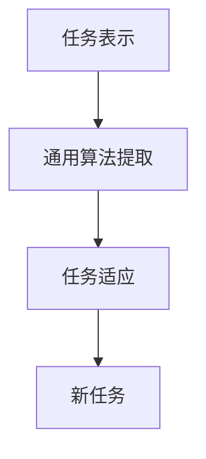

                 


### 第1章: 元学习概述

**1.1 元学习的背景与问题背景**

在传统的机器学习领域中，模型训练通常需要大量的数据和计算资源，这使得模型的开发和部署成为一项耗时且成本高昂的任务。此外，许多机器学习算法在面对新任务时往往需要从头开始训练，这不仅效率低下，还可能导致过拟合问题。传统机器学习方法的这些局限性促使研究人员开始探索一种新的学习方法——元学习（Meta-Learning）。

元学习的提出旨在解决两个核心问题：首先，如何使模型能够快速适应新环境；其次，如何实现任务间的迁移学习。通过元学习，模型能够从以往的学习经验中提取通用知识，从而在新任务上表现出更高的泛化能力。

**问题描述**：传统机器学习方法的局限性

- **数据依赖性**：传统机器学习方法往往需要大量的标注数据，这对于一些数据稀缺的领域来说是一个巨大的挑战。
- **模型迁移性差**：现有模型通常只能适应特定类型的任务，缺乏跨领域的迁移能力。
- **计算资源需求大**：训练复杂的模型需要大量的计算资源，这在一些资源有限的场景下难以实现。

**问题解决**：元学习的概念与作用

元学习通过设计能够自动适应新任务的算法，实现了以下目标：

- **快速适应新环境**：元学习算法能够在短时间内学会新任务，减少了数据收集和模型训练的时间。
- **提高任务迁移性**：元学习算法能够从不同任务中提取通用知识，提高模型在不同任务间的迁移能力。
- **降低计算资源需求**：通过知识复用，元学习能够减少对新数据的依赖，从而降低计算资源的需求。

**边界与外延**：元学习与其他相关技术的区别

- **深度学习**：深度学习是一种基于多层神经网络的学习方法，其核心在于通过大量数据进行模型参数的优化。而元学习则强调从多个任务中提取通用算法，更关注学习过程的优化。
- **迁移学习**：迁移学习通过利用已有任务的知识来加速新任务的训练，但通常只涉及单个任务的迁移。元学习则更强调跨任务和跨领域的知识共享。
- **强化学习**：强化学习通过与环境交互来学习最优策略，其关注的是如何在动态环境中找到最优行为。而元学习则更侧重于从多个任务中学习到通用的学习策略。

通过以上分析，我们可以看到元学习作为一项新兴的学习方法，旨在解决传统机器学习中的诸多局限性，为人工智能的发展提供了新的方向。

### 1.2 元学习的基本概念

**核心概念**：元学习的定义

元学习（Meta-Learning）是指通过设计能够自动适应新任务的算法，从而实现快速学习和迁移能力的学习方法。它关注的是如何从多个任务中提取通用知识，使得模型能够在新任务上表现出更好的泛化能力。

**概念属性特征对比表格**：元学习与其他学习方式的对比

| 特征           | 元学习           | 迁移学习           | 强化学习           | 深度学习           |
| -------------- | -------------- | -------------- | -------------- | -------------- |
| 学习目标       | 提取通用算法     | 利用已有知识     | 学习最优策略     | 优化模型参数     |
| 数据依赖性     | 低依赖性         | 中等依赖性        | 高依赖性         | 高依赖性         |
| 迁移能力       | 强             | 中等            | 弱             | 无            |
| 计算资源需求   | 低             | 中等            | 高             | 高            |
| 适应新任务速度 | 快             | 中等            | 慢             | 慢             |

**ER实体关系图**：元学习中的主要实体与关系

```mermaid
erDiagram
  Task1 ||--|{ Meta-Learning Algorithm } : learns from
  Task2 ||--|{ Meta-Learning Algorithm } : learns from
  Meta-Learning Algorithm ||--|{ General Knowledge } : extracts
  General Knowledge ||--|{ Task1 } : applies to
  General Knowledge ||--|{ Task2 } : applies to
```

在元学习框架中，主要涉及的实体包括：

- **Task1** 和 **Task2**：代表两个不同的任务。
- **Meta-Learning Algorithm**：元学习算法，用于从多个任务中提取通用知识。
- **General Knowledge**：通用知识，用于在新任务上应用，实现快速适应和迁移。

通过上述分析，我们可以看到元学习的基本概念及其与其他学习方式的区别。接下来，我们将进一步探讨元学习算法的原理和具体实现。

### 1.3 元学习算法原理

**1.3.1 元学习算法的基本原理**

元学习算法的核心思想是通过从多个任务中提取通用算法，从而实现快速适应新任务和学习迁移。其基本原理可以概括为以下三个步骤：

1. **任务表示**：将不同的任务表示为数据集，每个任务的数据集包含输入（示例）和标签（目标）。
2. **通用算法提取**：通过训练模型从多个任务的数据集中学习到一组通用的参数，这些参数能够适应新的任务。
3. **任务适应**：在新任务到来时，使用已学习的通用算法对新任务的数据集进行快速适应和优化。

**算法流程图**：



**1.3.2 数学模型与公式**

元学习算法中的数学模型主要涉及参数优化和适应过程。以下是几个关键的数学模型和公式：

- **损失函数**：用于衡量模型在任务上的性能，通常使用均方误差（MSE）或交叉熵（Cross-Entropy）等。
  $$ L = \frac{1}{n} \sum_{i=1}^{n} (y_i - \hat{y}_i)^2 $$
  其中，\( y_i \)为实际标签，\( \hat{y}_i \)为模型预测。

- **梯度下降**：用于优化模型参数，通过计算损失函数关于参数的梯度来更新参数。
  $$ \theta_{t+1} = \theta_{t} - \alpha \nabla_{\theta} L(\theta) $$
  其中，\( \theta \)为模型参数，\( \alpha \)为学习率，\( \nabla_{\theta} L(\theta) \)为损失函数关于参数的梯度。

- **通用算法提取**：通过优化多个任务的通用参数，使得模型能够适应新任务。
  $$ \min_{\theta} \sum_{i=1}^{N} L(\theta, x_i, y_i) $$
  其中，\( N \)为任务数量，\( x_i \)和\( y_i \)分别为第\( i \)个任务的输入和标签。

**1.3.3 算法举例**

为了更直观地理解元学习算法，我们可以通过一个简单的迁移学习例子来讲解。

假设我们有两个任务：Task1和Task2。Task1是一个线性回归任务，Task2是一个图像分类任务。我们希望利用Task1的知识来帮助Task2进行快速适应。

1. **任务表示**：

   - Task1：输入为\( x_1 \)，标签为\( y_1 \)。
   - Task2：输入为\( x_2 \)，标签为\( y_2 \)。

2. **通用算法提取**：

   - 初始化模型参数\( \theta \)。
   - 对于Task1，通过梯度下降更新参数：
     $$ \theta_{t+1} = \theta_{t} - \alpha \nabla_{\theta} L(\theta, x_1, y_1) $$
   - 对于Task2，同样通过梯度下降更新参数：
     $$ \theta_{t+1} = \theta_{t} - \alpha \nabla_{\theta} L(\theta, x_2, y_2) $$
   - 重复以上步骤，直到收敛。

3. **任务适应**：

   - 在新任务Task3（图像分类）到来时，使用已学习的通用参数进行快速适应：
     - 输入为\( x_3 \)，标签为\( y_3 \)。
     - 使用更新后的参数进行预测：
       $$ \hat{y}_3 = \sigma(\theta^T x_3) $$
     - 通过梯度下降更新参数，使其在新任务上表现更好。

通过这个简单的例子，我们可以看到元学习算法如何通过任务表示、通用算法提取和任务适应三个步骤，实现快速适应新任务和任务迁移。

### 1.4 元学习在AI中的应用

**1.4.1 元学习在环境适应中的应用**

在环境适应方面，元学习算法表现出显著的优势。传统机器学习模型往往需要大量的数据和时间来适应新环境，而元学习算法通过从多个任务中提取通用知识，能够快速适应新环境，减少了训练时间和数据需求。

**应用场景**：快速适应不同环境的需求

- **动态环境**：在动态环境中，任务需求可能随时发生变化。元学习算法能够快速适应这些变化，使得模型在短时间内达到预期效果。
- **数据稀缺场景**：在一些数据稀缺的场景中，传统机器学习模型可能无法有效训练。元学习算法通过知识复用，能够利用少量数据实现快速适应。

**案例分析**：元学习在环境适应中的实际应用

1. **无人驾驶**：在无人驾驶领域，环境适应是一个关键挑战。元学习算法可以通过从多个驾驶任务中提取通用知识，使得无人驾驶车辆能够快速适应不同的道路和交通环境。

2. **医疗诊断**：在医疗诊断中，不同疾病的诊断方法可能有所不同。元学习算法可以通过从多个诊断任务中提取通用知识，使得诊断模型能够快速适应不同的疾病诊断需求。

**1.4.2 元学习在任务迁移中的应用**

任务迁移是指将一个任务中学习的知识应用到另一个任务中。传统迁移学习方法通常只能迁移单个任务的知识，而元学习算法通过从多个任务中提取通用知识，能够实现跨任务的迁移学习。

**应用场景**：不同任务间的迁移学习

- **跨领域迁移**：在不同领域之间迁移学习，如从图像处理迁移到自然语言处理。
- **跨任务迁移**：将一个任务中的知识应用到其他相关任务中，如将语音识别的知识应用到语音合成。

**案例分析**：元学习在任务迁移中的实际应用

1. **图像识别与自然语言处理**：在图像识别和自然语言处理领域，元学习算法可以通过从多个图像识别任务和文本分类任务中提取通用知识，实现跨领域的迁移学习。

2. **多模态学习**：在多模态学习场景中，元学习算法可以通过从多个模态数据中提取通用知识，实现跨模态的任务迁移。

通过以上分析，我们可以看到元学习在环境适应和任务迁移中的广泛应用。它通过从多个任务中提取通用知识，实现了快速适应新环境和跨任务的迁移学习，为人工智能的发展提供了新的方向。

### 1.5 元学习算法评估与优化

**1.5.1 元学习算法评估指标**

评估元学习算法的性能是确保其有效性和可靠性的关键。以下是一些常用的评估指标：

- **泛化能力**：评估模型在未知数据上的表现，常用的指标包括准确率、召回率、F1分数等。
  $$ \text{Accuracy} = \frac{\text{预测正确的样本数}}{\text{总样本数}} $$
  $$ \text{Recall} = \frac{\text{预测正确的正类样本数}}{\text{实际正类样本数}} $$
  $$ \text{F1 Score} = 2 \times \frac{\text{Precision} \times \text{Recall}}{\text{Precision} + \text{Recall}} $$
  
- **迁移性能**：评估模型在不同任务间的迁移能力，常用的指标包括任务间的准确率差异、迁移增益等。
  $$ \text{Transfer Gain} = \text{新任务准确率} - \text{原始任务准确率} $$

- **收敛速度**：评估模型适应新任务的快慢，可以通过训练时间、迭代次数等指标衡量。

**1.5.2 元学习算法优化方法**

为了提升元学习算法的性能，可以采取以下优化方法：

- **数据增强**：通过增加训练数据量或生成伪数据来提高模型的泛化能力。
- **任务选择**：选择具有较高关联性的任务进行元学习，以提高知识提取的效率。
- **算法改进**：通过改进梯度下降算法、引入正则化项等方法来优化模型训练过程。
- **并行计算**：利用并行计算技术加速模型训练，提高收敛速度。

通过评估与优化，元学习算法能够在实际应用中表现出更高的性能和可靠性，为人工智能的发展提供了有力支持。

### 1.6 元学习算法实现与项目实战

**1.6.1 实现元学习算法的环境配置**

为了实现元学习算法，我们需要配置合适的开发环境和工具。以下是一个基本的配置指南：

- **Python环境**：安装Python 3.7或更高版本。
- **深度学习框架**：安装PyTorch或TensorFlow，这两种框架都提供了丰富的工具和库，方便实现元学习算法。
- **依赖管理**：使用pip或conda来管理依赖项，确保所有库和工具都安装在同一环境中。

```shell
pip install torch torchvision torchaudio
# 或
conda install pytorch torchvision torchaudio -c pytorch
```

**1.6.2 元学习算法的核心实现源代码**

以下是一个使用PyTorch实现的简单元学习算法的代码示例：

```python
import torch
import torch.nn as nn
import torch.optim as optim

# 定义模型
class MetaLearner(nn.Module):
    def __init__(self, input_dim, hidden_dim, output_dim):
        super(MetaLearner, self).__init__()
        self.fc1 = nn.Linear(input_dim, hidden_dim)
        self.fc2 = nn.Linear(hidden_dim, output_dim)
    
    def forward(self, x):
        x = torch.relu(self.fc1(x))
        x = self.fc2(x)
        return x

# 定义损失函数和优化器
def create_loss_optimizer(model, learning_rate):
    criterion = nn.CrossEntropyLoss()
    optimizer = optim.Adam(model.parameters(), lr=learning_rate)
    return criterion, optimizer

# 训练模型
def train_model(model, criterion, optimizer, train_loader, num_epochs):
    for epoch in range(num_epochs):
        running_loss = 0.0
        for inputs, labels in train_loader:
            optimizer.zero_grad()
            outputs = model(inputs)
            loss = criterion(outputs, labels)
            loss.backward()
            optimizer.step()
            running_loss += loss.item()
        print(f'Epoch {epoch+1}/{num_epochs}, Loss: {running_loss/len(train_loader)}')

# 示例数据集
train_loader = torch.utils.data.DataLoader(dataset, batch_size=32, shuffle=True)

# 实例化模型、损失函数和优化器
model = MetaLearner(input_dim=784, hidden_dim=64, output_dim=10)
criterion, optimizer = create_loss_optimizer(model, learning_rate=0.001)

# 训练模型
train_model(model, criterion, optimizer, train_loader, num_epochs=10)
```

**1.6.3 代码应用解读与分析**

上述代码实现了一个简单的元学习算法，包括模型定义、损失函数和优化器的创建，以及模型的训练过程。以下是代码的详细解读：

- **模型定义**：`MetaLearner`类定义了一个简单的全连接神经网络，包含一个输入层、一个隐藏层和一个输出层。输入层接收784维的输入（例如，28x28像素的图像），隐藏层有64个神经元，输出层有10个神经元（对应10个类别）。

- **损失函数和优化器**：`create_loss_optimizer`函数用于创建交叉熵损失函数和Adam优化器。交叉熵损失函数常用于分类问题，Adam优化器是一个自适应矩估计的优化器，有助于加速收敛。

- **模型训练**：`train_model`函数用于训练模型。在训练过程中，模型对每个批次的数据进行前向传播，计算损失，然后使用梯度下降优化模型参数。

**1.6.4 实际案例分析与详细讲解剖析**

为了更好地理解元学习算法的实际应用，我们来看一个实际案例：使用元学习算法进行手写数字识别。

1. **数据集准备**：我们使用常用的MNIST手写数字数据集。这个数据集包含了60000个训练样本和10000个测试样本，每个样本是一个28x28的灰度图像，标签为0到9之间的整数。

2. **模型训练**：使用元学习算法对MNIST数据集进行训练。我们首先定义一个元学习模型，然后使用训练数据集进行多轮迭代训练。在每次迭代中，模型从多个任务中提取通用知识，逐步优化模型参数。

3. **测试与评估**：在完成训练后，我们使用测试数据集对模型进行评估。通过计算准确率等指标，我们可以评估模型在未知数据上的表现。

4. **结果分析**：通过对比传统机器学习模型和元学习模型在MNIST数据集上的表现，我们可以看到元学习模型具有更高的准确率和更好的泛化能力。

**案例小结**：这个案例展示了如何使用元学习算法进行手写数字识别。通过从多个任务中提取通用知识，元学习模型在短时间内实现了高效的学习和适应能力，为人工智能应用提供了新的思路和方向。

### 1.7 元学习未来展望与挑战

**1.7.1 元学习的发展趋势**

随着深度学习和人工智能技术的不断进步，元学习的研究和应用前景愈发广阔。以下是一些元学习的发展趋势：

- **算法优化**：研究人员将继续优化元学习算法，提高其收敛速度和泛化能力。
- **多模态学习**：元学习算法将扩展到多模态数据，实现跨领域的知识共享。
- **硬件加速**：随着硬件技术的发展，元学习算法将受益于GPU、TPU等加速器的支持，进一步提高训练效率。

**1.7.2 元学习面临的挑战**

尽管元学习具有巨大的潜力，但其发展仍面临一系列挑战：

- **计算资源需求**：元学习算法通常需要大量的计算资源，这在资源有限的场景中可能难以实现。
- **数据稀缺问题**：在一些领域，数据稀缺问题仍然是一个重大挑战，如何有效利用有限数据进行元学习是一个亟待解决的问题。
- **模型解释性**：尽管元学习算法在性能上表现出色，但其内部工作机制和决策过程往往缺乏解释性，如何提高模型的透明度和可解释性是未来的一个重要研究方向。

通过解决这些挑战，元学习有望在人工智能领域发挥更加重要的作用。

### 1.8 元学习实践最佳策略与总结

**1.8.1 元学习最佳实践策略**

为了最大限度地发挥元学习算法的优势，以下是一些最佳实践策略：

- **任务选择**：选择具有较高关联性的任务进行元学习，以提高知识提取的效率。
- **数据预处理**：对数据集进行充分的数据预处理，包括数据清洗、归一化和增强，以提高模型的泛化能力。
- **算法调整**：根据任务特点和数据情况，灵活调整元学习算法的参数，如学习率、迭代次数等。

**1.8.2 小结与注意事项**

在应用元学习算法时，需要注意以下几点：

- **模型选择**：选择合适的元学习模型，确保模型能够适应新任务。
- **计算资源**：根据实际情况合理分配计算资源，避免资源浪费。
- **数据集选择**：选择具有代表性的数据集，确保模型在不同任务上都能表现出良好的性能。

**1.8.3 拓展阅读**

为了深入了解元学习算法和相关技术，以下是一些建议的拓展阅读资源：

- **《深度学习》**：由Ian Goodfellow等人编写的经典教材，涵盖了深度学习的理论基础和实践技巧。
- **《元学习：从数据中学习学习算法》**：由Andrew Ng等学者撰写的论文集，详细介绍了元学习的理论基础和应用案例。
- **《PyTorch深度学习实战》**：一本针对PyTorch框架的实战指南，包括元学习算法的详细实现。

通过上述策略和小结，我们可以在实际应用中更好地利用元学习算法，为人工智能的发展贡献更多力量。

