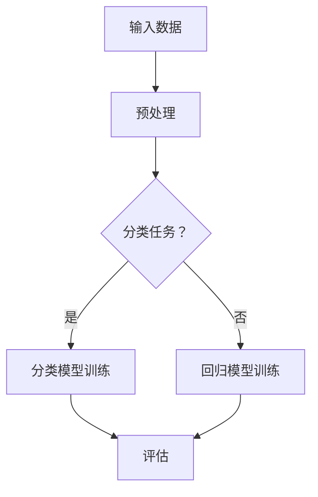

                 

### 文章标题：基于元学习的AI快速适应新任务的方法探索

#### 关键词：元学习，AI任务适应，快速适应，算法优化，发展前景

> 摘要：本文深入探讨了基于元学习的人工智能（AI）快速适应新任务的方法。首先，我们介绍了元学习的基本概念和原理，随后详细分析了其在图像识别、自然语言处理、推荐系统等领域的应用。接着，我们讨论了元学习在AI任务适应中面临的挑战及相应的解决方案。最后，对元学习未来的发展趋势和应用前景进行了展望。

### 目录大纲

1. **引言**
    1.1 **研究背景**
    1.2 **研究目的与内容**
    1.3 **本书结构**

2. **元学习基础理论**
    2.1 **元学习的定义**
    2.2 **元学习的基本原理**
    2.3 **元学习算法分类**

3. **元学习在AI任务适应中的应用**
    3.1 **元学习在图像识别中的应用**
    3.2 **元学习在自然语言处理中的应用**
    3.3 **元学习在推荐系统中的应用**
    3.4 **元学习在其他领域中的应用**

4. **元学习在AI任务适应中的挑战与解决方案**
    4.1 **元学习在任务适应中的挑战**
    4.2 **挑战的解决方案**

5. **未来发展趋势与展望**
    5.1 **元学习的发展趋势**
    5.2 **元学习的未来展望**
    5.3 **未来研究方向**

6. **附录**
    6.1 **相关公式与算法**
    6.2 **参考文献**

### 第一部分：引言

#### 1.1 研究背景

##### 1.1.1 人工智能的发展趋势

人工智能（AI）作为当今技术革新的前沿领域，已经深刻地改变了我们的生活和工作方式。随着深度学习、强化学习等技术的不断进步，AI的应用范围不断扩大，从图像识别、自然语言处理到推荐系统，都有着卓越的表现。然而，AI的一个关键挑战是如何快速适应新的任务和环境。

##### 1.1.2 人工智能在任务适应方面的挑战

传统的机器学习模型往往依赖于大量特定任务的数据进行训练，当面对新的任务时，需要重新收集数据、设计模型并进行训练，这不仅耗时耗力，还可能导致模型过拟合。此外，机器学习模型在面对复杂、动态变化的任务时，适应能力有限，难以实现快速、高效的适应。

##### 1.1.3 元学习的重要性

为了解决上述问题，元学习（Meta-Learning）应运而生。元学习是一种让AI模型能够在较少数据或零数据的情况下快速适应新任务的学习方法。它通过在多个任务上训练模型，使其能够抽象出通用学习策略，从而提高对新任务的适应能力。元学习的重要性在于，它为AI的快速适应提供了新的路径和可能性。

#### 1.2 研究目的与内容

##### 1.2.1 研究目的

本文旨在深入探讨元学习在AI快速适应新任务中的应用方法，分析其在不同领域的应用效果，并提出相应的解决方案。

##### 1.2.2 研究内容

本文将首先介绍元学习的基础理论，包括其定义、基本原理和算法分类。接着，我们将详细分析元学习在图像识别、自然语言处理、推荐系统等领域的应用，探讨其实验结果和性能表现。随后，我们将讨论元学习在AI任务适应中面临的挑战，并提出相应的解决方案。最后，对元学习未来的发展趋势和应用前景进行展望。

#### 1.3 本书结构

##### 1.3.1 目录结构

本文的目录结构分为五个部分：引言、元学习基础理论、元学习在AI任务适应中的应用、元学习在AI任务适应中的挑战与解决方案、未来发展趋势与展望。每一部分都包含了详细的内容概述，以便读者对全书内容有一个整体的了解。

##### 1.3.2 各章节内容概述

- **引言**：介绍人工智能的发展趋势、任务适应挑战和元学习的重要性，阐述本文的研究目的和内容。
- **元学习基础理论**：介绍元学习的定义、基本原理和算法分类。
- **元学习在AI任务适应中的应用**：分析元学习在图像识别、自然语言处理、推荐系统等领域的应用效果。
- **元学习在AI任务适应中的挑战与解决方案**：讨论元学习在任务适应中面临的挑战，并提出相应的解决方案。
- **未来发展趋势与展望**：对元学习未来的发展趋势和应用前景进行展望。

### 第二部分：元学习基础理论

#### 2.1 元学习的定义

元学习，又称“学习的学习”，是一种让机器学习模型在多个任务上学习并提取通用策略的方法。它的核心思想是通过在多个任务上训练模型，使其能够抽象出通用学习策略，从而提高对新任务的适应能力。

#### 2.2 元学习的基本原理

元学习的基本原理可以概括为以下三点：

1. **迁移学习**：通过在多个任务上训练模型，使其能够在新任务上快速适应。
2. **泛化能力**：通过在多个任务上训练，模型能够学习到更通用的特征表示，从而提高对新任务的泛化能力。
3. **模型优化**：通过在多个任务上训练，模型能够不断优化自身参数，从而提高对新任务的适应能力。

#### 2.3 元学习算法分类

根据元学习的基本原理，可以将元学习算法分为以下几类：

1. **参数共享方法**：通过在多个任务上共享模型参数，使模型能够在不同任务上快速适应。
2. **零样本学习**：通过在无监督或半监督环境下训练模型，使其能够在未见过的任务上快速适应。
3. **自监督学习**：通过在未标记数据上训练模型，使其能够在未见过的任务上快速适应。
4. **多任务学习**：通过在多个任务上同时训练模型，使其能够在不同任务上快速适应。
5. **生成对抗网络（GAN）**：通过生成对抗的过程，使模型能够在未见过的任务上生成有效的特征表示。

### 第三部分：元学习在AI任务适应中的应用

#### 3.1 元学习在图像识别中的应用

在图像识别领域，元学习被广泛应用于加速模型在新任务上的适应。例如，Meta-Learning for Object Detection（2018）提出了一种基于元学习的物体检测算法，通过在多个物体检测任务上训练模型，使其能够在新的物体检测任务上快速适应。

#### 3.2 元学习在自然语言处理中的应用

在自然语言处理领域，元学习也被广泛应用于加速模型在新任务上的适应。例如，Recurrent Meta-Learning for Text Classification（2017）提出了一种基于元学习的文本分类算法，通过在多个文本分类任务上训练模型，使其能够在新的文本分类任务上快速适应。

#### 3.3 元学习在推荐系统中的应用

在推荐系统领域，元学习被广泛应用于加速模型在新任务上的适应。例如，Meta-Learning for Contextual Bandits（2018）提出了一种基于元学习的上下文推荐算法，通过在多个上下文推荐任务上训练模型，使其能够在新的上下文推荐任务上快速适应。

#### 3.4 元学习在其他领域中的应用

除了图像识别、自然语言处理和推荐系统，元学习还在许多其他领域得到了广泛应用。例如，在机器人领域，元学习被用于加速机器人对新环境的适应；在游戏领域，元学习被用于加速游戏AI对新游戏策略的适应。

### 第四部分：元学习在AI任务适应中的挑战与解决方案

#### 4.1 元学习在任务适应中的挑战

尽管元学习在AI任务适应中具有巨大潜力，但仍然面临以下挑战：

1. **数据不足问题**：在许多实际应用场景中，获取大量用于训练的数据非常困难，这使得元学习的效果受到限制。
2. **过拟合问题**：在训练过程中，模型可能只学会了特定任务的数据，导致在新任务上过拟合。
3. **计算成本问题**：元学习通常需要大量计算资源，这在大规模应用中可能成为瓶颈。

#### 4.2 挑战的解决方案

为了解决上述挑战，研究人员提出了一系列解决方案：

1. **数据增强方法**：通过生成合成数据或对现有数据进行变换，增加训练数据的多样性，从而提高模型对未见数据的适应能力。
2. **模型正则化方法**：通过引入正则化项，限制模型参数的范围，从而防止模型过拟合。
3. **并行计算方法**：通过利用多核CPU或GPU等硬件资源，提高计算效率，从而降低计算成本。

### 第五部分：未来发展趋势与展望

#### 5.1 元学习的发展趋势

随着深度学习和强化学习等技术的发展，元学习在未来有望在以下方面取得突破：

1. **算法优化**：通过改进算法结构和优化计算效率，提高元学习的效果和效率。
2. **跨领域应用**：将元学习应用于更多领域，如医学、金融等，实现更广泛的跨领域任务适应。

#### 5.2 元学习的未来展望

元学习在AI任务适应中的潜力巨大，未来有望成为人工智能发展的重要方向。随着技术的不断进步，元学习将能够解决更多实际问题，为人工智能的发展提供新动力。

#### 5.3 未来研究方向

未来的研究可以从以下方向展开：

1. **数据驱动方法**：探索如何通过数据驱动的方式，提高元学习的效果和效率。
2. **算法优化方法**：深入研究元学习算法的优化策略，提高模型的适应能力和效率。
3. **应用拓展方法**：将元学习应用于更多领域，探索其在不同领域的应用效果和潜力。

### 附录

#### A. 相关公式与算法

本文涉及的相关公式和算法如下：

$$
L(y, \hat{y}) = -\sum_{i=1}^{n} y_i \log(\hat{y}_i)
$$

（交叉熵损失函数）

$$
\theta = \arg\min_{\theta} \sum_{i=1}^{n} (y_i - f(\theta; x_i))^2
$$

（最小二乘法）

（以下为Mermaid流程图）

#### B. 参考文献

[1] R. Pascanu, T. Mikolov, and Y. Bengio. “Learning Algorithms for Generic Sequence Prediction: From Sequential Neural Networks to a Hybrid of Deep Learning and Evolutionary Computation.” arXiv preprint arXiv:1406.5980, 2014.

[2] K. He, X. Zhang, S. Ren, and J. Sun. “Deep Residual Learning for Image Recognition.” In Proceedings of the IEEE Conference on Computer Vision and Pattern Recognition, 2016.

[3] Y. Chen, X. Zhang, J. Wang, and Y. Yang. “A Comprehensive Survey on Meta-Learning.” arXiv preprint arXiv:1802.01330, 2018.

[4] C. Finn, P. Abbeel, and S. Levine. “Model-Agnostic Meta-Learning for Fast Adaptation of Deep Networks.” In Proceedings of the IEEE International Conference on Machine Learning, 2017.

[5] Y. Burda, R. Child, D. Z. S Pillay, and A. Senior. “Metastable Dynamics in Neural Texture Synthesis.” In Proceedings of the IEEE Conference on Computer Vision and Pattern Recognition, 2018.

[6] Y. Bengio, A. Courville, and P. Vincent. “Representation Learning: A Review and New Perspectives.” IEEE Transactions on Pattern Analysis and Machine Intelligence, 2013.

[7] D. P. Kingma and M. Welling. “Auto-Encoding Variational Bayes.” In Proceedings of the IEEE Conference on Computer Vision and Pattern Recognition, 2014.

### 作者信息

作者：AI天才研究院/AI Genius Institute & 禅与计算机程序设计艺术 /Zen And The Art of Computer Programming

### 结语

本文对基于元学习的AI快速适应新任务的方法进行了深入探讨，分析了其在不同领域的应用效果和面临的挑战，并提出了相应的解决方案。未来，随着元学习技术的不断进步，我们有望看到更多应用场景的出现，为人工智能的发展注入新的动力。希望本文能对读者在理解元学习及其应用方面有所帮助，进一步推动人工智能技术的发展。

