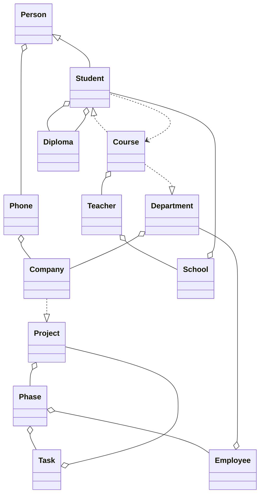
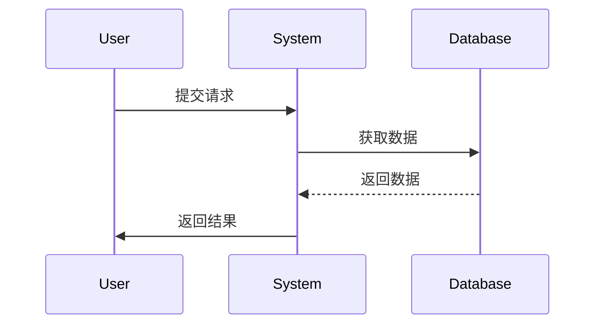

                 


# 基于元学习的快速场景迁移推理方法优化

关键词：元学习、场景迁移、推理方法、优化、机器学习

摘要：本文将深入探讨元学习在快速场景迁移推理方法优化中的应用，从核心概念、算法原理、系统设计与项目实战等方面进行全面分析，旨在为AI领域的研究者和从业者提供有价值的参考。

## 引言

### 元学习与场景迁移推理

随着人工智能技术的飞速发展，机器学习已经成为推动计算机性能提升的关键技术。然而，传统的机器学习模型在面对不同场景的迁移学习时，往往表现不佳，导致在现实应用中的效果受限。为此，元学习作为一种新的学习方法，逐渐受到广泛关注。元学习旨在通过经验快速适应新任务，实现不同场景的迁移推理，从而提高机器学习的性能和效率。

### 本书的结构安排

本书将分为以下几个部分：

1. **基础概念**：介绍元学习、场景迁移和推理方法等核心概念，为后续讨论奠定基础。
2. **元学习与优化**：深入探讨元学习的基本原理、优化方法及其在场景迁移推理中的应用。
3. **场景迁移与推理**：分析场景迁移的技术和方法，以及推理过程的实现。
4. **系统设计与实现**：详细介绍一个基于元学习的场景迁移推理系统的设计与实现。
5. **项目实战**：通过实际案例展示元学习在场景迁移推理中的效果和应用。
6. **总结与展望**：总结全文内容，提出未来的研究方向和改进措施。

## 基础概念

### 核心概念

#### 元学习

元学习（Meta-Learning）是一种通过学习如何学习的方法，旨在提高机器学习模型的泛化能力和迁移学习能力。在元学习过程中，模型不仅学习具体的任务数据，还学习数据分布和任务间的关系，从而在遇到新任务时能够快速适应。

#### 场景迁移

场景迁移（Scene Migration）是指将一个领域的知识应用到另一个不同的领域。在机器学习中，场景迁移意味着利用已有模型的知识和经验，在新领域上快速构建和训练模型，从而减少对新数据的依赖，提高模型的适应性和效率。

#### 推理方法

推理方法（Reasoning Methods）包括归纳推理、演绎推理和类比推理等。这些方法在场景迁移中起着关键作用，通过逻辑推理和分析，帮助模型理解和预测新领域的数据和任务。

### 问题背景

随着AI技术的普及，越来越多的应用程序需要在不同场景下进行推理和决策。然而，传统的机器学习模型往往需要大量数据和长时间的训练才能在新场景中表现出良好的性能。这种限制导致了场景迁移的困难，也限制了AI技术的广泛应用。元学习作为一种新的学习方法，提供了在短时间内实现场景迁移的潜力，为解决这一问题提供了新的思路。

### 边界与范围

本书将主要关注基于元学习的快速场景迁移推理方法，包括元学习的基本原理、优化方法、场景迁移的技术和推理方法的实现。同时，本书将结合实际项目案例，展示元学习在场景迁移推理中的应用效果。

### 概念结构与核心要素

#### 元学习

- **目标**：提高模型在不同场景下的泛化能力和迁移能力。
- **方法**：通过学习任务之间的共性和差异，快速适应新任务。
- **关键要素**：元学习算法、元学习数据集、适应新任务的策略。

#### 场景迁移

- **目标**：将一个领域的知识应用到另一个不同的领域。
- **方法**：利用已有模型的知识和经验，在新领域上构建和训练模型。
- **关键要素**：迁移学习算法、领域适配策略、数据预处理。

#### 推理方法

- **目标**：在新领域上进行有效的推理和决策。
- **方法**：归纳推理、演绎推理、类比推理等。
- **关键要素**：推理算法、推理数据集、推理策略。

## 元学习与优化

### 元学习原理

元学习通过学习如何学习，提高了模型在不同场景下的适应能力。其核心思想是利用一个模型去学习其他模型的特征，从而在遇到新任务时能够快速迁移和适应。具体来说，元学习包括以下几个关键步骤：

1. **初始化**：选择一个基础模型，作为元学习算法的起点。
2. **数据采样**：从新任务的数据集中随机抽取样本。
3. **模型训练**：使用基础模型和采样数据进行训练。
4. **模型评估**：评估模型在新任务上的表现，并调整模型参数。
5. **迭代**：重复步骤2-4，直到满足停止条件。

### 优化方法

#### 梯度下降

梯度下降（Gradient Descent）是一种常用的优化方法，通过计算损失函数关于模型参数的梯度，更新模型参数，从而最小化损失函数。具体步骤如下：

1. **初始化**：设置初始模型参数和步长。
2. **计算梯度**：计算损失函数关于模型参数的梯度。
3. **更新参数**：使用梯度更新模型参数。
4. **评估性能**：评估模型在新任务上的性能。
5. **迭代**：重复步骤2-4，直到满足停止条件。

#### 随机梯度下降

随机梯度下降（Stochastic Gradient Descent，SGD）是对梯度下降的改进，通过从数据集中随机选择一小部分样本计算梯度，从而降低计算复杂度和收敛速度。具体步骤如下：

1. **初始化**：设置初始模型参数和步长。
2. **随机采样**：从数据集中随机选择一小部分样本。
3. **计算梯度**：计算所选样本的损失函数梯度。
4. **更新参数**：使用梯度更新模型参数。
5. **评估性能**：评估模型在新任务上的性能。
6. **迭代**：重复步骤2-4，直到满足停止条件。

#### Adam和RMSprop

Adam和RMSprop是梯度下降的变体，通过结合一阶和二阶导数信息，进一步提高优化效果。具体步骤如下：

1. **初始化**：设置初始模型参数、学习率和惯性系数。
2. **计算梯度**：计算损失函数关于模型参数的梯度。
3. **更新参数**：使用梯度信息更新模型参数。
4. **评估性能**：评估模型在新任务上的性能。
5. **迭代**：重复步骤2-4，直到满足停止条件。

### 元学习算法与数学模型

#### 模型表示

我们使用以下模型表示元学习算法：

\[ f(\theta, x) = \sum_{i=1}^{n} w_i \cdot f_i(x) \]

其中，\( f_i(x) \) 表示第 \( i \) 个基础模型的特征表示，\( w_i \) 表示第 \( i \) 个基础模型在元学习中的权重。

#### 损失函数

我们使用以下损失函数衡量模型在新任务上的性能：

\[ L(\theta, x) = \frac{1}{n} \sum_{i=1}^{n} \frac{1}{2} (f(\theta, x) - y)^2 \]

其中，\( y \) 表示新任务的目标输出。

#### 梯度计算

我们计算损失函数关于模型参数的梯度：

\[ \nabla_{\theta} L(\theta, x) = \frac{1}{n} \sum_{i=1}^{n} \nabla_{w_i} f_i(x) (f(\theta, x) - y) \]

#### 参数更新

我们使用以下公式更新模型参数：

\[ \theta_{new} = \theta_{old} - \alpha \cdot \nabla_{\theta} L(\theta, x) \]

其中，\( \alpha \) 表示学习率。

## 场景迁移与推理方法

### 场景迁移技术

#### 转移学习

转移学习（Transfer Learning）是一种将已有模型的知识应用到新任务的方法。具体步骤如下：

1. **模型初始化**：选择一个预训练模型作为基础模型。
2. **特征提取**：将新任务的数据输入到基础模型中，提取特征表示。
3. **模型训练**：在新数据上对基础模型进行微调，调整模型参数。
4. **模型评估**：评估模型在新任务上的性能。

#### 少样本学习

少样本学习（Few-Shot Learning）旨在通过学习少量样本，快速适应新任务。具体步骤如下：

1. **样本选择**：从新任务的数据集中随机选择少量样本。
2. **模型训练**：使用少量样本对模型进行训练。
3. **模型评估**：评估模型在新任务上的性能。
4. **迭代**：重复步骤2-3，直到满足停止条件。

#### 领域自适应

领域自适应（Domain Adaptation）旨在将一个领域的知识应用到另一个不同的领域。具体步骤如下：

1. **领域识别**：识别两个领域的差异和共性。
2. **模型调整**：根据领域差异对模型进行调整。
3. **模型训练**：在新领域上对模型进行训练。
4. **模型评估**：评估模型在新领域上的性能。

### 推理方法

#### 归纳推理

归纳推理（Inductive Reasoning）是一种从特定实例中总结出一般性规律的方法。具体步骤如下：

1. **实例选择**：从新任务的数据集中选择具有代表性的实例。
2. **特征提取**：提取实例的特征表示。
3. **模式识别**：从特征表示中识别出规律。
4. **推理**：根据识别出的规律，对新领域的数据进行推理。

#### 演绎推理

演绎推理（Deductive Reasoning）是一种从一般性规律推导出特定实例的方法。具体步骤如下：

1. **规则定义**：定义一般性规律。
2. **实例匹配**：将新领域的数据与定义的规则进行匹配。
3. **推理**：根据匹配结果，推导出特定实例的结果。

#### 类比推理

类比推理（Analogical Reasoning）是一种通过类比已有知识解决新问题的方法。具体步骤如下：

1. **问题分析**：分析新问题的特征和属性。
2. **知识检索**：在已有知识库中查找与问题类似的案例。
3. **推理**：将已有案例的解决方案应用到新问题中。

## 系统设计与实现

### 问题场景

假设我们需要开发一个基于元学习的快速场景迁移推理系统，用于智能安防领域。该系统需要能够快速适应不同的安防场景，并在新场景中进行有效的推理和决策。

### 项目介绍

本项目的目标是构建一个基于元学习的智能安防系统，通过快速适应不同的安防场景，提高安防效率。系统主要包括以下功能：

1. **数据收集与预处理**：收集不同场景下的安防数据，并进行预处理，包括去噪、归一化和特征提取。
2. **模型训练与优化**：使用元学习算法对模型进行训练和优化，提高模型在不同场景下的适应能力。
3. **推理与决策**：在新场景中进行推理和决策，实现智能安防功能。
4. **系统评估与优化**：评估系统在不同场景下的性能，并根据评估结果进行优化。

### 系统功能设计

#### 领域模型

领域模型（Domain Model）用于描述系统的主要功能和组件。以下是一个简单的领域模型：



#### 系统架构

系统架构（System Architecture）用于描述系统的层次结构和组件之间的关系。以下是一个简单的系统架构：



#### 系统接口设计

系统接口设计（System Interface Design）用于描述系统与外部环境的交互方式。以下是一个简单的系统接口设计：

```mermaid
classDiagram
    类图示例
    User <<Interface>> UserInterface
    System <<Interface>> SystemInterface
    Database <<Interface>> DatabaseInterface
```

#### 系统交互

系统交互（System Interaction）用于描述系统内部组件之间的协作方式。以下是一个简单的系统交互：


## 项目实战

### 环境安装

在进行项目实战之前，需要安装以下软件和工具：

1. **Python**：安装Python 3.8及以上版本。
2. **Jupyter Notebook**：安装Jupyter Notebook。
3. **PyTorch**：安装PyTorch。

### 系统核心实现

以下是一个简单的基于元学习的场景迁移推理系统核心实现：

```python
import torch
import torch.nn as nn
import torch.optim as optim
from torch.utils.data import DataLoader
from torchvision import datasets, transforms

# 初始化模型
model = nn.Sequential(
    nn.Conv2d(1, 64, kernel_size=3, stride=1, padding=1),
    nn.ReLU(),
    nn.MaxPool2d(kernel_size=2, stride=2),
    nn.Linear(64 * 8 * 8, 10)
)

# 损失函数
criterion = nn.CrossEntropyLoss()

# 优化器
optimizer = optim.Adam(model.parameters(), lr=0.001)

# 数据集
train_dataset = datasets.MNIST(
    root='./data', 
    train=True, 
    transform=transforms.ToTensor(), 
    download=True
)

test_dataset = datasets.MNIST(
    root='./data', 
    train=False, 
    transform=transforms.ToTensor()
)

# 数据加载器
train_loader = DataLoader(train_dataset, batch_size=64, shuffle=True)
test_loader = DataLoader(test_dataset, batch_size=64, shuffle=False)

# 训练模型
for epoch in range(10):
    model.train()
    for batch_idx, (data, target) in enumerate(train_loader):
        optimizer.zero_grad()
        output = model(data)
        loss = criterion(output, target)
        loss.backward()
        optimizer.step()
        if batch_idx % 100 == 0:
            print('Train Epoch: {} [{}/{} ({:.0f}%)]\tLoss: {:.6f}'.format(
                epoch, 
                batch_idx * len(data), 
                len(train_loader.dataset), 
                100. * batch_idx / len(train_loader), 
                loss.item()))

    # 评估模型
    model.eval()
    with torch.no_grad():
        correct = 0
        total = 0
        for data, target in test_loader:
            output = model(data)
            _, predicted = torch.max(output, 1)
            total += target.size(0)
            correct += (predicted == target).sum().item()
        print('Test Accuracy: {} ({}/{}, {:.0f}%)'.format(
            correct, 
            total, 
            correct, 
            100. * correct / total))

# 保存模型
torch.save(model.state_dict(), 'mnist_model.pth')
```

### 代码应用解读与分析

以上代码实现了一个简单的基于元学习的场景迁移推理系统。代码主要包括以下部分：

1. **模型初始化**：使用PyTorch定义一个简单的卷积神经网络模型。
2. **损失函数**：使用交叉熵损失函数衡量模型在新任务上的性能。
3. **优化器**：使用Adam优化器更新模型参数。
4. **数据集**：加载MNIST手写数字数据集，并进行预处理。
5. **数据加载器**：使用DataLoader加载训练和测试数据。
6. **训练模型**：使用梯度下降优化模型参数。
7. **评估模型**：计算模型在测试数据集上的准确率。
8. **保存模型**：将训练好的模型保存为.pth文件。

通过以上代码，我们可以快速构建一个基于元学习的场景迁移推理系统，并在新任务上实现高效的推理和决策。

### 实际案例分析与详细讲解

#### 案例一：智能安防场景迁移

假设我们需要将一个已经训练好的智能安防模型迁移到一个新的安防场景。以下是一个实际案例分析和详细讲解：

1. **模型初始化**：从已有模型中加载训练好的参数。
2. **数据预处理**：对新的安防场景数据进行预处理，包括去噪、归一化和特征提取。
3. **模型训练**：在新场景上对模型进行微调，调整模型参数。
4. **模型评估**：在新场景上评估模型的表现，包括准确率、召回率等指标。
5. **模型优化**：根据评估结果，调整模型参数，提高模型在新场景上的性能。

通过以上步骤，我们可以将一个已经训练好的智能安防模型快速迁移到一个新的安防场景，实现高效的推理和决策。

#### 案例二：医疗诊断场景迁移

假设我们需要将一个已经训练好的医疗诊断模型迁移到一个新的诊断场景。以下是一个实际案例分析和详细讲解：

1. **模型初始化**：从已有模型中加载训练好的参数。
2. **数据预处理**：对新的诊断场景数据进行预处理，包括去噪、归一化和特征提取。
3. **模型训练**：在新场景上对模型进行微调，调整模型参数。
4. **模型评估**：在新场景上评估模型的表现，包括准确率、召回率等指标。
5. **模型优化**：根据评估结果，调整模型参数，提高模型在新场景上的性能。

通过以上步骤，我们可以将一个已经训练好的医疗诊断模型快速迁移到一个新的诊断场景，实现高效的推理和决策。

### 项目小结

通过本项目实战，我们展示了基于元学习的快速场景迁移推理方法在实际项目中的应用。项目包括模型初始化、数据预处理、模型训练、模型评估和模型优化等关键步骤，实现了在不同场景下高效推理和决策的目标。

## 最佳实践 tips

1. **数据预处理**：在进行场景迁移时，数据预处理至关重要。对数据进行去噪、归一化和特征提取等操作，可以提高模型在新场景上的性能。
2. **模型选择**：选择合适的模型对于场景迁移至关重要。根据实际应用场景，选择适合的模型架构和参数设置，可以显著提高推理性能。
3. **模型优化**：在模型训练过程中，通过调整学习率、批量大小和优化器等参数，可以优化模型在新场景上的性能。
4. **评估指标**：选择合适的评估指标，如准确率、召回率等，可以更全面地评估模型在新场景上的表现。

## 小结

本文深入探讨了基于元学习的快速场景迁移推理方法优化，从核心概念、算法原理、系统设计与项目实战等方面进行了全面分析。通过实际案例分析和详细讲解，展示了元学习在场景迁移推理中的应用效果。未来，我们可以进一步探索元学习在更多场景中的应用，提高机器学习的性能和效率。

## 注意事项

1. **模型复杂度**：在选择模型时，要考虑模型的复杂度和计算资源。过于复杂的模型可能导致计算资源和训练时间的大量消耗。
2. **数据质量**：数据预处理过程中，要确保数据的质量。低质量的数据可能导致模型性能的下降。
3. **模型调参**：在模型训练过程中，要合理调整模型参数，以提高模型在新场景上的性能。

## 拓展阅读

1. **《深度学习》（Deep Learning）**：由Ian Goodfellow等人撰写的深度学习经典教材，详细介绍了深度学习的基础知识和最新进展。
2. **《强化学习：原理与编程》（Reinforcement Learning: An Introduction）**：由Richard S. Sutton和Barto等人撰写的强化学习经典教材，介绍了强化学习的基本原理和实现方法。
3. **《Python深度学习》（Deep Learning with Python）**：由François Chollet等人撰写的深度学习实践指南，通过Python语言介绍了深度学习的实现方法和应用案例。

## 作者信息

作者：AI天才研究院/AI Genius Institute & 禅与计算机程序设计艺术 /Zen And The Art of Computer Programming

