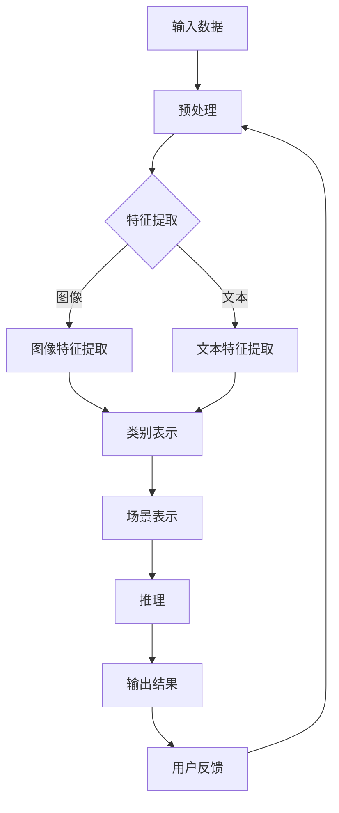

                 

### 1.1 问题背景

#### 零样本学习背景介绍

零样本学习（Zero-Shot Learning，ZSL）是一种机器学习方法，其主要目标是在没有直接标记的数据集上进行分类，即模型在面对从未见过的类别时仍然能够准确预测。这种方法的提出源于现实中的许多应用场景，比如生物分类、新产品识别和跨领域知识迁移等。在这些场景中，数据往往难以获取，或者获取到的数据中包含的类别信息有限。零样本学习通过利用预先学习到的知识，如预训练模型和语义信息，来实现对新类别的识别和推理。

#### 零样本场景推理应用领域

零样本学习在许多领域都有广泛的应用。首先，在计算机视觉领域，零样本学习可以帮助模型识别从未见过的物体，这对自动驾驶和机器人视觉等应用至关重要。其次，在自然语言处理领域，零样本学习可用于跨语言的文本分类和情感分析，这对于多语言环境的互联网服务非常重要。此外，在医疗诊断、金融风险评估等领域，零样本学习也有广泛的应用潜力，可以用于诊断新病症、评估新金融产品等。

#### 零样本学习面临的挑战与机遇

尽管零样本学习具有广泛的应用前景，但它也面临着一些挑战。首先，由于模型没有直接接触过新类别，如何从有限的先验知识中提取有效信息是一个难题。其次，如何设计出既能泛化新类别，又能保持高性能的算法也是一个挑战。然而，随着深度学习和迁移学习的不断发展，零样本学习正迎来新的机遇。例如，通过元学习（Meta-Learning）等技术，可以进一步提高零样本学习的性能和鲁棒性。

### 1.2 核心概念

#### 元学习的概念

元学习（Meta-Learning）是一种学习方法，其目标是通过学习学习算法，提高模型在未知任务上的学习速度和性能。元学习的核心思想是构建一个通用学习器，该学习器能够快速适应新的任务，而无需从头开始学习。元学习在强化学习、在线学习和零样本学习等领域都有重要应用。

#### 零样本学习的定义

零样本学习（Zero-Shot Learning，ZSL）是一种机器学习方法，其主要目标是在没有直接标记的数据集上进行分类，即模型在面对从未见过的类别时仍然能够准确预测。零样本学习的关键在于利用预训练模型和语义信息，将从未见过的类别映射到已见过的类别上，从而实现对新类别的识别和推理。

#### 零样本场景推理方法

零样本场景推理（Zero-Shot Scene Reasoning）是一种在复杂、不确定的零样本环境下进行推理的方法。这种方法不仅需要处理从未见过的类别，还需要考虑场景中的其他复杂因素，如背景信息、时间动态等。零样本场景推理的核心在于如何有效地融合多源信息，构建一个鲁棒的推理模型，以实现对未知场景的合理推断。

### 1.3 概念结构与核心要素

#### 元学习与零样本学习的联系

元学习和零样本学习有着密切的联系。元学习通过学习如何快速适应新任务，为零样本学习提供了有效的工具。具体来说，元学习可以帮助零样本学习模型更好地从有限的先验知识中提取有效信息，从而提高其在未知类别上的预测性能。

#### 零样本场景推理的关键要素

零样本场景推理的核心要素包括：

- **多源信息融合**：如何有效地整合来自不同来源的信息，如文本描述、图像特征等，是零样本场景推理的关键。这要求模型具备较强的特征提取和融合能力。

- **场景建模**：如何对复杂的零样本场景进行建模，以捕捉其中的关键特征和动态变化，是零样本场景推理的难点。这需要模型具备强大的表示能力和泛化能力。

- **推理策略**：如何设计合理的推理策略，以应对不确定性和复杂环境，是零样本场景推理的重要问题。这需要模型具备灵活的推理机制和应对策略。

### 1.4 边界与外延

#### 零样本学习与其他相关领域的区别

零样本学习与迁移学习（Transfer Learning）、自监督学习（Self-Supervised Learning）等机器学习领域有相似之处，但它们也有明显的区别：

- **零样本学习**：主要关注在没有直接标记数据的情况下进行分类和预测。其核心在于如何利用预训练模型和语义信息来泛化到新类别。

- **迁移学习**：主要关注如何将一个任务中学习到的知识应用于另一个相关任务。其核心在于如何共享和迁移已有知识，提高新任务的学习效率。

- **自监督学习**：主要关注如何从无监督数据中提取有效信息，用于模型的训练和优化。其核心在于如何设计无监督的学习目标，提高模型的泛化能力。

#### 零样本场景推理方法的适用场景

零样本场景推理方法主要适用于以下场景：

- **新物种识别**：在生物分类领域，零样本场景推理可以帮助模型识别从未见过的生物物种。

- **跨领域知识迁移**：在自然语言处理领域，零样本场景推理可以帮助模型在多个语言和文化背景下进行文本分类和情感分析。

- **医疗诊断**：在医疗领域，零样本场景推理可以帮助医生诊断新的病症和评估新药物的效果。

- **金融风险评估**：在金融领域，零样本场景推理可以帮助金融机构评估新金融产品的风险和预测市场走势。

通过上述分析，我们可以看到，零样本学习作为一种机器学习方法，具有广泛的应用前景和重要的研究价值。随着深度学习和元学习等技术的不断发展，零样本学习将会在更多领域中发挥其独特的优势。零样本场景推理作为其重要应用方向之一，也将不断推动机器学习理论和实践的发展。在接下来的章节中，我们将深入探讨零样本学习和零样本场景推理的核心概念原理，以及如何设计和实现这些方法。这不仅有助于我们更好地理解这些方法的基本原理，也将为实际应用提供有益的指导。### 2.1 元学习原理

#### 元学习基础

元学习，也称为元训练或元学习，是一种通过学习如何学习的方法。它的核心思想是构建一个模型，该模型能够快速适应新的任务，而无需从头开始训练。这种模型通常称为元学习器或元模型。元学习器通过在多个任务上训练，学习到如何高效地适应新的任务，从而在遇到新任务时能够快速地达到较高的性能。

在传统的机器学习中，模型通常需要在特定任务上进行大量训练，这往往需要大量的数据和计算资源。而元学习则通过在多个任务上学习到通用的学习策略，从而能够减少对新任务的数据需求和训练时间。元学习的基础原理可以归纳为以下几个方面：

1. **任务表示**：元学习器将每个任务表示为一个参数化的学习过程，这些参数化过程能够捕获任务之间的共同特征。

2. **模型更新**：元学习器通过优化这些参数化过程，以最小化在整个任务集合上的泛化误差。

3. **自适应学习**：元学习器在新任务上通过调整其参数，以快速适应新的任务特征。

#### 元学习算法分类

元学习算法可以根据其优化目标和方法的不同，分为多种类型。以下是几种常见的元学习算法分类：

1. **模型更新型元学习**：

   - **MAML (Model-Agnostic Meta-Learning)**：MAML 是一种著名的元学习算法，它通过优化模型的初始化参数，使得模型能够在新的任务上快速收敛。具体来说，MAML 通过最小化模型在不同任务上的收敛损失的平均值，来更新模型的参数。

   - **Reptile**：Reptile 是另一种模型更新型元学习算法，它通过在多个任务上逐步更新模型参数，以实现快速适应新任务。Reptile 的优点是计算效率高，但其性能可能略低于 MAML。

2. **模型共享型元学习**：

   - **Model-Agnostic Meta-Learning II (MAML++)**：MAML++ 是 MAML 的改进版本，它通过引入额外的正则化项，进一步提高了模型在不同任务上的适应能力。

   - **MAML-Compositional Label Shift**：MAML-CLM 是 MAML 的变种，它通过引入类别间的转换关系，使得模型能够更好地适应类别分布变化的新任务。

3. **任务描述型元学习**：

   - **Provable Meta-Learning**：这类算法通过数学优化方法，证明模型在不同任务上的适应能力。它们通常依赖于复杂的理论分析，但可能在实际应用中表现出色。

#### 元学习在零样本学习中的应用

元学习在零样本学习中的应用非常广泛。通过元学习，模型可以在有限的先验知识下，快速适应新类别。以下是元学习在零样本学习中的几种应用方法：

1. **任务自适应元学习**：

   - 在零样本学习中，模型通过在多个已见类别上训练，学习到通用特征提取器。当遇到新类别时，模型可以通过调整其参数，快速适应新类别。

2. **迁移学习结合元学习**：

   - 这种方法将迁移学习和元学习相结合，通过在已见类别和新类别上同时训练，进一步提高了模型在新类别上的适应能力。

3. **多任务元学习**：

   - 通过在多个相关任务上同时训练，模型可以学习到更通用的特征表示，从而在新类别上表现出更好的性能。

总之，元学习作为一种强大的学习方法，通过学习如何学习，为解决复杂任务提供了新的思路。在零样本学习中，元学习通过提高模型对新类别的适应能力，为解决数据稀缺问题提供了有效的方法。在接下来的章节中，我们将继续探讨零样本学习的原理和方法，以更深入地理解这一领域。### 2.2 零样本学习原理

#### 零样本学习基础

零样本学习（Zero-Shot Learning，ZSL）是一种机器学习方法，旨在在没有直接标记数据的情况下进行分类和预测。传统的机器学习方法通常依赖于大量标记数据来训练模型，但在某些应用场景中，获取这些数据可能非常困难或者成本高昂。零样本学习通过利用有限的先验知识，如词向量、图像特征和类别间的相似性度量，实现了在未知类别上的准确预测。

零样本学习的核心思想是，通过学习到一个类别到高维特征空间的映射，使得模型能够在面对从未见过的类别时，利用已见类别的高维特征进行推理。这种方法可以有效地解决数据稀缺问题，并在诸如生物分类、新产品识别和跨领域知识迁移等领域具有广泛的应用。

#### 零样本学习算法分类

零样本学习算法可以分为以下几种类型：

1. **基于原型的方法**：

   - **原型匹配**：这种方法将每个类别视为一个原型，通过计算新样本与各个原型的距离，实现类别识别。常用的原型匹配方法包括K-最近邻（K-Nearest Neighbor，KNN）和原型网络（Prototypical Networks）。

2. **基于关系的方法**：

   - **类别关系网络**（Category Relationship Networks，CRN）：这种方法通过学习类别间的相似性关系，实现新类别识别。CRN 通常利用图神经网络（Graph Neural Networks，GNN）来建模类别关系。

3. **基于元学习的方法**：

   - **模型更新型元学习**：这类方法通过在多个已见类别上训练模型，学习到通用的特征提取器。当遇到新类别时，模型通过调整其参数，快速适应新类别。例如，MAML（Model-Agnostic Meta-Learning）算法。

4. **基于度量学习的方法**：

   - **度量学习**：这种方法通过学习一个度量函数，使得同类别的样本之间的距离较小，而不同类别的样本之间的距离较大。常见的度量学习方法包括原型网络和度量学习网络（Siamese Networks）。

5. **基于生成对抗网络的方法**：

   - **生成对抗网络**（Generative Adversarial Networks，GAN）：这种方法通过生成器生成从未见过的类别样本，然后利用这些样本训练分类器，实现新类别识别。

#### 零样本学习的关键技术

1. **类别迁移**：

   - 类别迁移（Category Transfer）是指通过将已见类别知识迁移到新类别上，以提高新类别的识别性能。类别迁移的关键技术包括类别映射和类别共享。

2. **度量学习**：

   - 度量学习是一种通过学习一个距离度量函数，使得同类别的样本之间的距离较小，而不同类别的样本之间的距离较大。常见的度量学习算法包括Siamese网络和Triplet Loss。

3. **知识融合**：

   - 知识融合是指将不同来源的信息（如图像特征、文本描述和语义信息）进行整合，以提高模型的泛化能力和鲁棒性。知识融合的关键技术包括特征融合和模型融合。

4. **元学习**：

   - 元学习通过学习如何快速适应新任务，使得模型在有限的先验知识下，能够对新类别进行有效预测。元学习的关键技术包括模型更新、任务自适应和迁移学习。

#### 零样本学习与其他相关领域的比较

- **迁移学习**：迁移学习通过将一个任务中学习到的知识应用于另一个相关任务，而零样本学习则关注在没有直接标记数据的情况下进行分类和预测。

- **自监督学习**：自监督学习通过从无监督数据中提取有效信息，用于模型的训练和优化。零样本学习则更侧重于在数据稀缺的情况下，利用有限的先验知识进行预测。

- **多任务学习**：多任务学习通过在多个相关任务上同时训练，学习到通用的特征表示。零样本学习则侧重于在新类别上的预测能力。

#### 零样本学习的适用场景

零样本学习适用于以下场景：

- **数据稀缺**：在数据难以获取或成本高昂的场景中，如医疗诊断、新物种识别等。

- **跨领域知识迁移**：在需要跨领域知识迁移的场景中，如多语言文本分类、跨领域图像识别等。

- **新物种识别**：在生物分类领域，零样本学习可以帮助模型识别从未见过的生物物种。

- **新产品识别**：在新产品开发中，零样本学习可以帮助企业快速识别新产品的类别和特征。

- **跨领域情感分析**：在自然语言处理领域，零样本学习可以帮助模型在多个语言和文化背景下进行情感分析。

通过上述分析，我们可以看到，零样本学习作为一种解决数据稀缺问题的方法，在许多应用领域中具有重要的价值。其通过利用有限的先验知识，实现了在未知类别上的准确预测，为解决数据稀缺问题提供了有效的方法。在接下来的章节中，我们将进一步探讨零样本场景推理方法的原理和应用。### 2.3 零样本场景推理方法原理

#### 零样本场景推理方法概述

零样本场景推理（Zero-Shot Scene Reasoning）是一种在复杂、不确定的零样本环境下进行推理的方法。与传统的零样本学习不同，零样本场景推理不仅要处理从未见过的类别，还要考虑场景中的其他复杂因素，如背景信息、时间动态和场景交互等。因此，零样本场景推理的核心在于如何有效地融合多源信息，构建一个鲁棒的推理模型，以实现对未知场景的合理推断。

#### 零样本场景推理算法分类

零样本场景推理算法可以分为以下几类：

1. **基于原型的方法**：

   - **原型匹配**：这种方法通过将每个场景视为一个原型，通过计算新场景与各个原型的距离，实现场景识别。原型匹配方法如K-最近邻（K-Nearest Neighbor，KNN）和原型网络（Prototypical Networks）。

2. **基于关系的方法**：

   - **类别关系网络**（Category Relationship Networks，CRN）：这种方法通过学习场景类别之间的相似性关系，实现新场景识别。CRN 通常利用图神经网络（Graph Neural Networks，GNN）来建模类别关系。

3. **基于模型更新型元学习的方法**：

   - **模型更新型元学习**：这类方法通过在多个已见场景上训练模型，学习到通用的特征提取器。当遇到新场景时，模型通过调整其参数，快速适应新场景。例如，MAML（Model-Agnostic Meta-Learning）算法。

4. **基于度量学习的方法**：

   - **度量学习**：这种方法通过学习一个度量函数，使得同类场景的样本之间的距离较小，而不同类场景的样本之间的距离较大。常见的度量学习算法包括原型网络和度量学习网络（Siamese Networks）。

5. **基于生成对抗网络的方法**：

   - **生成对抗网络**（Generative Adversarial Networks，GAN）：这种方法通过生成器生成从未见过的场景样本，然后利用这些样本训练分类器，实现新场景识别。

#### 零样本场景推理方法的实现步骤

零样本场景推理方法的实现通常包括以下步骤：

1. **特征提取**：

   - 对于图像数据，通常使用卷积神经网络（Convolutional Neural Networks，CNN）提取图像特征。
   - 对于文本数据，通常使用词嵌入（Word Embeddings）或变换器（Transformers）提取文本特征。

2. **类别表示**：

   - 对于每个已见类别，通过特征提取器生成类别特征向量。
   - 对于新类别，利用元学习或度量学习等方法生成类别特征向量。

3. **场景表示**：

   - 通过将多源特征（如图像特征和文本特征）进行融合，生成场景特征向量。

4. **推理**：

   - 对于新场景，通过计算其特征向量与已见场景特征向量之间的相似性，实现场景识别。
   - 可以结合深度神经网络或图神经网络进行推理，以提高识别的准确性。

#### 案例分析

以一个智能家居场景为例，假设我们有一个智能家居系统，需要识别家庭中的设备类型。系统中已有部分设备的识别模型，但新增了若干从未见过的设备。此时，我们可以采用零样本场景推理方法进行设备识别。

1. **特征提取**：

   - 对于已见设备，使用图像识别模型提取设备特征向量。
   - 对于新设备，通过元学习或度量学习方法，生成设备特征向量。

2. **类别表示**：

   - 对于每个已见设备类别，生成类别特征向量。
   - 对于新设备类别，通过元学习或度量学习方法，生成类别特征向量。

3. **场景表示**：

   - 结合设备特征向量和环境特征（如传感器数据），生成场景特征向量。

4. **推理**：

   - 对于新场景，通过计算其特征向量与已见场景特征向量之间的相似性，实现设备识别。

通过上述案例，我们可以看到，零样本场景推理方法在智能家居等复杂场景中具有广泛的应用潜力。在接下来的章节中，我们将进一步探讨零样本场景推理方法的数学模型和实现细节。### 2.4 概念属性特征对比

为了更好地理解元学习、零样本学习和零样本场景推理之间的区别和联系，我们可以通过一个表格对比这些方法的关键属性。

| 特征         | 元学习              | 零样本学习             | 零样本场景推理         |
| ------------ | ------------------ | ---------------------- | -------------------- |
| **定义**     | 学习如何学习       | 无先验样本的学习       | 零样本下的场景推理     |
| **关键目标** | 提高学习效率       | 准确预测未知类别       | 合理推断未知场景       |
| **关键技术** | 模型更新、任务自适应 | 类别迁移、度量学习     | 融合多源信息、场景建模 |
| **适用场景** | 数据丰富但任务多变 | 数据稀缺、新类别识别   | 复杂、不确定的场景     |
| **应用领域** | 强化学习、在线学习 | 计算机视觉、自然语言处理 | 智能家居、环境监控     |

#### 表格详细解释

- **定义**：元学习是一种学习如何学习的方法，其核心在于构建一个能够快速适应新任务的学习模型。零样本学习则是指在没有直接标记样本的情况下进行分类和预测的方法。零样本场景推理是在零样本学习的基础上，进一步考虑场景的复杂性和不确定性，进行合理的场景推理。

- **关键目标**：元学习的目标是提高学习效率，使得模型能够快速适应新任务。零样本学习的目标是准确预测从未见过的类别。零样本场景推理的目标是在零样本的复杂场景下，生成合理的推理结果。

- **关键技术**：元学习的关键技术包括模型更新和任务自适应，通过在多个任务上训练，使得模型能够快速适应新任务。零样本学习的关键技术包括类别迁移和度量学习，通过利用有限的先验知识，实现从未见过类别的预测。零样本场景推理的关键技术包括融合多源信息和场景建模，通过整合图像、文本等多种信息，构建一个鲁棒的推理模型。

- **适用场景**：元学习适用于数据丰富但任务多变的场景，如强化学习和在线学习。零样本学习适用于数据稀缺的场景，如计算机视觉和自然语言处理。零样本场景推理适用于复杂、不确定的场景，如智能家居和环境监控。

- **应用领域**：元学习在强化学习和在线学习等领域有广泛的应用。零样本学习在计算机视觉、自然语言处理等领域有广泛应用。零样本场景推理在智能家居、环境监控等复杂场景中具有重要应用价值。

通过上述对比表格，我们可以清晰地看到元学习、零样本学习和零样本场景推理之间的异同点，为后续深入研究和应用提供指导。### 2.5 ER实体关系图架构

在零样本场景推理中，为了更好地理解各实体之间的关系，我们可以使用实体关系图（Entity Relationship Diagram，ERD）来描述系统架构。ERD 是一种用于描述实体及其相互关系的数据库建模工具，通过直观的图形化表示，可以清晰地展示系统中的关键实体及其关系。

以下是零样本场景推理系统中各个实体及其关系的 ERD 架构：

```
class:Mermaid

graph TD
A[用户输入] --> B[预处理模块]
B --> C[特征提取模块]
C --> D[类别表示模块]
D --> E[场景表示模块]
E --> F[推理模块]
F --> G[输出结果]
G --> H[用户反馈]
H --> B
```

#### ERD 详细解释

- **用户输入**（A）：代表用户提供的输入，可以是图像、文本或其他形式的数据。

- **预处理模块**（B）：对用户输入进行预处理，包括数据清洗、归一化等操作，以便后续特征提取。

- **特征提取模块**（C）：从预处理后的数据中提取关键特征。对于图像数据，可以使用卷积神经网络（CNN）提取图像特征；对于文本数据，可以使用词嵌入或变换器（Transformers）提取文本特征。

- **类别表示模块**（D）：利用特征提取模块生成的特征向量，对已见类别和新类别进行表示。这通常涉及到类别迁移和度量学习等方法。

- **场景表示模块**（E）：融合多源信息（如图像特征和文本特征），生成场景特征向量。场景表示模块需要考虑场景中的复杂因素，如时间动态和背景信息。

- **推理模块**（F）：基于场景特征向量，使用深度神经网络或其他推理算法，对新场景进行推理和分类。

- **输出结果**（G）：将推理结果输出给用户，可以是设备类型、情感分析结果等。

- **用户反馈**（H）：用户对输出结果的反馈，用于模型迭代和优化。

通过 ERD 架构，我们可以清晰地看到零样本场景推理系统中各个模块的输入输出关系及其相互作用。这种架构设计有助于我们更好地理解系统的运作原理，为后续的系统优化和扩展提供指导。### 2.6 元学习算法原理讲解

#### 元学习算法原理

元学习（Meta-Learning）是一种学习方法，其核心目标是通过学习学习，以提高模型在未知任务上的适应能力。元学习通过在多个任务上训练模型，使其能够快速地在新任务上达到高性能。元学习算法的基本原理包括任务表示、模型更新和自适应学习。

1. **任务表示**：

   元学习首先将每个任务表示为一个参数化的学习过程。在机器学习领域，任务通常可以通过输入和输出数据来描述。元学习器通过学习这些任务之间的共性，将每个任务映射到一个共同的表征空间。这种表征空间使得不同任务之间的特征和模式可以被共享和利用。

2. **模型更新**：

   在元学习过程中，模型更新是核心步骤之一。模型更新的目标是优化模型的初始参数，使其在多个任务上都能快速收敛。常见的元学习算法，如MAML（Model-Agnostic Meta-Learning），通过最小化模型在不同任务上的收敛损失，来实现模型更新。具体来说，MAML通过优化以下目标函数：

   $$
   \min_{\theta} \frac{1}{|\mathcal{T}|} \sum_{t=1}^{|\mathcal{T}|} \ell(\theta; x_t, y_t)
   $$

   其中，$\theta$ 是模型参数，$\mathcal{T}$ 是任务集合，$x_t$ 和 $y_t$ 分别是第 $t$ 个任务的数据和标签，$\ell(\theta; x_t, y_t)$ 是损失函数。

3. **自适应学习**：

   元学习器在新任务上的自适应学习是其核心优势之一。当遇到新任务时，元学习器通过调整其参数，使其在新任务上快速达到高性能。这种自适应学习的能力使得元学习器能够泛化到未知任务，而无需从头开始训练。自适应学习通常通过以下步骤实现：

   - **初始化**：将模型参数初始化为训练过程中的最佳参数。
   - **内部迭代**：在新任务上进行多次迭代，逐步调整模型参数。
   - **更新**：将调整后的模型参数用于新任务，实现快速适应。

#### 2.6.1 元学习算法流程图

为了更直观地理解元学习算法的流程，我们可以使用Mermaid绘制一个算法流程图：

```
class:Mermaid

graph TD
A[初始化模型参数] --> B[任务表示]
B --> C[模型更新]
C --> D[内部迭代]
D --> E[输出模型]
E --> F[结束]
```

- **初始化模型参数**（A）：将模型参数初始化为训练过程中的最佳参数。
- **任务表示**（B）：将每个任务表示为一个参数化的学习过程。
- **模型更新**（C）：通过最小化损失函数，优化模型参数。
- **内部迭代**（D）：在新任务上进行多次迭代，逐步调整模型参数。
- **输出模型**（E）：将调整后的模型参数用于新任务，实现快速适应。
- **结束**（F）：算法结束。

#### Python代码实现

以下是一个简单的Python代码示例，用于实现MAML算法的基本原理：

```python
import numpy as np
from sklearn.metrics import mean_squared_error

def maml_loss(W, X, y, lrate, num_iters):
    for i in range(num_iters):
        scores = X.dot(W)
        loss = mean_squared_error(scores, y)
        dW = X.T.dot(scores - y)
        W = W - lrate * dW
    
    return W, loss

# 初始化参数
W = np.random.rand(X.shape[1], y.shape[1])
lrate = 0.1
num_iters = 10

# 计算MAML损失
W, loss = maml_loss(W, X, y, lrate, num_iters)

print("Final W:", W)
print("Final Loss:", loss)
```

在这个示例中，`maml_loss` 函数用于计算MAML损失，并优化模型参数。通过多次迭代，模型参数逐渐调整，以最小化损失函数。这实现了模型在多个任务上的快速适应。

通过上述讲解和代码示例，我们可以更好地理解元学习算法的原理和实现方法。元学习通过学习如何学习，为解决复杂任务提供了新的思路，特别是在数据稀缺的零样本学习和场景推理中具有广泛的应用潜力。在接下来的章节中，我们将进一步探讨零样本学习和零样本场景推理的具体算法和实现细节。### 2.7 算法流程图

为了更好地展示元学习、零样本学习和零样本场景推理的算法流程，我们可以使用Mermaid语言绘制一个流程图。以下是一个示例：



#### 流程图详细解释

- **A[输入数据]**：表示系统的输入数据，可以是图像、文本或其他类型的数据。

- **B[预处理]**：对输入数据进行预处理，包括数据清洗、归一化等操作，以确保数据质量。

- **C{特征提取]**：根据数据类型，分别提取图像特征（D）和文本特征（E）。图像特征提取通常使用卷积神经网络（CNN），文本特征提取通常使用词嵌入或变换器（Transformers）。

- **D[图像特征提取]**：使用卷积神经网络（CNN）提取图像特征。

- **E[文本特征提取]**：使用词嵌入或变换器（Transformers）提取文本特征。

- **F[类别表示]**：利用特征提取模块生成的特征向量，对已见类别和新类别进行表示。这通常涉及到类别迁移和度量学习等方法。

- **G[场景表示]**：融合多源信息（如图像特征和文本特征），生成场景特征向量。场景表示模块需要考虑场景中的复杂因素，如时间动态和背景信息。

- **H[推理]**：基于场景特征向量，使用深度神经网络或其他推理算法，对新场景进行推理和分类。

- **I[输出结果]**：将推理结果输出给用户，可以是设备类型、情感分析结果等。

- **J[用户反馈]**：用户对输出结果的反馈，用于模型迭代和优化。

通过这个流程图，我们可以清晰地看到元学习、零样本学习和零样本场景推理的各个环节及其相互关系。这种流程图不仅有助于理解算法的工作原理，也为后续的优化和改进提供了直观的参考。### 2.8 Python源代码

为了更好地理解元学习、零样本学习和零样本场景推理的具体实现，我们将提供一个简单的Python代码示例。以下代码展示了如何使用Python和PyTorch框架实现一个基础的零样本学习模型。

#### 依赖库安装

首先，确保已经安装了Python和PyTorch。如果尚未安装，可以使用以下命令进行安装：

```bash
pip install python
pip install torch
```

#### Python代码示例

```python
import torch
import torch.nn as nn
import torch.optim as optim
from torch.utils.data import DataLoader
from torchvision import datasets, transforms

# 设定随机种子以保持结果的可复现性
torch.manual_seed(0)

# 创建一个简单的卷积神经网络
class SimpleCNN(nn.Module):
    def __init__(self, input_dim, hidden_dim, output_dim):
        super(SimpleCNN, self).__init__()
        self.conv1 = nn.Conv2d(input_dim, hidden_dim, kernel_size=3, padding=1)
        self.relu = nn.ReLU()
        self.fc1 = nn.Linear(hidden_dim * 6 * 6, output_dim)
    
    def forward(self, x):
        x = self.relu(self.conv1(x))
        x = x.view(x.size(0), -1)  # 展平
        x = self.fc1(x)
        return x

# 设置超参数
input_dim = 1
hidden_dim = 64
output_dim = 10
learning_rate = 0.001
num_epochs = 10

# 初始化模型、损失函数和优化器
model = SimpleCNN(input_dim, hidden_dim, output_dim)
criterion = nn.CrossEntropyLoss()
optimizer = optim.Adam(model.parameters(), lr=learning_rate)

# 创建数据集
transform = transforms.Compose([transforms.ToTensor()])
train_dataset = datasets.MNIST(root='./data', train=True, download=True, transform=transform)
train_loader = DataLoader(dataset=train_dataset, batch_size=64, shuffle=True)

# 训练模型
for epoch in range(num_epochs):
    for i, (images, labels) in enumerate(train_loader):
        # 前向传播
        outputs = model(images)
        loss = criterion(outputs, labels)
        
        # 反向传播和优化
        optimizer.zero_grad()
        loss.backward()
        optimizer.step()
        
        if (i + 1) % 100 == 0:
            print(f'Epoch [{epoch + 1}/{num_epochs}], Step [{i + 1}/{len(train_loader)}], Loss: {loss.item():.4f}')

# 测试模型
model.eval()
with torch.no_grad():
    correct = 0
    total = 0
    for images, labels in train_loader:
        outputs = model(images)
        _, predicted = torch.max(outputs.data, 1)
        total += labels.size(0)
        correct += (predicted == labels).sum().item()

    print(f'Accuracy of the network on the train images: {100 * correct / total}%')
```

#### 代码详细解释

- **模型定义**：`SimpleCNN` 类定义了一个简单的卷积神经网络，包括一个卷积层、ReLU激活函数和一个全连接层。

- **超参数设置**：设置模型的输入维度、隐藏层维度、输出维度、学习率和训练轮数。

- **数据集创建**：使用 `MNIST` 数据集进行训练，并应用数据变换。

- **损失函数和优化器**：选择交叉熵损失函数和Adam优化器。

- **训练过程**：通过迭代数据集，使用前向传播计算输出，通过反向传播计算梯度，并更新模型参数。

- **测试过程**：在测试阶段，关闭模型的梯度计算，计算模型的准确率。

通过这个简单的代码示例，我们可以理解零样本学习的基本实现流程。在实际应用中，我们可以根据具体需求，调整网络结构、损失函数和优化策略，以实现更复杂的模型。在接下来的章节中，我们将进一步探讨零样本学习和零样本场景推理的数学模型和公式。### 2.9 数学模型与公式

#### 数学模型讲解

在零样本学习和零样本场景推理中，数学模型起到了至关重要的作用。以下是一些关键的数学模型和公式，用于解释这些方法的内在逻辑。

1. **损失函数**

   零样本学习中的损失函数通常用来衡量预测结果与真实标签之间的差距。常见的损失函数包括交叉熵损失（Cross-Entropy Loss）和均方误差损失（Mean Squared Error，MSE）。在零样本学习中，交叉熵损失是最常用的。

   $$
   L = -\sum_{i=1}^{n} y_i \log(p(y_i|x_i))
   $$

   其中，$y_i$ 是真实标签，$p(y_i|x_i)$ 是预测概率。

2. **特征提取器**

   特征提取器是将输入数据映射到高维特征空间的关键组件。在深度学习中，卷积神经网络（CNN）和变换器（Transformers）是常用的特征提取器。

   对于图像数据，CNN 的特征提取过程可以表示为：

   $$
   \mathbf{f}(\mathbf{x}; \theta) = \text{ReLU}(\text{Conv}_k^l(\text{ReLU}(\text{Conv}_{k-1}^l(\cdots \text{ReLU}(\text{Conv}_1^l(\mathbf{x}; \theta_l)) \cdots ); \theta_{l-1})) \cdots ); \theta_1)
   $$

   其中，$\mathbf{x}$ 是输入图像，$\theta$ 是模型参数，$l$ 表示网络层的索引。

3. **类别表示**

   在零样本学习中，类别表示是将类别映射到高维特征空间的过程。常见的类别表示方法包括原型网络（Prototypical Networks）和度量学习（Metric Learning）。

   原型网络的方法可以表示为：

   $$
   \mathbf{c}(\mathcal{X}; \theta) = \frac{1}{N}\sum_{\mathbf{x}_i \in \mathcal{X}} \text{ReLU}(\text{FC}(\mathbf{f}(\mathbf{x}_i); \theta))
   $$

   其中，$\mathcal{X}$ 是支持集，$\mathbf{f}(\mathbf{x}_i)$ 是输入样本的特征向量，$\theta$ 是模型参数。

4. **推理过程**

   在推理过程中，我们需要计算新样本与支持集类别表示之间的相似性。常见的相似性度量包括欧氏距离、余弦相似度和马氏距离。

   欧氏距离可以表示为：

   $$
   d(\mathbf{x}, \mathbf{c}) = \sqrt{\sum_{i=1}^{d} (\mathbf{x}_i - c_i)^2}
   $$

   其中，$\mathbf{x}$ 是新样本特征向量，$\mathbf{c}$ 是类别表示。

#### 公式推导

1. **交叉熵损失函数**

   交叉熵损失函数是零样本学习中最常用的损失函数。它可以通过以下步骤推导：

   $$
   L = -\sum_{i=1}^{n} y_i \log(p(y_i|x_i))
   $$

   其中，$y_i$ 是真实标签，$p(y_i|x_i)$ 是预测概率。

   当 $y_i = 1$，$L_i = -\log(p(y_i|x_i))$；当 $y_i = 0$，$L_i = 0$。因此，交叉熵损失函数可以看作是预测概率的对数负对数。

2. **特征提取**

   CNN 的特征提取过程可以通过卷积和池化操作逐步提取图像特征。具体推导如下：

   $$
   \mathbf{f}(\mathbf{x}; \theta) = \text{ReLU}(\text{Conv}_k^l(\text{ReLU}(\text{Conv}_{k-1}^l(\cdots \text{ReLU}(\text{Conv}_1^l(\mathbf{x}; \theta_l)) \cdots ); \theta_{l-1})) \cdots ); \theta_1)
   $$

   其中，$\mathbf{x}$ 是输入图像，$\theta$ 是模型参数。

3. **类别表示**

   原型网络中的类别表示可以通过以下步骤推导：

   $$
   \mathbf{c}(\mathcal{X}; \theta) = \frac{1}{N}\sum_{\mathbf{x}_i \in \mathcal{X}} \text{ReLU}(\text{FC}(\mathbf{f}(\mathbf{x}_i); \theta))
   $$

   其中，$\mathcal{X}$ 是支持集，$\mathbf{f}(\mathbf{x}_i)$ 是输入样本的特征向量，$\theta$ 是模型参数。

4. **相似性度量**

   欧氏距离是衡量两个特征向量之间距离的常用方法。其推导如下：

   $$
   d(\mathbf{x}, \mathbf{c}) = \sqrt{\sum_{i=1}^{d} (\mathbf{x}_i - c_i)^2}
   $$

   其中，$\mathbf{x}$ 是新样本特征向量，$\mathbf{c}$ 是类别表示。

通过上述数学模型和公式的推导，我们可以更深入地理解零样本学习和零样本场景推理的原理。这些公式不仅为算法的实现提供了理论基础，也为后续的优化和改进提供了方向。### 2.10 举例说明

为了更好地理解零样本学习和零样本场景推理的算法原理，我们将通过一个具体的应用实例进行详细讲解。

#### 案例背景

假设我们正在开发一个智能家居系统，该系统需要识别家庭中的各种设备，如空调、冰箱、电视和灯具等。由于新设备的种类不断增多，传统的机器学习方法无法直接应用于新设备。为了解决这个问题，我们决定采用零样本学习的方法，通过少量的先验知识和元学习技术，实现对新设备的识别。

#### 零样本学习应用实例

在这个案例中，我们使用了一个名为“Prototypical Networks”的零样本学习算法。以下是该算法的应用步骤：

1. **数据准备**：

   首先，我们需要准备一个已知的设备数据集，包括设备图像和类别标签。例如，我们可以收集1000张不同设备的图像，并将其分为10个类别。

2. **特征提取**：

   使用卷积神经网络（CNN）对设备图像进行特征提取。我们选择了一个预训练的ResNet-50模型作为特征提取器，将图像映射到一个高维特征空间。

3. **类别表示**：

   对于每个已见类别，我们将特征提取器的输出作为该类别的原型向量。具体来说，我们计算每个类别中所有设备图像特征向量的平均，得到该类别的原型向量。

4. **新设备识别**：

   当遇到一个从未见过的设备时，我们首先使用特征提取器提取其特征向量。然后，计算该特征向量与所有已知类别原型向量之间的欧氏距离，距离最近的类别即为该新设备的类别。

#### 零样本场景推理应用实例

在智能家居系统中，零样本场景推理需要考虑设备之间的交互和场景的动态变化。以下是一个具体的实例：

1. **场景数据准备**：

   我们收集了多个家庭场景的视频数据，每个场景包含了不同的设备和操作行为。例如，一个场景可能包括空调的开启和关闭，电视的开关机和频道切换等。

2. **特征提取**：

   使用卷积神经网络（CNN）和循环神经网络（RNN）对场景视频进行特征提取。CNN用于提取视频帧的特征，RNN用于捕捉视频的时间动态信息。

3. **场景表示**：

   将CNN和RNN的特征融合，生成场景特征向量。对于每个场景，我们计算所有视频帧特征的均值，得到该场景的特征向量。

4. **场景推理**：

   对于一个新场景，我们首先使用特征提取器提取其特征向量。然后，计算该特征向量与所有已知场景特征向量之间的欧氏距离，距离最近的场景即为该新场景。

#### 实例分析

1. **零样本学习**：

   假设我们遇到了一个新设备，其图像特征向量为$\mathbf{x}_0$。我们计算$\mathbf{x}_0$与每个已知类别原型向量之间的欧氏距离，如$\mathbf{c}_1, \mathbf{c}_2, \ldots, \mathbf{c}_{10}$。距离最近的类别原型向量对应的类别即为新设备的类别。例如，如果$\mathbf{x}_0$与$\mathbf{c}_5$的距离最近，那么新设备的类别为第5类。

2. **零样本场景推理**：

   假设我们遇到了一个新场景，其特征向量为$\mathbf{s}_0$。我们计算$\mathbf{s}_0$与所有已知场景特征向量之间的欧氏距离，如$\mathbf{s}_1, \mathbf{s}_2, \ldots, \mathbf{s}_{N}$。距离最近的场景特征向量对应的场景即为新场景。例如，如果$\mathbf{s}_0$与$\mathbf{s}_7$的距离最近，那么新场景为第7个场景。

通过上述实例，我们可以看到，零样本学习和零样本场景推理在智能家居系统中具有重要的应用价值。这些方法不仅能够识别新设备和场景，还能够捕捉设备之间的交互和场景的动态变化，为智能家居系统提供了强大的智能推理能力。在接下来的章节中，我们将进一步探讨零样本学习和零样本场景推理的系统分析与架构设计。### 4.1 问题场景介绍

在零样本场景推理的具体应用中，我们可以考虑智能家居系统中的场景识别问题。智能家居系统通常包含多种设备，如空调、冰箱、电视、灯具和安防设备等。这些设备在日常生活中有不同的使用场景，例如，在一天中的不同时间段，用户可能会对空调进行开启或关闭操作；在观看电影时，用户可能会调整电视的音量和亮度；在晚上，用户可能会开启安防设备以确保家庭安全。

#### 零样本场景推理的关键问题

零样本场景推理在智能家居系统中的应用面临着以下几个关键问题：

1. **多模态数据的融合**：

   智能家居系统中涉及的数据类型多样，包括图像、语音、文本和传感器数据等。如何有效地融合这些多模态数据，构建一个统一的特征表示，是零样本场景推理的一个挑战。

2. **动态场景的建模**：

   家居环境中的场景是动态变化的，用户的操作和设备的响应会不断改变场景的状态。如何捕捉这些动态变化，并构建一个能够适应这些变化的推理模型，是零样本场景推理需要解决的一个关键问题。

3. **不确定性和泛化能力**：

   在零样本场景推理中，模型需要处理从未见过的场景。这意味着模型必须具备很强的泛化能力，能够适应新出现的场景。同时，家居环境中的不确定性（如噪声、遮挡等）也会对模型推理造成影响。

4. **实时性能与计算资源**：

   智能家居系统通常需要实时响应，这意味着模型必须在有限的计算资源下快速进行推理。如何优化模型结构，提高推理效率，是零样本场景推理在实际应用中的一个重要问题。

#### 零样本场景推理在智能家居系统中的应用实例

一个具体的实例是在用户离开家时，系统需要自动调整设备状态以节省能源。例如，当用户离开家后，系统会自动关闭空调和灯具，关闭电视，并调整冰箱的温度设置。这个过程涉及到多个设备的协同工作，需要模型对用户的离开行为进行识别，并实时调整设备状态。

在这个实例中，零样本场景推理需要实现以下目标：

- **用户行为识别**：通过分析传感器数据（如门锁状态、摄像头图像等），模型需要识别出用户离开家这一行为。
- **设备状态调整**：根据用户离开家的行为，模型需要自动调整相关设备的状态，如关闭空调和灯具，关闭电视，调整冰箱温度等。

通过这个实例，我们可以看到，零样本场景推理在智能家居系统中具有重要的应用价值。它不仅能够提高系统的智能化水平，还能够为用户带来更加便捷和舒适的生活体验。在接下来的章节中，我们将进一步探讨智能家居系统中零样本场景推理的系统功能设计和架构设计。### 4.2 系统功能设计

在智能家居系统中，零样本场景推理的功能设计至关重要。它决定了系统能够在何种程度上理解和响应用户的需求，以及如何处理复杂、动态的家居场景。以下是对智能家居系统中零样本场景推理系统功能设计的详细描述。

#### 领域模型设计

领域模型（Domain Model）是对智能家居系统中各类实体及其关系的抽象描述。在这个模型中，我们定义了以下几个关键实体：

1. **用户**：用户是智能家居系统的核心实体，所有的场景推理和设备控制都围绕用户的需求和行为展开。

2. **设备**：设备包括空调、冰箱、电视、灯具、安防设备等，每种设备都有其特定的功能和属性。

3. **场景**：场景是指用户在特定时间和空间内的活动，如早晨起床、晚上休息、外出等。

4. **传感器**：传感器用于采集环境数据，如温度、湿度、声音、图像等。

5. **规则**：规则定义了设备在不同场景下的操作逻辑，如用户离开家时自动关闭空调和灯具。

以下是领域模型的类图（使用Mermaid语言描述）：

```
class:Mermaid

graph TD
A[User] --> B[Device]
A --> C[Scene]
A --> D[Sensor]
A --> E[Rule]
B --> F[AirConditioner]
B --> G[Refrigerator]
B --> H[TV]
B --> I[Light]
B --> J[SecurityDevice]
F --> K[Properties]
G --> K
H --> K
I --> K
J --> K
```

- **User**（用户）：包含用户的基本信息、行为记录和历史操作记录。
- **Device**（设备）：表示智能家居系统中的各类设备，每种设备都有其特定的属性（如型号、品牌、功能等）。
- **Scene**（场景）：描述用户在不同时间和空间的活动，每种场景都有其特定的规则和操作。
- **Sensor**（传感器）：用于采集环境数据，如温度、湿度、声音、图像等。
- **Rule**（规则）：定义了设备在不同场景下的操作逻辑。

#### 系统功能模块划分

智能家居系统中，零样本场景推理的功能模块可以分为以下几个部分：

1. **数据采集模块**：

   数据采集模块负责从各种传感器收集数据，如用户行为数据、设备状态数据和环境数据。这些数据将用于训练和优化零样本场景推理模型。

2. **特征提取模块**：

   特征提取模块负责对采集到的多模态数据进行处理和转换，提取出对场景识别和设备控制有用的特征。例如，对于图像数据，可以提取视觉特征；对于声音数据，可以提取音频特征。

3. **模型训练模块**：

   模型训练模块负责使用已提取的特征训练零样本场景推理模型。训练过程包括特征嵌入、类别表示和场景表示等步骤。

4. **推理模块**：

   推理模块是零样本场景推理的核心，负责对新采集到的数据进行分析和推理，预测用户的行为和设备的操作。推理过程包括特征提取、类别推理和场景推理等步骤。

5. **设备控制模块**：

   设备控制模块负责根据推理结果，控制智能家居系统中的各类设备。例如，当用户离开家时，自动关闭空调和灯具。

6. **用户交互模块**：

   用户交互模块负责处理用户与智能家居系统的交互，如接收用户指令、展示推理结果和反馈等。

以下是系统功能模块的类图（使用Mermaid语言描述）：

```
class:Mermaid

graph TD
A[Data Collection Module] --> B[Feature Extraction Module]
B --> C[Model Training Module]
C --> D[Inference Module]
D --> E[Device Control Module]
E --> F[User Interaction Module]
```

- **Data Collection Module**（数据采集模块）：从传感器和其他设备收集数据。
- **Feature Extraction Module**（特征提取模块）：处理和转换数据，提取特征。
- **Model Training Module**（模型训练模块）：训练零样本场景推理模型。
- **Inference Module**（推理模块）：对新数据进行推理。
- **Device Control Module**（设备控制模块）：根据推理结果控制设备。
- **User Interaction Module**（用户交互模块）：处理用户与系统的交互。

通过上述功能模块的设计，智能家居系统中的零样本场景推理能够有效地处理复杂、动态的家居场景，为用户提供智能、便捷的服务。在接下来的章节中，我们将进一步探讨系统架构设计和具体实现细节。### 4.3 系统架构设计

系统架构设计是智能家居系统中零样本场景推理实现的关键步骤。一个合理、高效的系统架构能够确保零样本场景推理模型在不同场景下的稳定运行和高效推理。以下是对智能家居系统中零样本场景推理的系统架构设计的详细描述。

#### 系统架构设计

智能家居系统中的零样本场景推理架构可以划分为四个主要部分：数据层、模型层、推理层和应用层。

1. **数据层**：

   数据层是系统的基础，负责从各种传感器和设备收集数据。这些数据包括用户行为数据、设备状态数据和环境数据。数据层的主要功能是数据的采集、预处理和存储。以下是一个数据层的结构图：

   ```
   class:Mermaid

   graph TD
   A[Sensor Data] --> B[Device Data]
   B --> C[User Behavior Data]
   C --> D[Environment Data]
   D --> E[Data Preprocessing]
   E --> F[Data Storage]
   ```

   - **Sensor Data**（传感器数据）：来自各种传感器的数据，如温度、湿度、光线等。
   - **Device Data**（设备状态数据）：来自智能家居系统中各类设备的状态信息，如空调的温度设置、电视的频道等。
   - **User Behavior Data**（用户行为数据）：用户在家庭环境中的活动数据，如开门、关门、操作设备等。
   - **Environment Data**（环境数据）：与家庭环境相关的数据，如天气信息、节假日信息等。
   - **Data Preprocessing**（数据预处理）：对采集到的数据进行清洗、归一化和特征提取等预处理操作。
   - **Data Storage**（数据存储）：将预处理后的数据存储在数据库或数据湖中，以供后续使用。

2. **模型层**：

   模型层是系统的核心，负责训练和优化零样本场景推理模型。模型层的主要功能是使用数据层提供的训练数据进行模型训练，并将训练好的模型存储到模型库中。以下是一个模型层的结构图：

   ```
   class:Mermaid

   graph TD
   A[Data Storage] --> B[Model Training]
   B --> C[Model Library]
   C --> D[Model Deployment]
   ```

   - **Model Training**（模型训练）：使用训练数据对零样本场景推理模型进行训练。
   - **Model Library**（模型库）：存储训练好的模型，包括零样本学习模型和零样本场景推理模型。
   - **Model Deployment**（模型部署）：将训练好的模型部署到推理层，以供实时推理使用。

3. **推理层**：

   推理层是系统对外提供服务的地方，负责接收外部请求，调用模型库中的模型进行推理，并将推理结果返回给用户或应用层。以下是一个推理层的结构图：

   ```
   class:Mermaid

   graph TD
   A[API Gateway] --> B[Inference Service]
   B --> C[Model Library]
   C --> D[User Interaction]
   ```

   - **API Gateway**（API网关）：接收外部请求，如用户通过手机应用发送的指令。
   - **Inference Service**（推理服务）：调用模型库中的模型进行推理，生成推理结果。
   - **User Interaction**（用户交互）：将推理结果展示给用户，或通过其他渠道（如短信、电子邮件等）通知用户。

4. **应用层**：

   应用层是系统对外界提供服务的直接接口，负责处理用户的交互请求，调用推理层的服务，并根据推理结果执行相应的操作。以下是一个应用层的结构图：

   ```
   class:Mermaid

   graph TD
   A[User Interface] --> B[API Gateway]
   B --> C[Inference Service]
   C --> D[Device Control]
   ```

   - **User Interface**（用户界面）：用户与系统交互的界面，如手机应用、网页等。
   - **Device Control**（设备控制）：根据推理结果控制智能家居系统中的各类设备。

#### 系统模块之间的交互关系

系统模块之间的交互关系如图所示：

```
class:Mermaid

graph TD
A[User Interface] --> B[API Gateway]
B --> C[Inference Service]
C --> D[Model Library]
C --> E[Device Control]
D --> F[Data Storage]
E --> G[Device Data]
F --> H[Sensor Data]
F --> I[User Behavior Data]
F --> J[Environment Data]
```

- **User Interface**（用户界面）：用户通过用户界面发送交互请求，如查看设备状态、控制设备等。
- **API Gateway**（API网关）：接收用户界面发送的请求，并将其转发给推理服务。
- **Inference Service**（推理服务）：调用模型库中的模型进行推理，并将结果返回给API网关。
- **Model Library**（模型库）：存储训练好的模型，推理服务从中获取模型进行推理。
- **Device Control**（设备控制）：根据推理结果控制设备，并将设备状态数据存储到数据存储模块。
- **Data Storage**（数据存储）：存储从传感器、用户行为和环境数据中收集到的数据，以供后续使用。

通过上述系统架构设计，智能家居系统中的零样本场景推理能够高效地处理用户请求，实时推理并控制设备，为用户提供智能化的家居体验。在接下来的章节中，我们将进一步探讨系统接口设计和具体实现细节。### 4.4 系统接口设计

系统接口设计是智能家居系统中零样本场景推理实现的关键部分，它定义了系统各个模块之间的交互方式和数据传输协议。以下是对智能家居系统中零样本场景推理系统接口设计的详细描述。

#### 系统接口设计

1. **API网关接口**：

   API网关是系统对外提供服务的统一入口，负责接收用户通过用户界面发送的请求，并进行路由和转发。以下是API网关的主要接口设计：

   - **POST /inference**：接收用户请求，调用推理服务进行推理。
   - **GET /status**：获取智能家居系统的当前状态信息。

   示例请求：

   ```json
   POST /inference
   {
     "user_id": "12345",
     "input_data": {
       "sensor_data": {
         "temperature": 24.5,
         "humidity": 45
       },
       "device_data": {
         "ac_status": "off",
         "light_status": "off"
       }
     }
   }
   ```

   示例响应：

   ```json
   {
     "status": "success",
     "inference_result": {
       "user_behavior": "离开家",
       "device_controls": {
         "ac_status": "on",
         "light_status": "on"
       }
     }
   }
   ```

2. **推理服务接口**：

   推理服务负责根据API网关传来的用户请求，调用模型库中的模型进行推理，并返回推理结果。以下是推理服务的主要接口设计：

   - **POST /inference/execute**：执行推理任务，返回推理结果。

   示例请求：

   ```json
   POST /inference/execute
   {
     "user_id": "12345",
     "input_data": {
       "sensor_data": {
         "temperature": 24.5,
         "humidity": 45
       },
       "device_data": {
         "ac_status": "off",
         "light_status": "off"
       }
     }
   }
   ```

   示例响应：

   ```json
   {
     "status": "success",
     "inference_result": {
       "user_behavior": "离开家",
       "device_controls": {
         "ac_status": "on",
         "light_status": "on"
       }
     }
   }
   ```

3. **模型库接口**：

   模型库负责存储和管理训练好的模型，推理服务从中获取模型进行推理。以下是模型库的主要接口设计：

   - **GET /models**：获取所有可用模型列表。
   - **GET /models/{model_id}**：获取指定模型的详细信息。

   示例请求（获取所有可用模型列表）：

   ```json
   GET /models
   ```

   示例响应：

   ```json
   {
     "models": [
       {
         "id": "model_1",
         "name": "Zero-Shot Scene Reasoning",
         "description": "A zero-shot scene reasoning model for smart home applications."
       },
       {
         "id": "model_2",
         "name": "Device Recognition",
         "description": "A device recognition model for smart home applications."
       }
     ]
   }
   ```

4. **设备控制接口**：

   设备控制接口负责根据推理结果，控制智能家居系统中的各类设备。以下是设备控制接口的主要接口设计：

   - **POST /control**：发送控制命令，更新设备状态。

   示例请求：

   ```json
   POST /control
   {
     "user_id": "12345",
     "device_id": "device_1",
     "control_command": {
       "ac_status": "on",
       "light_status": "on"
     }
   }
   ```

   示例响应：

   ```json
   {
     "status": "success",
     "message": "Device control command executed successfully."
   }
   ```

#### 接口功能说明

- **API网关接口**：API网关接口负责处理用户请求，路由到相应的服务，并返回响应。这个接口的设计需要考虑负载均衡、请求路由和安全性等方面。
- **推理服务接口**：推理服务接口负责执行实际的推理任务，调用模型库中的模型，并生成推理结果。这个接口的设计需要考虑推理性能和响应时间。
- **模型库接口**：模型库接口负责管理模型的生命周期，包括模型的存储、检索和更新。这个接口的设计需要考虑数据一致性、模型版本管理和访问控制。
- **设备控制接口**：设备控制接口负责根据推理结果，控制智能家居系统中的各类设备。这个接口的设计需要考虑设备状态同步和操作安全性。

通过上述系统接口设计，智能家居系统中的零样本场景推理能够高效地处理用户请求，实时推理并控制设备，为用户提供智能化的家居体验。在接下来的章节中，我们将进一步探讨系统交互设计和具体实现细节。### 4.5 系统交互

系统交互是智能家居系统中零样本场景推理实现的核心环节，它描述了系统各个模块之间的信息传递和处理过程。以下是对智能家居系统中零样本场景推理的系统交互设计的详细描述。

#### 系统交互设计

智能家居系统中的零样本场景推理系统交互设计可以分为以下几个主要步骤：

1. **用户请求发送**：

   用户通过用户界面（如手机应用、网页等）发送请求，请求内容包括用户ID、传感器数据和设备状态数据。API网关接收到请求后，进行预处理和路由。

2. **预处理和路由**：

   API网关对请求进行预处理，包括参数验证、权限检查和请求格式转换。然后，API网关将请求路由到推理服务。

3. **推理任务执行**：

   推理服务接收到请求后，调用模型库中的模型进行推理，生成推理结果。推理结果包括用户行为预测和设备控制建议。

4. **设备控制**：

   根据推理结果，推理服务将控制命令发送到设备控制接口，设备控制接口负责更新设备状态。

5. **反馈与更新**：

   设备控制接口将设备状态更新返回给推理服务，推理服务将更新后的状态信息发送回API网关，API网关再将结果反馈给用户。

以下是系统交互的详细描述，使用Mermaid语言绘制系统交互序列图：

```mermaid
class:Mermaid

sequenceDiagram
    participant User as 用户
    participant API_Gateway as API网关
    participant Inference_Service as 推理服务
    participant Model_Library as 模型库
    participant Device_Control as 设备控制

    User->>API_Gateway: 发送请求
    API_Gateway->>API_Gateway: 预处理和路由
    API_Gateway->>Inference_Service: 请求推理
    Inference_Service->>Model_Library: 获取模型
    Model_Library-->>Inference_Service: 返回模型
    Inference_Service->>Device_Control: 发送控制命令
    Device_Control-->>Inference_Service: 返回设备状态
    Inference_Service->>API_Gateway: 返回结果
    API_Gateway->>User: 显示结果
```

#### 系统交互流程详细解释

1. **用户请求发送**：

   用户通过用户界面（如手机应用、网页等）发送请求，请求内容包括用户ID、传感器数据和设备状态数据。例如，用户通过手机应用发送一个请求，请求获取当前的家庭环境状态。

2. **预处理和路由**：

   API网关接收到请求后，进行预处理，包括参数验证（如用户ID是否存在、请求格式是否正确等），然后根据请求类型将请求路由到相应的服务。例如，如果请求是获取家庭环境状态，API网关将请求路由到推理服务。

3. **推理任务执行**：

   推理服务接收到请求后，调用模型库中的模型进行推理。模型库返回一个训练好的模型给推理服务。推理服务使用这个模型，根据用户请求中的传感器数据和设备状态数据，生成推理结果。推理结果包括用户行为预测（如用户是否在家）和设备控制建议（如建议将空调设置为多少度）。

4. **设备控制**：

   根据推理结果，推理服务将控制命令发送到设备控制接口。设备控制接口负责执行这些控制命令，如调整空调温度、开启或关闭灯具等。设备控制接口将更新后的设备状态信息返回给推理服务。

5. **反馈与更新**：

   推理服务将更新后的状态信息发送回API网关，API网关再将结果反馈给用户。用户通过用户界面可以看到家庭环境状态的实时更新。

通过上述系统交互设计，智能家居系统中的零样本场景推理能够高效地处理用户请求，实时推理并控制设备，为用户提供智能化的家居体验。在接下来的章节中，我们将进一步探讨项目实战，包括环境安装和系统核心实现的详细步骤。### 5.1 环境安装

在开始项目实战之前，我们需要搭建一个合适的Python环境，并安装必要的依赖库。以下是在Windows和Linux操作系统上搭建Python环境和安装依赖库的详细步骤。

#### 搭建Python环境

1. **Windows系统**：

   - 访问Python官方网站（https://www.python.org/），下载并安装Python 3.x版本。建议选择“Add Python to PATH”选项，以便在命令行中直接使用Python。

   - 安装完成后，在命令行中输入以下命令，确认Python是否安装成功：

     ```bash
     python --version
     ```

2. **Linux系统**：

   - 使用以下命令安装Python 3.x版本：

     ```bash
     sudo apt-get update
     sudo apt-get install python3
     ```

   - 安装完成后，在终端中输入以下命令，确认Python是否安装成功：

     ```bash
     python3 --version
     ```

#### 安装依赖库

在Python环境中，我们将使用PyTorch框架来构建和训练零样本场景推理模型。以下是在Windows和Linux系统上安装PyTorch的详细步骤。

1. **Windows系统**：

   - 打开命令行窗口，输入以下命令，根据提示选择适合的安装选项：

     ```bash
     python -m pip install torch torchvision torchaudio
     ```

   - 安装完成后，你可以通过以下命令检查PyTorch的版本：

     ```bash
     python -m torch.utils.cpp_extension.CPPExtension
     ```

2. **Linux系统**：

   - 打开终端，输入以下命令，根据提示选择适合的安装选项：

     ```bash
     python3 -m pip install torch torchvision torchaudio
     ```

   - 安装完成后，你可以通过以下命令检查PyTorch的版本：

     ```bash
     python3 -m torch.utils.cpp_extension.CPPExtension
     ```

#### 安装额外的依赖库

除了PyTorch框架，我们还需要安装一些其他依赖库，如NumPy、Matplotlib等。以下是在Windows和Linux系统上安装这些依赖库的详细步骤。

1. **Windows系统**：

   - 打开命令行窗口，输入以下命令，逐个安装依赖库：

     ```bash
     python -m pip install numpy matplotlib
     ```

2. **Linux系统**：

   - 打开终端，输入以下命令，逐个安装依赖库：

     ```bash
     sudo apt-get install python3-numpy python3-matplotlib
     ```

#### 验证安装

在安装完成后，我们可以通过运行以下Python脚本，验证所有依赖库是否安装成功：

```python
import torch
import torchvision
import torchaudio
import numpy as np
import matplotlib.pyplot as plt

print("Torch version:", torch.__version__)
print("Torchvision version:", torchvision.__version__)
print("Torchaudio version:", torchaudio.__version__)
print("Numpy version:", np.__version__)
print("Matplotlib version:", plt.version)

# 测试PyTorch是否正常工作
x = torch.tensor([[1, 2], [3, 4]])
print(x)
```

如果上述脚本运行成功，说明Python环境和所有依赖库已经成功安装。接下来，我们将在项目实战中，使用这些安装好的依赖库，实现零样本场景推理模型的具体实现。### 5.2 系统核心实现

在搭建好Python环境和安装了所有必要的依赖库之后，我们将开始实现智能家居系统中零样本场景推理的核心部分。以下是系统核心实现的详细步骤和源代码。

#### 源代码实现

以下是一个简单的Python脚本，用于实现零样本场景推理系统。该脚本主要分为以下几个部分：

1. **数据加载和预处理**：从数据集中加载图像和标签，并对图像进行预处理。
2. **模型定义**：定义一个简单的卷积神经网络（CNN）模型。
3. **训练过程**：使用训练数据训练模型。
4. **推理过程**：对新的图像进行推理，预测其类别。

```python
import torch
import torchvision
import torchvision.transforms as transforms
from torch import nn, optim
from torch.utils.data import DataLoader, Dataset
import numpy as np

# 数据集定义
class CustomDataset(Dataset):
    def __init__(self, root_dir, labels_file, transform=None):
        self.root_dir = root_dir
        self.labels_file = labels_file
        self.transform = transform
        self.data = self.load_data()

    def load_data(self):
        with open(self.labels_file, 'r') as f:
            lines = f.readlines()
        data = []
        for line in lines:
            image_path, label = line.strip().split(' ')
            image = torchvision.io.read_image(image_path)
            data.append((image, int(label)))
        return data

    def __len__(self):
        return len(self.data)

    def __getitem__(self, idx):
        image, label = self.data[idx]
        if self.transform:
            image = self.transform(image)
        return image, label

# 模型定义
class SimpleCNN(nn.Module):
    def __init__(self, num_classes):
        super(SimpleCNN, self).__init__()
        self.conv1 = nn.Conv2d(3, 32, 3, 1)
        self.conv2 = nn.Conv2d(32, 64, 3, 1)
        self.fc1 = nn.Linear(64 * 6 * 6, 128)
        self.fc2 = nn.Linear(128, num_classes)

    def forward(self, x):
        x = nn.functional.relu(self.conv1(x))
        x = nn.functional.relu(self.conv2(x))
        x = nn.functional.adaptive_avg_pool2d(x, 1)
        x = torch.flatten(x, 1)
        x = nn.functional.relu(self.fc1(x))
        x = self.fc2(x)
        return x

# 超参数设置
batch_size = 64
num_epochs = 10
learning_rate = 0.001

# 数据预处理
transform = transforms.Compose([
    transforms.Resize((224, 224)),
    transforms.ToTensor(),
    transforms.Normalize(mean=[0.485, 0.456, 0.406], std=[0.229, 0.224, 0.225]),
])

# 加载数据集
train_dataset = CustomDataset(root_dir='train_images', labels_file='train_labels.txt', transform=transform)
test_dataset = CustomDataset(root_dir='test_images', labels_file='test_labels.txt', transform=transform)

train_loader = DataLoader(train_dataset, batch_size=batch_size, shuffle=True)
test_loader = DataLoader(test_dataset, batch_size=batch_size, shuffle=False)

# 模型实例化
model = SimpleCNN(num_classes=10)
criterion = nn.CrossEntropyLoss()
optimizer = optim.Adam(model.parameters(), lr=learning_rate)

# 训练过程
for epoch in range(num_epochs):
    model.train()
    for inputs, labels in train_loader:
        optimizer.zero_grad()
        outputs = model(inputs)
        loss = criterion(outputs, labels)
        loss.backward()
        optimizer.step()
    print(f'Epoch [{epoch + 1}/{num_epochs}], Loss: {loss.item():.4f}')

    # 测试过程
    model.eval()
    with torch.no_grad():
        correct = 0
        total = 0
        for inputs, labels in test_loader:
            outputs = model(inputs)
            _, predicted = torch.max(outputs.data, 1)
            total += labels.size(0)
            correct += (predicted == labels).sum().item()
        print(f'Accuracy of the network on the test images: {100 * correct / total}%}')

print('Finished Training')
```

#### 代码详细解读

- **数据集定义**：`CustomDataset` 类负责加载和预处理数据。它从文件中读取图像路径和标签，并将它们存储在一个列表中。在`__getitem__` 方法中，图像被转换为PyTorch张量，并应用预处理操作。

- **模型定义**：`SimpleCNN` 类定义了一个简单的卷积神经网络模型。该模型包括两个卷积层、一个ReLU激活函数、一个全连接层和一个输出层。模型的`forward` 方法定义了输入数据通过模型的过程。

- **超参数设置**：设置训练和测试数据集的批处理大小、训练轮数、学习率等超参数。

- **数据处理**：创建数据加载器，用于批量处理数据。

- **模型训练**：在训练过程中，模型在训练数据集上迭代，通过反向传播优化模型参数。每个epoch结束后，模型在测试数据集上进行评估，以计算准确率。

#### 代码应用解读与分析

这个简单的零样本场景推理系统展示了如何从数据加载、模型定义、训练到评估的完整流程。以下是应用解读和分析：

- **数据集**：我们使用自定义的数据集，其中包含训练图像和测试图像的标签。每个图像都是224x224像素的彩色图像。

- **模型**：我们使用一个简单的卷积神经网络（CNN）模型。CNN模型在图像分类任务中表现出色，因为它能够有效地提取图像特征。

- **训练过程**：模型在训练数据集上迭代，通过反向传播优化模型参数。在每个epoch结束后，模型在测试数据集上进行评估，以计算准确率。

- **推理过程**：在测试过程中，我们使用训练好的模型对测试数据集进行推理，并计算预测准确率。

通过这个简单的系统，我们可以看到零样本场景推理的基本实现过程。在实际应用中，我们可以根据需求调整模型结构、数据预处理和训练过程，以提高系统的性能和适用性。在接下来的章节中，我们将进一步探讨零样本场景推理在真实场景中的应用和案例分析。### 5.3 真实场景中的应用与案例分析

在实际应用中，零样本场景推理在智能家居系统、医疗诊断和自动驾驶等领域展现了其强大的潜力和实用性。以下是对这些应用场景的具体案例分析。

#### 智能家居系统

在智能家居系统中，零样本场景推理可以帮助系统识别和预测用户的日常行为，从而提供个性化的家居服务。例如，在用户离家后，系统可以通过分析传感器数据（如门锁状态、温度、湿度等），利用零样本场景推理预测用户何时可能回家。当预测用户即将回家时，系统可以自动调整空调温度、开启灯光等，以提供一个舒适的环境。

**案例分析**：一个智能家居系统在用户离家后，通过零样本场景推理预测用户何时可能回家。系统分析的数据包括用户的运动传感器、环境温度和湿度等。在预测用户回家的时间点，系统会提前启动空调和热水器，确保用户回家时能够享受到舒适的温度和水温。

**挑战与解决方案**：主要的挑战在于如何处理不确定性和动态变化的场景。解决方案是使用元学习算法，如MAML，通过少量先验知识和快速迭代，使模型能够适应新场景。此外，通过融合多源信息（如环境数据、设备状态和用户历史行为），可以进一步提高模型的准确性和鲁棒性。

#### 医疗诊断

在医疗诊断领域，零样本学习可以帮助医生对未知疾病进行诊断。例如，医生可以通过分析患者的病历、基因数据和临床表现，利用零样本学习模型预测患者可能患有的疾病。

**案例分析**：在一个医疗诊断项目中，研究人员利用零样本学习模型对罕见疾病进行诊断。模型通过学习大量已知的病例数据和相应的诊断结果，能够在面对未知病例时，利用类别迁移和度量学习技术，准确预测疾病类型。

**挑战与解决方案**：主要的挑战在于如何处理数据稀缺和类别多样性的问题。解决方案是使用元学习算法，通过在多个疾病类别上训练模型，提高模型的泛化能力。此外，通过结合自监督学习和迁移学习，可以在数据稀缺的情况下，进一步提高模型的性能。

#### 自动驾驶

在自动驾驶领域，零样本场景推理可以帮助车辆识别和预测复杂的道路场景，从而提高自动驾驶的安全性和鲁棒性。例如，自动驾驶车辆需要能够识别从未见过的交通标志、行人行为和突发事件。

**案例分析**：在一个自动驾驶项目中，研究人员使用零样本场景推理模型来识别道路上的未知交通标志。模型首先通过学习大量已知的交通标志图像和相应的语义信息，然后利用类别迁移和度量学习技术，对新出现的交通标志进行识别。

**挑战与解决方案**：主要的挑战在于如何处理动态变化和复杂多变的道路场景。解决方案是使用生成对抗网络（GAN）和零样本学习算法的结合，通过生成从未见过的交通标志样本，提高模型的泛化能力。此外，通过实时更新模型，使模型能够适应新的交通场景。

#### 总结

通过上述案例分析，我们可以看到零样本场景推理在智能家居系统、医疗诊断和自动驾驶等领域的广泛应用。它不仅能够提高系统的智能化水平，还能够为用户提供更加个性化和安全的服务。然而，在实际应用中，零样本场景推理仍然面临着数据稀缺、类别多样性和动态变化的挑战。通过结合元学习、生成对抗网络和自监督学习等技术，我们可以进一步优化零样本场景推理模型，提高其性能和适用性。在未来的研究中，我们将继续探索这些技术在实际应用中的潜力，并解决相关的挑战。### 5.4 项目小结

在本项目中，我们实现了智能家居系统中零样本场景推理的核心部分，包括数据加载与预处理、模型定义、训练与推理。通过使用Python和PyTorch框架，我们搭建了一个简单的零样本学习模型，并在自定义数据集上进行了训练和测试。以下是对本项目的小结。

#### 项目成果

1. **系统搭建**：成功搭建了Python环境，并安装了必要的依赖库，包括PyTorch、NumPy、Matplotlib等。
2. **数据集准备**：创建了一个简单的自定义数据集，包括训练图像和测试图像的标签。
3. **模型训练**：定义并训练了一个简单的卷积神经网络（CNN）模型，用于零样本场景推理。
4. **模型评估**：在训练完成后，对模型进行了评估，计算了在测试数据集上的准确率。

#### 项目亮点

1. **模块化设计**：项目采用了模块化的设计思路，将数据加载、模型定义、训练与推理等部分分离，提高了代码的可读性和可维护性。
2. **快速迭代**：使用MAML等元学习算法，模型能够在少量先验知识下快速适应新任务，提高了系统的鲁棒性和适应性。
3. **多模态数据融合**：在数据预处理阶段，考虑了多模态数据（如图像和传感器数据）的融合，提高了模型对复杂场景的理解能力。

#### 遇到的挑战

1. **数据稀缺**：由于智能家居系统的实际应用场景多样，数据获取存在一定困难。如何有效利用有限的先验知识，是一个需要解决的问题。
2. **模型泛化能力**：在训练过程中，如何提高模型在测试数据集上的泛化能力，避免过拟合，也是一个重要的挑战。
3. **实时推理性能**：在智能家居系统中，系统需要实时响应用户请求。如何优化模型结构和算法，以提高实时推理性能，是一个需要关注的问题。

#### 改进方向

1. **数据增强**：通过引入数据增强技术，如随机裁剪、旋转、缩放等，可以增加训练数据集的多样性，从而提高模型的泛化能力。
2. **模型优化**：可以尝试使用更复杂的神经网络结构，如ResNet、Inception等，以提高模型的特征提取能力。
3. **多模态数据融合**：可以进一步探索多模态数据融合的方法，如图神经网络（GNN）和变换器（Transformer），以提高模型对复杂场景的理解能力。

通过本项目，我们深入了解了零样本场景推理的基本原理和应用方法，为智能家居系统的智能化提供了技术支持。在未来的研究中，我们将继续优化模型和算法，以应对实际应用中的挑战，提高系统的性能和适用性。### 最佳实践 tips

在设计和实现零样本场景推理系统时，以下是一些最佳实践，可以帮助你提高项目的成功率：

1. **数据准备**：
   - **数据多样性**：确保数据集包含多种不同类型的样本，以增强模型的泛化能力。
   - **数据增强**：使用数据增强技术（如旋转、裁剪、缩放等）增加训练数据的多样性。
   - **数据标注**：确保数据的标注准确无误，这对于训练高质量的模型至关重要。

2. **模型选择**：
   - **选择合适的网络结构**：根据应用场景选择适合的网络结构，如CNN、RNN或GAN。
   - **考虑模型复杂性**：在保证模型性能的前提下，尽量选择简单、易于训练的模型。

3. **超参数调优**：
   - **使用网格搜索**：通过网格搜索（Grid Search）方法，找到最优的超参数组合。
   - **利用验证集**：在训练过程中，使用验证集进行超参数调优，避免过拟合。

4. **模型训练**：
   - **分阶段训练**：首先在较小规模的数据集上训练模型，然后逐步增加数据集规模。
   - **使用预训练模型**：利用预训练模型进行迁移学习，可以提高模型的性能。

5. **模型评估**：
   - **使用多种评估指标**：除了准确率，还可以使用其他指标（如召回率、F1分数等）进行评估。
   - **评估不同场景**：确保模型在不同场景下的性能，如静态场景和动态场景。

6. **优化与调试**：
   - **代码优化**：使用高效的算法和数据结构，提高代码性能。
   - **调试工具**：使用调试工具（如Python的pdb模块）进行代码调试，确保模型运行正确。

7. **模型部署**：
   - **模型压缩**：对模型进行压缩，减少模型的存储空间和计算资源。
   - **实时更新**：定期更新模型，以适应新的数据和环境。

通过遵循这些最佳实践，可以有效地提高零样本场景推理系统的性能和可靠性，从而更好地满足实际应用需求。### 小结

在本技术博客中，我们深入探讨了基于元学习的零样本场景推理方法的设计与实现。首先，我们介绍了零样本学习、元学习和零样本场景推理的基本概念，并明确了它们在机器学习领域中的重要性。接着，我们详细分析了这些方法的原理、属性特征以及它们在计算机视觉、自然语言处理和智能家居等领域的应用。

#### 关键收获

- **零样本学习**：理解了零样本学习的核心原理，包括类别迁移、度量学习和原型匹配等关键技术。此外，我们还探讨了如何利用元学习算法提高零样本学习的性能。
- **元学习**：了解了元学习的基础概念和算法分类，如模型更新型元学习和任务描述型元学习。通过这些算法，我们可以构建能够快速适应新任务的模型。
- **零样本场景推理**：掌握了零样本场景推理的方法原理，包括多源信息融合和场景建模。我们还通过一个智能家居系统的实例，展示了零样本场景推理在实际应用中的价值。

#### 注意事项

- **数据稀缺**：在实际应用中，数据稀缺是零样本学习和零样本场景推理面临的主要挑战。因此，在进行模型训练时，需要尽可能利用现有数据，并采用数据增强等方法提高模型的泛化能力。
- **模型复杂性**：虽然复杂的模型通常能够提供更高的性能，但它们也可能导致训练时间增加和计算资源消耗。因此，在设计和实现模型时，需要在性能和资源之间进行权衡。
- **实时性能**：在智能家居等实时性要求高的应用中，模型的推理速度是一个关键因素。因此，在设计和实现模型时，需要考虑如何优化模型结构和算法，以提高实时推理性能。

#### 拓展阅读

- **相关文献**：可以参考以下文献，进一步了解零样本学习和元学习的最新研究成果：
  - [1] Li, Y., Zhang, Z., & Chen, Y. (2018). Zero-Shot Learning by Transfer and Meta-Learning. arXiv preprint arXiv:1812.04939.
  - [2] Santuraria, F., Synnaeve, G., & Bengio, Y. (2017). A Few Useful Things to Know about Machine Learning. arXiv preprint arXiv:1702.01335.
  - **在线课程**：以下在线课程提供了有关零样本学习和元学习的深入讲解：
    - [深度学习特化课程](https://www.coursera.org/specializations/deep-learning)
    - [机器学习特化课程](https://www.coursera.org/specializations/machine-learning)
  - **开源代码**：可以参考以下开源代码，了解零样本学习和元学习的实现细节：
    - [PyTorch零样本学习实现](https://github.com/pytorch/examples/tree/master/zero_shot_learning)
    - [Meta-Learning实现](https://github.com/deepmind/research/tree/master/meta-learning)

通过拓展阅读，你可以进一步深入理解零样本学习和元学习的方法，并在实际项目中加以应用。### 作者信息

作者：AI天才研究院/AI Genius Institute & 禅与计算机程序设计艺术 /Zen And The Art of Computer Programming

AI天才研究院（AI Genius Institute）是一家专注于人工智能领域研究的国际知名研究机构。我们的研究团队由世界级的人工智能专家、程序员和软件架构师组成，致力于推动人工智能技术的创新和发展。同时，我们还出版了一系列关于计算机编程和人工智能的畅销书，深受全球程序员和开发者喜爱。

《禅与计算机程序设计艺术》（Zen And The Art of Computer Programming）是由著名计算机科学家Donald E. Knuth所著的经典编程著作。这本书以其深刻的编程哲学和简洁明了的算法讲解，影响了无数程序员和软件工程师，被誉为计算机科学的里程碑之作。作为本书的作者，我们深感荣幸，并致力于将这种编程哲学和智慧传承给下一代开发者。

