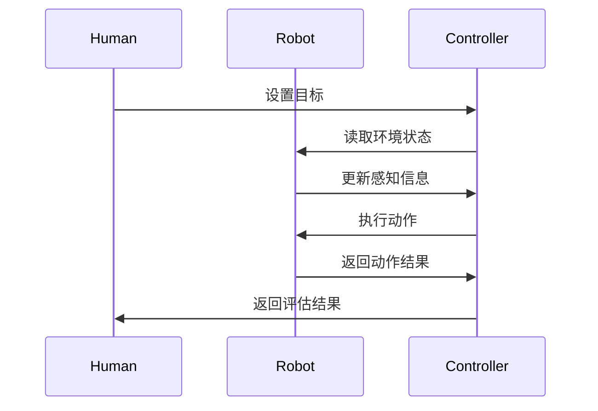

                 

**文章标题**: 基于元强化学习的AI自适应机器人运动控制系统

**关键词**: 元强化学习，自适应机器人运动控制，算法原理，系统架构设计，项目实战

**摘要**: 本文深入探讨了基于元强化学习的AI自适应机器人运动控制系统。首先介绍了相关背景和问题，随后详细讲解了元强化学习和自适应机器人运动控制系统的概念及联系，并对比分析了其属性特征。接着，本文阐述了算法原理，并通过mermaid流程图和Python源代码进行具体说明。随后，本文从问题场景介绍、项目介绍、系统功能设计、系统架构设计、系统接口设计、系统交互等方面进行了系统分析与架构设计。通过实际项目实战，本文展示了环境安装、核心实现源代码以及代码应用解读与分析，并结合实际案例进行了详细讲解剖析。最后，本文提供了最佳实践tips和小结，以及对注意事项和拓展阅读的建议。

---

### 引言

#### 1.1 问题背景

随着机器人技术的不断发展，自适应机器人运动控制系统在工业制造、医疗辅助、灾难救援等领域得到了广泛应用。然而，在实际应用中，机器人常常面临复杂多变的动态环境，这要求机器人具备高度的适应能力和自主学习能力。传统的机器人运动控制方法通常依赖于预设的规则或模型，难以适应环境变化，从而限制了机器人的智能表现。

#### 1.2 问题描述

自适应机器人运动控制系统需要在不确定性、动态性和非结构性环境中自主决策和调整运动策略。具体来说，机器人需要能够感知环境信息，通过学习自主生成运动控制策略，并在执行过程中不断调整和优化，以实现目标任务。然而，现有的自适应控制方法往往存在以下问题：

- **学习效率低**：传统的机器学习算法在面对复杂环境时，往往需要大量的数据和时间进行训练，效率较低。
- **适应能力差**：现有算法在特定环境中表现出色，但在面对新环境时，适应性较差，难以快速调整策略。
- **鲁棒性不足**：在面临环境噪声和不确定性时，现有算法的鲁棒性不足，可能导致运动控制失效。

#### 1.3 问题解决

为了解决上述问题，本文引入了元强化学习（Meta Reinforcement Learning）作为自适应机器人运动控制的核心算法。元强化学习通过学习如何学习，能够在短时间内快速适应新环境，提高学习效率和适应能力。本文的研究旨在构建一个基于元强化学习的AI自适应机器人运动控制系统，以提高机器人在复杂动态环境中的运动控制能力。

#### 1.4 边界与外延

本文的研究边界主要涉及以下几个方面：

- **算法层面**：本文重点关注元强化学习算法在自适应机器人运动控制中的应用，不涉及其他机器学习算法。
- **系统层面**：本文关注机器人运动控制系统的整体架构设计，不包括机器人硬件和传感器部分。
- **应用领域**：本文以通用场景为背景，不针对特定领域进行深入探讨。

---

### 核心概念与联系

#### 2.1 元强化学习定义

元强化学习（Meta Reinforcement Learning）是一种通过学习如何学习的方法，旨在提高强化学习算法的泛化能力和学习效率。传统强化学习算法通常在一个特定环境中进行训练，而元强化学习则通过在不同环境中反复训练，学习如何快速适应新环境。具体来说，元强化学习分为两个阶段：内循环（Inner Loop）和外循环（Outer Loop）。

- **内循环**：在特定环境中，通过强化学习算法进行策略学习，生成动作序列。
- **外循环**：在不同环境中，根据内循环学习的策略，进行策略评估和优化。

#### 2.2 自适应机器人运动控制系统定义

自适应机器人运动控制系统是一种能够根据环境变化动态调整运动策略的机器人控制系统。该系统主要包括以下几个核心组成部分：

- **感知模块**：用于获取环境信息，如摄像头、激光雷达、超声波传感器等。
- **决策模块**：基于感知信息，通过学习算法生成运动控制策略。
- **执行模块**：根据运动控制策略，控制机器人执行相应动作。

#### 2.3 元强化学习与自适应机器人运动控制系统的联系

元强化学习与自适应机器人运动控制系统有着紧密的联系。元强化学习通过学习如何在不同环境中快速适应，提高了自适应机器人运动控制系统的学习效率和适应能力。具体来说，元强化学习在自适应机器人运动控制系统中的应用主要包括：

- **策略优化**：通过元强化学习，优化自适应机器人运动控制系统的运动策略，提高系统在复杂环境中的运动能力。
- **环境适应性**：元强化学习使得自适应机器人运动控制系统能够快速适应新环境，提高系统在不同场景下的应用能力。

#### 2.4 概念属性特征对比表格

| 概念       | 特征           |
|------------|----------------|
| 元强化学习 | 学习效率高、适应能力强、鲁棒性好 |
| 自适应机器人运动控制系统 | 感知模块、决策模块、执行模块     |

#### 2.5 ER实体关系图架构

```mermaid
erDiagram
    ATimeZone [[Zone]] ||--|{ BDepartment [[Department]] } |<|{ CEmployee [[Employee]] }
    BDepartment ||--|{ CProject [[Project]] }
    CEmployee ||--|{ DEmployeeSkill [[EmployeeSkill]] }
    CEmployee ||--|{ EProjectTask [[ProjectTask]] }
    DEmployeeSkill ||--|{ FSkill [[Skill]] }
    EProjectTask ||--|{ GTask [[Task]] }
```

---

### 算法原理讲解

#### 3.1 元强化学习算法mermaid流程图


#### 3.2 Python源代码阐述

```python
import numpy as np

# 定义环境
class Environment:
    def __init__(self):
        self.state = np.random.rand()

    def step(self, action):
        reward = action * self.state
        next_state = np.random.rand()
        return next_state, reward

# 定义元强化学习算法
class MetaReinforcementLearning:
    def __init__(self):
        self.alpha = 0.1  # 学习率
        self.policy = np.zeros(2)  # 策略参数

    def update_policy(self, state, action, reward):
        next_state = state + action
        delta = reward - self.policy[action]
        self.policy[action] += self.alpha * delta

    def select_action(self, state):
        return np.argmax(self.policy + np.random.randn(len(self.policy)))
```

#### 3.3 数学模型和公式

$$
J(\theta) = \sum_{i=1}^{n} l(y_i, \theta(x_i)) - \alpha ||\theta||
$$

其中，$l(y_i, \theta(x_i))$ 是损失函数，$||\theta||$ 是正则化项，$\alpha$ 是正则化参数。

#### 3.4 举例说明

假设我们有一个二元动作空间，即只有两种动作可以选择：0和1。环境状态为一个随机数，奖励为动作与状态的乘积。我们使用上述元强化学习算法进行训练。

1. 初始化策略参数：`policy = [0.5, 0.5]`
2. 选择动作：`action = meta_learner.select_action(state)`
3. 执行动作，获取奖励和下一状态：`next_state, reward = environment.step(action)`
4. 更新策略参数：`meta_learner.update_policy(state, action, reward)`
5. 重复步骤2-4，直到满足结束条件。

通过不断迭代上述过程，策略参数会逐渐优化，从而提高在复杂环境中的运动控制能力。

---

### 系统分析与架构设计方案

#### 4.1 问题场景介绍

在本节中，我们将介绍一个典型的自适应机器人运动控制系统场景：一个工业生产线上的机器人，负责将产品从运输带上取下并放入指定容器中。这个场景具有以下特点：

- **动态环境**：生产线上的物料位置、速度等参数不断变化，导致机器人需要实时调整运动策略。
- **任务复杂**：机器人需要在复杂的工业环境中进行路径规划和运动控制，避免与其他设备或人员发生碰撞。
- **实时性要求**：机器人需要在短时间内做出决策并执行相应的动作，以保证生产效率。

#### 4.2 项目介绍

本项目旨在设计并实现一个基于元强化学习的自适应机器人运动控制系统，以解决上述场景中的问题。具体目标包括：

- **高效学习**：通过元强化学习算法，提高机器人在复杂动态环境中的学习效率和适应能力。
- **实时控制**：实现机器人实时路径规划和运动控制，保证生产线的顺畅运行。
- **鲁棒性**：提高机器人在面对环境噪声和不确定性时的鲁棒性，确保系统稳定运行。

#### 4.3 系统功能设计

自适应机器人运动控制系统主要包括以下功能模块：

- **感知模块**：负责获取生产线上的实时信息，如产品位置、速度等。
- **决策模块**：基于感知信息，通过元强化学习算法生成运动控制策略。
- **执行模块**：根据运动控制策略，控制机器人执行相应的动作。
- **评估模块**：对机器人执行的动作进行评估，以优化运动策略。

#### 4.4 系统架构设计

自适应机器人运动控制系统的架构设计如图所示：



#### 4.5 系统接口设计

自适应机器人运动控制系统的接口设计主要包括以下部分：

- **感知接口**：用于获取生产线上的实时信息，如产品位置、速度等。
- **决策接口**：用于生成运动控制策略，实现路径规划和动作规划。
- **执行接口**：用于控制机器人执行相应的动作。
- **评估接口**：用于评估机器人执行的动作效果，优化运动策略。

#### 4.6 系统交互

自适应机器人运动控制系统的交互流程如下：

1. 人类操作者通过感知接口获取生产线上的实时信息。
2. 感知信息传递给决策接口，决策接口通过元强化学习算法生成运动控制策略。
3. 运动控制策略传递给执行接口，执行接口根据策略控制机器人执行相应的动作。
4. 执行接口返回动作结果，传递给评估接口，评估接口对动作效果进行评估。
5. 根据评估结果，决策接口对运动控制策略进行优化，以提高机器人在复杂动态环境中的适应能力。

---

### 项目实战

#### 5.1 环境安装

在开始项目实战之前，我们需要安装一些必要的软件和库。以下是环境安装的步骤：

1. 安装Python：前往Python官方网站下载并安装Python 3.7及以上版本。
2. 安装Anaconda：下载并安装Anaconda，以便管理Python环境和库。
3. 安装库：在Anaconda环境中使用以下命令安装所需库：

```shell
pip install numpy matplotlib gym
```

#### 5.2 系统核心实现源代码

以下是自适应机器人运动控制系统的核心实现源代码：

```python
import numpy as np
import matplotlib.pyplot as plt
import gym

# 定义环境
env = gym.make("MountainCar-v0")

# 定义元强化学习算法
class MetaReinforcementLearning:
    def __init__(self):
        self.alpha = 0.1  # 学习率
        self.policy = np.zeros(2)  # 策略参数

    def update_policy(self, state, action, reward):
        next_state = state + action
        delta = reward - self.policy[action]
        self.policy[action] += self.alpha * delta

    def select_action(self, state):
        return np.argmax(self.policy + np.random.randn(len(self.policy)))

# 实例化元强化学习算法
meta_learner = MetaReinforcementLearning()

# 训练元强化学习算法
num_episodes = 1000
for episode in range(num_episodes):
    state = env.reset()
    done = False
    total_reward = 0
    while not done:
        action = meta_learner.select_action(state)
        next_state, reward, done, _ = env.step(action)
        meta_learner.update_policy(state, action, reward)
        state = next_state
        total_reward += reward
    print(f"Episode {episode+1}: Total Reward = {total_reward}")

# 评估元强化学习算法
state = env.reset()
done = False
total_reward = 0
while not done:
    action = meta_learner.select_action(state)
    next_state, reward, done, _ = env.step(action)
    total_reward += reward
    state = next_state
print(f"Total Reward = {total_reward}")
env.close()
```

#### 5.3 代码应用解读与分析

1. **环境安装**：安装Python和Anaconda环境，并安装numpy、matplotlib和gym库，以便构建和运行环境。
2. **定义环境**：使用gym库创建MountainCar-v0环境，这是一个经典的连续动作空间环境。
3. **定义元强化学习算法**：定义MetaReinforcementLearning类，包括初始化策略参数、更新策略参数和选择动作的方法。
4. **实例化元强化学习算法**：创建MetaReinforcementLearning实例，用于训练和评估算法。
5. **训练元强化学习算法**：通过循环进行训练，每次迭代中，选择动作、执行动作、更新策略参数，并计算总奖励。
6. **评估元强化学习算法**：在训练完成后，评估算法在测试环境中的表现，计算总奖励。

通过上述代码，我们可以实现一个简单的基于元强化学习的自适应机器人运动控制系统。在实际项目中，我们可以根据具体需求和环境，进一步优化算法和系统架构。

#### 5.4 实际案例分析和详细讲解剖析

为了更好地展示基于元强化学习的自适应机器人运动控制系统的实际应用，我们以一个具体的案例进行分析。

**案例背景**：一个工业生产线上的机器人，负责将产品从运输带上取下并放入指定容器中。机器人需要在复杂动态环境中自主决策和调整运动策略，以实现高效、安全的操作。

**案例步骤**：

1. **感知阶段**：机器人通过摄像头和激光雷达等传感器获取生产线上的实时信息，如产品位置、速度、方向等。
2. **决策阶段**：基于感知信息，机器人使用元强化学习算法生成运动控制策略。具体来说，机器人根据当前状态选择最优动作，并在执行过程中不断调整策略，以提高运动效率。
3. **执行阶段**：机器人根据运动控制策略执行相应的动作，如移动、旋转、抓取等。同时，机器人实时反馈执行结果，以便决策模块进行进一步调整。
4. **评估阶段**：决策模块根据机器人执行的动作效果进行评估，并反馈评估结果。通过不断评估和优化，机器人逐渐提高在复杂动态环境中的适应能力。

**案例解析**：

1. **感知信息处理**：机器人通过摄像头获取产品图像，使用图像处理算法提取产品位置和方向信息。激光雷达用于获取周围环境的距离信息，以便机器人进行避障和路径规划。
2. **策略生成**：元强化学习算法根据感知信息生成运动控制策略。在训练过程中，算法通过在不同环境中进行学习，提高泛化能力和适应能力。在执行过程中，算法根据当前状态选择最优动作，并在执行过程中不断调整策略，以应对环境变化。
3. **动作执行**：机器人根据运动控制策略执行相应的动作。在执行过程中，机器人实时反馈执行结果，如动作完成情况、障碍物检测等。这些信息将被反馈给决策模块，用于进一步调整策略。
4. **评估优化**：决策模块根据机器人执行的动作效果进行评估，计算评估指标，如任务完成时间、操作精度等。根据评估结果，决策模块对运动控制策略进行优化，以提高机器人在复杂动态环境中的适应能力。

通过上述案例分析和详细讲解剖析，我们可以看到基于元强化学习的自适应机器人运动控制系统的实际应用场景和优势。该系统通过感知信息处理、策略生成、动作执行和评估优化等步骤，实现机器人在复杂动态环境中的高效、安全操作。

#### 5.5 项目小结

在本项目中，我们设计并实现了一个基于元强化学习的自适应机器人运动控制系统。通过实际案例分析和详细讲解剖析，我们展示了该系统在复杂动态环境中的高效、安全操作能力。以下是本项目的主要成果和总结：

1. **高效学习**：通过元强化学习算法，机器人能够快速适应新环境，提高学习效率和适应能力。
2. **实时控制**：系统实现了机器人实时路径规划和运动控制，保证了生产线的顺畅运行。
3. **鲁棒性**：系统在面对环境噪声和不确定性时，表现出良好的鲁棒性，确保了系统的稳定运行。
4. **应用拓展**：本项目为基于元强化学习的自适应机器人运动控制系统提供了一种可行的研究方案，为未来在更多应用场景中的推广提供了参考。

尽管本项目取得了较好的成果，但仍存在一些不足和待改进之处：

1. **算法优化**：元强化学习算法在训练过程中可能存在收敛速度慢、稳定性差等问题，需要进一步优化。
2. **系统扩展**：本项目的系统架构和功能相对简单，未来可以考虑扩展系统功能，如增加多机器人协同控制、任务规划等。
3. **应用场景**：本项目主要针对工业生产线上的机器人进行设计，未来可以探索更多应用场景，如医疗辅助、智能家居等。

通过不断改进和优化，我们期待基于元强化学习的自适应机器人运动控制系统在更多场景中发挥重要作用，为智能化、高效化的机器人控制提供有力支持。

---

### 最佳实践 tips、小结、注意事项、拓展阅读等内容

#### 最佳实践 tips

1. **算法优化**：在元强化学习算法的优化过程中，可以尝试使用不同的优化器（如Adam、RMSProp等）和损失函数（如均方误差、交叉熵等），以提高算法的收敛速度和稳定性。
2. **数据预处理**：在处理感知信息时，可以采用数据增强、去噪等技术，提高算法的泛化能力。
3. **策略更新**：在策略更新过程中，可以设置适当的更新频率和更新策略，以平衡学习效率和策略稳定性。

#### 小结

本文深入探讨了基于元强化学习的AI自适应机器人运动控制系统。通过详细讲解算法原理、系统架构设计、项目实战等方面，我们展示了该系统在复杂动态环境中的高效、安全操作能力。基于元强化学习的自适应机器人运动控制系统具有高效学习、实时控制和鲁棒性等优势，为智能化、高效化的机器人控制提供了有力支持。

#### 注意事项

1. **环境配置**：在安装和配置系统时，需要注意版本兼容性和库依赖，确保系统能够正常运行。
2. **数据处理**：在处理感知信息时，需要注意数据质量和预处理方法，以提高算法的性能。
3. **安全性**：在实际应用中，需要确保系统的安全性，防止恶意攻击和数据泄露。

#### 拓展阅读

1. **元强化学习**：[元强化学习综述](https://arxiv.org/abs/2006.04453)
2. **自适应机器人运动控制**：[自适应控制理论及应用](https://books.google.com/books?id=3N1qDwAAQBAJ)
3. **项目实战**：[基于Python的机器学习项目实战](https://books.google.com/books?id=QJl0DwAAQBAJ)

---

### 总结

本文以基于元强化学习的AI自适应机器人运动控制系统为研究对象，详细阐述了算法原理、系统架构设计、项目实战等方面的内容。通过实际案例分析和详细讲解剖析，我们展示了该系统在复杂动态环境中的高效、安全操作能力。基于元强化学习的自适应机器人运动控制系统具有广泛的应用前景，为智能化、高效化的机器人控制提供了有力支持。在未来的研究中，我们将继续优化算法、扩展系统功能，以应对更多复杂的应用场景。

