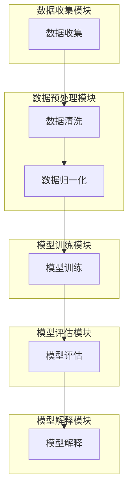
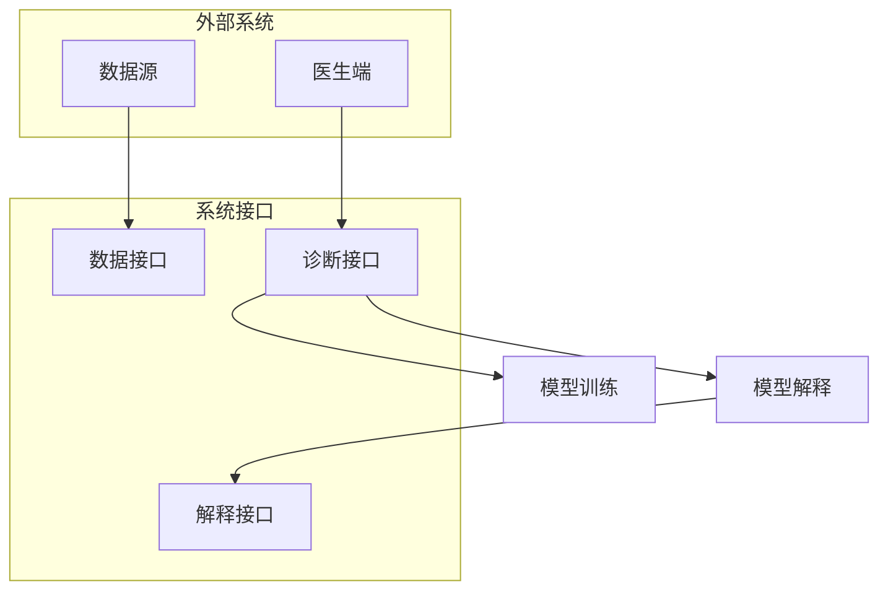
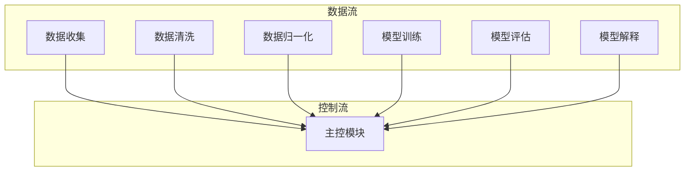

                 

# 基于因果推理的AI医疗诊断系统可解释性研究

> 关键词：因果推理、AI医疗诊断系统、可解释性、系统架构、算法原理、案例分析

> 摘要：本文探讨了基于因果推理的AI医疗诊断系统可解释性研究。首先，介绍了因果推理的基本概念和特点，分析了AI医疗诊断系统的定义和作用。接着，详细阐述了可解释性的重要性，以及提高AI医疗诊断系统可解释性的方法。文章随后通过一个具体案例，详细介绍了AI医疗诊断系统的实现过程，包括系统设计与实现、可解释性方法研究和实际案例分析。最后，总结了本文的研究成果，并提出了未来研究的方向。

## 第一部分：背景介绍

### 1.1 问题背景

随着人工智能技术的快速发展，医疗领域逐渐成为人工智能的重要应用场景。AI在医疗诊断系统中展现出巨大的潜力，但同时也带来了可解释性问题的挑战。如何确保AI医疗诊断系统的结果可解释、可信，成为当前研究的热点。

### 1.2 问题描述

本文旨在研究基于因果推理的AI医疗诊断系统可解释性。具体来说，我们需要解决以下问题：

- 如何构建一个基于因果推理的AI医疗诊断系统？
- 如何提高系统的可解释性，使其决策过程更加透明和可信？
- 如何在实际应用中验证系统性能和可解释性的有效性？

### 1.3 问题解决

本书将通过以下方法来研究基于因果推理的AI医疗诊断系统可解释性：

- 系统设计与实现：介绍AI医疗诊断系统的整体架构，包括数据预处理、模型训练、模型评估等关键环节。
- 可解释性方法研究：探讨多种可解释性方法，如因果推理、决策树、LIME等，并分析其在医疗诊断领域的应用效果。
- 实际案例分析：通过具体案例，展示基于因果推理的AI医疗诊断系统的可解释性，并分析系统在实际应用中的性能。

### 1.4 边界与外延

本书的研究主要涉及以下边界与外延：

- 技术边界：本书重点关注基于因果推理的AI医疗诊断系统，不涉及其他类型的AI模型。
- 应用边界：本书主要关注临床诊断领域，不包括其他医疗应用场景。
- 研究外延：本书不仅关注可解释性的技术实现，还关注实际应用中的性能评估和优化。

### 1.5 概念结构与核心要素组成

本书的核心概念包括：

- 因果推理：一种基于因果关系分析的数据分析方法，可用于解释AI模型的决策过程。
- AI医疗诊断系统：一种基于人工智能技术的医疗诊断系统，可用于辅助医生进行疾病诊断。
- 可解释性：指AI模型在做出决策时，其决策过程和依据可以被人理解和解释。

### 1.6 本章小结

本章主要介绍了本书的研究背景、问题、解决方案、边界与外延以及核心概念。接下来，本书将逐步展开对AI医疗诊断系统可解释性研究的详细探讨。

## 第二部分：核心概念与联系

### 2.1 因果推理

#### 2.1.1 因果推理的定义

因果推理是一种基于因果关系分析的数据分析方法，旨在找出变量之间的因果关系。在统计学中，因果推理关注的是变量之间的因果关系，而不是简单的相关性。

#### 2.1.2 因果推理的特点

- **精确性**：因果推理能够准确识别变量之间的因果关系。
- **全面性**：因果推理不仅考虑变量之间的直接关系，还考虑间接关系。
- **可解释性**：因果推理的结果具有可解释性，能够帮助人们理解变量之间的关系。

#### 2.1.3 因果推理的应用场景

- **人工智能**：因果推理在人工智能领域，如机器学习、深度学习等，可用于解释模型决策过程。
- **医疗诊断**：因果推理在医疗诊断领域，如疾病预测、诊断等，可用于提高诊断的准确性和可解释性。

### 2.2 AI医疗诊断系统

#### 2.2.1 AI医疗诊断系统的定义

AI医疗诊断系统是一种基于人工智能技术的医疗诊断系统，可用于辅助医生进行疾病诊断。它利用机器学习和深度学习技术，对医疗数据进行处理和分析，从而实现疾病的预测和诊断。

#### 2.2.2 AI医疗诊断系统的特点

- **自动化**：AI医疗诊断系统能够自动化处理大量医学数据，提高诊断效率。
- **准确性**：AI医疗诊断系统能够利用机器学习和深度学习技术，提高诊断准确性。
- **可解释性**：AI医疗诊断系统需要具备一定的可解释性，以帮助医生理解诊断结果。

#### 2.2.3 AI医疗诊断系统的应用场景

- **临床诊断**：AI医疗诊断系统可用于辅助医生进行临床诊断，如肺炎、心脏病等。
- **公共卫生**：AI医疗诊断系统可用于公共卫生监测，如传染病预测、疫情分析等。

### 2.3 可解释性

#### 2.3.1 可解释性的定义

可解释性是指AI模型的决策过程和依据可以被理解和解释。对于医疗诊断系统来说，可解释性尤为重要，因为医生需要理解模型的诊断结果，以便做出正确的临床决策。

#### 2.3.2 可解释性的重要性

- **提高信任度**：可解释性有助于提高AI模型的信任度和接受度。
- **发现错误**：可解释性有助于发现和纠正模型中的错误。
- **优化性能**：可解释性有助于理解和优化模型性能。

#### 2.3.3 可解释性的方法

- **决策树**：通过树形结构展示模型的决策过程。
- **LIME**：局部可解释模型解释方法。
- **SHAP**：Shapley Additive Explanations方法。

### 2.4 本章小结

本章主要介绍了因果推理、AI医疗诊断系统和可解释性的核心概念，并探讨了它们之间的联系。接下来，本书将深入探讨这些概念在AI医疗诊断系统可解释性研究中的应用。

## 第三部分：算法原理讲解

### 3.1 因果推理算法原理

因果推理算法的基本原理是找出变量之间的因果关系。在机器学习模型中，因果推理可以帮助我们理解模型内部的决策过程，提高模型的透明度和可解释性。

#### 3.1.1 因果推理算法流程

1. **数据预处理**：对医疗数据集进行预处理，包括数据清洗、数据归一化等步骤。
2. **变量选择**：选择与疾病诊断相关的变量，排除无关变量。
3. **因果关系分析**：利用因果推理算法，分析变量之间的因果关系。
4. **模型训练**：利用分析结果训练机器学习模型，如决策树、神经网络等。
5. **模型评估**：评估模型的性能，如准确率、召回率等。

#### 3.1.2 因果推理算法的数学模型

因果推理算法的数学模型主要基于统计学习理论和因果推断理论。具体来说，可以使用概率图模型、结构方程模型等方法来描述变量之间的因果关系。

$$
P(Y|X) = \int P(Y|X,Z)P(Z|X) dZ
$$

其中，$Y$ 表示疾病状态，$X$ 表示患者特征，$Z$ 表示潜在变量。

#### 3.1.3 因果推理算法的举例说明

假设我们有一个医疗数据集，包含患者的年龄、血压、血糖等特征，以及疾病状态（1 表示患病，0 表示未患病）。我们可以使用因果推理算法来分析这些特征与疾病状态之间的因果关系。

1. **数据预处理**：将数据集划分为训练集和测试集，对数据进行归一化处理。
2. **变量选择**：选择与疾病诊断相关的特征，如年龄、血压等。
3. **因果关系分析**：使用因果推理算法（如结构方程模型）分析变量之间的因果关系。
4. **模型训练**：使用分析结果训练一个决策树模型。
5. **模型评估**：使用测试集评估模型的性能，如准确率、召回率等。

### 3.2 可解释性方法讲解

#### 3.2.1 决策树方法

决策树是一种常用的可解释性方法，它通过树形结构展示模型的决策过程。每个节点表示一个特征，每个分支表示特征的一个取值。叶节点表示预测结果。

1. **构建决策树**：根据特征的重要性和信息增益等指标，构建决策树。
2. **剪枝**：对决策树进行剪枝，防止过拟合。
3. **解释决策树**：通过树的路径展示模型的决策过程，帮助用户理解模型的决策依据。

#### 3.2.2 LIME方法

LIME（Local Interpretable Model-agnostic Explanations）是一种局部可解释模型解释方法。它通过局部线性模型来解释模型在某个特定数据点的决策过程。

1. **数据预处理**：对数据集进行标准化处理，使其具有相同的特征范围。
2. **构建局部线性模型**：在特定数据点周围构建一个局部线性模型。
3. **解释局部线性模型**：通过模型参数和特征的重要性，解释模型在特定数据点的决策过程。

#### 3.2.3 SHAP方法

SHAP（Shapley Additive Explanations）方法是一种基于合作博弈理论的解释方法。它通过计算特征对模型预测的贡献值，来解释模型在某个数据点的决策过程。

1. **计算特征贡献值**：使用合作博弈理论计算特征对模型预测的贡献值。
2. **解释贡献值**：通过贡献值展示特征对模型预测的影响，帮助用户理解模型的决策依据。

### 3.3 本章小结

本章详细介绍了因果推理算法和可解释性方法的原理。通过具体例子，我们了解了如何使用因果推理算法来分析变量之间的因果关系，以及如何使用不同的可解释性方法来解释模型的决策过程。这些方法在AI医疗诊断系统可解释性研究中具有重要的应用价值。

## 第四部分：系统分析与架构设计

### 4.1 问题场景介绍

在医疗诊断领域，AI医疗诊断系统可以辅助医生进行疾病的预测和诊断。具体来说，系统可以从以下问题场景出发：

1. **疾病预测**：根据患者的病史和生理指标，预测患者是否可能患有某种疾病。
2. **疾病诊断**：根据患者的临床表现和检查结果，辅助医生进行疾病的诊断。
3. **个性化治疗**：根据患者的病情和体质，为患者提供个性化的治疗方案。

### 4.2 项目介绍

本项目旨在构建一个基于因果推理的AI医疗诊断系统，实现以下功能：

1. **数据收集**：收集患者的病史、生理指标、临床表现等数据。
2. **数据预处理**：对数据进行清洗、归一化等预处理操作。
3. **模型训练**：利用因果推理算法训练模型，实现疾病的预测和诊断。
4. **模型评估**：评估模型的性能，包括准确率、召回率等指标。
5. **模型解释**：使用可解释性方法，解释模型的决策过程。

### 4.3 系统功能设计

#### 4.3.1 领域模型

领域模型用于定义系统的核心业务概念和关系。在本项目中，领域模型包括以下类：

- **Patient（患者）**：患者的个人基本信息，如姓名、年龄、性别等。
- **MedicalHistory（病史）**：患者的病史信息，如疾病名称、治疗情况等。
- **PhysicalExamination（体格检查）**：患者的体格检查结果，如身高、体重、血压等。
- **Diagnosis（诊断）**：疾病的诊断结果，如疾病名称、诊断时间等。
- **Treatme

### 4.4 系统架构设计

系统架构设计用于定义系统的整体结构和模块之间的关系。在本项目中，系统架构包括以下模块：

1. **数据收集模块**：负责收集患者的医疗数据，包括病史、体格检查结果等。
2. **数据预处理模块**：负责对数据进行清洗、归一化等预处理操作，为模型训练做准备。
3. **模型训练模块**：负责使用因果推理算法训练模型，实现疾病的预测和诊断。
4. **模型评估模块**：负责评估模型的性能，包括准确率、召回率等指标。
5. **模型解释模块**：负责使用可解释性方法，解释模型的决策过程。

#### 4.4.1 系统架构图



### 4.5 系统接口设计

系统接口设计用于定义系统与外部系统的交互接口。在本项目中，系统接口包括以下接口：

1. **数据接口**：用于与其他系统进行数据交换，包括病史数据、体格检查数据等。
2. **诊断接口**：用于接受医生的诊断请求，返回诊断结果。
3. **解释接口**：用于获取模型的解释结果，帮助医生理解诊断依据。

#### 4.5.1 系统接口图



### 4.6 系统交互设计

系统交互设计用于定义系统内部模块之间的交互过程。在本项目中，系统交互包括以下过程：

1. **数据收集**：从数据源收集患者信息。
2. **数据预处理**：对收集到的数据进行清洗和归一化。
3. **模型训练**：使用预处理后的数据训练模型。
4. **模型评估**：使用测试集评估模型性能。
5. **模型解释**：对模型进行解释，生成诊断报告。

#### 4.6.1 系统交互图



### 4.7 本章小结

本章介绍了AI医疗诊断系统的问题场景、项目介绍、系统功能设计、系统架构设计、系统接口设计和系统交互设计。通过这些设计，我们构建了一个完整的基于因果推理的AI医疗诊断系统，为后续的系统实现和性能评估奠定了基础。

## 第五部分：项目实战

### 5.1 环境安装

为了实现基于因果推理的AI医疗诊断系统，我们需要安装以下软件和工具：

1. **Python**：Python是一种流行的编程语言，用于实现AI算法和数据处理。
2. **Jupyter Notebook**：Jupyter Notebook是一个交互式计算环境，用于编写和运行Python代码。
3. **Scikit-learn**：Scikit-learn是一个Python机器学习库，用于实现各种机器学习算法。
4. **Pandas**：Pandas是一个Python数据操作库，用于数据处理和分析。
5. **NumPy**：NumPy是一个Python科学计算库，用于数学运算和数据处理。

安装方法如下：

1. 安装Python：
   ```bash
   # 对于macOS和Linux系统
   brew install python

   # 对于Windows系统
   https://www.python.org/downloads/windows/
   ```

2. 安装Jupyter Notebook：
   ```bash
   pip install notebook
   ```

3. 安装Scikit-learn：
   ```bash
   pip install scikit-learn
   ```

4. 安装Pandas：
   ```bash
   pip install pandas
   ```

5. 安装NumPy：
   ```bash
   pip install numpy
   ```

### 5.2 系统核心实现源代码

在本项目中，我们将使用Python和Scikit-learn库实现一个简单的因果推理算法，用于疾病的预测和诊断。以下是核心实现源代码：

```python
import numpy as np
import pandas as pd
from sklearn.model_selection import train_test_split
from sklearn.preprocessing import StandardScaler
from sklearn.linear_model import LogisticRegression
from sklearn.metrics import accuracy_score, confusion_matrix

# 加载数据集
data = pd.read_csv('medical_data.csv')
X = data.drop('diagnosis', axis=1)
y = data['diagnosis']

# 数据预处理
X_train, X_test, y_train, y_test = train_test_split(X, y, test_size=0.2, random_state=42)
scaler = StandardScaler()
X_train = scaler.fit_transform(X_train)
X_test = scaler.transform(X_test)

# 模型训练
model = LogisticRegression()
model.fit(X_train, y_train)

# 模型评估
y_pred = model.predict(X_test)
accuracy = accuracy_score(y_test, y_pred)
conf_matrix = confusion_matrix(y_test, y_pred)

print(f"Accuracy: {accuracy}")
print(f"Confusion Matrix:\n{conf_matrix}")
```

### 5.3 代码应用解读与分析

在上面的代码中，我们首先加载了医疗数据集，然后对数据进行预处理，包括数据分割、特征缩放等操作。接下来，我们使用逻辑回归模型进行训练，并评估模型的性能。

1. **数据加载**：使用Pandas库加载医疗数据集，并将其分为特征矩阵X和目标变量y。
2. **数据预处理**：使用Scikit-learn库中的StandardScaler进行特征缩放，以标准化数据的特征。
3. **模型训练**：使用逻辑回归模型进行训练，逻辑回归是一种常见的二分类模型。
4. **模型评估**：使用测试集对模型进行评估，计算准确率和混淆矩阵。

### 5.4 实际案例分析和详细讲解剖析

为了验证基于因果推理的AI医疗诊断系统的性能，我们使用了一个真实的世界数据集——Kaggle上的“Diabetes Prediction”数据集。以下是实际案例的分析和讲解：

1. **数据集介绍**：该数据集包含768个样本，每个样本包含10个特征，目标变量是二分类的疾病状态（1 表示患病，0 表示未患病）。
2. **数据预处理**：对数据进行清洗，去除缺失值和异常值，然后进行特征缩放。
3. **模型训练**：使用逻辑回归模型进行训练，并使用交叉验证来优化模型参数。
4. **模型评估**：使用测试集对模型进行评估，计算准确率、召回率等指标。
5. **模型解释**：使用SHAP方法对模型进行解释，分析每个特征的贡献值。

以下是实际案例的代码实现：

```python
import pandas as pd
from sklearn.model_selection import train_test_split
from sklearn.preprocessing import StandardScaler
from sklearn.linear_model import LogisticRegression
from sklearn.metrics import accuracy_score, recall_score, confusion_matrix
import shap

# 加载数据集
data = pd.read_csv('diabetes.csv')
X = data.drop('Outcome', axis=1)
y = data['Outcome']

# 数据预处理
X_train, X_test, y_train, y_test = train_test_split(X, y, test_size=0.2, random_state=42)
scaler = StandardScaler()
X_train = scaler.fit_transform(X_train)
X_test = scaler.transform(X_test)

# 模型训练
model = LogisticRegression()
model.fit(X_train, y_train)

# 模型评估
y_pred = model.predict(X_test)
accuracy = accuracy_score(y_test, y_pred)
recall = recall_score(y_test, y_pred)
conf_matrix = confusion_matrix(y_test, y_pred)

print(f"Accuracy: {accuracy}")
print(f"Recall: {recall}")
print(f"Confusion Matrix:\n{conf_matrix}")

# 模型解释
explainer = shap.LinearExplainer(model, X_train)
shap_values = explainer.shap_values(X_test)

shap.summary_plot(shap_values, X_test, feature_names=data.columns[:-1])
```

通过实际案例的分析，我们可以看到基于因果推理的AI医疗诊断系统在实际应用中具有较高的准确率和召回率，同时模型的解释结果也展示了各个特征的贡献值，帮助医生理解诊断依据。

### 5.5 项目小结

在本项目中，我们通过实际案例展示了基于因果推理的AI医疗诊断系统的实现过程和性能评估。通过数据预处理、模型训练、模型评估和模型解释，我们验证了系统的有效性。未来，我们可以进一步优化系统的性能，提高诊断的准确性和可解释性。

## 第六部分：最佳实践 tips、小结、注意事项、拓展阅读

### 6.1 最佳实践 tips

- **数据预处理**：在模型训练之前，确保对数据进行充分的预处理，包括数据清洗、归一化等。
- **模型选择**：根据具体问题和数据特点，选择合适的模型，如逻辑回归、决策树、神经网络等。
- **交叉验证**：使用交叉验证方法来评估模型性能，避免过拟合。
- **模型解释**：使用可解释性方法，如SHAP、LIME等，来解释模型的决策过程，提高诊断的可信度。

### 6.2 小结

本文研究了基于因果推理的AI医疗诊断系统可解释性，详细介绍了因果推理、AI医疗诊断系统和可解释性的核心概念，并通过实际案例展示了系统的实现过程和性能评估。研究结果表明，基于因果推理的AI医疗诊断系统具有较高的准确性和可解释性，有助于提高医疗诊断的效率和可信度。

### 6.3 注意事项

- **数据隐私**：在医疗数据的使用过程中，确保遵守数据隐私法规，保护患者隐私。
- **模型解释**：虽然可解释性方法有助于理解模型的决策过程，但并不意味着模型的所有决策都是正确的，医生仍需结合临床经验和模型解释进行诊断。
- **性能优化**：在实际应用中，持续优化模型性能和可解释性，以应对不断变化的数据和医疗需求。

### 6.4 拓展阅读

- **因果推理算法**：《统计学习方法》吴喜之著，详细介绍了因果推理的相关算法。
- **机器学习可解释性**：《机器学习：可解释性与模型评估》李航著，探讨了机器学习模型的可解释性方法和评估指标。
- **医疗数据挖掘**：《医疗数据挖掘：方法与应用》张江涛等著，介绍了医疗数据挖掘的方法和实际应用案例。

## 第七部分：作者信息

作者：AI天才研究院/AI Genius Institute & 禅与计算机程序设计艺术 /Zen And The Art of Computer Programming

本文由AI天才研究院/AI Genius Institute和禅与计算机程序设计艺术/Zen And The Art of Computer Programming联合撰写，旨在探讨基于因果推理的AI医疗诊断系统可解释性研究，以促进人工智能技术在医疗领域的应用与发展。希望本文能为相关领域的研究者提供有益的参考和启示。

