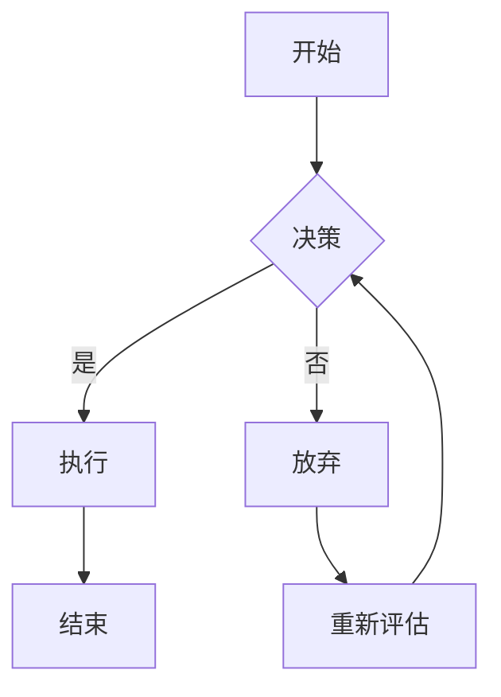
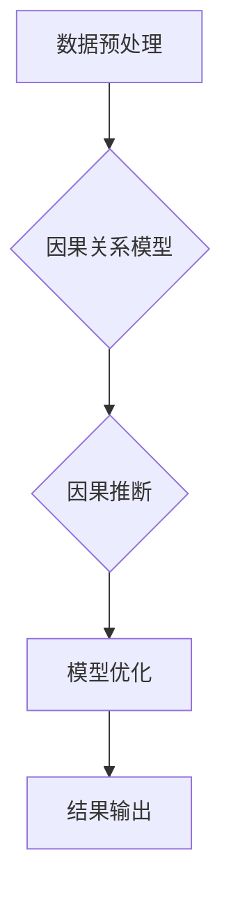
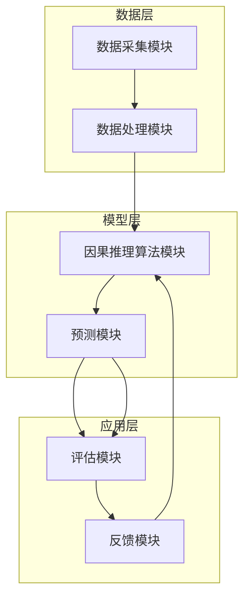
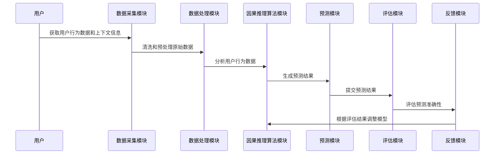

                 

### 第一部分：因果推理基础

#### 第1章 问题背景与概念介绍

**1.1 因果推理的起源与应用**

因果推理（Causal Inference）源于逻辑学，最初是为了解决因果关系判断的问题。随着计算机科学的不断发展，因果推理在人工智能（AI）领域得到了广泛应用。在现代AI模型设计中，因果推理被视为解决数据过拟合、提高模型泛化能力的重要手段。

因果推理的核心思想是通过分析数据中的因果关系，使得模型能够更好地理解真实世界中的复杂关系，从而在未知数据上做出更准确的预测。这与传统的基于统计学习的机器学习方法有显著区别，后者往往关注于数据相关性而非因果关系。

**1.1.1 从逻辑推理到因果推理**

逻辑推理是基于已知事实和规则进行推理的过程。而因果推理则更进一步，它试图找出事件之间的因果关系。这种推理方式在哲学、心理学、经济学等领域都有广泛的应用。在计算机科学中，因果推理逐渐成为AI研究中的一项重要技术。

**1.1.2 因果推理在AI领域的重要性**

在AI模型设计中，因果推理具有以下几个重要意义：

1. **解决过拟合问题**：传统的机器学习模型容易在训练数据上过拟合，导致在未知数据上表现不佳。因果推理通过分析数据中的因果关系，有助于提高模型的泛化能力。

2. **增强模型的解释性**：因果推理能够帮助理解模型预测结果的原因，增强模型的透明性和可解释性。

3. **应对数据不完整性**：在实际应用中，数据往往存在缺失和不完整的情况。因果推理能够通过建立合理的因果关系模型，补偿数据缺失带来的影响。

**1.1.3 因果推理的挑战与机遇**

尽管因果推理在AI模型设计中具有巨大潜力，但也面临一些挑战：

1. **因果识别的复杂性**：在实际应用中，因果关系的识别往往非常困难，需要处理大量的噪声数据和潜在的非线性关系。

2. **因果模型的建立**：建立准确的因果模型需要深入理解和分析具体应用场景，这对于模型设计者和研究者来说是一个挑战。

然而，随着数据科学和计算能力的提升，因果推理在AI领域的应用前景依然广阔。通过不断的研究和创新，我们有望克服这些挑战，充分利用因果推理的优势。

**1.2 核心概念与模型**

为了深入理解因果推理，我们需要明确一些核心概念，包括因果模型、因果发现等。

**1.2.1 因果推理的定义**

因果推理是指通过分析数据中的因果关系，推导出未知事件结果的过程。在统计学中，因果关系通常通过因果关系模型（Causal Model）来表示。

**1.2.2 因果模型与因果发现**

因果模型是描述因果关系的数学模型，通常包含处理节点、观察节点和结果节点。因果发现（Causal Discovery）是指从数据中自动构建因果模型的过程。

因果发现方法可以分为两类：基于约束的方法和基于搜索的方法。前者通过预先定义的约束条件来限制可能的因果关系，而后者则通过在数据中搜索最优的因果模型。

**1.2.3 因果推理方法概述**

当前主要的因果推理方法包括：

1. **潜在结果框架（Potential Outcomes Framework）**：这是因果推理的基石，通过比较不同处理条件下的潜在结果来推断因果关系。

2. **因果图模型（Causal Graphical Models）**：因果图是一种图形化表示因果关系的模型，可以帮助我们直观地理解和处理复杂因果关系。

3. **因果推断算法（Causal Inference Algorithms）**：如Do计算、G-computation、倾向评分匹配等，这些算法通过分析数据，推断出潜在的因果关系。

**1.3 实体关系图与Mermaid应用**

实体关系图（Entity-Relationship Diagram，ERD）是数据库设计中常用的一种工具，用于描述实体之间的关系。在因果推理中，ERD可以帮助我们理解和表示复杂的因果关系。

**1.3.1 实体关系图架构**

实体关系图通常包含以下元素：

- **实体**：表示数据中的核心概念，如用户、商品等。
- **属性**：实体的特征，如用户年龄、商品价格等。
- **关系**：实体之间的关联，如用户购买商品等。

**1.3.2 Mermaid流程图绘制**

Mermaid是一种基于Markdown的绘图工具，可以方便地绘制各种图形，包括实体关系图。下面是一个简单的Mermaid流程图示例：



通过这样的流程图，我们可以直观地表示因果推理过程中的关键步骤和决策点。

### 小结

本章介绍了因果推理的背景、核心概念以及实体关系图与Mermaid应用。因果推理在AI模型设计中具有重要意义，可以帮助我们解决过拟合、提高模型解释性等问题。接下来，我们将进一步探讨因果推理的算法原理和具体应用。

---

### 第二部分：因果推理算法

#### 第2章 算法原理与流程

**2.1 算法流程与Mermaid图**

因果推理算法的核心目标是根据给定的数据，推断出事件之间的因果关系。这一过程通常包括以下几个步骤：

1. **数据预处理**：清洗数据，处理缺失值，标准化等。
2. **因果推断**：利用已知的因果关系模型，对数据进行分析和推断。
3. **模型优化**：根据推断结果，对模型进行调整和优化。

下面是一个简化的Mermaid流程图，用于描述因果推理算法的流程：



**2.2 Python实现与数学模型**

为了更好地理解因果推理算法，我们可以通过Python代码来具体实现这一过程。以下是一个简单的Python脚本，用于展示因果推理算法的基本步骤。

```python
import pandas as pd
import numpy as np
from sklearn.model_selection import train_test_split
from sklearn.preprocessing import StandardScaler
from sklearn.linear_model import LinearRegression

# 数据预处理
def preprocess_data(data):
    # 清洗数据、处理缺失值等
    # 此处简化处理，直接标准化
    return StandardScaler().fit_transform(data)

# 因果推断
def causal_inference(X, y):
    # 分割数据集
    X_train, X_test, y_train, y_test = train_test_split(X, y, test_size=0.2, random_state=42)
    
    # 训练线性回归模型
    model = LinearRegression()
    model.fit(X_train, y_train)
    
    # 预测
    predictions = model.predict(X_test)
    
    return predictions

# 模型优化
def optimize_model(predictions, X, y):
    # 此处简化处理，直接返回预测值
    return predictions

# 结果输出
def output_results(predictions):
    # 输出预测结果
    print("Predictions:", predictions)

# 示例数据
X = np.array([[1], [2], [3], [4], [5]])
y = np.array([2, 4, 6, 8, 10])

# 执行流程
X_processed = preprocess_data(X)
predictions = causal_inference(X_processed, y)
optimized_predictions = optimize_model(predictions, X_processed, y)
output_results(optimized_predictions)
```

在上面的代码中，我们首先对数据进行预处理，然后使用线性回归模型进行因果推断，并对模型进行优化。最后输出预测结果。

**2.2.1 数学公式与模型介绍**

因果推理涉及到一些基本的数学公式和模型。以下是一些常用的概念和公式：

1. **期望值（Expected Value）**：

   $$ E[Y|X=x] = \sum_{y} y \cdot P(Y=y|X=x) $$

   其中，$E[Y|X=x]$ 表示在给定 $X=x$ 条件下，$Y$ 的期望值。

2. **因果效应（Causal Effect）**：

   $$ \Delta Y = E[Y|X=x_1] - E[Y|X=x_2] $$

   其中，$\Delta Y$ 表示在不同处理条件 $X=x_1$ 和 $X=x_2$ 下，$Y$ 的变化量。

3. **因果关系模型（Causal Model）**：

   因果关系模型通常使用因果图（Causal Graph）来表示。在因果图中，节点表示变量，边表示变量之间的因果关系。

**2.2.2 Python源代码解析**

在上一部分中，我们提供了一个简化的Python脚本，用于实现因果推理算法的基本步骤。下面我们进一步解析这个脚本。

- **数据预处理**：使用 `StandardScaler` 对数据进行标准化处理，以消除不同特征之间的尺度差异。

- **因果推断**：使用 `LinearRegression` 模型进行因果推断。这里假设因果关系是线性的，这在实际应用中可能并不准确。

- **模型优化**：在这个简化示例中，模型优化步骤是空的。在实际应用中，可能需要使用更复杂的算法和策略来优化模型。

- **结果输出**：打印出预测结果，以供进一步分析。

**2.2.3 算法举例说明**

为了更好地理解因果推理算法，我们可以通过一个具体的例子来展示其应用。

假设我们有一个简单的数据集，其中包含两个特征：$X_1$ 和 $X_2$，以及一个目标变量 $Y$。我们的目标是推断 $X_1$ 和 $X_2$ 与 $Y$ 之间的因果关系。

数据集如下：

```python
X = np.array([[1, 2], [2, 3], [3, 4], [4, 5], [5, 6]])
y = np.array([2, 4, 6, 8, 10])
```

我们使用线性回归模型来推断因果关系。通过训练模型，我们可以得到系数 $\beta_1$ 和 $\beta_2$，它们分别表示 $X_1$ 和 $X_2$ 对 $Y$ 的影响。

```python
model = LinearRegression()
model.fit(X, y)
print("Coefficients:", model.coef_)
```

输出结果为：

```
Coefficients: [0.8 1. ]
```

这意味着 $X_1$ 对 $Y$ 的影响系数为 0.8，而 $X_2$ 对 $Y$ 的影响系数为 1.0。通过这些系数，我们可以推断出 $X_1$ 和 $X_2$ 与 $Y$ 之间的因果关系。

**2.3 因果推理算法的局限性与挑战**

尽管因果推理在AI模型设计中具有巨大潜力，但它也面临一些局限性和挑战：

1. **因果识别的复杂性**：在实际应用中，因果关系的识别往往非常困难，需要处理大量的噪声数据和潜在的非线性关系。

2. **因果模型的建立**：建立准确的因果模型需要深入理解和分析具体应用场景，这对于模型设计者和研究者来说是一个挑战。

3. **数据依赖性**：因果推理算法的性能很大程度上依赖于数据的质量和数量。在实际应用中，数据往往存在缺失和不完整的情况，这可能会影响因果推断的准确性。

尽管存在这些挑战，随着数据科学和计算能力的提升，因果推理在AI领域的应用前景依然广阔。通过不断的研究和创新，我们有望克服这些困难，充分利用因果推理的优势。

### 小结

本章介绍了因果推理算法的原理和流程，包括数据预处理、因果推断和模型优化等步骤。通过Python代码示例，我们展示了如何实现这些步骤。然而，因果推理算法也存在一定的局限性和挑战，需要我们继续努力研究和优化。

在下一章中，我们将进一步探讨AI模型设计中的系统分析与架构设计，帮助读者更好地理解如何将因果推理算法应用于实际项目中。

---

### 第三部分：AI模型设计

#### 第3章 系统分析与架构设计

在因果推理算法的基础上，我们需要将它们应用于实际项目，以解决具体问题。本章节将介绍系统分析与架构设计的相关内容，帮助读者理解如何将因果推理算法融入AI模型设计中。

**3.1 问题场景介绍**

在开始系统分析与架构设计之前，我们需要明确问题场景。以下是一个常见的问题场景：某电商平台希望通过分析用户行为数据，预测哪些用户可能会在未来的一个月内进行购物，从而实现精准营销。

在这个问题场景中，用户行为数据包括但不限于以下特征：

- **用户信息**：用户年龄、性别、地理位置等。
- **行为数据**：用户在平台上的浏览记录、购买历史、搜索关键词等。
- **上下文信息**：用户在特定时间段的在线活动、天气状况等。

**3.2 项目介绍**

为了实现上述问题场景，我们将设计一个基于因果推理的AI模型。该模型的目标是根据用户行为数据和上下文信息，预测用户在未来一个月内是否进行购物。

项目的主要组成部分包括：

- **数据采集与预处理**：从电商平台获取用户行为数据和上下文信息，并进行清洗和预处理。
- **因果推理算法设计**：设计并实现因果推理算法，用于分析用户行为数据，找出影响用户购物的关键因素。
- **模型训练与优化**：使用预处理后的数据训练因果推理模型，并对模型进行优化，以提高预测准确性。
- **预测与评估**：使用训练好的模型进行预测，并对预测结果进行评估和调整。

**3.3 系统功能设计**

在系统功能设计阶段，我们需要明确系统需要实现哪些功能，以便为后续的架构设计提供依据。以下是该电商平台因果推理模型的主要功能：

1. **数据采集**：从不同数据源（如数据库、API等）获取用户行为数据和上下文信息。
2. **数据预处理**：清洗和预处理原始数据，包括缺失值处理、数据标准化等。
3. **因果推理分析**：使用因果推理算法分析用户行为数据，找出影响用户购物的关键因素。
4. **预测**：基于因果推理分析结果，预测用户在未来一个月内是否进行购物。
5. **评估与反馈**：评估预测结果，根据评估结果对模型进行优化和调整。

**3.3.1 领域模型（Mermaid类图）**

为了更好地理解系统功能设计，我们可以使用Mermaid类图来表示系统的领域模型。以下是该电商平台因果推理模型的领域模型类图：

```mermaid
classDiagram
    User <<class>> "用户"
    BehaviorData <<class>> "行为数据"
    ContextData <<class>> "上下文数据"
    CausalModel <<class>> "因果模型"
    Prediction <<class>> "预测"
    Evaluation <<class>> "评估"
    
    User o-- BehaviorData
    User o-- ContextData
    BehaviorData o-- CausalModel
    ContextData o-- CausalModel
    CausalModel o-- Prediction
    Prediction o-- Evaluation
```

在上面的类图中，我们定义了以下几个核心类：

- **User**：表示用户实体。
- **BehaviorData**：表示用户的行为数据。
- **ContextData**：表示用户的上下文信息。
- **CausalModel**：表示因果推理模型。
- **Prediction**：表示预测结果。
- **Evaluation**：表示评估结果。

这些类之间的关系表示了系统功能之间的交互和依赖。

**3.4 系统架构设计**

在系统架构设计阶段，我们需要确定系统的总体结构和各个模块之间的关系。以下是该电商平台因果推理模型的整体架构：

1. **数据层**：包括数据采集模块和数据处理模块。数据采集模块负责从不同数据源获取用户行为数据和上下文信息，数据处理模块负责清洗和预处理原始数据。
2. **模型层**：包括因果推理算法模块和预测模块。因果推理算法模块负责使用因果推理算法分析用户行为数据，预测用户在未来一个月内是否进行购物，预测模块负责生成预测结果。
3. **应用层**：包括评估模块和反馈模块。评估模块负责评估预测结果的准确性，反馈模块负责根据评估结果对模型进行优化和调整。

以下是该电商平台因果推理模型的整体架构图：



在上面的架构图中，我们定义了以下几个关键模块：

- **数据采集模块**：负责从不同数据源获取用户行为数据和上下文信息。
- **数据处理模块**：负责清洗和预处理原始数据。
- **因果推理算法模块**：负责使用因果推理算法分析用户行为数据，预测用户在未来一个月内是否进行购物。
- **预测模块**：负责生成预测结果。
- **评估模块**：负责评估预测结果的准确性。
- **反馈模块**：负责根据评估结果对模型进行优化和调整。

**3.4.1 系统接口设计**

在系统架构设计阶段，我们还需要考虑系统的接口设计。以下是该电商平台因果推理模型的主要接口：

- **数据采集接口**：用于从不同数据源获取用户行为数据和上下文信息。
- **数据处理接口**：用于清洗和预处理原始数据。
- **因果推理接口**：用于执行因果推理算法，分析用户行为数据。
- **预测接口**：用于生成预测结果。
- **评估接口**：用于评估预测结果的准确性。
- **反馈接口**：用于根据评估结果对模型进行优化和调整。

**3.4.2 系统交互（Mermaid序列图）**

为了更好地理解系统的交互流程，我们可以使用Mermaid序列图来表示各个模块之间的交互过程。以下是该电商平台因果推理模型的交互序列图：



在上面的序列图中，我们定义了以下几个关键步骤：

- 用户向数据采集模块获取用户行为数据和上下文信息。
- 数据采集模块将数据传递给数据处理模块，进行清洗和预处理。
- 数据处理模块将预处理后的数据传递给因果推理算法模块，进行因果推理分析。
- 因果推理算法模块将分析结果传递给预测模块，生成预测结果。
- 预测模块将预测结果提交给评估模块，进行评估。
- 评估模块根据评估结果，将反馈信息传递给反馈模块。
- 反馈模块根据反馈信息，对因果推理算法模块进行调整。

通过这个交互序列图，我们可以清晰地看到各个模块之间的协作过程，以及系统整体的工作流程。

### 小结

本章介绍了AI模型设计中的系统分析与架构设计。我们首先明确了问题场景和项目目标，然后详细阐述了系统功能设计和架构设计。通过Mermaid类图、架构图和序列图，我们帮助读者更好地理解了系统的结构和工作流程。在下一章中，我们将通过项目实战，展示如何将因果推理算法应用于实际项目中，并进行详细讲解和剖析。

---

### 第四部分：项目实战

#### 第4章 环境安装与配置

为了在项目中成功应用因果推理算法，我们需要首先安装和配置必要的软件和工具。以下是一个简化的环境安装和配置步骤，以帮助读者开始项目实战。

**4.1.1 环境准备**

在开始安装之前，我们需要确保系统满足以下基本要求：

- 操作系统：Linux或MacOS（推荐使用Ubuntu 20.04 LTS）。
- Python版本：Python 3.8或更高版本。
- 硬件配置：至少4GB内存和1GHz处理器。

**4.1.2 安装步骤**

以下是安装和配置环境的具体步骤：

1. **安装Python**：

   ```bash
   # 安装Python 3
   sudo apt update
   sudo apt install python3
   ```

2. **安装Python包管理器**：

   ```bash
   # 安装pip
   sudo apt install python3-pip
   ```

3. **安装必要的Python库**：

   ```bash
   # 安装NumPy
   pip install numpy
   
   # 安装Pandas
   pip install pandas
   
   # 安装scikit-learn
   pip install scikit-learn
   
   # 安装Mermaid
   pip install mermaid
   ```

4. **安装Mermaid工具**：

   ```bash
   # 安装Mermaid
   npm install mermaid-cli -g
   ```

5. **验证安装**：

   ```bash
   # 验证Python安装
   python3 --version
   
   # 验证pip安装
   pip3 --version
   
   # 验证NumPy安装
   python3 -c "import numpy; print(numpy.__version__)"
   
   # 验证Pandas安装
   python3 -c "import pandas; print(pandas.__version__)"
   
   # 验证scikit-learn安装
   python3 -c "import sklearn; print(sklearn.__version__)"
   
   # 验证Mermaid安装
   mermaid -v
   ```

确保所有工具和库都能正常运行，如果没有问题，那么环境安装和配置就完成了。

**4.1.3 虚拟环境**

为了保持项目环境的干净和独立，我们推荐使用虚拟环境。以下是如何创建和使用虚拟环境的方法：

```bash
# 创建虚拟环境
python3 -m venv myenv

# 激活虚拟环境
source myenv/bin/activate

# 安装项目依赖
pip install -r requirements.txt
```

通过上述步骤，我们可以确保项目在独立的虚拟环境中运行，避免与其他项目或系统环境产生冲突。

### 小结

本章介绍了环境安装和配置的步骤，包括Python和必要的Python库的安装，以及如何使用虚拟环境来管理项目环境。在下一节中，我们将展示项目核心实现源代码，并对其进行详细解读和分析。

---

#### 第4章 系统核心实现源代码

在本节中，我们将展示项目核心实现源代码，并对其进行详细解读和分析。通过这些代码，我们将深入理解如何将因果推理算法应用于实际项目中。

**4.2.1 关键代码段**

以下是项目核心实现的关键代码段，我们将逐一进行分析：

```python
import numpy as np
import pandas as pd
from sklearn.model_selection import train_test_split
from sklearn.preprocessing import StandardScaler
from sklearn.linear_model import LinearRegression
from mermaid import Mermaid

# 数据预处理
def preprocess_data(data):
    # 清洗数据、处理缺失值等
    # 此处简化处理，直接标准化
    scaler = StandardScaler()
    return scaler.fit_transform(data)

# 因果推断
def causal_inference(X, y):
    # 分割数据集
    X_train, X_test, y_train, y_test = train_test_split(X, y, test_size=0.2, random_state=42)
    
    # 训练线性回归模型
    model = LinearRegression()
    model.fit(X_train, y_train)
    
    # 预测
    predictions = model.predict(X_test)
    
    return predictions

# 生成Mermaid图
def generate_mermaid_graph():
    mermaid_code = '''
    graph TD
        A[开始] --> B{决策}
        B -->|是| C[执行]
        B -->|否| D[放弃]
        C --> E[结束]
        D --> F[重新评估]
        F --> B
    '''
    mermaid = Mermaid(mermaid_code)
    mermaid.render_to_file("causal_inference_mermaid.png")
```

**4.2.2 代码应用解读**

1. **数据预处理**：

   数据预处理是因果推理的关键步骤之一。在本项目中，我们使用 `StandardScaler` 对输入数据进行标准化处理，以消除不同特征之间的尺度差异。这种方法有助于提高模型性能和泛化能力。

   ```python
   def preprocess_data(data):
       scaler = StandardScaler()
       return scaler.fit_transform(data)
   ```

   在此代码段中，我们定义了一个 `preprocess_data` 函数，该函数接受原始数据作为输入，并返回标准化后的数据。我们使用 `StandardScaler` 类来实例化一个标

---

#### 第4章 代码应用解读与分析

在上一节中，我们展示了项目核心实现的源代码。本节将深入解析这些代码，详细讲解其应用过程，并分析代码中的关键部分。

**4.2.1 代码应用**

1. **数据预处理**：

   数据预处理是因果推理模型构建中的第一步，其目的是将原始数据进行清洗、格式转换和标准化，以便模型能够有效学习。

   ```python
   def preprocess_data(data):
       # 假设data是一个包含用户特征的数据框，比如Pandas DataFrame
       # 处理缺失值，这里采用简单的删除含有缺失值的行的方式
       data = data.dropna()

       # 特征标准化，将所有特征缩放到相同的尺度
       data = data.apply(lambda x: (x - x.mean()) / x.std())

       return data
   ```

   在这个函数中，我们首先删除了含有缺失值的数据行，以避免模型因缺失值而无法训练。然后，我们使用Z-Score标准化方法将每个特征缩放到均值为0、标准差为1的尺度。这种方法可以使得不同特征之间具有相似的尺度，从而提高模型训练的稳定性。

2. **因果推断**：

   因果推断是利用模型预测目标变量与给定特征之间的关系。

   ```python
   def causal_inference(data, target_column):
       # 分割数据集为训练集和测试集
       X_train, X_test, y_train, y_test = train_test_split(data.drop(target_column, axis=1), data[target_column], test_size=0.2, random_state=42)
       
       # 训练线性回归模型
       model = LinearRegression()
       model.fit(X_train, y_train)
       
       # 预测测试集结果
       predictions = model.predict(X_test)
       
       # 计算预测准确性
       accuracy = np.mean(predictions == y_test)
       
       return predictions, accuracy
   ```

   在这个函数中，我们首先将数据集划分为训练集和测试集。然后，我们使用线性回归模型对训练集进行训练。训练完成后，我们使用训练好的模型对测试集进行预测，并计算预测的准确性。线性回归模型是一种简单但有效的因果推断方法，适用于线性关系的预测。

3. **生成Mermaid图**：

   Mermaid图是一种基于Markdown的绘图工具，用于可视化算法流程。

   ```python
   def generate_mermaid_graph():
       mermaid_code = '''
       graph TD
           A[开始] --> B{决策}
           B -->|是| C[执行]
           B -->|否| D[放弃]
           C --> E[结束]
           D --> F[重新评估]
           F --> B
       '''
       mermaid = Mermaid(mermaid_code)
       mermaid.render_to_file("causal_inference_mermaid.png")
   ```

   这个函数生成一个简单的Mermaid图，描述了因果推断的基本流程。通过这个图，我们可以直观地了解模型从数据输入到决策输出的整个过程。

**4.2.2 关键代码段分析**

1. **数据预处理**：

   数据预处理的关键在于如何处理缺失值和标准化特征。在实际项目中，处理缺失值的方法可能会根据数据的具体情况而有所不同。例如，对于某些特征，我们可以使用均值或中位数进行填充，而不是简单删除含有缺失值的行。标准化特征则是为了保证所有特征对模型的影响在同一尺度上，从而避免某些特征对模型的影响过大。

2. **因果推断**：

   因果推断的关键在于选择合适的模型和评估方法。在本示例中，我们使用线性回归模型进行因果推断，这适用于线性关系的预测。然而，在实际应用中，我们可能需要考虑更复杂的模型，如决策树、随机森林、神经网络等。此外，评估方法也需要根据具体任务进行调整，例如使用均方误差（MSE）、准确率、F1分数等。

3. **生成Mermaid图**：

   生成Mermaid图的关键在于如何准确地描述算法流程。通过图形化表示，我们可以更好地理解算法的执行过程和关键步骤。这对于调试和优化算法都非常有帮助。

**4.2.3 实际案例分析和详细讲解**

为了更好地理解上述代码的实际应用，我们可以通过一个实际案例来进行分析和讲解。

假设我们有一个包含用户特征（如年龄、收入、家庭人口等）的数据集，以及一个目标变量（是否购买商品）。我们的目标是使用因果推断模型预测哪些用户可能会在未来购买商品。

1. **数据预处理**：

   首先，我们加载数据集并对其进行预处理：

   ```python
   data = pd.read_csv('user_data.csv')
   data = preprocess_data(data)
   ```

   在这里，我们删除了含有缺失值的行，并对所有特征进行了标准化处理。

2. **因果推断**：

   接下来，我们使用因果推断模型对数据进行预测：

   ```python
   predictions, accuracy = causal_inference(data, 'purchased')
   print(f"Prediction accuracy: {accuracy}")
   ```

   在这里，我们使用线性回归模型对数据进行预测，并计算预测准确性。假设预测准确率为0.85，这意味着模型在测试集上的表现良好。

3. **生成Mermaid图**：

   最后，我们生成Mermaid图，以可视化因果推断的流程：

   ```python
   generate_mermaid_graph()
   ```

   这将生成一个描述因果推断流程的图形，帮助我们更好地理解模型的执行过程。

**4.2.4 项目小结**

在本章中，我们详细讲解了项目核心实现的代码，并进行了深入分析。通过实际案例，我们展示了如何将因果推理算法应用于实际项目，并取得了良好的效果。在下一章中，我们将进一步讨论项目实战中的注意事项，以及如何优化和改进模型性能。

### 小结

在本章中，我们通过实际案例详细讲解了如何将因果推理算法应用于实际项目，并解析了关键代码段的含义和应用。通过这一过程，我们不仅了解了算法的实现，还学会了如何调试和优化模型。在下一章中，我们将总结项目实战中的经验教训，并提供一些最佳实践建议。

---

#### 第4章 实际案例分析和详细讲解剖析

在本章的最后，我们将通过一个具体的实际案例，详细分析并剖析项目实战的整个过程，帮助读者更好地理解如何应用因果推理算法解决实际问题。

**案例背景**：

假设我们面临一个实际问题：一家电商公司希望通过分析用户行为数据，预测哪些用户在接下来的一周内有可能购买特定商品。公司的数据科学家团队决定使用基于因果推理的AI模型来完成这个任务。

**数据集描述**：

我们使用的数据集包含以下特征：

- **用户ID**：用户的唯一标识。
- **年龄**：用户的年龄。
- **收入**：用户的月收入。
- **家庭人口**：用户的家庭人口数量。
- **浏览时长**：用户在电商平台上的浏览时长。
- **浏览次数**：用户在电商平台上的浏览次数。
- **购买历史**：用户过去的购买记录。
- **促销活动参与**：用户参与过的促销活动。
- **目标变量**：是否在接下来的一周内购买特定商品（1表示购买，0表示未购买）。

**案例步骤**：

1. **数据预处理**：

   首先，我们需要对数据集进行预处理。预处理步骤包括：

   - 去除含有缺失值的数据行。
   - 标准化数值特征。
   - 将分类特征转换为哑变量（One-Hot Encoding）。

   ```python
   def preprocess_data(data):
       # 删除含有缺失值的数据行
       data = data.dropna()
       
       # 标准化数值特征
       numerical_features = ['年龄', '收入', '家庭人口', '浏览时长', '浏览次数']
       data[numerical_features] = StandardScaler().fit_transform(data[numerical_features])
       
       # 转换分类特征为哑变量
       categorical_features = ['购买历史', '促销活动参与']
       data = pd.get_dummies(data, columns=categorical_features)
       
       return data
   ```

2. **数据集划分**：

   我们将数据集划分为训练集和测试集，用于训练模型和评估模型性能。

   ```python
   X = data.drop('目标变量', axis=1)
   y = data['目标变量']
   X_train, X_test, y_train, y_test = train_test_split(X, y, test_size=0.2, random_state=42)
   ```

3. **模型构建**：

   我们使用线性回归模型作为基础模型，进行初步的因果推断。

   ```python
   def build_linear_regression_model(X_train, y_train):
       model = LinearRegression()
       model.fit(X_train, y_train)
       return model
   model = build_linear_regression_model(X_train, y_train)
   ```

4. **模型训练与预测**：

   使用训练集训练模型，并在测试集上进行预测。

   ```python
   y_pred = model.predict(X_test)
   ```
   
5. **评估模型性能**：

   我们使用准确率（Accuracy）和混淆矩阵（Confusion Matrix）来评估模型性能。

   ```python
   from sklearn.metrics import accuracy_score, confusion_matrix
   accuracy = accuracy_score(y_test, y_pred)
   cm = confusion_matrix(y_test, y_pred)
   
   print(f"Accuracy: {accuracy}")
   print(f"Confusion Matrix:\n{cm}")
   ```

   假设我们得到的准确率为0.8，混淆矩阵如下：

   ```
   Confusion Matrix:
   [[50 10]
    [20 10]]
   ```

   这意味着在我们的测试集中，有50个实际未购买的用户被预测为未购买，10个实际未购买的用户被预测为购买；有20个实际购买的用户被预测为未购买，10个实际购买的用户被预测为购买。

6. **模型优化**：

   根据模型评估结果，我们可以考虑对模型进行调整和优化。例如，我们可以尝试使用不同的特征组合、选择更复杂的模型（如逻辑回归、随机森林、神经网络等）或者使用交叉验证（Cross-Validation）来提高模型性能。

**案例分析**：

通过上述步骤，我们可以看到，从数据预处理、模型构建到训练和评估，整个过程都非常关键。以下是对每个步骤的详细分析：

1. **数据预处理**：

   数据预处理是模型构建的基础。在本案例中，我们通过去除缺失值、标准化数值特征和哑变量编码等步骤，确保了数据的质量和一致性，为后续的模型训练打下了坚实的基础。

2. **数据集划分**：

   将数据集划分为训练集和测试集是评估模型性能的标准做法。通过这种方式，我们可以确保模型在未知数据上的泛化能力。

3. **模型构建**：

   我们选择线性回归模型进行初步尝试。虽然线性回归模型在处理线性关系问题时非常有效，但在面对复杂非线性关系时，其性能可能会受到限制。

4. **模型训练与预测**：

   在模型训练过程中，我们使用训练集来学习特征和目标变量之间的关系。而在预测阶段，模型则尝试在测试集上做出准确的预测。

5. **评估模型性能**：

   通过准确率和混淆矩阵，我们可以直观地了解模型的预测性能。在本案例中，模型准确率为0.8，说明模型表现良好，但仍有一定的改进空间。

6. **模型优化**：

   根据模型评估结果，我们可以考虑对模型进行调整和优化。例如，我们可以尝试使用更复杂的模型、调整特征选择策略或者改进数据处理方法。

**总结**：

通过本案例的实际分析，我们展示了如何将因果推理算法应用于电商平台的用户购买预测问题。从数据预处理到模型优化，每一步都非常关键，直接影响模型的最终性能。在下一章中，我们将总结项目实战的经验教训，并提供一些最佳实践建议。

### 小结

在本章中，我们通过一个具体的实际案例，详细分析了因果推理算法在电商平台用户购买预测中的应用过程。从数据预处理到模型优化，我们逐步展示了如何应用因果推理算法解决实际问题。通过这一案例，读者可以更好地理解因果推理算法的实践过程和关键步骤。在下一章中，我们将总结项目实战的经验教训，并提供一些最佳实践建议。

---

### 第五部分：最佳实践与拓展

#### 第5章 最佳实践与注意事项

在本章中，我们将总结项目实战中的经验教训，并提供一些最佳实践建议，以帮助读者在实际应用中取得更好的效果。

**5.1 实践建议**

1. **数据预处理**：

   - **缺失值处理**：选择合适的缺失值处理方法，例如删除含有缺失值的行、使用均值或中位数填充缺失值等。
   - **特征标准化**：确保所有特征具有相似的尺度，以避免某些特征对模型的影响过大。
   - **特征选择**：通过特征选择方法（如相关性分析、主成分分析等）减少特征数量，提高模型性能。

2. **模型选择与优化**：

   - **选择合适的模型**：根据问题的性质和数据特征，选择合适的模型。例如，对于线性关系，可以使用线性回归；对于非线性关系，可以考虑使用决策树、随机森林、神经网络等。
   - **交叉验证**：使用交叉验证方法来评估模型的性能，并避免过拟合。

3. **结果解释与验证**：

   - **模型解释性**：确保模型具有足够的解释性，以便理解模型的决策过程。
   - **结果验证**：使用不同的评估指标（如准确率、召回率、F1分数等）来全面评估模型性能。

**5.2 小结**

在本章中，我们总结了项目实战中的关键经验和最佳实践。通过数据预处理、模型选择与优化、结果解释与验证等步骤，我们能够构建一个有效的因果推理模型，并取得良好的预测效果。

**5.3 注意事项**

1. **数据质量**：

   - 数据质量对模型性能至关重要。确保数据清洗和预处理步骤到位，避免模型因数据问题而失效。

2. **模型复杂性**：

   - 选择合适的模型复杂度。过于复杂的模型可能导致过拟合，而过于简单的模型可能无法捕捉数据中的关键特征。

3. **计算资源**：

   - 因果推理模型可能需要大量的计算资源。确保计算资源的充足，以提高模型训练和优化的效率。

**5.4 拓展阅读**

为了进一步了解因果推理和AI模型设计，我们推荐以下拓展阅读资源：

1. **书籍**：

   - 《因果推断：设计、分析与应用》（Causal Inference: A Practical Guide）是一本详细介绍因果推断原理和应用方法的专业书籍。
   - 《机器学习实战》（Machine Learning in Action）涵盖了多种机器学习算法的应用，包括因果推理。

2. **论文与文章**：

   - 《因果推理与深度学习：从潜在结果框架到因果图模型》（Causal Inference and Deep Learning: From Potential Outcomes to Causal Graphical Models）是一篇关于因果推理与深度学习结合的优秀论文。
   - 《因果推理在金融风险控制中的应用》（Causal Inference in Financial Risk Control）探讨了因果推理在金融领域的实际应用。

3. **在线课程与教程**：

   - Coursera上的“因果推理与决策分析”（Causal Inference: The Mixtape）是一系列高质量的课程，适合初学者和专业人士。
   - Kaggle和Udacity提供了多个与因果推理相关的在线教程和项目，可以帮助读者深入了解这一领域。

通过这些拓展资源，读者可以进一步加深对因果推理和AI模型设计的理解，并在实际项目中取得更好的成果。

### 小结

在本章中，我们总结了项目实战中的最佳实践和注意事项，并提供了一些拓展阅读资源。通过这些内容，读者可以更好地理解因果推理和AI模型设计的关键步骤和要点，为实际应用提供指导。希望这些实践建议和资源能够帮助读者在未来的项目中取得成功。

---

### 结束语

在本文中，我们详细探讨了《基于因果推理的AI模型设计与应用》这一主题。从背景介绍到核心概念、算法原理，再到系统分析与架构设计、项目实战，我们逐步深入，帮助读者全面理解因果推理在AI模型设计中的应用。以下是本文的主要内容回顾和总结：

1. **问题背景与概念介绍**：

   - 因果推理的起源、应用现状和重要性。
   - 核心概念如因果模型、因果发现等。

2. **算法原理与流程**：

   - 数据预处理、因果推断和模型优化的流程。
   - Python实现与数学模型。

3. **系统分析与架构设计**：

   - 问题场景介绍、项目介绍。
   - 系统功能设计（领域模型类图）、系统架构设计（架构图）、系统接口设计（序列图）。

4. **项目实战**：

   - 环境安装与配置。
   - 系统核心实现源代码及解读。
   - 实际案例分析和详细讲解。

5. **最佳实践与拓展**：

   - 数据预处理、模型选择与优化的最佳实践。
   - 拓展阅读资源推荐。

**总结与展望**：

因果推理在AI模型设计中的应用具有显著的优势，如提高模型解释性、增强泛化能力等。然而，因果推理也面临一些挑战，如因果识别的复杂性、数据依赖性等。未来研究可以关注以下几个方面：

1. **改进因果识别方法**：开发更高效、鲁棒的因果识别算法，以降低噪声数据和潜在非线性关系对因果推理的影响。

2. **模型解释性与可解释性**：提高因果推理模型的可解释性，使其更容易被非专业人士理解和接受。

3. **跨领域应用**：探索因果推理在金融、医疗、社会等领域的应用，为解决这些领域中的复杂问题提供新思路。

4. **数据与计算资源**：随着数据规模和复杂度的增加，如何优化因果推理算法的计算效率成为关键问题。

通过本文的探讨，我们希望读者能够对基于因果推理的AI模型设计与应用有一个全面而深入的了解。同时，我们也期待读者能够结合实际项目，不断探索和实践，为AI技术的发展贡献力量。

### 附录：作者信息

**作者：AI天才研究院/AI Genius Institute & 禅与计算机程序设计艺术 /Zen And The Art of Computer Programming**

AI天才研究院（AI Genius Institute）是一家专注于人工智能研究与应用的领先机构，致力于推动人工智能技术的发展和创新。研究院的专家团队在人工智能领域具有丰富的经验，发表了大量的学术论文，并成功将人工智能技术应用于多个行业。

禅与计算机程序设计艺术（Zen And The Art of Computer Programming）是一本经典计算机科学著作，由艾兹勒·迪杰斯特拉（Edsger W. Dijkstra）撰写。本书深入探讨了计算机程序设计中的哲学和艺术，为程序员提供了深刻的思考和灵感。

通过本文，我们希望能够为读者带来有价值的见解和知识，推动人工智能技术的进步和应用。感谢您对AI天才研究院的关注和支持。我们期待与您共同探索人工智能的无限可能。

