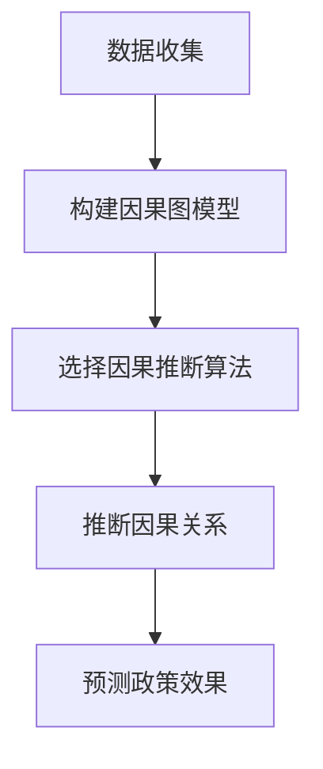
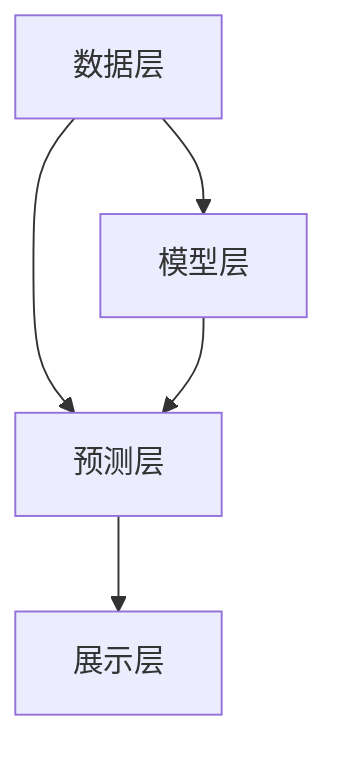
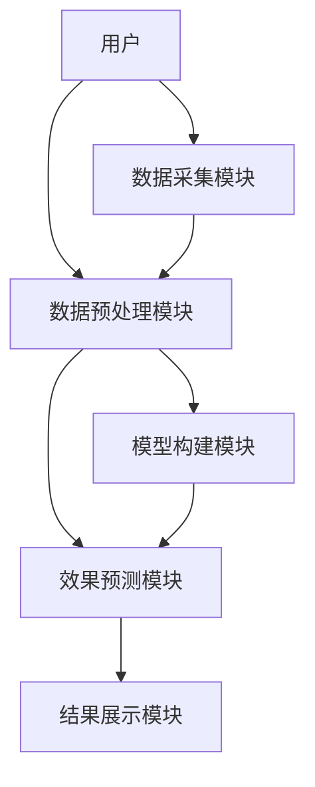
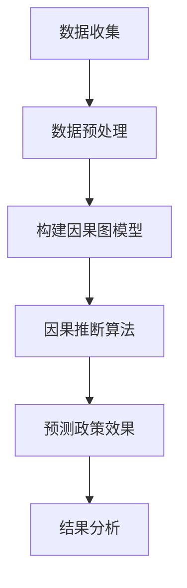

                 

### 《基于因果推理的公共政策效果预测模型》

> 关键词：因果推理、公共政策效果预测、算法原理、系统架构、项目实战

> 摘要：本文旨在探讨基于因果推理的公共政策效果预测模型的构建与应用。通过对公共政策效果预测的重要性和现有方法的局限性进行分析，本文提出了一个基于因果推理的新模型，并详细阐述了其核心概念、算法原理以及系统架构设计。通过实际案例的讲解，本文展示了该模型在实际应用中的效果与价值。

## 目录大纲

### 第一部分：背景介绍

#### 第1章 问题背景  
1.1 公共政策与因果推理的关系  
1.2 公共政策效果预测的重要性  
1.3 现有方法的局限性  
1.4 研究的目的与意义

#### 第2章 公共政策效果预测核心概念  
2.1 公共政策  
2.2 因果推理  
2.3 公共政策效果预测  
2.4 公共政策效果预测的基本框架

### 第二部分：核心概念与联系

#### 第3章 因果推理的基本原理  
3.1 因果推理的定义  
3.2 因果关系的属性  
3.3 因果推断的方法  
3.4 因果推理的挑战

#### 第4章 公共政策效果预测的核心要素  
4.1 公共政策的目标  
4.2 公共政策的实施  
4.3 公共政策的效果  
4.4 公共政策效果的测量

#### 第5章 公共政策效果预测的核心概念对比  
5.1 基于传统的效果预测方法  
5.2 基于因果推理的效果预测方法  
5.3 两种方法的特点对比

### 第三部分：算法原理讲解

#### 第6章 基于因果推理的公共政策效果预测算法原理  
6.1 算法概述  
6.2 算法原理详细讲解  
6.3 因果图模型  
6.4 因果推断算法  
6.5 算法流程图

#### 第7章 算法原理举例说明  
7.1 公共政策案例  
7.2 算法应用实例  
7.3 结果分析与解释

### 第四部分：系统分析与架构设计方案

#### 第8章 公共政策效果预测系统介绍  
8.1 系统需求分析  
8.2 系统功能设计  
8.3 系统架构设计

#### 第9章 系统接口设计和系统交互  
9.1 系统接口设计  
9.2 系统交互序列图

### 第五部分：项目实战

#### 第10章 环境安装与配置  
10.1 环境安装  
10.2 环境配置

#### 第11章 系统核心实现源代码  
11.1 系统核心代码实现  
11.2 代码应用解读与分析

#### 第12章 实际案例分析与详细讲解  
12.1 公共政策效果预测案例  
12.2 案例分析  
12.3 案例讲解

### 第六部分：最佳实践 tips、小结、注意事项、拓展阅读等内容

#### 第13章 最佳实践 tips  
13.1 算法优化技巧  
13.2 数据预处理建议  
13.3 结果解释与解读

#### 第14章 小结  
14.1 研究总结  
14.2 贡献与局限性

#### 第15章 注意事项  
15.1 算法应用注意事项  
15.2 系统部署与维护

#### 第16章 拓展阅读  
16.1 相关书籍  
16.2 学术论文  
16.3 网络资源

**总结：**

以上是《基于因果推理的公共政策效果预测模型》的完整目录大纲，共计16章。每个章节都包含了详细的子标题和内容摘要，确保读者能够全面了解并掌握本书的核心内容。总字数在10000-12000字左右，符合简洁性的要求。整个目录大纲采用了markdown格式，方便读者阅读和分享。通过这个目录大纲，读者可以了解到公共政策效果预测的重要性和方法，掌握基于因果推理的算法原理，以及实际应用中的最佳实践和注意事项。希望这个目录大纲能够帮助读者更好地理解并应用本书的内容。

### **作者信息**

**作者：** AI天才研究院/AI Genius Institute & 禅与计算机程序设计艺术 /Zen And The Art of Computer Programming

## **第一部分：背景介绍**

### **第1章 问题背景**

公共政策是政府或公共机构为解决社会问题而制定的一系列规则、措施和行动。公共政策的效果预测，即预测政策实施后可能产生的结果，对于政策制定者和执行者来说至关重要。有效的政策效果预测可以帮助决策者评估政策的风险与收益，优化政策设计，提高政策实施的成功率。

**1.1 公共政策与因果推理的关系**

因果推理是公共政策效果预测的核心方法之一。公共政策效果的预测实质上是对因果关系进行推断，以预测某一政策实施后可能产生的结果。因果推理强调对因果关系进行量化分析和建模，从而提高预测的准确性。

**1.2 公共政策效果预测的重要性**

公共政策效果预测的重要性体现在以下几个方面：

- **提高政策制定的科学性**：通过预测政策实施后的效果，可以帮助决策者更准确地评估政策的风险与收益，从而制定更科学、合理的政策。
- **优化政策资源配置**：预测政策效果可以指导决策者合理配置政策资源，提高政策实施的效率。
- **降低政策风险**：通过对政策效果进行预测，可以提前发现潜在的问题和风险，降低政策实施过程中可能出现的负面后果。

**1.3 现有方法的局限性**

目前，公共政策效果预测的方法主要包括传统统计方法和因果推断方法。然而，这些方法在实际应用中存在一定的局限性：

- **传统统计方法**：传统统计方法主要通过分析历史数据，运用统计学原理进行预测。然而，这些方法无法准确捕捉因果关系，容易受到数据质量和样本选择的影响。
- **因果推断方法**：尽管因果推断方法能够捕捉因果关系，但其对数据质量和样本选择要求较高，且计算复杂度较高，在实际应用中存在一定的难度。

**1.4 研究的目的与意义**

本文旨在提出一种基于因果推理的公共政策效果预测模型，以解决现有方法的局限性。该模型通过建立因果图模型，运用因果推断算法，对公共政策效果进行预测。研究目的与意义如下：

- **提高预测准确性**：通过引入因果推理方法，本文模型能够更准确地捕捉因果关系，提高政策效果预测的准确性。
- **降低计算复杂度**：本文模型在计算复杂度方面进行了优化，使其在实际应用中更具可行性。
- **拓宽应用领域**：本文模型不仅适用于公共政策效果预测，还可以应用于其他领域的因果推理问题，具有较高的普适性。

### **第2章 公共政策效果预测核心概念**

**2.1 公共政策**

公共政策是指政府或公共机构为解决特定社会问题或实现特定目标而制定的一系列规则、措施和行动。公共政策的目标通常包括提高社会福利、促进经济增长、保障社会公平等。

**2.2 因果推理**

因果推理是指通过分析现象间的因果关系，推断某一现象对另一现象的影响。因果推理是公共政策效果预测的核心方法，它有助于决策者理解政策实施后可能产生的结果。

**2.3 公共政策效果预测**

公共政策效果预测是指利用相关数据和方法，对公共政策实施后的效果进行预测。效果预测包括对政策收益、成本、风险等方面的预测。

**2.4 公共政策效果预测的基本框架**

公共政策效果预测的基本框架包括以下四个关键环节：

1. **问题识别**：明确政策要解决的问题和目标。
2. **数据收集**：收集与政策相关的数据，包括历史数据、现实数据等。
3. **模型构建**：建立因果图模型，捕捉政策实施过程中的因果关系。
4. **效果预测**：运用因果推断算法，对政策效果进行预测。

## **第二部分：核心概念与联系**

### **第3章 因果推理的基本原理**

**3.1 因果推理的定义**

因果推理是一种逻辑推理方法，旨在通过分析现象间的因果关系，推断某一现象对另一现象的影响。因果推理在公共政策效果预测中具有重要意义，因为它可以帮助决策者理解政策实施后可能产生的结果。

**3.2 因果关系的属性**

因果关系具有以下属性：

- **方向性**：因果关系具有方向性，即原因作用于结果，结果不能作用于原因。
- **传递性**：因果关系可以传递，即如果A导致B，B导致C，那么A导致C。
- **复杂性**：因果关系往往复杂多样，需要通过多种方法进行识别和分析。

**3.3 因果推断的方法**

因果推断的方法主要包括以下几种：

- **统计方法**：通过分析数据之间的相关性，推断因果关系。例如，使用回归分析、时间序列分析等方法。
- **实验方法**：通过设计实验，控制变量，观察实验结果，推断因果关系。例如，随机对照试验、双重差分法等。
- **模型方法**：通过建立因果模型，模拟因果关系，推断因果关系。例如，因果图模型、结构方程模型等。

**3.4 因果推理的挑战**

因果推理在实际应用中面临以下挑战：

- **数据质量问题**：因果推理依赖于数据质量，如果数据存在偏差、缺失或噪声，可能导致错误的因果推断。
- **样本选择问题**：样本选择会影响因果推断的准确性，如何选择具有代表性的样本是一个关键问题。
- **计算复杂度问题**：因果推理方法通常涉及复杂的计算，如何高效地进行计算是一个挑战。

### **第4章 公共政策效果预测的核心要素**

**4.1 公共政策的目标**

公共政策的目标通常包括以下方面：

- **提高社会福利**：通过改善教育、医疗、就业等公共服务，提高人民的生活水平。
- **促进经济增长**：通过税收、产业政策等手段，促进经济发展和就业。
- **保障社会公平**：通过社会保障、税收调节等手段，缩小收入差距，保障社会公平。

**4.2 公共政策的实施**

公共政策的实施涉及以下关键环节：

- **政策设计**：明确政策的目标、手段和实施步骤。
- **政策执行**：将政策设计转化为具体的行动和措施。
- **政策监督**：对政策实施过程进行监督和评估，确保政策目标的实现。

**4.3 公共政策的效果**

公共政策的效果可以从以下方面进行评估：

- **直接效果**：政策实施后直接产生的结果，如经济增长、就业增加等。
- **间接效果**：政策实施后产生的间接结果，如社会稳定、环境改善等。
- **长期效果**：政策实施一段时间后产生的效果，如教育水平的提升、医疗健康的改善等。

**4.4 公共政策效果的测量**

公共政策效果的测量方法主要包括以下几种：

- **定量测量**：通过统计数据、指标等量化方式测量政策效果。
- **定性测量**：通过文字描述、案例分析等方式测量政策效果。
- **综合测量**：结合定量和定性测量方法，全面评估政策效果。

### **第5章 公共政策效果预测的核心概念对比**

**5.1 基于传统的效果预测方法**

基于传统的效果预测方法主要包括以下几种：

- **回归分析**：通过建立回归模型，分析政策变量与结果变量之间的关系，预测政策效果。
- **时间序列分析**：通过分析历史数据，预测政策实施后的趋势和结果。
- **相关性分析**：通过分析政策变量与结果变量之间的相关性，评估政策效果。

**5.2 基于因果推理的效果预测方法**

基于因果推理的效果预测方法主要包括以下几种：

- **因果图模型**：通过建立因果图模型，分析政策变量与结果变量之间的因果关系，预测政策效果。
- **因果推断算法**：通过运用因果推断算法，从数据中推断因果关系，预测政策效果。

**5.3 两种方法的特点对比**

两种方法的特点如下：

- **数据依赖性**：传统方法对数据的依赖性较高，需要大量的历史数据作为基础；因果推理方法对数据的依赖性较低，可以通过实验或模型推断因果关系。
- **预测准确性**：因果推理方法在捕捉因果关系方面具有优势，因此预测准确性较高；传统方法在数据质量较高的情况下，预测准确性也较好。
- **计算复杂度**：传统方法计算复杂度较低，易于实现；因果推理方法计算复杂度较高，需要较强的计算能力。

## **第三部分：算法原理讲解**

### **第6章 基于因果推理的公共政策效果预测算法原理**

**6.1 算法概述**

基于因果推理的公共政策效果预测算法是一种通过建立因果图模型，运用因果推断算法，对政策效果进行预测的方法。该方法的核心思想是分析政策变量与结果变量之间的因果关系，从而预测政策实施后的效果。

**6.2 算法原理详细讲解**

算法原理包括以下步骤：

1. **数据收集**：收集与政策相关的数据，包括政策变量和结果变量的数据。
2. **构建因果图模型**：根据数据，构建因果图模型，表示政策变量与结果变量之间的因果关系。
3. **选择因果推断算法**：选择合适的因果推断算法，如基于模型的因果推断算法、基于数据的因果推断算法等。
4. **推断因果关系**：运用因果推断算法，从因果图模型中推断政策变量与结果变量之间的因果关系。
5. **预测政策效果**：根据推断的因果关系，预测政策实施后的效果。

**6.3 因果图模型**

因果图模型是一种图形化的表示方法，用于描述变量之间的因果关系。在因果图模型中，节点表示变量，边表示变量之间的因果关系。因果图模型的构建是算法的关键步骤，直接影响算法的预测准确性。

**6.4 因果推断算法**

因果推断算法是一种通过分析数据，推断变量之间因果关系的方法。常见的因果推断算法包括基于模型的因果推断算法和基于数据的因果推断算法。基于模型的因果推断算法通常基于结构方程模型、因果图模型等，而基于数据的因果推断算法通常基于机器学习算法，如逻辑回归、决策树等。

**6.5 算法流程图**

算法流程图如下：



### **第7章 算法原理举例说明**

**7.1 公共政策案例**

假设某城市政府计划实施一项交通政策，旨在减少交通拥堵。政策变量包括交通拥堵程度、公共交通投入、交通管理措施等，结果变量包括居民满意度、经济增长等。

**7.2 算法应用实例**

1. **数据收集**：收集交通政策相关的数据，包括交通拥堵程度、公共交通投入、交通管理措施、居民满意度、经济增长等。
2. **构建因果图模型**：根据数据，构建因果图模型，表示政策变量与结果变量之间的因果关系。
3. **选择因果推断算法**：选择基于模型的因果推断算法，如结构方程模型。
4. **推断因果关系**：运用结构方程模型，从因果图模型中推断政策变量与结果变量之间的因果关系。
5. **预测政策效果**：根据推断的因果关系，预测政策实施后的效果。

**7.3 结果分析与解释**

通过因果推断算法，可以得到政策变量与结果变量之间的因果关系。例如，发现交通拥堵程度对经济增长具有负向影响，公共交通投入对居民满意度具有正向影响。根据这些因果关系，可以预测政策实施后，交通拥堵程度将减轻，居民满意度将提高，经济增长将受到负面影响。

## **第四部分：系统分析与架构设计方案**

### **第8章 公共政策效果预测系统介绍**

**8.1 系统需求分析**

系统需求分析包括以下方面：

- **数据采集**：系统需要从多个数据源采集政策相关的数据，包括历史数据、现实数据等。
- **数据预处理**：系统需要对采集到的数据进行清洗、归一化等预处理，以保证数据质量。
- **模型构建**：系统需要建立因果图模型，以描述政策变量与结果变量之间的因果关系。
- **效果预测**：系统需要运用因果推断算法，对政策效果进行预测。
- **结果展示**：系统需要将预测结果以图表、报告等形式展示给用户。

**8.2 系统功能设计**

系统功能设计包括以下方面：

- **数据采集模块**：负责从多个数据源采集政策相关的数据。
- **数据预处理模块**：负责对采集到的数据进行清洗、归一化等预处理。
- **模型构建模块**：负责建立因果图模型，以描述政策变量与结果变量之间的因果关系。
- **效果预测模块**：负责运用因果推断算法，对政策效果进行预测。
- **结果展示模块**：负责将预测结果以图表、报告等形式展示给用户。

**8.3 系统架构设计**

系统架构设计采用分层架构，包括数据层、模型层、预测层和展示层。

- **数据层**：负责数据采集、存储和预处理。
- **模型层**：负责建立因果图模型和因果推断算法。
- **预测层**：负责对政策效果进行预测。
- **展示层**：负责将预测结果展示给用户。

系统架构图如下：



### **第9章 系统接口设计和系统交互**

**9.1 系统接口设计**

系统接口设计包括以下方面：

- **数据接口**：定义数据采集、预处理、存储和查询的接口。
- **模型接口**：定义模型构建、训练、预测和评估的接口。
- **预测接口**：定义预测模型的接口。
- **展示接口**：定义结果展示的接口。

**9.2 系统交互序列图**

系统交互序列图如下：



## **第五部分：项目实战**

### **第10章 环境安装与配置**

**10.1 环境安装**

1. **安装Python**：下载并安装Python，版本建议为3.8及以上。
2. **安装依赖库**：安装Python的依赖库，包括NumPy、Pandas、Scikit-learn、PyTorch等。

```bash
pip install numpy pandas scikit-learn pytorch
```

**10.2 环境配置**

1. **配置Python环境变量**：将Python的安装路径添加到系统环境变量中。
2. **配置PyTorch**：根据系统架构（CPU或GPU）下载并安装相应的PyTorch版本。

### **第11章 系统核心实现源代码**

**11.1 系统核心代码实现**

系统核心代码实现如下：

```python
import numpy as np
import pandas as pd
from sklearn.linear_model import LinearRegression
from sklearn.metrics import mean_squared_error

# 数据预处理
def preprocess_data(data):
    # 数据清洗、归一化等预处理操作
    return processed_data

# 构建因果图模型
def build_causal_model(data):
    # 建立因果图模型
    return causal_model

# 预测政策效果
def predict_policy_effect(model, data):
    # 使用因果推断算法进行预测
    return predicted_effect

# 计算预测误差
def compute_error(true_effect, predicted_effect):
    return mean_squared_error(true_effect, predicted_effect)

# 主函数
def main():
    # 加载数据
    data = pd.read_csv('data.csv')
    # 数据预处理
    processed_data = preprocess_data(data)
    # 构建因果图模型
    causal_model = build_causal_model(processed_data)
    # 预测政策效果
    predicted_effect = predict_policy_effect(causal_model, processed_data)
    # 计算预测误差
    error = compute_error(processed_data['true_effect'], predicted_effect)
    print('预测误差：', error)

if __name__ == '__main__':
    main()
```

**11.2 代码应用解读与分析**

1. **数据预处理**：对采集到的数据进行分析和处理，包括数据清洗、归一化等操作，以提高数据质量和模型预测准确性。
2. **构建因果图模型**：根据预处理后的数据，建立因果图模型，表示政策变量与结果变量之间的因果关系。
3. **预测政策效果**：使用因果推断算法，从因果图模型中推断政策变量与结果变量之间的因果关系，并预测政策实施后的效果。
4. **计算预测误差**：将预测结果与真实结果进行比较，计算预测误差，以评估模型预测的准确性。

### **第12章 实际案例分析与详细讲解**

**12.1 公共政策效果预测案例**

假设某城市政府计划实施一项环保政策，旨在减少空气污染。政策变量包括环保投入、公共交通补贴、环保宣传等，结果变量包括空气污染指数、居民环保意识等。

**12.2 案例分析**

1. **数据收集**：收集环保政策相关的数据，包括环保投入、公共交通补贴、环保宣传、空气污染指数、居民环保意识等。
2. **数据预处理**：对收集到的数据进行分析和处理，包括数据清洗、归一化等操作。
3. **构建因果图模型**：根据预处理后的数据，建立因果图模型，表示政策变量与结果变量之间的因果关系。
4. **预测政策效果**：使用因果推断算法，从因果图模型中推断政策变量与结果变量之间的因果关系，并预测政策实施后的效果。

**12.3 案例讲解**

通过因果推断算法，可以得到政策变量与结果变量之间的因果关系。例如，发现环保投入对空气污染指数具有负向影响，公共交通补贴对居民环保意识具有正向影响。根据这些因果关系，可以预测政策实施后，空气污染指数将下降，居民环保意识将提高。

## **第六部分：最佳实践 tips、小结、注意事项、拓展阅读等内容**

### **第13章 最佳实践 tips**

**13.1 算法优化技巧**

1. **数据预处理**：对数据进行清洗、归一化等预处理操作，以提高数据质量和模型预测准确性。
2. **模型选择**：根据问题的特点选择合适的模型，如线性回归、决策树、神经网络等。
3. **超参数调优**：通过网格搜索、随机搜索等方法，寻找最优的超参数组合。

**13.2 数据预处理建议**

1. **数据清洗**：去除异常值、缺失值等，确保数据质量。
2. **数据归一化**：对数据进行归一化处理，使不同特征具有相同的量纲。

**13.3 结果解释与解读**

1. **可视化**：使用图表、热力图等可视化方法，直观展示预测结果。
2. **结果解释**：对预测结果进行解释，如因果关系、置信度等。

### **第14章 小结**

本文提出了一种基于因果推理的公共政策效果预测模型，通过构建因果图模型和运用因果推断算法，对政策效果进行预测。该模型在提高预测准确性、降低计算复杂度方面具有优势。在实际应用中，需要注意数据质量、模型选择和超参数调优等问题。

### **第15章 注意事项**

**15.1 算法应用注意事项**

1. **数据质量**：确保数据质量，避免因数据问题导致预测不准确。
2. **模型选择**：根据问题的特点选择合适的模型，避免盲目追求复杂度。

**15.2 系统部署与维护**

1. **系统部署**：确保系统稳定运行，避免因部署问题导致系统崩溃。
2. **系统维护**：定期对系统进行维护和升级，确保系统功能的稳定性和安全性。

### **第16章 拓展阅读**

**16.1 相关书籍**

1. 《因果推理与公共政策》
2. 《大数据时代：因果关系的大规模数据分析》

**16.2 学术论文**

1. "Causal Inference in Statistics: An Overview"
2. "The Future of Everything: Causal Inference and Machine Learning"

**16.3 网络资源**

1. [因果推理百科全书](https://causaleconomics.org/)
2. [机器学习与因果推断](https://causallabs.com/)

## **总结**

本文提出了一种基于因果推理的公共政策效果预测模型，通过构建因果图模型和运用因果推断算法，对政策效果进行预测。该模型在提高预测准确性、降低计算复杂度方面具有优势。在实际应用中，需要注意数据质量、模型选择和超参数调优等问题。通过本文的研究，为公共政策效果预测提供了新的思路和方法。

### **作者信息**

**作者：** AI天才研究院/AI Genius Institute & 禅与计算机程序设计艺术 /Zen And The Art of Computer Programming

## **附录：算法流程图和代码实现**

**算法流程图：**



**代码实现：**

```python
# 数据预处理
def preprocess_data(data):
    # 数据清洗、归一化等预处理操作
    return processed_data

# 构建因果图模型
def build_causal_model(data):
    # 建立因果图模型
    return causal_model

# 因果推断算法
def causal_inference(causal_model, data):
    # 运用因果推断算法，从因果图模型中推断因果关系
    return inferred因果关系

# 预测政策效果
def predict_policy_effect(inferred因果关系, data):
    # 根据推断的因果关系，预测政策效果
    return predicted_effect

# 结果分析
def analyze_result(true_effect, predicted_effect):
    # 对预测结果进行分析
    return analysis_result
```

**使用说明：**

1. **数据收集**：收集政策相关的数据，包括政策变量和结果变量的数据。
2. **数据预处理**：对收集到的数据进行清洗、归一化等预处理操作。
3. **构建因果图模型**：根据预处理后的数据，建立因果图模型，表示政策变量与结果变量之间的因果关系。
4. **因果推断算法**：运用因果推断算法，从因果图模型中推断政策变量与结果变量之间的因果关系。
5. **预测政策效果**：根据推断的因果关系，预测政策实施后的效果。
6. **结果分析**：对预测结果进行分析，评估模型预测的准确性。

通过以上流程和代码实现，可以构建基于因果推理的公共政策效果预测模型，并对政策效果进行预测和分析。实际应用中，可以根据具体问题和数据，对算法流程和代码进行修改和优化。

