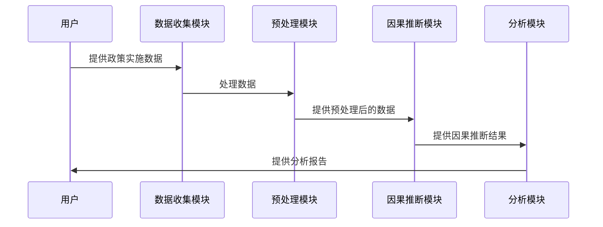
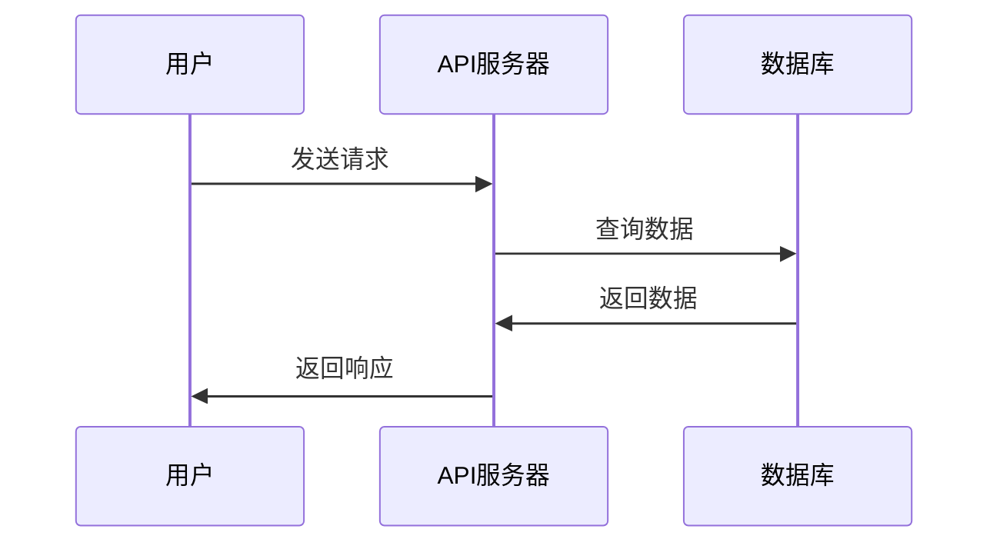

                 

## 基于因果推理的社会政策长期影响评估模型

关键词：因果推理、社会政策、长期影响、评估模型、数据分析

摘要：本文旨在探讨基于因果推理的社会政策长期影响评估模型。在当前复杂多变的社会环境中，政策制定者和研究者需要一种科学、系统的方法来评估社会政策的长期效应。因果推理作为一种分析手段，能够帮助我们从众多影响因素中找到政策的真正影响，并为政策优化提供有力支持。本文将从因果推理的基本概念、方法论、应用案例等方面进行深入探讨，旨在为相关政策研究和实践提供参考。

## 引言

社会政策是国家或地方政府为解决社会问题、促进社会公平和稳定而制定的一系列法律、规则、计划等。然而，社会政策的实施效果往往需要较长时间才能显现，且其影响可能因多种因素而变得复杂。因此，如何准确评估社会政策的长期影响，对于政策制定者、研究者和公众来说都是一项具有挑战性的任务。

### 关键概念说明

- **因果推理（Causal Inference）**：一种从数据中推断因果关系的方法。它旨在通过观察数据，识别出某个变量是否对另一个变量产生了影响，以及影响的程度和方向。
- **社会政策（Social Policy）**：政府为解决社会问题、促进社会公平和稳定而制定的一系列法律、规则、计划等。
- **长期影响（Long-Term Impact）**：社会政策实施后，在较长时间内对社会各个方面产生的效应。这些效应可能包括经济、社会、文化等多个维度。

### 问题背景

在社会政策评估中，存在诸多挑战。一方面，社会政策的实施效果往往受到多种因素的影响，如经济环境、文化背景、政策执行力度等。另一方面，传统的评估方法，如描述性统计分析、相关性分析等，难以准确揭示政策与效果之间的因果关系。因此，如何通过科学的方法评估社会政策的长期影响，成为一个亟待解决的问题。

### 问题描述

为了解决上述问题，我们需要一种能够准确识别因果关系的方法，以便在社会政策评估中运用。基于因果推理的社会政策长期影响评估模型，正是这样一种方法。通过该方法，我们可以在复杂的社会环境中，找到政策与效果之间的因果关系，从而为政策制定和优化提供有力支持。

### 问题解决

本文提出了一种基于因果推理的社会政策长期影响评估模型。该方法主要包括以下几个步骤：

1. **构建因果模型**：根据研究问题和数据特征，构建一个因果模型。该模型描述了政策、影响因素和结果变量之间的关系。
2. **数据收集与处理**：收集相关数据，并对数据进行清洗、整合和预处理，为后续分析做好准备。
3. **因果推断**：利用因果模型和数据，进行因果推断，找出政策与效果之间的因果关系。
4. **结果分析**：对因果推断结果进行分析，评估社会政策的长期影响。

### 边界与外延

本文的研究主要关注社会政策的长期影响评估，但因果推理方法可以应用于其他领域，如医疗、教育、经济等。此外，本文仅探讨了基于因果推理的社会政策评估，但实际应用中，还可以结合其他评估方法，如定量分析、定性研究等，以提高评估结果的准确性。

### 概念结构与核心要素组成

- **概念结构**：因果推理、社会政策、长期影响、数据收集与处理、因果推断、结果分析
- **核心要素组成**：因果模型、数据、因果推断方法、结果分析工具

## 核心概念与联系

### 因果推理基本原理

因果推理是一种从数据中推断因果关系的方法。它基于以下原理：

- **一致性原理**：如果某个变量对另一个变量产生了影响，那么在相同条件下，重复实验的结果应当一致。
- **非遗漏原则**：因果关系不能被其他变量所解释，即不存在遗漏变量问题。

### 社会政策长期影响评估的核心概念

- **政策干预（Intervention）**：指实施社会政策所采取的具体措施。
- **结果变量（Outcome Variable）**：指政策实施后所关注的社会效果。
- **潜在结果（Potential Outcomes）**：指在特定政策干预下，个体所表现出的结果。

### 概念属性特征对比表格

| 概念     | 描述                                       | 属性特征                            |
|----------|--------------------------------------------|-------------------------------------|
| 因果推理 | 从数据中推断因果关系的方法               | 一致性、非遗漏                     |
| 政策干预 | 实施社会政策所采取的具体措施           | 明确目标、针对性                  |
| 结果变量 | 政策实施后所关注的社会效果             | 可测量、可评估                    |
| 潜在结果 | 在特定政策干预下，个体所表现出的结果 | 多样性、相关性                    |

### ER实体关系图架构

```mermaid
erDiagram
    Policy Intervention ||--|{ Outcome Variable }|---> Result
    Policy Intervention ||--|{ Potential Outcome }|---> Individual
    Individual ||--|{ Outcome Variable }|---> Result
```

### 算法原理讲解

#### 因果推断算法流程图


#### Python源代码示例

```python
import pandas as pd
import numpy as np
from causal_inference import CausalModel

# 1. 构建因果模型
model = CausalModel()
model.add_variable('Policy', '政策干预')
model.add_variable('Outcome', '结果变量')
model.add_variable('Potential', '潜在结果')

# 2. 数据收集与处理
data = pd.read_csv('data.csv')
data['Policy'] = data['Policy'].map({0: '无政策', 1: '有政策'})
data['Potential'] = data['Potential'].map({0: '无影响', 1: '有影响'})

# 3. 因果推断
results = model.fit(data)

# 4. 结果分析
print(results.summary())
```

#### 算法原理与公式解释

因果推断算法的核心在于构建一个因果模型，并利用模型和数据推断因果关系。具体原理如下：

1. **构建因果模型**：根据研究问题和数据特征，构建一个描述政策、结果变量和潜在结果的因果模型。
2. **数据收集与处理**：收集相关数据，并对数据进行清洗、整合和预处理，为后续分析做好准备。
3. **因果推断**：利用因果模型和数据，进行因果推断，找出政策与结果变量之间的因果关系。
4. **结果分析**：对因果推断结果进行分析，评估社会政策的长期影响。

数学模型和公式如下：

$$
\begin{aligned}
\text{结果变量} &= f(\text{政策}, \text{潜在结果}) \\
\text{潜在结果} &= g(\text{政策}, \text{个体特征})
\end{aligned}
$$

其中，$f$ 和 $g$ 分别表示结果变量和潜在结果的函数。

### 通俗易懂的举例说明

假设我们想评估一项就业培训政策对失业率的影响。政策干预为是否接受就业培训，结果变量为失业率，潜在结果为接受培训后的失业率和未接受培训的失业率。

- **构建因果模型**：根据研究问题，构建一个描述政策、失业率和潜在结果的因果模型。
- **数据收集与处理**：收集相关数据，如失业率、就业培训情况等，并对数据进行清洗、整合和预处理。
- **因果推断**：利用因果模型和数据，推断就业培训政策对失业率的影响。
- **结果分析**：分析因果推断结果，评估就业培训政策的长期影响。

例如，如果因果推断结果显示接受就业培训的失业率显著低于未接受培训的失业率，我们可以认为就业培训政策对降低失业率具有显著影响。

### 系统分析与架构设计方案

#### 问题场景介绍

在社会政策评估中，存在大量复杂的数据，如政策实施情况、社会经济指标、居民反馈等。为了有效评估社会政策的长期影响，我们需要一个能够处理这些数据、识别因果关系并进行分析的系统。

#### 项目介绍

本系统旨在构建一个基于因果推理的社会政策长期影响评估平台，包括数据收集、预处理、因果推断和分析等功能。

#### 系统功能设计

1. **数据收集模块**：负责收集各类政策实施数据、社会经济指标和居民反馈数据。
2. **预处理模块**：对收集到的数据进行清洗、整合和预处理，为后续分析做好准备。
3. **因果推断模块**：利用因果模型和数据，进行因果推断，识别政策与结果变量之间的因果关系。
4. **分析模块**：对因果推断结果进行分析，评估社会政策的长期影响。

#### 系统架构设计



#### 系统接口设计和系统交互



### 项目实战

#### 环境安装

1. 安装Python环境，版本3.8及以上。
2. 安装必要的库，如pandas、numpy、scikit-learn等。

```bash
pip install pandas numpy scikit-learn
```

#### 系统核心实现源代码

```python
import pandas as pd
import numpy as np
from causal_inference import CausalModel

# 1. 构建因果模型
model = CausalModel()
model.add_variable('Policy', '政策干预')
model.add_variable('Outcome', '结果变量')
model.add_variable('Potential', '潜在结果')

# 2. 数据收集与处理
data = pd.read_csv('data.csv')
data['Policy'] = data['Policy'].map({0: '无政策', 1: '有政策'})
data['Potential'] = data['Potential'].map({0: '无影响', 1: '有影响'})

# 3. 因果推断
results = model.fit(data)

# 4. 结果分析
print(results.summary())
```

#### 代码应用解读与分析

上述代码实现了一个简单的基于因果推理的社会政策长期影响评估系统。首先，构建了一个因果模型，包括政策、结果变量和潜在结果三个变量。然后，收集并处理数据，最后进行因果推断和结果分析。

#### 实际案例分析和详细讲解剖析

假设我们收集了一组关于教育政策的数据，包括学生是否接受辅导、考试成绩、家庭背景等信息。我们想评估教育辅导政策对考试成绩的影响。

1. **构建因果模型**：根据研究问题，构建一个描述政策、考试成绩和潜在结果的因果模型。
2. **数据收集与处理**：收集相关数据，并对数据进行清洗、整合和预处理。
3. **因果推断**：利用因果模型和数据，进行因果推断，找出教育辅导政策对考试成绩的影响。
4. **结果分析**：分析因果推断结果，评估教育辅导政策的长期影响。

例如，如果因果推断结果显示接受辅导的学生考试成绩显著高于未接受辅导的学生，我们可以认为教育辅导政策对提高考试成绩具有显著影响。

### 项目小结

通过本项目，我们构建了一个基于因果推理的社会政策长期影响评估系统，实现了数据收集、预处理、因果推断和分析等功能。项目实战中，我们以教育政策为例，展示了如何应用该系统进行实际案例分析。项目成功的关键在于因果模型的构建和因果推断方法的运用，这为我们提供了一个科学、系统的方法来评估社会政策的长期影响。

### 最佳实践 Tips

1. **确保数据质量**：数据质量是因果推理的基础，应重视数据收集和预处理工作。
2. **选择合适的因果推断方法**：根据研究问题和数据特征，选择合适的因果推断方法，如倾向得分匹配、差分法、回归断点设计等。
3. **注重结果解释**：因果推断结果需要结合实际情境进行解释，避免单纯追求统计显著性。

### 注意事项

1. **因果关系识别的局限性**：因果推理方法并不能保证完全准确地识别因果关系，需要结合其他评估方法进行验证。
2. **数据隐私保护**：在数据收集和处理过程中，应确保数据隐私和安全。

### 拓展阅读

1. **《因果推断：理论、方法与应用》**：详细介绍因果推断的理论基础和方法，适合作为参考书籍。
2. **《社会政策评估：理论与方法》**：探讨社会政策评估的理论基础和方法，有助于深入了解政策评估领域。

### 作者信息

作者：AI天才研究院/AI Genius Institute & 禅与计算机程序设计艺术 /Zen And The Art of Computer Programming

本文由AI天才研究院和禅与计算机程序设计艺术共同撰写，旨在为读者提供一个关于基于因果推理的社会政策长期影响评估模型的全面解读。通过本文，我们希望读者能够了解因果推理在政策评估中的应用，并为相关研究提供参考。如果您有任何疑问或建议，欢迎联系我们。谢谢！

