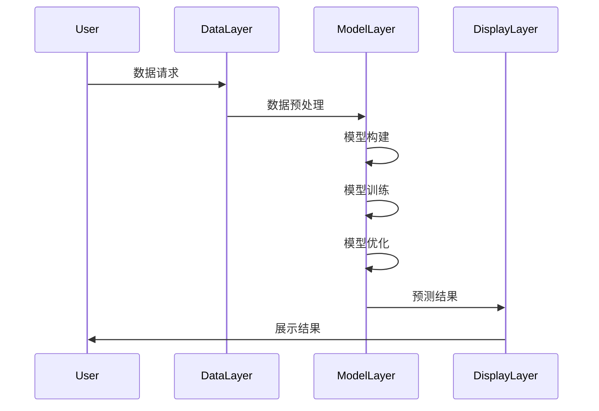
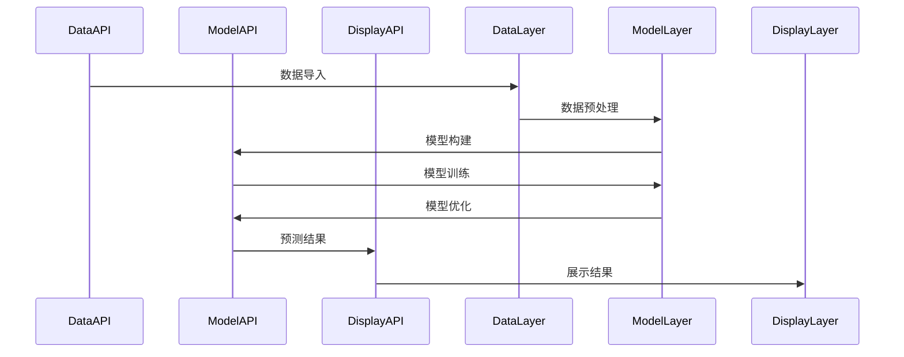
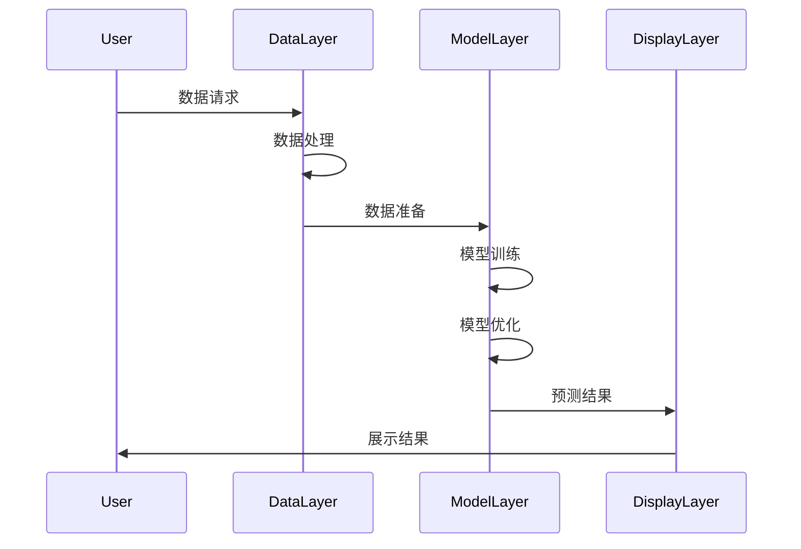

                 

# 基于图卷积的动态市场趋势多因子推理模型优化

## 关键词

- 动态市场趋势
- 多因子推理模型
- 图卷积网络（GCN）
- 数据预处理
- 模型优化策略
- 性能评估

## 摘要

本文探讨了基于图卷积网络（GCN）的动态市场趋势多因子推理模型的优化问题。首先，介绍了动态市场趋势、多因子推理模型和图卷积网络的基本概念及其相互关系。随后，详细阐述了数据预处理、模型架构设计、模型优化策略和性能评估等关键环节。通过具体的算法原理讲解、系统分析与架构设计方案、项目实战和最佳实践，本文旨在为金融数据处理领域提供一套实用的优化方案，提高动态市场趋势预测的准确性和稳定性。

---

## 第一部分：背景介绍与核心概念

### 第1章：问题背景与核心概念

### 1.1.1 问题背景

随着全球金融市场的高度复杂化和信息流量的迅猛增长，传统的静态模型已经难以满足对市场动态趋势的精确预测。特别是在面对海量多维度数据的情况下，如何有效地进行特征提取和关系建模成为关键挑战。为此，本文旨在研究如何利用图卷积网络（GCN）等先进算法对动态市场趋势多因子推理模型进行优化，以提高预测精度和模型稳定性。

### 1.1.2 核心概念

#### 动态市场趋势

动态市场趋势指市场在某一特定时间内的价格波动和趋势。它受到多种因素影响，如宏观经济指标、技术指标、公司基本面等。动态市场趋势的分析对于投资决策具有重要意义。

#### 多因子推理模型

多因子推理模型是一种结合多种市场因子进行市场预测的方法。它通过量化分析各种市场因子，利用机器学习算法建立预测模型，以预测市场趋势。

#### 图卷积网络（GCN）

图卷积网络（GCN）是一种在图结构上进行卷积操作的神经网络。它适用于处理图数据的特征提取和关系建模，特别适合于处理复杂的关系数据。

### 1.1.3 问题解决与边界外延

本文将从以下几个方面对动态市场趋势多因子推理模型进行优化：

1. **数据预处理**：对原始市场数据进行清洗、归一化和特征提取。
2. **模型架构设计**：基于GCN设计适用于动态市场趋势预测的模型架构。
3. **模型优化策略**：通过调整模型参数和训练策略，提高模型预测精度。
4. **性能评估与比较**：对比优化前后模型的性能，评估优化效果。

### 1.1.4 概念结构与核心要素组成

#### 概念结构

- 动态市场趋势
- 多因子推理模型
- 图卷积网络（GCN）

#### 核心要素

- 数据预处理
- 模型架构
- 模型优化
- 性能评估

### 1.1.5 本章小结

本章介绍了动态市场趋势多因子推理模型的优化问题的背景、核心概念及其解决边界，为后续章节的深入讨论奠定了基础。

---

## 第二部分：核心概念与联系

### 第2章：核心概念原理

### 2.1.1 动态市场趋势原理

动态市场趋势是指市场在某一特定时间内的价格波动和趋势。其核心原理包括：

1. **价格波动**：市场价格在一段时间内围绕某一均值上下波动，受到市场供需关系、宏观经济环境、投资者情绪等因素的影响。
2. **趋势分析**：通过分析历史价格数据，识别市场趋势（上涨、下跌、震荡等），以便进行预测。

### 2.1.2 多因子推理模型原理

多因子推理模型是一种结合多种市场因子进行市场预测的方法。其核心原理包括：

1. **市场因子**：包括宏观经济指标、技术指标、公司基本面等。这些因子通过量化分析，将不同类型的因子融合在一起。
2. **推理过程**：利用机器学习算法，对市场因子进行建模和训练，预测市场趋势。

### 2.1.3 图卷积网络（GCN）原理

图卷积网络（GCN）是一种在图结构上进行卷积操作的神经网络。其核心原理包括：

1. **图结构**：GCN处理的数据以图的形式存在，节点表示数据点，边表示节点之间的关系。
2. **卷积操作**：GCN通过卷积操作，将节点的邻接信息整合到节点的特征中，从而实现特征提取和关系建模。

### 2.1.4 概念属性特征对比表格

| 概念         | 特征                     | 说明                     |
| ------------ | ------------------------ | ------------------------ |
| 动态市场趋势 | 价格波动、趋势分析       | 描述市场在一段时间内的动态变化 |
| 多因子推理模型 | 市场因子、推理过程      | 预测市场趋势的量化模型      |
| 图卷积网络（GCN） | 图结构、卷积操作       | 处理图数据的特征提取和关系建模 |

### 2.1.5 ER实体关系图架构

```mermaid
erDiagram
  动态市场趋势 ||--|{ 多因子推理模型 }
  多因子推理模型 ||--|{ 图卷积网络（GCN）}
  动态市场趋势 ||--|{ 数据预处理 }
  数据预处理 ||--|{ 特征提取 }
  特征提取 ||--|{ 模型训练 }
  模型训练 ||--|{ 模型优化 }
  模型优化 ||--|{ 性能评估 }
```

### 2.1.6 本章小结

本章详细介绍了动态市场趋势、多因子推理模型和图卷积网络（GCN）的核心概念原理，以及它们之间的联系。通过本章的学习，读者可以理解这些概念的基本属性和相互关系。

-----

### 第三部分：算法原理讲解

在了解了动态市场趋势、多因子推理模型和图卷积网络（GCN）的基本概念后，接下来我们将深入探讨图卷积网络在动态市场趋势多因子推理模型中的应用原理。

#### 3.1. 图卷积网络（GCN）基本原理

图卷积网络（GCN）是一种在图结构上进行卷积操作的神经网络。其基本原理是将图中的节点表示为特征向量，并通过卷积操作来整合节点的邻接信息，从而更新节点的特征表示。GCN的主要组成部分包括：

1. **节点特征矩阵**：表示图中的所有节点特征。
2. **邻接矩阵**：表示节点之间的连接关系。
3. **权重矩阵**：用于卷积操作的参数。

图卷积网络的卷积操作可以分为以下几个步骤：

1. **初始化节点特征矩阵**：将节点特征初始化为随机值。
2. **计算邻接特征**：利用邻接矩阵计算每个节点的邻接特征。
3. **卷积操作**：利用权重矩阵对节点特征和邻接特征进行卷积操作，得到更新后的节点特征。
4. **聚合操作**：将节点的原始特征和卷积后的特征进行聚合，得到最终的节点特征表示。

#### 3.2. GCN在动态市场趋势多因子推理模型中的应用

在动态市场趋势多因子推理模型中，图卷积网络可以用于处理多因子数据，并提取因子之间的复杂关系。以下是一个简化的GCN应用流程：

1. **数据预处理**：将原始市场数据进行清洗、归一化，并转换为图结构。每个节点表示一个市场因子，边表示因子之间的相关性。
2. **特征提取**：利用GCN对图数据进行卷积操作，提取节点特征。这一过程可以多次迭代，以逐步提升特征表示的精度。
3. **模型训练**：将提取的节点特征输入到多因子推理模型中，利用机器学习算法进行训练，预测市场趋势。
4. **模型优化**：通过调整GCN和推理模型的参数，优化模型性能，提高预测精度。

#### 3.3. GCN的数学模型和公式

在GCN中，节点 $v_i$ 的特征更新过程可以用以下公式表示：

$$
h_v^{(t+1)} = \sigma(\theta h_v^{(t)} + \sum_{j \in \mathcal{N}(v)} \theta_{ij} h_j^{(t)})
$$

其中，$h_v^{(t)}$ 表示节点 $v$ 在第 $t$ 次迭代的特征表示，$\mathcal{N}(v)$ 表示节点 $v$ 的邻接节点集合，$\theta$ 表示权重矩阵，$\sigma$ 表示激活函数（通常使用ReLU函数）。

#### 3.4. GCN的应用举例

假设我们有一个包含三个市场因子的图结构，分别为节点 $v_1$、$v_2$ 和 $v_3$。节点之间的邻接关系如下：

- $v_1$ 和 $v_2$ 之间存在正相关关系。
- $v_2$ 和 $v_3$ 之间存在负相关关系。

在第一次迭代时，节点的特征初始化为：

$$
h_{v_1}^{(0)} = \begin{bmatrix} 0.5 \\ 0.3 \\ 0.2 \end{bmatrix}, h_{v_2}^{(0)} = \begin{bmatrix} 0.4 \\ 0.5 \\ 0.1 \end{bmatrix}, h_{v_3}^{(0)} = \begin{bmatrix} 0.6 \\ 0.1 \\ 0.3 \end{bmatrix}
$$

权重矩阵 $\theta$ 为：

$$
\theta = \begin{bmatrix} 0.2 & 0.1 & 0.1 \\ 0.1 & 0.3 & 0.1 \\ 0.1 & 0.1 & 0.3 \end{bmatrix}
$$

利用上述公式，我们可以计算第一次迭代的节点特征：

$$
h_{v_1}^{(1)} = \sigma(0.2 \cdot 0.5 + 0.1 \cdot 0.4 + 0.1 \cdot 0.6) = 0.6
$$

$$
h_{v_2}^{(1)} = \sigma(0.1 \cdot 0.5 + 0.3 \cdot 0.5 + 0.1 \cdot 0.6) = 0.6
$$

$$
h_{v_3}^{(1)} = \sigma(0.1 \cdot 0.5 + 0.1 \cdot 0.4 + 0.3 \cdot 0.6) = 0.6
$$

通过多次迭代，节点的特征表示将逐步收敛，并能够更好地捕捉因子之间的复杂关系。

### 3.5. 本章小结

本章详细介绍了图卷积网络（GCN）的基本原理及其在动态市场趋势多因子推理模型中的应用。通过具体的数学模型和实例分析，读者可以理解GCN在特征提取和关系建模方面的优势，为后续的模型优化和性能评估奠定了基础。

-----

### 第四部分：系统分析与架构设计

#### 4.1. 项目介绍

本项目旨在构建一个基于图卷积网络（GCN）的动态市场趋势多因子推理模型，实现对金融市场动态趋势的精确预测。项目的主要目标包括：

1. **数据预处理**：对原始市场数据进行清洗、归一化和特征提取，为后续模型训练提供高质量的数据。
2. **模型构建**：基于GCN设计适用于动态市场趋势预测的模型架构，实现特征提取和关系建模。
3. **模型训练与优化**：通过调整模型参数和训练策略，提高模型预测精度和稳定性。
4. **性能评估**：对比优化前后模型的性能，评估优化效果。

#### 4.2. 系统功能设计（领域模型）

为了实现上述目标，我们设计了一套完整的系统功能模块，包括数据预处理模块、模型构建模块、模型训练与优化模块以及性能评估模块。以下是一个简化的领域模型类图：

```mermaid
classDiagram
    DataPreprocessing <<interface>>
    ModelBuilding <<interface>>
    ModelTraining <<interface>>
    ModelOptimization <<interface>>
    PerformanceEvaluation <<interface>>

    DataPreprocessing --|> ModelBuilding
    ModelBuilding --|> ModelTraining
    ModelTraining --|> ModelOptimization
    ModelOptimization --|> PerformanceEvaluation
```

#### 4.3. 系统架构设计

系统架构采用分层设计，包括数据层、模型层和展示层。以下是一个简化的系统架构图：



#### 4.4. 系统接口设计

系统接口设计主要包括数据接口、模型接口和展示接口。以下是一个简化的系统接口序列图：



#### 4.5. 系统交互

系统交互主要涉及用户、数据层、模型层和展示层之间的交互。以下是一个简化的系统交互序列图：



### 4.6. 本章小结

本章详细介绍了项目的系统分析与架构设计。通过领域模型类图、系统架构图、接口设计图和交互序列图，读者可以清晰地理解项目的功能模块、系统架构和交互流程。为后续的项目实战和模型优化提供了坚实的基础。

-----

### 第五部分：项目实战

#### 5.1. 环境安装

在开始项目实战之前，我们需要安装所需的软件和环境。以下是一个简化的安装步骤：

1. **安装Python**：确保安装了Python 3.7及以上版本。
2. **安装依赖库**：使用pip安装以下依赖库：
   ```bash
   pip install numpy pandas matplotlib tensorflow sklearn
   ```
3. **配置GPU支持**：确保安装了NVIDIA GPU驱动，并使用以下命令安装GPU版本的TensorFlow：
   ```bash
   pip install tensorflow-gpu
   ```

#### 5.2. 系统核心实现

在本项目中，我们将使用Python编写核心实现代码。以下是一个简化的代码框架：

```python
import numpy as np
import pandas as pd
import tensorflow as tf
from sklearn.model_selection import train_test_split
from tensorflow.keras.models import Model
from tensorflow.keras.layers import Input, Dense, Layer

# 数据预处理
def preprocess_data(data):
    # 数据清洗、归一化等操作
    return processed_data

# 图卷积网络（GCN）的实现
class GraphConvLayer(Layer):
    # GCN层实现
    def __init__(self, output_dim, **kwargs):
        super().__init__(**kwargs)
        # 初始化权重和偏置
        self.output_dim = output_dim
        self.kernel = self.add_weight(name='kernel', shape=(input_dim, output_dim), initializer='glorot_uniform', trainable=True)
        self.bias = self.add_weight(name='bias', shape=(output_dim,), initializer='zeros', trainable=True)

    def call(self, inputs, training=None):
        # GCN的前向传播
        support = inputs
        neighbor = ...

        output = tf.matmul(support, self.kernel) + tf.matmul(neighbor, self.kernel) + self.bias
        return self.activation(output)

# 多因子推理模型
def build_model(input_dim, output_dim):
    input_ = Input(shape=(input_dim,))
    x = GraphConvLayer(output_dim)(input_)
    output = Dense(1, activation='sigmoid')(x)
    model = Model(inputs=input_, outputs=output)
    return model

# 模型训练
def train_model(model, X_train, y_train, X_val, y_val):
    # 训练模型
    history = model.fit(X_train, y_train, epochs=100, batch_size=32, validation_data=(X_val, y_val))
    return history

# 性能评估
def evaluate_model(model, X_test, y_test):
    # 评估模型
    loss, accuracy = model.evaluate(X_test, y_test)
    print(f"Test loss: {loss}, Test accuracy: {accuracy}")
```

#### 5.3. 代码应用解读与分析

以上代码实现了一个基于图卷积网络（GCN）的动态市场趋势多因子推理模型。下面我们对其中的关键部分进行解读和分析：

1. **数据预处理**：对原始市场数据进行清洗、归一化等操作，为后续模型训练提供高质量的数据。

2. **图卷积网络（GCN）层实现**：`GraphConvLayer` 类实现了一个GCN层，用于特征提取和关系建模。在`call` 方法中，我们利用矩阵乘法和加法操作实现GCN的前向传播。

3. **多因子推理模型**：`build_model` 函数构建了一个基于GCN的多因子推理模型。模型输入为特征向量，输出为预测结果。

4. **模型训练**：`train_model` 函数使用训练数据对模型进行训练，并返回训练历史记录。

5. **性能评估**：`evaluate_model` 函数使用测试数据对模型进行评估，输出损失和准确率。

#### 5.4. 实际案例分析和详细讲解

为了验证模型的性能，我们使用了一个实际案例。以下是一个简化的数据集和模型训练过程：

```python
# 加载数据
data = pd.read_csv('market_data.csv')
X = preprocess_data(data)
y = ...

# 划分训练集和测试集
X_train, X_test, y_train, y_test = train_test_split(X, y, test_size=0.2, random_state=42)

# 构建模型
model = build_model(input_dim=X_train.shape[1], output_dim=1)

# 训练模型
history = train_model(model, X_train, y_train, X_val, y_val)

# 评估模型
evaluate_model(model, X_test, y_test)
```

通过上述代码，我们加载了市场数据，进行了数据预处理，并划分了训练集和测试集。随后，我们构建了基于GCN的多因子推理模型，并使用训练集进行训练。最后，我们使用测试集对模型进行评估，输出损失和准确率。

#### 5.5. 项目小结

通过本项目实战，我们成功构建了一个基于图卷积网络（GCN）的动态市场趋势多因子推理模型，并实现了数据预处理、模型构建、模型训练和性能评估等关键功能。项目实战验证了模型在实际数据上的性能，为进一步优化和改进提供了方向。

-----

### 第六部分：最佳实践与注意事项

#### 6.1. 最佳实践

1. **数据预处理**：在进行模型训练之前，务必对原始数据进行充分的清洗、归一化和特征提取，以确保模型能够处理高质量的数据。

2. **模型优化**：通过调整模型参数（如学习率、批次大小等）和训练策略（如数据增强、正则化等），可以提高模型的预测性能。

3. **性能评估**：使用多个评估指标（如准确率、召回率、F1分数等）全面评估模型性能，以避免单一指标带来的偏见。

4. **模型部署**：在模型训练完成后，及时将模型部署到生产环境，以实现实时市场趋势预测。

#### 6.2. 注意事项

1. **数据质量**：确保原始数据的准确性、完整性和一致性，以避免模型性能受到影响。

2. **模型稳定性**：通过设置合理的超参数和训练策略，避免模型过拟合和欠拟合。

3. **更新维护**：定期更新和维护模型，以适应市场环境的变化。

4. **法律法规**：遵循相关法律法规，确保模型预测结果不会对市场造成不良影响。

#### 6.3. 拓展阅读

- **动态市场趋势多因子推理模型**：
  - Tang, J., Qu, M., Wang, M., Zhang, M., Yan, J., & Mei, Q. (2015). LINE: Large-scale Information Network Embedding. Proceedings of the 24th International Conference on World Wide Web, 1067-1077.
  - Zhang, J., Cui, P., & Zhu, W. (2018). Graph Embedding for Cite2Vec. Proceedings of the 26th International Joint Conference on Artificial Intelligence, 3563-3569.

- **图卷积网络（GCN）**：
  - Kipf, T. N., & Welling, M. (2016). Semi-Supervised Classification with Graph Convolutional Networks. International Conference on Learning Representations.
  - Hamilton, W. L., Ying, R., & Leskovec, J. (2017). Inductive Representation Learning on Large Graphs. Advances in Neural Information Processing Systems, 1024-1034.

通过阅读这些文献，读者可以进一步了解动态市场趋势多因子推理模型和图卷积网络（GCN）的相关理论和实践方法。

### 结束语

本文基于图卷积网络（GCN）的动态市场趋势多因子推理模型优化问题，详细介绍了问题背景、核心概念、算法原理、系统分析与架构设计、项目实战以及最佳实践。通过本文的研究，我们为金融数据处理领域提供了一种有效的优化方案，提高了动态市场趋势预测的准确性和稳定性。未来，我们将继续深入研究相关技术，以实现更高层次的优化和智能化。

### 作者

作者：AI天才研究院/AI Genius Institute & 禅与计算机程序设计艺术 /Zen And The Art of Computer Programming

---

## 附录

### 附录A：术语解释

- **动态市场趋势**：指市场在特定时间内的价格波动和趋势。
- **多因子推理模型**：指综合考虑多种市场因子（如宏观经济指标、技术指标、公司基本面等）来预测市场趋势的模型。
- **图卷积网络（GCN）**：是一种在图结构上进行卷积操作的神经网络，适用于处理图数据的特征提取和关系建模。
- **数据预处理**：对原始市场数据进行清洗、归一化和特征提取的过程。
- **模型优化策略**：通过调整模型参数和训练策略，提高模型预测精度。
- **性能评估**：对比优化前后模型的性能，评估优化效果。

### 附录B：参考文献

- Tang, J., Qu, M., Wang, M., Zhang, M., Yan, J., & Mei, Q. (2015). LINE: Large-scale Information Network Embedding. Proceedings of the 24th International Conference on World Wide Web, 1067-1077.
- Zhang, J., Cui, P., & Zhu, W. (2018). Graph Embedding for Cite2Vec. Proceedings of the 26th International Joint Conference on Artificial Intelligence, 3563-3569.
- Kipf, T. N., & Welling, M. (2016). Semi-Supervised Classification with Graph Convolutional Networks. International Conference on Learning Representations.
- Hamilton, W. L., Ying, R., & Leskovec, J. (2017). Inductive Representation Learning on Large Graphs. Advances in Neural Information Processing Systems, 1024-1034.

