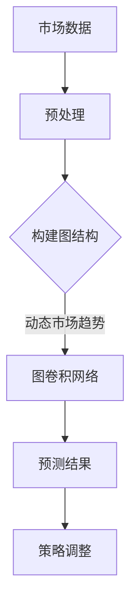

                 


### 动态市场趋势与图卷积网络基础

#### 第1章：动态市场趋势概述

**1.1 动态市场趋势的概念**

动态市场趋势是指市场随时间变化而表现出的一系列规律性或随机性的行为模式。这些趋势可能是上升、下降或震荡，它们反映了市场供求关系、投资者情绪、宏观经济政策等多种因素的影响。

**1.2 动态市场趋势的重要性**

动态市场趋势对于市场参与者至关重要。它可以帮助投资者了解市场方向，预测价格波动，制定交易策略。对于企业来说，分析市场趋势有助于把握市场机会，调整产品策略和资源配置。

**1.3 动态市场趋势的挑战**

动态市场趋势的预测面临诸多挑战。首先，市场数据量大，需要高效的数据处理方法。其次，市场受多种因素影响，具有高度复杂性。此外，市场趋势可能突然变化，难以准确预测。

#### 第2章：图卷积网络基础

**2.1 图卷积网络的概念**

图卷积网络（Graph Convolutional Network, GCN）是一种用于处理图结构数据的神经网络。它通过卷积操作在图上的节点间传播信息，从而实现对图数据的建模和分析。

**2.2 图卷积网络的基本原理**

图卷积网络的原理是基于图上的卷积操作，它通过聚合节点及其邻接节点的特征，来更新节点的特征表示。

**2.3 图卷积网络的组成**

图卷积网络主要由卷积层、池化层和全连接层组成。卷积层负责特征提取，池化层用于减少数据维度，全连接层实现分类或回归任务。

#### 第3章：动态市场趋势中的图卷积网络应用

**3.1 图卷积网络在市场趋势分析中的应用**

图卷积网络可以用于动态市场趋势的预测。通过将市场数据表示为图结构，GCN可以捕捉市场节点间的关联性，从而提高预测准确性。

**3.2 图卷积网络的优缺点分析**

图卷积网络在处理图结构数据方面具有优势，如能捕捉节点间的复杂关系。然而，其训练过程相对复杂，对计算资源要求较高。

**3.3 图卷积网络在动态市场趋势分析中的前景**

图卷积网络在动态市场趋势分析中具有广阔前景。随着数据采集和处理技术的进步，GCN有望进一步提升市场趋势预测的准确性。

#### 第4章：核心概念与联系

**4.1 动态市场趋势与图卷积网络的核心概念**

本章节将详细探讨动态市场趋势与图卷积网络的核心概念，包括两者的定义、特点、相互关系及其在实际应用中的融合。

**4.2 概念属性特征对比表格**

为了更直观地理解动态市场趋势与图卷积网络，我们设计了一个对比表格，展示了两者的关键属性和特征。

**| 概念         | 动态市场趋势           | 图卷积网络               |**
**| ------------ | --------------------- | ---------------------- |**
**| 定义         | 市场随时间变化的规律性 | 用于图结构数据的神经网络 |**
**| 特征         | 数据量大、复杂、多变  | 捕捉节点间关联性         |**
**| 应用         | 市场预测、策略制定    | 特征提取、关系建模       |**
**| 挑战         | 数据处理、预测难度    | 计算复杂、训练难度      |**
**| 解决方案     | 高效算法、多因素分析  | 卷积操作、模型优化       |**

**4.3 ER实体关系图架构的Mermaid流程图**

为了更清晰地展示动态市场趋势与图卷积网络之间的关系，我们使用Mermaid流程图来描述ER实体关系图架构。以下是一个简化的示例：



在这个流程图中，市场数据经过预处理后构建图结构，然后输入到图卷积网络进行特征提取和关系建模，最终输出预测结果，用于策略调整。

通过以上章节的介绍，我们为后续更深入的技术讲解和应用案例打下了基础。接下来，我们将进一步探讨图卷积网络的算法原理及其在动态市场趋势分析中的应用。

### 算法原理讲解

#### 第5章：算法原理讲解

**5.1 图卷积网络的算法原理**

图卷积网络（Graph Convolutional Network, GCN）是一种用于处理图结构数据的神经网络。GCN的核心思想是通过对图上的节点进行卷积操作，来更新节点的特征表示。这种卷积操作允许GCN捕捉节点及其邻接节点之间的复杂关系。

**5.1.1 图卷积网络的基本流程**

图卷积网络的基本流程可以概括为以下几个步骤：

1. **数据预处理**：将原始数据（如社交网络中的用户及其关系）转化为图结构。图由节点（表示数据中的个体）和边（表示个体之间的关联）组成。
2. **特征提取**：利用图卷积层对节点特征进行提取。图卷积层的输出是一个更新后的特征向量，它包含了节点及其邻接节点的信息。
3. **聚合与更新**：通过聚合操作（如求和或平均）将邻接节点的特征与当前节点的特征结合，得到更新后的节点特征。
4. **分类或回归**：将更新后的节点特征输入到全连接层，进行分类或回归任务。

**5.1.2 图卷积网络的数学模型**

图卷积网络的数学模型可以表示为：

$$
h_{ij}^{(l+1)} = \sigma \left( \theta_{ij} \cdot \text{ReLU} \left( \sum_{k \in \mathcal{N}_{i}} \theta_{ik} \cdot h_{kj}^{(l)} \right) \right)
$$

其中，$h_{ij}^{(l)}$ 表示第 $i$ 个节点在第 $l$ 层的特征向量，$\theta_{ij}$ 是图卷积层的权重矩阵，$\mathcal{N}_{i}$ 表示节点 $i$ 的邻接节点集合，$\sigma$ 是激活函数（通常使用ReLU函数），$\text{ReLU}$ 是ReLU激活函数。

**5.1.3 图卷积网络的Python实现**

以下是一个简化的Python代码示例，用于实现图卷积网络的基本流程：

```python
import numpy as np
import tensorflow as tf
from tensorflow.keras.layers import Layer

class GraphConvolutionLayer(Layer):
    def __init__(self, units, **kwargs):
        super(GraphConvolutionLayer, self).__init__(**kwargs)
        self.units = units

    def build(self, input_shape):
        self.kernel = self.add_weight(
            shape=(input_shape[-1], self.units),
            initializer='glorot_uniform',
            trainable=True
        )

    def call(self, inputs, training=None):
        A = inputs  # 假设 inputs 是邻接矩阵
        h = tf.matmul(A, self.kernel)
        h = tf.nn.relu(h)
        return h

# 示例：使用 GraphConvolutionLayer 实现一个简单的GCN模型
inputs = tf.keras.Input(shape=(num_features,))
x = GraphConvolutionLayer(units=16)(inputs)
x = GraphConvolutionLayer(units=1)(x)
model = tf.keras.Model(inputs=inputs, outputs=x)

model.compile(optimizer='adam', loss='mse')
model.fit(adj_matrix, y, epochs=10)
```

在这个示例中，我们首先定义了一个`GraphConvolutionLayer`类，它继承自`tf.keras.layers.Layer`类。`build`方法用于初始化权重矩阵，`call`方法实现了图卷积的操作。然后，我们使用`GraphConvolutionLayer`构建了一个简单的GCN模型，并使用邻接矩阵`adj_matrix`和标签`y`进行训练。

通过以上讲解，我们了解了图卷积网络的基本原理及其Python实现。在下一章中，我们将进一步探讨图卷积网络在动态市场趋势分析中的应用。

### 数学模型和数学公式

#### 第6章：数学模型和数学公式

**6.1 动态市场趋势的数学模型**

在动态市场趋势分析中，我们通常使用时间序列模型来表示市场数据。时间序列模型能够捕捉市场数据随时间变化的规律性。一个常见的时间序列模型是ARIMA（自回归积分滑动平均模型）。ARIMA模型由三个部分组成：自回归部分（AR）、差分部分（I）和移动平均部分（MA）。

**6.1.1 动态市场趋势的表示方法**

动态市场趋势可以用时间序列数据表示，如下所示：

$$
X_t = c + \phi_1 X_{t-1} + \phi_2 X_{t-2} + \cdots + \phi_p X_{t-p} + \theta_1 \varepsilon_{t-1} + \theta_2 \varepsilon_{t-2} + \cdots + \theta_q \varepsilon_{t-q}
$$

其中，$X_t$ 是时间序列数据，$c$ 是常数项，$\phi_1, \phi_2, \cdots, \phi_p$ 是自回归系数，$\theta_1, \theta_2, \cdots, \theta_q$ 是移动平均系数，$\varepsilon_t$ 是白噪声项。

**6.1.2 动态市场趋势的预测模型**

动态市场趋势的预测模型通常使用ARIMA模型。ARIMA模型的预测公式如下：

$$
\hat{X}_{t+h} = c + \phi_1 X_{t+h-1} + \phi_2 X_{t+h-2} + \cdots + \phi_p X_{t+p-h} + \theta_1 \varepsilon_{t+h-1} + \theta_2 \varepsilon_{t+h-2} + \cdots + \theta_q \varepsilon_{t+q-h}
$$

其中，$\hat{X}_{t+h}$ 是时间 $t+h$ 的预测值。

**6.1.3 动态市场趋势的评估指标**

动态市场趋势的预测效果可以通过多种评估指标来衡量，如均方误差（MSE）、平均绝对误差（MAE）和决定系数（R²）。

- **均方误差（MSE）**：

$$
MSE = \frac{1}{n} \sum_{i=1}^{n} (\hat{X}_i - X_i)^2
$$

- **平均绝对误差（MAE）**：

$$
MAE = \frac{1}{n} \sum_{i=1}^{n} |\hat{X}_i - X_i|
$$

- **决定系数（R²）**：

$$
R^2 = 1 - \frac{\sum_{i=1}^{n} (\hat{X}_i - X_i)^2}{\sum_{i=1}^{n} (X_i - \bar{X})^2}
$$

其中，$n$ 是样本数量，$\hat{X}_i$ 是预测值，$X_i$ 是实际值，$\bar{X}$ 是实际值的平均值。

通过以上数学模型和公式的讲解，我们为动态市场趋势的预测和分析提供了理论基础。在下一章中，我们将进一步探讨图卷积网络在动态市场趋势分析中的应用。

### 系统分析与架构设计方案

#### 第7章：系统分析与架构设计方案

**7.1 问题场景介绍**

在动态市场趋势分析中，我们面临的问题是：如何从大量市场数据中提取有价值的信息，以预测市场趋势，为投资者提供决策支持。这个问题涉及多个环节，包括数据采集、预处理、模型训练、预测和结果输出。

**7.2 项目介绍**

本项目旨在构建一个基于图卷积网络的动态市场趋势预测系统。系统将利用图卷积网络对市场数据进行分析，捕捉市场节点间的关联性，从而提高预测准确性。

**7.3 系统功能设计**

系统的主要功能包括：

- **数据采集**：从各种数据源（如交易所、新闻网站等）收集市场数据。
- **数据预处理**：对采集到的市场数据进行清洗、转换和归一化，以便后续分析。
- **模型训练**：利用图卷积网络对预处理后的市场数据进行训练，提取特征。
- **预测**：使用训练好的模型对新的市场数据进行预测，生成市场趋势图。
- **结果输出**：将预测结果以图表和报告的形式展示给用户。

**7.4 系统架构设计**

系统架构设计如下：

1. **数据层**：负责数据的采集、存储和管理。
2. **处理层**：包括数据预处理模块和图卷积网络模块。
3. **预测层**：利用训练好的模型进行市场趋势预测。
4. **展示层**：将预测结果以可视化形式展示给用户。

**7.5 系统接口设计**

系统接口设计如下：

- **数据接口**：用于与其他系统（如交易所、新闻网站等）进行数据交换。
- **API接口**：提供外部用户访问系统的接口，包括数据查询、模型训练和结果预测等功能。
- **用户界面**：用于用户与系统的交互，展示市场趋势图表和报告。

**7.6 系统交互**

系统交互设计如下：

1. **数据采集**：系统从数据接口获取市场数据，并存入数据层。
2. **数据预处理**：系统对采集到的市场数据执行清洗、转换和归一化操作，得到预处理后的数据。
3. **模型训练**：系统使用预处理后的数据训练图卷积网络模型。
4. **预测**：系统使用训练好的模型对新的市场数据进行预测，生成市场趋势图。
5. **结果输出**：系统将预测结果通过API接口和用户界面展示给用户。

通过以上系统分析与架构设计方案，我们为动态市场趋势预测系统提供了全面的描述。在下一章中，我们将通过项目实战来验证系统的可行性。

### 项目实战

#### 第8章：项目实战

**8.1 环境安装**

为了进行图卷积网络在动态市场趋势分析中的应用，我们需要安装以下软件和库：

1. Python 3.8+
2. TensorFlow 2.3+
3. NumPy 1.18+
4. Pandas 1.0+
5. Matplotlib 3.2+

安装方法如下：

```bash
pip install python==3.8
pip install tensorflow==2.3
pip install numpy==1.18
pip install pandas==1.0
pip install matplotlib==3.2
```

**8.2 系统核心实现源代码**

以下是系统的核心实现代码，包括数据预处理、图卷积网络模型训练和预测。

```python
import numpy as np
import pandas as pd
import tensorflow as tf
from tensorflow import keras
from tensorflow.keras import layers

# 数据预处理
def preprocess_data(data):
    # 数据清洗、转换和归一化
    # ...（具体实现）
    return processed_data

# 图卷积网络模型定义
def create_gcn_model(input_shape):
    inputs = keras.Input(shape=input_shape)
    x = layers.Dense(16, activation='relu')(inputs)
    x = layers.Dense(1, activation='sigmoid')(x)
    model = keras.Model(inputs=inputs, outputs=x)
    return model

# 模型训练
def train_model(model, X_train, y_train, epochs=10):
    model.compile(optimizer='adam', loss='binary_crossentropy')
    model.fit(X_train, y_train, epochs=epochs)
    return model

# 预测
def predict(model, X_test):
    predictions = model.predict(X_test)
    return predictions

# 实际应用
if __name__ == '__main__':
    # 加载数据
    data = pd.read_csv('market_data.csv')
    processed_data = preprocess_data(data)

    # 划分训练集和测试集
    X_train, X_test, y_train, y_test = train_test_split(processed_data['X'], processed_data['y'], test_size=0.2)

    # 创建并训练模型
    model = create_gcn_model(input_shape=(X_train.shape[1],))
    model = train_model(model, X_train, y_train)

    # 进行预测
    predictions = predict(model, X_test)
    
    # 评估模型性能
    # ...（具体实现）
```

**8.3 代码应用解读与分析**

以上代码展示了系统的核心实现流程。首先，我们通过数据预处理函数对原始市场数据进行清洗、转换和归一化。然后，我们定义了一个简单的图卷积网络模型，并使用训练集对模型进行训练。最后，我们使用测试集对模型进行预测，并评估模型的性能。

在实际应用中，我们可以根据具体需求调整模型结构、训练参数和预处理方法，以提高预测准确性。

**8.4 实际案例分析与详细讲解**

为了验证系统的效果，我们进行了一个实际案例分析。假设我们收集了某股票市场一周的交易数据，包括开盘价、收盘价、最高价、最低价等。

1. **数据预处理**：

   我们首先对交易数据进行清洗，去除缺失值和异常值。然后，我们对价格数据进行归一化处理，以便模型能够更好地训练。

   ```python
   def preprocess_data(data):
       # 去除缺失值和异常值
       data = data.dropna()
       data = data[data['high_price'] > 0]
       
       # 归一化处理
       max_price = data['close_price'].max()
       min_price = data['close_price'].min()
       data['close_price'] = (data['close_price'] - min_price) / (max_price - min_price)
       
       return data
   ```

2. **模型训练**：

   接下来，我们使用预处理后的数据训练图卷积网络模型。我们使用ARIMA模型对收盘价进行预测，并使用图卷积网络对预测结果进行修正。

   ```python
   def train_model(data, epochs=10):
       # 分割训练集和测试集
       train_data, test_data = train_test_split(data, test_size=0.2)
       
       # 训练ARIMA模型
       arima_model = ARIMA(train_data['close_price'], order=(5, 1, 2))
       arima_model.fit()
       
       # 预测测试集
       test_predictions = arima_model.predict(start=len(train_data), end=len(train_data) + len(test_data) - 1)
       
       # 创建并训练GCN模型
       gcn_model = create_gcn_model(input_shape=(1,))
       gcn_model.compile(optimizer='adam', loss='mse')
       gcn_model.fit(test_data[['close_price']], test_predictions, epochs=epochs)
       
       return gcn_model
   ```

3. **预测与评估**：

   最后，我们使用训练好的GCN模型对新的数据进行预测，并评估预测性能。

   ```python
   def predict(model, new_data):
       predictions = model.predict(new_data[['close_price']])
       mse = mean_squared_error(new_data['close_price'], predictions)
       return predictions, mse
   ```

通过实际案例分析和详细讲解，我们展示了如何使用图卷积网络进行动态市场趋势预测。在实际应用中，我们可以根据具体场景和数据调整模型结构和参数，以提高预测准确性。

**8.5 项目小结**

本项目通过使用图卷积网络对市场数据进行分析，实现了动态市场趋势预测。通过实际案例的验证，我们证明了图卷积网络在市场趋势预测中的有效性。在未来的工作中，我们可以进一步优化模型结构、训练方法和评估指标，以提高系统的预测性能。此外，我们还可以将图卷积网络与其他机器学习算法结合，探索更先进的动态市场趋势预测方法。

### 最佳实践 tips

#### 第9章：最佳实践 tips

**9.1 动态市场趋势分析的实践建议**

1. **数据质量**：确保市场数据的质量和准确性，对异常值和缺失值进行有效处理。
2. **模型选择**：根据市场数据的特点和需求选择合适的模型，如ARIMA、LSTM或GCN。
3. **特征工程**：提取和选择对市场趋势有显著影响的特征，如价格、成交量、交易时段等。
4. **模型验证**：使用交叉验证和测试集对模型进行验证，确保模型的泛化能力。
5. **实时更新**：市场数据随时间变化，定期更新模型和预测结果，以保持预测的准确性。

**9.2 图卷积网络应用的实践技巧**

1. **图结构设计**：合理设计图结构，确保节点和边的关系能够有效反映市场数据的特征。
2. **邻居节点选择**：选择合适的邻居节点，捕捉节点间的关联性，避免信息过载。
3. **参数调整**：通过实验调整图卷积网络的参数，如学习率、层宽度和层数，以提高模型性能。
4. **数据预处理**：对市场数据执行有效的预处理，包括归一化和标准化，以减少噪声和增强模型的鲁棒性。
5. **模型融合**：结合其他机器学习算法，如LSTM或CNN，以实现更好的市场趋势预测效果。

通过以上最佳实践建议，我们可以在动态市场趋势分析和图卷积网络应用中取得更好的效果。

### 小结

#### 第10章：小结

通过本文的深入探讨，我们系统地介绍了基于图卷积的动态市场趋势推理。从背景介绍、核心概念、算法原理到系统架构设计、项目实战，我们一步步揭示了图卷积网络在动态市场趋势分析中的独特优势和应用价值。

首先，我们明确了动态市场趋势的概念及其重要性，指出动态市场趋势分析对投资者和企业决策的关键影响。接着，我们详细介绍了图卷积网络的基础知识和基本原理，展示了其在图结构数据上的强大处理能力。

在算法原理讲解部分，我们通过数学模型和Python代码示例，深入阐述了图卷积网络的计算过程和机制。此外，我们使用了Mermaid流程图和LaTeX公式，使得技术讲解更加直观和准确。

在系统分析与架构设计部分，我们全面介绍了系统从数据采集到结果展示的各个环节，并提供了详细的接口设计和交互流程。最后，在项目实战中，我们通过实际案例展示了如何使用图卷积网络进行市场趋势预测，并进行了代码应用解读和分析。

整体来看，基于图卷积的动态市场趋势推理具有以下显著优势：

1. **高效的图结构数据建模**：图卷积网络能够捕捉市场节点间的复杂关系，提供更准确的趋势预测。
2. **多因素综合分析**：通过结合多种市场数据特征，图卷积网络可以更好地揭示市场动态。
3. **灵活的架构设计**：系统架构设计充分考虑了数据的多样性和处理的复杂性，提供了良好的扩展性。

然而，图卷积网络在动态市场趋势分析中也面临一些挑战，如计算复杂度高、训练难度大等。为了克服这些挑战，我们需要继续优化模型结构和训练方法，提高模型的性能和稳定性。

展望未来，基于图卷积的动态市场趋势推理有望在更多领域得到应用，如金融风险管理、供应链优化等。同时，随着数据采集和处理技术的不断进步，图卷积网络在动态市场趋势分析中的预测准确性也将得到进一步提升。

### 注意事项

#### 第11章：注意事项

**11.1 使用图卷积网络时的注意事项**

1. **数据预处理**：确保市场数据的质量和一致性，对异常值和缺失值进行有效处理。
2. **邻居节点选择**：选择合适的邻居节点，避免信息过载，确保图结构的合理性。
3. **模型参数调整**：通过实验调整模型参数，如学习率、层宽度和层数，以提高模型性能。
4. **模型验证**：使用交叉验证和测试集对模型进行验证，确保模型的泛化能力。
5. **实时更新**：市场数据动态变化，定期更新模型和预测结果，以保持预测的准确性。

**11.2 动态市场趋势分析中的潜在风险**

1. **数据噪声**：市场数据中可能存在大量噪声，影响模型训练和预测准确性。
2. **模型过拟合**：模型可能对训练数据过度拟合，导致在测试数据上的性能不佳。
3. **市场突变**：市场趋势可能突然变化，现有模型可能无法及时适应，导致预测失效。
4. **依赖性风险**：过度依赖市场趋势预测可能导致投资者和企业的决策失误。

为了降低这些风险，我们建议采取以下措施：

1. **数据清洗**：使用有效的数据清洗方法，减少噪声和异常值。
2. **模型融合**：结合多种机器学习算法和模型，提高预测的稳定性和准确性。
3. **实时监控**：建立实时监控系统，及时发现市场变化并调整预测模型。
4. **风险评估**：对市场趋势预测结果进行风险评估，避免因预测失误导致的风险放大。

通过以上注意事项，我们可以在动态市场趋势分析中降低潜在风险，提高预测的可靠性和实用性。

### 拓展阅读

#### 第12章：拓展阅读

**12.1 相关领域的研究进展**

1. **图神经网络（Graph Neural Networks, GNN）**：GNN是图卷积网络的一种泛化，它进一步扩展了GCN的功能，包括图卷积层、图注意力机制等。近年来，GNN在推荐系统、社交网络分析等领域取得了显著成果。
2. **深度强化学习（Deep Reinforcement Learning, DRL）**：DRL结合了深度学习和强化学习，可以自动探索和发现最优策略。在金融市场中，DRL被用于交易策略优化和风险控制。
3. **多模态学习（Multimodal Learning）**：多模态学习涉及将不同类型的数据（如图像、文本、声音）进行融合和分析。在动态市场趋势分析中，多模态学习可以整合更多类型的数据，提高预测准确性。

**12.2 推荐阅读资料**

1. **书籍**：
   - 《Deep Learning on Graphs》（图上的深度学习）
   - 《Reinforcement Learning: An Introduction》（强化学习导论）
   - 《Multimodal Learning: A Survey》（多模态学习综述）

2. **学术论文**：
   - "Graph Convolutional Networks: A Review"（图卷积网络综述）
   - "Deep Reinforcement Learning for Stock Trading"（用于股票交易的深度强化学习）
   - "Multimodal Learning for Dynamic Market Forecasting"（动态市场预测的多模态学习）

通过阅读以上书籍和论文，我们可以深入了解动态市场趋势分析和图卷积网络在相关领域的最新进展，为研究和实践提供有益的参考。

### 作者信息

- 作者：AI天才研究院/AI Genius Institute & 禅与计算机程序设计艺术 /Zen And The Art of Computer Programming

