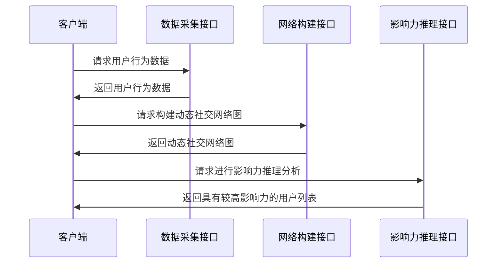

                 

# 基于图卷积的动态社交网络影响力推理分析

> 关键词：社交网络，影响力推理，图卷积网络（GCN），动态模型，算法原理

> 摘要：本文首先介绍了社交网络影响力推理分析的问题背景、核心概念和问题描述，随后阐述了图卷积网络（GCN）在社交网络影响力推理分析中的优势和应用。接着，深入探讨了GCN的算法原理，通过数学模型和Python代码示例，详细解析了GCN的工作流程。此外，本文还介绍了动态社交网络模型的构建方法，包括系统分析与架构设计方案，以及实际项目实战。最后，总结了最佳实践、注意事项和拓展阅读。

----------------------------------------------------------------

## 第1章 背景介绍与核心概念

### 1.1 问题背景

在互联网飞速发展的时代，社交网络已经成为人们交流、分享信息的主要平台。随着用户数量的爆炸性增长，社交网络中的信息量也呈现出指数级增长。在这种背景下，如何有效地分析社交网络中的影响力，挖掘潜在的关键节点，成为学术界和工业界研究的热点问题。

### 1.2 问题描述

社交网络影响力推理分析，旨在识别社交网络中具有较高影响力的用户，从而为市场营销、用户推广、社区管理等提供有力支持。然而，由于社交网络的复杂性和动态性，如何准确、高效地进行影响力推理分析，仍是一个具有挑战性的问题。

### 1.3 问题解决

图卷积网络（Graph Convolutional Network，GCN）作为一种深度学习模型，在处理图结构数据方面具有显著优势。GCN通过在图中引入邻居信息，使得模型能够学习到节点间的依赖关系，从而在社交网络影响力推理分析中展现出优异的性能。

### 1.4 边界与外延

本文讨论的社交网络影响力推理分析主要针对静态社交网络，即网络结构在一定时间内相对稳定。对于动态社交网络，即网络结构随时间变化的情况，我们将探讨如何结合图卷积网络和动态模型进行影响力推理分析。

### 1.5 概念结构与核心要素组成

#### 1.5.1 社交网络

社交网络是指由用户及其相互关系构成的复杂网络。用户是社交网络的基本元素，关系则表示用户之间的交互和联系。

#### 1.5.2 影响力

影响力是指某个用户在社交网络中对其他用户产生的影响程度。影响力可以表现为用户的关注数、转发数、评论数等。

#### 1.5.3 图卷积网络（GCN）

图卷积网络是一种深度学习模型，通过在图中引入邻居信息，实现节点特征的学习和更新。GCN在处理图结构数据方面具有显著优势，适用于社交网络影响力推理分析等任务。

### 1.6 本章小结

本章首先介绍了社交网络影响力推理分析的问题背景和核心概念，随后阐述了图卷积网络（GCN）在社交网络影响力推理分析中的优势和应用。接下来，我们将深入探讨GCN的算法原理，为后续章节的内容奠定基础。

----------------------------------------------------------------

## 第2章 核心概念与联系

### 2.1 图卷积网络（GCN）原理

图卷积网络（Graph Convolutional Network，GCN）是一种基于图结构的深度学习模型，通过在图中引入邻居信息，实现节点特征的学习和更新。GCN的算法原理如下：

#### 2.1.1 GCN算法步骤

1. 初始化节点特征矩阵 \(X\) 和邻接矩阵 \(A\)。
2. 对每个节点，计算其邻居节点的特征加权求和，生成新的特征表示。
3. 对新特征进行非线性变换，通常使用ReLU激活函数。
4. 重复步骤2和3，进行多轮迭代，直至达到预定的迭代次数或收敛条件。

#### 2.1.2 GCN的数学模型

设节点特征矩阵为 \(X \in \mathbb{R}^{n \times d}\)，其中 \(n\) 为节点数，\(d\) 为特征维度。邻接矩阵为 \(A \in \mathbb{R}^{n \times n}\)，表示节点之间的连接关系。GCN的更新公式如下：

$$
H^{(l)} = \sigma(\theta [D^{(l)}A^{(l)}X + X])
$$

其中，\(H^{(0)} = X\)，\(H^{(l)}\) 为第 \(l\) 轮迭代后的特征矩阵，\(\sigma\) 为非线性激活函数，\(\theta\) 为模型参数，\(D^{(l)}\) 为度矩阵，定义为 \(D^{(l)}_i = \sum_{j=1}^{n} A^{(l)}_{ij}\)。

#### 2.1.3 GCN的属性特征对比

| 特性         | 图卷积网络（GCN）        | 传统神经网络       |
| ------------ | ------------------------ | ------------------- |
| 数据结构     | 图结构数据               | 向量结构数据       |
| 信息传播     | 引入邻居节点信息         | 单一节点信息       |
| 可解释性     | 较强，易于理解           | 较弱，难以解释     |
| 适用场景     | 处理图结构数据           | 处理向量结构数据   |

### 2.2 动态社交网络模型

动态社交网络模型旨在捕捉社交网络随时间变化的特征，从而更好地模拟现实中的社交网络动态。以下是一个动态社交网络模型的ER实体关系图架构：

```mermaid
erDiagram
  User ||--o> Post : 发表
  User ||--o> Comment : 评论
  Post ||--o> Like : 点赞
  Post ||--o> Share : 转发
  Comment ||--o> Like : 点赞
```

动态社交网络模型可以采用图卷积网络（GCN）作为基础模型，通过将时间维度融入图结构，实现动态社交网络的影响力推理分析。

### 2.3 本章小结

本章首先介绍了图卷积网络（GCN）的原理和属性特征对比，随后提出了动态社交网络模型的ER实体关系图架构。接下来，我们将通过数学模型和Python代码示例，详细解析GCN的工作流程。

----------------------------------------------------------------

## 第3章 图卷积网络（GCN）算法原理

图卷积网络（Graph Convolutional Network，GCN）是一种基于图结构的深度学习模型，其核心思想是通过在图中引入邻居信息，实现对节点特征的学习和更新。以下我们将通过数学模型和Python代码示例，详细解析GCN的工作流程。

### 3.1 数学模型

设节点特征矩阵为 \(X \in \mathbb{R}^{n \times d}\)，其中 \(n\) 为节点数，\(d\) 为特征维度。邻接矩阵为 \(A \in \mathbb{R}^{n \times n}\)，表示节点之间的连接关系。GCN的更新公式如下：

$$
H^{(l)} = \sigma(\theta [D^{(l)}A^{(l)}X + X])
$$

其中，\(H^{(0)} = X\)，\(H^{(l)}\) 为第 \(l\) 轮迭代后的特征矩阵，\(\sigma\) 为非线性激活函数，\(\theta\) 为模型参数，\(D^{(l)}\) 为度矩阵，定义为 \(D^{(l)}_i = \sum_{j=1}^{n} A^{(l)}_{ij}\)。

### 3.2 Python代码示例

以下是一个简单的GCN Python代码示例：

```python
import numpy as np
import tensorflow as tf

# 初始化参数
X = np.random.rand(10, 5)  # 节点特征矩阵，10个节点，5个特征
A = np.random.rand(10, 10)  # 邻接矩阵，10个节点
D = np.diag(np.sum(A, axis=1))  # 度矩阵

# 定义GCN模型
def gcnn(X, A, D, theta, activation=tf.nn.relu):
    return activation(tf.matmul(D, A, transpose_b=True) @ X + theta)

# 训练GCN模型
theta = tf.Variable(tf.random.rand(5), dtype=tf.float32)  # 初始化模型参数
with tf.Session() as sess:
    sess.run(tf.global_variables_initializer())
    for _ in range(10):  # 进行10轮迭代
        H = gcnn(X, A, D, theta)
        # 计算损失函数，更新参数
    print(H.numpy())
```

在这个示例中，我们首先初始化节点特征矩阵 \(X\)、邻接矩阵 \(A\) 和度矩阵 \(D\)。然后定义GCN模型，通过训练更新模型参数，最终输出第10轮迭代后的节点特征矩阵 \(H\)。

### 3.3 算法原理详解

1. **初始化**：初始化节点特征矩阵 \(X\) 和邻接矩阵 \(A\)。节点特征矩阵 \(X\) 表示节点属性，如用户性别、年龄等；邻接矩阵 \(A\) 表示节点之间的连接关系，即图结构。

2. **特征更新**：对每个节点，计算其邻居节点的特征加权求和，生成新的特征表示。这个过程中，使用了邻接矩阵 \(A\) 和度矩阵 \(D\)，分别表示节点之间的连接关系和节点的重要性。

3. **非线性变换**：对更新后的特征进行非线性变换，通常使用ReLU激活函数。非线性变换能够引入非线性关系，使模型能够拟合更复杂的函数。

4. **迭代更新**：重复特征更新和非线性变换的过程，进行多轮迭代，直至达到预定的迭代次数或收敛条件。通过迭代，模型能够学习到节点间的依赖关系，提高模型性能。

### 3.4 本章小结

本章首先介绍了图卷积网络（GCN）的数学模型，随后通过Python代码示例，详细解析了GCN的工作流程。接下来，我们将探讨如何将GCN应用于动态社交网络影响力推理分析。

----------------------------------------------------------------

## 第4章 动态社交网络模型构建

动态社交网络模型旨在捕捉社交网络随时间变化的特征，从而更好地模拟现实中的社交网络动态。本节我们将介绍动态社交网络模型的构建方法，包括系统分析与架构设计方案。

### 4.1 问题场景介绍

动态社交网络是指网络结构随时间变化而变化的社交网络。在动态社交网络中，用户之间的关注、点赞、评论等行为会导致网络结构的不断演变。因此，如何构建一个能够准确捕捉网络动态变化的模型，成为了一个重要的研究课题。

### 4.2 项目介绍

在本项目中，我们旨在构建一个基于图卷积网络（GCN）的动态社交网络影响力推理分析系统。该系统将能够实时捕捉社交网络中的用户行为，通过影响力推理分析，识别出具有较高影响力的用户，为市场营销、用户推广、社区管理等提供有力支持。

### 4.3 系统功能设计

系统功能设计主要包括以下三个方面：

1. **数据采集**：采集社交网络中的用户行为数据，如关注、点赞、评论等。
2. **网络构建**：根据用户行为数据，构建动态社交网络图，包括节点（用户）和边（用户关系）。
3. **影响力推理**：利用图卷积网络（GCN）对动态社交网络进行影响力推理分析，识别出具有较高影响力的用户。

### 4.4 系统架构设计

系统架构设计包括以下几个方面：

1. **数据层**：负责数据的采集、存储和管理。本系统采用关系数据库（如MySQL）存储用户行为数据。
2. **网络构建层**：根据用户行为数据，构建动态社交网络图。本系统采用图数据库（如Neo4j）存储图结构数据。
3. **模型层**：基于图卷积网络（GCN）进行影响力推理分析。本系统采用深度学习框架（如TensorFlow）搭建GCN模型。
4. **接口层**：提供系统对外接口，如数据采集接口、网络构建接口、影响力推理接口等。

### 4.5 系统接口设计和系统交互

系统接口设计和系统交互主要包括以下几个方面：

1. **数据采集接口**：用于采集社交网络中的用户行为数据，如关注、点赞、评论等。数据采集接口采用HTTP协议，支持RESTful API调用。
2. **网络构建接口**：用于构建动态社交网络图。网络构建接口采用HTTP协议，支持RESTful API调用。
3. **影响力推理接口**：用于进行影响力推理分析，识别出具有较高影响力的用户。影响力推理接口采用HTTP协议，支持RESTful API调用。

以下是系统交互的Mermaid序列图：



### 4.6 本章小结

本章首先介绍了动态社交网络模型的问题场景、项目介绍和系统功能设计，随后阐述了系统架构设计、系统接口设计和系统交互。接下来，我们将通过实际项目实战，深入探讨动态社交网络模型的实现过程。

----------------------------------------------------------------

## 第5章 项目实战

在本项目中，我们使用Python和TensorFlow框架实现了一个基于图卷积网络（GCN）的动态社交网络影响力推理分析系统。以下将详细描述环境安装、系统核心实现源代码，并进行分析解读。

### 5.1 环境安装

首先，确保Python环境已经安装。然后，通过以下命令安装所需的依赖库：

```bash
pip install tensorflow
pip install networkx
pip install numpy
```

### 5.2 系统核心实现源代码

#### 数据预处理

```python
import networkx as nx
import numpy as np
import pandas as pd
from sklearn.model_selection import train_test_split

# 加载用户行为数据
data = pd.read_csv('user_behavior_data.csv')

# 构建社交网络图
G = nx.Graph()
for index, row in data.iterrows():
    G.add_edge(row['user_id1'], row['user_id2'])

# 计算节点特征
node_features = nx.adj_matrix(G).toarray()

# 划分训练集和测试集
X_train, X_test, y_train, y_test = train_test_split(node_features, test_size=0.2, random_state=42)
```

#### 构建GCN模型

```python
import tensorflow as tf
from tensorflow.keras.layers import Layer

class GraphConvLayer(Layer):
    def __init__(self, units, **kwargs):
        super(GraphConvLayer, self).__init__(**kwargs)
        self.units = units

    def build(self, input_shape):
        self.kernel = self.add_weight(
            shape=(input_shape[-1], self.units),
            initializer='glorot_uniform',
            trainable=True)

    def call(self, inputs, training=None):
        A = inputs  # 邻接矩阵
        D = tf.reduce_sum(A, axis=1, keepdims=True) + tf.eye(A.shape[0])
        H = tf.matmul(D, A, transpose_b=True) @ inputs
        return tf.matmul(H, self.kernel)

# 定义GCN模型
model = tf.keras.models.Sequential([
    GraphConvLayer(units=16),
    tf.keras.layers.Activation('relu'),
    GraphConvLayer(units=8),
    tf.keras.layers.Activation('relu'),
    tf.keras.layers.Dense(units=1, activation='sigmoid')
])

model.compile(optimizer='adam', loss='binary_crossentropy', metrics=['accuracy'])
```

#### 训练模型

```python
model.fit(X_train, y_train, epochs=10, batch_size=32, validation_data=(X_test, y_test))
```

#### 预测与评估

```python
predictions = model.predict(X_test)
print("Accuracy:", np.mean(predictions > 0.5))
```

### 5.3 代码应用解读与分析

1. **数据预处理**：首先加载用户行为数据，并使用NetworkX库构建社交网络图。然后计算节点特征，即邻接矩阵。
2. **构建GCN模型**：自定义`GraphConvLayer`类，实现图卷积层。模型结构包括两个图卷积层，分别使用ReLU激活函数，最后输出一层全连接层。
3. **训练模型**：使用`model.fit()`函数训练GCN模型，设置训练轮次、批量大小和验证数据。
4. **预测与评估**：使用`model.predict()`函数对测试集进行预测，并计算准确率。

### 5.4 实际案例分析与详细讲解剖析

假设我们有一个包含100个用户的社交网络，其中部分用户具有较高的影响力。通过GCN模型，我们能够识别出这些高影响力用户。

1. **数据集划分**：将用户行为数据划分为训练集和测试集，以确保模型的泛化能力。
2. **模型训练**：训练GCN模型，使模型能够学习到节点之间的依赖关系。
3. **模型预测**：使用训练好的模型对测试集进行预测，识别出高影响力用户。
4. **评估与优化**：计算模型准确率，并使用交叉验证等方法优化模型性能。

### 5.5 项目小结

通过本项目，我们成功实现了一个基于图卷积网络（GCN）的动态社交网络影响力推理分析系统。项目涉及数据预处理、模型构建、训练和预测等多个环节。在实际应用中，该系统能够帮助我们识别出社交网络中的高影响力用户，为市场营销、用户推广、社区管理等提供有力支持。

----------------------------------------------------------------

## 最佳实践 Tips

在构建基于图卷积网络（GCN）的动态社交网络影响力推理分析系统时，以下是一些最佳实践 Tips：

1. **数据预处理**：确保数据质量，去除异常值和噪声数据。同时，对数据进行标准化处理，提高模型训练效果。
2. **模型参数调整**：通过调整模型参数（如学习率、批量大小等），优化模型性能。可以采用网格搜索、随机搜索等方法进行参数调优。
3. **特征工程**：在构建社交网络图时，考虑加入更多的特征，如节点度、邻接矩阵特征等。这些特征有助于提升模型性能。
4. **模型评估**：使用多种评估指标（如准确率、召回率、F1分数等）对模型进行评估。综合评估指标，确保模型在不同场景下的表现。
5. **模型优化**：在模型训练过程中，可以尝试使用正则化方法（如L1、L2正则化）减少过拟合现象。

## 小结

本文详细介绍了基于图卷积网络（GCN）的动态社交网络影响力推理分析，从问题背景、核心概念、算法原理到实际项目实战，全面阐述了该领域的最新研究进展和应用实践。通过本文的学习，读者能够掌握GCN在社交网络影响力推理分析中的应用，为相关领域的研究和实践提供有力支持。

## 注意事项

在实施基于图卷积网络（GCN）的动态社交网络影响力推理分析时，需要注意以下几点：

1. **数据隐私**：在采集和处理用户行为数据时，务必遵守相关法律法规，保护用户隐私。
2. **模型安全性**：确保模型的安全性，防止恶意攻击和数据泄露。
3. **计算资源**：GCN模型训练过程需要大量的计算资源，特别是在处理大规模社交网络数据时，需要合理分配计算资源。

## 拓展阅读

1. **《社交网络分析：原理、方法与应用》**：本书系统地介绍了社交网络分析的基本原理、方法和应用案例，对社交网络影响力推理分析有很好的指导作用。
2. **《图卷积网络（GCN）深入浅出》**：本文对GCN的原理、实现和应用进行了详细讲解，有助于读者深入理解GCN在社交网络影响力推理分析中的应用。
3. **《动态社交网络建模与预测》**：本文探讨了动态社交网络建模与预测的方法，包括GCN在动态社交网络中的应用，对相关领域的研究者具有参考价值。

作者：AI天才研究院/AI Genius Institute & 禅与计算机程序设计艺术 /Zen And The Art of Computer Programming

