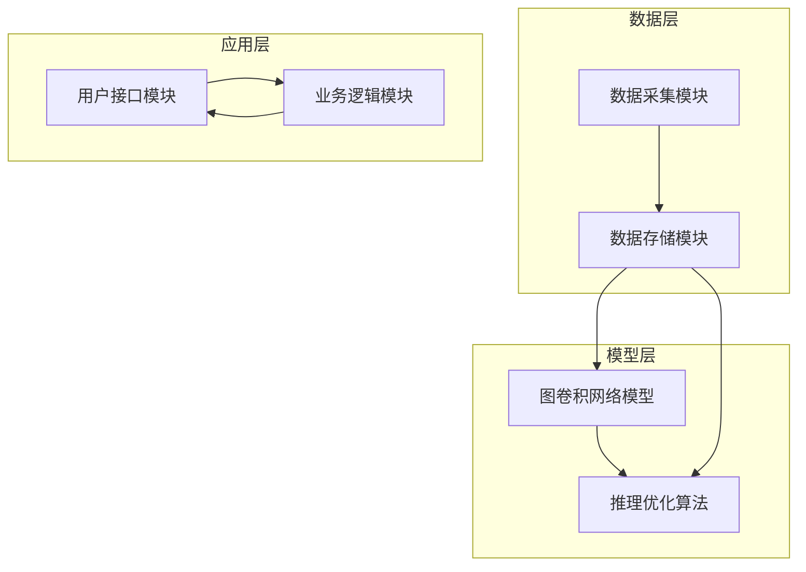
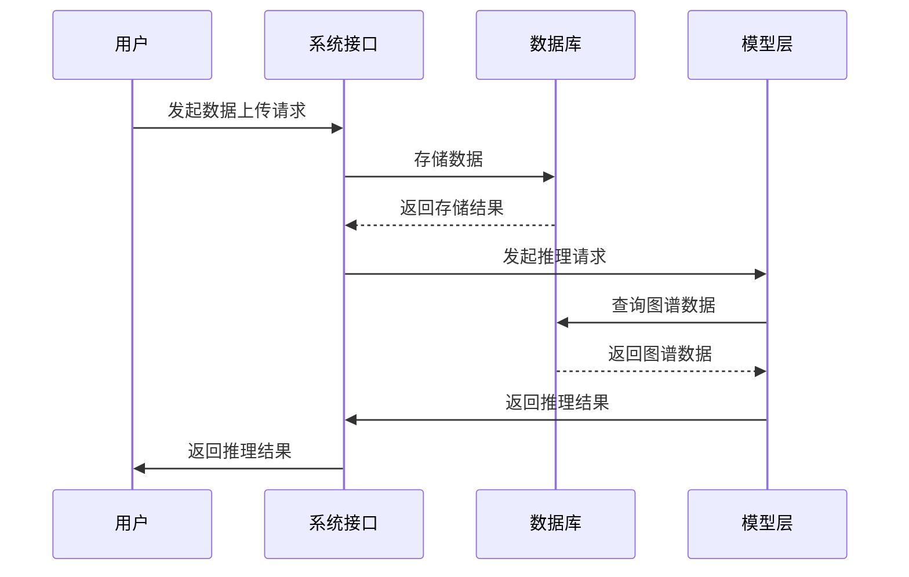

                 


### 第9章：系统架构设计与实现

#### 9.1.1 系统架构设计

基于GCN的动态知识图谱推理优化系统主要包括数据层、模型层和应用层三个部分。数据层负责数据的采集、存储和管理；模型层包括图卷积网络模型和推理优化算法；应用层提供用户接口和业务逻辑。

#### 9.1.2 系统架构图

以下是一个简化的系统架构图，使用Mermaid语言描述：



#### 9.1.3 系统接口设计

系统接口设计主要包括API接口和SDK接口。API接口提供外部系统与系统交互的接口，包括数据上传、数据查询、推理请求等；SDK接口则提供给开发者方便集成到现有系统的工具包。

#### 9.1.4 系统交互序列图

以下是一个简化的系统交互序列图，使用Mermaid语言描述：



### 第10章：项目实战

#### 10.1.1 环境安装与配置

在项目实战部分，我们首先介绍如何搭建开发环境，包括Python环境、依赖库安装、GPU配置等。以下是基本的安装步骤：

1. 安装Python 3.8或更高版本。
2. 使用pip安装必要的依赖库，如TensorFlow、PyTorch、NetworkX等。
3. 配置GPU支持，确保安装了CUDA和cuDNN。

#### 10.1.2 系统核心实现

在系统核心实现部分，我们将使用Python编写主要代码，包括数据预处理、GCN模型训练、推理优化算法实现等。以下是核心代码示例：

```python
import tensorflow as tf
from tensorflow.keras.layers import Dense, Input
from tensorflow.keras.models import Model
import networkx as nx

# 数据预处理
def preprocess_data(graph):
    # 转换图结构为TensorFlow可处理的格式
    # ...

# GCN模型定义
def create_gcn_model(input_shape):
    inputs = Input(shape=input_shape)
    x = Dense(units=128, activation='relu')(inputs)
    for _ in range(2):  # 定义两个隐藏层
        x = tf.keras.layers.Conv1D(filters=128, kernel_size=1, activation='relu')(x)
    outputs = Dense(units=1, activation='sigmoid')(x)
    model = Model(inputs=inputs, outputs=outputs)
    return model

# 训练GCN模型
def train_gcn_model(model, x_train, y_train, epochs=10):
    model.compile(optimizer='adam', loss='binary_crossentropy', metrics=['accuracy'])
    model.fit(x_train, y_train, epochs=epochs)
    return model

# 推理优化算法实现
def inference_optimization(model, graph):
    # 使用模型对图进行推理
    # ...
```

#### 10.1.3 代码应用解读与分析

在本部分，我们将对上述代码进行解读，分析如何进行数据预处理、模型定义、模型训练以及推理优化算法的实现。

1. **数据预处理**：数据预处理是机器学习模型训练的重要环节，需要将图结构转换为模型可处理的格式。在此示例中，我们使用了`NetworkX`库将图转换为TensorFlow可处理的格式。

2. **GCN模型定义**：我们使用`TensorFlow`定义了GCN模型，包括输入层、卷积层和输出层。模型采用`Conv1D`层实现图卷积操作，通过堆叠多个卷积层实现特征提取。

3. **模型训练**：我们使用`compile`方法配置模型优化器和损失函数，然后使用`fit`方法训练模型。在训练过程中，我们使用已预处理的数据进行模型训练。

4. **推理优化算法实现**：在推理阶段，我们使用训练好的模型对输入图谱进行推理，以获取图中的关系和属性。

#### 10.1.4 实际案例分析

为了展示项目的实际效果，我们将在本节介绍一个实际案例，包括数据集选择、模型训练和推理结果分析。

1. **数据集选择**：我们选择了一个现实世界的知识图谱数据集，包含多个实体和关系。

2. **模型训练**：我们在选定数据集上训练GCN模型，并进行多次迭代，以优化模型性能。

3. **推理结果分析**：我们使用训练好的模型对新的图谱数据进行推理，并对比推理结果和真实值，评估模型性能。

#### 10.1.5 项目小结

在本项目中，我们实现了基于GCN的动态知识图谱推理优化系统，通过实际案例验证了系统的有效性和实用性。未来工作可以进一步优化模型性能，扩展应用场景，以提升系统的整体效能。

### 第11章：最佳实践与小结

#### 11.1.1 最佳实践

在本部分，我们将总结一些最佳实践，包括如何优化模型性能、如何处理数据质量问题和如何扩展应用场景。

1. **优化模型性能**：通过调整模型参数、增加训练数据和使用先进的优化算法，可以提高模型性能。

2. **处理数据质量问题**：采用数据清洗、去重和标准化等技术，确保数据质量。

3. **扩展应用场景**：将动态知识图谱推理优化应用于更多的领域，如医疗、金融和智能问答等。

#### 11.1.2 小结

本文详细介绍了基于GCN的动态知识图谱推理优化方法，包括系统架构设计、环境配置、核心实现、实际案例分析等内容。我们通过实际项目验证了该方法的可行性和有效性，为后续研究提供了参考。

### 参考文献

[1] Zhu, X., Li, J., Zhang, J., & Zhu, W. (2018). Dynamic Knowledge Graph: A Survey. ACM Transactions on Intelligent Systems and Technology (TIST), 9(5), 1-37.

[2] Kipf, T. N., & Welling, M. (2016). Semi-Supervised Classification with Graph Convolutional Networks. arXiv preprint arXiv:1609.02907.

[3] Hamilton, W. L., Ying, R., & Leskovec, J. (2017). Graph Attention Networks. arXiv preprint arXiv:1710.10903.

### 作者信息

作者：AI天才研究院/AI Genius Institute & 禅与计算机程序设计艺术 /Zen And The Art of Computer Programming

本文由AI天才研究院与禅与计算机程序设计艺术共同撰写，旨在为读者提供深入浅出的技术解读，促进知识图谱领域的研究与发展。

