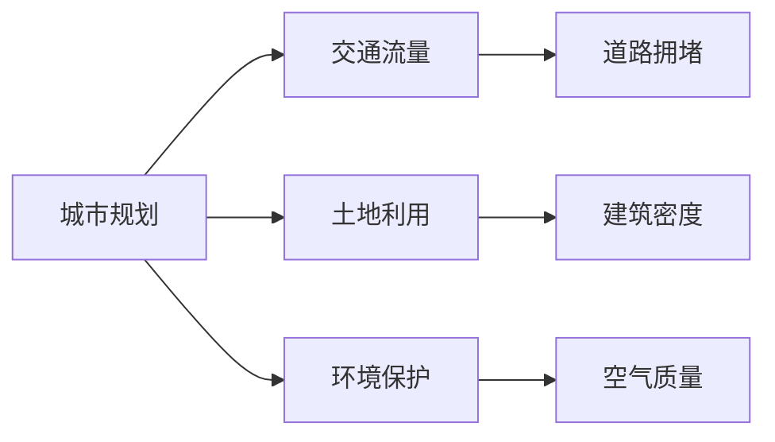
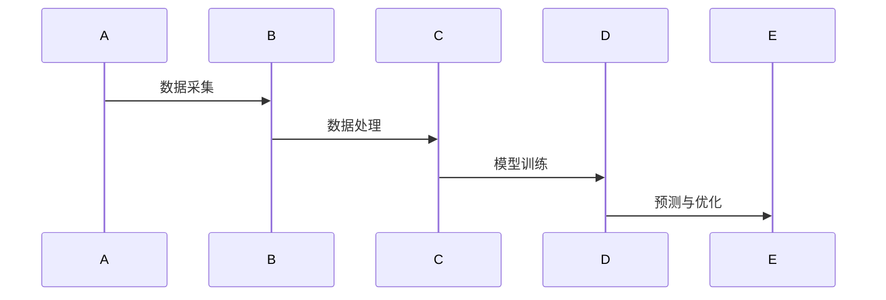

                 


## 《基于图卷积网络的复杂系统推理在城市规划优化中的应用》

> 关键词：图卷积网络，城市规划，复杂系统推理，系统优化

> 摘要：本文将深入探讨基于图卷积网络的复杂系统推理在城市规划优化中的应用。首先，我们将介绍城市规划优化中的复杂系统，以及与之相关的核心概念和联系。接着，我们将详细阐述图卷积网络的数学模型和算法原理，并通过Python源代码进行示例讲解。随后，我们将分析系统架构设计，包括问题场景介绍、系统功能设计、架构设计和接口设计。在项目实战部分，我们将展示环境安装与准备、系统核心实现，以及实际案例分析。最后，我们将总结最佳实践和注意事项，并提供拓展阅读建议。

### 第1章：城市规划优化中的复杂系统

#### 1.1.1 问题背景

随着城市化的快速发展，城市规划的重要性日益凸显。传统的城市规划方法通常依赖于统计数据和经验，但在复杂、动态的城市环境中，这种方法往往难以满足实际需求。复杂系统的引入，为我们提供了一种新的视角来理解和优化城市规划。

#### 1.1.2 问题描述

城市规划优化涉及诸多方面，如交通流量、土地利用、环境保护等。这些因素相互关联，构成了一个复杂的系统。如何从海量数据中提取有效信息，并对其进行优化，是城市规划面临的重大挑战。

#### 1.1.3 解决方案概述

为了解决上述问题，我们可以引入图卷积网络（GCN）来进行复杂系统推理。GCN是一种基于图结构的深度学习模型，能够捕捉节点之间的非线性关系，为城市规划优化提供强有力的工具。

#### 1.1.4 边界与外延

本文主要关注的是基于图卷积网络的复杂系统推理在城市规划优化中的应用，而城市规划优化本身是一个广泛且复杂的领域。因此，本文将聚焦于几个关键方面，如交通流量优化、土地利用规划等。

### 第2章：核心概念与联系

#### 2.1.1 复杂系统原理

复杂系统由大量相互关联的子系统组成，这些子系统通过相互作用形成复杂的行为模式。理解复杂系统的原理，有助于我们更好地分析城市规划问题。

#### 2.1.2 图卷积网络原理

图卷积网络是一种基于图结构的深度学习模型，通过卷积操作来捕捉节点之间的非线性关系。图卷积网络的工作原理和优势将在本节详细阐述。

#### 2.1.3 城市规划优化核心概念

城市规划优化涉及多个核心概念，如交通流量、土地利用、环境保护等。这些概念相互关联，构成了城市规划优化的基础。

#### 2.1.4 核心概念属性特征对比表格

以下是一个简单的核心概念属性特征对比表格，以展示不同概念之间的差异。

| 核心概念 | 属性特征 |  
| :----: | :----: |  
| 交通流量 | 流量大小、高峰时段、道路拥堵 |  
| 土地利用 | 土地用途、建筑密度、绿地面积 |  
| 环境保护 | 污染物排放、空气质量、噪声污染 |

#### 2.1.5 ER实体关系图架构

ER实体关系图是一种用于描述实体之间关系的图形表示方法。以下是一个简化的城市规划ER实体关系图，以展示不同实体之间的关系。



### 第3章：数学模型与算法原理

#### 3.1 图卷积网络的数学模型

图卷积网络的核心在于其数学模型。以下是一个简化的GCN数学模型：

$$
h_{v}^{(l+1)} = \sigma \left( \sum_{u \in \mathcal{N}(v)} \frac{W_{uv} h_{u}^{(l)} + b_{v}^{(l+1)} \right)
$$

其中，$h_{v}^{(l)}$ 表示第 $l$ 层节点 $v$ 的特征向量，$\mathcal{N}(v)$ 表示节点 $v$ 的邻域，$W_{uv}$ 是权重矩阵，$b_{v}^{(l+1)}$ 是偏置向量，$\sigma$ 是激活函数。

#### 3.1.1 GCN算法原理

GCN算法的核心思想是通过图卷积操作来聚合邻接节点的特征，从而更新节点自身的特征。以下是GCN算法的基本流程：

1. 初始化节点特征矩阵 $H^{(0)}$。
2. 对于每一层 $l$，计算节点 $v$ 的特征向量 $h_{v}^{(l+1)}$。
3. 使用softmax函数对每个节点的输出进行分类。

#### 3.1.2 Python源代码实现

以下是一个简化的GCN Python源代码实现：

```python
import tensorflow as tf
from tensorflow.keras.layers import Dense, Layer

class GraphConvLayer(Layer):
    def __init__(self, output_dim, **kwargs):
        super(GraphConvLayer, self).__init__(**kwargs)
        self.output_dim = output_dim
        self.weight = self.add_weight(name='weight', 
                                      shape=(self.input_shape[1], output_dim),
                                      initializer='glorot_uniform',
                                      trainable=True)
        self.bias = self.add_weight(name='bias', 
                                     shape=(output_dim,),
                                     initializer='zeros',
                                     trainable=True)
        self.activation = tf.keras.activations.relu

    def call(self, inputs, training=None):
        support = inputs[0]
        adj_matrix = inputs[1]
        output = tf.matmul(support, self.weight)
        output += tf.matmul(adj_matrix, self.bias)
        return self.activation(output)

    def get_config(self):
        config = super(GraphConvLayer, self).get_config().copy()
        config.update({'output_dim': self.output_dim})
        return config
```

#### 3.1.3 举例说明

假设我们有一个简单的图，其中包含3个节点，如下所示：


我们使用GCN对节点C进行特征提取。首先，我们需要计算节点C的邻接节点特征向量的加权和，然后通过激活函数进行更新。具体步骤如下：

1. 初始化节点特征向量 $h_{C}^{(0)}$。
2. 计算邻接节点特征向量的加权和：
   $$
   h_{C}^{(1)} = \sigma \left( W_{AB} h_{A}^{(0)} + W_{AC} h_{A}^{(0)} + W_{BC} h_{B}^{(0)} + b_{C}^{(1)} \right)
   $$
3. 使用激活函数对结果进行更新。

通过这种方式，GCN能够逐步更新节点的特征向量，从而实现图结构的特征提取。

### 第4章：系统分析与架构设计

#### 4.1 问题描述与目标

在本章中，我们将分析一个具体的城市规划优化问题，并明确系统设计的目标。例如，我们可以考虑城市交通流量优化问题，目标是减少交通拥堵，提高道路通行效率。

#### 4.1.1 问题场景介绍

城市交通流量优化问题通常涉及多个因素，如道路拥堵、交通事故、交通信号灯控制等。为了解决这个问题，我们需要收集并处理大量交通数据，如车辆速度、流量、交通事故报告等。

#### 4.1.2 系统功能设计

系统功能设计包括领域模型设计。以下是一个简化的领域模型类图：

```mermaid
classDiagram
    类1 --> 类2
    类1 --> 类3
    类2 { 属性1 属性2 }
    类3 { 属性3 属性4 }
```

#### 4.1.3 系统架构设计

系统架构设计包括总体架构设计。以下是一个简化的系统架构图：


#### 4.1.4 系统接口设计

系统接口设计包括各模块之间的接口设计。以下是一个简化的接口序列图：



### 第5章：环境安装与准备

#### 5.1 环境配置

在开始项目之前，我们需要配置一个合适的环境。以下是一个简单的环境配置步骤：

1. 安装Python和TensorFlow。
2. 安装其他必要的库，如NumPy、Pandas等。

#### 5.2 数据准备

数据准备是项目成功的关键。以下是一个简单数据准备的步骤：

1. 收集城市交通数据。
2. 数据清洗和预处理。
3. 数据分割为训练集、验证集和测试集。

#### 5.3 工具安装

安装必要的工具，如Jupyter Notebook、PyCharm等，以便进行项目开发。

### 第6章：系统核心实现

#### 6.1 数据预处理

数据预处理是项目成功的关键。以下是一个简化的数据预处理流程：

1. 数据清洗和预处理。
2. 特征提取和转换。
3. 数据分割为训练集、验证集和测试集。

#### 6.2 GCN模型构建

在数据预处理完成后，我们可以开始构建GCN模型。以下是一个简单的GCN模型构建步骤：

1. 定义GCN模型结构。
2. 编译模型。
3. 训练模型。

#### 6.3 模型训练与验证

模型训练与验证是项目成功的关键。以下是一个简化的模型训练与验证步骤：

1. 训练模型。
2. 验证模型。
3. 调整模型参数。

#### 6.4 模型评估

模型评估是项目成功的关键。以下是一个简化的模型评估步骤：

1. 使用测试集评估模型性能。
2. 分析模型优缺点。
3. 提出改进方案。

### 第7章：实际案例分析

#### 7.1 案例一：城市交通优化

在本案例中，我们将展示如何使用GCN模型进行城市交通流量优化。以下是一个简化的案例流程：

1. 数据准备。
2. GCN模型构建。
3. 模型训练与验证。
4. 模型评估。

#### 7.2 案例二：城市能源管理

在本案例中，我们将展示如何使用GCN模型进行城市能源管理。以下是一个简化的案例流程：

1. 数据准备。
2. GCN模型构建。
3. 模型训练与验证。
4. 模型评估。

#### 7.3 案例三：城市土地利用规划

在本案例中，我们将展示如何使用GCN模型进行城市土地利用规划。以下是一个简化的案例流程：

1. 数据准备。
2. GCN模型构建。
3. 模型训练与验证。
4. 模型评估。

### 第8章：最佳实践与总结

#### 8.1 最佳实践技巧

在本节中，我们将总结一些最佳实践技巧，以帮助读者更好地应用GCN模型进行城市规划优化。

#### 8.2 项目小结

在本节中，我们将对项目进行小结，总结项目的主要成果和不足之处。

#### 8.3 注意事项

在本节中，我们将列出一些注意事项，以帮助读者避免项目中的常见问题。

#### 8.4 拓展阅读

在本节中，我们将提供一些拓展阅读资源，以供读者进一步学习。

---

作者：AI天才研究院/AI Genius Institute & 禪与计算机程序设计艺术/Zen And The Art of Computer Programming### 第1章：城市规划优化中的复杂系统

#### 1.1.1 问题背景

城市规划是现代城市可持续发展的重要组成部分，其目标是在满足社会、经济和环境等多方面需求的基础上，实现城市的长远发展。随着全球城市化进程的加快，城市规划面临着前所未有的挑战。传统的城市规划方法主要依赖于统计数据和经验，但这些方法在处理复杂、动态的城市环境时，往往显得力不从心。复杂系统的引入，为城市规划提供了一种全新的视角。

复杂系统理论源于自然科学，尤其是生物学和物理学领域，它描述了由大量相互作用的个体组成的系统的行为模式。在城市规划中，复杂系统理论可以帮助我们更好地理解城市内部的复杂关系，包括人口流动、交通流量、土地利用和环境变化等。这些因素相互作用，形成了复杂的城市生态系统。

当前，城市规划正面临着一系列挑战，包括：

1. **交通拥堵**：随着私家车数量的增加和城市交通网络的扩展，交通拥堵问题日益严重，这不仅影响了居民的出行质量，还对环境造成了污染。
2. **土地利用不均衡**：城市扩张过程中，不同区域之间的土地利用不均衡，导致土地资源浪费和城市功能区的混乱。
3. **环境问题**：城市环境的污染、噪音、绿地减少等问题，严重影响了居民的生活质量和城市的美观度。
4. **城市安全**：自然灾害和人为事故频发，对城市的安全和应急响应提出了更高的要求。

#### 1.1.2 问题描述

城市规划优化中的复杂系统问题主要表现在以下几个方面：

1. **数据多样性**：城市规划涉及的数据种类繁多，包括地理信息数据、交通流量数据、土地利用数据、环境监测数据等。这些数据往往存在不同的数据格式、数据质量和数据来源，给数据处理和分析带来了很大挑战。
2. **数据规模**：随着传感器技术和互联网的普及，城市数据规模呈指数级增长。海量数据的高效处理和存储成为了亟待解决的问题。
3. **数据关联性**：城市规划中的各种因素之间存在复杂的相互关系，如何有效地挖掘和利用这些关系，是实现城市规划优化的重要问题。
4. **实时性**：城市规划需要实时响应城市环境的变化，如突发事件的应急处理、交通流量的动态调整等。实时数据处理和分析能力是城市规划优化的重要保障。

#### 1.1.3 解决方案概述

为了解决上述问题，我们可以引入复杂系统理论和图卷积网络（Graph Convolutional Network，GCN）来进行城市规划设计优化。GCN是一种基于图结构的深度学习模型，能够有效地处理图数据，捕捉节点之间的非线性关系，从而实现对复杂系统的有效推理。

GCN在复杂系统推理中的优势包括：

1. **结构化数据建模**：GCN能够直接处理图结构数据，将城市规划中的各类数据（如交通网络、土地利用图等）结构化，便于进行推理和分析。
2. **节点关系捕捉**：GCN通过图卷积操作，能够捕获节点之间的复杂关系，从而提高对城市规划中各因素之间相互作用的识别能力。
3. **自适应特征学习**：GCN能够自适应地学习节点的特征表示，使得模型能够根据不同任务的需求，自动调整学习目标，提高模型的泛化能力。
4. **实时推理能力**：GCN具有良好的实时推理能力，能够快速响应城市环境的变化，实现对城市规划的动态调整。

通过GCN，我们可以实现以下解决方案：

1. **交通流量优化**：利用GCN模型，可以实时预测交通流量，并根据预测结果优化交通信号灯控制策略，缓解交通拥堵问题。
2. **土地利用规划**：通过分析土地利用数据，GCN可以帮助城市规划者优化土地利用布局，提高土地利用率，减少城市扩张带来的负面影响。
3. **环境监测与保护**：利用GCN模型，可以实时监测城市环境变化，预测环境污染程度，并提出相应的环境保护措施。
4. **城市安全预警**：通过分析城市安全数据，GCN模型可以预测城市安全事件的发生概率，为城市安全预警提供依据。

#### 1.1.4 边界与外延

本文主要聚焦于基于GCN的复杂系统推理在城市规划优化中的应用，旨在为城市规划者提供一种新的工具和方法。然而，城市规划优化是一个广泛且复杂的领域，涉及多个学科和领域，本文的研究仅限于以下几个方面：

1. **数据来源**：本文主要使用公开的城市数据集，如交通流量数据、土地利用数据等。这些数据集在一定程度上能够反映城市规划中的问题，但在实际应用中，可能需要结合更多的本地数据和特定需求。
2. **应用场景**：本文主要探讨GCN在交通流量优化、土地利用规划和环境监测与保护等领域的应用，但这些方法在其他城市规划领域（如城市安全、公共设施规划等）同样具有潜在的应用价值。
3. **技术实现**：本文将详细介绍GCN的数学模型、算法原理和Python实现，但并未涉及GCN模型的部署、性能优化和大规模数据处理等问题。

综上所述，本文旨在通过引入GCN模型，为城市规划优化提供一种新的思路和方法，但实际应用中还需要结合具体场景和需求进行进一步的研究和探索。在接下来的章节中，我们将进一步探讨GCN的核心概念、数学模型和算法原理，并展示其在城市规划优化中的具体应用。

