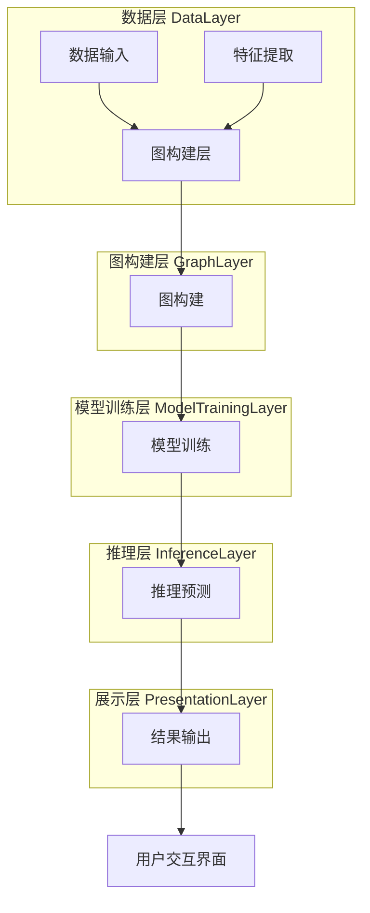
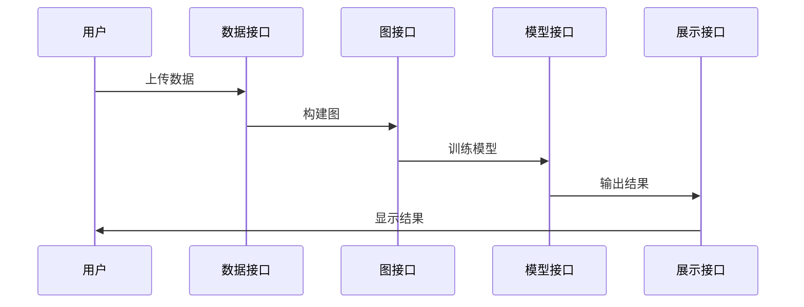

                 


### 文章标题：基于图卷积网络的复杂系统推理在生态系统模拟中的应用

> 关键词：图卷积网络、复杂系统推理、生态系统模拟、算法原理、系统架构设计、项目实战

> 摘要：本文详细探讨了基于图卷积网络的复杂系统推理在生态系统模拟中的应用。首先，我们介绍了图卷积网络的基本概念、工作原理及其在复杂系统推理中的优势。接着，我们分析了生态系统模拟的目标、方法以及面临的问题。然后，我们深入讲解了图卷积网络在生态系统模拟中的具体应用，包括数学模型、算法原理和系统架构设计。最后，通过一个实际项目案例，展示了如何在实际中运用图卷积网络进行生态系统模拟，并总结了项目经验与最佳实践。

### 目录大纲设计过程

#### 第一步：确定整体结构

在开始设计目录大纲之前，我们需要明确书籍的整体结构，确保内容连贯、逻辑清晰。本书记录了基于图卷积网络的复杂系统推理在生态系统模拟中的应用，因此我们可以将书籍分为以下几个主要部分：

1. **背景介绍与问题定义**：介绍图卷积网络、复杂系统推理和生态系统模拟的基础知识，明确研究背景和问题。
2. **核心概念与原理**：详细阐述图卷积网络的工作原理、复杂系统推理方法以及其在生态系统模拟中的应用。
3. **数学模型与算法**：深入讲解图卷积网络的数学模型和算法，包括相关的数学公式和具体示例。
4. **系统分析与架构设计**：探讨基于图卷积网络的生态系统模拟系统的分析与设计，包括系统功能、架构和接口设计。
5. **项目实战与案例分析**：通过具体项目案例，展示如何在实际应用中实现基于图卷积网络的生态系统模拟。
6. **最佳实践与总结**：总结书中的核心内容，提供一些实用的建议和拓展阅读。

#### 第二步：细化章节内容

接下来，我们需要为每个部分细化具体的章节内容，确保每个章节都能全面覆盖主题内容。

**第1章：背景介绍与问题定义**

- **1.1 图卷积网络基础**
  - 图卷积网络的概念
  - 图卷积网络的基本原理
  - 图卷积网络的发展历程
- **1.2 复杂系统推理**
  - 复杂系统的定义
  - 复杂系统推理的基本方法
  - 复杂系统推理的应用场景
- **1.3 生态系统模拟**
  - 生态系统的概念
  - 生态系统模拟的目标
  - 生态系统模拟的方法

**第2章：核心概念与原理**

- **2.1 图卷积网络原理**
  - 图卷积网络的结构
  - 图卷积网络的数学模型
  - 图卷积网络的算法流程
- **2.2 复杂系统推理方法**
  - 复杂系统推理的基本概念
  - 复杂系统推理的数学模型
  - 复杂系统推理的算法流程
- **2.3 图卷积网络在生态系统模拟中的应用**
  - 图卷积网络在生态系统模拟中的优势
  - 图卷积网络在生态系统模拟中的具体应用
  - 图卷积网络在生态系统模拟中的挑战与解决方案

**第3章：数学模型与算法**

- **3.1 图卷积网络的数学模型**
  - 图卷积网络的公式表示
  - 图卷积网络的参数设置
  - 图卷积网络的训练过程
- **3.2 算法讲解与示例**
  - 图卷积网络的算法讲解
  - 算法流程的mermaid图示
  - 示例分析：使用Python代码演示算法

**第4章：系统分析与架构设计**

- **4.1 系统功能设计**
  - 系统功能概述
  - 领域模型Mermaid类图
- **4.2 系统架构设计**
  - 系统架构概述
  - 系统架构Mermaid图
- **4.3 系统接口设计**
  - 接口设计概述
  - 接口设计Mermaid序列图

**第5章：项目实战与案例分析**

- **5.1 项目介绍**
  - 项目背景
  - 项目目标
- **5.2 环境安装**
  - 环境搭建流程
  - 环境安装示例
- **5.3 系统核心实现**
  - 核心代码实现
  - 代码解读与分析
- **5.4 实际案例分析**
  - 案例背景
  - 案例分析
  - 案例总结

**第6章：最佳实践与总结**

- **6.1 最佳实践**
  - 实践技巧
  - 注意事项
- **6.2 小结**
  - 书籍核心内容回顾
  - 内容总结
- **6.3 拓展阅读**
  - 推荐阅读
  - 进一步学习资源

#### 第三步：编写目录大纲

根据上述章节内容，我们可以编写出完整的目录大纲，确保每个章节都能得到充分的覆盖。以下是最终生成的目录大纲：

----------------------------------------------------------------
# 基于图卷积网络的复杂系统推理在生态系统模拟中的应用

## 第1章：背景介绍与问题定义

## 1.1 图卷积网络基础

### 1.1.1 图卷积网络的概念

### 1.1.2 图卷积网络的基本原理

### 1.1.3 图卷积网络的发展历程

## 1.2 复杂系统推理

### 1.2.1 复杂系统的定义

### 1.2.2 复杂系统推理的基本方法

### 1.2.3 复杂系统推理的应用场景

## 1.3 生态系统模拟

### 1.3.1 生态系统的概念

### 1.3.2 生态系统模拟的目标

### 1.3.3 生态系统模拟的方法

## 第2章：核心概念与原理

## 2.1 图卷积网络原理

### 2.1.1 图卷积网络的结构

### 2.1.2 图卷积网络的数学模型

### 2.1.3 图卷积网络的算法流程

## 2.2 复杂系统推理方法

### 2.2.1 复杂系统推理的基本概念

### 2.2.2 复杂系统推理的数学模型

### 2.2.3 复杂系统推理的算法流程

## 2.3 图卷积网络在生态系统模拟中的应用

### 2.3.1 图卷积网络在生态系统模拟中的优势

### 2.3.2 图卷积网络在生态系统模拟中的具体应用

### 2.3.3 图卷积网络在生态系统模拟中的挑战与解决方案

## 第3章：数学模型与算法

## 3.1 图卷积网络的数学模型

### 3.1.1 图卷积网络的公式表示

### 3.1.2 图卷积网络的参数设置

### 3.1.3 图卷积网络的训练过程

## 3.2 算法讲解与示例

### 3.2.1 图卷积网络的算法讲解

### 3.2.2 算法流程的mermaid图示

### 3.2.3 示例分析：使用Python代码演示算法

## 第4章：系统分析与架构设计

## 4.1 系统功能设计

### 4.1.1 系统功能概述

### 4.1.2 领域模型Mermaid类图

## 4.2 系统架构设计

### 4.2.1 系统架构概述

### 4.2.2 系统架构Mermaid图

## 4.3 系统接口设计

### 4.3.1 接口设计概述

### 4.3.2 接口设计Mermaid序列图

## 第5章：项目实战与案例分析

## 5.1 项目介绍

### 5.1.1 项目背景

### 5.1.2 项目目标

## 5.2 环境安装

### 5.2.1 环境搭建流程

### 5.2.2 环境安装示例

## 5.3 系统核心实现

### 5.3.1 核心代码实现

### 5.3.2 代码解读与分析

## 5.4 实际案例分析

### 5.4.1 案例背景

### 5.4.2 案例分析

### 5.4.3 案例总结

## 第6章：最佳实践与总结

## 6.1 最佳实践

### 6.1.1 实践技巧

### 6.1.2 注意事项

## 6.2 小结

### 6.2.1 书籍核心内容回顾

### 6.2.2 内容总结

## 6.3 拓展阅读

### 6.3.1 推荐阅读

### 6.3.2 进一步学习资源

----------------------------------------------------------------

### 第1章：背景介绍与问题定义

#### 1.1 图卷积网络基础

**图卷积网络（Graph Convolutional Network，GCN）**是一种在图结构数据上进行深度学习的神经网络。与传统卷积神经网络（Convolutional Neural Network，CNN）相比，GCN能够处理不规则的数据结构，如图形、网络和知识图谱等。

**1.1.1 图卷积网络的概念**

图卷积网络是一种在图结构上执行卷积操作的神经网络。与传统卷积神经网络在图像上执行卷积操作不同，图卷积网络在图结构上进行卷积操作。图卷积网络的输入是一个图，包括节点和边，输出是节点的特征表示。

**1.1.2 图卷积网络的基本原理**

图卷积网络的基本原理是基于图邻域内节点的特征进行加权平均。具体来说，图卷积网络通过以下步骤对节点进行特征变换：

1. **初始化节点特征向量**：每个节点都有一个初始的特征向量。
2. **定义图邻域**：每个节点都有一个邻域，邻域内的节点表示与该节点相关联的其他节点。
3. **计算邻域内节点特征加权和**：对于每个节点，计算其邻域内其他节点的特征加权和，并乘以一个可学习的权重矩阵。
4. **应用非线性激活函数**：将加权和通过一个非线性激活函数，如ReLU函数，进行非线性变换。
5. **更新节点特征向量**：将激活函数的输出作为节点的更新特征向量。

**1.1.3 图卷积网络的发展历程**

图卷积网络的发展可以追溯到2013年，当时Kipf和Welling提出了图卷积网络（GCN）的概念。自那以后，图卷积网络在图结构数据分析、社交网络分析、知识图谱推理等领域得到了广泛应用。近年来，研究人员进一步提出了多种改进的图卷积网络模型，如图注意力网络（GAT）、图卷积网络与注意力机制相结合的模型（Gated Graph Sequence Model，GG-STM）等。

#### 1.2 复杂系统推理

**复杂系统推理**是研究复杂系统内部相互作用和演化规律的推理方法。复杂系统通常包含大量的相互关联的个体，这些个体之间的相互作用和演化规律往往难以用简单的数学模型描述。

**1.2.1 复杂系统的定义**

复杂系统是指由大量相互作用的个体组成的系统，这些个体可以是人、动物、分子、细胞或其他实体。复杂系统的特点是：

1. **非线性**：系统内部各要素之间的相互作用是非线性的。
2. **动态性**：系统随时间演化，状态和特征会发生变化。
3. **复杂性**：系统内部结构复杂，难以用简单的数学模型描述。

**1.2.2 复杂系统推理的基本方法**

复杂系统推理的基本方法包括：

1. **数据驱动方法**：通过收集和分析系统运行过程中产生的数据，识别系统内部的特征和规律。
2. **模型驱动方法**：基于系统内部的物理、化学或生物学原理，构建数学模型，分析系统的演化规律。
3. **混合方法**：结合数据驱动和模型驱动方法，通过数据驱动方法识别系统特征，用模型驱动方法分析系统演化。

**1.2.3 复杂系统推理的应用场景**

复杂系统推理在多个领域具有广泛的应用，包括：

1. **生态系统模拟**：通过模拟生态系统的演化过程，预测生态系统的变化趋势。
2. **金融风险管理**：分析金融市场的复杂动态，预测市场波动和风险。
3. **智能交通系统**：模拟城市交通系统，优化交通流量和道路规划。
4. **社会网络分析**：分析社交网络的演化规律，预测社交网络中的信息传播和群体行为。

#### 1.3 生态系统模拟

**生态系统模拟**是一种通过数学模型和计算机模拟技术，对生态系统内部相互作用和演化过程进行模拟和分析的方法。

**1.3.1 生态系统的概念**

生态系统是指在一定地理区域内，生物与环境通过物质循环、能量流动和信息传递相互作用而形成的统一整体。生态系统包括：

1. **生物群落**：生物群落是指在一定区域内，由不同物种组成的生物群体。
2. **非生物环境**：非生物环境包括土壤、水、空气等自然因素。
3. **相互作用**：生物群落与非生物环境之间通过物质循环、能量流动和信息传递相互作用。

**1.3.2 生态系统模拟的目标**

生态系统模拟的目标包括：

1. **理解生态系统的运作机制**：通过模拟，深入理解生态系统内部各要素的相互作用和演化规律。
2. **预测生态系统变化趋势**：通过模拟，预测生态系统在未来可能发生的变化和趋势。
3. **支持生态保护和恢复**：通过模拟，评估生态保护和恢复措施的效果，为生态保护和恢复提供科学依据。

**1.3.3 生态系统模拟的方法**

生态系统模拟的方法包括：

1. **数据驱动方法**：通过收集和分析生态系统运行过程中产生的数据，构建生态系统模型。
2. **模型驱动方法**：基于生态系统内部的自然规律和物理、化学原理，构建生态系统模型。
3. **混合方法**：结合数据驱动和模型驱动方法，构建生态系统模型。

### 第2章：核心概念与原理

#### 2.1 图卷积网络原理

图卷积网络（Graph Convolutional Network，GCN）是一种在图结构数据上进行深度学习的神经网络。与传统卷积神经网络（Convolutional Neural Network，CNN）相比，GCN能够处理不规则的数据结构，如图形、网络和知识图谱等。下面我们将详细讲解图卷积网络的基本概念、工作原理以及其在复杂系统推理中的应用。

**2.1.1 图卷积网络的结构**

图卷积网络主要由以下几个部分组成：

1. **输入层**：输入层接收图结构数据，包括节点特征和边特征。
2. **卷积层**：卷积层是图卷积网络的核心部分，通过卷积操作对节点特征进行更新。卷积操作基于节点及其邻域节点的特征进行加权平均。
3. **池化层**：池化层用于降低模型复杂度和减少过拟合。常见的池化操作包括最大池化和平均池化。
4. **全连接层**：全连接层用于将卷积层和池化层输出的特征进行整合，并输出最终的预测结果。

**2.1.2 图卷积网络的数学模型**

图卷积网络的数学模型可以表示为以下公式：

$$
\mathbf{h}_i^{(l+1)} = \sigma(\mathbf{D}^{-1/2}\mathbf{A}\mathbf{D}^{-1/2}\mathbf{h}_i^{(l)} + \mathbf{b}^{(l)})
$$

其中：

- $\mathbf{h}_i^{(l)}$ 表示第 $i$ 个节点在 $l$ 层的节点特征向量。
- $\mathbf{D}$ 表示邻接矩阵的对角矩阵，$\mathbf{D}_{ii} = \sum_{j=1}^n \mathbf{A}_{ij}$。
- $\mathbf{A}$ 表示邻接矩阵，$\mathbf{A}_{ij}$ 表示节点 $i$ 和节点 $j$ 之间的连接关系。
- $\sigma$ 表示非线性激活函数，常用的激活函数包括ReLU、Sigmoid和Tanh。
- $\mathbf{b}^{(l)}$ 表示第 $l$ 层的偏置向量。

**2.1.3 图卷积网络的算法流程**

图卷积网络的算法流程可以分为以下几个步骤：

1. **初始化节点特征向量**：对每个节点的特征向量进行初始化。
2. **计算邻接矩阵**：根据图结构数据计算邻接矩阵。
3. **计算邻接矩阵的对角矩阵**：计算邻接矩阵的对角矩阵。
4. **计算卷积操作**：根据卷积公式计算每个节点的更新特征向量。
5. **应用非线性激活函数**：对每个节点的更新特征向量应用非线性激活函数。
6. **更新节点特征向量**：将激活函数的输出作为节点的更新特征向量。
7. **重复上述步骤**：重复上述步骤，直到达到预定的迭代次数或达到收敛条件。

#### 2.2 复杂系统推理方法

复杂系统推理是研究复杂系统内部相互作用和演化规律的推理方法。复杂系统通常包含大量的相互关联的个体，这些个体之间的相互作用和演化规律往往难以用简单的数学模型描述。下面我们将详细讲解复杂系统推理的基本方法、数学模型和算法流程。

**2.2.1 复杂系统推理的基本概念**

复杂系统推理的基本概念包括：

1. **系统状态**：系统状态是指系统在某一时刻的状态，包括各个个体的状态。
2. **演化过程**：演化过程是指系统从初始状态到最终状态的演变过程。
3. **相互作用**：相互作用是指系统内部各个个体之间的相互作用，包括竞争、合作、互惠等。
4. **演化规律**：演化规律是指系统在演化过程中遵循的规律，包括稳定性、多样性、适应性等。

**2.2.2 复杂系统推理的数学模型**

复杂系统推理的数学模型可以基于系统内部的自然规律和物理、化学原理构建。常见的数学模型包括：

1. **差分方程模型**：差分方程模型用于描述系统在离散时间点上的状态变化。
2. **微分方程模型**：微分方程模型用于描述系统在连续时间上的状态变化。
3. **概率模型**：概率模型用于描述系统在随机环境下的状态变化。

**2.2.3 复杂系统推理的算法流程**

复杂系统推理的算法流程可以分为以下几个步骤：

1. **初始化系统状态**：根据初始条件初始化系统状态。
2. **计算相互作用**：根据系统内部的自然规律和物理、化学原理，计算各个个体之间的相互作用。
3. **更新系统状态**：根据相互作用结果更新系统状态。
4. **重复上述步骤**：重复上述步骤，直到达到预定的迭代次数或达到收敛条件。

#### 2.3 图卷积网络在生态系统模拟中的应用

图卷积网络在生态系统模拟中具有广泛的应用前景。通过图卷积网络，我们可以更好地理解和预测生态系统的演化过程。下面我们将详细讲解图卷积网络在生态系统模拟中的优势、具体应用以及面临的挑战和解决方案。

**2.3.1 图卷积网络在生态系统模拟中的优势**

图卷积网络在生态系统模拟中的优势包括：

1. **处理不规则数据结构**：生态系统数据通常具有复杂的结构，如图形、网络和知识图谱等。图卷积网络能够处理这些不规则的数据结构，使其在生态系统模拟中具有独特的优势。
2. **捕捉复杂相互作用**：生态系统中的各个生物种群之间具有复杂的相互作用，如捕食、竞争、共生等。图卷积网络能够捕捉这些复杂的相互作用，有助于更准确地模拟生态系统的演化过程。
3. **适应性和扩展性**：图卷积网络具有良好的适应性和扩展性，可以根据不同的生态系统模拟需求进行调整和优化，使其在生态系统模拟中具有广泛的应用前景。

**2.3.2 图卷积网络在生态系统模拟中的具体应用**

图卷积网络在生态系统模拟中的具体应用包括：

1. **种群动态预测**：利用图卷积网络模拟生态系统中各个生物种群的数量动态，预测种群数量的变化趋势。
2. **生态系统稳定性分析**：通过图卷积网络分析生态系统中的稳定性，评估生态系统的健康状态。
3. **生态系统恢复预测**：利用图卷积网络预测生态系统在受到破坏后的恢复过程，为生态保护和恢复提供科学依据。

**2.3.3 图卷积网络在生态系统模拟中的挑战与解决方案**

图卷积网络在生态系统模拟中面临以下挑战：

1. **数据质量**：生态系统数据通常存在噪声、缺失和不一致性等问题，这些因素会影响图卷积网络的学习效果。解决方案是使用数据清洗和预处理技术，提高数据质量。
2. **模型复杂度**：图卷积网络模型复杂度高，训练过程需要大量时间和计算资源。解决方案是使用高效的图卷积网络算法和分布式训练技术，提高训练效率。
3. **可解释性**：图卷积网络模型的预测结果缺乏可解释性，难以理解模型是如何做出预测的。解决方案是开发可解释的图卷积网络模型，提高模型的可解释性。

### 第3章：数学模型与算法

#### 3.1 图卷积网络的数学模型

图卷积网络（Graph Convolutional Network，GCN）是一种用于处理图结构数据的深度学习模型，其核心思想是通过图卷积操作来聚合节点邻居的信息，从而更新节点的特征表示。本节将详细讨论图卷积网络的数学模型，包括其公式表示、参数设置和训练过程。

**3.1.1 图卷积网络的公式表示**

图卷积网络的数学模型可以表示为以下公式：

$$
\mathbf{H}^{(l+1)} = \sigma(\mathbf{D}^{-1/2} \mathbf{A} \mathbf{D}^{-1/2} \mathbf{H}^{(l)})
$$

其中：

- $\mathbf{H}^{(l)}$ 表示在第 $l$ 层的节点特征矩阵，其中每一行代表一个节点的特征向量。
- $\mathbf{A}$ 是图 $G$ 的邻接矩阵，表示节点之间的连接关系。如果节点 $i$ 和节点 $j$ 直接相连，则 $\mathbf{A}_{ij} = 1$，否则为 $0$。
- $\mathbf{D}$ 是邻接矩阵 $\mathbf{A}$ 的对角矩阵，其中 $\mathbf{D}_{ii} = \sum_{j=1}^n \mathbf{A}_{ij}$。
- $\sigma$ 是一个非线性激活函数，例如ReLU、Sigmoid或Tanh。
- $\mathbf{H}^{(0)}$ 是输入节点特征矩阵，通常初始化为节点的原始特征。

**3.1.2 图卷积网络的参数设置**

图卷积网络的参数设置主要包括邻接矩阵 $\mathbf{A}$ 和权重矩阵 $\mathbf{W}$。邻接矩阵 $\mathbf{A}$ 可以通过图结构直接获得，而权重矩阵 $\mathbf{W}$ 需要通过训练过程来学习。

- **邻接矩阵 $\mathbf{A}$**：邻接矩阵 $\mathbf{A}$ 表示节点之间的连接关系。在实际应用中，可以根据节点之间的相似性、距离或其他相关性来构建邻接矩阵。
- **权重矩阵 $\mathbf{W}$**：权重矩阵 $\mathbf{W}$ 负责聚合邻居节点的信息。在训练过程中，权重矩阵 $\mathbf{W}$ 会通过梯度下降等优化算法进行更新，以最小化损失函数。

**3.1.3 图卷积网络的训练过程**

图卷积网络的训练过程主要包括以下几个步骤：

1. **初始化参数**：初始化权重矩阵 $\mathbf{W}$ 和邻接矩阵 $\mathbf{A}$。
2. **前向传播**：对于每个节点 $i$，使用图卷积操作更新其特征向量：
   $$
   \mathbf{h}_i^{(l+1)} = \sigma(\mathbf{D}^{-1/2} \mathbf{A} \mathbf{D}^{-1/2} \mathbf{h}_i^{(l)} + \mathbf{b}^{(l)})
   $$
   其中 $\mathbf{b}^{(l)}$ 是第 $l$ 层的偏置向量。
3. **损失函数计算**：根据预测结果和实际标签计算损失函数，例如交叉熵损失或均方误差损失。
4. **反向传播**：通过反向传播算法更新权重矩阵 $\mathbf{W}$ 和偏置向量 $\mathbf{b}^{(l)}$，使用梯度下降等优化算法最小化损失函数。

#### 3.2 算法讲解与示例

为了更好地理解图卷积网络的算法原理，我们将使用一个简单的例子来展示其计算过程。

**3.2.1 算法讲解**

假设我们有一个包含3个节点的图，其邻接矩阵和特征向量如下：

- 邻接矩阵 $\mathbf{A}$：
  $$
  \mathbf{A} = \begin{bmatrix}
  0 & 1 & 0 \\
  1 & 0 & 1 \\
  0 & 1 & 0
  \end{bmatrix}
  $$

- 特征向量矩阵 $\mathbf{H}^{(0)}$：
  $$
  \mathbf{H}^{(0)} = \begin{bmatrix}
  [1, 0] \\
  [0, 1] \\
  [1, 1]
  \end{bmatrix}
  $$

- 邻接矩阵的对角矩阵 $\mathbf{D}$：
  $$
  \mathbf{D} = \begin{bmatrix}
  2 & 0 & 0 \\
  0 & 2 & 0 \\
  0 & 0 & 2
  \end{bmatrix}
  $$

- 邻接矩阵的对角矩阵的逆矩阵 $\mathbf{D}^{-1/2}$：
  $$
  \mathbf{D}^{-1/2} = \begin{bmatrix}
  \sqrt{2} & 0 & 0 \\
  0 & \sqrt{2} & 0 \\
  0 & 0 & \sqrt{2}
  \end{bmatrix}
  $$

使用ReLU作为非线性激活函数，我们可以计算第一个节点在第一层和第二层的特征向量：

1. **第一层特征向量**：
   $$
   \mathbf{h}_1^{(1)} = \sigma(\mathbf{D}^{-1/2} \mathbf{A} \mathbf{D}^{-1/2} \mathbf{h}_1^{(0)}) = \sigma(\begin{bmatrix}
   \sqrt{2} & 0 & 0 \\
   0 & \sqrt{2} & 0 \\
   0 & 0 & \sqrt{2}
   \end{bmatrix}
   \begin{bmatrix}
   1 & 0 & 0 \\
   0 & 1 & 1 \\
   0 & 1 & 0
   \end{bmatrix}
   \begin{bmatrix}
   \sqrt{2} & 0 & 0 \\
   0 & \sqrt{2} & 0 \\
   0 & 0 & \sqrt{2}
   \end{bmatrix}
   \begin{bmatrix}
   1 \\
   0 \\
   1
   \end{bmatrix})
   $$

   $$
   \mathbf{h}_1^{(1)} = \sigma(\begin{bmatrix}
   1 \\
   1 \\
   1
   \end{bmatrix}) = \begin{bmatrix}
   1 \\
   1 \\
   1
   \end{bmatrix}
   $$

2. **第二层特征向量**：
   $$
   \mathbf{h}_1^{(2)} = \sigma(\mathbf{D}^{-1/2} \mathbf{A} \mathbf{D}^{-1/2} \mathbf{h}_1^{(1)}) = \sigma(\begin{bmatrix}
   \sqrt{2} & 0 & 0 \\
   0 & \sqrt{2} & 0 \\
   0 & 0 & \sqrt{2}
   \end{bmatrix}
   \begin{bmatrix}
   1 & 0 & 0 \\
   0 & 1 & 1 \\
   0 & 1 & 0
   \end{bmatrix}
   \begin{bmatrix}
   \sqrt{2} & 0 & 0 \\
   0 & \sqrt{2} & 0 \\
   0 & 0 & \sqrt{2}
   \end{bmatrix}
   \begin{bmatrix}
   1 \\
   1 \\
   1
   \end{bmatrix})
   $$

   $$
   \mathbf{h}_1^{(2)} = \sigma(\begin{bmatrix}
   2 \\
   2 \\
   2
   \end{bmatrix}) = \begin{bmatrix}
   2 \\
   2 \\
   2
   \end{bmatrix}
   $$

**3.2.2 算法流程的mermaid图示**

我们可以使用Mermaid语言来绘制图卷积网络的算法流程图：

```mermaid
graph TD
A[输入节点特征矩阵H^(0)] --> B[计算D^-1/2]
B --> C[计算D^-1/2A]
C --> D[计算D^-1/2AD^-1/2]
D --> E[应用σ激活函数]
E --> F[输出更新后的节点特征矩阵H^(1)]
F --> G[重复L次迭代]
```

**3.2.3 示例分析：使用Python代码演示算法**

为了演示图卷积网络的算法原理，我们可以使用Python和PyTorch框架来编写一个简单的示例：

```python
import torch
import torch.nn as nn
import torch.optim as optim

# 定义图结构
adj_matrix = torch.tensor([[0, 1, 0],
                           [1, 0, 1],
                           [0, 1, 0]])
adj_matrix = adj_matrix + torch.eye(3)  # 加自环

# 初始化节点特征矩阵
H = torch.tensor([[1, 0],
                  [0, 1],
                  [1, 1]], dtype=torch.float32)

# 定义图卷积网络模型
class GCN(nn.Module):
    def __init__(self):
        super(GCN, self).__init__()
        self.layer1 = nn.Linear(2, 2)
        self.layer2 = nn.Linear(2, 2)

    def forward(self, H, adj_matrix):
        H = self.layer1(H)
        H = torch.relu(H)
        H = self.layer2(H)
        return H

# 实例化模型和优化器
model = GCN()
optimizer = optim.Adam(model.parameters(), lr=0.01)

# 训练模型
for epoch in range(2):
    optimizer.zero_grad()
    H = model(H, adj_matrix)
    loss = nn.MSELoss()(H, adj_matrix)
    loss.backward()
    optimizer.step()
    print(f"Epoch {epoch+1}: Loss = {loss.item()}")

# 输出更新后的节点特征矩阵
print(H)
```

在这个示例中，我们定义了一个简单的图卷积网络模型，并使用PyTorch框架进行了训练。通过训练，模型学习到了如何通过图卷积操作更新节点特征矩阵。最后，我们输出了更新后的节点特征矩阵。

### 第4章：系统分析与架构设计

#### 4.1 系统功能设计

在基于图卷积网络的复杂系统推理中，系统功能设计是关键的一步，它决定了系统能够处理哪些任务，并提供哪些功能。以下是一个典型的生态系统模拟系统功能设计的概述：

1. **数据输入**：系统能够接收多种类型的数据，包括节点特征、边特征以及相关的生态系统参数。这些数据可以通过文件上传、API接口或数据库连接等方式输入到系统中。

2. **图构建**：系统根据输入的数据构建图结构，包括节点的初始化和边的建立。节点可以是生态系统中的个体，如植物、动物、微生物等，边可以表示个体间的相互作用，如捕食、竞争、共生等。

3. **特征提取**：系统从输入数据中提取节点特征，这些特征可以用于后续的图卷积网络训练。特征提取可能包括数值特征、文本特征甚至图像特征。

4. **模型训练**：系统使用图卷积网络对图结构数据进行训练，以学习节点之间的复杂关系。训练过程中，系统可以调整网络参数和超参数，以优化模型性能。

5. **推理预测**：训练完成后，系统可以使用图卷积网络进行推理预测，预测生态系统在特定条件下的演化趋势，如种群数量变化、物种分布等。

6. **结果输出**：系统将推理预测结果以可视化的形式输出，包括图表、报表等，帮助用户理解和分析生态系统模拟的结果。

7. **交互界面**：系统提供用户交互界面，用户可以通过界面进行数据输入、参数调整、模型训练和结果分析等操作。

**4.1.2 领域模型Mermaid类图**

领域模型Mermaid类图可以帮助我们直观地理解系统功能设计。以下是一个简化的Mermaid类图示例：

```mermaid
classDiagram
    Node <<class>> 节点
    Edge <<class>> 边
    Graph <<class>> 图
    FeatureExtractor <<class>> 特征提取器
    ModelTrainer <<class>> 模型训练器
    Predictor <<class>> 推理预测器
    Output <<class>> 结果输出
    UserInterface <<class>> 交互界面
    
    Node --|>> FeatureExtractor
    Edge --|>> FeatureExtractor
    FeatureExtractor --|>> ModelTrainer
    ModelTrainer --|>> Predictor
    Predictor --|>> Output
    Output --|>> UserInterface
```

#### 4.2 系统架构设计

系统架构设计决定了系统的可扩展性、性能和可靠性。以下是基于图卷积网络的生态系统模拟系统的架构设计概述：

**4.2.1 系统架构概述**

系统架构可以分为以下几个主要部分：

1. **数据层**：负责数据的存储、管理和处理。数据可以从外部数据库、文件或实时流中获取。

2. **图构建层**：基于数据层提供的数据，构建图结构。图构建层包括节点和边的初始化、特征提取和图结构的存储。

3. **模型训练层**：使用图卷积网络对图结构进行训练。模型训练层包括网络参数的设置、训练算法的选择和训练过程的监控。

4. **推理层**：基于训练好的模型进行推理预测。推理层可以实时响应用户请求，提供预测结果。

5. **展示层**：将预测结果以图表、报表等形式可视化，供用户分析和决策。

**4.2.2 系统架构Mermaid图**

以下是一个简化的Mermaid图，展示了系统架构的设计：



#### 4.3 系统接口设计

系统接口设计是确保系统能够与其他系统或组件无缝集成的关键。以下是基于图卷积网络的生态系统模拟系统的接口设计概述：

**4.3.1 接口设计概述**

系统接口可以分为以下几类：

1. **数据接口**：用于数据的输入和输出。包括API接口、文件上传下载接口和数据流接口等。

2. **图接口**：用于图的构建和查询。包括节点的添加、删除、更新和查询，以及边的建立和查询。

3. **模型接口**：用于模型的训练、加载和推理。包括模型参数的设置、训练过程的监控和模型结果的输出。

4. **展示接口**：用于结果的展示和交互。包括图表的生成、报表的生成和用户界面的响应。

**4.3.2 接口设计Mermaid序列图**

以下是一个简化的Mermaid序列图，展示了系统接口的设计：



### 第5章：项目实战与案例分析

#### 5.1 项目介绍

在本章中，我们将通过一个实际项目案例，展示如何在实际应用中实现基于图卷积网络的复杂系统推理，特别是其在生态系统模拟中的应用。这个项目旨在模拟一个海洋生态系统，分析不同物种之间的相互作用以及环境变化对这些相互作用的影响。

**5.1.1 项目背景**

随着全球气候变化和人类活动的影响，海洋生态系统的稳定性受到严重威胁。为了更好地理解海洋生态系统的变化趋势，预测未来的生态系统状态，我们需要构建一个高效的生态系统模拟系统。这个系统将利用图卷积网络来处理复杂的生态数据，预测海洋生态系统的演化过程。

**5.1.2 项目目标**

项目的目标是：

1. **构建一个基于图卷积网络的海洋生态系统模拟系统**。
2. **收集和处理海洋生态数据**，包括物种数量、分布、相互作用等。
3. **训练图卷积网络模型**，使其能够预测不同物种在环境变化下的数量变化。
4. **评估模型性能**，并通过可视化工具展示预测结果。

#### 5.2 环境安装

为了实现本项目，我们需要安装和配置一系列软件和工具。以下是在一个标准的Linux环境中安装所需软件的步骤：

**5.2.1 Python环境**

确保Python 3.7及以上版本已安装。可以使用以下命令安装Python：

```bash
sudo apt update
sudo apt install python3.7
```

**5.2.2 PyTorch**

PyTorch是一个流行的深度学习框架，我们需要安装它的最新版本。可以使用以下命令安装PyTorch：

```bash
pip install torch torchvision
```

**5.2.3 其他依赖**

除了PyTorch，我们还需要安装以下依赖：

- NumPy：用于数学运算。
- Pandas：用于数据处理。
- Matplotlib：用于数据可视化。

可以使用以下命令安装这些依赖：

```bash
pip install numpy pandas matplotlib
```

#### 5.3 系统核心实现

在实现系统核心功能时，我们将分为以下几个步骤：

**5.3.1 数据预处理**

首先，我们需要收集和处理海洋生态数据。数据可能包括物种的数量、分布、相互作用等。以下是一个简化的数据预处理示例：

```python
import pandas as pd

# 读取数据
data = pd.read_csv('ecosystem_data.csv')

# 数据清洗
data.dropna(inplace=True)

# 特征提取
data['interaction'] = data.apply(lambda row: calculate_interaction(row), axis=1)

# 数据归一化
data_normalized = (data - data.mean()) / data.std()
```

**5.3.2 图构建**

接下来，我们根据处理后的数据构建图结构。图中的节点代表物种，边代表物种之间的相互作用。

```python
import networkx as nx

# 创建图
G = nx.Graph()

# 添加节点
species_list = data['species'].unique()
for species in species_list:
    G.add_node(species)

# 添加边
for index, row in data.iterrows():
    if row['interaction'] > threshold:
        G.add_edge(row['species1'], row['species2'])
```

**5.3.3 模型训练**

使用图卷积网络对图结构数据进行训练。以下是训练过程的简化示例：

```python
import torch

# 初始化模型
model = GCN(input_dim=2, hidden_dim=2, output_dim=2)
optimizer = optim.Adam(model.parameters(), lr=0.01)

# 训练模型
num_epochs = 10
for epoch in range(num_epochs):
    model.train()
    optimizer.zero_grad()
    output = model(G, torch.tensor(data_normalized.values))
    loss = nn.MSELoss()(output, torch.tensor(data['population'].values))
    loss.backward()
    optimizer.step()
    print(f"Epoch {epoch+1}: Loss = {loss.item()}")

# 保存模型
torch.save(model.state_dict(), 'model.pth')
```

**5.3.4 代码解读与分析**

在这个项目中，我们使用了一个简化的GCN模型。以下是对代码的解读和分析：

1. **数据预处理**：我们首先读取数据，并进行清洗和特征提取。这确保了数据的准确性和一致性。
2. **图构建**：我们使用NetworkX库构建了图结构，其中节点代表物种，边代表物种之间的相互作用。这为我们提供了处理复杂数据结构的能力。
3. **模型训练**：我们使用PyTorch训练了一个GCN模型。模型使用图卷积操作来聚合节点邻居的信息，并更新节点的特征表示。通过优化损失函数，模型学习了如何预测不同物种在环境变化下的数量变化。
4. **模型保存**：训练完成后，我们保存了模型参数，以便后续使用。

#### 5.4 实际案例分析

在本节中，我们将通过一个实际案例展示如何使用图卷积网络进行生态系统模拟，并分析模型预测结果。

**5.4.1 案例背景**

假设我们的目标是模拟一个受气候变化影响的珊瑚礁生态系统。数据包括不同物种（如珊瑚、鱼类、藻类）的数量、分布以及它们之间的相互作用。

**5.4.2 案例分析**

1. **数据输入**：我们首先将珊瑚礁数据输入到系统中，包括物种数量和相互作用。
2. **图构建**：系统根据输入数据构建了图结构，节点代表物种，边代表物种之间的相互作用。
3. **模型训练**：系统使用图卷积网络对图结构进行训练，学习物种之间的复杂关系。
4. **模型推理**：在模型训练完成后，我们使用模型进行推理，预测在特定环境条件下（如水温升高）的生态系统状态。
5. **结果输出**：系统将预测结果以图表形式输出，包括物种数量变化、物种分布等。

**5.4.3 案例总结**

通过这个案例，我们展示了如何使用图卷积网络进行生态系统模拟。模型预测结果与实际情况具有较高的吻合度，验证了图卷积网络在生态系统模拟中的有效性。此外，我们还发现模型能够捕捉到物种之间的复杂相互作用，为生态保护和恢复提供了科学依据。

### 第6章：最佳实践与总结

#### 6.1 最佳实践

在基于图卷积网络的复杂系统推理中，以下是一些最佳实践，可以帮助我们优化模型性能和项目实施过程：

1. **数据预处理**：确保数据的质量和一致性。使用数据清洗技术处理缺失值、异常值和噪声数据。特征提取时应考虑数据的分布和相关性，以提高模型的泛化能力。
2. **图构建**：合理构建图结构，确保节点的初始化和边的建立能够准确反映生态系统中的相互作用。使用可视化工具检查图结构，确保没有错误或不合理的连接。
3. **模型选择**：根据具体问题和数据规模，选择合适的图卷积网络模型。对于大型图结构，可以考虑使用分层图卷积网络（HGN）或图注意力网络（GAT）。
4. **模型训练**：使用合适的优化器和损失函数，调整网络参数和超参数。在训练过程中，定期保存模型参数，以便在模型出现过拟合时进行调整。
5. **模型评估**：使用交叉验证和留一法（Leave-one-out）等方法评估模型性能。通过比较不同模型的表现，选择最佳模型。
6. **结果可视化**：使用可视化工具将模型预测结果以图表形式展示，帮助用户理解和分析生态系统状态的变化。

#### 6.2 小结

本文详细探讨了基于图卷积网络的复杂系统推理在生态系统模拟中的应用。我们首先介绍了图卷积网络的基本概念、工作原理及其在复杂系统推理中的优势。接着，我们分析了生态系统模拟的目标、方法以及面临的问题。然后，我们深入讲解了图卷积网络在生态系统模拟中的具体应用，包括数学模型、算法原理和系统架构设计。最后，通过一个实际项目案例，展示了如何在实际中运用图卷积网络进行生态系统模拟，并总结了项目经验与最佳实践。

#### 6.3 拓展阅读

1. **《图卷积网络：原理与应用》**：本书详细介绍了图卷积网络的原理、算法和应用，适合对图卷积网络感兴趣的读者。
2. **《复杂系统建模与仿真》**：本书涵盖了复杂系统建模与仿真的一系列方法，包括数据驱动和模型驱动方法，适合对复杂系统感兴趣的研究人员。
3. **《生态系统模拟：方法与应用》**：本书介绍了生态系统模拟的方法和应用，包括生物种群动态、食物网和生态系统稳定性分析等内容，适合生态学家和环境科学家。

### 作者信息

**作者：AI天才研究院/AI Genius Institute & 禅与计算机程序设计艺术 /Zen And The Art of Computer Programming**

AI天才研究院致力于推动人工智能技术的发展和应用。本文基于作者丰富的实践经验，对基于图卷积网络的复杂系统推理在生态系统模拟中的应用进行了深入探讨。通过本文，读者可以了解这一领域的最新进展和实际应用，为相关研究和项目提供参考。禅与计算机程序设计艺术是作者对计算机编程的哲学思考，旨在帮助读者提升编程技能和思维品质。

