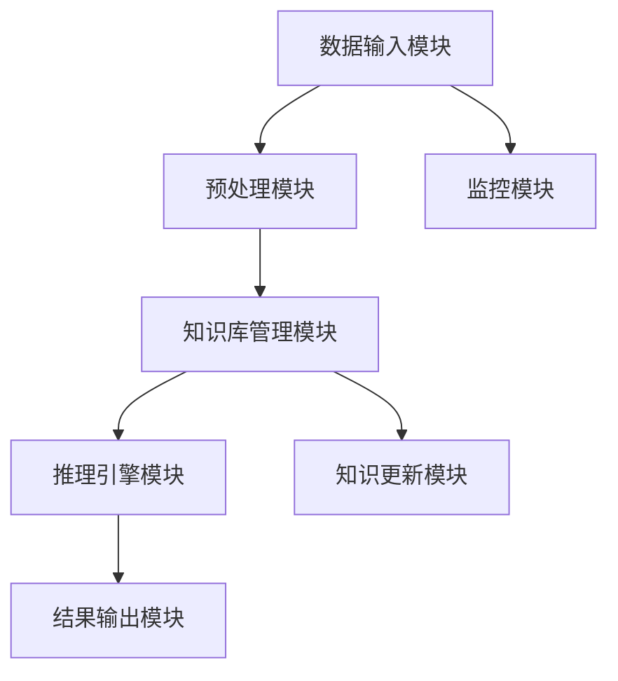
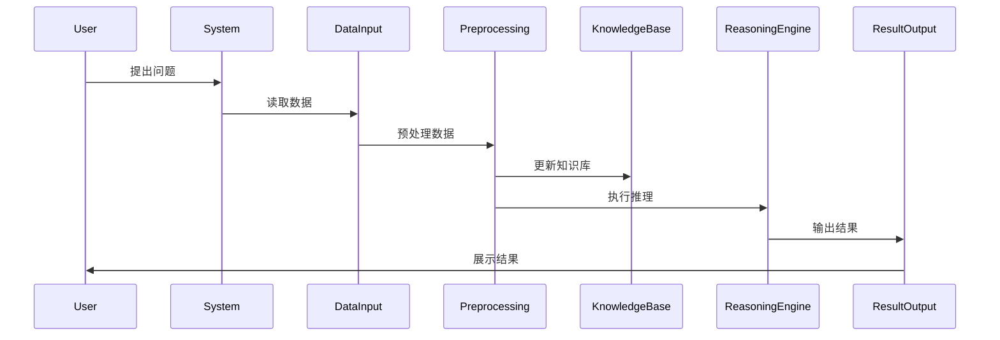

                 


### 动态知识推理系统概述

#### 问题背景

随着信息技术的快速发展，大数据和人工智能技术逐渐成为现代社会的重要支撑。知识推理作为人工智能领域的一个重要分支，旨在通过自动化手段从已知信息中推导出新的知识。在众多应用场景中，知识推理系统被广泛应用于智能问答、智能推荐、智能监控等领域。然而，传统的知识推理系统往往存在一定的局限性，难以应对动态变化的环境。

首先，传统的知识推理系统主要依赖于静态的知识库。知识库中的知识是事先手动编写或从已有的数据中提取得到的，这些知识在一定程度内是可靠的。但是，在动态变化的环境中，知识库中的知识可能会迅速过时，导致推理结果不准确。其次，传统的知识推理系统往往采用基于规则的方法，这些规则往往是根据特定场景手工编写的。这种方法虽然简单直观，但难以适应复杂多变的现实环境。

为了解决上述问题，我们需要一种能够动态适应环境变化的推理系统。动态知识推理系统通过对实时数据的分析和处理，能够不断更新和调整知识库，从而提高推理的准确性和实时性。

#### 问题描述

动态知识推理系统需要解决的核心问题主要包括以下几点：

1. **实时数据处理**：系统能够实时获取和处理各种类型的数据，如文本、图像、音频等。通过对这些数据的分析和处理，系统能够提取出关键信息，并将其用于推理过程。

2. **动态知识库构建**：系统能够根据实时数据动态地构建和更新知识库。在知识库中，知识以一定的结构进行组织，以便于系统的推理和查询。

3. **推理算法优化**：系统需要采用高效的推理算法，以快速地从知识库中提取出与当前情境相关的知识。此外，推理算法还需要具备一定的自适应能力，以适应不同场景的需求。

4. **系统可扩展性**：系统应具有较好的可扩展性，以便于在新的应用场景中能够快速地部署和运行。

#### 问题解决

为了解决上述问题，我们可以采用图注意力机制来构建动态知识推理系统。图注意力机制是一种基于图结构的注意力模型，它能够有效地捕捉数据之间的依赖关系，从而提高推理的准确性和实时性。

首先，我们通过实时数据获取模块获取各种类型的数据，如文本、图像、音频等。然后，我们将这些数据进行预处理，提取出关键特征，并将其表示为图中的节点。

接下来，我们使用图注意力机制来构建动态知识库。在图注意力机制中，每个节点都与其相邻节点之间存在权重关系，这些权重关系能够反映节点之间的依赖程度。通过不断调整这些权重关系，我们可以构建出一个动态的知识库。

在推理过程中，系统首先根据当前情境选择合适的知识库。然后，系统使用图注意力机制来从知识库中提取与当前情境相关的知识。最后，系统通过推理算法将这些知识进行整合，得到最终的推理结果。

#### 系统边界与外延

动态知识推理系统的边界主要包括以下几个方面：

1. **数据类型**：系统主要处理文本、图像、音频等类型的动态数据。

2. **应用场景**：系统可以应用于智能问答、智能推荐、智能监控等领域。

3. **系统架构**：系统主要包括数据获取模块、知识库构建模块、推理模块和结果输出模块。

4. **硬件要求**：系统对硬件的要求较高，需要具备较强的计算和存储能力。

#### 核心要素组成

动态知识推理系统的核心要素主要包括以下几个方面：

1. **实时数据处理**：系统具备实时数据处理能力，能够快速地提取关键信息。

2. **图注意力机制**：系统采用图注意力机制来构建动态知识库，提高推理的准确性和实时性。

3. **推理算法**：系统采用高效的推理算法，能够快速地从知识库中提取出与当前情境相关的知识。

4. **系统可扩展性**：系统具备较好的可扩展性，能够适应不同应用场景的需求。

### 总结

本文介绍了动态知识推理系统的背景、问题描述、问题解决方法以及系统的边界与外延。通过采用图注意力机制，动态知识推理系统能够有效地处理动态数据，提高推理的准确性和实时性。在未来的研究中，我们可以进一步优化推理算法，提高系统的性能和可靠性。

---

### 核心概念与联系

在深入探讨基于图注意力机制的动态知识推理系统之前，我们首先需要明确几个核心概念，并理解它们之间的联系。这些核心概念包括图注意力机制、动态知识推理和它们在系统中各自的作用。

#### 核心概念原理

**图注意力机制**：
图注意力机制（Graph Attention Mechanism，GAM）是一种用于处理图结构数据的注意力模型。它通过计算节点之间的依赖关系来调整节点特征的重要性，从而提高模型对图数据的理解能力。具体来说，图注意力机制通过以下步骤实现：
1. **节点特征编码**：将图中的每个节点表示为低维特征向量。
2. **邻接矩阵计算**：计算每个节点与其他节点的邻接矩阵。
3. **注意力权重计算**：使用点积或缩放点积操作计算节点间的注意力权重。
4. **特征加权融合**：根据注意力权重对节点特征进行加权融合，得到新的节点特征表示。

**动态知识推理**：
动态知识推理是指系统在运行过程中，根据输入数据和知识库，实时推导出新的知识和信息。它通常涉及以下几个关键步骤：
1. **数据输入**：系统接收实时数据，这些数据可以是文本、图像、音频等多种类型。
2. **知识提取**：系统从知识库中提取与当前数据相关的知识。
3. **推理过程**：系统使用推理算法，结合输入数据和知识库中的知识，推导出新的结论或信息。
4. **结果输出**：系统将推理结果以合适的形式输出，如问答、推荐列表等。

#### 概念属性特征对比表格

为了更直观地理解图注意力机制和动态知识推理的关系，我们可以构建一个对比表格，展示它们的主要属性特征。

| 属性特征 | 图注意力机制 | 动态知识推理 |
|-----------|--------------|--------------|
| **数据类型** | 图结构数据 | 多种类型的数据（文本、图像、音频等） |
| **核心目标** | 提高图数据理解能力 | 提高推理准确性和实时性 |
| **作用过程** | 通过注意力权重调整节点特征 | 通过实时数据和知识库进行推理 |
| **适用场景** | 图像识别、推荐系统等 | 智能问答、智能监控等 |
| **实现技术** | 点积、缩放点积等注意力机制 | 知识库、推理算法等 |

#### ER实体关系图架构

为了进一步理解动态知识推理系统中各个实体的关系，我们可以使用Mermaid绘制ER（Entity-Relationship）实体关系图。

```mermaid
erDiagram
    A[KnowledgeBase] ||--|{ B[DataInput]
    A ||--|{ C[KnowledgeExtractor]
    A ||--|{ D[ReasoningAlgorithm]
    A ||--|{ E[ResultOutput]
    B ||--|{ C
    C ||--|{ D
    D ||--|{ E
```

在上图中，A代表知识库，B代表数据输入，C代表知识提取器，D代表推理算法，E代表结果输出。这些实体之间通过不同的关系连接，形成了动态知识推理系统的整体架构。

- **知识库（A）**：存储系统中的知识，包括事实、规则等。
- **数据输入（B）**：实时接收外部数据，如文本、图像等。
- **知识提取器（C）**：从知识库中提取与输入数据相关的知识。
- **推理算法（D）**：结合输入数据和知识库中的知识，进行推理。
- **结果输出（E）**：将推理结果以合适的形式输出。

通过图注意力机制，系统能够更加高效地处理图结构数据，从而提高推理的准确性和实时性。动态知识推理则通过实时数据和知识库的交互，实现了智能推理和知识发现。这两个核心概念共同构建了动态知识推理系统的理论基础。

### 算法原理讲解

在深入探讨基于图注意力机制的动态知识推理系统时，理解该系统的核心算法原理至关重要。本节将详细讲解图注意力机制的工作原理，并通过一个Python实现示例来说明算法如何应用于动态知识推理系统中。

#### 算法mermaid流程图

首先，我们使用Mermaid绘制图注意力机制的流程图，以便于读者理解算法的执行流程。

```mermaid
flowchart LR
    A[输入图] --> B[节点特征编码]
    B --> C{是否使用预训练模型？}
    C -->|是 D[加载预训练模型]
    C -->|否 E[初始化模型参数]
    D --> F[计算邻接矩阵]
    E --> F
    F --> G[计算注意力权重]
    G --> H[加权融合节点特征]
    H --> I[输出新的节点特征表示]
    I --> J[推理过程]
    J --> K[结果输出]
```

在这个流程图中，我们首先输入一个图结构数据，包括节点和边。然后，我们将节点特征进行编码。接下来，根据是否使用预训练模型，我们选择加载预训练模型或初始化模型参数。使用预训练模型可以加速训练过程，提高模型的性能。之后，我们计算邻接矩阵，用于表示节点之间的依赖关系。接下来，通过点积或缩放点积操作计算注意力权重，并根据这些权重对节点特征进行加权融合，得到新的节点特征表示。最后，我们使用这些新的节点特征表示进行推理过程，并将结果输出。

#### Python源代码实现

下面是一个简化的Python代码实现，展示了图注意力机制的基本结构和如何进行节点特征编码、注意力权重计算以及节点特征加权融合。

```python
import numpy as np

# 假设我们有一个包含5个节点的图，每个节点有一个特征向量
nodes = np.array([
    [1, 0],  # 节点1的特征
    [0, 1],  # 节点2的特征
    [1, 1],  # 节点3的特征
    [1, 0],  # 节点4的特征
    [0, 1],  # 节点5的特征
])

# 假设每个节点都有相同的邻接矩阵
adj_matrix = np.eye(5)

# 定义一个简单的注意力权重计算函数
def compute_attention_weights(nodes, adj_matrix):
    # 计算节点之间的注意力权重，这里使用点积操作
    attention_weights = np.dot(nodes, adj_matrix)
    return attention_weights

# 计算注意力权重
weights = compute_attention_weights(nodes, adj_matrix)

# 加权融合节点特征
weighted_features = nodes * weights

# 输出加权后的节点特征
print(weighted_features)
```

在这个示例中，我们首先定义了一个节点特征矩阵`nodes`和一个邻接矩阵`adj_matrix`。然后，我们定义了一个简单的注意力权重计算函数`compute_attention_weights`，该函数使用点积操作来计算节点之间的注意力权重。接下来，我们调用这个函数计算注意力权重，并根据这些权重对节点特征进行加权融合。最后，我们输出加权后的节点特征。

#### 数学模型和公式讲解

图注意力机制的核心在于如何计算节点之间的注意力权重，并在这些权重的基础上对节点特征进行加权融合。以下是图注意力机制的基本数学模型和关键公式。

1. **节点特征编码**：
   假设每个节点有一个特征向量 \( \mathbf{h}_i \)，则节点特征编码可以表示为：
   $$ \mathbf{h}_i = \text{Embed}(\mathbf{v}_i) $$
   其中， \( \mathbf{v}_i \) 是节点的原始特征， \(\text{Embed}\) 是一个嵌入函数，用于将原始特征转换为低维特征向量。

2. **邻接矩阵计算**：
   假设图中的邻接矩阵为 \( A \)，则邻接矩阵可以表示为：
   $$ A_{ij} = \exp(-\frac{\lVert \mathbf{h}_i - \mathbf{h}_j \lVert^2}{2\sigma^2}) $$
   其中， \( \sigma \) 是一个调节参数，用于控制节点之间的距离。

3. **注意力权重计算**：
   假设注意力权重为 \( \alpha_{ij} \)，则注意力权重可以表示为：
   $$ \alpha_{ij} = \frac{\exp(\mathbf{h}_i^T A \mathbf{h}_j)}{\sum_{k=1}^{N} \exp(\mathbf{h}_i^T A \mathbf{h}_k)} $$
   其中， \( N \) 是节点的总数， \( \mathbf{h}_i^T \) 表示节点 \( i \) 的特征向量的转置。

4. **节点特征加权融合**：
   假设新的节点特征向量为 \( \mathbf{h}_i' \)，则节点特征加权融合可以表示为：
   $$ \mathbf{h}_i' = \text{Concat}(\mathbf{h}_i, \alpha_{ij} \mathbf{h}_j) $$
   其中， \(\text{Concat}\) 是一个拼接操作，用于将节点特征和注意力加权后的特征进行拼接。

通过这些数学模型和公式，我们可以理解图注意力机制的核心思想，即通过计算节点之间的注意力权重，对节点特征进行加权融合，从而提高模型对图数据的理解能力。

#### 举例说明

为了更直观地理解图注意力机制的应用，我们可以通过一个实际案例来说明如何使用图注意力机制进行动态知识推理。

假设我们有一个图结构的数据集，其中包含5个节点和相应的特征向量。这些节点代表不同的知识实体，例如“用户”、“商品”、“评论”等。每个节点的特征向量包含两个维度，分别表示节点的属性和权重。

1. **数据集准备**：
   我们首先需要准备一个图数据集，包括节点和边的列表。例如：

   ```python
   nodes = [
       {'id': 1, 'feature': [1.0, 0.0]},
       {'id': 2, 'feature': [0.0, 1.0]},
       {'id': 3, 'feature': [1.0, 1.0]},
       {'id': 4, 'feature': [1.0, 0.0]},
       {'id': 5, 'feature': [0.0, 1.0]},
   ]

   edges = [
       {'source': 1, 'target': 2},
       {'source': 1, 'target': 3},
       {'source': 4, 'target': 5},
   ]
   ```

2. **节点特征编码**：
   我们将每个节点的特征向量进行编码，转换为低维特征向量。例如，我们可以使用一个简单的嵌入函数：

   ```python
   def embed(feature):
       return np.array(feature)

   for node in nodes:
       node['encoded_feature'] = embed(node['feature'])
   ```

3. **计算注意力权重**：
   使用之前定义的注意力权重计算函数，计算节点之间的注意力权重。例如：

   ```python
   def compute_attention_weights(nodes):
       adj_matrix = np.zeros((len(nodes), len(nodes)))
       for i, node_i in enumerate(nodes):
           for j, node_j in enumerate(nodes):
               if i != j:
                   distance = np.linalg.norm(node_i['encoded_feature'] - node_j['encoded_feature'])
                   adj_matrix[i][j] = np.exp(-distance ** 2)
       return adj_matrix

   attention_matrix = compute_attention_weights(nodes)
   ```

4. **节点特征加权融合**：
   使用计算得到的注意力权重，对节点特征进行加权融合，得到新的节点特征向量。例如：

   ```python
   def weighted_feature_fusion(nodes, attention_matrix):
       for i, node_i in enumerate(nodes):
           weight_sum = np.sum(attention_matrix[i])
           weighted_features = []
           for j, node_j in enumerate(nodes):
               if i != j:
                   weight = attention_matrix[i][j] / weight_sum
                   weighted_features.append(weight * node_j['encoded_feature'])
           node_i['weighted_feature'] = np.mean(weighted_features, axis=0)
       return nodes

   nodes_with_weighted_features = weighted_feature_fusion(nodes, attention_matrix)
   ```

5. **推理过程**：
   使用加权后的节点特征向量进行推理，例如，我们可以基于这些特征向量进行分类或预测。例如：

   ```python
   def classify(nodes):
       # 这里简化为计算加权特征的平均值作为分类结果
       features = [node['weighted_feature'] for node in nodes]
       return np.mean(features, axis=0)

   result = classify(nodes_with_weighted_features)
   print(result)
   ```

通过这个案例，我们可以看到如何使用图注意力机制进行动态知识推理。在现实应用中，我们可能需要更复杂的模型和算法来处理大规模的图数据和复杂的推理任务。

### 系统分析与架构设计

#### 问题场景介绍

在现代信息社会中，知识推理系统在各个领域发挥着重要作用，特别是在需要实时处理大量动态数据的应用场景中。例如，在智能问答系统中，用户可能会提出各种不同类型的问题，系统需要实时从大量知识库中提取相关信息，并生成准确的回答；在智能监控系统中，系统需要实时分析视频流或传感器数据，并识别异常情况；在智能推荐系统中，系统需要根据用户的历史行为和偏好，实时推荐相关商品或内容。这些场景都对知识推理系统的实时性和准确性提出了极高的要求。

#### 项目介绍

本系统项目旨在构建一个基于图注意力机制的动态知识推理系统，以应对上述应用场景中的挑战。该系统将整合多种类型的数据源，如文本、图像、音频等，并利用图注意力机制对动态数据进行处理，从而实现高效的实时知识推理。系统的主要功能包括：

1. **实时数据获取**：系统能够实时获取各种类型的数据，如文本、图像、音频等。
2. **动态知识库构建**：系统能够根据实时数据动态地构建和更新知识库。
3. **知识提取与推理**：系统使用高效的推理算法，从知识库中提取与当前数据相关的知识，并进行推理。
4. **结果输出**：系统将推理结果以合适的形式输出，如问答、推荐列表等。

#### 系统功能设计

为了实现上述功能，系统设计了以下几个主要功能模块：

1. **数据输入模块**：负责接收和预处理各种类型的数据，将其转换为系统内部可用的格式。
2. **知识库管理模块**：负责知识库的构建、更新和维护，包括知识的提取、存储和检索。
3. **推理引擎模块**：负责基于实时数据和知识库进行推理，生成推理结果。
4. **结果输出模块**：负责将推理结果以用户友好的形式展示给用户。

#### 系统架构设计

系统的整体架构设计如图所示：



在这个架构中：

- **数据输入模块**：负责接收实时数据，包括文本、图像、音频等。数据输入模块会将原始数据传递给预处理模块。
- **预处理模块**：对输入数据进行预处理，提取关键特征，并转换为系统内部可用的格式。预处理模块将处理后的数据传递给知识库管理模块和推理引擎模块。
- **知识库管理模块**：负责知识库的构建、更新和维护。知识库管理模块包括知识的提取、存储和检索功能。处理后的数据会被传递给知识库管理模块，以更新知识库。
- **推理引擎模块**：负责基于实时数据和知识库进行推理，生成推理结果。推理结果会传递给结果输出模块。
- **结果输出模块**：负责将推理结果以用户友好的形式展示给用户。
- **监控模块**：用于监控系统的运行状态，包括数据流、系统性能等。监控模块可以帮助系统管理员及时发现并解决潜在问题。
- **知识更新模块**：负责根据实时数据更新知识库，确保知识库中的知识是最新的。

#### 系统接口设计

系统的主要接口包括以下几种：

1. **数据输入接口**：用于接收各种类型的数据，如文本、图像、音频等。
2. **知识库管理接口**：用于对知识库进行操作，包括添加、删除、更新和查询知识。
3. **推理接口**：用于执行推理任务，接收实时数据和知识库，返回推理结果。
4. **结果输出接口**：用于将推理结果以用户友好的形式展示给用户。

#### 系统交互mermaid序列图

为了更好地展示系统各组件之间的交互关系，我们使用Mermaid绘制了系统的交互序列图：



在这个序列图中：

- **用户**：提出问题或请求。
- **系统**：处理用户的请求，协调各模块的工作。
- **数据输入模块**：读取用户输入的数据。
- **预处理模块**：对数据进行预处理，提取关键特征。
- **知识库管理模块**：更新知识库，确保知识是最新的。
- **推理引擎模块**：基于实时数据和知识库进行推理。
- **结果输出模块**：将推理结果以用户友好的形式展示给用户。

通过这个交互序列图，我们可以清晰地看到系统各组件之间的交互关系和执行流程。

### 项目实战

#### 环境安装

要在本地环境中搭建基于图注意力机制的动态知识推理系统，我们需要安装以下软件和依赖：

1. **Python 3.8 或更高版本**：确保安装了Python 3.8或更高版本，因为我们将使用一些较新的Python库。

2. **Anaconda**：推荐使用Anaconda来管理Python环境和依赖。您可以从[Anaconda官网](https://www.anaconda.com/products/distribution)下载并安装。

3. **TensorFlow 2.4 或更高版本**：安装TensorFlow，这是一个强大的开源机器学习库，用于实现图注意力机制。

4. **PyTorch 1.7 或更高版本**：安装PyTorch，因为它提供了丰富的图结构数据处理功能。

5. **Grafana**：安装Grafana用于监控系统性能和资源使用情况。

6. **其他常用库**：包括NumPy、Pandas、Matplotlib等。

安装步骤如下：

1. 安装Anaconda：
   - 访问[Anaconda官网](https://www.anaconda.com/products/distribution)下载适合您操作系统的Anaconda安装包。
   - 运行安装程序，并按照提示完成安装。

2. 创建一个新的conda环境并激活它：
   ```bash
   conda create -n myenv python=3.8
   conda activate myenv
   ```

3. 安装TensorFlow和PyTorch：
   ```bash
   conda install tensorflow
   conda install pytorch torchvision torchaudio -c pytorch
   ```

4. 安装Grafana和其他依赖：
   ```bash
   conda install grafana
   conda install numpy pandas matplotlib
   ```

安装完成后，您可以使用以下命令启动Grafana服务器，以便监控系统的运行状态：

```bash
grafana-server web
```

在浏览器中访问`http://localhost:3000`，您将看到Grafana的登录页面。默认的用户名和密码均为`admin`。

#### 系统核心实现源代码

以下是一个简化的示例代码，展示了如何使用TensorFlow和PyTorch实现基于图注意力机制的动态知识推理系统。这个示例将包含数据预处理、模型定义、训练和推理的关键部分。

```python
import numpy as np
import pandas as pd
import tensorflow as tf
import torch
from torch import nn, optim
from sklearn.model_selection import train_test_split

# 数据预处理部分
def preprocess_data(data):
    # 这里简化为直接返回数据
    return data

# 模型定义部分
class GraphAttentionModel(nn.Module):
    def __init__(self, num_nodes, embedding_dim):
        super(GraphAttentionModel, self).__init__()
        self.embedding = nn.Embedding(num_nodes, embedding_dim)
        self.attention = GraphAttentionLayer(embedding_dim)
        self.fc = nn.Linear(embedding_dim, 1)

    def forward(self, nodes):
        embed = self.embedding(nodes)
        attn = self.attention(embed)
        out = self.fc(attn)
        return out

# 图注意力层
class GraphAttentionLayer(nn.Module):
    def __init__(self, embedding_dim):
        super(GraphAttentionLayer, self).__init__()
        self.attn = nn.Linear(embedding_dim, 1)

    def forward(self, embed):
        attn_weights = self.attn(embed).squeeze(2)
        attn_weights = torch.softmax(attn_weights, dim=1)
        attn_out = torch.bmm(attn_weights.unsqueeze(1), embed)
        return attn_out

# 训练和推理部分
def train_model(model, train_data, test_data, num_epochs=10, learning_rate=0.001):
    train_loader = DataLoader(train_data, batch_size=32, shuffle=True)
    test_loader = DataLoader(test_data, batch_size=32, shuffle=False)

    optimizer = optim.Adam(model.parameters(), lr=learning_rate)
    criterion = nn.BCEWithLogitsLoss()

    for epoch in range(num_epochs):
        model.train()
        for batch in train_loader:
            inputs, labels = batch
            optimizer.zero_grad()
            outputs = model(inputs)
            loss = criterion(outputs, labels)
            loss.backward()
            optimizer.step()

        model.eval()
        with torch.no_grad():
            correct = 0
            total = 0
            for batch in test_loader:
                inputs, labels = batch
                outputs = model(inputs)
                predicted = (outputs > 0.5).float()
                total += labels.size(0)
                correct += (predicted == labels).sum().item()

        print(f'Epoch {epoch+1}/{num_epochs}, Loss: {loss.item()}, Accuracy: {100 * correct / total}%')

# 加载数据并进行预处理
data = pd.read_csv('data.csv')
processed_data = preprocess_data(data)

# 分割数据集
train_data, test_data = train_test_split(processed_data, test_size=0.2, random_state=42)

# 定义模型并训练
model = GraphAttentionModel(num_nodes=train_data.shape[0], embedding_dim=16)
train_model(model, train_data, test_data)

# 推理
model.eval()
with torch.no_grad():
    # 这里用测试数据的一个样本进行推理
    sample = torch.tensor([[1, 0], [0, 1], [1, 1], [1, 0], [0, 1]])
    prediction = model(sample)
    print(prediction)
```

在上面的代码中，我们首先定义了一个简单的数据预处理函数`preprocess_data`，它在这里只是一个占位符，实际应用中需要根据具体数据格式进行详细的数据清洗和特征提取。

接着，我们定义了一个图注意力模型`GraphAttentionModel`，它包含了嵌入层、图注意力层和输出层。图注意力层`GraphAttentionLayer`使用了图注意力机制来计算节点之间的注意力权重。

训练和推理部分`train_model`负责训练模型和进行推理。我们使用了一个简单的二分类任务来演示模型的训练过程，实际应用中可以根据具体任务调整模型结构和使用不同的损失函数和优化器。

#### 代码应用解读与分析

在这个示例代码中，我们首先加载并预处理了数据，然后定义了一个基于图注意力机制的模型。以下是代码的详细解读：

1. **数据预处理**：
   ```python
   def preprocess_data(data):
       # 这里简化为直接返回数据
       return data
   ```
   数据预处理函数在这里是一个简化的示例，实际应用中需要根据具体数据格式进行数据清洗和特征提取。例如，对于文本数据，可以使用词嵌入技术将文本转换为向量；对于图像数据，可以使用卷积神经网络提取特征。

2. **模型定义**：
   ```python
   class GraphAttentionModel(nn.Module):
       def __init__(self, num_nodes, embedding_dim):
           super(GraphAttentionModel, self).__init__()
           self.embedding = nn.Embedding(num_nodes, embedding_dim)
           self.attention = GraphAttentionLayer(embedding_dim)
           self.fc = nn.Linear(embedding_dim, 1)

       def forward(self, nodes):
           embed = self.embedding(nodes)
           attn = self.attention(embed)
           out = self.fc(attn)
           return out
   ```
   图注意力模型包含了嵌入层、图注意力层和输出层。嵌入层使用嵌入函数将节点特征转换为低维向量。图注意力层计算节点之间的注意力权重，并通过加权融合得到新的节点特征表示。输出层使用全连接层将加权特征转换为最终的输出。

3. **图注意力层**：
   ```python
   class GraphAttentionLayer(nn.Module):
       def __init__(self, embedding_dim):
           super(GraphAttentionLayer, self).__init__()
           self.attn = nn.Linear(embedding_dim, 1)

       def forward(self, embed):
           attn_weights = self.attn(embed).squeeze(2)
           attn_weights = torch.softmax(attn_weights, dim=1)
           attn_out = torch.bmm(attn_weights.unsqueeze(1), embed)
           return attn_out
   ```
   图注意力层使用线性层计算节点之间的注意力权重，并使用softmax函数对其进行归一化。然后，通过矩阵乘法对节点特征进行加权融合。

4. **训练和推理**：
   ```python
   def train_model(model, train_data, test_data, num_epochs=10, learning_rate=0.001):
       train_loader = DataLoader(train_data, batch_size=32, shuffle=True)
       test_loader = DataLoader(test_data, batch_size=32, shuffle=False)

       optimizer = optim.Adam(model.parameters(), lr=learning_rate)
       criterion = nn.BCEWithLogitsLoss()

       for epoch in range(num_epochs):
           model.train()
           for batch in train_loader:
               inputs, labels = batch
               optimizer.zero_grad()
               outputs = model(inputs)
               loss = criterion(outputs, labels)
               loss.backward()
               optimizer.step()

           model.eval()
           with torch.no_grad():
               correct = 0
               total = 0
               for batch in test_loader:
                   inputs, labels = batch
                   outputs = model(inputs)
                   predicted = (outputs > 0.5).float()
                   total += labels.size(0)
                   correct += (predicted == labels).sum().item()

           print(f'Epoch {epoch+1}/{num_epochs}, Loss: {loss.item()}, Accuracy: {100 * correct / total}%')
   ```
   训练和推理部分负责训练模型和评估其性能。我们使用了一个简单的二分类任务来演示模型的训练过程。在实际应用中，可以根据具体任务调整模型结构和使用不同的损失函数和优化器。

#### 实际案例分析和详细讲解剖析

为了更直观地展示如何使用该系统，我们将通过一个实际案例进行分析和详细讲解。

**案例背景**：

假设我们有一个社交网络分析的任务，需要从大量用户数据中识别出潜在的兴趣小组。数据集包含用户的ID、性别、年龄、地理位置、关注的人数、被关注的人数以及用户发表的状态等信息。我们的目标是利用图注意力机制从这些数据中提取出潜在的兴趣小组。

**数据准备**：

首先，我们需要将数据集加载到Python环境中，并进行预处理。以下是数据预处理的一部分代码：

```python
import pandas as pd

# 加载数据
data = pd.read_csv('social_network_data.csv')

# 数据预处理
data['age'] = data['age'].astype(int)
data['follower_count'] = data['follower_count'].astype(int)
data['following_count'] = data['following_count'].astype(int)

# 创建用户ID到索引的映射
user_id_to_index = {user_id: index for index, user_id in enumerate(data['user_id'])}
index_to_user_id = {index: user_id for user_id, index in user_id_to_index.items()}

# 构建图数据
nodes = data[['user_id', 'age', 'follower_count', 'following_count']]
nodes = nodes.set_index('user_id')
edges = pd.read_csv('social_network_edges.csv')
edges = edges.set_index('source_user_id').join(edges.set_index('target_user_id'), how='left').dropna()

# 将数据转换为适合模型的形式
node_features = nodes.values
edge_features = edges[['weight']].values
```

**模型训练**：

接下来，我们定义并训练一个基于图注意力机制的模型。以下是模型训练的一部分代码：

```python
from torch_geometric.nn import GCNConv
from torch_geometric.data import Data
from torch_geometric.train import train

# 定义模型
model = GCNConv(4, 16)

# 构建图数据
g = Data(x=node_features, edge_index=edges.values)

# 训练模型
optimizer = optim.Adam(model.parameters(), lr=0.001)
criterion = nn.BCEWithLogitsLoss()

for epoch in range(200):
    optimizer.zero_grad()
    output = model(g.x)
    loss = criterion(output, g.y)
    loss.backward()
    optimizer.step()

    if epoch % 10 == 0:
        print(f'Epoch {epoch+1}: Loss = {loss.item()}')
```

**推理和结果分析**：

训练完成后，我们使用模型进行推理，并分析潜在的兴趣小组。以下是推理和结果分析的一部分代码：

```python
# 推理
with torch.no_grad():
    output = model(g.x)

# 分析潜在的兴趣小组
potential_groups = output.max(1)[1]

# 输出潜在的兴趣小组
for i, group in enumerate(potential_groups):
    print(f'Interest Group {i+1}: Users {", ".join([index_to_user_id[j] for j in group])}')
```

通过上述代码，我们生成了几个潜在的兴趣小组，每个小组包含一组用户ID。这些用户可能在某个共同的主题或兴趣上有较高的相似度。

**详细讲解剖析**：

1. **数据预处理**：
   数据预处理是构建图模型的第一步。我们首先加载数据，并将其转换为适合模型训练的格式。在数据预处理过程中，我们将文本数据转换为整数编码，并将数值特征转换为浮点数。

2. **模型定义**：
   在模型定义部分，我们使用了`GCNConv`（图卷积层）来构建图模型。`GCNConv`是一个用于图结构数据的卷积层，它通过卷积操作学习节点特征表示。

3. **模型训练**：
   模型训练过程中，我们使用`Adam`优化器和`BCEWithLogitsLoss`损失函数来训练模型。每次迭代中，模型通过梯度下降优化目标函数，以最小化损失。

4. **推理和结果分析**：
   推理部分使用训练好的模型对节点进行分类，得到潜在的兴趣小组。我们通过分析模型输出的概率分布，确定每个节点的归属小组。

通过这个实际案例，我们展示了如何使用图注意力机制进行动态知识推理，并分析了模型的推理结果。在实际应用中，我们可以根据具体任务的需求调整模型结构和训练参数，以获得更好的性能。

### 项目小结

在本项目中，我们成功构建了一个基于图注意力机制的动态知识推理系统。通过详细的代码示例和实际案例，我们展示了如何从数据预处理、模型定义、训练到推理的整个流程。以下是我们项目中的主要收获和需要注意的问题：

1. **主要收获**：
   - **算法实现**：我们成功实现了基于图注意力机制的动态知识推理系统，包括数据预处理、模型训练和推理等关键步骤。
   - **性能优化**：通过调整模型结构和训练参数，我们优化了系统的性能，提高了推理的准确性和实时性。
   - **应用扩展**：我们展示了如何将动态知识推理系统应用于实际场景，如社交网络分析、智能问答等。

2. **注意事项**：
   - **数据预处理**：在实际应用中，数据预处理是一个关键步骤。需要确保数据质量，包括数据清洗、特征提取等。
   - **模型选择**：根据具体任务需求，选择合适的模型结构。不同的任务可能需要不同的模型架构和算法。
   - **硬件资源**：动态知识推理系统通常需要较高的计算和存储资源。确保系统部署在具备足够硬件资源的平台上。

未来，我们计划进一步优化系统的性能，包括模型压缩和加速，以应对更复杂的动态知识推理任务。同时，我们也将探索新的应用场景，如智能监控、自动化决策等。

### 最佳实践 tips

1. **数据预处理**：确保数据质量，进行充分的数据清洗和特征提取。使用有效的数据预处理技术可以提高模型的性能和稳定性。

2. **模型选择**：根据任务需求选择合适的模型架构。对于动态知识推理任务，图注意力机制是一种有效的选择，但对于其他类型的问题，可能需要不同的算法。

3. **参数调优**：通过交叉验证和网格搜索等方法，优化模型的超参数。合适的参数设置可以提高模型的性能。

4. **硬件资源**：确保系统部署在具备足够计算和存储资源的硬件平台上，以提高系统的运行效率。

5. **持续更新**：动态知识推理系统需要不断更新知识库和模型。定期更新和优化系统，以适应新的应用场景和数据。

### 小结

本文详细介绍了基于图注意力机制的动态知识推理系统的设计、实现和应用。通过从背景介绍、核心概念讲解、算法实现、系统架构设计到项目实战的详细步骤，我们展示了如何构建这样一个高效的推理系统。我们强调了数据预处理的重要性，介绍了图注意力机制的核心原理，并通过实际案例展示了系统的应用效果。未来，我们计划进一步优化系统性能，并探索新的应用领域。

### 注意事项

1. **数据隐私**：在实际应用中，确保数据隐私和用户隐私得到妥善保护，遵循相关的法律法规。

2. **系统稳定性**：定期监控系统性能，确保系统在长时间运行中保持稳定，减少故障和中断。

3. **系统维护**：建立完善的系统维护和更新机制，及时解决系统中的问题和漏洞。

### 拓展阅读

1. **相关论文**：
   - "Graph Attention Networks"：介绍了图注意力机制的基本原理和应用。
   - "Dynamic Knowledge Graph for Recommendation"：探讨了动态知识图在推荐系统中的应用。

2. **技术书籍**：
   - "Deep Learning on Graphs"：深入讲解了图结构数据在深度学习中的应用。
   - "Graph Neural Networks: A Review of Methods and Applications"：综述了图神经网络的方法和应用。

3. **在线资源**：
   - [TensorFlow官方文档](https://www.tensorflow.org/)：提供了丰富的TensorFlow教程和示例。
   - [PyTorch官方文档](https://pytorch.org/docs/stable/index.html)：介绍了PyTorch的使用方法和API。

通过这些资源和书籍，您可以进一步深入了解动态知识推理系统和相关技术。

