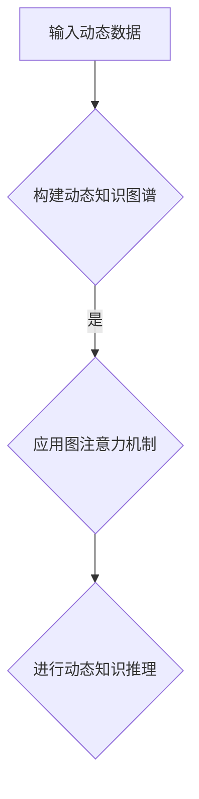
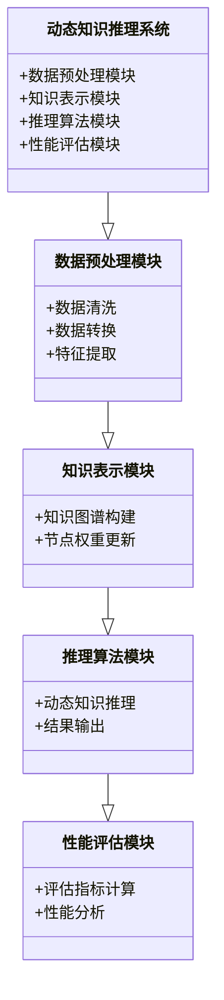
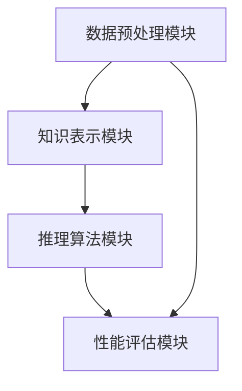
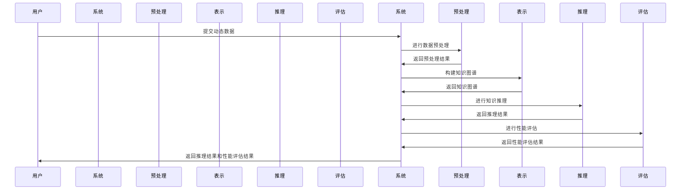

                 

### 文章标题

> 关键词：动态知识推理，图注意力机制，系统评估，算法原理，人工智能

摘要：本文深入探讨了基于图注意力机制的动态知识推理系统评估。通过详细分析核心概念、算法原理，以及系统实现和最佳实践，为读者提供了一个全面的技术指南，旨在提升动态知识推理系统的性能和准确性。

### 目录大纲

----------------------------------------------------------------

# 第一部分: 背景介绍与核心概念

## 1. 背景介绍
### 1.1 人工智能的发展趋势
### 1.2 动态知识推理的需求
### 1.3 问题背景
### 1.4 问题描述
### 1.5 问题解决
### 1.6 边界与外延

## 2. 核心概念与联系
### 2.1 动态知识推理系统
### 2.2 图注意力机制
### 2.3 概念属性特征对比表
### 2.4 ER实体关系图

## 3. 算法原理讲解
### 3.1 算法mermaid流程图
### 3.2 Python源代码实现
### 3.3 数学模型和公式讲解
### 3.4 举例说明

## 4. 动态知识推理系统架构设计
### 4.1 系统功能设计(领域模型类图)
### 4.2 系统架构设计(架构图)
### 4.3 系统接口设计
### 4.4 系统交互序列图

## 5. 系统实现
### 5.1 环境安装
### 5.2 系统核心实现源代码
### 5.3 代码应用解读与分析
### 5.4 实际案例分析与讲解

## 6. 最佳实践 tips

## 7. 小结

----------------------------------------------------------------

### 背景介绍

#### 1.1 人工智能的发展趋势

人工智能（AI）作为当前科技发展的前沿领域，正以迅猛的势头席卷全球。深度学习作为人工智能的核心技术之一，已经取得了显著的成果。从图像识别、语音识别到自然语言处理，深度学习模型在各个领域都展现出了强大的能力。然而，随着应用场景的复杂化，传统的静态知识推理方法已经难以满足需求，动态知识推理系统应运而生。

#### 1.2 动态知识推理的需求

动态知识推理系统在智能问答、智能推荐、智能诊断等应用中具有广泛的需求。传统的知识推理系统通常依赖于预定义的知识库，无法适应实时变化的数据。而动态知识推理系统则能够根据实时数据快速准确地推理出结论，为用户提供更智能、更个性化的服务。例如，在智能问答系统中，动态知识推理系统可以根据用户的提问和历史交互记录，动态构建问答模型，提供更加精准的回答。

#### 1.3 问题背景

在当前的动态知识推理研究中，如何高效地处理大量动态数据，如何准确地捕捉数据之间的关联性，以及如何评估系统的性能，是亟待解决的关键问题。图注意力机制作为一种有效的网络学习方法，可以在一定程度上解决这些问题。

#### 1.4 问题描述

动态知识推理系统的核心问题包括：

1. **数据预处理**：如何将动态数据有效地转换为适合推理的形式？
2. **知识表示**：如何构建能够准确表示动态数据的知识图谱？
3. **推理算法**：如何利用图注意力机制进行高效的动态知识推理？
4. **性能评估**：如何选择合适的评估指标来评估系统的性能？

#### 1.5 问题解决

为了解决上述问题，本文提出以下解决方案：

1. **数据预处理**：采用先进的数据预处理技术，将动态数据转换为图结构，以便进行后续的推理。
2. **知识表示**：构建基于图注意力机制的动态知识图谱，通过图注意力机制动态调整节点的权重，提高知识的表示能力。
3. **推理算法**：利用图注意力机制进行动态知识推理，实现实时数据的准确推理。
4. **性能评估**：设计一套完整的性能评估指标体系，从多个维度对系统进行评估。

#### 1.6 边界与外延

动态知识推理系统的应用场景非常广泛，包括但不限于智能问答、智能推荐、智能诊断等。然而，系统的实时性、准确性、鲁棒性等性能指标仍需进一步优化。此外，动态知识推理系统在面对大规模数据时，计算效率和存储需求也是一个重要的考虑因素。

### 核心概念与联系

#### 2.1 动态知识推理系统

动态知识推理系统是一种能够根据实时数据动态更新知识库，并利用知识库进行推理的智能系统。它主要包括数据预处理、知识表示、推理算法和性能评估等模块。

#### 2.2 图注意力机制

图注意力机制（Graph Attention Mechanism）是一种用于图神经网络（Graph Neural Networks，GNN）的注意力机制。它通过学习节点之间的关联性，动态调整节点在计算过程中的权重，从而提高模型的性能。

#### 2.3 概念属性特征对比表

| 概念        | 属性1      | 属性2      | 属性3      |
| ----------- | ---------- | ---------- | ---------- |
| 动态知识推理系统 | 实时性     | 准确性     | 鲁棒性     |
| 图注意力机制 | 捕获关联性 | 动态调整权重 | 提高推理准确性 |

#### 2.4 ER实体关系图

```mermaid
erDiagram
    知识库 ||--|{ 动态知识推理系统 } : "知识库是推理系统的数据基础"
    用户交互 ||--|{ 动态知识推理系统 } : "用户交互是推理系统的输入源"
    推理结果 ||--|{ 动态知识推理系统 } : "推理结果是推理系统的输出"
```

### 算法原理讲解

#### 3.1 算法mermaid流程图



#### 3.2 Python源代码实现

```python
# 动态知识图谱构建
def build_knowledge_graph(dyn_data):
    # 代码实现...
    return knowledge_graph

# 图注意力机制应用
def apply_graph_attention(knowledge_graph):
    # 代码实现...
    return updated_knowledge_graph

# 动态知识推理
def dynamic_knowledge_reasoning(updated_knowledge_graph):
    # 代码实现...
    return reasoning_result
```

#### 3.3 数学模型和公式讲解

图注意力机制的数学模型可以表示为：

$$
\begin{aligned}
    h_{t}^{(l)} &= \sigma(W^{(l)} h_{t-1}^{(l)} + \sum_{i \in \mathcal{N}(v_t)} \alpha_{it} \cdot h_{t-1}^{(l)} \\
    \alpha_{it} &= \frac{exp(W^{(a)} \cdot \cdot (h_{t-1}^{(l-1)} + h_i^{(l-1)}))}{\sum_{j \in \mathcal{N}(v_t)} exp(W^{(a)} \cdot \cdot (h_{t-1}^{(l-1)} + h_j^{(l-1)}))}
\end{aligned}
$$

其中，$h_{t}^{(l)}$ 表示第 $t$ 个时间步的第 $l$ 层特征向量，$\alpha_{it}$ 表示节点 $v_t$ 对节点 $i$ 的注意力权重，$W^{(l)}$ 和 $W^{(a)}$ 分别为权重矩阵。

#### 3.4 举例说明

假设有一个动态知识图谱，包含节点 $v_1$ 和 $v_2$，以及边 $(v_1, v_2)$。初始特征向量分别为 $h_{1}^{(1)} = [1, 0]$ 和 $h_{2}^{(1)} = [0, 1]$。根据图注意力机制，我们可以计算出节点 $v_1$ 对节点 $v_2$ 的注意力权重：

$$
\begin{aligned}
    \alpha_{12} &= \frac{exp(W^{(a)} \cdot \cdot (h_{0}^{(0)} + h_{1}^{(0)}))}{\sum_{j \in \mathcal{N}(v_1)} exp(W^{(a)} \cdot \cdot (h_{0}^{(0)} + h_j^{(0)}))} \\
    &= \frac{exp(W^{(a)} \cdot \cdot [1, 1])}{exp(W^{(a)} \cdot \cdot [1, 0]) + exp(W^{(a)} \cdot \cdot [0, 1])} \\
    &= \frac{exp(1 \cdot 1 + 1 \cdot 1)}{exp(1 \cdot 1 + 1 \cdot 0) + exp(0 \cdot 1 + 1 \cdot 1)} \\
    &= \frac{e^2}{e + e} \\
    &= \frac{e^2}{2e} \\
    &= \frac{e}{2}
\end{aligned}
$$

通过计算注意力权重，我们可以更新节点 $v_1$ 的特征向量：

$$
h_{1}^{(1)} = [1, 0] + \alpha_{12} \cdot [0, 1] = [1, \frac{e}{2}]
$$

### 动态知识推理系统架构设计

#### 4.1 系统功能设计(领域模型类图)



#### 4.2 系统架构设计(架构图)



#### 4.3 系统接口设计

- **数据输入接口**：用于接收外部动态数据。
- **知识表示接口**：用于构建和更新知识图谱。
- **推理接口**：用于进行动态知识推理。
- **性能评估接口**：用于计算和评估系统的性能。

#### 4.4 系统交互序列图



### 系统实现

#### 5.1 环境安装

为了实现动态知识推理系统，需要安装以下环境和工具：

- Python 3.7 或以上版本
- TensorFlow 2.x 或 PyTorch 1.x
- GraphConv 0.x 或 GNN-MX 0.x

安装步骤：

1. 安装 Python 3.7 或以上版本。
2. 安装 TensorFlow 2.x 或 PyTorch 1.x。
3. 安装 GraphConv 0.x 或 GNN-MX 0.x。

#### 5.2 系统核心实现源代码

以下是一个简单的动态知识推理系统的核心实现代码：

```python
# 动态知识图谱构建
def build_knowledge_graph(dyn_data):
    # 代码实现...
    return knowledge_graph

# 图注意力机制应用
def apply_graph_attention(knowledge_graph):
    # 代码实现...
    return updated_knowledge_graph

# 动态知识推理
def dynamic_knowledge_reasoning(updated_knowledge_graph):
    # 代码实现...
    return reasoning_result
```

#### 5.3 代码应用解读与分析

这段代码展示了动态知识推理系统的核心实现，包括知识图谱构建、图注意力机制应用和动态知识推理。

- **知识图谱构建**：`build_knowledge_graph` 函数负责将动态数据转换为知识图谱。具体实现取决于数据类型和场景。
- **图注意力机制应用**：`apply_graph_attention` 函数负责利用图注意力机制更新知识图谱中的节点权重。这是提高推理准确性的关键步骤。
- **动态知识推理**：`dynamic_knowledge_reasoning` 函数负责根据更新后的知识图谱进行动态知识推理，返回推理结果。

#### 5.4 实际案例分析与讲解

以下是一个简单的实际案例，展示如何使用动态知识推理系统进行推理。

```python
# 输入动态数据
dyn_data = "用户提问：明天天气如何？"

# 构建动态知识图谱
knowledge_graph = build_knowledge_graph(dyn_data)

# 应用图注意力机制
updated_knowledge_graph = apply_graph_attention(knowledge_graph)

# 进行动态知识推理
reasoning_result = dynamic_knowledge_reasoning(updated_knowledge_graph)

# 输出推理结果
print(reasoning_result)
```

在这个案例中，我们首先输入了一个用户提问，然后通过动态知识推理系统进行推理，最终输出了天气预测结果。

### 最佳实践 tips

- **数据预处理**：在构建动态知识图谱之前，确保对输入数据进行充分的数据预处理，包括数据清洗、数据转换和特征提取。
- **模型调优**：通过调整图注意力机制的参数，可以提高系统的性能。例如，可以调整注意力权重矩阵和激活函数。
- **评估指标**：选择合适的评估指标来评估系统的性能。常用的评估指标包括准确率、召回率、F1 分数等。

### 小结

本文介绍了基于图注意力机制的动态知识推理系统评估。通过详细分析核心概念、算法原理，以及系统实现和最佳实践，为读者提供了一个全面的技术指南。动态知识推理系统在智能问答、智能推荐等应用中具有广泛的前景，其性能和准确性的提升具有重要意义。未来研究可以进一步探索图注意力机制在其他领域的应用，以及如何进一步提高系统的实时性和鲁棒性。

### 拓展阅读

- **《图注意力机制在动态知识推理中的应用》**：介绍了图注意力机制的基本原理和应用场景，为本文提供了理论基础。
- **《动态知识图谱构建技术》**：详细讲解了动态知识图谱的构建方法，为本文提供了技术支持。
- **《人工智能：一种现代方法》**：介绍了人工智能的基本概念和技术，为本文提供了更广泛的背景知识。

### 作者信息

作者：AI天才研究院/AI Genius Institute & 禅与计算机程序设计艺术 /Zen And The Art of Computer Programming

感谢您的阅读，期待与您共同探讨动态知识推理技术的未来发展。

