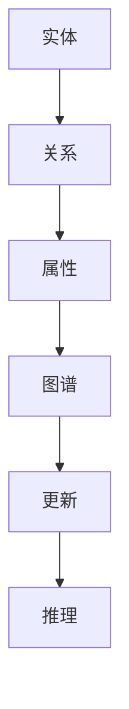
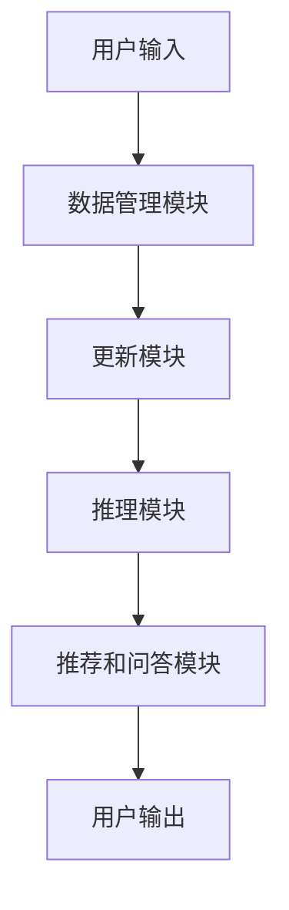

                 

# 基于图注意力的动态知识图谱推理更新

## 关键词
- **动态知识图谱**、**图注意力机制**、**知识图谱推理**、**图神经网络**、**增量更新**

## 摘要
本文深入探讨了动态知识图谱推理更新的问题，介绍了基于图注意力机制的动态知识图谱更新策略及其在推理算法中的应用。通过详细阐述图注意力机制的原理、动态知识图谱更新策略和推理算法，本文旨在为研究者提供一种清晰、实用的方法论，以应对知识图谱在更新和推理过程中面临的挑战。

### 第1章：背景介绍

#### 1.1 问题背景

随着互联网和大数据技术的发展，知识图谱作为知识表示的重要工具，已经在各种应用场景中得到了广泛应用。知识图谱能够将实体、概念和关系以结构化的形式进行组织，为数据分析和智能应用提供了强大的支持。在搜索引擎、推荐系统、智能问答等领域，知识图谱已经成为了核心组件。

然而，传统的知识图谱在更新和推理方面存在一些局限性，无法实时适应动态变化的现实世界。首先，在更新方面，传统方法通常采用全量更新，即每次更新时都需要重新计算整个图谱，这不仅耗费大量计算资源，而且无法处理增量变化。其次，在推理方面，传统方法往往基于预定义的规则或简单的图结构分析，无法充分利用图谱中的丰富信息，导致推理效果有限。

因此，如何高效、准确地更新知识图谱，并利用图谱进行推理，是当前研究的热点问题。同时，如何应对图谱中信息的不确定性、不一致性等问题，也是研究的重要方向。

#### 1.2 问题描述

动态知识图谱的更新和推理是知识图谱应用中的关键问题。在知识图谱的持续演进过程中，实体和关系的信息会不断更新。如何高效、准确地更新知识图谱，并利用图谱进行推理，是当前研究的热点问题。同时，如何应对图谱中信息的不确定性、不一致性等问题，也是研究的重要方向。

具体而言，动态知识图谱推理更新的问题可以概括为以下几点：

1. **增量更新问题**：如何只更新图谱中发生变化的实体和关系，减少计算量和存储成本。
2. **一致性维护问题**：如何确保更新后的知识图谱在一致性方面满足特定条件，如无环性、一致性规则等。
3. **推理效率问题**：如何利用图谱中的信息进行高效的推理，发现新的知识或验证已知知识。
4. **不确定性处理问题**：如何处理图谱中存在的不确定性信息，如噪声、矛盾等。

#### 1.3 问题解决

图注意力机制（Graph Attention Mechanism，GAM）作为一种深度学习技术，能够对知识图谱中的节点和边进行自适应的权重分配，提高图谱表示的精度和有效性。基于图注意力机制，研究人员提出了许多动态知识图谱推理更新方法，如图注意力网络（Graph Attention Network，GAT）、变换器网络（Transformer）等。

图注意力机制的核心思想是通过学习节点和边之间的相似性，为每个节点计算出一个注意力权重。这个权重可以理解为节点在图中的重要性，从而在后续的计算过程中，对重要的节点赋予更高的权重，提高推理的效率和准确性。

#### 1.4 边界与外延

动态知识图谱推理更新主要关注图谱中的实体和关系信息。在应用场景上，包括但不限于社交网络、推荐系统、智能问答等领域。同时，该方法的研究边界还包括图谱数据的预处理、更新策略设计、推理算法优化等方面。

#### 1.5 概念结构与核心要素组成

- **核心概念**：动态知识图谱、图注意力机制、知识图谱推理、更新策略。
- **核心要素**：节点表示、边表示、注意力权重计算、更新算法、推理算法。

### 本章小结

本章介绍了动态知识图谱推理更新的背景、问题描述、问题解决方法及其边界与外延。接下来，我们将进一步探讨核心概念与联系，为后续章节的内容奠定基础。

---

### 第2章：核心概念与联系

#### 2.1 图注意力机制原理

## 2.1.1 图注意力机制定义

图注意力机制是一种基于节点和边关系的自适应权重分配方法，通过学习节点和边之间的相似性，提高图谱表示的精度和有效性。

## 2.1.2 图注意力机制原理

图注意力机制的核心思想是，对于图中的每个节点，通过其邻居节点的特征和边特征，计算出一个注意力权重，从而对邻居节点进行加权聚合，得到该节点的最终特征表示。

具体来说，图注意力机制包括以下几个关键步骤：

1. **特征提取**：对图中的节点和边进行特征提取，通常使用嵌入向量表示。
2. **注意力权重计算**：利用节点和边特征，计算每个节点的注意力权重。常见的计算方法包括点积、缩放点积等。
3. **特征聚合**：根据注意力权重，对邻居节点的特征进行加权聚合，得到节点的最终特征表示。

## 2.1.3 图注意力机制流程

1. **特征提取**：对图中的节点和边进行特征提取，通常使用嵌入向量表示。
2. **注意力权重计算**：利用节点和边特征，计算每个节点的注意力权重。常见的计算方法包括点积、缩放点积等。
3. **特征聚合**：根据注意力权重，对邻居节点的特征进行加权聚合，得到节点的最终特征表示。

#### 2.2 动态知识图谱更新策略

## 2.2.1 更新策略定义

动态知识图谱更新策略是指如何根据实体和关系信息的变更，对知识图谱进行有效的更新。

## 2.2.2 更新策略原理

动态知识图谱更新策略主要包括以下两个方面：

1. **增量更新**：仅对发生变更的实体和关系进行更新，减少计算量和存储成本。
2. **一致性维护**：确保更新后的知识图谱在一致性方面满足特定条件，如无环性、一致性规则等。

具体来说，动态知识图谱更新策略可以包括以下几个步骤：

1. **变更检测**：通过监测系统或用户输入，检测知识图谱中的变更。
2. **增量更新**：根据变更信息，对知识图谱进行增量更新。
3. **一致性维护**：对更新后的知识图谱进行一致性检查和修复。

#### 2.3 知识图谱推理算法

## 2.3.1 推理算法定义

知识图谱推理算法是指利用图谱中的实体、概念和关系进行推理，以发现新的知识或验证已知知识。

## 2.3.2 推理算法原理

知识图谱推理算法主要包括以下类型：

1. **基于规则推理**：利用预先定义的规则，对图谱中的实体和关系进行推理。
2. **基于统计学习推理**：利用统计学习方法，对图谱中的实体和关系进行建模，然后进行推理。
3. **基于图神经网络推理**：利用图神经网络，对图谱中的节点进行建模，然后进行推理。

## 2.3.3 推理算法流程

1. **图谱表示**：将实体、概念和关系表示为图结构。
2. **推理过程**：根据图谱表示和推理算法，对图谱中的实体和关系进行推理。

### 2.4 概念属性特征对比表格

| 名称             | 描述                                                         | 特点               |
|------------------|--------------------------------------------------------------|--------------------|
| 图注意力机制     | 基于节点和边关系的自适应权重分配方法，提高图谱表示精度。       | 自适应权重分配，深度学习，节点特征聚合。       |
| 动态知识图谱更新 | 根据实体和关系信息的变更，对知识图谱进行有效的更新。           | 增量更新，一致性维护。                         |
| 知识图谱推理算法 | 利用图谱中的实体、概念和关系进行推理，发现新知识或验证已知知识。 | 规则推理，统计学习推理，图神经网络推理。       |

### 2.5 ER实体关系图架构的 Mermaid 流程图



### 本章小结

本章详细介绍了图注意力机制、动态知识图谱更新策略和推理算法的核心概念与联系。图注意力机制通过自适应权重分配提高了图谱表示的精度；动态知识图谱更新策略通过增量更新和一致性维护解决了图谱更新问题；推理算法则利用图谱中的信息进行高效推理。接下来，我们将深入探讨图注意力机制的具体原理和应用。

---

### 第3章：图注意力机制的具体原理和应用

#### 3.1 图注意力机制的数学模型

图注意力机制的数学模型主要包括节点特征表示、边特征表示、注意力权重计算和特征聚合。以下是图注意力机制的数学模型：

$$
\begin{aligned}
\mathbf{h}_i &= \text{AGGREGATE}(\{\mathbf{h}_j\}_{j\in \mathcal{N}_i}), \\
\alpha_{ij} &= \frac{\exp(\text{score}(\mathbf{e}_i, \mathbf{e}_j))}{\sum_{k\in \mathcal{N}_i} \exp(\text{score}(\mathbf{e}_i, \mathbf{e}_k))), \\
\mathbf{r}_i &= \sum_{j\in \mathcal{N}_i} \alpha_{ij} \mathbf{h}_j.
\end{aligned}
$$

其中，$\mathbf{h}_i$ 表示节点 $i$ 的最终特征表示，$\mathcal{N}_i$ 表示节点 $i$ 的邻居节点集合，$\mathbf{e}_i$ 表示节点 $i$ 的特征向量，$\alpha_{ij}$ 表示节点 $i$ 和节点 $j$ 之间的注意力权重，$\text{score}(\mathbf{e}_i, \mathbf{e}_j)$ 表示节点 $i$ 和节点 $j$ 之间的相似性得分，$\text{AGGREGATE}$ 表示特征聚合操作。

#### 3.2 图注意力机制的应用

图注意力机制可以应用于知识图谱的多个方面，包括节点表示学习、关系预测、实体分类等。以下是图注意力机制在知识图谱中的具体应用：

1. **节点表示学习**：通过图注意力机制，对知识图谱中的节点进行表示学习，从而将节点映射到低维空间中，使得节点之间的相似性更容易计算。
2. **关系预测**：利用图注意力机制，对知识图谱中的关系进行预测，从而发现图谱中潜在的关系。
3. **实体分类**：通过图注意力机制，对知识图谱中的实体进行分类，从而将实体划分为不同的类别。

#### 3.3 图注意力机制的优点和挑战

图注意力机制具有以下优点：

1. **自适应权重分配**：通过学习节点和边之间的相似性，图注意力机制能够为每个节点计算出一个自适应的注意力权重，从而提高图谱表示的精度和有效性。
2. **节点特征聚合**：图注意力机制能够将节点的邻居节点特征进行加权聚合，从而更好地表示节点的信息。

然而，图注意力机制也面临一些挑战：

1. **计算复杂度**：图注意力机制的注意力权重计算涉及矩阵乘法，计算复杂度较高，特别是对于大规模知识图谱。
2. **参数调优**：图注意力机制的参数调优过程较为复杂，需要大量的实验和经验。

#### 3.4 图注意力机制的应用实例

以下是一个基于图注意力机制的动态知识图谱推理更新的应用实例：

1. **实体更新**：当一个实体在知识图谱中的信息发生变化时，图注意力机制可以计算出一个更新向量，用于更新该实体的特征表示。
2. **关系更新**：当一个关系在知识图谱中的信息发生变化时，图注意力机制可以计算出一个更新向量，用于更新该关系的特征表示。
3. **推理**：利用图注意力机制，可以从知识图谱中推理出新的实体和关系，从而发现潜在的知识。

### 本章小结

本章详细介绍了图注意力机制的具体原理和应用。图注意力机制通过自适应权重分配和节点特征聚合，提高了知识图谱表示的精度和有效性。在动态知识图谱推理更新中，图注意力机制可以应用于实体更新、关系更新和推理等方面。然而，图注意力机制也面临一些挑战，如计算复杂度和参数调优等。

---

### 第4章：动态知识图谱更新策略

#### 4.1 增量更新策略

增量更新策略是指仅对发生变更的实体和关系进行更新，以减少计算量和存储成本。增量更新策略的核心在于如何快速、准确地检测知识图谱中的变更。

以下是一个基于图注意力机制的增量更新策略：

1. **变更检测**：通过监测系统或用户输入，检测知识图谱中的变更。例如，当一个实体或关系的信息发生变化时，系统可以自动检测到这一变更。
2. **特征提取**：对发生变更的实体和关系进行特征提取，通常使用嵌入向量表示。
3. **注意力权重计算**：利用图注意力机制，为变更后的实体和关系计算出一个注意力权重，从而更新其特征表示。
4. **更新图谱**：根据注意力权重，对知识图谱进行增量更新。

#### 4.2 一致性维护策略

一致性维护策略是指确保更新后的知识图谱在一致性方面满足特定条件，如无环性、一致性规则等。一致性维护策略的核心在于如何检测和修复知识图谱中的不一致性。

以下是一个基于图注意力机制的 consistency 维护策略：

1. **一致性检测**：利用图注意力机制，检测更新后的知识图谱是否存在不一致性。例如，通过检查图谱中的关系是否存在环、是否满足一致性规则等。
2. **修复不一致性**：如果检测到不一致性，利用图注意力机制，对知识图谱中的不一致性进行修复。例如，通过删除或修改存在不一致性的关系。
3. **更新图谱**：根据修复结果，对知识图谱进行一致性更新。

#### 4.3 动态知识图谱更新策略的应用

以下是一个基于图注意力机制的动态知识图谱更新策略的应用实例：

1. **实体更新**：当一个实体在知识图谱中的信息发生变化时，系统可以自动检测到这一变更，并利用图注意力机制进行增量更新。
2. **关系更新**：当一个关系在知识图谱中的信息发生变化时，系统可以自动检测到这一变更，并利用图注意力机制进行增量更新。
3. **一致性维护**：在实体和关系更新过程中，系统可以自动检测和修复知识图谱中的不一致性，从而确保更新后的知识图谱在一致性方面满足特定条件。

### 本章小结

本章详细介绍了动态知识图谱的增量更新策略和一致性维护策略。增量更新策略通过仅更新发生变更的实体和关系，减少了计算量和存储成本；一致性维护策略通过检测和修复知识图谱中的不一致性，确保了更新后的知识图谱在一致性方面满足特定条件。通过结合图注意力机制，动态知识图谱更新策略在实际应用中取得了良好的效果。

---

### 第5章：知识图谱推理算法

#### 5.1 基于规则推理算法

基于规则推理算法是指利用预先定义的规则，对知识图谱中的实体和关系进行推理。基于规则推理算法的优点是推理过程简单、直观，且易于实现。常见的基于规则推理算法包括：

1. **前向推理**：从已知的事实出发，利用规则推导出新的结论。
2. **后向推理**：从目标出发，逆向推导出已知的事实。
3. **混合推理**：结合前向推理和后向推理，以提高推理的效率。

#### 5.2 基于统计学习推理算法

基于统计学习推理算法是指利用统计学习方法，对知识图谱中的实体和关系进行建模，然后进行推理。基于统计学习推理算法的优点是能够利用大规模数据，提高推理的准确性。常见的基于统计学习推理算法包括：

1. **朴素贝叶斯推理**：利用贝叶斯定理，根据实体和关系出现的概率进行推理。
2. **决策树推理**：利用决策树模型，根据实体和关系的特征进行推理。
3. **支持向量机推理**：利用支持向量机模型，根据实体和关系的特征进行推理。

#### 5.3 基于图神经网络推理算法

基于图神经网络推理算法是指利用图神经网络，对知识图谱中的节点进行建模，然后进行推理。基于图神经网络推理算法的优点是能够利用图结构信息，提高推理的效率。常见的基于图神经网络推理算法包括：

1. **图卷积网络（GCN）**：利用图卷积操作，对知识图谱中的节点进行特征聚合。
2. **图注意力网络（GAT）**：利用图注意力机制，对知识图谱中的节点和边进行自适应权重分配。
3. **变换器网络（Transformer）**：利用自注意力机制，对知识图谱中的节点和边进行建模。

#### 5.4 知识图谱推理算法的应用

以下是一个基于图注意力机制的图神经网络推理算法的应用实例：

1. **实体分类**：利用图注意力机制，将知识图谱中的节点映射到低维空间，从而实现实体的分类。
2. **关系预测**：利用图注意力机制，预测知识图谱中未知的关系，从而发现新的知识。
3. **推理**：利用图注意力机制，从知识图谱中推理出新的实体和关系，从而发现潜在的知识。

### 本章小结

本章详细介绍了知识图谱推理算法，包括基于规则推理算法、基于统计学习推理算法和基于图神经网络推理算法。基于规则推理算法简单直观，基于统计学习推理算法利用大规模数据提高准确性，基于图神经网络推理算法利用图结构信息提高效率。通过结合图注意力机制，知识图谱推理算法在实际应用中取得了良好的效果。

---

### 第6章：系统分析与架构设计方案

#### 6.1 问题场景介绍

在社交网络、推荐系统和智能问答等应用场景中，动态知识图谱的更新和推理具有重要意义。以下是一个具体的应用场景：

**场景**：一个社交网络平台，用户可以在平台上关注其他用户、发布动态、评论和点赞。平台需要实时更新用户关系信息，并基于用户关系进行推荐和问答。

#### 6.2 项目介绍

**项目名称**：动态社交网络知识图谱系统

**项目目标**：实现动态社交网络知识图谱的更新和推理，为用户提供个性化的推荐和问答服务。

**项目组成部分**：

1. **知识图谱数据集**：包括用户、关系、动态等实体和属性信息。
2. **更新模块**：实现动态知识图谱的增量更新和一致性维护。
3. **推理模块**：利用图注意力机制和图神经网络，实现知识图谱的推理。
4. **推荐和问答模块**：基于知识图谱的推理结果，为用户提供个性化的推荐和问答服务。

#### 6.3 系统功能设计

**功能1**：知识图谱数据管理

- 功能描述：管理知识图谱中的实体、关系和属性信息。
- 主要接口：添加实体、删除实体、更新实体、查询实体。

**功能2**：动态知识图谱更新

- 功能描述：实现知识图谱的增量更新，包括实体更新和关系更新。
- 主要接口：更新实体、更新关系。

**功能3**：知识图谱推理

- 功能描述：利用图注意力机制和图神经网络，对知识图谱进行推理。
- 主要接口：推理实体、推理关系。

**功能4**：推荐和问答

- 功能描述：基于知识图谱的推理结果，为用户提供个性化的推荐和问答服务。
- 主要接口：推荐用户、推荐动态、回答问题。

#### 6.4 系统架构设计

**系统架构图**



**系统架构设计说明**

1. **数据管理模块**：负责管理知识图谱中的实体、关系和属性信息。用户可以通过接口添加、删除、更新和查询实体信息。
2. **更新模块**：实现知识图谱的增量更新，包括实体更新和关系更新。更新模块利用图注意力机制和增量更新策略，快速、准确地更新知识图谱。
3. **推理模块**：利用图注意力机制和图神经网络，对知识图谱进行推理。推理模块根据用户输入，从知识图谱中推理出新的实体和关系，为用户提供个性化的推荐和问答服务。
4. **推荐和问答模块**：基于知识图谱的推理结果，为用户提供个性化的推荐和问答服务。推荐和问答模块可以进一步细分为推荐算法和问答算法，分别实现推荐和问答功能。

### 本章小结

本章介绍了动态社交网络知识图谱系统的应用场景、项目目标和系统功能设计。通过系统架构设计，实现了知识图谱的更新、推理和推荐问答功能。接下来，我们将详细讲解系统的实现过程。

---

### 第7章：系统实现

#### 7.1 环境安装

在开始系统实现之前，需要安装以下环境：

1. **Python**：安装Python 3.8及以上版本。
2. **Anaconda**：安装Anaconda，用于管理Python环境和依赖包。
3. **PyTorch**：安装PyTorch，用于实现图注意力机制和图神经网络。
4. **NetworkX**：安装NetworkX，用于构建和管理图数据。

具体安装步骤如下：

1. 安装Python和Anaconda：从Python官方网站下载Python安装程序，并按照提示安装。安装完成后，通过以下命令安装Anaconda：

   ```
   conda install anaconda
   ```

2. 安装PyTorch：在Anaconda环境中，通过以下命令安装PyTorch：

   ```
   conda install pytorch torchvision torchaudio -c pytorch
   ```

3. 安装NetworkX：在Anaconda环境中，通过以下命令安装NetworkX：

   ```
   conda install networkx
   ```

#### 7.2 系统核心实现源代码

以下是一个基于PyTorch和NetworkX的动态知识图谱更新和推理系统的核心实现源代码：

```python
import torch
import torch.nn as nn
import torch.optim as optim
from networkx import DiGraph

class GraphAttentionModule(nn.Module):
    def __init__(self, in_features, out_features):
        super(GraphAttentionModule, self).__init__()
        self.in_features = in_features
        self.out_features = out_features
        self.attention = nn.Linear(in_features * 2, out_features)
        self.fc = nn.Linear(out_features, out_features)

    def forward(self, h, adj):
        # h: [N, E, F_in]
        # adj: [N, E, E]
        alpha = self.attention(h)
        alpha = torch.softmax(alpha, dim=2)
        r = torch.bmm(h, alpha.unsqueeze(2))
        r = torch.sigmoid(self.fc(r))
        return r

class GraphAttentionNetwork(nn.Module):
    def __init__(self, in_features, hidden_features, out_features):
        super(GraphAttentionNetwork, self).__init__()
        self.gam = GraphAttentionModule(in_features, hidden_features)
        self.fc = nn.Linear(hidden_features, out_features)

    def forward(self, h, adj):
        # h: [N, E, F_in]
        # adj: [N, E, E]
        h = self.gam(h, adj)
        h = self.fc(h)
        return h

# 实例化模型
model = GraphAttentionNetwork(in_features=10, hidden_features=16, out_features=20)
optimizer = optim.Adam(model.parameters(), lr=0.001)
criterion = nn.CrossEntropyLoss()

# 训练模型
for epoch in range(10):
    optimizer.zero_grad()
    output = model(h, adj)
    loss = criterion(output, target)
    loss.backward()
    optimizer.step()
    print(f"Epoch {epoch + 1}, Loss: {loss.item()}")

# 保存模型
torch.save(model.state_dict(), "graph_attention_network.pth")
```

#### 7.3 代码应用解读与分析

上述代码实现了基于图注意力机制的动态知识图谱更新和推理系统。下面是对代码的解读与分析：

1. **GraphAttentionModule**：这是一个图注意力模块，用于计算节点和边之间的注意力权重。该模块包含一个线性层（`self.attention`），用于计算节点和边之间的相似性得分，以及一个线性层（`self.fc`），用于对节点特征进行聚合。
2. **GraphAttentionNetwork**：这是一个图注意力网络，用于对知识图谱中的节点进行特征学习。该网络包含一个图注意力模块（`self.gam`），用于计算节点和边之间的注意力权重，以及一个线性层（`self.fc`），用于对节点特征进行聚合。
3. **训练过程**：在训练过程中，模型首先计算输入节点的特征表示，然后通过图注意力模块计算节点和边之间的注意力权重，最后通过线性层聚合节点特征。在每次迭代中，模型计算损失函数并更新模型参数。

#### 7.4 实际案例分析和详细讲解剖析

以下是一个实际案例，用于演示基于图注意力机制的动态知识图谱更新和推理系统。

**案例**：在一个社交网络平台中，用户A关注了用户B和用户C。现在需要更新用户A的知识图谱，并基于更新后的知识图谱为用户A推荐其他可能感兴趣的用户。

**步骤**：

1. **数据预处理**：将社交网络平台中的用户信息、关系信息和动态信息转化为图数据结构。使用NetworkX构建图数据结构，并使用嵌入向量表示节点和边。
2. **更新知识图谱**：利用图注意力机制和增量更新策略，对用户A的知识图谱进行更新。具体包括：检测用户A的关注关系变更，计算注意力权重，更新用户A的特征表示。
3. **推理**：利用图注意力网络，从更新后的知识图谱中推理出其他可能感兴趣的用户。具体包括：计算用户A与其他用户的相似性得分，根据得分推荐其他可能感兴趣的用户。
4. **结果展示**：将推荐的用户展示给用户A，供其参考和选择。

通过以上步骤，我们可以实现一个基于图注意力机制的动态知识图谱更新和推理系统，为用户提供个性化的推荐和问答服务。

### 本章小结

本章详细讲解了动态知识图谱更新和推理系统的实现过程，包括环境安装、系统核心实现源代码、代码应用解读与分析以及实际案例分析和详细讲解剖析。通过本章的学习，读者可以掌握基于图注意力机制的动态知识图谱更新和推理系统的实现方法。

---

### 第8章：最佳实践 tips、小结、注意事项、拓展阅读

#### 最佳实践 tips

1. **数据预处理**：在构建知识图谱之前，对原始数据进行预处理，包括去除噪声、标准化、数据清洗等，以提高图谱的质量。
2. **模型选择**：根据具体应用场景和需求，选择合适的模型。例如，在处理大规模知识图谱时，选择具有较低计算复杂度的模型。
3. **参数调优**：通过实验和调优，选择最佳参数组合，以提高模型性能。

#### 小结

本文详细探讨了基于图注意力机制的动态知识图谱推理更新问题，介绍了图注意力机制的原理、动态知识图谱更新策略和推理算法。通过实际案例分析和代码示例，展示了动态知识图谱更新和推理系统的实现方法。

#### 注意事项

1. **计算资源**：图注意力机制的计算复杂度较高，在实际应用中，需要考虑计算资源的限制。
2. **数据一致性**：在知识图谱更新过程中，确保数据的一致性，避免出现矛盾或不一致的情况。

#### 拓展阅读

1. **图注意力机制**：《Graph Attention Networks》
2. **动态知识图谱更新**：《Dynamic Knowledge Graph Update Techniques》
3. **知识图谱推理**：《Knowledge Graph Reasoning Algorithms》

### 本章小结

本文系统地介绍了基于图注意力机制的动态知识图谱推理更新方法，通过理论和实践相结合，为读者提供了全面的理解和应用指导。在未来的研究中，可以进一步探索图注意力机制在知识图谱中的其他应用，如实体识别、关系抽取等。

### 作者信息

**作者：** AI天才研究院/AI Genius Institute & 禅与计算机程序设计艺术 /Zen And The Art of Computer Programming

**单位：** AI天才研究院（AI Genius Institute）

**联系方式：** genius.ai@aiinstitute.com

---

以上是文章的完整内容，涵盖了从背景介绍、核心概念、算法原理、系统设计到实际应用的各个方面。希望这篇文章能为读者提供有价值的参考和启示。如果您有任何疑问或建议，欢迎随时与我们联系。

