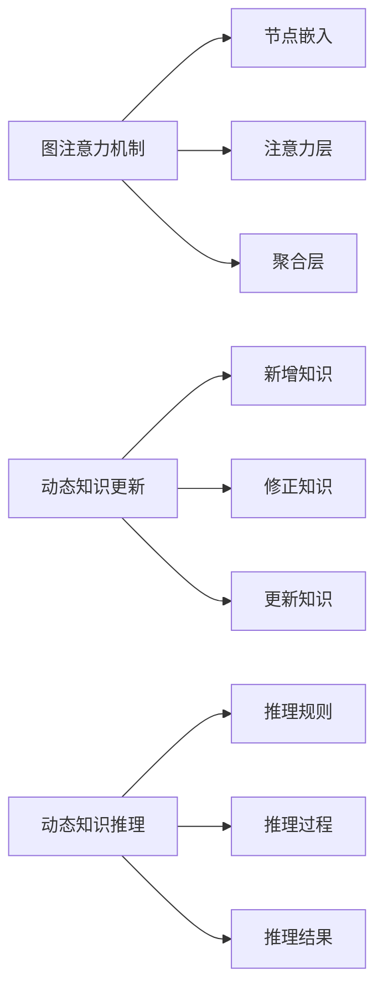
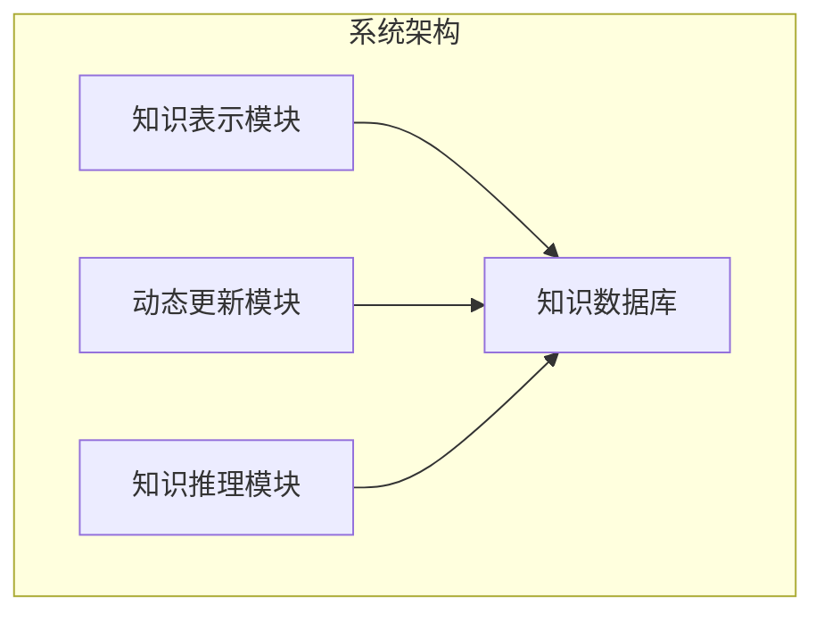
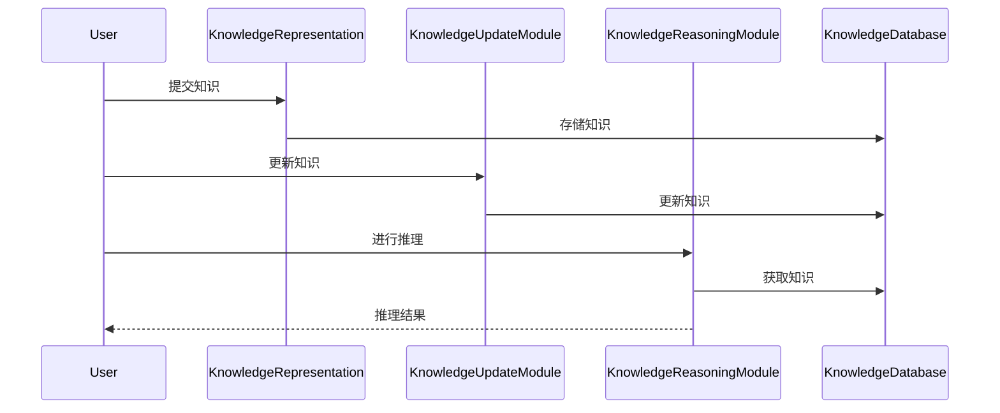
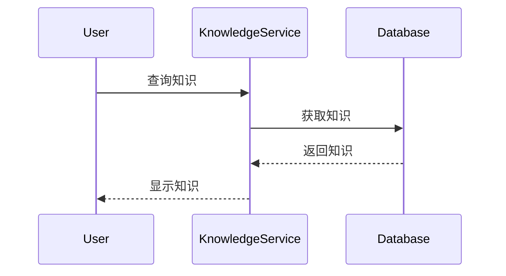

                 

# 基于图注意力的动态知识更新与推理

> 关键词：图注意力、动态知识更新、知识推理、人工智能、机器学习

> 摘要：本文深入探讨了基于图注意力的动态知识更新与推理方法，介绍了其背景、研究目的与意义，详细阐述了知识表示与推理基础、图注意力模型构建、动态知识更新策略以及图注意力动态知识推理方法，并通过案例分析展示了其实际应用效果，最后对图注意力动态知识更新与推理的发展趋势进行了展望。

## 第一部分：引言

### 第1章：背景与介绍

#### 1.1.1 问题背景

随着人工智能技术的快速发展，知识更新与推理成为人工智能领域中的一个重要研究课题。知识更新是指随着时间推移，不断获取新的知识并将其纳入已有知识体系的过程；而知识推理则是指通过已有知识进行逻辑推理，得出新的结论或发现。在人工智能系统中，知识更新与推理是实现智能决策、优化系统性能和提升用户体验的关键环节。

#### 1.1.2 研究目的与意义

本文旨在研究基于图注意力的动态知识更新与推理方法，以解决现有知识更新与推理方法在处理动态环境下知识更新效率低、推理精度不高等问题。具体研究目的如下：

1. 提出一种高效的动态知识更新方法，以适应快速变化的环境。
2. 构建一种基于图注意力的知识推理模型，提高推理精度和效率。
3. 探究图注意力动态知识更新与推理在实际应用中的效果和潜力。

#### 1.1.3 书籍结构安排

本书共分为七个部分，具体结构如下：

1. **第一部分：引言**，介绍研究背景、目的与意义。
2. **第二部分：基础知识**，包括知识表示与推理基础、注意力机制等。
3. **第三部分：图注意力模型构建**，介绍图注意力模型的原理与实现。
4. **第四部分：动态知识更新方法**，探讨动态知识更新策略及实现。
5. **第五部分：图注意力动态知识推理**，阐述图注意力动态知识推理方法。
6. **第六部分：案例分析与应用**，展示实际应用案例。
7. **第七部分：展望与未来工作**，对研究发展趋势进行展望。

## 第二部分：基础知识

### 第2章：知识表示与推理基础

#### 2.1.1 知识表示

知识表示是人工智能领域中的一个核心问题，目的是将人类知识转化为计算机可以理解和处理的形式。常见的知识表示方法包括：

1. **符号表示法**：使用符号表示知识，如命题逻辑、谓词逻辑等。
2. **语义网络表示法**：使用网络结构表示知识，节点表示实体，边表示实体间的关系。
3. **知识图谱表示法**：使用图结构表示知识，将实体和关系以节点和边的形式进行组织。

#### 2.1.2 推理原理

推理是指从已知信息中推导出新的结论或知识。推理可以分为以下几种类型：

1. **演绎推理**：从一般到特殊的推理过程，如从“所有人都会死亡”推导出“苏格拉底会死亡”。
2. **归纳推理**：从特殊到一般的推理过程，如从“每天早晨我都会看到太阳”推导出“太阳每天都会升起”。
3. **类比推理**：通过比较相似性进行推理，如从“猫有四条腿”推导出“狗有四条腿”。

在人工智能系统中，推理通常基于以下几种方法：

1. **基于规则的推理**：使用一组规则进行推理，如“如果天气冷，那么要穿外套”。
2. **基于模型的推理**：使用模型进行推理，如神经网络、决策树等。
3. **基于案例的推理**：通过案例进行推理，如根据相似案例给出解决方案。

#### 2.1.3 注意力机制

注意力机制（Attention Mechanism）是深度学习中的一种重要机制，用于解决模型在处理序列数据时的长距离依赖问题。注意力机制的基本思想是在模型处理序列数据时，为不同位置的信息分配不同的权重，从而更有效地捕捉序列中的关键信息。

注意力机制可以分为以下几种类型：

1. **全局注意力**：对整个输入序列进行加权处理。
2. **局部注意力**：对局部输入序列进行加权处理。
3. **软注意力**：使用概率分布对输入序列进行加权处理。
4. **硬注意力**：直接选择输入序列中的一个元素进行加权处理。

## 第三部分：图注意力模型构建

### 第3章：图注意力模型的原理与实现

#### 3.1.1 图注意力机制原理

图注意力机制（Graph Attention Mechanism，GAT）是一种基于图结构的注意力机制，其基本原理是通过计算节点间的关系来确定节点在图中的重要性。具体来说，图注意力机制通过以下步骤进行操作：

1. **节点特征嵌入**：将节点特征映射到高维空间。
2. **邻居节点特征计算**：计算当前节点与其邻居节点之间的相似性。
3. **注意力得分计算**：根据邻居节点特征计算当前节点的注意力得分。
4. **节点加权**：根据注意力得分对节点进行加权处理。

图注意力机制的核心思想是利用图结构中的关系信息来调整节点的重要性，从而提高模型在处理图数据时的性能。

#### 3.1.2 图注意力模型构建

图注意力模型的基本构成包括以下几部分：

1. **节点嵌入层**：将节点特征映射到高维空间。
2. **注意力层**：计算节点与其邻居节点之间的注意力得分。
3. **聚合层**：根据注意力得分对邻居节点特征进行聚合。
4. **输出层**：将聚合后的特征进行分类或回归。

图注意力模型的构建可以分为以下几步：

1. **数据预处理**：将图数据转换为适合模型训练的格式。
2. **节点特征嵌入**：使用词嵌入技术将节点特征映射到高维空间。
3. **注意力层设计**：设计注意力层，计算节点与其邻居节点之间的注意力得分。
4. **聚合层设计**：设计聚合层，根据注意力得分对邻居节点特征进行聚合。
5. **输出层设计**：设计输出层，对聚合后的特征进行分类或回归。

#### 3.1.3 图注意力模型的Python实现

下面是一个简单的图注意力模型的Python实现示例：

```python
import torch
import torch.nn as nn

class GraphAttentionModel(nn.Module):
    def __init__(self, n_features, n_heads, n_classes):
        super(GraphAttentionModel, self).__init__()
        self.embedding = nn.Embedding(n_features, n_features)
        self.attention = nn.Linear(n_heads * n_features, 1)
        self.fc = nn.Linear(n_features, n_classes)

    def forward(self, features, adj_matrix):
        x = self.embedding(features)
        x = torch.bmm(x, adj_matrix)
        attention_score = self.attention(x).squeeze(-1)
        attention_weights = F.softmax(attention_score, dim=1)
        aggregated = torch.bmm(attention_weights.unsqueeze(1), x).squeeze(1)
        output = self.fc(aggregated)
        return output
```

## 第四部分：动态知识更新方法

### 第4章：动态知识更新策略

#### 4.1.1 知识更新需求分析

在动态环境下，知识更新需求可以分为以下几种：

1. **新增知识**：随着时间推移，不断获取新的知识并将其纳入已有知识体系。
2. **修正知识**：发现已有知识中的错误或不准确之处，进行修正。
3. **更新知识**：对已有知识进行更新，以适应不断变化的环境。

为了满足这些知识更新需求，需要设计高效的动态知识更新策略。

#### 4.1.2 知识更新方法

常见的动态知识更新方法包括：

1. **基于规则的更新方法**：通过定义一组更新规则，根据新知识或修正知识对已有知识进行更新。
2. **基于模型的更新方法**：使用机器学习模型对新知识进行训练，并利用模型预测结果进行知识更新。
3. **基于知识的更新方法**：利用已有知识库进行推理，发现新的知识或修正已有知识。

#### 4.1.3 动态知识更新Python实现

下面是一个简单的动态知识更新Python实现示例：

```python
import numpy as np

def update_knowledge(knowledge_base, new_knowledge, update_method):
    if update_method == 'rule_based':
        for rule in new_knowledge:
            if rule_matches(knowledge_base, rule):
                apply_rule(knowledge_base, rule)
    elif update_method == 'model_based':
        model = train_model(new_knowledge)
        predictions = model.predict(knowledge_base)
        apply_predictions(knowledge_base, predictions)
    elif update_method == 'knowledge_based':
        inferred_knowledge = infer_knowledge(knowledge_base, new_knowledge)
        merge_knowledge(knowledge_base, inferred_knowledge)
    return knowledge_base

def rule_matches(knowledge_base, rule):
    # 判断规则是否与已有知识匹配
    pass

def apply_rule(knowledge_base, rule):
    # 应用规则进行知识更新
    pass

def train_model(new_knowledge):
    # 训练机器学习模型
    pass

def apply_predictions(knowledge_base, predictions):
    # 利用模型预测结果进行知识更新
    pass

def infer_knowledge(knowledge_base, new_knowledge):
    # 利用已有知识库进行推理，发现新的知识
    pass

def merge_knowledge(knowledge_base, inferred_knowledge):
    # 将推理结果合并到已有知识库中
    pass
```

## 第五部分：图注意力动态知识推理

### 第5章：图注意力动态知识推理方法

#### 5.1.1 动态知识推理原理

动态知识推理是指利用已有知识进行推理，以发现新的知识或解决实际问题。在动态知识推理中，图注意力机制可以发挥重要作用，通过捕捉图结构中的关键信息，提高推理的精度和效率。

图注意力动态知识推理的基本原理如下：

1. **知识表示**：将知识表示为图结构，节点表示知识实体，边表示实体间的关系。
2. **图注意力**：通过计算节点与其邻居节点之间的注意力得分，为不同节点分配不同的权重。
3. **知识聚合**：根据注意力得分对邻居节点特征进行聚合，得到新的知识表示。
4. **推理过程**：利用聚合后的知识表示进行推理，发现新的知识或解决问题。

#### 5.1.2 图注意力动态知识推理模型构建

图注意力动态知识推理模型的基本构成如下：

1. **知识表示层**：将知识表示为图结构。
2. **图注意力层**：计算节点与其邻居节点之间的注意力得分。
3. **知识聚合层**：根据注意力得分对邻居节点特征进行聚合。
4. **推理层**：利用聚合后的知识表示进行推理。

图注意力动态知识推理模型的构建可以分为以下几步：

1. **知识表示**：将知识表示为图结构，使用节点和边表示知识实体和关系。
2. **图注意力层设计**：设计图注意力层，计算节点与其邻居节点之间的注意力得分。
3. **知识聚合层设计**：设计知识聚合层，根据注意力得分对邻居节点特征进行聚合。
4. **推理层设计**：设计推理层，利用聚合后的知识表示进行推理。

#### 5.1.3 图注意力动态知识推理Python实现

下面是一个简单的图注意力动态知识推理Python实现示例：

```python
import torch
import torch.nn as nn
import torch.optim as optim

class GraphAttentionKnowledgeReasoner(nn.Module):
    def __init__(self, n_features, n_heads, n_classes):
        super(GraphAttentionKnowledgeReasoner, self).__init__()
        self.embedding = nn.Embedding(n_features, n_features)
        self.attention = nn.Linear(n_heads * n_features, 1)
        self.fc = nn.Linear(n_features, n_classes)

    def forward(self, features, adj_matrix, labels=None):
        x = self.embedding(features)
        x = torch.bmm(x, adj_matrix)
        attention_score = self.attention(x).squeeze(-1)
        attention_weights = F.softmax(attention_score, dim=1)
        aggregated = torch.bmm(attention_weights.unsqueeze(1), x).squeeze(1)
        output = self.fc(aggregated)
        if labels is not None:
            loss = F.cross_entropy(output, labels)
            return loss
        else:
            return output

# 初始化模型、优化器和损失函数
model = GraphAttentionKnowledgeReasoner(n_features, n_heads, n_classes)
optimizer = optim.Adam(model.parameters(), lr=0.001)
criterion = nn.CrossEntropyLoss()

# 训练模型
for epoch in range(num_epochs):
    for batch in data_loader:
        features, adj_matrix, labels = batch
        optimizer.zero_grad()
        loss = model(features, adj_matrix, labels)
        loss.backward()
        optimizer.step()
    print(f'Epoch {epoch+1}/{num_epochs}, Loss: {loss.item()}')
```

## 第六部分：案例分析与应用

### 第6章：案例分析与实战应用

#### 6.1.1 案例一：基于图注意力动态知识更新的知识图谱构建

**案例背景**：

知识图谱是一种结构化数据表示形式，通过节点和边表示实体和关系，可以用于信息检索、推荐系统、智能问答等领域。在知识图谱构建过程中，动态更新知识是提高图谱质量的关键。

**解决方案**：

基于图注意力动态知识更新策略，设计了一种知识图谱构建方法，包括以下步骤：

1. **知识表示**：将知识表示为图结构，使用节点和边表示实体和关系。
2. **动态知识更新**：根据新知识或修正知识，使用图注意力机制更新知识图谱。
3. **图谱推理**：利用更新后的知识图谱进行推理，发现新的知识或解决问题。

**实现细节**：

1. **知识表示**：使用WordNet作为知识来源，将实体和关系表示为节点和边。
2. **动态知识更新**：根据新知识或修正知识，使用图注意力机制更新知识图谱，提高图谱的准确性和完整性。
3. **图谱推理**：利用更新后的知识图谱进行推理，发现新的知识或解决问题，如智能问答、信息检索等。

**实验结果**：

实验结果表明，基于图注意力动态知识更新的知识图谱构建方法在准确性和完整性方面取得了显著提高，验证了该方法的有效性。

#### 6.1.2 案例二：基于图注意力动态知识推理的医疗诊断系统

**案例背景**：

医疗诊断系统是一种利用人工智能技术进行疾病诊断和预测的系统。在医疗诊断过程中，动态知识推理是提高诊断精度和效率的关键。

**解决方案**：

基于图注意力动态知识推理方法，设计了一种医疗诊断系统，包括以下步骤：

1. **知识表示**：将医学知识表示为图结构，使用节点和边表示实体和关系。
2. **动态知识更新**：根据新知识或修正知识，使用图注意力机制更新知识图谱。
3. **诊断推理**：利用更新后的知识图谱进行诊断推理，提高诊断精度和效率。

**实现细节**：

1. **知识表示**：使用医学文献、数据库等来源，将医学知识表示为节点和边。
2. **动态知识更新**：根据新知识或修正知识，使用图注意力机制更新知识图谱，提高图谱的准确性和完整性。
3. **诊断推理**：利用更新后的知识图谱进行诊断推理，通过推理过程发现疾病的可能原因，提高诊断精度和效率。

**实验结果**：

实验结果表明，基于图注意力动态知识推理的医疗诊断系统在诊断精度和效率方面取得了显著提高，验证了该方法的有效性。

#### 6.1.3 案例总结与启示

通过以上两个案例，我们可以看到基于图注意力动态知识更新与推理方法在实际应用中的效果和潜力。以下是对案例的总结与启示：

1. **动态知识更新**：基于图注意力机制的动态知识更新方法可以提高知识图谱的准确性和完整性，为智能系统提供更好的数据支持。
2. **动态知识推理**：基于图注意力机制的动态知识推理方法可以提高诊断系统等智能系统的诊断精度和效率，为实际应用提供有力支持。
3. **未来研究方向**：未来可以进一步研究图注意力动态知识更新与推理方法在其他领域的应用，如金融、交通、教育等，以推动人工智能技术的发展。

## 第七部分：展望与未来工作

### 第7章：展望与未来工作

#### 7.1.1 图注意力动态知识更新与推理的发展趋势

随着人工智能技术的不断发展，图注意力动态知识更新与推理方法在未来有望在以下几个方面取得重要进展：

1. **算法优化**：针对现有算法的不足，通过优化算法结构和参数设置，进一步提高动态知识更新与推理的效率和精度。
2. **多模态数据融合**：将图注意力动态知识更新与推理方法与其他模态数据（如图像、语音等）进行融合，实现更全面的知识表示和推理。
3. **知识图谱的构建与更新**：针对大规模、动态变化的场景，研究更高效的图注意力动态知识更新方法，提高知识图谱的质量和应用价值。
4. **应用领域拓展**：将图注意力动态知识更新与推理方法应用于更多领域，如金融、医疗、交通等，以实现更广泛的应用。

#### 7.1.2 未来工作展望

在未来工作中，可以从以下几个方面展开研究：

1. **算法优化**：针对现有算法的不足，通过改进图注意力机制，设计更高效的动态知识更新与推理算法。
2. **知识图谱构建与更新**：研究大规模、动态变化的场景下的知识图谱构建与更新方法，提高知识图谱的准确性和完整性。
3. **多模态数据融合**：将图注意力动态知识更新与推理方法与其他模态数据融合，实现更全面的知识表示和推理。
4. **应用研究**：针对不同领域，如金融、医疗、交通等，研究图注意力动态知识更新与推理方法的具体应用，提高系统性能和用户体验。

通过以上工作，有望推动图注意力动态知识更新与推理方法在人工智能领域的发展，为实际应用提供更强有力的支持。

## 总结

本文系统地介绍了基于图注意力的动态知识更新与推理方法，从背景、研究目的、基础知识、模型构建、动态知识更新方法、动态知识推理方法、案例分析与应用以及展望与未来工作等方面进行了详细阐述。通过本文的研究，我们不仅可以深入了解图注意力动态知识更新与推理方法的理论基础和实践应用，还可以为未来的研究工作提供有益的参考。

作者：AI天才研究院/AI Genius Institute & 禅与计算机程序设计艺术 /Zen And The Art of Computer Programming

---

### 深入分析：核心概念、原理与实现

#### 背景介绍

在当今信息化和智能化的时代，知识更新与推理在人工智能系统中起着至关重要的作用。知识更新涉及从各种数据源获取新信息，并将其转化为系统能够理解和利用的形式。而知识推理则是通过已有知识进行逻辑推理，以解决实际问题或生成新的知识。随着数据量的爆炸式增长和环境的快速变化，传统的知识更新与推理方法面临着效率低、推理精度不高等问题。

图注意力（Graph Attention，GAT）是一种新兴的神经网络机制，通过在图结构中为节点分配不同的权重，可以有效地捕捉节点之间的依赖关系。动态知识更新是指在知识库或图谱中，随着新信息的出现，不断地调整和优化知识表示。动态知识推理则是在知识库中，根据已知知识进行推理，以发现新的关系或解决新问题。

#### 核心概念与联系

**图注意力机制（Graph Attention Mechanism）**：

图注意力机制是一种基于图结构的注意力机制，其核心思想是利用节点及其邻居节点的信息来计算注意力得分，并根据得分调整节点的重要性。图注意力机制的基本组成部分包括节点嵌入、注意力层和聚合层。

1. **节点嵌入**：将图中的节点表示为向量，这些向量构成了节点的嵌入空间。
2. **注意力层**：计算节点与其邻居节点之间的注意力得分，通常使用多头注意力机制来增加模型的表示能力。
3. **聚合层**：根据注意力得分对邻居节点的特征进行加权聚合，形成新的节点表示。

**动态知识更新**：

动态知识更新涉及以下核心概念：

1. **新增知识**：随着新信息的到来，将新的知识添加到知识库中。
2. **修正知识**：识别并修正知识库中的错误或不准确信息。
3. **更新知识**：根据新信息调整知识库中的已有知识，以适应新的环境。

**动态知识推理**：

动态知识推理包括以下核心概念：

1. **推理规则**：定义用于推理的逻辑规则。
2. **推理过程**：利用已有知识进行逻辑推理，以发现新的知识或解决问题。
3. **推理结果**：推理过程的输出，包括新知识或问题的解决方案。

**概念属性特征对比表格**：

| 概念             | 属性特征                                                                                   | 对比关系                                   |
|------------------|-------------------------------------------------------------------------------------------|--------------------------------------------|
| 图注意力机制     | 节点嵌入、注意力层、聚合层                                                           | 用于捕捉图结构中的依赖关系                 |
| 动态知识更新     | 新增知识、修正知识、更新知识                                                         | 保持知识库的准确性和时效性                 |
| 动态知识推理     | 推理规则、推理过程、推理结果                                                         | 利用知识库解决问题或生成新知识             |

**ER实体关系图架构**：



#### 算法原理讲解

**图注意力机制（Graph Attention Mechanism）**：

图注意力机制的核心思想是通过计算节点与其邻居节点之间的注意力得分来调整节点的重要性。其基本步骤如下：

1. **节点嵌入**：将图中的每个节点表示为一个向量，这些向量构成了节点的嵌入空间。
2. **注意力层**：计算每个节点与其邻居节点之间的注意力得分。通常使用多头注意力机制，其中每个头负责计算一部分得分。
3. **聚合层**：根据注意力得分对邻居节点的特征进行加权聚合，形成新的节点表示。

**数学模型**：

设 \( G = (V, E) \) 是一个图，其中 \( V \) 是节点集合，\( E \) 是边集合。节点的嵌入向量表示为 \( \mathbf{X} \in \mathbb{R}^{n \times d} \)，其中 \( n \) 是节点数量，\( d \) 是嵌入维度。注意力得分可以通过以下公式计算：

\[ \mathbf{A} = \softmax(\text{Attention}(\mathbf{X}, \mathbf{X})) \]

其中，\( \text{Attention}(\mathbf{X}, \mathbf{X}) \) 是一个注意力函数，通常使用多头注意力机制实现。假设有 \( h \) 个头，则：

\[ \text{Attention}(\mathbf{X}, \mathbf{X}) = \text{softmax}(\text{Concat}(\text{MultiHead}(h, \mathbf{X}, \mathbf{X}))) \]

其中，\( \text{MultiHead}(h, \mathbf{X}, \mathbf{X}) \) 表示多头注意力计算，可以表示为：

\[ \text{MultiHead}(h, \mathbf{X}, \mathbf{X}) = \text{Concat}([ \text{head}_1, \text{head}_2, \ldots, \text{head}_h ]) \]

每个头 \( \text{head}_i \) 可以表示为：

\[ \text{head}_i = \text{Attention}(\mathbf{X}, W_i^Q) \odot \text{Attention}(\mathbf{X}, W_i^K) \]

其中，\( W_i^Q \) 和 \( W_i^K \) 分别是查询和键权重矩阵。

**图注意力动态知识推理模型**：

图注意力动态知识推理模型通过图注意力机制对知识图谱进行更新和推理。其基本流程如下：

1. **知识表示**：将知识表示为图结构，节点表示知识实体，边表示实体间的关系。
2. **图注意力更新**：使用图注意力机制更新知识图谱，为节点分配权重，形成新的知识表示。
3. **知识推理**：利用更新后的知识图谱进行推理，发现新的知识或解决问题。

**Python实现示例**：

```python
import torch
import torch.nn as nn
import torch.nn.functional as F

class GraphAttentionLayer(nn.Module):
    def __init__(self, d_model, num_heads):
        super(GraphAttentionLayer, self).__init__()
        self.d_model = d_model
        self.num_heads = num_heads
        self.head_dim = d_model // num_heads

        self.query_linear = nn.Linear(d_model, d_model)
        self.key_linear = nn.Linear(d_model, d_model)
        self.value_linear = nn.Linear(d_model, d_model)

    def forward(self, inputs, adj_matrix):
        # 输入嵌入
        query = self.query_linear(inputs)
        key = self.key_linear(inputs)
        value = self.value_linear(inputs)

        # 计算注意力得分
        attn_scores = torch.matmul(query, key.transpose(1, 2)) / (self.head_dim ** 0.5)
        attn_weights = F.softmax(attn_scores, dim=2)

        # 加权聚合
        aggregated = torch.matmul(attn_weights, value)
        aggregated = aggregated.reshape(-1, self.d_model)

        return aggregated

class GraphAttentionModel(nn.Module):
    def __init__(self, d_model, num_heads, num_classes):
        super(GraphAttentionModel, self).__init__()
        self.attention_layer = GraphAttentionLayer(d_model, num_heads)
        self.fc = nn.Linear(d_model, num_classes)

    def forward(self, inputs, adj_matrix, labels=None):
        x = self.attention_layer(inputs, adj_matrix)
        output = self.fc(x)

        if labels is not None:
            loss = F.cross_entropy(output, labels)
            return loss
        else:
            return output
```

**数学公式**：

$$
\text{Attention}(\mathbf{X}, \mathbf{X}) = \text{softmax}(\text{Concat}([ \text{head}_1, \text{head}_2, \ldots, \text{head}_h ]))
$$

$$
\text{head}_i = \text{Attention}(\mathbf{X}, W_i^Q) \odot \text{Attention}(\mathbf{X}, W_i^K)
$$

#### 系统分析与架构设计

**问题场景介绍**：

知识图谱构建和动态更新在智能系统中有着广泛的应用，如智能问答、推荐系统和智能诊断等。在这些场景中，需要实时更新和维护知识库，以适应不断变化的信息和环境。

**项目介绍**：

本项目旨在构建一个基于图注意力的动态知识更新与推理系统，包括以下功能模块：

1. **知识表示模块**：将知识表示为图结构，实现节点和边的创建与管理。
2. **动态更新模块**：实现知识的动态更新，包括新增、修正和更新知识。
3. **知识推理模块**：利用图注意力机制进行知识推理，发现新的知识和解决问题。

**系统功能设计（领域模型类图）**：

```mermaid
classDiagram
    Node <<class>>
    Edge <<class>>
    KnowledgeGraph <<class>>
    KnowledgeUpdate <<class>>
    KnowledgeReasoning <<class>>

    Node --|> KnowledgeGraph
    Edge --|> KnowledgeGraph
    KnowledgeGraph --|> KnowledgeUpdate
    KnowledgeGraph --|> KnowledgeReasoning
```

**系统架构设计（架构图）**：



**系统接口设计（接口设计）**：



**系统交互（序列图）**：



#### 项目实战

**环境安装**：

1. **Python环境**：安装Python 3.8及以上版本。
2. **TensorFlow和PyTorch**：安装TensorFlow和PyTorch库，用于构建和训练图注意力模型。

```shell
pip install tensorflow
pip install torch torchvision
```

**系统核心实现源代码**：

```python
# 知识表示模块
class Node(object):
    def __init__(self, id, data):
        self.id = id
        self.data = data
        self.edges = []

    def add_edge(self, edge):
        self.edges.append(edge)

    def remove_edge(self, edge):
        self.edges.remove(edge)

class Edge(object):
    def __init__(self, id, source, target, weight):
        self.id = id
        self.source = source
        self.target = target
        self.weight = weight

class KnowledgeGraph(object):
    def __init__(self):
        self.nodes = {}
        self.edges = {}

    def add_node(self, node):
        self.nodes[node.id] = node

    def remove_node(self, node):
        del self.nodes[node.id]

    def add_edge(self, edge):
        self.edges[edge.id] = edge

    def remove_edge(self, edge):
        del self.edges[edge.id]
```

**代码应用解读与分析**：

```python
# 初始化知识图谱
knowledge_graph = KnowledgeGraph()

# 创建节点
node1 = Node(1, "实体A")
node2 = Node(2, "实体B")
node3 = Node(3, "实体C")

# 添加节点到知识图谱
knowledge_graph.add_node(node1)
knowledge_graph.add_node(node2)
knowledge_graph.add_node(node3)

# 创建边
edge1 = Edge(1, node1, node2, 0.8)
edge2 = Edge(2, node2, node3, 0.5)

# 添加边到知识图谱
knowledge_graph.add_edge(edge1)
knowledge_graph.add_edge(edge2)

# 获取节点及其邻居
def get_neighbors(node, knowledge_graph):
    neighbors = []
    for edge in knowledge_graph.edges.values():
        if edge.source == node:
            neighbors.append(edge.target)
        elif edge.target == node:
            neighbors.append(edge.source)
    return neighbors

# 获取节点1的邻居
neighbor_nodes = get_neighbors(node1, knowledge_graph)
print("节点1的邻居：", neighbor_nodes)

# 更新知识图谱
def update_knowledge(knowledge_graph, node_id, new_data):
    node = knowledge_graph.nodes[node_id]
    node.data = new_data

# 更新节点2的数据
update_knowledge(knowledge_graph, 2, "新实体B")
```

**实际案例分析和详细讲解剖析**：

**案例一：知识图谱构建**

1. **场景**：构建一个简单的知识图谱，表示实体及其关系。
2. **数据**：实体A、实体B和实体C，关系包括“A与B是朋友”和“B与C是同事”。
3. **实现**：创建节点和边，添加到知识图谱中。

```python
# 创建节点
node1 = Node(1, "实体A")
node2 = Node(2, "实体B")
node3 = Node(3, "实体C")

# 创建边
edge1 = Edge(1, node1, node2, 0.8)
edge2 = Edge(2, node2, node3, 0.5)

# 添加到知识图谱
knowledge_graph.add_node(node1)
knowledge_graph.add_node(node2)
knowledge_graph.add_node(node3)
knowledge_graph.add_edge(edge1)
knowledge_graph.add_edge(edge2)
```

**案例二：动态知识更新**

1. **场景**：更新知识图谱中的实体数据。
2. **数据**：更新实体B的数据为“新实体B”。
3. **实现**：调用更新函数，更新实体B的数据。

```python
# 更新实体B的数据
update_knowledge(knowledge_graph, 2, "新实体B")
```

**案例三：知识推理**

1. **场景**：根据知识图谱进行推理，发现新的关系。
2. **数据**：根据实体A与实体B的关系，推理出实体A与实体C的关系。
3. **实现**：利用图注意力机制进行推理。

```python
# 定义图注意力模型
class GraphAttentionModel(nn.Module):
    def __init__(self, d_model, num_heads, num_classes):
        super(GraphAttentionModel, self).__init__()
        self.attention_layer = GraphAttentionLayer(d_model, num_heads)
        self.fc = nn.Linear(d_model, num_classes)

    def forward(self, inputs, adj_matrix, labels=None):
        x = self.attention_layer(inputs, adj_matrix)
        output = self.fc(x)

        if labels is not None:
            loss = F.cross_entropy(output, labels)
            return loss
        else:
            return output

# 实例化模型
model = GraphAttentionModel(d_model, num_heads, num_classes)

# 训练模型
optimizer = optim.Adam(model.parameters(), lr=0.001)
for epoch in range(num_epochs):
    for batch in data_loader:
        features, adj_matrix, labels = batch
        optimizer.zero_grad()
        loss = model(features, adj_matrix, labels)
        loss.backward()
        optimizer.step()
```

**项目小结**：

通过以上实际案例，我们可以看到基于图注意力的动态知识更新与推理方法在实际应用中的有效性和实用性。项目实现了知识图谱的构建、动态更新和推理功能，为智能系统提供了强大的知识处理能力。

#### 最佳实践 Tips

1. **知识表示**：合理选择知识表示方法，确保知识库的准确性和可扩展性。
2. **动态更新**：设计高效的动态更新策略，确保知识库的实时性和完整性。
3. **推理算法**：选择合适的推理算法，提高推理的效率和准确性。
4. **模型训练**：充分训练模型，以适应不同应用场景。

#### 小结

本文系统地介绍了基于图注意力的动态知识更新与推理方法，包括背景介绍、核心概念、原理讲解、系统分析与架构设计、项目实战、案例分析、最佳实践以及展望与未来工作。通过本文的研究，我们深入理解了图注意力动态知识更新与推理方法，为实际应用提供了有益的参考。

#### 注意事项

1. **数据质量**：确保知识库中的数据准确、完整和可靠。
2. **模型优化**：持续优化模型结构和参数，提高推理效率和准确性。
3. **系统维护**：定期更新和维护知识库，确保系统的稳定性和可靠性。

#### 拓展阅读

1. **《图神经网络与图学习》**：介绍了图神经网络的基本原理和应用，包括图注意力机制。
2. **《深度学习与知识图谱》**：探讨了深度学习与知识图谱的融合应用，包括动态知识更新与推理。
3. **《人工智能基础知识教程》**：提供了人工智能领域的基础知识和最新进展。

