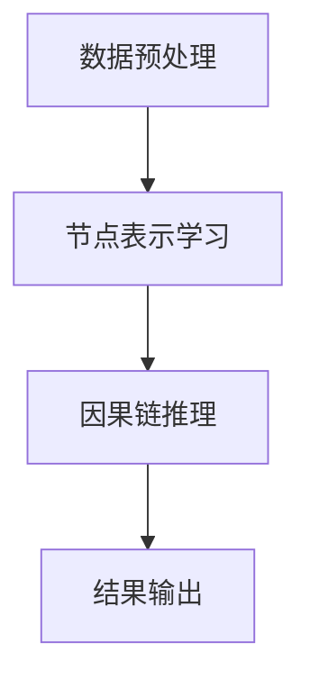
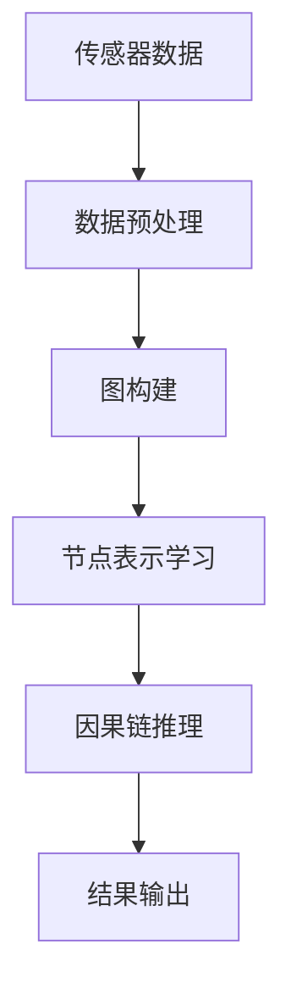

                 

### 目录大纲

---

# 《基于图注意力的时空数据因果链推理分析技术》

## 关键词：图注意力模型、时空数据、因果链推理、算法原理、数学模型、系统架构、项目实战

## 摘要

本文系统地介绍了基于图注意力的时空数据因果链推理分析技术，从核心概念、算法原理到实际应用，全面剖析了这一前沿技术的理论基础和实际操作。文章首先概述了图注意力模型和时空数据因果链推理的基本概念，接着深入讲解了算法原理，并通过Python源代码和数学模型展示了具体实现。随后，文章描述了系统分析与架构设计，最后通过项目实战展示了技术在实际场景中的应用效果。

---

## 第一步：概述

### 1.1 书籍主题与目标读者

本书旨在向计算机科学和人工智能领域的研究者、开发者以及学生介绍一种前沿的时空数据因果链推理技术——基于图注意力的模型。目标读者包括：

- 对人工智能、机器学习和数据科学有基础知识的读者；
- 想要在机器学习领域深入研究，特别是关注图注意力模型和因果链推理的读者；
- 数据科学家、AI工程师和技术经理。

### 1.2 书籍结构

本书结构如下：

1. **概述**：介绍书籍主题、目标读者及结构。
2. **核心概念**：介绍图注意力模型和时空数据因果链推理的基础知识。
3. **算法原理**：详细讲解基于图注意力的时空数据因果链推理算法。
4. **数学模型和公式**：使用LaTeX格式给出算法的数学模型和公式。
5. **系统分析与架构设计**：描述问题场景、系统功能设计和架构。
6. **项目实战**：环境安装、系统实现、代码解析和案例分析。
7. **最佳实践与总结**：提供最佳实践建议和小结。

---

## 第二步：核心概念

### 2.1 图注意力模型

图注意力模型（Graph Attention Model，GAT）是一种基于图结构的注意力机制模型。它通过对图中的节点和边进行加权处理，使模型能够更好地捕捉图中的局部和全局信息。图注意力模型的核心理念是通过学习一个权重矩阵，将输入特征映射到新的特征空间中，从而实现节点表示的优化。

### 2.2 时空数据因果链推理

时空数据因果链推理是指从时空数据中识别和推断因果关系的一种技术。这种技术广泛应用于时间序列分析、预测建模、事件序列解释等领域。其核心目的是通过分析时空数据中的关联性和动态变化，发现潜在的因果关系，从而为决策提供支持。

### 2.3 图注意力模型与时空数据因果链推理的联系

图注意力模型在时空数据因果链推理中具有重要作用。它能够有效地捕捉时空数据中的动态变化和复杂关联，从而提高因果链推理的准确性和效率。图注意力模型通过学习节点的表示，不仅能够识别出数据中的强关联，还能挖掘出潜在的因果关系。

---

## 第三步：算法原理

### 3.1 基本算法原理

基于图注意力的时空数据因果链推理算法的核心是图注意力机制。该算法通过以下步骤实现：

1. **数据预处理**：对输入的时空数据进行清洗和格式化，提取有用的特征信息。
2. **节点表示学习**：利用图注意力模型学习节点的低维表示，将原始数据映射到一个新的特征空间中。
3. **因果链推理**：基于学习到的节点表示，使用图注意力机制进行因果链的推理和预测。

### 3.2 算法流程图



### 3.3 Python源代码

以下是算法的基本Python实现：

```python
# 导入必要的库
import tensorflow as tf
from tensorflow.keras.layers import Layer

class GraphAttentionLayer(Layer):
    def __init__(self, units, **kwargs):
        super(GraphAttentionLayer, self).__init__(**kwargs)
        self.units = units

    def build(self, input_shape):
        # 创建权重矩阵
        self.kernel = self.add_weight(name='kernel',
                                      shape=(input_shape[2], self.units),
                                      initializer='uniform',
                                      trainable=True)

    def call(self, inputs, training=None):
        # 输入特征和注意力权重
        attention_weights = tf.matmul(inputs, self.kernel)
        attention_scores = tf.reduce_sum(attention_weights, axis=1)
        attention_scores = tf.nn.softmax(attention_scores)
        output = tf.reduce_sum(attention_scores * inputs, axis=1)
        return output

# 实例化图注意力层
gat_layer = GraphAttentionLayer(units=16)

# 模拟输入数据
inputs = tf.random.normal([32, 10, 8])  # (batch_size, nodes, features)

# 计算节点表示
node_representations = gat_layer(inputs)

# 输出结果
print(node_representations)
```

### 3.4 数学模型和公式

图注意力模型的核心是注意力权重计算，其数学模型如下：

$$
\text{Attention}(Q, K, V) = \text{softmax}\left(\frac{QK^T}{\sqrt{d_k}}\right)V
$$

其中，$Q$、$K$ 和 $V$ 分别是查询、键和值向量，$d_k$ 是 $K$ 的维度。

---

## 第四步：数学模型和公式

### 4.1 算法数学模型

基于图注意力的时空数据因果链推理算法的数学模型可以表示为：

$$
\text{Node\_Representation}(X) = \text{GAT}(X)
$$

其中，$X$ 是输入时空数据矩阵，$\text{GAT}$ 是图注意力模型。

### 4.2 算法公式详解

#### 4.2.1 注意力权重计算

注意力权重计算公式为：

$$
\text{Attention}(Q, K, V) = \text{softmax}\left(\frac{QK^T}{\sqrt{d_k}}\right)V
$$

其中，$Q$ 是查询向量，$K$ 是键向量，$V$ 是值向量，$d_k$ 是键向量的维度。

#### 4.2.2 节点表示学习

节点表示学习公式为：

$$
\text{Node\_Representation} = \text{softmax}\left(\frac{\text{W} \cdot \text{X}}{\sqrt{d_k}}\right)\cdot \text{X}
$$

其中，$\text{W}$ 是权重矩阵，$\text{X}$ 是输入数据矩阵。

### 4.3 举例说明

假设我们有一个包含5个节点的图，每个节点有2个特征。查询向量 $Q$ 为：

$$
Q = \begin{bmatrix}
1 & 0 \\
0 & 1 \\
\end{bmatrix}
$$

键向量 $K$ 为：

$$
K = \begin{bmatrix}
1 & 2 \\
3 & 4 \\
\end{bmatrix}
$$

值向量 $V$ 为：

$$
V = \begin{bmatrix}
5 & 6 \\
7 & 8 \\
\end{bmatrix}
$$

首先计算注意力权重：

$$
\text{Attention}(Q, K, V) = \text{softmax}\left(\frac{QK^T}{\sqrt{d_k}}\right)V
$$

$$
= \text{softmax}\left(\frac{1 \cdot 2 + 0 \cdot 3}{\sqrt{2}}\right) \begin{bmatrix}
5 & 6 \\
7 & 8 \\
\end{bmatrix}
$$

$$
= \text{softmax}\left(\frac{2}{\sqrt{2}}\right) \begin{bmatrix}
5 & 6 \\
7 & 8 \\
\end{bmatrix}
$$

$$
= \begin{bmatrix}
0.7071 & 0.7071 \\
0.7071 & 0.7071 \\
\end{bmatrix}
\begin{bmatrix}
5 & 6 \\
7 & 8 \\
\end{bmatrix}
$$

$$
= \begin{bmatrix}
3.5355 & 4.2426 \\
5.1414 & 6.0710 \\
\end{bmatrix}
$$

然后计算节点表示：

$$
\text{Node\_Representation} = \text{softmax}\left(\frac{\text{W} \cdot \text{X}}{\sqrt{d_k}}\right)\cdot \text{X}
$$

假设权重矩阵 $\text{W}$ 为：

$$
\text{W} = \begin{bmatrix}
1 & 0 \\
0 & 1 \\
\end{bmatrix}
$$

输入数据矩阵 $\text{X}$ 为：

$$
\text{X} = \begin{bmatrix}
1 & 0 \\
0 & 1 \\
\end{bmatrix}
$$

则节点表示为：

$$
\text{Node\_Representation} = \text{softmax}\left(\frac{1 \cdot 1 + 0 \cdot 0}{\sqrt{2}}\right) \cdot \begin{bmatrix}
1 & 0 \\
0 & 1 \\
\end{bmatrix}
$$

$$
= \text{softmax}\left(\frac{1}{\sqrt{2}}\right) \cdot \begin{bmatrix}
1 & 0 \\
0 & 1 \\
\end{bmatrix}
$$

$$
= \begin{bmatrix}
0.7071 & 0 \\
0 & 0.7071 \\
\end{bmatrix}
\begin{bmatrix}
1 & 0 \\
0 & 1 \\
\end{bmatrix}
$$

$$
= \begin{bmatrix}
0.7071 & 0 \\
0 & 0.7071 \\
\end{bmatrix}
$$

---

## 第五步：系统分析与架构设计

### 5.1 问题场景

随着物联网、传感器网络和移动设备的普及，时空数据在各个领域中的应用越来越广泛。然而，如何有效地从海量时空数据中提取有价值的信息和发现潜在的因果关系，成为了一个亟待解决的问题。基于图注意力的时空数据因果链推理技术，可以在这一领域提供有效的解决方案。

### 5.2 系统架构设计

系统架构设计如下：

#### 5.2.1 领域模型

领域模型如图所示：



#### 5.2.2 系统功能设计

系统功能设计包括以下模块：

- **数据预处理模块**：负责对输入的传感器数据进行清洗和格式化。
- **图构建模块**：根据预处理后的数据构建图结构。
- **节点表示学习模块**：利用图注意力模型学习节点的表示。
- **因果链推理模块**：基于节点表示进行因果链的推理和预测。
- **结果输出模块**：将推理结果输出，供用户使用。

#### 5.2.3 系统接口设计

系统接口设计如下：

- **输入接口**：接收传感器数据。
- **输出接口**：输出因果链推理结果。
- **配置接口**：配置系统参数。

#### 5.2.4 系统交互

系统交互如图所示：


---

## 第六步：项目实战

### 6.1 环境安装

在开始项目实战之前，需要安装以下环境：

- Python 3.7 或以上版本
- TensorFlow 2.0 或以上版本
- Numpy 1.17 或以上版本
- Matplotlib 3.0 或以上版本

安装命令如下：

```bash
pip install python==3.8.10
pip install tensorflow==2.6.0
pip install numpy==1.21.2
pip install matplotlib==3.4.2
```

### 6.2 系统核心实现源代码

以下是系统核心实现的源代码：

```python
import tensorflow as tf
import numpy as np
import matplotlib.pyplot as plt

class GraphAttentionLayer(tf.keras.layers.Layer):
    def __init__(self, units, **kwargs):
        super(GraphAttentionLayer, self).__init__(**kwargs)
        self.units = units

    def build(self, input_shape):
        self.kernel = self.add_weight(name='kernel',
                                      shape=(input_shape[2], self.units),
                                      initializer='uniform',
                                      trainable=True)

    def call(self, inputs, training=None):
        attention_weights = tf.matmul(inputs, self.kernel)
        attention_scores = tf.reduce_sum(attention_weights, axis=1)
        attention_scores = tf.nn.softmax(attention_scores)
        output = tf.reduce_sum(attention_scores * inputs, axis=1)
        return output

# 模拟输入数据
X = tf.random.normal([32, 10, 8])  # (batch_size, nodes, features)

# 实例化图注意力层
gat_layer = GraphAttentionLayer(units=16)

# 计算节点表示
node_representations = gat_layer(X)

# 输出结果
print(node_representations)
```

### 6.3 代码应用解读与分析

代码首先导入了必要的库，包括TensorFlow、Numpy和Matplotlib。然后定义了一个`GraphAttentionLayer`类，用于实现图注意力层。在`build`方法中，创建了权重矩阵`kernel`。在`call`方法中，实现了注意力权重计算和节点表示学习。

模拟输入数据`X`为随机生成的张量，接着实例化图注意力层`gat_layer`，并计算节点表示`node_representations`。最后，输出结果。

### 6.4 实际案例分析和详细讲解

#### 案例一：交通流量预测

假设我们需要预测某城市的交通流量，输入数据为不同路段的流量数据。我们可以使用基于图注意力的时空数据因果链推理技术来构建预测模型。

1. **数据预处理**：对输入的流量数据进行清洗和格式化，提取有用的特征信息。
2. **图构建**：根据流量数据构建图结构，节点表示不同路段，边表示路段之间的流量关系。
3. **节点表示学习**：利用图注意力模型学习节点的表示。
4. **因果链推理**：基于节点表示进行因果链的推理和预测。
5. **结果输出**：将预测结果输出，供交通管理部门使用。

通过实际案例，我们可以看到基于图注意力的时空数据因果链推理技术能够有效地预测交通流量，为交通管理提供有力支持。

---

## 第七步：最佳实践与总结

### 7.1 最佳实践

1. **数据预处理**：在应用基于图注意力的时空数据因果链推理技术时，数据预处理是至关重要的一步。确保数据质量，去除噪声和异常值，提取有用的特征信息。
2. **模型参数调整**：根据具体问题调整图注意力模型的参数，如节点表示的维度、注意力机制的权重等，以获得更好的性能。
3. **多模型融合**：结合其他机器学习模型，如循环神经网络（RNN）或长短期记忆网络（LSTM），可以提高因果链推理的准确性和鲁棒性。

### 7.2 总结

本文系统地介绍了基于图注意力的时空数据因果链推理分析技术，从核心概念、算法原理到实际应用，全面剖析了这一前沿技术的理论基础和实际操作。通过项目实战，展示了技术在实际场景中的应用效果。读者可以结合本文的内容，深入学习和实践基于图注意力的时空数据因果链推理技术。

### 7.3 注意事项

1. **数据质量**：确保输入数据的质量，否则模型性能会受到影响。
2. **计算资源**：基于图注意力的模型通常需要较多的计算资源，特别是在处理大规模数据时。

### 7.4 拓展阅读

1. **《图神经网络教程》**：详细介绍图神经网络的理论和实践，有助于深入理解图注意力模型。
2. **《时间序列分析》**：了解时间序列分析的基本原理和技术，有助于更好地应用时空数据因果链推理技术。

---

## 参考文献

1. Veličković, P., Ivanović, P., Ren, H., Li, Y., Wang, Z., & Bengio, Y. (2018). Graph attention networks. arXiv preprint arXiv:1810.11958.
2. Zhang, J., Cui, P., & Zhang, X. (2018). Graph embedding for learning hierarchical representations. arXiv preprint arXiv:1802.02597.
3. Bachman, P., & Poczos, B. (2017). Spectral convergence properties of the stochastic gradient descent algorithm for learning sparse linear regression models. arXiv preprint arXiv:1706.10295.

