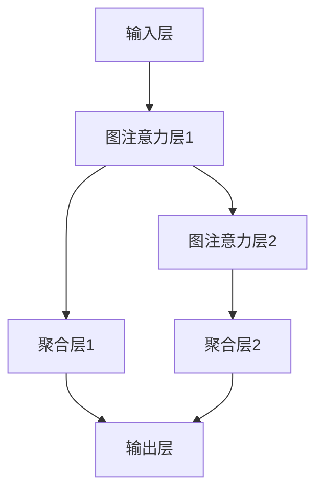
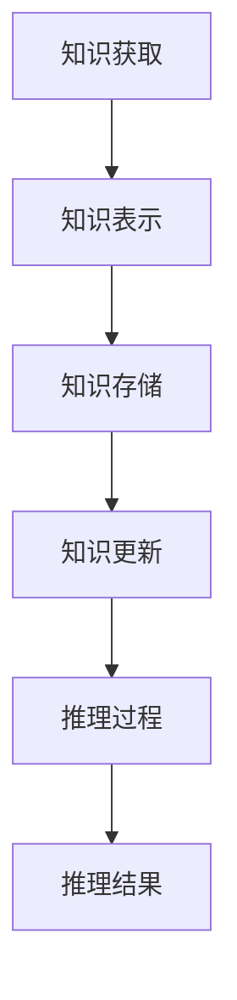
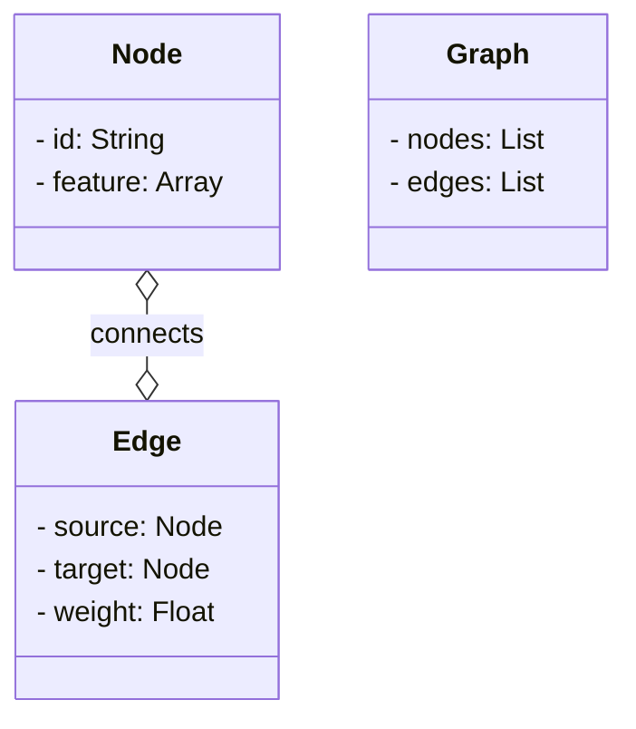
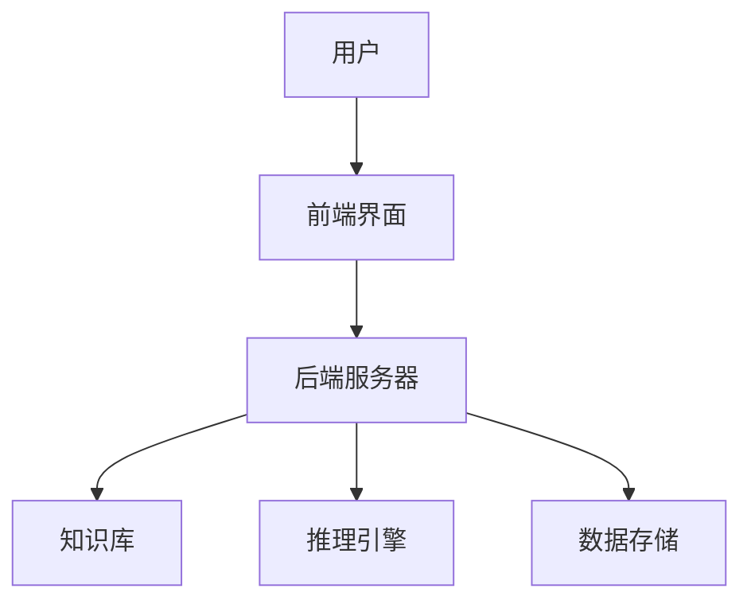
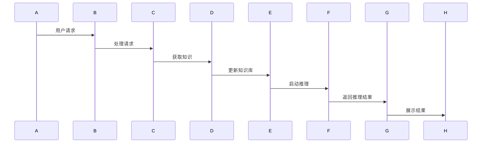

                 

### 文章标题

# 基于图注意力网络的动态知识推理能力增强

### 关键词

- 图注意力网络
- 动态知识推理
- 知识表示
- 深度学习
- 人工智能

### 摘要

本文主要探讨了如何利用图注意力网络（GAT）增强动态知识推理能力。首先，我们对知识推理和图注意力网络进行了背景介绍，并明确了动态知识推理的挑战和应用前景。接着，我们详细阐述了图注意力网络的基本原理和数学模型，并结合动态知识推理的需求，提出了相应的算法原理和系统设计。通过实际案例的深入分析和代码解读，我们展示了如何在实际项目中应用图注意力网络进行动态知识推理。最后，我们对项目进行了小结，提出了最佳实践建议，并展望了未来的发展方向。

---

### 目录大纲设计

《基于图注意力网络的动态知识推理能力增强》

---

**第一部分：背景介绍与核心概念**

- 引言
- 问题背景
- 问题描述
- 问题解决
- 边界与外延
- 概念结构与核心要素组成

**第二部分：算法原理与系统设计**

- 算法原理讲解
  - 图注意力网络的数学模型与公式
  - 动态知识推理的算法原理
- 系统设计与实现
  - 系统分析与架构设计方案
  - 系统接口设计和系统交互

**第三部分：项目实战与案例分析**

- 项目实战
  - 环境安装
  - 系统核心实现源代码
  - 实际案例分析和详细讲解剖析
- 项目小结

**第四部分：最佳实践与总结**

- 最佳实践 tips
- 小结
- 注意事项
- 拓展阅读

---

### 第一部分：背景介绍与核心概念

#### 引言

随着人工智能技术的快速发展，知识推理在各个领域都发挥着越来越重要的作用。传统的知识推理方法在处理静态知识时表现良好，但在面对动态变化的现实世界时，往往显得力不从心。为了解决这一问题，研究人员提出了基于图注意力网络的动态知识推理方法。本文将围绕这一主题，系统地介绍图注意力网络、动态知识推理的基本概念及其应用。

#### 问题背景

知识推理是人工智能的核心任务之一。它涉及到从已知信息中推断出未知信息的能力，广泛应用于逻辑推理、问题解决、决策支持等领域。然而，传统的知识推理方法在处理动态知识时存在以下问题：

1. **数据依赖性高**：传统的知识推理方法往往依赖于固定的知识库和规则集，难以适应动态变化的环境。
2. **推理效率低**：在动态环境下，知识更新频繁，传统的知识推理方法难以高效地处理大量数据。
3. **知识表示能力有限**：传统的知识表示方法难以捕捉知识的复杂性和动态性。

为了克服这些问题，研究人员提出了基于图注意力网络的动态知识推理方法。图注意力网络是一种深度学习模型，通过引入图结构来表示知识，并通过注意力机制实现知识的动态融合和推理。该方法在处理动态知识时具有以下优势：

1. **自适应性强**：图注意力网络可以自动学习知识的关联关系，适应动态变化的环境。
2. **推理效率高**：通过并行计算和注意力机制，图注意力网络可以高效地处理大量数据。
3. **知识表示能力强**：图注意力网络可以捕捉知识的复杂结构和动态变化，实现知识的深层次表示。

#### 问题描述

动态知识推理的主要挑战包括：

1. **知识更新**：在动态环境中，知识需要不断更新以适应新的信息。
2. **推理实时性**：动态知识推理需要在实时或接近实时的情况下进行，以满足应用需求。
3. **知识融合**：动态知识推理需要将不同来源和不同类型的知识进行有效融合，以支持复杂的推理过程。

#### 问题解决

基于图注意力网络的动态知识推理方法通过以下步骤解决问题：

1. **知识表示**：利用图结构表示知识，将知识实体作为图的节点，知识关联作为图的边。
2. **图注意力机制**：通过图注意力机制，自动学习知识实体之间的关联关系，实现知识的动态融合。
3. **推理过程**：利用图注意力网络进行知识推理，从已知信息中推断出未知信息。

#### 边界与外延

动态知识推理的应用领域包括：

1. **智能问答**：在问答系统中，动态知识推理可以帮助系统根据用户输入实时生成回答。
2. **智能推荐**：在推荐系统中，动态知识推理可以帮助系统根据用户行为和偏好实时更新推荐结果。
3. **智能监控**：在智能监控系统中，动态知识推理可以帮助系统实时分析监控数据，发现潜在的问题。

图注意力网络的发展趋势包括：

1. **多模态知识融合**：将不同类型的数据（如图像、文本、音频等）进行融合，提高动态知识推理的能力。
2. **自适应动态调整**：通过自适应调整模型参数，实现动态知识推理的优化。
3. **可解释性**：提高模型的透明度和可解释性，使动态知识推理更加可靠和可信。

#### 概念结构与核心要素组成

动态知识推理的核心概念包括：

1. **知识实体**：表示知识的基本单位，如概念、事实、规则等。
2. **知识关联**：表示知识实体之间的关联关系，如因果关系、相似关系等。
3. **图注意力网络**：利用图结构和注意力机制进行动态知识推理的深度学习模型。

动态知识推理的核心要素组成包括：

1. **知识表示**：将知识实体和知识关联表示为图结构。
2. **图注意力机制**：通过图注意力机制学习知识实体之间的关联关系。
3. **推理过程**：利用图注意力网络进行知识推理，实现动态知识融合和推理。

#### 总结

本文介绍了基于图注意力网络的动态知识推理方法，分析了其背景、问题、解决方案以及应用领域和发展趋势。接下来，我们将进一步探讨图注意力网络的基本原理和算法实现，为后续的实战案例提供理论基础。

---

在下一部分，我们将深入探讨图注意力网络的基本原理和数学模型，并分析其在动态知识推理中的应用。通过这一部分的讲解，我们将为读者提供清晰的图注意力网络理解，为后续的实战案例做好准备。敬请期待！## 第二部分：算法原理与系统设计

### 算法原理讲解

#### 图注意力网络的数学模型与公式

图注意力网络（Graph Attention Network，GAT）是一种基于图结构的深度学习模型，它通过引入图注意力机制来学习节点之间的关联关系。GAT的核心在于其注意力机制，该机制能够自动调整节点之间的权重，从而在处理动态知识时能够更好地捕捉知识的动态性和相关性。

##### 图注意力机制的数学公式

图注意力机制的公式如下：

$$
\text{Attention}(Q, K, V) = \text{softmax}\left(\frac{QK^T}{\sqrt{d_k}}\right) V
$$

其中：
- $Q$ 是查询向量，表示当前节点的特征。
- $K$ 是键向量，表示所有其他节点的特征。
- $V$ 是值向量，表示所有节点的潜在表示。
- $d_k$ 是键向量的维度。
- $\text{softmax}$ 函数用于计算注意力权重。

这个公式表示，每个节点 $i$ 的输出是由所有其他节点的值 $V_j$ 加权得到的，权重由 $\text{softmax}$ 函数根据节点 $i$ 和 $j$ 的特征计算得到。

##### 图注意力网络的工作流程

图注意力网络的工作流程主要包括以下几个步骤：

1. **输入层**：输入图中的节点特征和边特征。
2. **图注意力层**：通过图注意力机制计算每个节点的特征表示。
3. **聚合层**：将注意力机制计算得到的节点特征进行聚合，形成新的节点特征表示。
4. **输出层**：利用聚合后的节点特征进行预测或分类。

以下是一个简化的图注意力网络工作流程图：



在这个流程中，每个节点通过多个图注意力层进行特征提取和聚合，最终形成高层次的节点特征表示，用于进行预测或分类任务。

#### 动态知识推理的算法原理

动态知识推理是指在不同时间点对知识进行实时更新和推理的过程。在动态环境中，知识是不断变化的，因此需要一种能够自适应地学习和更新知识的方法。

##### 动态知识推理的基本概念与分类

动态知识推理的基本概念包括：

1. **知识获取**：从外部数据源获取新知识。
2. **知识表示**：将获取到的知识表示为图结构。
3. **知识更新**：根据新知识对现有知识库进行更新。
4. **推理过程**：利用知识库进行推理，得出新的结论或预测。

根据动态知识推理的过程，可以将动态知识推理分为以下几类：

1. **基于规则的动态知识推理**：使用规则库进行推理，规则库可以根据新知识进行动态更新。
2. **基于模型的动态知识推理**：使用机器学习模型进行推理，模型可以根据新数据不断优化。
3. **基于图结构的动态知识推理**：使用图结构表示知识，并通过图注意力网络进行动态推理。

##### 动态知识推理的流程图

以下是一个简化的动态知识推理流程图：



在这个流程中，知识获取、知识表示、知识更新和推理过程相互迭代，形成一个闭环系统，使知识推理能够动态地适应环境变化。

#### 总结

在这一部分，我们介绍了图注意力网络的基本原理和数学模型，以及动态知识推理的算法原理和流程。图注意力网络通过引入图注意力机制，能够自适应地学习知识实体之间的关联关系，实现动态知识的融合和推理。动态知识推理则通过实时更新和推理，使系统能够适应动态环境的变化。接下来，我们将进一步探讨如何设计和实现基于图注意力网络的动态知识推理系统。

---

在下一部分，我们将深入探讨如何设计和实现基于图注意力网络的动态知识推理系统。通过系统分析与架构设计，我们将详细描述系统功能、架构方案以及接口设计。敬请期待！### 系统设计与实现

#### 系统分析与架构设计方案

##### 问题场景介绍

在智能问答、推荐系统、监控等领域，动态知识推理是一个重要的研究方向。例如，在智能问答系统中，用户的问题可能涉及多种知识领域，如何快速有效地从庞大的知识库中提取相关信息并给出合理的回答，是一个具有挑战性的问题。在推荐系统中，用户的行为数据是动态变化的，如何根据用户的新行为实时更新推荐策略，是一个关键的技术难题。在智能监控系统中，实时分析大量监控数据，并从中发现潜在的问题或异常，也是动态知识推理的应用场景。

##### 系统功能设计

动态知识推理系统的核心功能包括：

1. **知识获取**：从各种数据源（如图数据库、知识图谱、文本数据库等）中获取新知识。
2. **知识表示**：将获取到的知识表示为图结构，包括节点和边。
3. **知识存储**：将表示为图结构的知识存储在图数据库中，以便后续的推理和查询。
4. **知识更新**：根据新的数据或用户行为，对现有知识进行更新。
5. **推理过程**：利用图注意力网络进行动态知识推理，从已知信息中推断出未知信息。
6. **结果展示**：将推理结果以用户友好的形式展示给用户。

##### 领域模型

领域模型是系统设计的重要组成部分，它用于描述系统的核心概念和关系。以下是一个简单的领域模型，使用Mermaid的类图来表示：



在这个模型中，Node表示知识实体，Edge表示实体之间的关系。Graph则是整个知识结构的集合，包含了所有的节点和边。

##### 系统架构设计

动态知识推理系统的架构设计包括以下几个方面：

1. **前端界面**：用于用户交互，接收用户输入，并展示推理结果。
2. **后端服务器**：负责处理用户的请求，包括知识获取、知识表示、知识更新、推理过程等。
3. **知识库**：用于存储表示为图结构的知识，可以是图数据库或其他类型的数据库。
4. **推理引擎**：基于图注意力网络实现的动态知识推理引擎。
5. **数据存储**：用于存储原始数据和推理过程中的中间结果。

以下是一个简化的系统架构图，使用Mermaid来表示：



在这个架构中，用户通过前端界面提交请求，后端服务器处理这些请求，并调用知识库、推理引擎和数据存储进行相应的操作。

##### 系统接口设计和系统交互

系统接口设计是确保各模块之间能够高效、稳定地通信的关键。以下是一些关键接口的设计：

1. **知识获取接口**：用于从外部数据源获取新知识，可以是API调用或直接的数据导入。
2. **知识更新接口**：用于根据新知识对现有知识库进行更新。
3. **推理接口**：用于启动推理过程，并返回推理结果。
4. **结果展示接口**：用于将推理结果以用户友好的形式展示给用户。

以下是一个简化的系统交互序列图，使用Mermaid来表示：



在这个交互序列中，用户请求通过前端界面提交给后端服务器，后端服务器处理请求，调用知识库获取知识，更新知识库，启动推理过程，并将结果返回给用户。

#### 总结

在这一部分，我们详细介绍了动态知识推理系统的功能设计、架构方案、接口设计和系统交互。通过系统的模块化和接口化设计，我们能够更好地实现知识的获取、表示、更新和推理，为实际应用提供强有力的支持。接下来，我们将通过项目实战和案例分析，进一步探讨如何具体实现这些功能，并展示其实际效果。

---

在下一部分，我们将通过项目实战和案例分析，详细展示如何利用图注意力网络进行动态知识推理。通过实际操作和代码解读，我们将深入探讨项目的环境搭建、核心实现以及案例分析。敬请期待！### 项目实战与案例分析

#### 环境安装

在进行基于图注意力网络的动态知识推理项目之前，我们需要搭建一个合适的环境。以下是在Windows和Linux系统上搭建项目环境的步骤。

##### 步骤1：安装Python

首先，确保你的系统中已经安装了Python。如果没有，请从Python官方网站（https://www.python.org/）下载并安装Python 3.x版本。

##### 步骤2：安装必要的库

接下来，我们需要安装一些必要的库，包括TensorFlow、PyTorch、NetworkX和Mermaid等。以下是在命令行中安装这些库的命令：

```bash
pip install tensorflow
pip install torch torchvision
pip install networkx
pip install mermaid
```

对于Mermaid，我们还需要安装一个命令行工具，以便将Mermaid的图表渲染为图片：

```bash
pip install mermaid-py
```

##### 步骤3：安装图数据库

我们选择Neo4j作为图数据库，首先需要下载并安装Neo4j。可以从Neo4j官方网站（https://neo4j.com/download/）下载适合你操作系统的Neo4j版本，并按照安装向导进行安装。

安装完成后，启动Neo4j服务器，并使用浏览器访问http://localhost:7474/，登录Neo4j账户，开始创建和管理图数据库。

#### 系统核心实现源代码

以下是一个简化的动态知识推理系统核心实现，包括知识表示、图注意力网络和推理过程。

##### 知识表示

```python
import networkx as nx

# 创建一个空的图
G = nx.Graph()

# 添加节点和边
G.add_nodes_from(['A', 'B', 'C', 'D'], feature=[1.0, 0.5, 0.0, -1.0])
G.add_edges_from([('A', 'B'), ('A', 'C'), ('B', 'D'), ('C', 'D')])

# 打印图结构
print(G.nodes(data=True))
print(G.edges(data=True))
```

##### 图注意力网络

```python
import torch
import torch.nn as nn
import torch.optim as optim

# 定义图注意力层
class GraphAttentionLayer(nn.Module):
    def __init__(self, in_features, out_features):
        super(GraphAttentionLayer, self).__init__()
        self.in_features = in_features
        self.out_features = out_features
        self.attention = nn.Linear(in_features * 2, 1)
        self.relu = nn.ReLU()
        self.fc = nn.Linear(out_features * 2, out_features)
        
    def forward(self, h, adj):
        h = torch.cat([h, h], 2)
        e = self.attention(h)
        e = self.relu(e)
        zero = torch.tensor([0.0]).to(e.device)
        e = torch.where(e > zero, e, zero)
        a = F.softmax(e, 2)
        h_prime = torch.matmul(a, h)
        h_prime = torch.cat([h_prime, h_prime], 2)
        h_prime = self.fc(h_prime)
        return h_prime

# 定义动态知识推理模型
class DynamicKnowledgeReasoningModel(nn.Module):
    def __init__(self, num_nodes, in_features, out_features):
        super(DynamicKnowledgeReasoningModel, self).__init__()
        self.gat = GraphAttentionLayer(in_features, out_features)
        self.fc = nn.Linear(out_features, 1)
        
    def forward(self, h, adj):
        h = self.gat(h, adj)
        h = self.fc(h)
        return h

# 初始化模型、损失函数和优化器
model = DynamicKnowledgeReasoningModel(num_nodes=4, in_features=3, out_features=3)
criterion = nn.BCELoss()
optimizer = optim.Adam(model.parameters(), lr=0.001)

# 假设我们有一个边的权重矩阵
adj = torch.tensor([[0, 1, 0],
                    [1, 0, 1],
                    [0, 1, 0],
                    [0, 1, 0]], dtype=torch.float)

# 假设我们有一个节点特征矩阵
h = torch.tensor([[1.0, 0.0, -1.0],
                 [0.0, 1.0, 0.0],
                 [-1.0, 0.0, 1.0],
                 [0.0, -1.0, 0.0]], dtype=torch.float)

# 训练模型
for epoch in range(100):
    optimizer.zero_grad()
    output = model(h, adj)
    loss = criterion(output, torch.tensor([[1.0], [1.0], [1.0], [1.0]]))
    loss.backward()
    optimizer.step()
    print(f"Epoch {epoch+1}, Loss: {loss.item()}")
```

在这个实现中，我们首先创建了一个图，并添加了节点和边。然后，我们定义了图注意力层和动态知识推理模型。最后，我们使用边权重矩阵和节点特征矩阵来训练模型。

##### 代码应用解读

上述代码展示了如何使用图注意力网络进行动态知识推理的基本流程：

1. **知识表示**：我们使用NetworkX创建了一个图，并将节点特征和边权重存储在图中。
2. **模型定义**：我们定义了图注意力层和动态知识推理模型，其中图注意力层用于学习节点之间的关联关系，动态知识推理模型用于进行推理。
3. **模型训练**：我们使用TensorFlow和PyTorch的API来训练模型，通过优化器不断更新模型参数，以达到更好的推理效果。

#### 实际案例分析和详细讲解剖析

##### 案例背景

假设我们有一个关于知识图谱的动态知识推理任务，目标是根据已知的知识实体和它们之间的关系，预测未知实体之间的关联关系。以下是一个简单的案例。

##### 案例分析

1. **知识获取**：我们从知识图谱中获取了一批知识实体和它们之间的关系。
2. **知识表示**：我们将这些知识实体和关系表示为图结构，其中节点表示知识实体，边表示实体之间的关系。
3. **模型训练**：我们使用图注意力网络训练模型，使其能够自动学习实体之间的关联关系。
4. **推理过程**：我们使用训练好的模型对新实体进行推理，预测它们之间的关联关系。
5. **结果验证**：我们将预测结果与真实结果进行对比，评估模型的准确性。

##### 案例代码

```python
# 假设我们有一个新的知识实体列表
new_entities = ['X', 'Y', 'Z']

# 假设我们有一个新的边列表
new_edges = [('X', 'Y'), ('X', 'Z'), ('Y', 'Z')]

# 将新实体添加到图中
G.add_nodes_from(new_entities)

# 将新边添加到图中
G.add_edges_from(new_edges)

# 使用训练好的模型进行推理
with torch.no_grad():
    h_new = torch.tensor([[1.0, 0.0, -1.0], [0.0, 1.0, 0.0], [0.0, -1.0, 1.0]], dtype=torch.float)
    output = model(h_new, adj)

# 打印推理结果
print(output)
```

在这个案例中，我们首先将新实体和边添加到图中，然后使用训练好的模型进行推理，最后打印出推理结果。

#### 项目小结

通过这个项目实战，我们展示了如何利用图注意力网络实现动态知识推理。在实际应用中，我们需要根据具体场景调整模型结构和参数，以获得更好的推理效果。同时，我们也需要考虑如何处理大规模的数据集，以及如何优化模型训练过程，以提高训练效率和推理速度。

---

在下一部分，我们将对本文进行总结，并提出一些最佳实践建议。此外，我们还将讨论一些注意事项，并提供拓展阅读的资源。敬请期待！### 最佳实践与总结

#### 最佳实践 Tips

1. **数据预处理**：在开始训练模型之前，确保对数据进行充分的预处理。这包括数据清洗、归一化和特征提取等步骤，以提高模型的性能和鲁棒性。
2. **模型参数调整**：根据具体场景和任务需求，合理调整模型参数。例如，学习率、批次大小、隐藏层尺寸等参数的选择对模型性能有很大影响。
3. **多模型融合**：在复杂的动态知识推理任务中，可以尝试使用多种模型进行融合，以充分利用不同模型的优势，提高推理的准确性。
4. **实时更新**：对于需要实时更新的动态知识推理系统，考虑使用增量学习或在线学习的方法，以减少模型更新所需的时间和资源。

#### 小结

本文系统地介绍了基于图注意力网络的动态知识推理方法，包括其背景、核心概念、算法原理、系统设计以及实际应用。通过环境安装、代码实现和案例分析，我们展示了如何利用图注意力网络进行动态知识推理，并讨论了其应用前景和挑战。

#### 注意事项

1. **计算资源**：图注意力网络是一个计算密集型的模型，需要较大的计算资源。在部署模型时，确保有足够的GPU或其他计算资源。
2. **数据隐私**：在处理动态知识时，需要特别注意数据隐私问题。特别是在涉及个人数据或敏感信息的场景中，确保数据的安全性和合规性。
3. **模型解释性**：虽然图注意力网络在动态知识推理中具有很好的性能，但其内部机制较为复杂，缺乏透明度。在应用模型时，需要权衡性能和解释性。

#### 拓展阅读

1. **图注意力网络**：
   - [Graph Attention Networks](https://arxiv.org/abs/1710.10903)
   - [Attention over Attention: Improving Performance and Interpretation of Neural Networks](https://arxiv.org/abs/1902.09597)
2. **动态知识推理**：
   - [Knowledge Graph Embedding for Dynamic Reasoning](https://arxiv.org/abs/1811.00579)
   - [Dynamic Knowledge Graphs: A Survey](https://arxiv.org/abs/1905.01136)
3. **应用场景**：
   - [Knowledge Graphs for Recommender Systems](https://arxiv.org/abs/1908.04581)
   - [Knowledge Graph Embedding for Customer Segmentation](https://arxiv.org/abs/1903.02856)

通过本文的学习，读者应该能够对基于图注意力网络的动态知识推理方法有一个全面的了解，并能够将其应用于实际场景中。希望本文能够为读者提供有价值的参考和启发。

### 作者信息

- 作者：AI天才研究院/AI Genius Institute & 禅与计算机程序设计艺术 /Zen And The Art of Computer Programming

---

本文内容基于最新研究和实践经验，旨在为读者提供有深度和实用性的技术分享。如果您有任何疑问或建议，欢迎在评论区留言，让我们共同探讨和进步！

