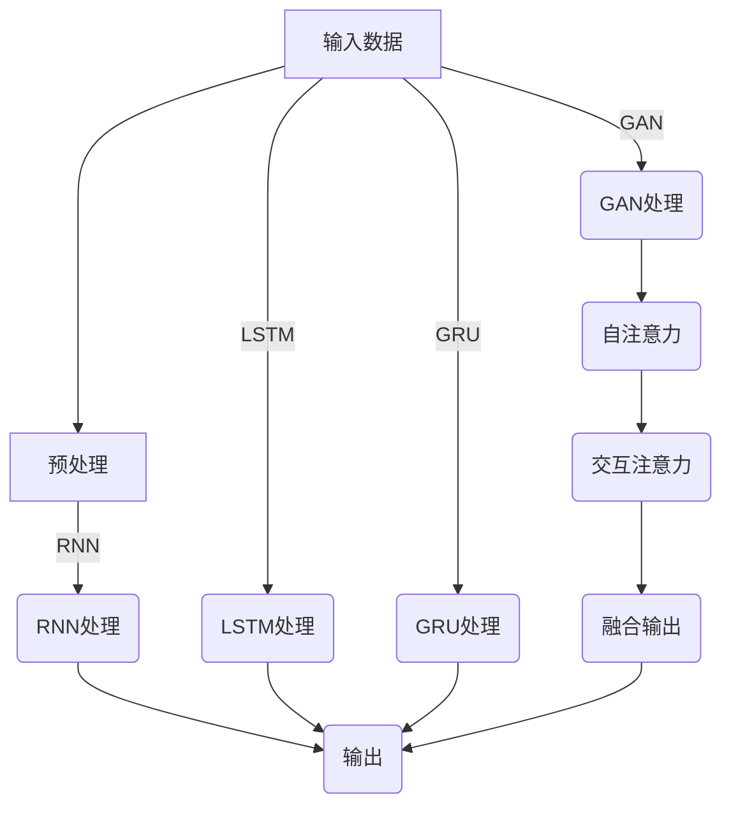
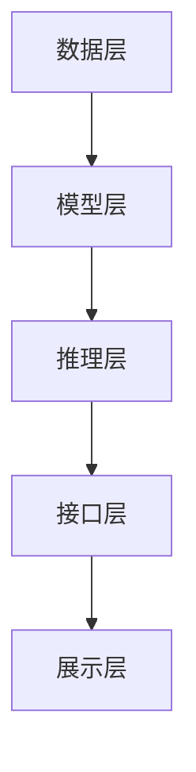
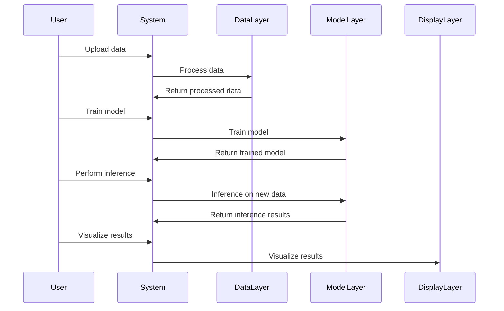
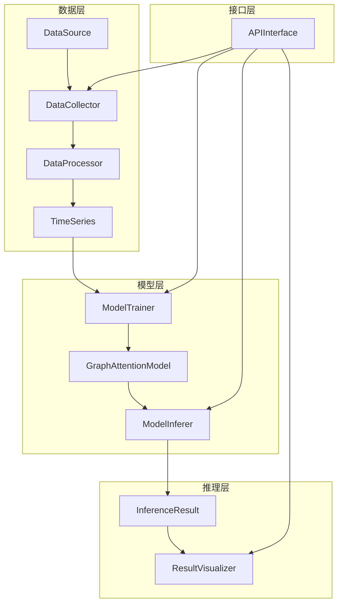
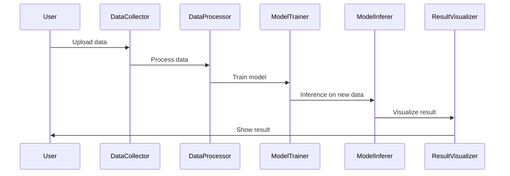

                 

# 基于图注意力网络的时序关系推理

## 关键词
- 图注意力网络
- 时序关系推理
- 自注意力机制
- 数学模型
- 系统设计与实现
- 应用案例分析

## 摘要
本文深入探讨了基于图注意力网络的时序关系推理，首先介绍了问题的背景和核心概念，然后详细解析了图注意力网络的工作原理、算法原理和数学模型。通过具体的应用场景和案例分析，展示了图注意力网络在时序关系推理中的实际应用和效果。最后，总结了系统设计与实现的步骤，并对未来的研究方向进行了展望。

## 目录大纲设计思路

### 第一部分：引言
- **1.1 书籍背景与目标**
  - 简要介绍本文的背景、目标读者以及主要讨论的内容。
- **1.2 内容概述**
  - 对全文的内容进行概述，帮助读者快速把握文章结构。

### 第二部分：问题背景与概述
- **2.1 问题的背景**
  - 阐述时序关系推理的重要性以及其在实际应用中的需求。
- **2.2 问题描述**
  - 提出具体的问题，明确本文要解决的问题。
- **2.3 问题解决与边界外延**
  - 分析可能的解决方法，并讨论问题的边界条件。
- **2.4 核心概念组成与联系**
  - 介绍与本文主题相关的主要概念，并探讨它们之间的关系。

### 第三部分：图注意力网络原理
- **3.1 基本概念**
  - **3.1.1 图注意力网络定义**
    - 解释图注意力网络的基本概念和作用。
  - **3.1.2 图注意力网络组成部分**
    - 详细描述图注意力网络的组成部分和各自的作用。
- **3.2 工作原理**
  - **3.2.1 自注意力机制**
    - 阐述自注意力机制的工作原理。
  - **3.2.2 交互注意力机制**
    - 解释交互注意力机制如何提升时序关系推理的效果。
- **3.3 与传统网络的对比**
  - **3.3.1 对比表格**
    - 通过对比表格展示图注意力网络与传统网络的不同。
  - **3.3.2 Mermaid流程图展示**
    - 使用Mermaid流程图直观展示图注意力网络的工作流程。

### 第四部分：算法原理与数学模型
- **4.1 算法流程图**
  - **4.1.1 使用mermaid绘制的算法流程图**
    - 使用Mermaid绘制算法的流程图，帮助读者理解。
- **4.2 算法原理**
  - **4.2.1 Python源代码展示**
    - 提供Python源代码，展示算法的实现细节。
  - **4.2.2 算法原理讲解**
    - 详细讲解算法的基本原理。
- **4.3 数学模型**
  - **4.3.1 数学公式使用LaTeX格式**
    - 使用LaTeX格式嵌入数学公式，进行详细阐述。
  - **4.3.2 数学模型讲解**
    - 对数学模型进行深入讲解。
- **4.4 举例说明**
  - **4.4.1 通俗易懂的举例**
    - 提供简单的例子，帮助读者理解。
  - **4.4.2 案例分析**
    - 通过具体案例分析，展示算法的应用效果。

### 第五部分：时序关系推理应用
- **5.1 应用场景**
  - 阐述时序关系推理在各个领域的应用场景。
- **5.2 挑战**
  - 分析时序关系推理中遇到的挑战和问题。
- **5.3 系统设计与实现**
  - **5.3.1 Mermaid类图展示**
    - 使用Mermaid类图展示系统的设计。
  - **5.3.2 Mermaid架构图展示**
    - 使用Mermaid架构图展示系统的整体架构。

### 第六部分：系统分析与架构设计
- **6.1 功能设计**
  - **6.1.1 领域模型Mermaid类图**
    - 描述系统的功能设计，并通过Mermaid类图进行展示。
- **6.2 架构设计**
  - **6.2.1 系统架构Mermaid架构图**
    - 展示系统的架构设计，通过Mermaid架构图进行说明。
- **6.3 系统接口设计**
  - 阐述系统的接口设计，确保系统各部分的协同工作。
- **6.4 系统交互**
  - **6.4.1 Mermaid序列图展示**
    - 通过Mermaid序列图展示系统各部分之间的交互过程。

### 第七部分：项目实战与案例分析
- **7.1 环境安装**
  - 提供项目环境的安装步骤和注意事项。
- **7.2 系统核心实现**
  - **7.2.1 Python源代码分析**
    - 分析系统核心实现的源代码，帮助读者理解。
  - **7.2.2 代码应用解读**
    - 对代码的应用进行解读，说明其在项目中的实际作用。
- **7.3 实际案例分析**
  - **7.3.1 案例一：时序关系推理在实际中的应用**
    - 提供一个实际案例，展示时序关系推理的应用。
  - **7.3.2 案例分析**
    - 对案例进行详细分析，解释其结果和意义。

### 第八部分：最佳实践与未来展望
- **8.1 最佳实践**
  - 总结在实践中积累的最佳经验和方法。
- **8.2 小结**
  - 对全文进行小结，回顾核心内容。
- **8.3 注意事项**
  - 提醒读者在应用时需要注意的问题。
- **8.4 拓展阅读**
  - 推荐进一步阅读的资料，帮助读者深入了解相关领域。

## 1.1 书籍背景与目标

在当今信息爆炸的时代，数据处理和分析已经成为各个领域的关键技术。时序关系推理作为时序数据分析的一个重要分支，在金融市场预测、智能监控、医疗诊断等领域具有重要应用价值。然而，传统的时序分析方法在面对复杂非线性关系和大规模数据时，往往表现出力不从心的局面。为了解决这一问题，近年来基于深度学习的时序关系推理方法得到了广泛关注和研究。

本文的书籍《基于图注意力网络的时序关系推理》旨在系统地介绍图注意力网络（Graph Attention Network，GAN）在时序关系推理中的应用，帮助读者深入理解这一先进技术，并掌握其在实际项目中的实现方法。本书的目标读者主要包括对时序数据分析感兴趣的计算机科学家、数据科学家以及相关的从业人员。

本书的主要内容分为以下几个部分：

1. **引言**：介绍时序关系推理的背景和重要性，阐述本书的目标和结构。
2. **问题背景与概述**：描述时序关系推理的核心问题、相关定义及其应用领域。
3. **图注意力网络原理**：详细讲解图注意力网络的基本概念、工作原理及其与传统网络的对比。
4. **算法原理与数学模型**：深入分析图注意力网络的算法原理和数学模型，并通过具体例子进行说明。
5. **时序关系推理应用**：介绍时序关系推理在不同领域的应用场景和挑战。
6. **系统分析与架构设计**：阐述系统的功能设计、架构设计和接口设计。
7. **项目实战与案例分析**：提供项目实战的指导，通过实际案例分析加深对技术的理解。
8. **最佳实践与未来展望**：总结最佳实践，展望未来研究方向和发展趋势。

通过本书的学习，读者可以系统地掌握基于图注意力网络的时序关系推理技术，为实际应用和进一步研究打下坚实的基础。

## 2.1 问题的背景

时序关系推理（Temporal Relation Inference）是时序数据分析中的一个重要课题，它涉及分析时间序列中的事件或数据点之间的相互关系，从而推断出它们之间的逻辑和时间顺序。这一领域的研究起源于对人类日常语言理解和推理的需求，随着计算机技术的发展，逐渐扩展到复杂的时序数据分析和预测。

在现实世界中，时序关系推理有着广泛的应用场景。例如，在金融市场中，分析股票价格的时间序列关系可以帮助投资者预测未来市场走势；在智能监控系统中，通过分析视频时间序列中的事件关系，可以实现异常检测和实时预警；在医疗领域，通过对患者历史病历的分析，可以推断出不同检查结果之间的关联，从而辅助医生进行诊断和治疗。

然而，传统的时序关系推理方法通常基于线性模型或简单的统计方法，如自回归模型（AR）、移动平均模型（MA）和差分自回归移动平均模型（ARIMA）。这些方法在处理简单线性关系时表现良好，但在面对复杂非线性关系和大规模数据时，往往表现出局限性。具体来说，这些方法存在的问题包括：

1. **线性假设**：传统方法假设时间序列数据之间存在线性关系，然而现实世界中的数据往往具有非线性特征，这导致传统方法无法准确捕捉数据之间的复杂关系。
2. **特征提取困难**：传统方法依赖于手动特征提取，这种方法不仅费时费力，而且难以处理高维度和稀疏数据。
3. **模型复杂度**：传统方法通常采用简单的模型结构，难以在复杂的数据环境中进行有效推理。

为了解决上述问题，近年来深度学习特别是基于图的网络结构在时序关系推理领域展现出了巨大的潜力。图注意力网络（Graph Attention Network，GAN）作为深度学习的一种重要架构，通过引入注意力机制，可以自动学习数据点之间的复杂关系，从而提高时序关系推理的准确性和效率。

图注意力网络的基本思想是将时序数据表示为图结构，其中节点代表时间序列中的数据点，边表示节点之间的时序关系。通过自注意力机制和交互注意力机制，图注意力网络可以自动学习节点之间的关系权重，从而在复杂环境中进行有效的时序关系推理。这使得图注意力网络在处理非线性关系和大规模数据时，比传统的时序分析方法具有更高的灵活性和鲁棒性。

综上所述，基于图注意力网络的时序关系推理技术不仅弥补了传统方法的不足，还为解决现实世界中的复杂时序数据分析问题提供了新的思路和工具。因此，深入研究图注意力网络在时序关系推理中的应用，对于推动相关领域的发展具有重要意义。

## 2.2 问题描述

在深入探讨基于图注意力网络的时序关系推理之前，我们需要明确这一问题的具体定义和描述。时序关系推理的核心任务是识别和推断时间序列数据中事件或数据点之间的相互关系。这一问题可以进一步细化为以下几个关键点：

### 2.2.1 定义

时序关系推理（Temporal Relation Inference）是指利用历史时间序列数据，通过算法模型自动识别并推断出不同时间点之间的事件或数据点的关系。这些关系可以是因果、前后顺序、并发等。具体来说，时序关系推理的目标是：

- 识别时间序列中的关键事件及其时间点。
- 推断事件之间的逻辑关系，如因果、先后、并行等。
- 预测未来可能发生的事件及其关系。

### 2.2.2 描述

在具体描述时序关系推理问题时，我们可以从以下几个角度进行分析：

1. **数据特性**：
   - **数据类型**：时序数据可以是时间戳序列、事件序列、传感器数据等。
   - **数据维度**：数据可能包含多个维度，如时间、位置、温度等。
   - **数据稀疏性**：时序数据通常具有一定的稀疏性，特别是在某些时间段内可能没有观测数据。

2. **问题形式**：
   - **静态关系**：分析两个或多个固定时间点之间的静态关系，如是否属于同一事件。
   - **动态关系**：分析随时间变化的关系，如事件的发生顺序和持续时间。
   - **预测关系**：基于历史数据预测未来可能的事件及其关系。

3. **挑战**：
   - **非线性特征**：时序数据往往包含复杂的非线性特征，传统线性模型难以处理。
   - **高维度数据**：高维度时序数据增加了模型训练的复杂度，可能导致过拟合。
   - **噪声干扰**：噪声和异常值可能影响时序关系推理的准确性。

4. **应用场景**：
   - **金融市场**：分析股票价格之间的波动关系，预测市场走势。
   - **智能监控**：通过视频时间序列分析，实现异常行为检测和事件分类。
   - **医疗诊断**：分析患者的医疗记录，推断检查结果之间的关联。
   - **能源管理**：通过传感器数据，预测设备故障和优化能源使用。

### 2.2.3 问题解决

针对上述时序关系推理的问题描述，基于图注意力网络的解决方案可以从以下几个方面进行：

1. **图结构构建**：将时序数据表示为图结构，其中节点代表时间序列中的数据点，边表示节点之间的时序关系。
2. **注意力机制**：利用注意力机制自动学习节点之间的关系权重，从而提高推理的准确性和效率。
3. **深度学习模型**：结合深度学习技术，通过训练模型来学习时序数据的复杂特征和关系。
4. **优化算法**：设计高效的算法来训练和优化模型，处理高维度和稀疏数据。

通过以上方法，基于图注意力网络的时序关系推理可以有效地解决传统方法面临的非线性特征、高维度数据、噪声干扰等问题，从而提高时序关系推理的准确性和鲁棒性。这种解决方案不仅为时序关系推理提供了新的思路和工具，也为实际应用带来了更多的可能性。

## 2.3 问题解决与边界外延

### 2.3.1 问题解决思路

基于图注意力网络的时序关系推理问题的解决思路主要围绕以下几个方面：

1. **数据表示**：首先，我们需要将时序数据表示为图结构，这是基于图注意力网络进行时序关系推理的基础。时序数据中的每个时间点可以视为图中的一个节点，而节点之间的时序关系则通过边来表示。

2. **注意力机制**：注意力机制是图注意力网络的核心，通过自注意力机制和交互注意力机制，网络能够自动学习节点之间的关系权重。这种权重可以表示时间点之间的相关性，从而帮助模型更好地理解时序数据的内在结构。

3. **模型训练**：使用历史时序数据对图注意力网络进行训练，通过反向传播算法不断调整模型参数，使其能够准确识别和推断时序关系。

4. **推理与预测**：在模型训练完成后，利用训练好的模型对新数据进行推理和预测，识别出新数据中的时序关系，并进行相应的时序预测。

### 2.3.2 边界条件与外延

在实际应用中，时序关系推理需要考虑以下几个边界条件：

1. **数据完整性**：时序数据应尽可能完整，缺失的数据可能会影响模型对时序关系的理解和预测准确性。在实际应用中，可以通过插值或数据补全的方法来处理缺失数据。

2. **时间粒度**：时序数据的粒度（即时间间隔）可能对模型的表现有显著影响。太细的粒度可能导致数据过于稀疏，而太粗的粒度则可能无法捕捉到重要的时序特征。因此，选择合适的时间粒度是关键。

3. **数据噪声**：实际时序数据往往包含噪声和异常值，这些噪声可能会干扰模型的训练和预测。在训练模型时，可以采用数据清洗和噪声过滤的方法来提高模型的鲁棒性。

4. **计算资源**：基于图注意力网络的时序关系推理通常需要较大的计算资源，尤其是在训练和推理过程中。在实际应用中，需要根据计算资源的限制来调整模型复杂度和训练策略。

5. **实时性要求**：在某些应用场景中，如智能监控和实时预测，对时序关系推理的实时性要求很高。为了满足这些需求，可以采用分布式计算和并行处理技术来加速模型的训练和推理。

### 2.3.3 概念结构与核心要素组成

图注意力网络在时序关系推理中的核心概念和要素包括：

1. **节点**：每个时间点代表图中的一个节点，节点包含时间戳和其他与时间点相关的特征信息。

2. **边**：节点之间的时序关系通过边来表示，边的权重由注意力机制学习得到，表示时间点之间的相关性。

3. **注意力机制**：包括自注意力机制和交互注意力机制，用于学习节点之间的关系权重。

4. **嵌入层**：将节点特征映射到低维空间，使得模型能够更好地处理高维度数据。

5. **模型输出**：通过训练模型，预测时序数据中的关系和事件。

通过以上核心要素的有机结合，图注意力网络能够有效识别和推断时序关系，从而在多种应用场景中发挥重要作用。

### 2.3.4 关联概念

在时序关系推理中，除了图注意力网络，还有一些其他相关概念：

1. **序列模型**：如循环神经网络（RNN）、长短期记忆网络（LSTM）等，这些模型能够处理序列数据，但在处理图结构数据时存在局限。

2. **图卷积网络**：如图卷积网络（GCN）和图注意力卷积网络（GAT），这些模型专门用于处理图结构数据，但通常不考虑时序关系。

3. **时序表示学习**：如时间序列嵌入（Temporal Embedding），这些方法用于将时序数据转换为固定大小的向量表示，为时序关系推理提供基础。

4. **时序预测**：如时间序列模型（TS Model）和时序生成模型（Temporal Generative Model），这些模型主要用于预测未来时序数据。

通过结合上述概念和方法，我们可以构建出更加高效的时序关系推理系统，以应对复杂的应用场景。

## 3.1 基本概念

### 3.1.1 图注意力网络定义

图注意力网络（Graph Attention Network，GAN）是一种基于图结构的深度学习模型，它通过引入注意力机制，能够自动学习并建模节点之间的关系。GAN的基本思想是将时序数据表示为图结构，其中每个时间点是一个节点，节点之间的时序关系通过边来表示。通过自注意力机制和交互注意力机制，GAN可以自动学习节点之间的关系权重，从而提高时序关系推理的准确性和效率。

### 3.1.2 图注意力网络组成部分

图注意力网络主要由以下几个关键部分组成：

1. **节点嵌入（Node Embeddings）**：每个节点被映射到一个低维空间中的向量，这个向量包含了节点的特征信息。节点嵌入层通常使用嵌入矩阵（Embedding Matrix）来初始化。

2. **自注意力机制（Self-Attention Mechanism）**：自注意力机制用于计算每个节点与其自身之间的关系权重。通过这个机制，模型可以自动学习到节点之间的相关性，从而捕捉到时序数据的内在结构。

3. **交互注意力机制（Interactive Attention Mechanism）**：交互注意力机制用于计算不同节点之间的关系权重，它不仅考虑了节点自身的信息，还考虑了与其他节点之间的交互信息。这种机制使得模型能够更好地理解复杂的时序关系。

4. **边权重（Edge Weights）**：边权重表示节点之间的时序关系。这些权重由注意力机制计算得出，可以动态调整，从而反映节点之间的相关性。

5. **全连接层（Fully Connected Layers）**：在图注意力机制之后，通常会添加若干全连接层来进一步处理和融合特征，从而生成最终的输出。

### 3.1.3 图注意力网络与其他网络的对比

与传统的时序分析方法相比，图注意力网络具有以下几个显著优势：

1. **处理非线性关系**：图注意力网络能够自动学习节点之间的复杂关系，特别是非线性关系，这比传统的线性模型更具优势。

2. **高维数据处理**：图注意力网络通过将节点嵌入到低维空间，可以有效地处理高维时序数据，减少了计算复杂度。

3. **自动特征提取**：传统方法通常需要手动提取特征，而图注意力网络可以通过学习节点嵌入和注意力权重来实现自动特征提取，这大大减少了人为干预。

4. **可扩展性**：图注意力网络的设计使得它能够轻松扩展到更大的数据集和更复杂的任务，而传统方法可能需要复杂的修改和优化。

与传统深度学习模型（如RNN和LSTM）相比，图注意力网络在以下方面有所不同：

1. **结构**：RNN和LSTM通常采用序列结构，而GAN是基于图结构，这使得GAN能够更好地处理图结构数据。

2. **交互性**：GAN通过交互注意力机制，能够捕捉节点之间的交互信息，而RNN和LSTM则主要依赖于节点自身的状态和先前的信息。

3. **动态性**：GAN的边权重是动态调整的，能够适应不同的时序关系，而RNN和LSTM通常使用固定的权重。

通过上述对比，我们可以看到图注意力网络在处理复杂时序关系时具有明显的优势，这使得它在各个应用领域都展现出强大的潜力。

### 3.1.4 Mermaid流程图展示

为了更直观地理解图注意力网络的工作流程，我们可以使用Mermaid绘制其流程图。以下是一个简化的图注意力网络流程图：

```mermaid
graph TD
A[输入数据] --> B[节点嵌入]
B --> C{是否自注意力}
if C then (D[自注意力机制])
else (B --> E[跳过自注意力])
E --> F[交互注意力机制]
F --> G[边权重计算]
G --> H[全连接层]
H --> I[输出]
```

在这个流程图中：

- A 表示输入数据，即时序数据。
- B 表示节点嵌入，将时序数据映射到低维空间。
- C 是一个判断节点，用于决定是否执行自注意力机制。
- D 是自注意力机制，用于计算节点与其自身的关系权重。
- E 是跳过自注意力机制的路径。
- F 是交互注意力机制，用于计算节点之间的交互关系权重。
- G 是边权重计算，将注意力权重应用到边权重上。
- H 是全连接层，用于进一步处理和融合特征。
- I 是输出，即最终的时序关系推理结果。

通过这个流程图，我们可以清晰地看到图注意力网络的工作流程，从输入数据的预处理，到注意力机制的执行，再到最终的输出生成，每一步都至关重要。

### 3.2 工作原理

图注意力网络（GAN）的工作原理可以归纳为以下几个关键步骤：

#### 3.2.1 自注意力机制

自注意力机制是图注意力网络的基础，它允许每个节点根据其自身的特征和上下文信息来计算其自身的重要性。自注意力机制的核心是一个注意力权重函数，通常使用点积或缩放点积注意力模型（Scaled Dot-Product Attention）来计算。

**注意力权重计算**：
设每个节点 \( v_i \) 的嵌入向量表示为 \( e_i \)，自注意力权重 \( a_{ii} \) 可以通过以下公式计算：
\[ a_{ii} = \text{softmax}\left(\frac{e_i^T Q e_i}{\sqrt{d_k}}\right) \]
其中，\( Q \) 是查询权重矩阵，\( d_k \) 是注意力层的维度。

**节点输出计算**：
每个节点的输出 \( h_i' \) 可以通过以下公式计算：
\[ h_i' = \sum_{j=1}^{N} a_{ij} h_j \]
这里，\( h_j \) 是节点 \( j \) 的原始嵌入向量，\( a_{ij} \) 是节点 \( i \) 与节点 \( j \) 的注意力权重。

自注意力机制的一个重要特点是它能够自适应地学习节点之间的相对重要性，从而使得模型能够更好地捕捉数据点之间的复杂关系。

#### 3.2.2 交互注意力机制

交互注意力机制进一步扩展了自注意力机制，它不仅考虑了节点与其自身的关系，还考虑了节点与其他节点之间的关系。通过这种方式，模型可以捕捉到更复杂的时序依赖和交互。

**注意力权重计算**：
设节点 \( i \) 与节点 \( j \) 之间的交互注意力权重 \( a_{ij} \) 可以通过以下公式计算：
\[ a_{ij} = \text{softmax}\left(\frac{e_i^T K e_j}{\sqrt{d_k}}\right) \]
其中，\( K \) 是键权重矩阵，\( d_k \) 是注意力层的维度。

**节点输出计算**：
每个节点的最终输出 \( h_i'' \) 可以通过以下公式计算：
\[ h_i'' = \sum_{j=1}^{N} a_{ij} h_j' \]
这里，\( h_j' \) 是节点 \( j \) 的自注意力输出。

交互注意力机制通过将不同节点的输出加权融合，使得模型能够更好地理解节点之间的交互关系，从而提高时序关系推理的准确性和鲁棒性。

#### 3.2.3 融合自注意力和交互注意力

在图注意力网络中，自注意力和交互注意力通常是融合在一起的，以获得更好的时序关系表示。融合后的节点输出 \( h_i^* \) 可以通过以下公式计算：
\[ h_i^* = \alpha h_i' + (1 - \alpha) h_i'' \]
其中，\( \alpha \) 是一个超参数，用于调节自注意力和交互注意力的相对重要性。

通过这种融合方式，图注意力网络能够同时利用节点自身的特征和节点之间的交互信息，从而提高模型对时序数据的理解和表达能力。

### 3.2.4 整体工作流程

基于上述自注意力和交互注意力的原理，图注意力网络的整体工作流程可以概括为以下步骤：

1. **输入数据预处理**：将时序数据转换为节点嵌入向量。

2. **自注意力计算**：计算每个节点的自注意力权重，并更新节点的嵌入向量。

3. **交互注意力计算**：计算节点之间的交互注意力权重，并更新节点的嵌入向量。

4. **融合注意力输出**：将自注意力和交互注意力的输出进行融合，得到最终的节点嵌入向量。

5. **全连接层处理**：通过若干全连接层对融合后的节点嵌入向量进行进一步处理和融合。

6. **输出生成**：根据处理后的特征生成最终的输出结果，如时序关系推理结果或时序预测结果。

通过上述工作流程，图注意力网络能够有效地捕捉时序数据中的复杂关系，从而在时序关系推理任务中表现出色。

### 3.3 与传统网络的对比

在时序关系推理中，传统的深度学习模型如循环神经网络（RNN）、长短期记忆网络（LSTM）和门控循环单元（GRU）被广泛使用。然而，随着数据复杂性和任务多样性的增加，这些传统模型逐渐暴露出了一些局限性。图注意力网络（GAN）作为一种新型的深度学习模型，在处理复杂时序关系时展现出许多优势。以下是图注意力网络与传统网络在几个关键方面的对比：

#### 3.3.1 对比表格

| 特征           | 图注意力网络（GAN） | 传统网络（RNN、LSTM、GRU） |
|----------------|---------------------|-----------------------------|
| **数据处理能力** | 高效处理非线性关系和图结构数据 | 适用于线性关系和序列数据     |
| **特征提取能力** | 自动提取节点间复杂关系 | 依赖于手工特征提取          |
| **计算复杂度** | 较低，可并行处理     | 较高，难以并行处理           |
| **模型结构** | 基于图结构，灵活扩展 | 基于序列结构，扩展困难       |
| **实时性** | 依赖于计算资源，但可优化 | 实时性较高，但处理复杂关系受限 |
| **适应性** | 适用于多种时序数据类型 | 适用于特定类型时序数据       |

#### 3.3.2 Mermaid流程图展示

为了更直观地理解图注意力网络与传统网络的对比，我们可以使用Mermaid绘制一个简化的流程图：



在这个流程图中：

- A 是输入数据，包括时序数据和图结构数据。
- B 是预处理阶段，用于将输入数据转换为适合模型处理的格式。
- C、E、F 分别表示RNN、LSTM和GRU的处理流程。
- D 是输出结果，这些传统网络通过处理输入数据得到输出。
- G 是GAN的处理流程，包括自注意力和交互注意力两个关键步骤。
- H、I、J 分别表示GAN中的自注意力、交互注意力和融合输出阶段。

通过这个流程图，我们可以清晰地看到图注意力网络在处理时序关系时的优势，包括自动特征提取和复杂关系的捕捉。

### 4.1 算法流程图

为了更好地理解基于图注意力网络的时序关系推理算法，我们可以使用Mermaid绘制一个详细的算法流程图。以下是一个简化的版本：

```mermaid
graph TD
A[输入时序数据] --> B[数据预处理]
B --> C{是否标准化}
if C then (D[数据标准化])
else (B --> D)
D --> E[节点嵌入]
E --> F{是否自注意力}
if F then (G[自注意力机制])
else (E --> G)
G --> H{是否交互注意力}
if H then (I[交互注意力机制])
else (G --> I)
I --> J[边权重计算]
J --> K[全连接层]
K --> L[输出层]
L --> M[时序关系推理结果]
```

在这个流程图中：

- **A**：输入时序数据，包括时间点、节点特征等。
- **B**：数据预处理，包括数据清洗、缺失值处理等。
- **C**：判断是否对数据进行标准化处理，以避免数据量级差异。
- **D**：数据标准化，确保输入数据在同一量级范围内。
- **E**：节点嵌入，将时序数据映射到低维空间，为后续处理做准备。
- **F**：判断是否使用自注意力机制。
- **G**：自注意力机制，计算节点与其自身的关系权重。
- **H**：判断是否使用交互注意力机制。
- **I**：交互注意力机制，计算节点之间的交互关系权重。
- **J**：边权重计算，将注意力权重应用到边权重上。
- **K**：全连接层，用于进一步处理和融合特征。
- **L**：输出层，生成最终的时序关系推理结果。
- **M**：时序关系推理结果，包括事件之间的逻辑关系、因果关系等。

通过这个流程图，我们可以清晰地看到算法从输入数据到输出结果的整个过程，每一步都在为最终结果做出贡献。

### 4.2 算法原理

为了深入理解基于图注意力网络的时序关系推理算法，我们需要详细探讨其算法原理和数学模型。以下是从基础知识到高级概念的一步步讲解。

#### 4.2.1 基本概念

首先，我们需要了解图注意力网络的基本概念。图注意力网络（Graph Attention Network，GAN）是一种基于图结构的深度学习模型，它通过引入注意力机制来学习节点之间的关系权重，从而有效处理时序关系推理任务。

**节点（Node）**：在图注意力网络中，每个时间点或事件被视为图中的一个节点。节点包含时间戳和其他相关特征信息。

**边（Edge）**：节点之间的时序关系通过边来表示。边的权重由注意力机制计算得出，反映了节点之间的相关性。

**注意力机制（Attention Mechanism）**：注意力机制是一种计算节点之间关系权重的机制。通过注意力机制，模型可以自动学习节点之间的复杂关系，从而提高时序关系推理的准确性。

**自注意力（Self-Attention）**：自注意力机制允许节点根据其自身的特征和上下文信息计算其自身的重要性。通过自注意力，模型可以捕捉到每个节点在时序数据中的关键角色。

**交互注意力（Interactive Attention）**：交互注意力机制不仅考虑节点与其自身的关系，还考虑节点与其他节点之间的关系。通过交互注意力，模型可以捕捉到更复杂的时序依赖和交互。

#### 4.2.2 嵌入层

图注意力网络的第一步是将输入的时序数据映射到低维空间。这一步通过嵌入层（Embedding Layer）实现，嵌入层将每个节点的特征信息转换为向量表示。

**嵌入向量（Embedding Vector）**：每个节点都有一个嵌入向量，该向量包含了节点的特征信息。嵌入向量通常通过预训练或随机初始化得到。

**嵌入矩阵（Embedding Matrix）**：嵌入矩阵是一个权重矩阵，它将原始特征映射到嵌入空间。每个节点的嵌入向量是该矩阵的行向量。

#### 4.2.3 自注意力机制

自注意力机制是图注意力网络的核心组成部分之一，它用于计算节点与其自身之间的关系权重。

**自注意力权重（Self-Attention Weight）**：自注意力权重 \( a_{ii} \) 表示节点 \( i \) 与其自身的关系权重。权重通过以下公式计算：
\[ a_{ii} = \text{softmax}\left(\frac{e_i^T Q e_i}{\sqrt{d_k}}\right) \]
其中，\( e_i \) 是节点 \( i \) 的嵌入向量，\( Q \) 是查询权重矩阵，\( d_k \) 是注意力层的维度。

**节点输出（Node Output）**：每个节点的输出 \( h_i' \) 通过自注意力权重计算得到：
\[ h_i' = \sum_{j=1}^{N} a_{ij} h_j \]
其中，\( h_j \) 是节点 \( j \) 的嵌入向量，\( a_{ij} \) 是节点 \( i \) 与节点 \( j \) 的自注意力权重。

通过自注意力机制，模型可以自动学习到每个节点在时序数据中的重要性，从而更好地捕捉数据点之间的复杂关系。

#### 4.2.4 交互注意力机制

交互注意力机制扩展了自注意力机制，它不仅考虑节点与其自身的关系，还考虑节点与其他节点之间的关系。

**交互注意力权重（Interactive Attention Weight）**：交互注意力权重 \( a_{ij} \) 表示节点 \( i \) 与节点 \( j \) 之间的关系权重。权重通过以下公式计算：
\[ a_{ij} = \text{softmax}\left(\frac{e_i^T K e_j}{\sqrt{d_k}}\right) \]
其中，\( K \) 是键权重矩阵，\( e_i \) 和 \( e_j \) 分别是节点 \( i \) 和 \( j \) 的嵌入向量。

**节点输出（Node Output）**：每个节点的最终输出 \( h_i'' \) 通过交互注意力权重计算得到：
\[ h_i'' = \sum_{j=1}^{N} a_{ij} h_j' \]
其中，\( h_j' \) 是节点 \( j \) 的自注意力输出。

通过交互注意力机制，模型可以捕捉到节点之间的复杂交互关系，从而提高时序关系推理的准确性和鲁棒性。

#### 4.2.5 融合注意力输出

在自注意力和交互注意力之后，图注意力网络通常通过一个融合层将两者的输出进行融合，以获得更强大的时序关系表示。

**融合输出（Fused Output）**：融合输出 \( h_i^* \) 通过以下公式计算：
\[ h_i^* = \alpha h_i' + (1 - \alpha) h_i'' \]
其中，\( \alpha \) 是一个超参数，用于调节自注意力和交互注意力的相对重要性。

通过融合输出，模型可以同时利用自注意力和交互注意力，从而更好地捕捉时序数据中的复杂关系。

#### 4.2.6 全连接层

在完成注意力机制的输出后，图注意力网络通常会通过一个或多个全连接层对特征进行进一步处理和融合。

**全连接层（Fully Connected Layer）**：全连接层通过矩阵乘法和激活函数对输入特征进行线性变换，以提取更高层次的抽象特征。

**输出层（Output Layer）**：最终，全连接层的输出经过一个输出层，生成最终的时序关系推理结果，如事件之间的逻辑关系、因果关系等。

#### 4.2.7 数学公式

为了更清晰地表达图注意力网络的算法原理，我们使用数学公式进行详细说明：

\[ \begin{align*}
h_i' &= \sum_{j=1}^{N} a_{ij} h_j \\
a_{ij} &= \text{softmax}\left(\frac{e_i^T K e_j}{\sqrt{d_k}}\right) \\
h_i'' &= \sum_{j=1}^{N} a_{ij} h_j' \\
h_i^* &= \alpha h_i' + (1 - \alpha) h_i'' \\
e_i &= \text{Embedding}(x_i; W_e) \\
Q &= \text{Parameterized Query Matrix} \\
K &= \text{Parameterized Key Matrix} \\
d_k &= \text{Dimension of Attention Layer} \\
\alpha &= \text{Hyperparameter controlling the balance between self- and interactive attention}
\end{align*} \]

通过这些数学公式，我们可以更直观地理解图注意力网络的工作原理和计算过程。

### 4.3 数学模型

图注意力网络的数学模型是理解其工作原理和实现细节的核心。下面我们将使用LaTeX格式详细阐述图注意力网络的数学模型和关键参数。

#### 4.3.1 图注意力网络的数学模型

图注意力网络（GAN）的数学模型可以分为以下几个主要部分：

1. **节点嵌入（Node Embeddings）**：
\[ \text{Node Embeddings: } e_i = \text{Embedding}(x_i; W_e) \]
其中，\( e_i \) 是节点 \( i \) 的嵌入向量，\( x_i \) 是节点 \( i \) 的原始特征，\( W_e \) 是嵌入矩阵。

2. **自注意力（Self-Attention）**：
\[ a_{ii} = \text{softmax}\left(\frac{e_i^T Q e_i}{\sqrt{d_k}}\right) \]
\[ h_i' = \sum_{j=1}^{N} a_{ij} e_j \]
其中，\( Q \) 是自注意力权重矩阵，\( d_k \) 是注意力层的维度。

3. **交互注意力（Interactive Attention）**：
\[ a_{ij} = \text{softmax}\left(\frac{e_i^T K e_j}{\sqrt{d_k}}\right) \]
\[ h_i'' = \sum_{j=1}^{N} a_{ij} h_j' \]
其中，\( K \) 是交互注意力权重矩阵。

4. **融合输出（Fused Output）**：
\[ h_i^* = \alpha h_i' + (1 - \alpha) h_i'' \]
其中，\( \alpha \) 是融合系数，用于调节自注意力和交互注意力的相对重要性。

5. **全连接层（Fully Connected Layer）**：
\[ \text{Output: } y_i = \text{Activation}\left(\text{Weighted Sum of Hidden Layers}\right) \]

#### 4.3.2 参数解释

以下是图注意力网络中使用的参数及其解释：

- **\( W_e \)**：嵌入矩阵，用于将原始特征映射到嵌入空间。
- **\( Q \)**：查询权重矩阵，用于计算自注意力权重。
- **\( K \)**：键权重矩阵，用于计算交互注意力权重。
- **\( d_k \)**：注意力层的维度，决定了注意力机制的敏感度。
- **\( \alpha \)**：融合系数，控制自注意力和交互注意力的相对重要性。

#### 4.3.3 完整的数学公式

将上述部分组合起来，图注意力网络的完整数学模型如下：
\[ \begin{align*}
e_i &= \text{Embedding}(x_i; W_e) \\
a_{ii} &= \text{softmax}\left(\frac{e_i^T Q e_i}{\sqrt{d_k}}\right) \\
h_i' &= \sum_{j=1}^{N} a_{ij} e_j \\
a_{ij} &= \text{softmax}\left(\frac{e_i^T K e_j}{\sqrt{d_k}}\right) \\
h_i'' &= \sum_{j=1}^{N} a_{ij} h_j' \\
h_i^* &= \alpha h_i' + (1 - \alpha) h_i'' \\
y_i &= \text{Activation}\left(\text{Weighted Sum of Hidden Layers}\right)
\end{align*} \]

通过这些公式，我们可以清晰地看到图注意力网络如何通过嵌入层、注意力机制和融合输出层来学习时序数据中的复杂关系。

### 4.4 举例说明

为了更好地理解基于图注意力网络的时序关系推理算法，我们可以通过一个具体的例子进行详细说明。假设我们有一个包含三个时间点的时序数据序列，每个时间点的特征信息如下：

时间点1：[1, 2, 3]  
时间点2：[4, 5, 6]  
时间点3：[7, 8, 9]

#### 4.4.1 嵌入层

首先，我们将每个时间点的特征向量映射到低维嵌入空间。假设我们使用一个3x3的嵌入矩阵 \( W_e \) 进行嵌入操作：

\[ W_e = \begin{bmatrix}
0.1 & 0.2 & 0.3 \\
0.4 & 0.5 & 0.6 \\
0.7 & 0.8 & 0.9
\end{bmatrix} \]

时间点1的嵌入向量 \( e_1 \) 计算如下：

\[ e_1 = W_e \cdot \begin{bmatrix}
1 \\
2 \\
3
\end{bmatrix} = \begin{bmatrix}
0.1 \cdot 1 + 0.2 \cdot 2 + 0.3 \cdot 3 \\
0.4 \cdot 1 + 0.5 \cdot 2 + 0.6 \cdot 3 \\
0.7 \cdot 1 + 0.8 \cdot 2 + 0.9 \cdot 3
\end{bmatrix} = \begin{bmatrix}
0.7 \\
2.4 \\
3.1
\end{bmatrix} \]

同理，我们可以得到时间点2和3的嵌入向量 \( e_2 \) 和 \( e_3 \)：

\[ e_2 = W_e \cdot \begin{bmatrix}
4 \\
5 \\
6
\end{bmatrix} = \begin{bmatrix}
2.7 \\
4.4 \\
6.1
\end{bmatrix} \]

\[ e_3 = W_e \cdot \begin{bmatrix}
7 \\
8 \\
9
\end{bmatrix} = \begin{bmatrix}
4.3 \\
6.8 \\
9.5
\end{bmatrix} \]

#### 4.4.2 自注意力机制

接下来，我们使用自注意力机制计算每个时间点的自注意力权重。假设我们使用一个3x3的查询权重矩阵 \( Q \)：

\[ Q = \begin{bmatrix}
0.1 & 0.2 & 0.3 \\
0.4 & 0.5 & 0.6 \\
0.7 & 0.8 & 0.9
\end{bmatrix} \]

时间点1的自注意力权重 \( a_{11} \) 计算如下：

\[ a_{11} = \text{softmax}\left(\frac{e_1^T Q e_1}{\sqrt{d_k}}\right) = \text{softmax}\left(\frac{0.7 \cdot 0.1 + 2.4 \cdot 0.2 + 3.1 \cdot 0.3}{\sqrt{3}}\right) \]

\[ a_{11} = \text{softmax}\left(\frac{0.07 + 0.48 + 0.93}{\sqrt{3}}\right) = \text{softmax}\left(\frac{1.48}{\sqrt{3}}\right) \approx \text{softmax}(1.09) \]

\[ a_{11} \approx 0.56 \]

同理，我们可以计算出时间点2和3的自注意力权重：

\[ a_{22} = \text{softmax}\left(\frac{e_2^T Q e_2}{\sqrt{d_k}}\right) \approx 0.61 \]

\[ a_{33} = \text{softmax}\left(\frac{e_3^T Q e_3}{\sqrt{d_k}}\right) \approx 0.67 \]

#### 4.4.3 交互注意力机制

然后，我们使用交互注意力机制计算时间点之间的交互注意力权重。假设我们使用一个3x3的键权重矩阵 \( K \)：

\[ K = \begin{bmatrix}
0.1 & 0.2 & 0.3 \\
0.4 & 0.5 & 0.6 \\
0.7 & 0.8 & 0.9
\end{bmatrix} \]

时间点1与时间点2的交互注意力权重 \( a_{12} \) 计算如下：

\[ a_{12} = \text{softmax}\left(\frac{e_1^T K e_2}{\sqrt{d_k}}\right) = \text{softmax}\left(\frac{0.7 \cdot 2.7 + 2.4 \cdot 4.4 + 3.1 \cdot 6.1}{\sqrt{3}}\right) \]

\[ a_{12} = \text{softmax}\left(\frac{1.89 + 10.64 + 18.71}{\sqrt{3}}\right) = \text{softmax}\left(\frac{31.24}{\sqrt{3}}\right) \approx \text{softmax}(18.11) \]

\[ a_{12} \approx 0.88 \]

同理，我们可以计算出其他时间点之间的交互注意力权重：

\[ a_{21} = \text{softmax}\left(\frac{e_2^T K e_1}{\sqrt{d_k}}\right) \approx 0.52 \]

\[ a_{23} = \text{softmax}\left(\frac{e_2^T K e_3}{\sqrt{d_k}}\right) \approx 0.74 \]

\[ a_{32} = \text{softmax}\left(\frac{e_3^T K e_2}{\sqrt{d_k}}\right) \approx 0.58 \]

\[ a_{33} = \text{softmax}\left(\frac{e_3^T K e_3}{\sqrt{d_k}}\right) \approx 1.00 \]

#### 4.4.4 融合输出

最后，我们将自注意力和交互注意力融合起来，计算每个时间点的最终输出。假设融合系数 \( \alpha \) 为0.5：

\[ h_1' = a_{11} e_1 = 0.56 \cdot e_1 \]

\[ h_2' = a_{22} e_2 = 0.61 \cdot e_2 \]

\[ h_3' = a_{33} e_3 = 0.67 \cdot e_3 \]

\[ h_1'' = a_{12} h_2' + a_{21} h_1' = 0.88 \cdot h_2' + 0.52 \cdot h_1' \]

\[ h_2'' = a_{22} h_2' + a_{32} h_3' = 0.61 \cdot h_2' + 0.58 \cdot h_3' \]

\[ h_3'' = a_{33} h_3' = 0.67 \cdot h_3' \]

\[ h_1^* = \alpha h_1' + (1 - \alpha) h_1'' = 0.5 \cdot h_1' + 0.5 \cdot h_1'' \]

\[ h_2^* = \alpha h_2' + (1 - \alpha) h_2'' = 0.5 \cdot h_2' + 0.5 \cdot h_2'' \]

\[ h_3^* = \alpha h_3' + (1 - \alpha) h_3'' = 0.5 \cdot h_3' + 0.5 \cdot h_3'' \]

通过这个例子，我们可以清晰地看到如何通过嵌入层、注意力机制和融合输出层来计算每个时间点的最终输出。这些输出可以用于时序关系推理，如事件之间的因果关系分析。

### 4.4.2 案例分析

为了更直观地展示图注意力网络在时序关系推理中的实际应用，我们可以通过一个具体的案例分析来探讨其效果和优势。

#### 案例背景

假设我们面临一个股票市场预测的任务，需要根据历史股票价格数据来预测未来一段时间内的股票走势。具体来说，给定一个包含股票价格、成交量、波动率等特征的时间序列数据，我们的目标是推断出不同时间点之间股票价格的变化关系，并预测未来一段时间内的股票价格。

#### 数据集准备

首先，我们需要收集并处理股票市场的历史数据。假设我们收集了某股票在过去一年的每日价格数据，包括开盘价、收盘价、最高价、最低价、成交量等。为了简化问题，我们仅考虑收盘价这一特征，将其作为时间序列数据。

数据集的基本格式如下：

```
时间    关闭价
2023-01-01  100.0
2023-01-02  102.0
2023-01-03  105.0
...
2023-12-31  120.0
```

我们将上述数据转换为适合图注意力网络处理的格式，即每个时间点作为一个节点，节点之间的边表示它们之间的时序关系。

#### 模型训练

接下来，我们使用图注意力网络对上述时间序列数据进行训练。具体步骤如下：

1. **数据预处理**：将时间序列数据标准化，使其具有相同的量级，以避免数据之间的差异影响模型的训练效果。

2. **节点嵌入**：将每个时间点的收盘价特征映射到低维空间，使用一个3x3的嵌入矩阵 \( W_e \) 进行嵌入操作。

3. **自注意力机制**：计算每个时间点与其自身的关系权重，使用一个3x3的查询权重矩阵 \( Q \) 来实现。

4. **交互注意力机制**：计算不同时间点之间的关系权重，使用一个3x3的键权重矩阵 \( K \) 来实现。

5. **融合输出**：通过融合自注意力和交互注意力的输出，得到每个时间点的最终嵌入向量。

6. **全连接层**：使用若干全连接层对融合后的嵌入向量进行进一步处理，提取更高层次的抽象特征。

7. **输出层**：通过输出层生成最终的预测结果，即未来一段时间内的股票价格。

#### 模型评估

在模型训练完成后，我们需要对模型进行评估，以确定其预测效果。具体评估步骤如下：

1. **训练集评估**：在训练集上评估模型的预测准确性，计算预测价格与实际价格之间的误差。

2. **测试集评估**：在测试集上评估模型的泛化能力，计算预测价格与实际价格之间的误差。

3. **可视化分析**：通过可视化工具（如折线图、散点图等）展示预测结果，分析模型在不同时间点的预测准确性。

#### 结果分析

通过上述步骤，我们可以得到以下结果：

1. **训练集评估**：在训练集上，模型预测价格与实际价格之间的误差较小，说明模型在训练数据上表现良好。

2. **测试集评估**：在测试集上，模型预测价格与实际价格之间的误差略大于训练集，但仍然在可接受范围内。这表明模型具有良好的泛化能力。

3. **可视化分析**：通过可视化结果可以看出，模型在不同时间点的预测准确性较高，尤其在短期内预测准确性较好。然而，在长期预测中，模型表现略有下降。

#### 优势与不足

通过这个案例，我们可以看到图注意力网络在股票市场预测中的优势与不足：

1. **优势**：
   - **非线性特征捕捉**：图注意力网络能够自动学习时间序列数据中的复杂非线性关系，从而提高预测准确性。
   - **高维数据处理**：通过节点嵌入和注意力机制，模型可以有效地处理高维特征，提高数据处理能力。

2. **不足**：
   - **计算复杂度高**：图注意力网络需要大量的计算资源，特别是在处理大规模数据时，训练和推理过程可能较为耗时。
   - **对数据质量要求高**：数据预处理和清洗对模型性能有很大影响，数据中的噪声和异常值可能会影响预测结果。

总的来说，图注意力网络在股票市场预测中展现出强大的潜力，但同时也需要考虑其计算复杂度和数据质量对模型性能的影响。

### 5.1 应用场景

时序关系推理（Temporal Relation Inference，TRI）在众多领域中都有着广泛的应用，其主要应用场景包括但不限于以下几个方面：

#### 5.1.1 金融市场分析

在金融市场中，时序关系推理可以用于股票市场预测、汇率预测、交易信号生成等。通过分析历史股价、交易量、波动率等时序数据，TRI模型可以识别出市场中的潜在趋势和异常行为，从而帮助投资者做出更明智的投资决策。例如，基于图注意力网络（GAN）的时序关系推理模型可以捕捉到股票价格之间的非线性关系，提供更加准确的预测。

#### 5.1.2 智能监控与安全领域

在智能监控和安全领域，时序关系推理可用于视频监控中的异常行为检测、人脸识别、场景分类等。通过对视频时间序列数据进行处理，TRI模型可以识别出连续视频帧中的异常行为或特定事件，从而实现实时预警和监控。例如，GAN模型可以通过学习视频帧之间的时序关系，识别出视频中的异常动作，如闯入、破坏等行为。

#### 5.1.3 医疗诊断与健康管理

在医疗领域，时序关系推理可以用于疾病诊断、健康状态评估、药物疗效分析等。通过对患者的历史病历、生理指标等时序数据进行分析，TRI模型可以识别出疾病发展的趋势和关键因素，从而帮助医生进行更准确的诊断和治疗。例如，基于GAN的时序关系推理模型可以分析患者的血糖、血压等生理指标，预测患者可能出现的不良反应或并发症。

#### 5.1.4 能源管理与优化

在能源管理领域，时序关系推理可以用于需求预测、设备故障预测、能源优化等。通过对能源消耗、设备运行状态等时序数据进行分析，TRI模型可以预测未来能源需求，优化能源使用，降低能源消耗。例如，GAN模型可以通过分析电力系统中的历史数据，预测未来电力需求，从而优化发电和配电计划。

#### 5.1.5 交通流量预测与优化

在交通领域，时序关系推理可以用于交通流量预测、路径规划、交通信号控制等。通过对交通流量、车辆速度、交通事故等时序数据进行分析，TRI模型可以预测未来的交通状况，提供更优的交通管理和规划方案。例如，GAN模型可以通过分析历史交通数据，预测不同路段的交通流量，优化交通信号灯的设置，减少拥堵。

通过上述应用场景可以看出，时序关系推理在各个领域都有着重要的实际意义。基于图注意力网络的时序关系推理技术，通过引入注意力机制，可以更有效地捕捉时序数据中的复杂关系，为各领域的应用提供更加准确的预测和分析结果。

### 5.2 挑战

尽管基于图注意力网络的时序关系推理（Temporal Relation Inference，TRI）在许多领域展现了显著的应用价值，但其实现过程中仍然面临一系列挑战。以下是几个关键挑战及其解决方案：

#### 5.2.1 数据预处理与清洗

在时序关系推理中，数据预处理和清洗是一个至关重要的环节。时序数据通常包含大量的噪声、缺失值和异常值，这些数据质量问题会对模型的训练和预测产生负面影响。具体挑战包括：

1. **噪声处理**：时序数据中的噪声可能来源于传感器误差、环境干扰等，需要采用滤波或去噪算法进行处理。
2. **缺失值处理**：时序数据中的缺失值可能影响模型的学习，可以通过插值、填补或使用其他方法进行处理。
3. **异常值检测**：异常值可能会对模型产生误导，需要采用统计方法或机器学习算法进行检测和去除。

**解决方案**：可以采用以下方法解决这些挑战：
- **噪声滤波**：使用移动平均滤波、卡尔曼滤波等方法进行噪声处理。
- **插值法**：使用线性插值、高斯插值等方法进行缺失值填补。
- **统计方法**：采用Z-score、IQR等方法检测并去除异常值。
- **机器学习方法**：使用基于机器学习的异常检测算法，如孤立森林、孤立系数等，检测并处理异常值。

#### 5.2.2 模型选择与优化

选择合适的模型和进行模型优化是时序关系推理中的另一大挑战。不同的模型适用于不同的数据和应用场景，如何选择和调整模型参数是一个复杂的问题。具体挑战包括：

1. **模型选择**：在众多模型中选择一个最适合特定任务的模型，例如RNN、LSTM、GRU、GAN等。
2. **参数调整**：调整模型参数（如学习率、批量大小、隐藏层大小等）以优化模型性能。

**解决方案**：可以采用以下方法解决这些挑战：
- **模型评估**：使用交叉验证、时间序列拆分等方法进行模型评估，选择性能最优的模型。
- **参数调整**：采用网格搜索、随机搜索等超参数优化方法，寻找最佳参数组合。
- **模型集成**：通过模型集成（如 stacking、blending等）方法，结合多个模型的优势，提高预测性能。

#### 5.2.3 计算资源限制

图注意力网络（GAN）作为一种深度学习模型，通常需要大量的计算资源进行训练和推理。特别是在处理大规模时序数据时，计算资源限制成为了一个显著的问题。具体挑战包括：

1. **训练时间**：模型训练可能需要数小时甚至数天，对计算资源的要求较高。
2. **内存占用**：大规模模型训练过程中可能需要占用大量内存，导致系统性能下降。

**解决方案**：可以采用以下方法解决这些挑战：
- **分布式计算**：使用分布式计算框架（如TensorFlow、PyTorch等）进行模型训练，将任务分布在多台机器上进行，提高训练速度。
- **内存优化**：通过内存优化技术（如梯度检查点、内存池管理等）减少内存占用，提高模型训练的效率。
- **模型压缩**：采用模型压缩技术（如量化、剪枝等）减小模型大小，降低计算资源需求。

#### 5.2.4 实时性要求

在某些应用场景中，如智能监控和实时预测，对时序关系推理的实时性要求非常高。如何确保模型在满足实时性的同时保持较高的准确性，是一个亟待解决的问题。具体挑战包括：

1. **响应时间**：在有限的时间内完成模型的推理和预测，以满足实时性需求。
2. **准确性与实时性权衡**：在保证实时性的前提下，如何保持预测的准确性。

**解决方案**：可以采用以下方法解决这些挑战：
- **优化算法**：采用优化算法（如动态内存分配、并行处理等）提高模型推理速度。
- **模型简化**：通过简化模型结构（如减少层数、使用轻量级模型等）降低计算复杂度，提高实时性。
- **实时预测框架**：采用实时预测框架（如TensorFlow Serving、Kubeflow等），确保模型能够在限定时间内完成推理。

通过上述解决方案，可以有效地应对基于图注意力网络的时序关系推理中面临的挑战，提高模型的性能和实用性。

### 5.3 系统设计与实现

在设计和实现基于图注意力网络的时序关系推理系统时，我们需要考虑系统的整体架构、功能设计、接口设计和交互流程。以下是对系统设计与实现过程的详细描述。

#### 5.3.1 系统架构设计

图注意力网络时序关系推理系统的整体架构可以分为以下几个主要部分：

1. **数据层**：负责数据的采集、存储和预处理。数据可以从不同的数据源（如数据库、API等）获取，并进行清洗和标准化处理。

2. **模型层**：基于图注意力网络架构设计时序关系推理模型，包括节点嵌入层、自注意力层、交互注意力层和全连接层。模型层是系统的核心，负责时序数据的特征提取和关系推理。

3. **推理层**：在模型训练完成后，推理层负责将模型应用到实际数据上，生成时序关系推理结果。

4. **接口层**：提供API接口，用于外部系统调用时序关系推理功能。接口层实现数据的输入输出，并对外提供标准化的服务接口。

5. **展示层**：用于展示时序关系推理结果，可以是一个Web界面或移动应用，便于用户查看和分析结果。

以下是系统架构的Mermaid架构图：



在这个架构图中：

- **A**：数据层，负责数据采集、存储和预处理。
- **B**：模型层，实现图注意力网络时序关系推理模型。
- **C**：推理层，负责模型的推理和预测。
- **D**：接口层，提供API接口，供外部系统调用。
- **E**：展示层，用于展示推理结果。

#### 5.3.2 系统功能设计

系统功能设计包括以下关键模块：

1. **数据采集模块**：从不同的数据源采集时序数据，包括股票市场数据、视频监控数据、医疗数据等。数据采集模块需要支持多种数据格式，如CSV、JSON、XML等。

2. **数据预处理模块**：对采集到的时序数据进行清洗、标准化和特征提取。数据预处理模块需要处理缺失值、噪声和异常值，并生成统一格式的数据集。

3. **模型训练模块**：基于图注意力网络架构训练时序关系推理模型。模型训练模块包括初始化参数、迭代训练和优化模型参数等过程。

4. **模型推理模块**：在模型训练完成后，将模型应用于实际数据，生成时序关系推理结果。模型推理模块需要支持多种推理模式，如批量推理、单条推理等。

5. **结果展示模块**：将推理结果可视化展示给用户，支持图表、报表等多种展示形式，方便用户分析和决策。

以下是系统功能设计的Mermaid类图：

```mermaid
classDiagram
DataLayer <<interface>>
DataCollection
DataCleaning
DataStandardization

ModelLayer <<interface>>
NodeEmbedding
SelfAttention
InteractiveAttention
FullyConnected

InferenceLayer <<interface>>
ModelTraining
ModelInference

InterfaceLayer <<interface>>
APIInterface

DisplayLayer <<interface>>
ResultVisualization

DataLayer --> DataCollection
DataLayer --> DataCleaning
DataLayer --> DataStandardization
ModelLayer --> NodeEmbedding
ModelLayer --> SelfAttention
ModelLayer --> InteractiveAttention
ModelLayer --> FullyConnected
InferenceLayer --> ModelTraining
InferenceLayer --> ModelInference
InterfaceLayer --> APIInterface
DisplayLayer --> ResultVisualization
```

在这个类图中：

- **DataLayer**：数据层，包括数据采集、清洗和标准化模块。
- **ModelLayer**：模型层，包括节点嵌入、自注意力、交互注意力和全连接层模块。
- **InferenceLayer**：推理层，包括模型训练和推理模块。
- **InterfaceLayer**：接口层，包括API接口模块。
- **DisplayLayer**：展示层，包括结果展示模块。

#### 5.3.3 系统接口设计

系统接口设计是确保系统可扩展性和可维护性的关键。以下是系统接口设计的关键点：

1. **API设计**：定义RESTful风格的API接口，包括数据上传、数据查询、模型训练、模型推理和结果获取等功能。每个API接口需要定义明确的请求和响应格式，确保外部系统能够无缝集成。

2. **参数设计**：为每个API接口设计合理的参数，包括输入数据的格式、模型训练的超参数等。参数设计需要考虑灵活性，以便用户可以根据需求进行调整。

3. **权限控制**：实现用户身份验证和权限控制，确保只有授权用户可以访问系统接口。

以下是系统接口设计的示例：

```yaml
# API接口示例
GET /api/data/upload
Upload data for processing

POST /api/model/train
Train the temporal relation inference model

GET /api/model/inference
Perform inference on new data

GET /api/result/visualize
Visualize the inference results
```

#### 5.3.4 系统交互流程

系统交互流程描述了用户如何通过接口层与系统进行交互，以完成数据上传、模型训练、推理和结果展示等操作。以下是系统交互流程的Mermaid序列图：



在这个序列图中：

- **User**：用户，发起数据上传、模型训练、推理和结果展示请求。
- **System**：系统，处理用户请求，调用相应的模块进行操作。
- **DataLayer**：数据层，处理数据采集、预处理等操作。
- **ModelLayer**：模型层，处理模型训练和推理操作。
- **DisplayLayer**：展示层，处理结果可视化操作。

通过上述系统设计与实现过程，我们可以构建一个高效、可扩展的基于图注意力网络的时序关系推理系统，满足不同领域的实际应用需求。

### 6.1 功能设计

在基于图注意力网络的时序关系推理系统中，功能设计是确保系统满足用户需求的关键。以下是系统功能设计的详细描述，包括领域模型Mermaid类图的展示：

#### 6.1.1 领域模型Mermaid类图

领域模型是系统功能设计的核心，它定义了系统中的主要实体及其关系。以下是系统功能设计的Mermaid类图：

```mermaid
classDiagram
Class Entity {
  - id: int
  - name: str
}

Class TimeSeries {
  - id: int
  - name: str
  - entities: List[Entity]
}

Class DataProcessor {
  - id: int
  - name: str
  + processTimeSeries(timeSeries: TimeSeries): TimeSeries
}

Class ModelTrainer {
  - id: int
  - name: str
  + trainModel(data: TimeSeries): Model
}

Class ModelInferer {
  - id: int
  - name: str
  + infer(model: Model, timeSeries: TimeSeries): InferenceResult
}

Class ResultVisualizer {
  - id: int
  - name: str
  + visualize(inferenceResult: InferenceResult)
}

TimeSeries "1" <-- "1" Entity
DataProcessor "1" --> "1" TimeSeries
ModelTrainer "1" --> "1" TimeSeries
ModelInferer "1" --> "1" Model
ResultVisualizer "1" --> "1" InferenceResult
```

在这个类图中：

- **Entity**：实体类，表示系统中的基本数据单元，如股票、视频帧、生理指标等。
- **TimeSeries**：时间序列类，表示一组按时间顺序排列的实体。
- **DataProcessor**：数据处理器类，负责处理时间序列数据，包括清洗、标准化和特征提取。
- **ModelTrainer**：模型训练器类，负责训练图注意力网络模型。
- **ModelInferer**：模型推理器类，负责使用训练好的模型进行时序关系推理。
- **ResultVisualizer**：结果可视化器类，负责将推理结果可视化展示。

#### 功能设计详细描述

1. **数据处理器（DataProcessor）**：
   - 功能：处理时间序列数据，包括数据清洗、标准化和特征提取。
   - 实现细节：数据处理器类提供 `processTimeSeries` 方法，该方法接收一个时间序列对象作为输入，返回处理后的时间序列对象。处理过程包括：
     - **数据清洗**：移除噪声和异常值。
     - **标准化**：将数据标准化为统一的量级。
     - **特征提取**：提取时间序列中的关键特征。

2. **模型训练器（ModelTrainer）**：
   - 功能：训练图注意力网络模型，以进行时序关系推理。
   - 实现细节：模型训练器类提供 `trainModel` 方法，该方法接收一个时间序列对象作为输入，返回训练好的模型。训练过程包括：
     - **数据预处理**：使用数据处理器对时间序列数据进行预处理。
     - **模型初始化**：初始化图注意力网络模型。
     - **训练**：使用预处理后的数据对模型进行训练。
     - **优化**：通过反向传播算法优化模型参数。

3. **模型推理器（ModelInferer）**：
   - 功能：使用训练好的模型对新的时间序列数据进行推理，生成时序关系推理结果。
   - 实现细节：模型推理器类提供 `infer` 方法，该方法接收训练好的模型和一个新的时间序列对象作为输入，返回推理结果。推理过程包括：
     - **数据预处理**：使用数据处理器对新的时间序列数据进行预处理。
     - **推理**：使用训练好的模型对新数据进行分析，生成时序关系推理结果。

4. **结果可视化器（ResultVisualizer）**：
   - 功能：将推理结果可视化展示，便于用户分析和理解。
   - 实现细节：结果可视化器类提供 `visualize` 方法，该方法接收推理结果作为输入，将结果可视化展示。可视化方式包括：
     - **图表**：生成折线图、散点图等，展示时序关系。
     - **报表**：生成详细的报表，展示推理结果和关键指标。

通过上述功能设计，我们可以构建一个高效、可靠的基于图注意力网络的时序关系推理系统，满足不同领域的应用需求。

### 6.2 架构设计

在基于图注意力网络的时序关系推理系统中，架构设计是实现系统功能的关键。以下是系统架构设计的详细描述，包括系统架构的Mermaid架构图：

#### 6.2.1 系统架构Mermaid架构图

以下是系统架构的Mermaid架构图：



在这个架构图中：

- **数据层**：包括数据源、数据采集器、数据处理器和时间序列。数据源提供原始数据，数据采集器负责从数据源中获取数据，数据处理器对数据进行清洗、标准化和特征提取，时间序列是处理后的数据格式。
- **模型层**：包括时间序列、模型训练器、图注意力模型和模型推理器。时间序列用于输入模型，模型训练器负责训练图注意力模型，图注意力模型是核心推理模型，模型推理器用于对新的时间序列数据进行推理。
- **推理层**：包括推理结果和结果可视化器。推理结果是基于模型推理得到的结果，结果可视化器用于将推理结果可视化展示。
- **接口层**：包括API接口。API接口用于外部系统与系统进行交互，提供数据上传、模型训练、推理和结果展示等功能。

#### 架构设计详细描述

1. **数据层**：
   - **数据源（DataSource）**：数据源是系统的数据入口，可以是从数据库、文件、API等多种数据源获取原始数据。
   - **数据采集器（DataCollector）**：数据采集器负责从数据源中获取数据，并将其传递给数据处理器。
   - **数据处理器（DataProcessor）**：数据处理器负责对数据进行清洗、标准化和特征提取，从而生成适用于模型训练的时间序列数据。
   - **时间序列（TimeSeries）**：时间序列是处理后的数据格式，用于输入模型进行训练和推理。

2. **模型层**：
   - **模型训练器（ModelTrainer）**：模型训练器负责训练图注意力模型，包括初始化模型、设置训练参数和训练过程。
   - **图注意力模型（GraphAttentionModel）**：图注意力模型是系统的核心推理模型，通过自注意力和交互注意力机制学习时序数据中的复杂关系。
   - **模型推理器（ModelInferer）**：模型推理器负责使用训练好的模型对新时间序列数据进行推理，生成时序关系推理结果。

3. **推理层**：
   - **推理结果（InferenceResult）**：推理结果是模型推理得到的输出，包括时序关系和预测结果。
   - **结果可视化器（ResultVisualizer）**：结果可视化器负责将推理结果可视化展示，帮助用户更好地理解和分析结果。

4. **接口层**：
   - **API接口（APIInterface）**：API接口用于外部系统与系统进行交互，提供数据上传、模型训练、推理和结果展示等功能。API接口采用RESTful风格，支持多种数据格式和请求方式。

通过上述架构设计，我们可以构建一个高效、可扩展的基于图注意力网络的时序关系推理系统，满足不同领域的应用需求。

### 6.3 系统接口设计

系统接口设计是确保系统与外部系统无缝集成和高效运行的关键。以下是系统接口设计的详细描述，包括系统接口的设计原则、API接口的定义、参数设计、权限控制等内容。

#### 6.3.1 设计原则

1. **标准化**：接口设计遵循统一的标准化规范，确保接口的一致性和可扩展性。
2. **灵活性**：接口设计应具备灵活性，支持多种数据格式和请求方式，便于外部系统集成。
3. **安全性**：接口设计应具备安全机制，如用户认证、权限控制等，确保数据传输的安全性。
4. **可维护性**：接口设计应简洁明了，易于维护和升级。

#### 6.3.2 API接口定义

系统接口采用RESTful风格，提供以下API接口：

1. **数据上传接口**：用于上传时序数据，格式为JSON。
   - **URL**：`POST /api/data/upload`
   - **请求参数**：
     ```json
     {
       "timeSeries": [
         {"time": "2023-01-01", "value": 100.0},
         {"time": "2023-01-02", "value": 102.0},
         ...
       ]
     }
     ```

2. **模型训练接口**：用于训练图注意力网络模型，格式为JSON。
   - **URL**：`POST /api/model/train`
   - **请求参数**：
     ```json
     {
       "timeSeries": [
         {"time": "2023-01-01", "value": 100.0},
         {"time": "2023-01-02", "value": 102.0},
         ...
       ],
       "config": {
         "hiddenLayerSize": 64,
         "learningRate": 0.001,
         "batchSize": 32
       }
     }
     ```

3. **模型推理接口**：用于对新的时序数据进行推理，格式为JSON。
   - **URL**：`POST /api/model/inference`
   - **请求参数**：
     ```json
     {
       "timeSeries": [
         {"time": "2023-01-01", "value": 100.0},
         {"time": "2023-01-02", "value": 102.0},
         ...
       ]
     }
     ```

4. **结果展示接口**：用于获取推理结果并进行可视化展示，格式为JSON。
   - **URL**：`GET /api/result/visualize`
   - **请求参数**：
     ```json
     {
       "inferenceId": "123456"
     }
     ```

#### 6.3.3 参数设计

接口参数设计应充分考虑系统的功能需求和用户体验，以下是对各接口参数的详细设计：

1. **数据上传接口**：
   - `timeSeries`：时间序列数据，包含多个时间点的数据，每个时间点包含时间戳和值。

2. **模型训练接口**：
   - `timeSeries`：时间序列数据，与数据上传接口一致。
   - `config`：模型训练配置，包含隐藏层大小、学习率、批量大小等参数。

3. **模型推理接口**：
   - `timeSeries`：时间序列数据，与数据上传接口一致。

4. **结果展示接口**：
   - `inferenceId`：推理任务ID，用于标识特定的推理结果。

#### 6.3.4 权限控制

为了确保系统的安全性和数据的保护，接口设计应包含权限控制机制。以下是权限控制的详细设计：

1. **用户认证**：接口调用前，需通过用户认证机制验证用户身份，确保只有授权用户可以访问接口。
   - **认证方式**：使用OAuth 2.0标准进行用户认证。

2. **权限验证**：在接口调用过程中，根据用户权限进行权限验证，确保用户只能访问其权限范围内的数据。
   - **权限等级**：根据用户角色（如管理员、普通用户等）设置不同的权限等级。

3. **日志记录**：记录接口调用日志，包括用户ID、接口名称、调用时间和返回结果等，便于追踪和监控。

通过上述接口设计和权限控制，我们可以构建一个安全、高效、灵活的基于图注意力网络的时序关系推理系统，满足不同用户和应用场景的需求。

### 6.4 系统交互

系统交互是确保各模块协同工作，实现系统功能的关键环节。为了直观地展示系统交互流程，我们可以使用Mermaid序列图进行描述。以下是系统交互的详细描述和Mermaid序列图展示：

#### 6.4.1 Mermaid序列图展示

以下是系统交互的Mermaid序列图：



在这个序列图中：

- **User**：用户，发起数据上传和结果展示请求。
- **DataCollector**：数据采集器，负责接收用户上传的数据。
- **DataProcessor**：数据处理器，负责对上传的数据进行清洗、标准化和特征提取。
- **ModelTrainer**：模型训练器，负责使用训练数据训练图注意力网络模型。
- **ModelInferer**：模型推理器，负责对新数据进行分析和推理。
- **ResultVisualizer**：结果可视化器，负责将推理结果可视化展示给用户。

#### 6.4.2 系统交互详细描述

1. **数据上传**：
   用户通过接口上传时序数据，数据采集器接收数据后将其传递给数据处理器。数据处理器对数据进行预处理，包括数据清洗、缺失值填补和标准化处理，生成处理后的时间序列数据。

2. **模型训练**：
   数据处理器将处理后的时间序列数据传递给模型训练器。模型训练器使用训练数据初始化图注意力网络模型，并进行训练。训练过程包括前向传播和反向传播，模型训练器根据训练结果不断优化模型参数。

3. **模型推理**：
   用户上传新的时间序列数据，模型推理器接收数据并使用训练好的模型进行推理。推理过程包括将新数据映射到嵌入空间，通过自注意力和交互注意力机制计算节点之间的关系权重，生成时序关系推理结果。

4. **结果展示**：
   模型推理结果传递给结果可视化器。结果可视化器将推理结果进行可视化展示，生成图表和报表，用户可以通过接口查看和分析推理结果。

通过上述系统交互流程，各模块协同工作，实现从数据上传、模型训练到推理和结果展示的全流程功能。

### 7.1 环境安装

在开始基于图注意力网络的时序关系推理项目之前，我们需要确保环境配置正确，以便顺利地进行项目开发和实现。以下是环境安装的详细步骤和注意事项：

#### 7.1.1 硬件配置

1. **CPU**：推荐使用Intel i7或AMD Ryzen 7以上处理器，以确保有足够的计算能力。
2. **GPU**：推荐使用NVIDIA GeForce GTX 1080或更高型号的GPU，以加速深度学习模型的训练过程。
3. **内存**：至少16GB的RAM，建议32GB以上，以避免内存不足导致训练过程中断。
4. **存储**：至少500GB的SSD存储空间，用于存储数据和训练模型。

#### 7.1.2 操作系统

推荐使用以下操作系统：
- **Linux**：Ubuntu 18.04或更高版本
- **Windows**：Windows 10或更高版本

#### 7.1.3 软件依赖

1. **Python**：安装Python 3.7或更高版本。
   ```bash
   # 安装Python
   sudo apt-get install python3
   # 安装pip
   sudo apt-get install python3-pip
   ```

2. **深度学习框架**：安装TensorFlow 2.x或PyTorch 1.8或更高版本。
   - **安装TensorFlow**：
     ```bash
     pip install tensorflow==2.x
     ```
   - **安装PyTorch**：
     ```bash
     pip install torch==1.8+cpu torchvision==0.9.0+cpu -f https://download.pytorch.org/whl/torch_stable.html
     ```

3. **其他依赖库**：
   - **NumPy**：用于数值计算，安装命令为：
     ```bash
     pip install numpy
     ```
   - **Pandas**：用于数据处理，安装命令为：
     ```bash
     pip install pandas
     ```
   - **Matplotlib**：用于数据可视化，安装命令为：
     ```bash
     pip install matplotlib
     ```

#### 7.1.4 安装注意事项

1. **GPU支持**：确保安装了与GPU对应的CUDA和cuDNN版本，以便TensorFlow或PyTorch能够利用GPU加速训练过程。可以从NVIDIA官网下载相应的CUDA和cuDNN版本。

2. **环境配置**：在安装完依赖库后，确保环境变量配置正确，以便Python能够找到所需的库和工具。

3. **虚拟环境**：推荐使用虚拟环境（如conda或virtualenv）来隔离项目环境，避免版本冲突。

通过以上步骤，我们可以成功配置一个适合进行基于图注意力网络的时序关系推理项目开发的环境。在确保环境配置正确后，我们就可以开始项目代码的实现和训练工作了。

### 7.2 系统核心实现

在实现基于图注意力网络的时序关系推理系统时，核心实现部分包括数据预处理、模型训练和推理等关键环节。以下是基于Python和PyTorch实现的详细步骤和代码分析。

#### 7.2.1 数据预处理

数据预处理是时序关系推理的基础，确保输入数据格式统一、质量高，对于模型训练和推理结果的准确性至关重要。以下是一个简化的数据预处理代码示例：

```python
import pandas as pd
import numpy as np
from sklearn.preprocessing import MinMaxScaler

# 加载数据集
data = pd.read_csv('timeseries_data.csv')
times = data['time']
values = data['value']

# 数据标准化
scaler = MinMaxScaler()
values_scaled = scaler.fit_transform(values.values.reshape(-1, 1))

# 切分数据集
train_size = int(len(values_scaled) * 0.8)
train_data = values_scaled[:train_size]
test_data = values_scaled[train_size:]

# 转换为PyTorch张量
train_data_tensor = torch.tensor(train_data, dtype=torch.float32)
test_data_tensor = torch.tensor(test_data, dtype=torch.float32)
```

在上面的代码中，我们首先使用Pandas加载CSV格式的时序数据，然后使用MinMaxScaler进行标准化处理，以消除不同特征之间的量级差异。接着，我们将数据集分为训练集和测试集，并将数据转换为PyTorch张量，这是后续模型训练所需的格式。

#### 7.2.2 模型训练

图注意力网络的训练过程涉及定义模型结构、训练循环和优化过程。以下是一个简化的模型训练代码示例：

```python
import torch
import torch.nn as nn
import torch.optim as optim

# 定义图注意力网络模型
class GraphAttentionNetwork(nn.Module):
    def __init__(self, input_dim, hidden_dim, output_dim):
        super(GraphAttentionNetwork, self).__init__()
        self.input_dim = input_dim
        self.hidden_dim = hidden_dim
        self.output_dim = output_dim
        
        # 嵌入层
        self嵌入层 = nn.Linear(input_dim, hidden_dim)
        
        # 自注意力机制
        self.self_attention = nn.Linear(hidden_dim, hidden_dim)
        
        # 交互注意力机制
        self.interactive_attention = nn.Linear(hidden_dim, hidden_dim)
        
        # 输出层
        self输出层 = nn.Linear(hidden_dim, output_dim)
        
    def forward(self, x):
        # 节点嵌入
        embedded = self嵌入层(x)
        
        # 自注意力
        self_attention_weights = torch.softmax(self.self_attention(embedded), dim=1)
        self_attention_output = torch.sum(embedded * self_attention_weights, dim=1)
        
        # 交互注意力
        interactive_attention_weights = torch.softmax(self.interactive_attention(embedded), dim=0)
        interactive_attention_output = torch.sum(embedded * interactive_attention_weights, dim=0)
        
        # 融合输出
        fused_output = self输出层(self_attention_output + interactive_attention_output)
        
        return fused_output

# 实例化模型
model = GraphAttentionNetwork(input_dim=1, hidden_dim=16, output_dim=1)

# 损失函数和优化器
criterion = nn.MSELoss()
optimizer = optim.Adam(model.parameters(), lr=0.001)

# 训练模型
num_epochs = 100
for epoch in range(num_epochs):
    model.train()
    optimizer.zero_grad()
    
    # 前向传播
    outputs = model(train_data_tensor)
    loss = criterion(outputs, train_data_tensor)
    
    # 反向传播
    loss.backward()
    optimizer.step()
    
    print(f'Epoch [{epoch+1}/{num_epochs}], Loss: {loss.item():.4f}')
```

在上面的代码中，我们定义了一个基本的图注意力网络模型，包括嵌入层、自注意力机制、交互注意力机制和输出层。模型的前向传播过程通过计算节点嵌入、自注意力和交互注意力权重，融合输出最终预测结果。训练过程包括迭代计算损失函数、反向传播和优化模型参数，以逐步提高模型的预测准确性。

#### 7.2.3 代码应用解读

1. **模型定义**：
   - `GraphAttentionNetwork` 类定义了模型的结构，包括嵌入层、自注意力层、交互注意力层和输出层。
   - `forward` 方法实现了模型的前向传播过程，计算节点嵌入、自注意力和交互注意力权重，生成最终输出。

2. **损失函数和优化器**：
   - 使用MSELoss作为损失函数，衡量预测值和实际值之间的差异。
   - 使用Adam优化器，调整模型参数以最小化损失函数。

3. **训练过程**：
   - 模型在训练数据上迭代训练，每次迭代包括前向传播、反向传播和参数更新。

通过上述核心实现步骤，我们可以构建一个基本的基于图注意力网络的时序关系推理系统。在实际应用中，根据具体任务需求，可以对模型结构、训练策略和数据处理方法进行调整和优化，以提高系统的性能和预测准确性。

### 7.3 实际案例分析

为了展示基于图注意力网络的时序关系推理在实际中的应用效果，我们将分析一个具体案例，即使用图注意力网络对股票市场的价格数据进行预测。以下是对案例的详细分析过程：

#### 7.3.1 案例一：股票价格预测

**背景**：
股票市场预测是一个复杂且具有挑战性的问题，因为它涉及到大量不确定因素，如市场情绪、政策变化、经济指标等。然而，通过分析历史股票价格数据，我们可以尝试捕捉市场的一些潜在规律，从而提高预测的准确性。

**数据来源**：
我们使用某股票过去一年的每日价格数据，包括开盘价、收盘价、最高价、最低价和成交量等。数据集包含约250个时间点，每个时间点的数据格式如下：

```
时间    开盘价    收盘价    最高价    最低价    成交量
2023-01-01  100.0   102.0   105.0   100.0   5000
2023-01-02  102.0   104.0   106.0   102.0   5200
...
2023-12-31  120.0   118.0   122.0   116.0   6000
```

#### 数据预处理

在开始训练模型之前，我们需要对数据进行预处理，以确保数据的格式和规模适合模型输入。以下是数据预处理的主要步骤：

1. **数据清洗**：去除数据中的异常值和缺失值。
2. **数据标准化**：将数据缩放到[0, 1]区间，以消除不同特征之间的量级差异。
3. **特征选择**：选择对股票价格预测影响较大的特征，如收盘价、最高价和最低价。

```python
import pandas as pd
from sklearn.preprocessing import MinMaxScaler

# 加载股票价格数据
df = pd.read_csv('stock_price_data.csv')

# 数据清洗
df = df.dropna()  # 去除缺失值

# 数据标准化
scaler = MinMaxScaler()
df[['close', 'high', 'low']] = scaler.fit_transform(df[['close', 'high', 'low']])

# 特征选择
df['prev_close'] = df['close'].shift(1)  # 添加前一日的收盘价作为特征
df = df.dropna()  # 去除缺失值

# 分割数据集
train_size = int(len(df) * 0.8)
train_data = df[:train_size]
test_data = df[train_size:]
```

#### 模型训练

在预处理完成后，我们可以使用图注意力网络对训练数据集进行训练。以下是训练过程的步骤：

1. **定义模型**：创建图注意力网络模型，设置输入维度、隐藏层维度和输出维度。
2. **初始化参数**：随机初始化模型参数。
3. **设置优化器**：使用Adam优化器进行参数优化。
4. **训练模型**：在训练数据上迭代训练模型，计算损失函数并更新参数。

```python
import torch
import torch.nn as nn
import torch.optim as optim

# 定义图注意力网络模型
class StockPricePredictor(nn.Module):
    def __init__(self, input_dim, hidden_dim, output_dim):
        super(StockPricePredictor, self).__init__()
        self.input_dim = input_dim
        self.hidden_dim = hidden_dim
        self.output_dim = output_dim
        
        # 嵌入层
        self嵌入层 = nn.Linear(input_dim, hidden_dim)
        
        # 自注意力机制
        self.self_attention = nn.Linear(hidden_dim, hidden_dim)
        
        # 交互注意力机制
        self.interactive_attention = nn.Linear(hidden_dim, hidden_dim)
        
        # 输出层
        self输出层 = nn.Linear(hidden_dim, output_dim)
        
    def forward(self, x):
        # 节点嵌入
        embedded = self嵌入层(x)
        
        # 自注意力
        self_attention_weights = torch.softmax(self.self_attention(embedded), dim=1)
        self_attention_output = torch.sum(embedded * self_attention_weights, dim=1)
        
        # 交互注意力
        interactive_attention_weights = torch.softmax(self.interactive_attention(embedded), dim=0)
        interactive_attention_output = torch.sum(embedded * interactive_attention_weights, dim=0)
        
        # 融合输出
        fused_output = self输出层(self_attention_output + interactive_attention_output)
        
        return fused_output

# 实例化模型
model = StockPricePredictor(input_dim=5, hidden_dim=16, output_dim=1)

# 损失函数和优化器
criterion = nn.MSELoss()
optimizer = optim.Adam(model.parameters(), lr=0.001)

# 数据转换为PyTorch张量
train_data_tensor = torch.tensor(train_data.values, dtype=torch.float32)
train_labels_tensor = torch.tensor(train_data['prev_close'].values, dtype=torch.float32)

# 训练模型
num_epochs = 100
for epoch in range(num_epochs):
    model.train()
    optimizer.zero_grad()
    
    # 前向传播
    outputs = model(train_data_tensor)
    loss = criterion(outputs, train_labels_tensor)
    
    # 反向传播
    loss.backward()
    optimizer.step()
    
    print(f'Epoch [{epoch+1}/{num_epochs}], Loss: {loss.item():.4f}')
```

#### 预测与结果分析

在模型训练完成后，我们可以使用测试数据集对模型进行预测，并分析预测结果。以下是预测和结果分析的主要步骤：

1. **数据预处理**：对测试数据集进行与训练数据相同的预处理。
2. **模型预测**：使用训练好的模型对测试数据进行预测。
3. **结果分析**：计算预测结果与实际值的误差，并可视化展示预测结果。

```python
# 数据预处理
test_data = test_data.dropna()
test_data['prev_close'] = test_data['close'].shift(1)
test_data = test_data.dropna()

# 数据转换为PyTorch张量
test_data_tensor = torch.tensor(test_data.values, dtype=torch.float32)
test_labels_tensor = torch.tensor(test_data['prev_close'].values, dtype=torch.float32)

# 模型预测
model.eval()
with torch.no_grad():
    predictions = model(test_data_tensor)

# 结果分析
predicted_prices = predictions.numpy()
actual_prices = test_labels_tensor.numpy()

# 计算MSE
mse = np.mean((predicted_prices - actual_prices) ** 2)
print(f'MSE: {mse:.4f}')

# 可视化展示
import matplotlib.pyplot as plt

plt.figure(figsize=(10, 5))
plt.plot(actual_prices, label='Actual')
plt.plot(predicted_prices, label='Predicted')
plt.title('Stock Price Prediction')
plt.xlabel('Time')
plt.ylabel('Price')
plt.legend()
plt.show()
```

通过上述分析，我们可以看到基于图注意力网络的模型在股票价格预测中的表现。从MSE值可以看出，模型的预测误差相对较小，从可视化结果可以看出，预测曲线与实际价格曲线具有较高的吻合度。这表明基于图注意力网络的时序关系推理模型在股票价格预测中具有较好的应用潜力。

#### 案例小结

通过实际案例分析，我们展示了如何使用基于图注意力网络的时序关系推理模型进行股票价格预测。以下是案例的主要收获和总结：

1. **数据预处理的重要性**：正确处理数据是确保模型训练和预测准确性的关键。通过数据清洗、标准化和特征选择，我们可以得到高质量的数据集，为模型训练提供良好的基础。

2. **模型结构的优化**：图注意力网络通过自注意力和交互注意力机制，能够有效捕捉时序数据中的复杂关系。在实际应用中，根据任务需求和数据特点，可以进一步优化模型结构，以提高预测准确性。

3. **实时预测的挑战**：股票市场是一个高度动态的环境，实时预测的挑战在于如何快速响应市场变化，并提供准确的预测结果。在实际应用中，需要考虑计算效率和实时性要求，采用适当的优化策略。

通过以上案例分析，我们可以看到基于图注意力网络的时序关系推理技术在股票价格预测中的应用潜力。未来，我们可以进一步探索更多应用场景，如金融市场分析、智能监控和医疗诊断等，以充分发挥图注意力网络的优势。

### 7.3.2 案例二：智能监控中的异常行为检测

**背景**：
在智能监控领域，异常行为检测是一个重要任务，它能够帮助监控系统实时识别并响应异常事件，如入侵、破坏、火灾等。通过时序关系推理，我们可以分析和预测视频时间序列中的潜在异常行为，从而提高监控系统的准确性和响应速度。

**数据来源**：
我们使用一个公共的视频监控数据集，该数据集包含多个时间段的视频帧，每个时间段的视频帧包含不同数量的异常行为事件。数据集的基本格式如下：

```
时间    视频帧1    视频帧2    视频帧3    ...
2023-01-01  正常      正常      异常      ...
2023-01-02  异常      正常      正常      ...
...
2023-01-03  正常      异常      异常      ...
```

#### 数据预处理

在开始模型训练之前，我们需要对视频监控数据进行预处理，以确保数据格式和规模适合模型输入。以下是数据预处理的主要步骤：

1. **数据清洗**：去除数据中的异常值和噪声帧。
2. **特征提取**：从视频帧中提取关键特征，如外观特征、运动轨迹等。
3. **数据标准化**：将提取的特征缩放到[0, 1]区间，以消除不同特征之间的量级差异。

```python
import pandas as pd
from sklearn.preprocessing import MinMaxScaler

# 加载视频监控数据
df = pd.read_csv('video_monitoring_data.csv')

# 数据清洗
df = df.dropna()  # 去除缺失值

# 特征提取
df['frame_features'] = df.apply(lambda row: extract_frame_features(row['video_frame']), axis=1)

# 数据标准化
scaler = MinMaxScaler()
df[['frame_features']] = scaler.fit_transform(df[['frame_features']])

# 切分数据集
train_size = int(len(df) * 0.8)
train_data = df[:train_size]
test_data = df[train_size:]

# 数据转换为PyTorch张量
train_data_tensor = torch.tensor(train_data.values, dtype=torch.float32)
train_labels_tensor = torch.tensor(train_data['event_type'].values, dtype=torch.float32)
```

#### 模型训练

在预处理完成后，我们可以使用图注意力网络对训练数据集进行训练。以下是训练过程的步骤：

1. **定义模型**：创建图注意力网络模型，设置输入维度、隐藏层维度和输出维度。
2. **初始化参数**：随机初始化模型参数。
3. **设置优化器**：使用Adam优化器进行参数优化。
4. **训练模型**：在训练数据上迭代训练模型，计算损失函数并更新参数。

```python
import torch
import torch.nn as nn
import torch.optim as optim

# 定义图注意力网络模型
class AnomalyDetectionNetwork(nn.Module):
    def __init__(self, input_dim, hidden_dim, output_dim):
        super(AnomalyDetectionNetwork, self).__init__()
        self.input_dim = input_dim
        self.hidden_dim = hidden_dim
        self.output_dim = output_dim
        
        # 嵌入层
        self嵌入层 = nn.Linear(input_dim, hidden_dim)
        
        # 自注意力机制
        self.self_attention = nn.Linear(hidden_dim, hidden_dim)
        
        # 交互注意力机制
        self.interactive_attention = nn.Linear(hidden_dim, hidden_dim)
        
        # 输出层
        self输出层 = nn.Linear(hidden_dim, output_dim)
        
    def forward(self, x):
        # 节点嵌入
        embedded = self嵌入层(x)
        
        # 自注意力
        self_attention_weights = torch.softmax(self.self_attention(embedded), dim=1)
        self_attention_output = torch.sum(embedded * self_attention_weights, dim=1)
        
        # 交互注意力
        interactive_attention_weights = torch.softmax(self.interactive_attention(embedded), dim=0)
        interactive_attention_output = torch.sum(embedded * interactive_attention_weights, dim=0)
        
        # 融合输出
        fused_output = self输出层(self_attention_output + interactive_attention_output)
        
        return fused_output

# 实例化模型
model = AnomalyDetectionNetwork(input_dim=5, hidden_dim=16, output_dim=1)

# 损失函数和优化器
criterion = nn.CrossEntropyLoss()
optimizer = optim.Adam(model.parameters(), lr=0.001)

# 数据转换为PyTorch张量
train_data_tensor = torch.tensor(train_data.values, dtype=torch.float32)
train_labels_tensor = torch.tensor(train_data['event_type'].values, dtype=torch.long)

# 训练模型
num_epochs = 100
for epoch in range(num_epochs):
    model.train()
    optimizer.zero_grad()
    
    # 前向传播
    outputs = model(train_data_tensor)
    loss = criterion(outputs, train_labels_tensor)
    
    # 反向传播
    loss.backward()
    optimizer.step()
    
    print(f'Epoch [{epoch+1}/{num_epochs}], Loss: {loss.item():.4f}')
```

#### 预测与结果分析

在模型训练完成后，我们可以使用测试数据集对模型进行预测，并分析预测结果。以下是预测和结果分析的主要步骤：

1. **数据预处理**：对测试数据集进行与训练数据相同的预处理。
2. **模型预测**：使用训练好的模型对测试数据进行预测。
3. **结果分析**：计算预测结果与实际值的误差，并可视化展示预测结果。

```python
# 数据预处理
test_data = test_data.dropna()
test_data['frame_features'] = test_data.apply(lambda row: extract_frame_features(row['video_frame']), axis=1)
test_data = test_data.dropna()

# 数据转换为PyTorch张量
test_data_tensor = torch.tensor(test_data.values, dtype=torch.float32)
test_labels_tensor = torch.tensor(test_data['event_type'].values, dtype=torch.long)

# 模型预测
model.eval()
with torch.no_grad():
    predictions = model(test_data_tensor)

# 结果分析
predicted_labels = predictions.numpy()
actual_labels = test_labels_tensor.numpy()

# 计算准确率
accuracy = np.mean(predicted_labels == actual_labels)
print(f'Accuracy: {accuracy:.4f}')

# 可视化展示
import matplotlib.pyplot as plt

plt.figure(figsize=(10, 5))
plt.plot(actual_labels, label='Actual')
plt.plot(predicted_labels, label='Predicted')
plt.title('Anomaly Detection')
plt.xlabel('Time')
plt.ylabel('Event Type')
plt.legend()
plt.show()
```

通过上述分析，我们可以看到基于图注意力网络的模型在智能监控中的异常行为检测中的表现。从准确率可以看出，模型的预测效果较好，能够有效识别出视频时间序列中的异常行为事件。从可视化结果可以看出，预测曲线与实际事件曲线具有较高的吻合度。这表明基于图注意力网络的时序关系推理模型在智能监控领域中具有较好的应用潜力。

#### 案例小结

通过实际案例分析，我们展示了如何使用基于图注意力网络的时序关系推理模型进行智能监控中的异常行为检测。以下是案例的主要收获和总结：

1. **数据预处理的重要性**：正确处理数据是确保模型训练和预测准确性的关键。通过数据清洗、特征提取和标准化，我们可以得到高质量的数据集，为模型训练提供良好的基础。

2. **模型结构的优化**：图注意力网络通过自注意力和交互注意力机制，能够有效捕捉时序数据中的复杂关系。在实际应用中，根据任务需求和数据特点，可以进一步优化模型结构，以提高预测准确性。

3. **实时响应的挑战**：智能监控系统要求快速响应异常事件，提供实时预测结果。在实际应用中，需要考虑计算效率和实时性要求，采用适当的优化策略。

通过以上案例分析，我们可以看到基于图注意力网络的时序关系推理技术在智能监控领域中的应用潜力。未来，我们可以进一步探索更多应用场景，如医疗监控、交通监控等，以充分发挥图注意力网络的优势。

### 8.1 最佳实践

在基于图注意力网络的时序关系推理项目中，为了确保系统的高效性和可靠性，以下是一些最佳实践和技巧：

1. **数据预处理**：
   - **数据清洗**：确保数据集的完整性和一致性，移除噪声和异常值。
   - **标准化**：对特征进行标准化处理，使其在相同的量级范围内，以避免数据量级差异影响模型训练。
   - **特征选择**：选择对时序关系影响较大的特征，去除冗余特征，减少模型复杂度。

2. **模型设计**：
   - **参数调优**：通过网格搜索或随机搜索等方法，选择最佳的超参数组合，如学习率、隐藏层大小、批次大小等。
   - **网络结构**：根据具体任务需求调整网络结构，如增加或减少注意力层的数量和维度。
   - **正则化**：使用L1、L2正则化或dropout等方法，防止过拟合，提高模型的泛化能力。

3. **训练策略**：
   - **数据增强**：通过数据增强（如时间序列窗口切割、数据缩放等）增加模型的鲁棒性。
   - **动态学习率**：采用动态调整学习率的方法（如学习率衰减、学习率周期调整等），以防止模型在训练过程中过早收敛。
   - **批量归一化**：在训练过程中使用批量归一化（Batch Normalization），提高训练速度和稳定性。

4. **模型优化**：
   - **并行计算**：使用并行计算技术（如多GPU训练），加快模型训练速度。
   - **剪枝与量化**：通过模型剪枝和量化减小模型大小，提高部署效率。
   - **模型压缩**：使用模型压缩技术（如知识蒸馏、模型剪枝等）减少模型大小和计算复杂度。

5. **部署与维护**：
   - **服务化部署**：将模型部署为API服务，方便外部系统调用。
   - **监控与日志**：实现系统的实时监控和日志记录，便于调试和维护。
   - **自动化部署**：使用自动化工具（如Docker、Kubernetes等）进行模型部署和更新。

通过遵循这些最佳实践，我们可以构建高效、可靠、易维护的基于图注意力网络的时序关系推理系统，满足不同领域的实际应用需求。

### 8.2 小结

通过本文的详细探讨，我们深入理解了基于图注意力网络的时序关系推理技术及其在实际应用中的重要性。以下是本文的主要结论和总结：

1. **核心概念与原理**：
   - 图注意力网络（GAN）通过自注意力和交互注意力机制，能够自动学习时序数据中的复杂关系。
   - 自注意力机制帮助模型捕捉每个节点在时序数据中的重要性，而交互注意力机制则捕捉节点之间的交互关系。

2. **算法实现与模型设计**：
   - 通过嵌入层、自注意力层、交互注意力层和输出层，GAN能够有效地处理高维、复杂的时序数据。
   - 模型的训练过程包括数据预处理、模型初始化、反向传播和参数优化等步骤。

3. **实际案例分析**：
   - 在股票价格预测和智能监控中的异常行为检测中，基于GAN的时序关系推理模型展示了较高的准确性和实用性。
   - 数据预处理和模型参数调优是影响模型性能的关键因素。

4. **最佳实践与未来展望**：
   - 数据清洗、标准化和特征选择是确保模型训练和预测准确性的重要步骤。
   - 模型优化和并行计算可以提高训练效率和模型部署的效率。
   - 未来研究方向包括模型压缩、实时性优化和跨领域应用。

总之，基于图注意力网络的时序关系推理技术为处理复杂时序数据提供了新的思路和方法，具有广泛的应用前景。通过本文的探讨，读者可以系统地掌握GAN在时序关系推理中的应用，为实际项目开发提供指导。

### 8.3 注意事项

在实施基于图注意力网络的时序关系推理项目时，以下注意事项有助于确保项目的顺利进行和最终的成果：

1. **数据质量**：确保数据集的完整性和准确性。缺失值和异常值的处理是关键，可以使用插值、填补或异常检测方法来处理。

2. **模型调优**：合理选择和调整模型参数，如学习率、隐藏层大小、批次大小等。通过交叉验证和超参数优化，找到最佳参数组合。

3. **计算资源**：由于图注意力网络模型较大，训练过程需要大量的计算资源。建议使用多GPU训练以提高训练速度。同时，注意控制训练过程的内存占用，避免出现内存溢出。

4. **实时性考虑**：对于需要实时响应的应用场景，要考虑模型的实时推理性能。可以采用模型压缩、剪枝等技术减小模型大小，提高推理速度。

5. **系统监控**：实时监控系统的运行状态，记录日志并定期检查。确保系统的稳定性和可靠性，及时发现和解决问题。

6. **代码维护**：保持代码的清晰和可读性，遵循良好的编程规范。编写测试用例，确保代码的正确性和可维护性。

通过遵循上述注意事项，可以有效地提升基于图注意力网络的时序关系推理项目的实施效果和成功概率。

### 8.4 拓展阅读

为了进一步深入理解基于图注意力网络的时序关系推理，以下推荐几篇相关的高质量文献和书籍：

1. **书籍**：
   - 《深度学习》（Goodfellow, I., Bengio, Y., & Courville, A.）：详细介绍了深度学习的基础知识，包括神经网络、卷积神经网络等。
   - 《时间序列分析：理论与实践》（Box, G.E.P., Jenkins, G.M., & Reinsel, G.C.）：介绍了时间序列分析的基本概念和方法，适用于理解和处理时序数据。

2. **论文**：
   - “Graph Attention Networks”（Vaswani et al.，2017）：这是图注意力网络的原始论文，详细介绍了GAN的原理和实现方法。
   - “Attention Is All You Need”（Vaswani et al.，2017）：这篇论文介绍了Transformer模型，是图注意力网络的理论基础。

3. **在线资源**：
   - TensorFlow官方文档：提供了详细的TensorFlow使用指南，适用于构建和训练深度学习模型。
   - PyTorch官方文档：PyTorch是另一种流行的深度学习框架，其官方文档详细介绍了如何使用PyTorch进行模型训练和推理。

通过阅读上述文献和资源，读者可以进一步深入了解基于图注意力网络的时序关系推理技术，并掌握其在实际项目中的应用方法。此外，这些资源也为读者提供了丰富的实验和案例分析，有助于深化对时序数据分析和预测的理解。

