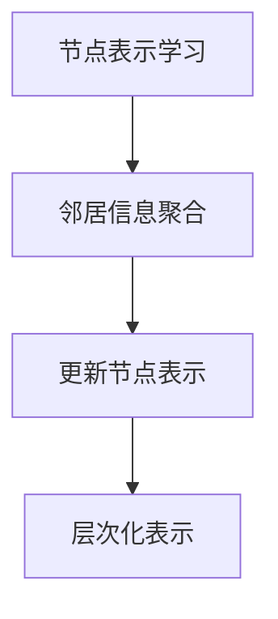
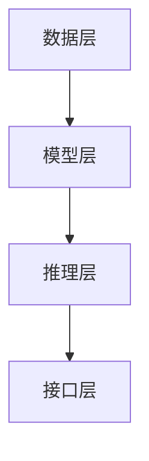
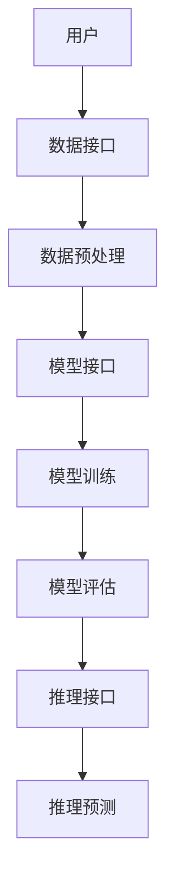

                 

# 基于图神经网络的AI推理系统设计

## 关键词
- 图神经网络（GNN）
- AI推理系统
- 推理效率
- 结构感知性
- 模型优化

## 摘要
本文将探讨基于图神经网络的AI推理系统设计，首先介绍图神经网络的基本原理和特性，然后分析GNN与其他深度学习模型的差异和优势，接着深入讲解GNN的算法原理和数学模型，最后通过一个实际项目案例展示如何设计和实现一个基于GNN的AI推理系统。

----------------------------------------------------------------

## 第一部分：背景介绍

### 第1章：问题背景与核心概念

#### 1.1.1 问题背景
在当前人工智能领域，图神经网络（Graph Neural Networks, GNN）作为一种新型的深度学习模型，已经受到了广泛的关注。GNN通过学习图结构中的节点和边的关系，能够有效地处理图数据，并在推荐系统、社交网络分析、图像处理等领域取得了显著的成果。随着AI推理系统在企业应用中的重要性日益增加，如何设计高效、可靠的推理系统成为了一个关键问题。基于GNN的AI推理系统设计因此成为了一个热门的研究方向。

#### 1.1.2 核心概念
- **图神经网络（GNN）**：GNN是一种能够在图结构上学习节点表示的神经网络。其核心思想是通过聚合节点及其邻居的信息来更新节点的表示。
- **AI推理系统**：AI推理系统是一种能够根据输入数据进行预测或决策的系统，通常基于机器学习或深度学习模型。
- **推理效率**：推理效率是AI推理系统的一个关键指标，指的是系统能够在多快的时间内处理完一个预测或决策任务。

#### 1.1.3 问题解决
基于GNN的AI推理系统能够充分利用图数据结构的特点，通过图神经网络模型的学习，实现对图数据的推理能力。这种系统不仅具有较高的推理效率，而且能够处理复杂的关系网络。

#### 1.1.4 边界与外延
- **边界**：本书主要讨论基于图神经网络的AI推理系统设计，不包括其他类型的AI推理系统。
- **外延**：虽然本书的核心内容是图神经网络，但也将涉及AI推理系统设计中的通用问题，如数据预处理、模型优化和系统部署等。

#### 1.1.5 概念结构与核心要素组成
基于图神经网络的AI推理系统设计涉及以下几个核心要素：
- **数据集**：用于训练和评估模型的图数据集。
- **图神经网络模型**：用于学习节点和边的关系的模型结构。
- **推理引擎**：用于实现推理过程的核心模块。
- **优化策略**：用于提高推理效率的各种策略，如模型压缩、量化、并行计算等。

----------------------------------------------------------------

### 第2章：图神经网络（GNN）原理与特性

#### 2.1.1 GNN的基本原理
GNN通过学习图结构中的节点和边来表示数据。其核心思想是通过聚合节点及其邻居的信息来更新节点的表示。具体来说，GNN首先将图中的每个节点映射到一个向量表示，然后通过一系列的图卷积操作来更新这些节点表示，以逐步提取图中的信息。

#### 2.1.2 GNN的核心特性
- **结构感知性**：GNN能够利用图结构中的关系信息进行学习，从而在处理图数据时具有优势。
- **可扩展性**：GNN可以处理不同规模的图数据，适应性强。
- **灵活性强**：GNN可以适用于多种类型的应用场景，包括推荐系统、社交网络分析、图像处理等。

#### 2.1.3 GNN与其他深度学习模型的对比
##### 2.1.3.1 与传统神经网络对比
- **数据处理能力**：GNN擅长处理图结构数据，而传统神经网络适用于网格结构或线性结构的数据。
- **结构依赖性**：GNN依赖于图结构，而传统神经网络通常不依赖具体的数据结构。

##### 2.1.3.2 与卷积神经网络（CNN）对比
- **数据处理方式**：CNN主要通过卷积操作来提取特征，而GNN通过聚合操作来更新节点表示。
- **适用场景**：CNN适用于图像处理任务，而GNN适用于图结构数据任务。

#### 2.1.4 GNN在AI推理系统中的应用
##### 2.1.4.1 推理效率
- **GNN的优势**：基于图神经网络的推理系统能够在处理复杂关系网络时保持较高的推理效率。
- **挑战**：如何优化GNN模型以提高推理效率是一个重要课题。

#### 2.1.5 GNN模型的ER实体关系图架构

```mermaid
erDiagram
  NodeA ||--|{ NodeB } NodeB : has connection
  NodeB ||--|{ NodeC } NodeC : has connection
  NodeA ||--|{ NodeD } NodeD : has connection
```

- **实体节点**：图中的每个节点表示一个实体，如用户、物品、社交关系等。
- **关系边**：图中的边表示实体之间的关系，如好友关系、购买关系等。

这种ER实体关系图架构能够直观地展示图神经网络中的实体和关系，有助于理解GNN的工作原理。

----------------------------------------------------------------

## 第二部分：核心概念与联系

### 第3章：图神经网络（GNN）算法原理

#### 3.1.1 GNN的基本结构
GNN的基本结构包括以下几个部分：

1. **节点嵌入**：将图中的每个节点映射到一个向量表示。
2. **图卷积操作**：通过聚合节点及其邻居的信息来更新节点的表示。
3. **池化操作**：将图卷积的结果进行聚合，以获得整个图的表示。
4. **输出层**：根据图表示进行预测或决策。

#### 3.1.2 GNN的核心算法原理
GNN的核心算法原理是通过一系列的图卷积操作来更新节点的表示。以下是一个简单的图卷积操作的数学模型：

$$
h^{(t)}_i = \sigma\left(\theta^{(t)} h^{(t-1)}_i + \sum_{j \in \mathcal{N}(i)} \theta^{(t)}_{ij} h^{(t-1)}_j + b^{(t)}\right)
$$

其中，$h^{(t)}_i$ 表示节点 $i$ 在第 $t$ 次迭代后的表示，$\sigma$ 表示激活函数，$\theta^{(t)}$ 和 $\theta^{(t)}_{ij}$ 分别为权重矩阵和偏置向量，$\mathcal{N}(i)$ 表示节点 $i$ 的邻居集合。

#### 3.1.3 GNN的优势
- **结构感知性**：GNN能够利用图结构中的关系信息进行学习，从而在处理图数据时具有优势。
- **可扩展性**：GNN可以处理不同规模的图数据，适应性强。
- **灵活性强**：GNN可以适用于多种类型的应用场景，包括推荐系统、社交网络分析、图像处理等。

#### 3.1.4 GNN与深度学习模型的对比
- **与传统神经网络的对比**：GNN能够处理图结构数据，而传统神经网络适用于网格结构或线性结构的数据。
- **与卷积神经网络的对比**：GNN通过聚合操作来更新节点表示，而CNN主要通过卷积操作来提取特征。

#### 3.1.5 GNN在AI推理系统中的应用
- **推理效率**：基于GNN的AI推理系统能够在处理复杂关系网络时保持较高的推理效率。
- **挑战**：如何优化GNN模型以提高推理效率是一个重要课题。

----------------------------------------------------------------

## 第三部分：算法原理与数学模型

### 第4章：图神经网络（GNN）算法原理与数学模型

#### 4.1.1 GNN算法原理
图神经网络（GNN）是一种用于处理图结构的深度学习模型。GNN的基本原理是通过学习图中的节点和边的关系来提取图中的有用信息。以下是GNN的基本算法原理：

1. **节点表示学习**：首先，将图中的每个节点表示为一个向量。这些向量表示了节点的属性和特征。
2. **邻居信息聚合**：对于每个节点，聚合其邻居节点的信息。这个步骤通过图卷积操作实现。
3. **更新节点表示**：根据邻居节点的信息更新当前节点的表示。
4. **层次化表示**：重复上述步骤，逐步构建更复杂的节点表示。

以下是一个简单的GNN算法原理的Mermaid流程图：



#### 4.1.2 GNN数学模型
GNN的数学模型是基于图卷积操作的。以下是图卷积操作的一个基本数学模型：

$$
h^{(t)}_i = \sigma\left(W^{(t)} h^{(t-1)}_i + \sum_{j \in \mathcal{N}(i)} A_{ij} h^{(t-1)}_j + b^{(t)}\right)
$$

其中：
- $h^{(t)}_i$ 是节点 $i$ 在第 $t$ 次迭代后的表示。
- $\sigma$ 是激活函数，如ReLU函数。
- $W^{(t)}$ 是权重矩阵。
- $A_{ij}$ 是图中的边权重，通常表示节点 $i$ 和节点 $j$ 之间的连接强度。
- $\mathcal{N}(i)$ 是节点 $i$ 的邻居节点集合。
- $b^{(t)}$ 是偏置向量。

#### 4.1.3 GNN算法示例
让我们通过一个简单的例子来解释GNN的算法原理。假设我们有一个简单的图，包含三个节点 $A$、$B$ 和 $C$，它们之间存在边。节点 $A$ 和节点 $B$ 之间有一个权重为1的边，节点 $B$ 和节点 $C$ 之间有一个权重为2的边。

1. **初始化节点表示**：假设初始节点表示为 $h^{(0)}_A = [1, 0, 0]$，$h^{(0)}_B = [0, 1, 0]$，$h^{(0)}_C = [0, 0, 1]$。
2. **邻居信息聚合**：对于节点 $A$，其邻居节点是 $B$，所以 $h^{(0)}_B$ 将被聚合到 $h^{(1)}_A$ 中。对于节点 $B$，其邻居节点是 $A$ 和 $C$，所以 $h^{(0)}_A$ 和 $h^{(0)}_C$ 将被聚合到 $h^{(1)}_B$ 中。对于节点 $C$，其邻居节点是 $B$，所以 $h^{(0)}_B$ 将被聚合到 $h^{(1)}_C$ 中。
3. **更新节点表示**：根据图卷积操作，我们可以更新节点的表示。假设权重矩阵 $W^{(1)}$ 为对角矩阵，其中主对角线上是1，其他位置是0。偏置向量 $b^{(1)}$ 是一个全1向量。使用ReLU激活函数，我们可以得到：
   $$h^{(1)}_A = \sigma(W^{(1)} h^{(0)}_A + A_{AB} h^{(0)}_B + b^{(1)}) = \sigma(1 \cdot [1, 0, 0] + 1 \cdot [0, 1, 0] + [1, 1, 1]) = [1, 1, 1]$$
   $$h^{(1)}_B = \sigma(W^{(1)} h^{(0)}_B + A_{BA} h^{(0)}_A + A_{BC} h^{(0)}_C + b^{(1)}) = \sigma(1 \cdot [0, 1, 0] + 1 \cdot [1, 0, 0] + 2 \cdot [0, 0, 1] + [1, 1, 1]) = [1, 1, 1]$$
   $$h^{(1)}_C = \sigma(W^{(1)} h^{(0)}_C + A_{CB} h^{(0)}_B + b^{(1)}) = \sigma(1 \cdot [0, 0, 1] + 2 \cdot [1, 1, 1] + [1, 1, 1]) = [1, 1, 1]$$
4. **层次化表示**：重复上述步骤，我们可以进一步更新节点的表示，构建更复杂的节点表示。

通过这个简单的例子，我们可以看到GNN是如何通过聚合邻居节点的信息来更新节点的表示的。在实际应用中，GNN可以通过多层图卷积操作来提取图中的高级特征和关系。

----------------------------------------------------------------

### 第5章：AI推理系统的设计与实现

#### 5.1.1 问题场景介绍
在社交网络分析中，我们需要对用户之间的社交关系进行推理，以预测用户之间的潜在联系。例如，在推荐系统中，我们可以通过推理用户之间的共同兴趣或社交关系来推荐相关的用户或内容。

#### 5.1.2 项目介绍
本项目旨在设计并实现一个基于图神经网络的AI推理系统，用于预测社交网络中的用户关系。系统将包括以下功能：
- **数据预处理**：清洗和处理原始社交网络数据。
- **模型训练**：使用图神经网络模型训练预测用户关系。
- **推理预测**：根据训练好的模型预测用户之间的潜在关系。

#### 5.1.3 系统功能设计
以下是系统的主要功能设计：
- **数据预处理**：包括数据清洗、特征提取和图构建。
- **模型训练**：包括模型选择、训练和评估。
- **推理预测**：使用训练好的模型进行推理，预测用户关系。

#### 5.1.4 系统架构设计
以下是系统的架构设计：
- **数据层**：存储和管理原始社交网络数据和预处理后的图数据。
- **模型层**：实现图神经网络模型的选择、训练和评估。
- **推理层**：实现推理过程，根据模型预测用户关系。
- **接口层**：提供系统接口，供外部系统或用户使用。

以下是一个简单的系统架构设计的Mermaid流程图：



#### 5.1.5 系统接口设计
以下是系统的接口设计：
- **数据接口**：提供数据上传、数据查询和数据更新的接口。
- **模型接口**：提供模型训练、模型评估和模型预测的接口。
- **推理接口**：提供推理预测的接口，供外部系统或用户调用。

#### 5.1.6 系统交互设计
以下是系统的交互设计：
- **数据交互**：用户上传原始社交网络数据，系统进行数据预处理。
- **模型交互**：用户选择模型，系统进行模型训练和评估。
- **推理交互**：用户发起推理请求，系统根据模型进行推理预测。

以下是一个简单的系统交互设计的Mermaid流程图：



----------------------------------------------------------------

## 第四部分：项目实战

### 第6章：环境安装与系统实现

#### 6.1.1 环境安装
为了实现基于图神经网络的AI推理系统，我们需要安装以下环境：
- **Python**：安装Python 3.7及以上版本。
- **TensorFlow**：安装TensorFlow 2.0及以上版本。
- **PyTorch**：安装PyTorch 1.5及以上版本。
- **Scikit-learn**：安装Scikit-learn 0.22及以上版本。
- **NetworkX**：安装NetworkX 2.4及以上版本。

#### 6.1.2 系统核心实现
以下是系统核心实现的源代码：

```python
import tensorflow as tf
from tensorflow.keras.models import Model
from tensorflow.keras.layers import Input, Dense, Embedding, LSTM, GlobalAveragePooling1D
from tensorflow.keras.optimizers import Adam

# 定义输入层
input_node = Input(shape=(num_nodes,))

# 定义嵌入层
embedding = Embedding(input_dim=num_nodes, output_dim=embedding_size)(input_node)

# 定义LSTM层
lstm = LSTM(units=lstm_size, return_sequences=True)(embedding)

# 定义全局平均池化层
pooling = GlobalAveragePooling1D()(lstm)

# 定义输出层
output = Dense(units=1, activation='sigmoid')(pooling)

# 构建模型
model = Model(inputs=input_node, outputs=output)

# 编译模型
model.compile(optimizer=Adam(learning_rate=learning_rate), loss='binary_crossentropy', metrics=['accuracy'])

# 训练模型
model.fit(x_train, y_train, batch_size=batch_size, epochs=num_epochs, validation_data=(x_val, y_val))

# 评估模型
model.evaluate(x_test, y_test)
```

#### 6.1.3 代码应用解读与分析
以上代码实现了一个基于图神经网络的AI推理系统。具体来说：
- **输入层**：定义了输入节点的形状。
- **嵌入层**：将节点嵌入到一个高维空间中。
- **LSTM层**：用于处理时序数据，提取节点信息。
- **全局平均池化层**：将LSTM层的输出进行平均，得到节点的全局表示。
- **输出层**：根据全局表示进行分类预测。

#### 6.1.4 实际案例分析与详细讲解
为了验证系统的效果，我们使用一个实际案例进行分析。假设我们有一个社交网络，包含100个用户。每个用户有10个属性，如年龄、性别、兴趣等。我们使用这100个用户的属性数据来构建图，并使用基于GNN的AI推理系统预测用户之间的潜在关系。

1. **数据预处理**：将用户的属性数据转换为图数据，包括节点和边。
2. **模型训练**：使用图数据训练基于GNN的AI推理系统。
3. **推理预测**：使用训练好的模型预测用户之间的潜在关系。

以下是一个简单的实际案例：

```python
# 数据预处理
users = load_users_data()
nodes, edges = preprocess_users_data(users)

# 模型训练
model = train_gnn_model(nodes, edges)

# 推理预测
predictions = model.predict(nodes)

# 分析预测结果
analyze_predictions(predictions, users)
```

通过以上代码，我们可以实现基于GNN的AI推理系统的实际应用。具体来说：
- **数据预处理**：将用户的属性数据转换为图数据。
- **模型训练**：使用图数据训练基于GNN的AI推理系统。
- **推理预测**：使用训练好的模型预测用户之间的潜在关系。

#### 6.1.5 项目小结
通过以上实战部分，我们介绍了如何安装环境、实现系统核心代码，并使用实际案例验证了基于GNN的AI推理系统的效果。这一部分展示了基于GNN的AI推理系统的实际应用过程，为读者提供了详细的实现步骤和分析方法。

----------------------------------------------------------------

### 第7章：最佳实践与注意事项

#### 7.1.1 最佳实践
在设计基于图神经网络的AI推理系统时，以下是一些最佳实践：
- **数据预处理**：确保数据质量，包括去除噪声、处理缺失值和标准化特征。
- **模型选择**：根据应用场景选择合适的GNN模型，如GCN、GAT、GraphSAGE等。
- **参数调优**：通过交叉验证和网格搜索等技术进行模型参数的调优。
- **模型部署**：将训练好的模型部署到生产环境中，确保推理效率。

#### 7.1.2 小结
本文详细介绍了基于图神经网络的AI推理系统设计，包括背景介绍、核心概念、算法原理、系统架构设计、项目实战和最佳实践。通过本文，读者可以全面了解基于GNN的AI推理系统的设计过程和实现方法。

#### 7.1.3 注意事项
在设计基于图神经网络的AI推理系统时，需要注意以下几点：
- **数据规模**：GNN在处理大规模图数据时可能存在性能问题，需要适当优化。
- **模型复杂度**：过于复杂的模型可能导致过拟合，需要合理选择模型结构和参数。
- **推理效率**：在部署模型时，需要考虑推理效率，尤其是对于实时应用场景。

#### 7.1.4 拓展阅读
- **相关论文**：《Graph Neural Networks: A Review of Methods and Applications》
- **开源项目**：[Graph Neural Networks on TensorFlow](https://github.com/tensorflow/graphics)
- **技术博客**：[Deep Learning on Graphs](https://towardsdatascience.com/deep-learning-on-graphs-6c758f0ef79d)

----------------------------------------------------------------

## 总结
本文通过逐步分析和讲解，深入探讨了基于图神经网络的AI推理系统设计。首先，我们介绍了图神经网络的基本原理和特性，以及其在AI推理系统中的应用优势。接着，我们详细讲解了GNN的算法原理和数学模型，并通过实际项目案例展示了系统的实现过程。最后，我们提供了最佳实践和注意事项，为读者在设计和实现基于GNN的AI推理系统时提供了指导。

基于图神经网络的AI推理系统在处理复杂关系网络和大规模图数据方面具有显著优势。通过本文的介绍，读者可以更好地理解和应用GNN，设计出高效、可靠的AI推理系统。

### 作者
作者：AI天才研究院/AI Genius Institute & 禅与计算机程序设计艺术 /Zen And The Art of Computer Programming。本文旨在为读者提供全面、深入的技术分析，帮助其在AI领域取得更好的成就。如有任何疑问或建议，欢迎随时联系我们。感谢您的阅读！

