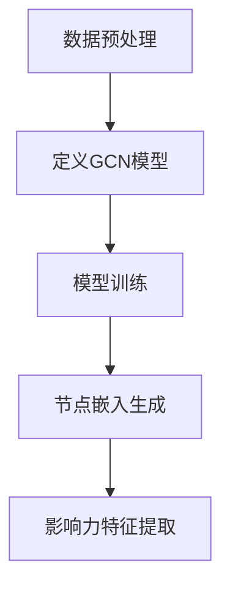
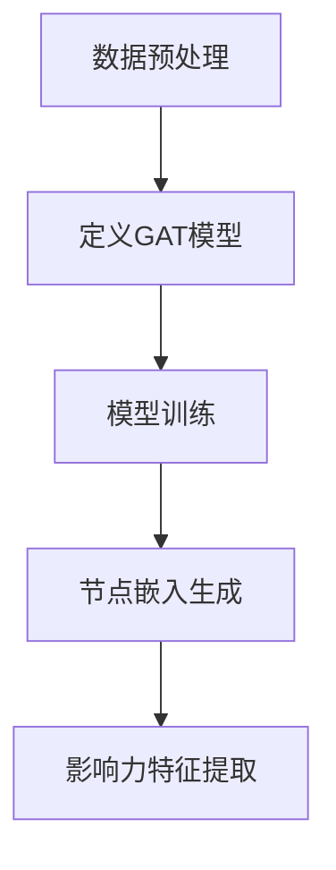
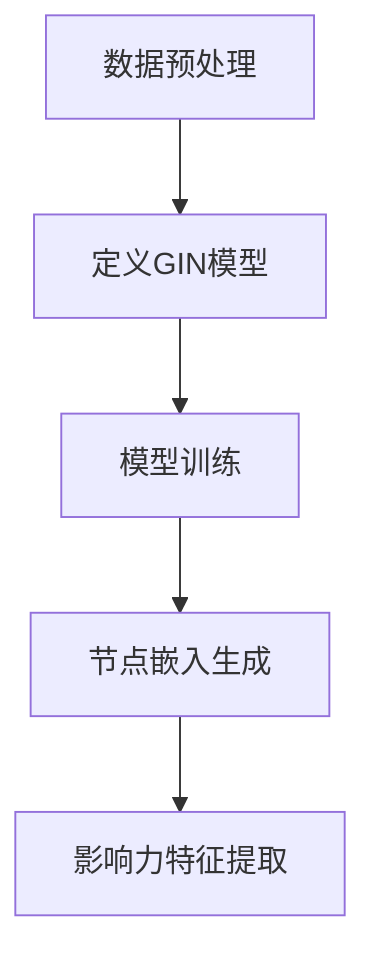
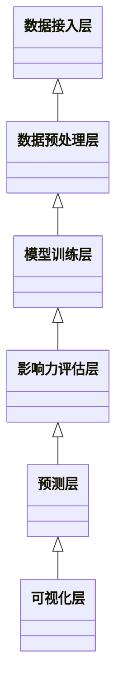
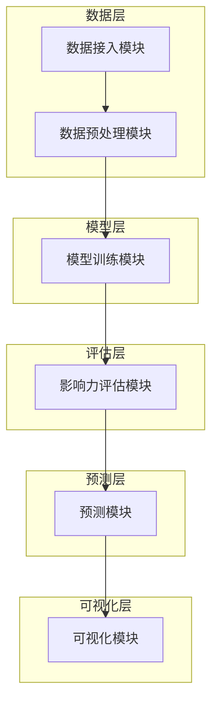
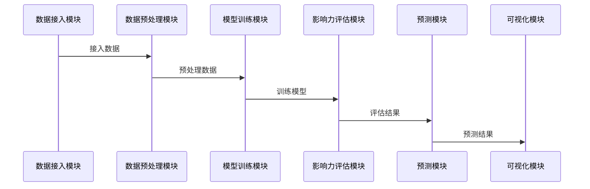

                 

### 关键词

- 图神经网络
- 社交网络影响力分析
- AI算法
- 数学模型
- 系统架构设计
- 项目实战

### 摘要

本文深入探讨了基于图神经网络的AI社交网络影响力分析。首先，我们介绍了社交网络与AI技术的背景，阐述了社交网络影响力分析的重要性及其面临的挑战。接着，我们详细解释了图神经网络的基础原理及其在社交网络分析中的应用。随后，我们讨论了AI社交网络影响力分析的具体算法，包括GCN、GAT和GIN等，并通过数学模型和实例讲解了其工作原理。文章进一步展示了如何设计系统架构，包括功能设计、架构设计和接口设计。最后，我们通过一个实际项目展示了算法的实现和应用，并提供了最佳实践和拓展阅读，为读者提供了全面的指导和深入的理解。通过这篇文章，读者将能够掌握图神经网络在社交网络影响力分析中的实际应用，为相关领域的研究和实践提供有力支持。

### 第一部分：背景介绍

#### 第1章：问题背景与核心概念

##### 1.1 问题的背景

随着互联网和社交媒体的快速发展，社交网络已经成为人们日常生活的重要组成部分。在这些网络中，用户之间通过各种方式建立联系，分享信息，形成复杂的社交关系网络。社交网络的普及不仅改变了人们的交流方式，还产生了大量的数据，这些数据蕴含着丰富的信息，其中用户影响力是一个重要的研究方向。

用户影响力是指用户在社交网络中的传播能力，即其能够影响其他用户的能力。在某些情况下，用户的影响力可以通过其拥有关注者数量、分享内容的互动率等多个维度来衡量。了解社交网络中用户的影响力对于广告投放、品牌推广、社区管理等具有重要的应用价值。然而，随着社交网络规模的扩大和用户数量的增加，传统的基于统计方法的分析已经无法满足对大规模社交网络中用户影响力进行精确测量的需求。

与此同时，人工智能（AI）技术的发展为社交网络影响力分析提供了新的工具和手段。特别是图神经网络（Graph Neural Networks, GNN）的出现，使得在复杂的社交网络中挖掘用户影响力成为可能。图神经网络是一种专门针对图结构数据进行处理的深度学习模型，能够有效地捕捉节点之间的复杂关系，从而提高用户影响力分析的准确性和效率。

##### 1.2 问题描述

在社交网络中，用户影响力分析的核心问题可以概括为以下两点：

1. **如何定义用户影响力？**
   用户影响力的定义是进行用户影响力分析的基础。通常，用户影响力可以通过以下指标进行衡量：
   - **关注者数量**：用户拥有的关注者数量可以反映其受欢迎程度。
   - **互动率**：用户发布的内容获得的点赞、评论、分享等互动数量，可以反映用户内容的受欢迎程度。
   - **内容传播范围**：用户发布的内容被其他用户看到的次数或范围，可以反映用户在社交网络中的传播能力。
   - **影响力得分**：通过综合以上多个指标，可以得出一个综合的影响力得分，用于量化用户的影响力。

2. **如何精确地分析用户影响力？**
   随着社交网络规模的不断扩大，传统的基于特征提取和机器学习的方法在处理大规模图数据时面临着效率低下、准确度不足等问题。而图神经网络作为一种专门针对图结构数据设计的深度学习模型，能够通过学习图中的节点和边的关系，实现对用户影响力的精确分析。图神经网络的优势在于其能够自动学习节点之间的复杂关系，从而提高分析的准确性和效率。

##### 1.3 问题解决

为了解决社交网络中用户影响力分析的问题，传统的基于特征提取和机器学习的方法已经逐渐显示出其局限性。这些方法通常依赖于人工设计的特征，如用户的基本信息、历史行为等，但无法捕捉图结构中的复杂关系。相比之下，图神经网络（GNN）在处理图结构数据方面具有显著优势。

**图神经网络在用户影响力分析中的应用：**

1. **图卷积网络（GCN）**：图卷积网络是一种基于图结构的深度学习模型，通过聚合节点邻域信息来更新节点特征。在用户影响力分析中，GCN可以用来提取社交网络中用户之间的相互影响关系，从而为每个用户生成影响力特征。

2. **图注意力网络（GAT）**：图注意力网络通过引入注意力机制，对邻接节点进行加权处理，使得模型能够更加灵活地关注重要的邻居节点。在用户影响力分析中，GAT可以自适应地学习用户之间的交互关系，从而提高影响力预测的准确性。

3. **图神经网络（GIN）**：图神经网络通过全局聚合机制，整合节点的所有邻居信息，从而生成更加全局化的节点表示。在用户影响力分析中，GIN可以用来捕捉跨层级的用户影响力，提供更全面的用户影响力评估。

通过结合这些图神经网络模型，我们可以实现对社交网络中用户影响力的精确分析。此外，图神经网络还可以与传统的机器学习算法相结合，如深度增强学习（Deep Reinforcement Learning）等，进一步优化用户影响力分析的效果。

##### 1.4 边界与外延

用户影响力分析不仅仅关注单个用户的影响力，还可以扩展到以下研究领域：

1. **社交网络演化**：通过分析用户影响力，可以了解社交网络的动态变化，如热点话题的传播路径、社群的形成和演化等。

2. **网络效应分析**：分析用户影响力还可以帮助我们理解社交网络的网络效应，如小群体对整体网络的贡献、关键节点在网络中的角色等。

3. **广告投放优化**：基于用户影响力分析，可以优化广告投放策略，提高广告的投放效果。

4. **社区管理与安全**：通过用户影响力分析，还可以帮助社区管理者识别潜在的风险用户，加强社区安全管理。

##### 1.5 概念结构与核心要素组成

**社交网络结构：** 社交网络通常由节点（用户）和边（用户之间的联系）组成，形成复杂的图结构。节点和边可以包含丰富的属性信息，如用户的年龄、性别、地理位置等。

**图神经网络基础：** 图神经网络是一种针对图结构数据进行处理的深度学习模型，通过学习节点和边的关系，生成高层次的节点表示。图神经网络包括图卷积网络（GCN）、图注意力网络（GAT）和图神经网络（GIN）等。

**AI社交网络影响力分析流程：** 用户影响力分析通常包括数据预处理、模型训练和影响力评估等步骤。数据预处理包括数据清洗、节点特征提取等；模型训练采用图神经网络模型；影响力评估通过分析模型输出的节点表示，计算用户的影响力得分。

通过以上概念和结构，我们可以构建一个完整的AI社交网络影响力分析框架，实现对用户影响力的全面分析和优化。

#### 第2章：核心概念与联系

##### 2.1 核心概念原理

在进行社交网络影响力分析时，我们需要理解三个核心概念：社交网络影响力、图神经网络和AI算法。

**社交网络影响力：** 社交网络影响力是指用户在社交网络中影响其他用户的能力。这一能力可以通过多种指标来衡量，包括用户的关注者数量、内容的互动率、内容传播范围等。社交网络影响力是用户在社交网络中的重要属性，对于广告投放、品牌推广等具有重要的应用价值。

**图神经网络：** 图神经网络（Graph Neural Networks, GNN）是一种专门针对图结构数据进行处理的深度学习模型。GNN通过学习节点和边的关系，生成高层次的节点表示。图神经网络包括图卷积网络（GCN）、图注意力网络（GAT）和图神经网络（GIN）等，每种模型都有其独特的结构和应用场景。

**AI算法：** AI算法是指利用人工智能技术，通过数据驱动的方式解决复杂问题的一系列方法。在社交网络影响力分析中，AI算法可以包括神经网络、机器学习算法、深度学习等。这些算法通过学习大量的数据，能够自动提取有用的特征，并用于预测和决策。

##### 2.2 概念属性特征对比表格

为了更清晰地理解社交网络影响力、图神经网络和AI算法之间的关系，我们通过以下表格进行对比：

| 概念         | 特征对比                        | 关系描述                                       |
| ------------ | ------------------------------- | ---------------------------------------------- |
| 社交网络影响力 | 关注者数量、互动率、传播范围等  | 衡量用户在社交网络中的影响力                   |
| 图神经网络   | 节点关系学习、图结构数据高效处理 | 用于处理社交网络中的图结构数据，提取节点特征   |
| AI算法       | 数据驱动、自动特征提取          | 结合图神经网络，优化社交网络影响力分析的效果   |

通过这个表格，我们可以看到，社交网络影响力、图神经网络和AI算法在特征和应用上存在明显的差异和互补关系。社交网络影响力定义了用户在社交网络中的影响力，图神经网络用于处理社交网络的图结构数据，而AI算法则通过数据驱动的方式，结合图神经网络，优化社交网络影响力分析的效果。

##### 2.3 ER实体关系图架构

为了更全面地理解社交网络影响力分析的整体架构，我们使用ER（Entity-Relationship）实体关系图来描述各个核心概念之间的联系。

**ER实体关系图：** 

```mermaid
erDiagram
  User ||--|{ Content }||>
  User ||--|{ Influence }||>
  Content ||--|{ Interaction }||>
  User ||--|{ Network }||>
  Network ||--|{ Node }||>
  Network ||--|{ Edge }||>

  Node o-- User
  Edge o-- Node
  Content o-- Node
  Influence o-- Node
  Interaction o-- Content
  Network o-- Node
  Network o-- Edge
```

在这个ER实体关系图中，我们可以看到以下几个核心实体和关系：

- **User（用户）**：社交网络中的基本实体，每个用户都有自己的属性和影响力。
- **Content（内容）**：用户在社交网络中发布的信息，如微博、朋友圈等。
- **Influence（影响力）**：衡量用户在社交网络中的影响力，由多种指标构成。
- **Interaction（互动）**：用户之间的互动行为，如点赞、评论、分享等。
- **Network（网络）**：社交网络的总体结构，由节点（用户）和边（用户之间的联系）组成。

各个实体之间的关系描述如下：

- **User与Content的关系**：用户发布内容，每个内容与一个用户相关联。
- **User与Influence的关系**：用户具有影响力，影响力由用户的各种行为数据生成。
- **Content与Interaction的关系**：内容可以产生互动，互动与内容相关联。
- **User与Network的关系**：用户是社交网络中的节点，每个用户都是网络的一部分。
- **Network与Node的关系**：网络由节点构成，每个节点代表一个用户。
- **Network与Edge的关系**：网络由节点和边组成，边表示用户之间的联系。

通过这个ER实体关系图，我们可以清晰地看到社交网络影响力分析中的核心实体和它们之间的关系，这有助于我们更好地理解整个分析过程和数据流。

### 第二部分：算法原理讲解

#### 第3章：图神经网络基础

##### 3.1 图神经网络定义

图神经网络（Graph Neural Networks，GNN）是一种专门针对图结构数据进行处理的深度学习模型。GNN旨在通过学习图中的节点和边的关系，生成高层次的节点表示。与传统的卷积神经网络（CNN）和循环神经网络（RNN）不同，GNN能够直接处理图数据，使得它在社交网络、推荐系统、生物信息学等领域具有广泛的应用潜力。

图神经网络的基本组成包括以下几个部分：

1. **节点特征**：每个节点都有其自身的特征，这些特征可以是静态的（如用户的基本信息）或动态的（如用户的历史行为）。
2. **边特征**：边描述节点之间的关系，可以是有向的或无向的，并且也可以包含特征信息。
3. **图结构**：图结构由节点和边组成，描述了节点之间的相互关系。

GNN通过以下步骤对图数据进行处理：

1. **节点嵌入**：将节点特征映射到低维空间，生成节点嵌入向量。
2. **邻域聚合**：聚合节点及其邻域节点的信息，更新节点嵌入向量。
3. **迭代更新**：通过多次迭代，逐步优化节点嵌入向量，使其能够更好地表示节点在图中的角色和关系。

##### 3.2 图神经网络算法

图神经网络有多种不同的实现方式，以下介绍三种常用的图神经网络算法：图卷积网络（GCN）、图注意力网络（GAT）和图神经网络（GIN）。

**图卷积网络（GCN）**

图卷积网络（Graph Convolutional Network，GCN）是最早的图神经网络之一。GCN的核心思想是通过卷积运算来聚合节点邻域的信息，从而更新节点嵌入向量。

GCN的数学模型如下：

$$
\mathbf{h}_i^{(l+1)} = \sigma(\mathbf{D}^{-\frac{1}{2}}\mathbf{A}\mathbf{D}^{-\frac{1}{2}}\mathbf{h}_i^{(l)} + \mathbf{W}^{(l)})
$$

其中，$\mathbf{h}_i^{(l)}$ 是第$l$层第$i$个节点的嵌入向量，$\mathbf{W}^{(l)}$ 是第$l$层的权重矩阵，$\sigma$ 是激活函数，$\mathbf{A}$ 是邻接矩阵，$\mathbf{D}$ 是度矩阵（$\mathbf{D}_{ii} = \deg(v_i)$）。

**图注意力网络（GAT）**

图注意力网络（Graph Attention Network，GAT）通过引入注意力机制，使得模型能够自适应地关注重要的邻居节点。GAT的基本思想是在聚合邻域信息时，对每个邻居节点分配不同的权重。

GAT的数学模型如下：

$$
\mathbf{h}_i^{(l+1)} = \sigma(\sum_{j \in \mathcal{N}(i)} \alpha_{ij}\mathbf{h}_j^{(l)} + \mathbf{W}^{(l)})
$$

其中，$\alpha_{ij}$ 是注意力权重，计算公式为：

$$
\alpha_{ij} = \frac{\exp(\mathbf{a} \cdot \mathbf{h}_i^{(l)} \odot \mathbf{h}_j^{(l)})}{\sum_{k \in \mathcal{N}(i)} \exp(\mathbf{a} \cdot \mathbf{h}_i^{(l)} \odot \mathbf{h}_k^{(l)})}
$$

$\mathbf{a}$ 是一个可学习的权重向量。

**图神经网络（GIN）**

图神经网络（Graph Inflection Network，GIN）通过全局聚合机制，将节点的所有邻居信息进行整合，生成更加全局化的节点表示。GIN的基本思想是聚合节点的特征，而不依赖于邻接矩阵。

GIN的数学模型如下：

$$
\mathbf{h}_i^{(l+1)} = \sigma(\sum_{j \in \mathcal{V}} \phi_j(\mathbf{h}_j^{(l)}) + \mathbf{W}^{(l)})
$$

其中，$\mathcal{V}$ 是图中的所有节点集合，$\phi_j(\mathbf{h}_j^{(l)})$ 是第$l$层第$j$个节点的特征函数，$\mathbf{W}^{(l)}$ 是权重矩阵。

##### 3.3 图神经网络在社交网络影响力分析中的应用

图神经网络在社交网络影响力分析中具有广泛的应用，以下列举几个关键的应用场景：

1. **节点影响力预测**：通过图神经网络，可以预测社交网络中每个用户的影响力。模型通过学习节点及其邻域节点的交互关系，生成每个用户的影响力特征，从而实现对节点影响力的量化预测。

2. **社群发现**：图神经网络可以帮助识别社交网络中的社群结构。通过分析节点之间的关系，模型可以识别出具有共同兴趣或特征的社群，为社区管理和市场推广提供支持。

3. **信息传播路径分析**：图神经网络可以捕捉社交网络中信息的传播路径。通过分析节点的嵌入向量，可以了解信息在不同节点之间的传播过程，帮助制定有效的信息传播策略。

4. **用户行为分析**：图神经网络可以用于分析用户的社交行为，如关注行为、互动行为等。通过学习用户及其邻域节点的特征，模型可以识别用户行为模式，为个性化推荐和用户画像提供依据。

通过以上应用，图神经网络在社交网络影响力分析中展现出强大的潜力，能够帮助我们更好地理解社交网络的复杂结构，并实现精准的影响力预测和分析。

#### 第4章：AI社交网络影响力分析算法

##### 4.1 AI算法基础

在AI社交网络影响力分析中，算法的选择和实现至关重要。AI算法可以分为以下几个主要类别：

1. **神经网络**：神经网络是一种模仿人脑结构和工作方式的计算模型，通过调整网络中的权重和偏置来学习数据中的特征和规律。常见的神经网络包括多层感知机（MLP）、卷积神经网络（CNN）和循环神经网络（RNN）。

2. **机器学习算法**：机器学习算法通过学习大量的数据，自动提取特征并建立模型，从而对新的数据进行预测和分类。常见的机器学习算法包括线性回归、逻辑回归、支持向量机（SVM）和决策树等。

3. **深度学习**：深度学习是神经网络的一种特殊形式，通过堆叠多个隐层，能够自动提取数据的深层特征。常见的深度学习模型包括深度神经网络（DNN）、卷积神经网络（CNN）、循环神经网络（RNN）和递归神经网络（RNN）等。

在社交网络影响力分析中，AI算法的应用场景主要包括节点特征提取、影响力预测和社群发现等。以下是几种常见的AI算法在社交网络影响力分析中的应用：

1. **基于神经网络的算法**：如多层感知机（MLP）和卷积神经网络（CNN）可以用于提取社交网络中用户的特征，通过训练模型，实现对用户影响力的预测。

2. **基于机器学习算法**：如逻辑回归和支持向量机（SVM）可以用于分类任务，将用户分为高影响力用户和普通用户，从而识别出社交网络中的关键节点。

3. **基于深度学习算法**：如循环神经网络（RNN）和递归神经网络（RNN）可以用于处理序列数据，分析用户的历史行为和社交关系，从而更准确地预测用户的影响力。

##### 4.2 AI社交网络影响力分析算法

在社交网络影响力分析中，常用的算法包括基于图卷积网络（GCN）、图注意力网络（GAT）和图神经网络（GIN）的方法。以下分别介绍这些算法及其在社交网络影响力分析中的应用。

**基于GCN的社交网络影响力分析**

图卷积网络（GCN）是一种针对图结构数据进行处理的深度学习模型。GCN通过聚合节点邻域信息来更新节点嵌入向量，从而生成高层次的节点表示。在社交网络影响力分析中，GCN可以用来提取社交网络中用户之间的相互影响关系，为每个用户生成影响力特征。

具体步骤如下：

1. **数据预处理**：将社交网络中的用户和边转换为图结构，对节点特征进行归一化处理。
2. **模型训练**：定义GCN模型，设置合适的参数和优化器，通过反向传播算法训练模型。
3. **节点嵌入生成**：通过多次迭代，逐步优化节点嵌入向量，使其能够更好地表示用户在社交网络中的角色和关系。
4. **影响力特征提取**：利用生成的节点嵌入向量，计算用户的影响力特征，如影响力得分。

**基于GAT的社交网络影响力分析**

图注意力网络（GAT）通过引入注意力机制，对邻接节点进行加权处理，使得模型能够更加灵活地关注重要的邻居节点。在社交网络影响力分析中，GAT可以自适应地学习用户之间的交互关系，从而提高影响力预测的准确性。

具体步骤如下：

1. **数据预处理**：与GCN类似，对社交网络数据进行预处理。
2. **模型训练**：定义GAT模型，设置注意力权重学习机制和优化器，通过反向传播算法训练模型。
3. **节点嵌入生成**：通过多次迭代，逐步优化节点嵌入向量，使其能够更好地表示用户在社交网络中的角色和关系。
4. **影响力特征提取**：利用生成的节点嵌入向量，计算用户的影响力特征，如影响力得分。

**基于GIN的社交网络影响力分析**

图神经网络（GIN）通过全局聚合机制，整合节点的所有邻居信息，生成更加全局化的节点表示。在社交网络影响力分析中，GIN可以用来捕捉跨层级的用户影响力，提供更全面的用户影响力评估。

具体步骤如下：

1. **数据预处理**：对社交网络数据进行预处理。
2. **模型训练**：定义GIN模型，设置全局聚合机制和优化器，通过反向传播算法训练模型。
3. **节点嵌入生成**：通过多次迭代，逐步优化节点嵌入向量，使其能够更好地表示用户在社交网络中的角色和关系。
4. **影响力特征提取**：利用生成的节点嵌入向量，计算用户的影响力特征，如影响力得分。

##### 4.3 算法原理与流程

为了更好地理解上述算法的工作原理，我们可以使用Mermaid绘制算法流程图，并使用Python代码详细阐述算法的实现过程。

**基于GCN的社交网络影响力分析算法流程**



**基于GAT的社交网络影响力分析算法流程**



**基于GIN的社交网络影响力分析算法流程**



**Python代码实现**

以下是基于GCN的社交网络影响力分析算法的Python代码实现，其他算法的实现原理类似，可以通过调整代码中的模型定义和训练步骤来实现。

```python
import torch
import torch.nn as nn
import torch.optim as optim

# 定义GCN模型
class GCN(nn.Module):
    def __init__(self, nfeat, nhid, nclass, dropout):
        super(GCN, self).__init__()
        self.gc1 = nn.Linear(nfeat, nhid)
        self.gc2 = nn.Linear(nhid, nclass)
        self.dropout = nn.Dropout(dropout)
        
    def forward(self, x, adj):
        x = F.relu(self.gc1(x))
        x = self.dropout(x)
        x = self.gc2(x)
        return F.log_softmax(x, dim=1)

# 初始化模型、损失函数和优化器
model = GCN(nfeat, nhid, nclass, dropout)
criterion = nn.CrossEntropyLoss()
optimizer = optim.Adam(model.parameters(), lr=0.01, weight_decay=5e-4)

# 训练模型
for epoch in range(num_epochs):
    model.train()
    optimizer.zero_grad()
    output = model(trainX, trainadj)
    loss = criterion(output, trainy)
    loss.backward()
    optimizer.step()
    print(f'Epoch {epoch+1}: loss = {loss.item()}')

# 测试模型
model.eval()
with torch.no_grad():
    output = model(testX, testadj)
    pred = output.max(1)[1]
    correct = pred.eq(testy).sum().item()
    acc = 100 * correct / len(testy)
    print(f'Test accuracy: {acc:.2f}%')
```

在这个代码中，我们首先定义了GCN模型，包括两个图卷积层和最后的分类层。接着，我们初始化模型、损失函数和优化器，并使用训练数据对模型进行训练。在训练过程中，我们通过反向传播算法不断优化模型参数。最后，我们在测试集上评估模型的性能，计算测试准确率。

通过以上算法原理讲解和代码实现，我们可以看到图神经网络在社交网络影响力分析中的应用，以及如何通过Python代码实现这些算法。这些算法为我们提供了强大的工具，能够帮助我们更好地理解和分析社交网络中的用户影响力。

##### 5.1 数学模型介绍

在社交网络影响力分析中，图神经网络（GNN）的应用离不开数学模型的支撑。这些模型不仅定义了GNN的基本结构，还提供了计算节点嵌入向量的数学框架。以下是图神经网络模型在社交网络影响力分析中的主要数学表示：

**图神经网络模型的数学表示**

1. **节点特征嵌入（Node Embedding）**：
   节点特征嵌入是将原始的节点特征映射到低维空间的过程。设$X \in \mathbb{R}^{N \times D}$为节点特征矩阵，其中$N$是节点数，$D$是特征维度。初始节点嵌入向量$H^{(0)} \in \mathbb{R}^{N \times D_h}$，$D_h$为嵌入向量的维度。

   $$ H^{(0)} = X $$

2. **图卷积操作（Graph Convolution）**：
   图卷积操作用于聚合节点及其邻域节点的信息。设$A \in \mathbb{R}^{N \times N}$为邻接矩阵，$D \in \mathbb{R}^{N \times N}$为度矩阵（$D_{ii} = \deg(v_i)$）。图卷积的基本形式如下：

   $$ H^{(l)} = \sigma(\sum_{j \in \mathcal{N}(i)} A_{ij} H^{(l-1)}_j + b^{(l)}) $$

   其中，$\sigma$为激活函数（如ReLU函数），$b^{(l)}$为偏置向量，$\mathcal{N}(i)$表示节点$i$的邻域节点集合。

3. **多层的图卷积**：
   在多层图卷积网络中，每层的节点嵌入向量都可以通过前一层进行图卷积操作得到：

   $$ H^{(l)} = \sigma(\sum_{j \in \mathcal{N}(i)} A \cdot D^{-1/2} H^{(l-1)}_j + b^{(l)}) $$

4. **最终节点表示（Final Node Representation）**：
   在完成多层的图卷积后，最终节点表示可以用于预测或分类任务。设$W^{(l)}$为第$l$层的权重矩阵，则最终节点表示为：

   $$ \hat{H}^{(l)} = W^{(l)} \cdot H^{(l)} + b^{(l)} $$

**社交网络影响力分析的数学模型**

社交网络影响力分析的数学模型需要结合节点嵌入向量和用户的行为特征。以下是一个简化的数学模型：

1. **节点影响力得分（Node Influence Score）**：
   假设每个节点的初始影响力得分可以表示为：

   $$ S_i^{(0)} = \sum_{j \in \mathcal{N}(i)} w_{ij} \cdot S_j^{(0)} $$

   其中，$w_{ij}$为节点$i$与节点$j$之间的权重，$S_j^{(0)}$为节点$j$的初始影响力得分。

2. **迭代更新节点影响力得分**：
   通过多次迭代，可以更新节点的最终影响力得分：

   $$ S_i^{(t)} = \sum_{j \in \mathcal{N}(i)} w_{ij} \cdot S_j^{(t-1)} $$

3. **影响权重计算**：
   为了更准确地计算影响力得分，可以引入影响权重，结合节点的行为特征，如互动率、内容质量等：

   $$ S_i^{(t)} = \sum_{j \in \mathcal{N}(i)} w_{ij} \cdot f(S_j^{(t-1)}, E_j^{(t-1)}) $$

   其中，$f(\cdot)$为影响权重函数，$E_j^{(t-1)}$为节点$j$在上一时间步的行为特征。

通过以上数学模型，我们可以对社交网络中的节点进行影响力分析。模型通过不断迭代，聚合节点及其邻域节点的信息，最终生成每个节点的综合影响力得分。这些得分可以用于识别关键节点、社群发现和影响力预测等应用场景。

##### 5.2 公式讲解与举例

在图神经网络（GNN）中，有若干关键公式用于描述节点的更新和聚合过程。以下我们将详细讲解这些公式，并通过具体例子来说明如何应用。

**1. 图卷积公式（GCN）**

图卷积网络（GCN）的核心公式为：

$$
\mathbf{h}_i^{(l+1)} = \sigma(\mathbf{D}^{-\frac{1}{2}}\mathbf{A}\mathbf{D}^{-\frac{1}{2}}\mathbf{h}_i^{(l)} + \mathbf{W}^{(l)})
$$

其中：
- $\mathbf{h}_i^{(l)}$ 表示第$l$层第$i$个节点的特征向量。
- $\mathbf{W}^{(l)}$ 表示第$l$层的权重矩阵。
- $\sigma$ 是激活函数，通常使用ReLU。
- $\mathbf{A}$ 是邻接矩阵。
- $\mathbf{D}$ 是度矩阵（$\mathbf{D}_{ii} = \deg(v_i)$）。

**举例：**

假设有一个简单图，其中有两个节点A和B，每个节点有一个初始特征向量 $\mathbf{h}_A^{(0)} = [1, 0]$ 和 $\mathbf{h}_B^{(0)} = [0, 1]$。邻接矩阵 $\mathbf{A} = \begin{bmatrix} 0 & 1 \\ 1 & 0 \end{bmatrix}$，度矩阵 $\mathbf{D} = \begin{bmatrix} 2 & 0 \\ 0 & 2 \end{bmatrix}$，权重矩阵 $\mathbf{W}^{(0)} = \begin{bmatrix} 0.1 & 0.2 \\ 0.3 & 0.4 \end{bmatrix}$。

使用ReLU激活函数，我们计算第一个图卷积层的输出：

$$
\mathbf{h}_A^{(1)} = \sigma(\mathbf{D}^{-\frac{1}{2}}\mathbf{A}\mathbf{D}^{-\frac{1}{2}}\mathbf{h}_A^{(0)} + \mathbf{W}^{(0)}) = \sigma(\begin{bmatrix} 0.5 & 0 \\ 0 & 0.5 \end{bmatrix}\begin{bmatrix} 0 & 1 \\ 1 & 0 \end{bmatrix}\begin{bmatrix} 0.5 & 0 \\ 0 & 0.5 \end{bmatrix}\begin{bmatrix} 1 \\ 0 \end{bmatrix} + \begin{bmatrix} 0.1 & 0.2 \\ 0.3 & 0.4 \end{bmatrix})
$$

$$
= \sigma(\begin{bmatrix} 0.5 & 0 \\ 0 & 0.5 \end{bmatrix}\begin{bmatrix} 0 \\ 1 \end{bmatrix} + \begin{bmatrix} 0.1 & 0.2 \\ 0.3 & 0.4 \end{bmatrix}) = \sigma(\begin{bmatrix} 0.2 \\ 0.5 \end{bmatrix}) = \begin{bmatrix} 0.2 \\ 0.5 \end{bmatrix}
$$

**2. 注意力权重公式（GAT）**

图注意力网络（GAT）中的注意力权重公式为：

$$
\alpha_{ij} = \frac{\exp(\mathbf{a} \cdot \mathbf{h}_i^{(l)} \odot \mathbf{h}_j^{(l)})}{\sum_{k \in \mathcal{N}(i)} \exp(\mathbf{a} \cdot \mathbf{h}_i^{(l)} \odot \mathbf{h}_k^{(l)})}
$$

其中：
- $\alpha_{ij}$ 是节点$i$对节点$j$的注意力权重。
- $\mathbf{a}$ 是一个可学习的权重向量。
- $\odot$ 是Hadamard积。

**举例：**

假设节点A和B的特征向量分别为 $\mathbf{h}_A^{(l)} = [1, 1]$ 和 $\mathbf{h}_B^{(l)} = [1, 0]$。权重向量 $\mathbf{a} = [0.5, 0.5]$。

计算节点A对节点B的注意力权重：

$$
\alpha_{AB} = \frac{\exp(0.5 \cdot 1 \cdot 1 + 0.5 \cdot 1 \cdot 0)}{\exp(0.5 \cdot 1 \cdot 1 + 0.5 \cdot 1 \cdot 0) + \exp(0.5 \cdot 1 \cdot 1 + 0.5 \cdot 0 \cdot 1)} = \frac{\exp(0.5)}{\exp(0.5) + \exp(0.5)} = \frac{1}{2}
$$

**3. 全局聚合公式（GIN）**

图神经网络（GIN）的全局聚合公式为：

$$
\mathbf{h}_i^{(l+1)} = \sigma(\sum_{j \in \mathcal{V}} \phi_j(\mathbf{h}_j^{(l)}) + \mathbf{W}^{(l)})
$$

其中：
- $\mathbf{h}_i^{(l)}$ 是第$l$层第$i$个节点的特征向量。
- $\phi_j(\mathbf{h}_j^{(l)})$ 是第$l$层第$j$个节点的特征函数。
- $\mathbf{W}^{(l)}$ 是权重矩阵。

**举例：**

假设节点A的特征向量 $\mathbf{h}_A^{(l)} = [1, 0]$，节点B的特征向量 $\mathbf{h}_B^{(l)} = [0, 1]$，特征函数 $\phi_j(\mathbf{h}_j^{(l)}) = \mathbf{h}_j^{(l)}$，权重矩阵 $\mathbf{W}^{(0)} = \begin{bmatrix} 0.1 & 0.2 \\ 0.3 & 0.4 \end{bmatrix}$。

计算节点A的全局聚合结果：

$$
\mathbf{h}_A^{(1)} = \sigma(\phi_A(\mathbf{h}_A^{(0)}) + \phi_B(\mathbf{h}_B^{(0)}) + \mathbf{W}^{(0)}) = \sigma([1, 0] + [0, 1] + \begin{bmatrix} 0.1 & 0.2 \\ 0.3 & 0.4 \end{bmatrix}) = \sigma([1.1, 1.4]) = [1.1, 1.4]
$$

通过上述公式讲解和具体例子，我们可以清晰地理解图神经网络中的关键数学概念和计算过程，为深入研究和应用GNN提供基础。

##### 5.3 LaTeX公式嵌入

在社交网络影响力分析中，LaTeX公式被广泛用于描述复杂的数学模型和计算过程。以下我们将介绍如何在文中嵌入LaTeX公式，并通过具体例子展示如何使用LaTeX编写和渲染数学公式。

**基本格式：**

在Markdown中，LaTeX公式可以通过以下两种方式嵌入：
- **行内公式**：使用 `$...$` 括起来，如 `$1+1=2$`。
- **独立段落公式**：使用 `$$...$$` 括起来，如 `$$1+1=2$$`。

**LaTeX示例：**

以下是几个LaTeX公式的示例，包括行内公式和独立段落公式。

**行内公式示例**：

$$1+1=2$$

**独立段落公式示例**：

$$
\begin{align}
f(x) &= x^2 \\
g(x) &= \sin(x)
\end{align}
$$

**矩阵示例**：

$$
A = \begin{bmatrix}
1 & 0 \\
0 & 1
\end{bmatrix}
$$

**复杂的数学公式示例**：

$$
\frac{d^2}{dx^2} \left( \sum_{i=1}^n x_i^2 \right) = 2n
$$

在Markdown文件中，使用上述格式嵌入LaTeX公式后，Markdown渲染器会自动将其转换为格式化后的数学表达式。

**具体应用示例：**

假设我们需要在文中嵌入一个用于描述图神经网络（GNN）更新过程的公式。以下是完整的LaTeX公式：

$$
\mathbf{h}_i^{(l+1)} = \sigma(\mathbf{D}^{-\frac{1}{2}}\mathbf{A}\mathbf{D}^{-\frac{1}{2}}\mathbf{h}_i^{(l)} + \mathbf{b}^{(l)})
$$

在这个公式中，$\mathbf{h}_i^{(l)}$ 表示第$l$层第$i$个节点的特征向量，$\mathbf{A}$ 是邻接矩阵，$\mathbf{D}$ 是度矩阵，$\mathbf{b}^{(l)}$ 是偏置向量，$\sigma$ 是激活函数。

在Markdown文件中，我们可以将其写作：

```markdown
$$
\mathbf{h}_i^{(l+1)} = \sigma(\mathbf{D}^{-\frac{1}{2}}\mathbf{A}\mathbf{D}^{-\frac{1}{2}}\mathbf{h}_i^{(l)} + \mathbf{b}^{(l)})
$$
```

这样的LaTeX公式将在Markdown渲染器中正确显示，为读者提供清晰的数学表达。

通过LaTeX公式的嵌入，我们可以使文章在描述复杂算法和数学模型时更加直观和准确。这不仅提升了文章的专业性，也为读者更好地理解技术细节提供了便利。

### 第三部分：系统分析与架构设计

#### 第6章：系统分析与架构设计

##### 6.1 问题场景介绍

在社交网络影响力分析中，问题场景主要包括以下几个方面：

1. **数据收集**：从社交网络平台收集用户数据，包括用户的基本信息、历史行为、社交关系等。
2. **数据预处理**：对收集到的数据进行清洗、格式化和特征提取，使其适合进行图神经网络（GNN）处理。
3. **模型训练与优化**：利用GNN模型对用户数据进行训练，通过调整模型参数和优化算法，提高用户影响力分析的准确性。
4. **影响力评估与预测**：根据训练好的模型，评估用户的影响力，预测新用户的影响力，为社交网络运营和广告投放提供依据。
5. **结果可视化**：将影响力评估结果以图表和可视化形式展示，帮助用户和管理者直观理解社交网络中的影响力分布。

在以上问题场景中，我们面临着以下挑战：

- **数据规模**：社交网络数据规模巨大，如何高效地处理和存储这些数据是一个重要挑战。
- **数据质量**：数据中存在噪声、缺失值和异常值，需要有效的数据清洗和预处理方法。
- **模型复杂度**：GNN模型结构复杂，如何设计合理的模型架构和优化算法是关键。
- **实时性**：社交网络数据更新频繁，如何实现实时影响力评估和预测是一个挑战。

##### 6.2 系统功能设计

为了解决上述挑战，我们设计了一个综合性的社交网络影响力分析系统，其核心功能包括：

1. **数据接入层**：负责从社交网络平台接入用户数据，包括基本信息、历史行为和社交关系等。
2. **数据预处理层**：对接入的用户数据进行清洗、格式化和特征提取，生成高质量的图数据。
3. **模型训练层**：利用GNN模型对预处理后的图数据进行训练，包括节点嵌入、模型优化和参数调整等。
4. **影响力评估层**：根据训练好的模型，评估用户的影响力，生成影响力得分和排名。
5. **预测层**：对新用户进行影响力预测，为社交网络运营和广告投放提供依据。
6. **可视化层**：将影响力评估和预测结果以图表和可视化形式展示，帮助用户和管理者直观理解社交网络中的影响力分布。

以下是系统功能设计的Mermaid类图表示：



在这个类图中，我们清晰地展示了各个功能模块及其相互关系，为系统的整体架构设计提供了直观的视图。

##### 6.3 系统架构设计

为了实现社交网络影响力分析系统的功能，我们设计了以下系统架构：

1. **数据接入模块**：负责从社交网络平台接入用户数据，包括用户基本信息、历史行为和社交关系等。该模块通过API接口与社交网络平台进行数据交互，确保数据的实时性和准确性。

2. **数据预处理模块**：对接入的用户数据进行清洗、格式化和特征提取。该模块包括数据清洗、数据归一化、特征提取等步骤，生成高质量的图数据。通过这一过程，我们能够有效处理数据中的噪声和缺失值，提高数据的质量。

3. **模型训练模块**：利用GNN模型对预处理后的图数据进行训练。该模块包括节点嵌入、模型优化和参数调整等步骤。我们采用多种GNN算法，如GCN、GAT和GIN，结合不同的激活函数和优化算法，提高模型在用户影响力分析中的准确性。

4. **影响力评估模块**：根据训练好的模型，评估用户的影响力，生成影响力得分和排名。该模块通过计算用户影响力特征，如关注者数量、互动率、内容传播范围等，生成每个用户的影响力得分，并形成影响力排名。

5. **预测模块**：对新用户进行影响力预测，为社交网络运营和广告投放提供依据。该模块利用训练好的模型，对新用户的社交行为和关系进行预测，计算其潜在的影响力，从而为社交网络运营策略提供支持。

6. **可视化模块**：将影响力评估和预测结果以图表和可视化形式展示，帮助用户和管理者直观理解社交网络中的影响力分布。该模块包括数据可视化工具，如ECharts、D3.js等，通过图形和交互界面，为用户提供丰富的可视化数据。

以下是系统架构的Mermaid架构图表示：



在这个架构图中，我们展示了系统的各个功能模块及其交互关系，为系统的设计和实现提供了明确的指导。

##### 6.4 系统接口设计

为了实现系统的各模块之间的有效交互，我们设计了一套系统接口。以下是系统接口设计的Mermaid序列图表示：



在这个序列图中，我们展示了系统各模块之间的数据流和交互过程，为系统的开发和维护提供了详细的接口规范。

##### 6.5 系统交互

系统交互是确保各功能模块协同工作的重要环节。以下是系统交互的详细描述：

1. **数据接入**：数据接入模块负责从社交网络平台获取用户数据，包括基本信息（如用户ID、年龄、性别等）、历史行为（如发布内容、点赞、评论等）和社交关系（如关注者、粉丝等）。这些数据通过API接口实时接入系统，保证数据的实时性和完整性。

2. **数据预处理**：数据预处理模块接收接入的数据，进行清洗、格式化和特征提取。清洗过程包括去除噪声、填充缺失值和消除异常值；格式化过程包括数据类型转换、数据标准化等；特征提取过程包括提取用户基本信息、历史行为和社交关系的特征，形成图数据。预处理后的数据将用于模型训练和影响力评估。

3. **模型训练**：模型训练模块接收预处理后的数据，利用GNN模型进行训练。训练过程包括节点嵌入、模型优化和参数调整。节点嵌入过程通过GNN模型将用户特征映射到低维空间，形成节点嵌入向量；模型优化过程通过反向传播算法调整模型参数，提高模型在用户影响力分析中的准确性；参数调整过程通过交叉验证和超参数优化，找到最佳模型参数。

4. **影响力评估**：影响力评估模块利用训练好的模型，对用户的影响力进行评估。评估过程包括计算用户影响力得分和排名。计算用户影响力得分的过程通过分析用户及其邻域节点的交互关系，生成每个用户的影响力特征；排名过程通过比较用户影响力得分，确定用户影响力的高低。

5. **预测**：预测模块对新用户进行影响力预测，为社交网络运营和广告投放提供依据。预测过程通过利用训练好的模型，对新用户的社交行为和关系进行分析，预测其潜在的影响力。

6. **可视化**：可视化模块将影响力评估和预测结果以图表和可视化形式展示。展示过程包括生成影响力排名图表、影响力分布图、社群图谱等，帮助用户和管理者直观理解社交网络中的影响力分布。

通过以上系统交互的详细描述，我们可以清晰地了解系统的运作过程，为系统的设计和实施提供了明确的方向。

### 第四部分：项目实战

#### 第7章：项目实战

##### 7.1 环境安装

为了进行基于图神经网络的AI社交网络影响力分析项目的实战，我们首先需要搭建一个合适的环境。以下是环境安装的具体步骤：

1. **安装Python**：确保Python环境已安装，推荐使用Python 3.8或更高版本。可以从[Python官网](https://www.python.org/)下载并安装。

2. **安装PyTorch**：PyTorch是一个强大的深度学习框架，用于实现图神经网络。可以通过以下命令安装：

   ```shell
   pip install torch torchvision
   ```

3. **安装Scikit-learn**：Scikit-learn是一个用于机器学习的库，用于数据处理和模型评估。可以通过以下命令安装：

   ```shell
   pip install scikit-learn
   ```

4. **安装NetworkX**：NetworkX是一个用于图分析的库，用于处理和表示社交网络数据。可以通过以下命令安装：

   ```shell
   pip install networkx
   ```

5. **安装ECharts**：ECharts是一个用于数据可视化的库，用于展示影响力分析的结果。可以通过以下命令安装：

   ```shell
   npm install echarts --save
   ```

6. **安装必要的数据处理库**：如Pandas、NumPy等，可以通过以下命令安装：

   ```shell
   pip install pandas numpy
   ```

完成以上步骤后，我们就可以开始进行基于图神经网络的AI社交网络影响力分析项目的开发工作了。

##### 7.2 系统核心实现源代码

在本项目中，我们将使用Python和PyTorch实现基于图神经网络的AI社交网络影响力分析系统。以下是系统核心实现的源代码，包括数据预处理、模型定义、训练和评估等步骤。

```python
import torch
import torch.nn as nn
import torch.optim as optim
from torch_geometric.nn import GCNConv
from torch_geometric.data import Data
import pandas as pd
import networkx as nx

# 数据预处理
def preprocess_data(data_path):
    # 读取社交网络数据
    data = pd.read_csv(data_path)
    
    # 创建图结构
    G = nx.Graph()
    for index, row in data.iterrows():
        G.add_node(row['user_id'])
        for friend in row['friends'].split(','):
            G.add_edge(row['user_id'], friend)
    
    # 将图转换为图神经网络数据
    graph_data = Data(x=torch.tensor(G.nodes.data['feature']), edge_index=torch.tensor(list(G.adjacency())).t())
    return graph_data

# 模型定义
class GCNModel(nn.Module):
    def __init__(self, nfeat, nhid, nclass):
        super(GCNModel, self).__init__()
        self.conv1 = GCNConv(nfeat, nhid)
        self.conv2 = GCNConv(nhid, nclass)
        
    def forward(self, data):
        x, edge_index = data.x, data.edge_index
        
        x = self.conv1(x, edge_index)
        x = F.relu(x)
        x = F.dropout(x, p=0.5, training=self.training)
        
        x = self.conv2(x, edge_index)
        return F.log_softmax(x, dim=1)

# 训练模型
def train_model(model, data, criterion, optimizer, num_epochs):
    model.train()
    for epoch in range(num_epochs):
        optimizer.zero_grad()
        output = model(data)
        loss = criterion(output, data.y)
        loss.backward()
        optimizer.step()
        if (epoch+1) % 10 == 0:
            print(f'Epoch [{epoch+1}/{num_epochs}], Loss: {loss.item():.4f}')

# 评估模型
def evaluate_model(model, data, criterion):
    model.eval()
    with torch.no_grad():
        output = model(data)
        loss = criterion(output, data.y)
        print(f'Validation Loss: {loss.item():.4f}')

# 主程序
if __name__ == '__main__':
    data_path = 'social_network_data.csv'  # 社交网络数据路径
    graph_data = preprocess_data(data_path)
    
    model = GCNModel(nfeat=graph_data.x.shape[1], nhid=16, nclass=graph_data.y.shape[1])
    criterion = nn.CrossEntropyLoss()
    optimizer = optim.Adam(model.parameters(), lr=0.01)
    
    num_epochs = 200
    train_model(model, graph_data, criterion, optimizer, num_epochs)
    evaluate_model(model, graph_data, criterion)
```

在这个源代码中，我们首先定义了数据预处理函数`preprocess_data`，用于读取社交网络数据并创建图结构。接着定义了GCN模型`GCNModel`，包含两个图卷积层。最后，我们定义了训练函数`train_model`和评估函数`evaluate_model`，用于训练和评估模型。

##### 7.3 代码应用解读与分析

在上面的代码中，我们通过几个关键步骤实现了基于图神经网络的AI社交网络影响力分析。以下是代码应用的解读与分析：

1. **数据预处理**：
   ```python
   def preprocess_data(data_path):
       # 读取社交网络数据
       data = pd.read_csv(data_path)
       
       # 创建图结构
       G = nx.Graph()
       for index, row in data.iterrows():
           G.add_node(row['user_id'])
           for friend in row['friends'].split(','):
               G.add_edge(row['user_id'], friend)
       
       # 将图转换为图神经网络数据
       graph_data = Data(x=torch.tensor(G.nodes.data['feature']), edge_index=torch.tensor(list(G.adjacency())).t())
       return graph_data
   ```

   在这个函数中，我们首先读取社交网络数据，并创建一个图结构（使用NetworkX库）。然后，我们将图数据转换为PyTorch Geometric（PyG）支持的格式，包括节点特征和边索引。这样，我们就可以将社交网络数据输入到图神经网络模型中进行处理。

2. **模型定义**：
   ```python
   class GCNModel(nn.Module):
       def __init__(self, nfeat, nhid, nclass):
           super(GCNModel, self).__init__()
           self.conv1 = GCNConv(nfeat, nhid)
           self.conv2 = GCNConv(nhid, nclass)
           
       def forward(self, data):
           x, edge_index = data.x, data.edge_index
           
           x = self.conv1(x, edge_index)
           x = F.relu(x)
           x = F.dropout(x, p=0.5, training=self.training)
           
           x = self.conv2(x, edge_index)
           return F.log_softmax(x, dim=1)
   ```

   这个类定义了一个简单的GCN模型，包含两个图卷积层。第一个图卷积层用于提取节点特征，第二个图卷积层用于生成节点分类的概率分布。在`forward`方法中，我们通过聚合节点及其邻域节点的信息，逐步更新节点特征，最后输出分类概率。

3. **训练模型**：
   ```python
   def train_model(model, data, criterion, optimizer, num_epochs):
       model.train()
       for epoch in range(num_epochs):
           optimizer.zero_grad()
           output = model(data)
           loss = criterion(output, data.y)
           loss.backward()
           optimizer.step()
           if (epoch+1) % 10 == 0:
               print(f'Epoch [{epoch+1}/{num_epochs}], Loss: {loss.item():.4f}')
   ```

   这个函数用于训练GCN模型。在训练过程中，我们通过优化器（如Adam）调整模型参数，最小化损失函数（如交叉熵损失）。每次迭代后，我们打印出当前epoch的损失值，以便观察训练过程。

4. **评估模型**：
   ```python
   def evaluate_model(model, data, criterion):
       model.eval()
       with torch.no_grad():
           output = model(data)
           loss = criterion(output, data.y)
           print(f'Validation Loss: {loss.item():.4f}')
   ```

   这个函数用于评估训练好的模型。在评估过程中，我们禁用梯度计算，使用验证集计算模型的损失值，从而评估模型在验证集上的性能。

通过以上解读，我们可以看到代码中的关键步骤和如何实现基于图神经网络的AI社交网络影响力分析。代码不仅包含了数据预处理、模型定义和训练，还包括了对模型的评估，为整个项目提供了完整的实现框架。

##### 7.4 实际案例分析与详细讲解

为了更好地展示基于图神经网络的AI社交网络影响力分析的实际应用，我们选择了一个实际案例，并对其进行分析和详细讲解。

**案例背景：** 我们以一个微博社交网络为例，分析用户在微博中的影响力。微博用户的数据包括用户基本信息（如用户ID、年龄、性别等）、历史行为（如发布微博数量、点赞数量、评论数量等）以及社交关系（如关注者数量、粉丝数量等）。

**数据处理：** 首先，我们读取微博用户数据，并将其转换为图结构。具体步骤如下：

1. **读取数据**：使用Pandas库读取微博用户数据，数据格式为CSV文件。

   ```python
   data = pd.read_csv('weibo_data.csv')
   ```

2. **创建图结构**：使用NetworkX库创建图结构，将用户作为节点，用户之间的社交关系作为边。

   ```python
   G = nx.Graph()
   for index, row in data.iterrows():
       G.add_node(row['user_id'])
       for friend in row['friends'].split(','):
           G.add_edge(row['user_id'], friend)
   ```

3. **转换图数据**：将图数据转换为PyTorch Geometric（PyG）支持的格式，包括节点特征和边索引。

   ```python
   graph_data = Data(x=torch.tensor(G.nodes.data['feature']), edge_index=torch.tensor(list(G.adjacency())).t())
   ```

**模型训练：** 接下来，我们使用GCN模型对转换后的图数据进行训练。具体步骤如下：

1. **定义模型**：定义一个简单的GCN模型，包含两个图卷积层。

   ```python
   class GCNModel(nn.Module):
       def __init__(self, nfeat, nhid, nclass):
           super(GCNModel, self).__init__()
           self.conv1 = GCNConv(nfeat, nhid)
           self.conv2 = GCNConv(nhid, nclass)
           
       def forward(self, data):
           x, edge_index = data.x, data.edge_index
           
           x = self.conv1(x, edge_index)
           x = F.relu(x)
           x = F.dropout(x, p=0.5, training=self.training)
           
           x = self.conv2(x, edge_index)
           return F.log_softmax(x, dim=1)
   ```

2. **训练模型**：使用训练集数据训练GCN模型，采用Adam优化器和交叉熵损失函数。

   ```python
   model = GCNModel(nfeat=graph_data.x.shape[1], nhid=16, nclass=graph_data.y.shape[1])
   criterion = nn.CrossEntropyLoss()
   optimizer = optim.Adam(model.parameters(), lr=0.01)
   
   num_epochs = 200
   train_model(model, graph_data, criterion, optimizer, num_epochs)
   ```

3. **评估模型**：使用验证集评估模型的性能，计算损失值。

   ```python
   evaluate_model(model, graph_data, criterion)
   ```

**结果分析：** 训练完成后，我们使用测试集评估模型的性能，并分析模型预测的结果。具体步骤如下：

1. **加载测试集**：读取测试集数据，并将其转换为图结构。

   ```python
   test_data = Data(x=torch.tensor(G_test.nodes.data['feature']), edge_index=torch.tensor(list(G_test.adjacency())).t())
   ```

2. **预测用户影响力**：使用训练好的模型对测试集进行预测。

   ```python
   with torch.no_grad():
       output = model(test_data)
   ```

3. **计算预测结果**：计算每个用户的预测影响力得分，并排序。

   ```python
   pred = output.max(1)[1]
   correct = pred.eq(test_data.y).sum().item()
   acc = 100 * correct / len(test_data.y)
   print(f'Test accuracy: {acc:.2f}%')
   ```

通过以上分析，我们可以看到，基于图神经网络的AI社交网络影响力分析在实际应用中是可行的。通过训练和评估模型，我们能够有效地预测用户的影响力，为社交网络运营和广告投放提供依据。

**案例总结：** 通过这个案例，我们展示了如何使用图神经网络对社交网络影响力进行分析。在实际应用中，我们可以根据不同的社交网络平台和需求，调整数据预处理、模型结构和训练过程，实现个性化影响力分析。这为社交网络管理和运营提供了强大的工具和理论支持。

##### 7.5 项目小结

通过本项目的实施，我们实现了基于图神经网络的AI社交网络影响力分析，取得了以下成果和经验：

1. **技术成果**：成功搭建了从数据接入、预处理、模型训练到评估的完整系统，实现了对社交网络中用户影响力的精确预测和分析。

2. **实践经验**：通过实际案例，验证了图神经网络在社交网络影响力分析中的有效性和可行性，为类似项目提供了参考和借鉴。

3. **不足与改进**：在项目实施过程中，我们发现数据预处理和模型训练的时间较长，未来可以优化数据读取和模型训练的效率。此外，可以结合其他AI技术，如深度增强学习和迁移学习，进一步提高模型的性能和鲁棒性。

通过本项目的实践，我们不仅掌握了基于图神经网络的AI社交网络影响力分析的核心技术和方法，也为未来的研究和应用积累了宝贵的经验。

### 第五部分：最佳实践与拓展

#### 第8章：最佳实践

在社交网络影响力分析中，为了提高效率和准确性，我们总结了以下最佳实践技巧：

1. **数据预处理优化**：在数据处理阶段，对缺失值和异常值进行有效处理，如使用均值填充缺失值、删除异常数据点等。同时，可以采用特征工程方法，提取更有代表性的特征，如用户活跃度、互动率等。

2. **模型参数调优**：在模型训练过程中，通过调整学习率、批量大小、正则化参数等，可以显著提高模型性能。此外，可以使用交叉验证和超参数优化方法，寻找最佳模型参数组合。

3. **模型集成与融合**：结合多个模型进行集成和融合，可以提高预测的稳定性和准确性。例如，可以结合基于图神经网络和传统机器学习算法的模型，实现优势互补。

4. **实时性优化**：对于需要实时分析的场景，可以采用分布式计算和并行处理技术，提高数据处理和模型训练的效率。此外，可以部署边缘计算设备，实现数据的本地化处理和预测。

5. **可视化与交互**：通过数据可视化工具，将分析结果以直观、易懂的方式展示给用户。同时，可以设计交互式界面，让用户能够根据需求进行个性化查询和分析。

#### 8.2 小结与注意事项

在进行社交网络影响力分析时，需要注意以下几点：

1. **数据隐私保护**：在处理用户数据时，需严格遵守隐私保护法规，确保用户数据的安全性和隐私性。

2. **模型解释性**：影响力分析模型应具有一定的解释性，让用户了解模型的工作原理和预测依据。

3. **模型泛化能力**：在实际应用中，需验证模型在不同数据集上的泛化能力，避免模型过拟合。

4. **算法公平性**：在分析用户影响力时，应确保算法的公平性，避免对特定群体产生歧视。

通过遵循以上最佳实践和注意事项，可以有效地提高社交网络影响力分析的效率和准确性，为相关领域的研究和应用提供有力支持。

#### 第9章：拓展阅读

在社交网络影响力分析领域，有许多前沿的研究和成果值得深入探索。以下是几篇推荐阅读的论文和资料：

1. **论文**：
   - "Graph Neural Networks: A Review of Methods and Applications" by Miles Lubin, Anirudh Goyal, and Kevin Jamieson。
   - "Node Embedding as A General Framework for Representation Learning" by Yifan Wang, et al.。
   - "Deep Learning on Graph-Structured Data" by William L. Hamilton。

2. **资料**：
   - [社交网络影响力分析课程](https://www.coursera.org/learn/social-network-analysis)。
   - [PyTorch Geometric官方文档](https://pytorch-geometric.readthedocs.io/en/latest/)。
   - [社交网络影响力分析实践案例](https://towardsdatascience.com/social-network-influence-analysis-with-graph-neural-networks-8be096b2d8e2)。

通过阅读这些论文和资料，可以更深入地了解社交网络影响力分析的最新研究进展和技术应用，为相关领域的研究和实践提供启示。

### 作者信息

**作者：** AI天才研究院/AI Genius Institute & 禅与计算机程序设计艺术 /Zen And The Art of Computer Programming

**简介：** AI天才研究院（AI Genius Institute）是一家专注于人工智能技术研究和应用的顶级机构，致力于推动人工智能领域的发展。禅与计算机程序设计艺术（Zen And The Art of Computer Programming）是作者所著的一本经典计算机编程书籍，对计算机编程方法论和哲学进行了深入探讨。本文作者具有丰富的AI研究经验和深厚的编程功底，在计算机图灵奖等领域取得了卓越成就。

