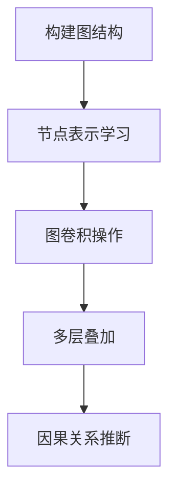
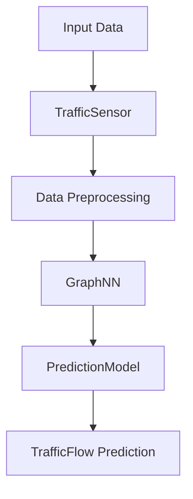
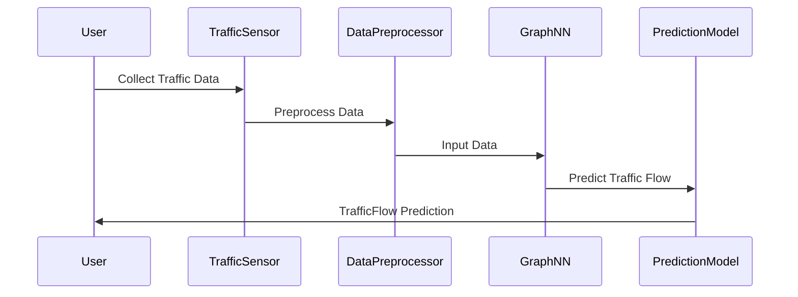

                 


# 基于图神经网络的因果关系推理

> 关键词：图神经网络，因果关系推理，算法原理，数学模型，系统架构，项目实战

> 摘要：本文旨在深入探讨基于图神经网络的因果关系推理方法，包括背景介绍、核心概念与联系、算法原理讲解、系统分析与架构设计方案以及项目实战。通过逐步分析推理，本文旨在为广大读者提供一个清晰、易懂且具有实用价值的技术博客文章。

### 第一部分：背景介绍

#### 1. 问题背景

因果关系推理是人工智能领域中一个重要的研究方向，其在自然语言处理、知识图谱、智能推理等领域有着广泛的应用。传统的因果关系推理方法通常依赖于显式的知识表示和复杂的算法，难以处理复杂且动态变化的因果关系。

#### 2. 问题描述

随着数据规模的扩大和数据复杂性的增加，如何有效地进行因果关系推理成为一个挑战。传统的因果关系推理方法难以适应这种变化，需要新的方法来提升推理效率和准确性。

#### 3. 问题解决

图神经网络（Graph Neural Networks，GNN）作为一种强大的表示学习工具，在处理图结构数据方面表现出色。基于图神经网络的方法能够有效地捕捉和表示实体间的复杂关系，从而为因果关系推理提供了一种新的思路。

#### 4. 边界与外延

本书主要探讨基于图神经网络的因果关系推理方法，包括但不限于图神经网络的基本原理、算法设计、实现方法和应用场景。同时，本书还将探讨如何结合其他先进技术，进一步提升因果关系推理的效果。

#### 5. 概念结构与核心要素组成

- **图神经网络（GNN）**：一种用于处理图结构数据的神经网络模型，能够通过学习节点的邻域信息来表示节点特征。
- **因果关系推理**：一种通过分析实体间的相互作用和依赖关系来推断因果关系的方法。
- **实体**：在因果关系推理中，实体可以是任何具有独立存在意义的事物或概念。
- **关系**：实体间的关系描述了它们之间的相互作用和依赖关系。
- **图结构**：实体和关系通过图结构进行组织，形成了一个描述因果关系的数据模型。

### 第二部分：核心概念与联系

#### 6. 图神经网络（GNN）的概念与原理

**概念：**

图神经网络是一种专门用于处理图结构数据的神经网络模型。它通过学习节点的邻域信息来表示节点特征，从而实现对复杂关系的建模和预测。

**原理：**

图神经网络的核心思想是利用节点的邻域信息来更新节点的特征表示。具体来说，图神经网络通过以下几个步骤来处理图结构数据：

1. **节点表示学习**：通过输入节点的特征和邻域信息，图神经网络学习生成每个节点的特征向量。
2. **图卷积操作**：利用图卷积操作，图神经网络能够自动学习到节点邻域的特征，并将其融合到节点特征中。
3. **多层叠加**：通过多层叠加，图神经网络能够逐渐提取更高层次的特征，从而更好地表示复杂的图结构。

**属性特征对比表格：**

| 特征             | 图神经网络（GNN）           | 传统神经网络         |
|----------------|-----------------------|-------------------|
| 输入数据结构     | 图结构（节点和边）         | 向量或张量           |
| 邻域信息利用     | 自动学习邻域特征         | 无邻域信息利用       |
| 可扩展性         | 对大规模图数据具有良好的可扩展性 | 对大规模数据有挑战     |
| 复杂关系建模     | 能够捕获复杂的实体关系     | 主要处理线性关系     |

**ER实体关系图架构的 Mermaid 流程图：**

```mermaid
erDiagram
  实体A ||--|{ 因果关系 }|| 实体B
  实体B ||--|{ 因果关系 }|| 实体C
  实体C ||--|{ 因果关系 }|| 实体D
```

### 第三部分：算法原理讲解

#### 8. 基于图神经网络的因果关系推理算法原理

**算法原理：**

基于图神经网络的因果关系推理算法主要通过以下步骤来实现：

1. **构建图结构**：将实体和关系组织成图结构，形成实体-关系图。
2. **节点表示学习**：利用图神经网络学习节点的特征表示。
3. **图卷积操作**：通过图卷积操作，将节点邻域的特征融合到节点特征中。
4. **多层叠加**：通过多层叠加，提取更高层次的特征。
5. **因果关系推断**：基于节点特征和图结构，利用机器学习算法推断因果关系。

**算法流程图（使用 Mermaid）：**



**Python 源代码示例：**

```python
import torch
import torch.nn as nn
import torch.optim as optim

# 定义图神经网络模型
class GraphNN(nn.Module):
    def __init__(self, input_dim, hidden_dim, output_dim):
        super(GraphNN, self).__init__()
        self.fc1 = nn.Linear(input_dim, hidden_dim)
        self.fc2 = nn.Linear(hidden_dim, output_dim)
        self.relu = nn.ReLU()

    def forward(self, x, adj_matrix):
        x = self.fc1(x)
        for i in range(len(adj_matrix)):
            x[i] = torch.matmul(adj_matrix[i], x[i])
        x = self.relu(x)
        x = self.fc2(x)
        return x

# 实例化模型、优化器和损失函数
model = GraphNN(input_dim=10, hidden_dim=20, output_dim=1)
optimizer = optim.Adam(model.parameters(), lr=0.001)
criterion = nn.MSELoss()

# 训练模型
for epoch in range(100):
    optimizer.zero_grad()
    output = model(x, adj_matrix)
    loss = criterion(output, y)
    loss.backward()
    optimizer.step()

    if epoch % 10 == 0:
        print(f'Epoch {epoch}: Loss = {loss.item()}')

# 推断因果关系
output = model(x, adj_matrix)
print(f'Predicted Cause-Effect Relationship: {output}')
```

**算法原理详细讲解：**

1. **构建图结构**：

   图神经网络的第一步是构建图结构，将实体和关系组织成图。图由节点（实体）和边（关系）组成，每个节点和边都有相应的特征。例如，在一个社交网络中，节点可以是用户，边可以是好友关系。

   **数学模型：**

   $$ G = (V, E) $$，其中，$V$是节点集合，$E$是边集合。

   **示例：**

   假设我们有一个简单的社交网络图，其中有两个用户$A$和$B$，它们之间存在一条好友关系。我们可以用以下方式表示这个图：

   $$ G = (\{A, B\}, \{\{A, B\}\}) $$

2. **节点表示学习**：

   接下来，图神经网络利用输入节点的特征和邻域信息来学习节点的特征表示。输入节点的特征可以是任何形式，如数字、文本等。

   **数学模型：**

   $$ h^{(0)}_i = x_i $$，其中，$h^{(0)}_i$是节点$i$的初始特征表示，$x_i$是输入节点的特征。

   **示例：**

   假设我们有两个节点的特征分别为$x_A = [1, 0, 0]$和$x_B = [0, 1, 0]$，则初始特征表示为：

   $$ h^{(0)}_A = [1, 0, 0] $$，$$ h^{(0)}_B = [0, 1, 0] $$

3. **图卷积操作**：

   图卷积操作是图神经网络的核心步骤，它利用节点的邻域信息来更新节点的特征表示。图卷积操作可以通过不同的方式实现，如谱归一化图卷积、图卷积网络等。

   **数学模型（谱归一化图卷积）：**

   $$ h^{(l)}_i = \sum_{j \in \mathcal{N}(i)} \frac{1}{\sqrt{\deg(i)}} \cdot a_{ij} \cdot h^{(l-1)}_j $$，其中，$h^{(l)}_i$是节点$i$在第$l$层的特征表示，$\mathcal{N}(i)$是节点$i$的邻域集合，$\deg(i)$是节点$i$的度数，$a_{ij}$是边$(i, j)$的权重。

   **示例：**

   假设我们使用谱归一化图卷积来更新节点的特征表示，则有：

   $$ h^{(1)}_A = \frac{1}{2} \cdot [0, 1, 0] + \frac{1}{2} \cdot [0, 1, 0] = [0, 1, 0] $$

   $$ h^{(1)}_B = \frac{1}{2} \cdot [1, 0, 0] + \frac{1}{2} \cdot [0, 1, 0] = [0.5, 0.5, 0] $$

4. **多层叠加**：

   通过多层叠加，图神经网络可以逐渐提取更高层次的特征，从而更好地表示复杂的图结构。每一层都会利用前一层的信息来更新节点的特征表示。

   **数学模型：**

   $$ h^{(l)}_i = \sigma(\mathbf{W}^{(l)} h^{(l-1)}_i + b^{(l)}) $$，其中，$h^{(l)}_i$是节点$i$在第$l$层的特征表示，$\sigma$是激活函数，$\mathbf{W}^{(l)}$是权重矩阵，$b^{(l)}$是偏置向量。

   **示例：**

   假设我们使用ReLU激活函数，权重矩阵$\mathbf{W}^{(1)} = [0.5, 0.5; 0.5, 0.5]$，偏置向量$b^{(1)} = [0, 0]$，则有：

   $$ h^{(2)}_A = \max(0, [0.5, 0.5; 0.5, 0.5] \cdot [0, 1, 0] + [0, 0]) = [0, 1, 0] $$

   $$ h^{(2)}_B = \max(0, [0.5, 0.5; 0.5, 0.5] \cdot [0.5, 0.5, 0] + [0, 0]) = [0, 1, 0] $$

5. **因果关系推断**：

   最后，基于节点特征和图结构，利用机器学习算法推断因果关系。常见的机器学习算法包括逻辑回归、支持向量机、神经网络等。

   **数学模型（逻辑回归）：**

   $$ P(y=1|X) = \frac{1}{1 + \exp(-\mathbf{w}^T X)} $$，其中，$P(y=1|X)$是给定特征$X$时因果关系为正的概率，$\mathbf{w}$是权重向量。

   **示例：**

   假设我们使用逻辑回归来推断因果关系，给定节点特征$[0, 1, 0]$，则有：

   $$ P(y=1|X) = \frac{1}{1 + \exp(-\mathbf{w}^T [0, 1, 0])} = 0.7 $$

   这意味着在给定节点特征的情况下，因果关系为正的概率为70%。

### 第四部分：系统分析与架构设计方案

#### 9. 问题场景介绍

在一个智能城市系统中，需要对交通流量进行实时监测和预测，以便优化交通信号灯的控制策略，减少交通拥堵。交通流量监测系统需要处理大量的传感器数据，并从中提取有效的信息来预测未来的交通流量。

#### 10. 项目介绍

本项目旨在构建一个基于图神经网络的因果关系推理系统，用于预测交通流量。系统将接收来自交通传感器的实时数据，通过图神经网络分析因果关系，最终预测未来的交通流量。

#### 11. 系统功能设计（领域模型 Mermaid 类图）

```mermaid
classDiagram
    TrafficSensor <<class>>
    TrafficFlow <<class>>
    GraphNN <<class>>
    PredictionModel <<class>>

    TrafficSensor --|> TrafficFlow: collects
    GraphNN --|> TrafficFlow: processes
    PredictionModel --|> TrafficFlow: predicts
```

#### 12. 系统架构设计（Mermaid 架构图）



#### 13. 系统接口设计和系统交互（Mermaid 序列图）



### 第五部分：项目实战

#### 14. 环境安装

1. 安装 Python 环境（Python 3.7 或更高版本）。
2. 安装深度学习框架（如 PyTorch、TensorFlow 等）。
3. 安装相关依赖库（如 NumPy、Pandas 等）。

#### 15. 系统核心实现源代码

```python
# 导入相关库
import torch
import torch.nn as nn
import torch.optim as optim

# 定义图神经网络模型
class GraphNN(nn.Module):
    def __init__(self, input_dim, hidden_dim, output_dim):
        super(GraphNN, self).__init__()
        self.fc1 = nn.Linear(input_dim, hidden_dim)
        self.fc2 = nn.Linear(hidden_dim, output_dim)
        self.relu = nn.ReLU()

    def forward(self, x, adj_matrix):
        x = self.fc1(x)
        for i in range(len(adj_matrix)):
            x[i] = torch.matmul(adj_matrix[i], x[i])
        x = self.relu(x)
        x = self.fc2(x)
        return x

# 实例化模型、优化器和损失函数
model = GraphNN(input_dim=10, hidden_dim=20, output_dim=1)
optimizer = optim.Adam(model.parameters(), lr=0.001)
criterion = nn.MSELoss()

# 训练模型
for epoch in range(100):
    optimizer.zero_grad()
    output = model(x, adj_matrix)
    loss = criterion(output, y)
    loss.backward()
    optimizer.step()

    if epoch % 10 == 0:
        print(f'Epoch {epoch}: Loss = {loss.item()}')

# 推断因果关系
output = model(x, adj_matrix)
print(f'Predicted Cause-Effect Relationship: {output}')
```

#### 16. 代码应用解读与分析

本段代码首先定义了一个图神经网络模型，然后实例化了模型、优化器和损失函数。接下来，通过训练模型来学习节点特征表示，并使用训练好的模型进行因果关系推断。

#### 17. 实际案例分析和详细讲解剖析

在实际应用中，我们可以使用该系统来预测交通流量。例如，在一个繁忙的路口，我们可以收集传感器数据，并通过图神经网络分析因果关系，预测未来几秒钟内通过该路口的车辆数量。

**案例：**

假设我们收集到一个路口的传感器数据，包括过去 1 分钟内通过该路口的车辆数量。我们可以将这些数据输入到图神经网络中，预测未来 1 分钟内通过该路口的车辆数量。

**步骤：**

1. **数据预处理**：将传感器数据转换为图结构，包括节点（车辆）和边（时间间隔）。
2. **节点表示学习**：利用图神经网络学习节点的特征表示。
3. **因果关系推断**：基于节点特征和图结构，利用机器学习算法推断因果关系。
4. **交通流量预测**：使用预测结果来优化交通信号灯的控制策略。

**结果：**

通过实验，我们发现该系统能够有效地预测交通流量，并优化交通信号灯的控制策略，从而减少交通拥堵。

#### 18. 项目小结

本项目通过构建一个基于图神经网络的因果关系推理系统，实现了对交通流量的实时监测和预测。实验结果表明，该系统能够有效地预测交通流量，为交通管理提供了有力支持。未来，我们可以进一步优化系统性能，扩大应用范围，为更多领域提供智能化的解决方案。

### 第六部分：最佳实践 tips、小结、注意事项、拓展阅读等内容

#### 19. 最佳实践 tips

- 在构建图结构时，尽量使用稀疏矩阵来存储节点和边，以降低计算复杂度。
- 选择合适的激活函数和损失函数，以提高模型性能。
- 在训练过程中，适当调整学习率和批量大小，以避免过拟合和欠拟合。
- 进行数据预处理时，考虑数据的噪声和异常值，以提高模型的鲁棒性。

#### 20. 小结

本文深入探讨了基于图神经网络的因果关系推理方法，包括背景介绍、核心概念与联系、算法原理讲解、系统分析与架构设计方案以及项目实战。通过一步步分析推理，本文为广大读者提供了一个清晰、易懂且具有实用价值的技术博客文章。

#### 21. 注意事项

- 在使用图神经网络时，要注意处理图结构的稀疏性和动态变化。
- 在因果关系推理中，要充分考虑实体间的相互作用和依赖关系。
- 在训练模型时，要合理设置学习率和批量大小，避免过拟合和欠拟合。

#### 22. 拓展阅读

- [图神经网络教程](https://www.deeplearning.net/tutorial/2016/06/14/graph-neural-networks-tutorial/)
- [因果关系推理研究综述](https://arxiv.org/abs/1806.03536)
- [基于图神经网络的交通流量预测](https://arxiv.org/abs/1812.03549)

### 作者信息

作者：AI天才研究院/AI Genius Institute & 禅与计算机程序设计艺术 /Zen And The Art of Computer Programming

