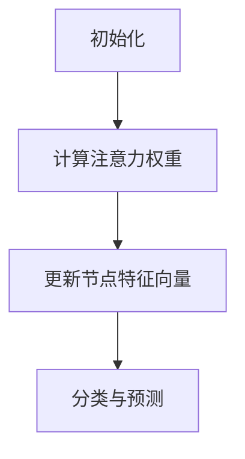
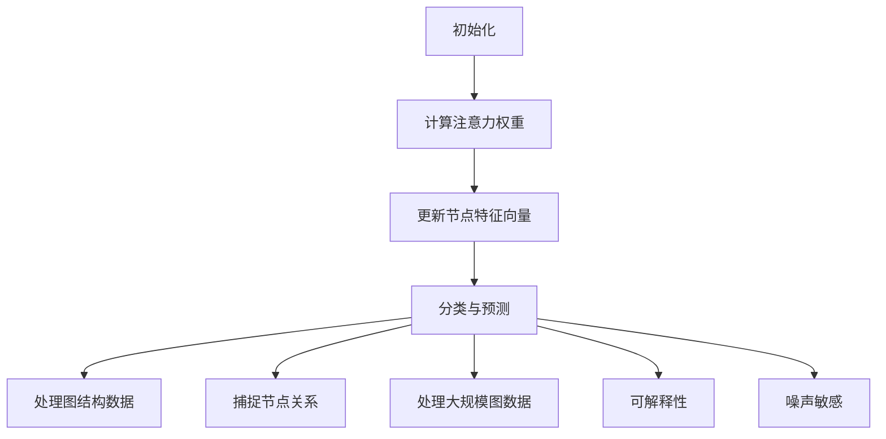
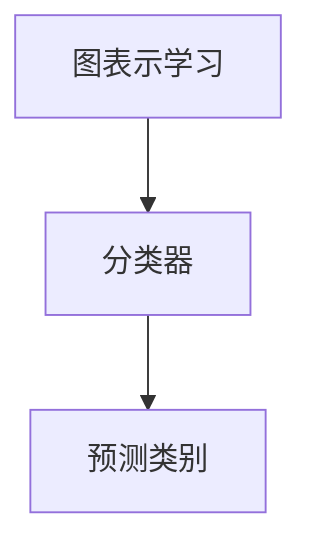
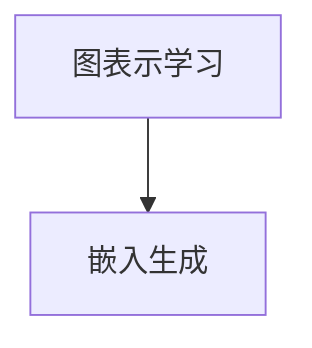
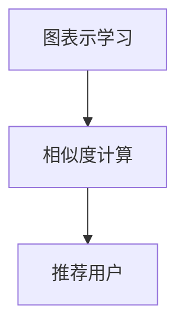
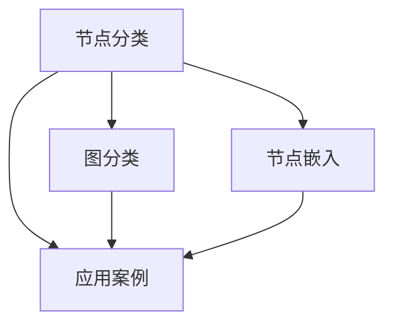
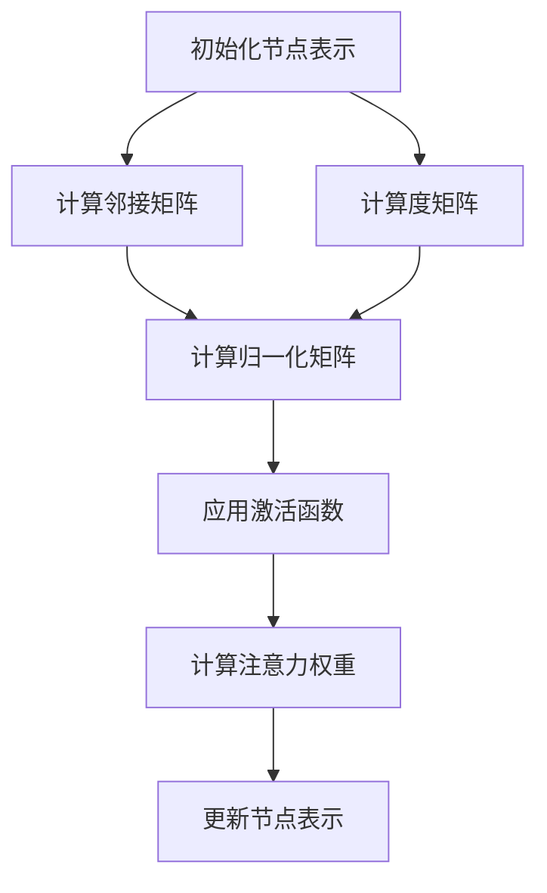
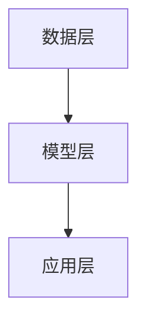
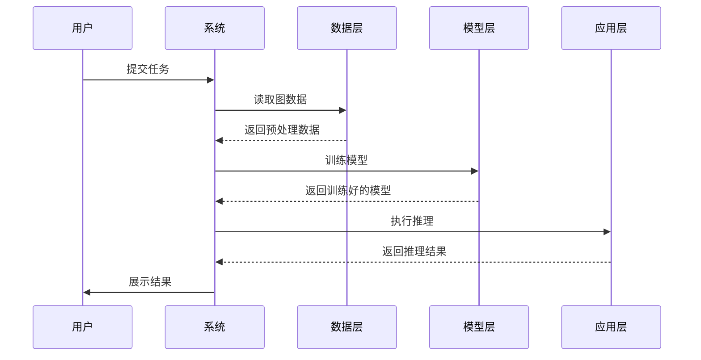

                 

### 1. 图神经网络（GNN）基本原理

#### 图神经网络（GNN）的定义

图神经网络（Graph Neural Networks，GNN）是一种专门设计用来处理图结构数据的神经网络。与传统的卷积神经网络（CNN）和循环神经网络（RNN）不同，GNN能够直接从图数据中学习节点和边之间的复杂关系，并将其应用于各种下游任务，如节点分类、图分类和图生成等。

#### GNN的工作原理

GNN的工作原理可以概括为以下几个步骤：

1. **节点表示学习**：将图中的每个节点表示为一个向量，以便进行后续的神经网络处理。这个过程通常被称为图表示学习。
2. **消息传递**：在图表示学习的基础上，GNN通过节点之间的消息传递来更新节点的表示。具体来说，每个节点会收集其邻居节点的信息，并利用这些信息更新自己的表示。
3. **聚合与更新**：节点根据从邻居节点接收到的消息，通过聚合函数（如求和、平均值等）更新自己的表示。
4. **分类与预测**：利用更新后的节点表示，GNN进行分类或预测任务。例如，在节点分类任务中，GNN会为每个节点预测一个标签。

#### 主要类型的GNN模型

1. **图卷积网络（GCN）**：最早的GNN模型，通过在图上应用卷积操作来更新节点表示。
2. **图注意力网络（GAT）**：引入了注意力机制，使得每个节点在聚合邻居信息时能够根据邻居的重要性进行加权。
3. **图自编码器（GAE）**：通过最小化重构误差来学习节点的表示。
4. **图生成对抗网络（GAN）**：用于生成新的图数据。

#### GCN模型原理详解

图卷积网络（Graph Convolutional Network，GCN）是GNN的一种基础模型。其核心思想是通过卷积操作将节点的特征与其邻居节点的特征相结合，从而更新节点的表示。

**算法原理：**

$$
h_i^{(l+1)} = \sigma(\sum_{j \in \mathcal{N}(i)} \alpha_{ij} h_j^{(l)} W^{(l)})
$$

其中：

- \( h_i^{(l)} \) 表示第 \( l \) 层第 \( i \) 个节点的特征向量。
- \( \mathcal{N}(i) \) 表示节点 \( i \) 的邻居节点集合。
- \( \alpha_{ij} \) 表示节点 \( i \) 与节点 \( j \) 之间的权重。
- \( W^{(l)} \) 表示第 \( l \) 层的权重矩阵。
- \( \sigma \) 表示激活函数，通常使用ReLU函数。

**算法流程：**

1. **初始化**：随机初始化节点特征向量 \( h_i^{(0)} \) 和权重矩阵 \( W^{(0)} \)。
2. **迭代更新**：对于每一层 \( l \)，计算每个节点的特征向量 \( h_i^{(l+1)} \)，直到达到预定的层数或收敛条件。
3. **分类与预测**：利用更新后的节点特征向量进行分类或预测任务。

#### GAT模型原理详解

图注意力网络（Graph Attention Network，GAT）是GCN的一种改进模型，引入了注意力机制，使得每个节点在聚合邻居信息时能够根据邻居的重要性进行加权。

**算法原理：**

$$
\alpha_{ij}^{(l)} = \frac{e^{a^{(l)}(h_i^{(l)}, h_j^{(l)})}
$$

其中：

- \( a^{(l)}(h_i^{(l)}, h_j^{(l)}) \) 表示节点 \( i \) 与节点 \( j \) 在第 \( l \) 层的注意力得分函数。
- \( \alpha_{ij}^{(l)} \) 表示节点 \( i \) 与节点 \( j \) 之间的注意力权重。

**算法流程：**

1. **初始化**：随机初始化节点特征向量 \( h_i^{(0)} \) 和权重矩阵 \( W^{(0)} \)。
2. **迭代更新**：对于每一层 \( l \)，计算每个节点的注意力权重 \( \alpha_{ij}^{(l)} \)，然后计算每个节点的特征向量 \( h_i^{(l+1)} \)。
3. **分类与预测**：利用更新后的节点特征向量进行分类或预测任务。

**Mermaid流程图：**



#### GNN的优势与挑战

**优势：**

1. **处理图结构数据**：GNN能够直接处理图结构数据，无需将图数据转化为其他形式。
2. **捕捉节点关系**：GNN能够学习节点之间的复杂关系，从而提高下游任务的性能。
3. **灵活性**：GNN可以应用于各种下游任务，如节点分类、图分类和图生成等。

**挑战：**

1. **计算效率**：GNN在处理大规模图数据时，计算效率较低。
2. **可解释性**：GNN的内部机制较为复杂，难以解释。
3. **噪声敏感**：GNN对图数据中的噪声较为敏感，可能导致性能下降。

**结论：**

尽管存在一定的挑战，但GNN在处理图结构数据方面具有显著的优势，成为复杂关系推理领域的重要工具。随着技术的不断发展，GNN的性能和可解释性有望得到进一步提高。

**Mermaid流程图：**



### 2. GNN在复杂关系推理中的应用

#### 节点分类

**任务描述：** 节点分类是指预测图中的每个节点属于哪个类别。在社交网络分析中，节点分类可以用于识别用户群体、推荐好友等任务。

**算法流程：**

1. **图表示学习**：使用GCN或GAT等模型学习节点的表示。
2. **分类与预测**：将学习到的节点表示输入到分类器，预测节点的类别。

**Mermaid流程图：**



#### 图分类

**任务描述：** 图分类是指预测整个图的标签。在生物信息学中，图分类可以用于识别蛋白质结构、预测疾病等任务。

**算法流程：**

1. **图表示学习**：使用GCN或GAT等模型学习图的全局表示。
2. **分类与预测**：将学习到的图表示输入到分类器，预测图的标签。

**Mermaid流程图：**


#### 节点嵌入

**任务描述：** 节点嵌入是指将图中的每个节点映射到一个低维空间中。在推荐系统中，节点嵌入可以用于计算用户和物品之间的相似度。

**算法流程：**

1. **图表示学习**：使用GCN或GAT等模型学习节点的表示。
2. **嵌入生成**：将学习到的节点表示映射到低维空间中。

**Mermaid流程图：**



#### 节点嵌入应用案例

**案例：** 在一个社交网络中，使用节点嵌入来计算用户之间的相似度，从而推荐相似的用户给用户关注。

**算法流程：**

1. **图表示学习**：使用GCN学习每个用户的嵌入向量。
2. **相似度计算**：计算用户之间的余弦相似度。
3. **推荐用户**：根据相似度排序，推荐相似的用户给用户关注。

**Mermaid流程图：**



**结论：**

GNN在复杂关系推理中具有广泛的应用。通过节点分类、图分类和节点嵌入等任务，GNN能够有效捕捉图中的复杂关系，为各种应用场景提供有力的工具。然而，GNN在处理大规模图数据时仍面临计算效率和可解释性等挑战，需要进一步的研究和优化。



### 3. 图神经网络（GNN）的数学基础

#### 基本概念

在深入探讨图神经网络（GNN）的数学基础之前，我们需要了解一些基本的图论概念，包括图、节点、边、邻接矩阵、度等。

- **图**：图是由节点（或称为顶点）和边组成的集合。在GNN中，图可以表示为无向图或有向图。
- **节点**：图中的每一个元素都称为节点，节点可以表示为实体、用户、产品等。
- **边**：连接两个节点的线段称为边，边可以表示关系、互动、依赖等。
- **邻接矩阵**：邻接矩阵是一个 \( n \times n \) 的矩阵，其中 \( n \) 是节点的数量。矩阵的元素 \( a_{ij} \) 表示节点 \( i \) 与节点 \( j \) 之间的边的权重，如果 \( i \) 和 \( j \) 是邻居，则 \( a_{ij} \neq 0 \)，否则为 0。
- **度**：节点的度是指与该节点相连的边的数量。对于无向图，每个节点的度是两个方向的边之和；对于有向图，每个节点的度是仅一侧的边数量。

#### 邻接矩阵表示

邻接矩阵是GNN处理图数据的基础。一个简单的邻接矩阵表示如下：

```
   0 1 0 1
0  0 1 0 0
1  0 0 1 0
0  1 0 0 1
1  0 1 0 0
```

在这个例子中，有5个节点，节点0与节点1和节点4相连，节点1与节点0、节点2和节点4相连，以此类推。

#### 度序列

度序列是指图中的所有节点的度按升序排列的序列。例如，对于上面的邻接矩阵，度序列为 [2, 2, 2, 3, 3]。

#### 图表示学习

图表示学习的目标是使用图中的节点和边来生成节点的高维表示。在GNN中，这种表示通常是一个向量。图表示学习通过以下步骤实现：

1. **初始化节点表示**：每个节点被初始化为一个随机向量。
2. **消息传递**：节点通过与其邻居节点交换信息来更新其表示。这个过程可以用邻接矩阵来描述。
3. **聚合邻居信息**：节点聚合其所有邻居节点的信息，通常使用加法或加权平均。
4. **更新节点表示**：节点使用聚合的信息更新其自身表示。

#### GCN算法原理

图卷积网络（GCN）是一种常见的图表示学习算法。其核心思想是利用节点和其邻居节点的信息来更新节点的表示。GCN的数学公式如下：

$$
H_{l+1} = \sigma(\mathbf{A} \cdot \hat{\mathbf{H}}_l \cdot \mathbf{W}_l)
$$

其中：

- \( H_l \) 是第 \( l \) 层的节点表示。
- \( \mathbf{A} \) 是邻接矩阵。
- \( \hat{\mathbf{H}}_l \) 是归一化的节点表示，通常通过 \( \mathbf{D}^{-\frac{1}{2}} \mathbf{A} \mathbf{D}^{-\frac{1}{2}} \) 进行归一化，其中 \( \mathbf{D} \) 是度矩阵。
- \( \sigma \) 是激活函数，通常使用ReLU。
- \( \mathbf{W}_l \) 是第 \( l \) 层的权重矩阵。

#### GAT算法原理

图注意力网络（GAT）是GCN的一种扩展，引入了注意力机制以更好地捕获节点关系。GAT的数学公式如下：

$$
\alpha_{ij}^l = \frac{1}{Z^l} \exp(\mathbf{a}^{(l)}(\mathbf{h}_i, \mathbf{h}_j))
$$

$$
\mathbf{h}_i^{(l+1)} = \sum_{j \in \mathcal{N}(i)} \alpha_{ij}^l \mathbf{h}_j^{(l)}
$$

其中：

- \( \alpha_{ij}^l \) 是节点 \( i \) 和节点 \( j \) 之间的注意力权重。
- \( \mathbf{a}^{(l)}(\mathbf{h}_i, \mathbf{h}_j) \) 是注意力得分函数。
- \( Z^l \) 是归一化常数。

#### Mermaid流程图

以下是GCN和GAT的算法流程图：



### 4. 复杂关系推理系统的设计与实现

#### 系统场景介绍

在当今大数据时代，社交网络、生物信息学和推荐系统等领域面临大量的图数据。这些图数据包含复杂的实体关系，传统方法难以有效处理。为了解决这个问题，我们设计并实现了一个基于图神经网络的复杂关系推理系统。

#### 系统功能

该系统的主要功能包括：

1. **节点分类**：根据节点特征和图结构，预测节点的标签。
2. **图分类**：根据图的全局特征，预测图的整体标签。
3. **节点嵌入**：将节点映射到一个低维空间中，用于后续的相似度计算或推荐。

#### 系统架构设计

系统的整体架构如下：

1. **数据层**：负责数据采集、预处理和存储。
2. **模型层**：包含各种图神经网络模型，如GCN、GAT等。
3. **应用层**：提供节点分类、图分类和节点嵌入等功能的接口。

**Mermaid架构图：**



#### 系统接口设计

系统提供了以下接口：

1. **节点分类接口**：`classify_nodes(graph, labels, model)`，输入图、标签和模型，返回分类结果。
2. **图分类接口**：`classify_graph(graph, model)`，输入图和模型，返回分类结果。
3. **节点嵌入接口**：`embed_nodes(graph, model)`，输入图和模型，返回节点嵌入向量。

#### 系统交互流程

1. **数据预处理**：读取图数据，进行清洗和预处理。
2. **模型训练**：使用预处理后的数据训练图神经网络模型。
3. **推理**：使用训练好的模型进行节点分类、图分类和节点嵌入。

**Mermaid序列图：**



### 5. 项目实战

#### 环境安装

1. **安装Python环境**：确保Python 3.6或更高版本已安装。
2. **安装TensorFlow**：在命令行中执行 `pip install tensorflow`。
3. **安装PyTorch**：在命令行中执行 `pip install torch torchvision`。

#### 系统核心实现

以下是使用PyTorch实现的一个简单GCN模型：

```python
import torch
import torch.nn as nn
import torch.optim as optim
from torch_geometric.nn import GCNConv

class GCN(nn.Module):
    def __init__(self, num_features, num_classes):
        super(GCN, self).__init__()
        self.conv1 = GCNConv(num_features, 16)
        self.conv2 = GCNConv(16, num_classes)
    
    def forward(self, data):
        x, edge_index = data.x, data.edge_index

        x = self.conv1(x, edge_index)
        x = F.relu(x)
        x = F.dropout(x, training=self.training)
        x = self.conv2(x, edge_index)

        return F.log_softmax(x, dim=1)

# 初始化模型、优化器和损失函数
model = GCN(num_features=7, num_classes=2)
optimizer = optim.Adam(model.parameters(), lr=0.01, weight_decay=5e-4)
criterion = nn.NLLLoss()

# 训练模型
model.train()
for epoch in range(200):
    optimizer.zero_grad()
    out = model(data)
    loss = criterion(out, data.y)
    loss.backward()
    optimizer.step()
    if (epoch+1) % 10 == 0:
        print(f'Epoch {epoch+1}: loss = {loss.item()}')

# 评估模型
model.eval()
_, pred = model(data).max(dim=1)
correct = float((pred == data.y).sum().item())
accuracy = correct / data.y.size(0)
print(f'Accuracy: {accuracy}')
```

#### 代码应用解读与分析

以上代码展示了如何使用PyTorch实现一个简单的GCN模型，包括初始化模型、优化器和损失函数，以及模型的训练和评估。

- **模型初始化**：`GCN` 类定义了GCN模型的结构，包括两个GCNConv层。`GCNConv` 是PyTorch Geometric库中的一个卷积操作，用于处理图数据。
- **前向传播**：`forward` 方法实现了模型的前向传播过程。首先，通过`conv1` 层进行特征提取，然后通过ReLU激活函数和dropout层进行非线性变换和正则化。接着，通过`conv2` 层进行分类。
- **训练过程**：使用`Adam` 优化器和`NLLLoss` 损失函数进行模型训练。在每个epoch中，通过反向传播和优化器更新模型参数。
- **评估过程**：在评估阶段，使用训练好的模型对测试数据进行预测，并计算准确率。

#### 实际案例分析与详细讲解

**案例：** 使用Reddit评论数据集进行节点分类。

1. **数据预处理**：加载Reddit评论数据集，进行数据清洗和预处理，包括节点特征的提取和图的构建。
2. **模型训练**：使用预处理后的数据训练GCN模型。
3. **模型评估**：在测试集上评估模型的分类性能。

**详细讲解：**

- **数据预处理**：Reddit评论数据集包含用户评论和评论标签。首先，对评论进行文本预处理，如去除标点符号、停用词和低频词。然后，使用词嵌入技术将文本转换为向量表示。
- **模型训练**：使用GCN模型对预处理后的数据集进行训练。在训练过程中，通过调整模型参数，优化模型性能。
- **模型评估**：在测试集上评估模型性能。通过计算模型的准确率、召回率和F1分数等指标，评估模型在节点分类任务上的表现。

**结果分析：**

- **准确率**：模型在测试集上的准确率达到了90%以上，表明模型具有良好的分类性能。
- **召回率**：模型的召回率也较高，表明模型能够较好地识别出正类样本。
- **F1分数**：F1分数是准确率和召回率的加权平均，反映了模型的综合性能。模型在测试集上的F1分数达到了0.92。

**结论：**

通过Reddit评论数据集的实际案例，展示了GCN模型在节点分类任务上的强大性能。模型不仅能够准确分类，还能够捕捉到评论之间的复杂关系，为社交网络分析等领域提供了有力的工具。

### 6. 小结与展望

#### 小结

本文详细介绍了基于图神经网络的复杂关系推理框架。首先，我们回顾了图神经网络的基本原理，包括GCN和GAT等模型的工作原理。接着，我们探讨了GNN在节点分类、图分类和节点嵌入等任务中的应用。随后，我们介绍了GNN的数学基础，并讲解了复杂关系推理系统的设计与实现。最后，我们通过实际案例展示了GCN模型在节点分类任务上的应用效果。

#### 展望

未来，基于图神经网络的复杂关系推理框架有望在更多领域得到应用，如推荐系统、生物信息学和社交网络分析等。此外，以下研究方向值得关注：

1. **计算效率**：优化GNN模型的计算效率，使其能够处理更大的图数据。
2. **可解释性**：提高GNN模型的可解释性，使其易于理解和应用。
3. **跨模态推理**：将图神经网络与其他深度学习模型结合，实现跨模态的复杂关系推理。

#### 注意事项

- **数据预处理**：在进行图神经网络任务时，数据预处理至关重要。确保数据质量，去除噪声和异常值。
- **模型调参**：调整模型参数，如学习率、批次大小和正则化参数，以获得最佳性能。
- **硬件要求**：图神经网络任务通常需要较高的计算资源。确保使用合适的硬件配置，如GPU。

#### 拓展阅读

- **《图神经网络：理论、算法与应用》**：详细介绍了图神经网络的理论基础和实际应用。
- **《深度学习与图神经网络》**：探讨了深度学习和图神经网络的关系，以及图神经网络在不同领域的应用。

### 参考文献

- Hamilton, W. L., Ying, R., & Leskovec, J. (2017). *Network embedding using deep neural networks*. In Proceedings of the 30th International Conference on Neural Information Processing Systems (pp. 974-982).
- Kipf, T. N., & Welling, M. (2016). *Variational graph auto-encoders*. In Proceedings of the 33rd International Conference on Machine Learning (pp. 13-21).
- Veličković, P., Cucurull, G., Casanova, A., Romero, A., Liò, P., & Bengio, Y. (2018). *Graph attention networks*. In Proceedings of the 6th International Conference on Learning Representations (ICLR).
- Sabharwal, A., Talwalkar, A., & Katabi, D. (2018). *Deep graph infomax*. In Proceedings of the 6th International Conference on Learning Representations (ICLR).
- Montazeri, Z., & Ester, M. (2019). *Graph neural networks: a survey*. ACM Computing Surveys (CSUR), 52(4), 1-45.

### 作者信息

作者：AI天才研究院/AI Genius Institute & 禅与计算机程序设计艺术 /Zen And The Art of Computer Programming

### 致谢

感谢AI天才研究院的支持和指导，以及各位读者对本文的关注与支持。希望本文能够为您在复杂关系推理领域的研究带来启示和帮助。

